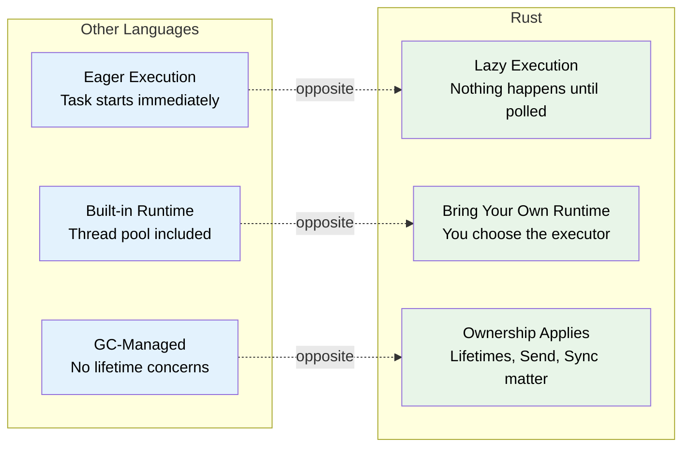
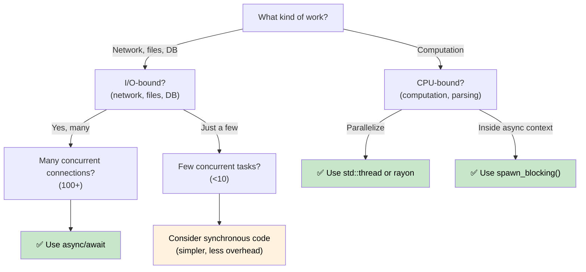

# 1. Why Async is Different in Rust 🟢<br><span class="zh-inline">1. 为什么 Rust 的 async 和别家不一样 🟢</span>

> **What you'll learn:**<br><span class="zh-inline">**本章将学到什么：**</span>
> - Why Rust has no built-in async runtime (and what that means for you)<br><span class="zh-inline">为什么 Rust 没有内建 async 运行时，以及这件事对实际开发意味着什么</span>
> - The three key properties: lazy execution, no runtime, zero-cost abstraction<br><span class="zh-inline">三个关键特征：惰性执行、无内建运行时、零成本抽象</span>
> - When async is the right tool (and when it's slower)<br><span class="zh-inline">什么时候该用 async，什么时候反而会更慢</span>
> - How Rust's model compares to C#, Go, Python, and JavaScript<br><span class="zh-inline">Rust 的模型和 C#、Go、Python、JavaScript 相比到底差在哪</span>

## The Fundamental Difference<br><span class="zh-inline">根本差异</span>

Most languages with `async/await` hide the machinery. C# has the CLR thread pool. JavaScript has the event loop. Go has goroutines and a scheduler built into the runtime. Python has `asyncio`.<br><span class="zh-inline">大多数带 `async/await` 的语言，都会把背后的 machinery 藏起来。C# 有 CLR 线程池，JavaScript 有 event loop，Go 有 goroutine 和内建调度器，Python 有 `asyncio`。</span>

**Rust has nothing.**<br><span class="zh-inline">**Rust 默认什么都不送。**</span>

There is no built-in runtime, no thread pool, no event loop. The `async` keyword is a zero-cost compilation strategy — it transforms your function into a state machine that implements the `Future` trait. Someone else (an *executor*) must drive that state machine forward.<br><span class="zh-inline">Rust 没有内建运行时、没有默认线程池、也没有偷偷躲在背后的事件循环。`async` 关键字本质上是一种零成本编译策略，它会把函数改写成实现了 `Future` trait 的状态机。真正推动这个状态机往前跑的，必须是外部执行器，也就是 *executor*。</span>

### Three Key Properties of Rust Async<br><span class="zh-inline">Rust async 的三个核心特征</span>



这三点是理解 Rust async 的地基：它是惰性的，不自带调度环境，而且所有权、生命周期、`Send`、`Sync` 这些规则会原封不动压到 async 世界里。<br><span class="zh-inline">如果脑子里还带着 “`async` 一写，任务就自动跑起来了” 这种别家语言的惯性，到了 Rust 这边很容易一头撞墙。</span>

### No Built-In Runtime<br><span class="zh-inline">没有内建运行时</span>

```rust
// This compiles but does NOTHING:
async fn fetch_data() -> String {
    "hello".to_string()
}

fn main() {
    let future = fetch_data(); // Creates the Future, but doesn't execute it
    // future is just a struct sitting on the stack
    // No output, no side effects, nothing happens
    drop(future); // Silently dropped — work was never started
}
```

这段代码能编译，但什么也不会发生。`fetch_data()` 被调用时，只是生成了一个 future 对象，它安安静静躺在栈上，等着别人来 `poll`。如果没人管它，丢掉就结束了。<br><span class="zh-inline">这点对于从 C# 或 JavaScript 过来的人尤其容易搞混，因为那边一创建 task 或 promise，通常就已经开跑了。</span>

Compare with C# where `Task` starts eagerly:<br><span class="zh-inline">对比 C#，`Task` 是急切执行的：</span>

```csharp
// C# — this immediately starts executing:
async Task<string> FetchData() => "hello";

var task = FetchData(); // Already running!
var result = await task; // Just waits for completion
```

### Lazy Futures vs Eager Tasks<br><span class="zh-inline">惰性 Future 与急切 Task</span>

This is the single most important mental shift:<br><span class="zh-inline">这是最关键的一次思维切换：</span>

| | C# / JavaScript / Python | Go | Rust |
|---|---|---|---|
| **Creation**<br><span class="zh-inline">创建时</span> | `Task` starts executing immediately<br><span class="zh-inline">`Task` 会立刻开始执行</span> | Goroutine starts immediately<br><span class="zh-inline">goroutine 立刻启动</span> | `Future` does nothing until polled<br><span class="zh-inline">`Future` 在被 `poll` 前什么都不做</span> |
| **Dropping**<br><span class="zh-inline">被丢弃时</span> | Detached task continues running<br><span class="zh-inline">脱离引用后往往还会继续跑</span> | Goroutine runs until return<br><span class="zh-inline">goroutine 会一直跑到返回</span> | Dropping a Future cancels it<br><span class="zh-inline">future 一旦被丢弃，就等于取消</span> |
| **Runtime**<br><span class="zh-inline">运行时</span> | Built into the language/VM<br><span class="zh-inline">语言或 VM 自带</span> | Built into the binary (M:N scheduler)<br><span class="zh-inline">二进制里自带调度器</span> | You choose (tokio, smol, etc.)<br><span class="zh-inline">由使用者自己选，例如 Tokio、smol</span> |
| **Scheduling**<br><span class="zh-inline">调度</span> | Automatic (thread pool)<br><span class="zh-inline">自动调度</span> | Automatic (GMP scheduler)<br><span class="zh-inline">自动调度</span> | Explicit (`spawn`, `block_on`)<br><span class="zh-inline">显式触发，例如 `spawn`、`block_on`</span> |
| **Cancellation**<br><span class="zh-inline">取消</span> | `CancellationToken` (cooperative)<br><span class="zh-inline">`CancellationToken` 协作式取消</span> | `context.Context` (cooperative)<br><span class="zh-inline">`context.Context` 协作式取消</span> | Drop the future (immediate)<br><span class="zh-inline">直接丢弃 future</span> |

```rust
// To actually RUN a future, you need an executor:
#[tokio::main]
async fn main() {
    let result = fetch_data().await; // NOW it executes
    println!("{result}");
}
```

所以 Rust async 里最容易踩空的一点，就是把“创建 future”和“执行 future”混为一谈。前者只是在组装工作单，后者才是真正开始干活。<br><span class="zh-inline">这也是为什么 Rust 很强调 executor、`spawn`、`block_on` 这些词。没有它们，future 只是一个静态对象，不会自己动。</span>

### When to Use Async (and When Not To)<br><span class="zh-inline">什么时候该用 async，什么时候别硬上</span>



**Rule of thumb**: Async is for I/O concurrency (doing many things at once while waiting), not CPU parallelism (making one thing faster). If you have 10,000 network connections, async shines. If you're crunching numbers, use `rayon` or OS threads.<br><span class="zh-inline">**经验法则：** async 适合处理 I/O 并发，也就是“一边等网络、文件、数据库，一边把别的事情先做掉”；它并不是拿来给 CPU 密集计算提速的。如果有 1 万个网络连接，async 很亮眼；如果是在死命算数，优先考虑 `rayon` 或系统线程。</span>

### When Async Can Be *Slower*<br><span class="zh-inline">什么时候 async 反而更慢</span>

Async isn't free. For low-concurrency workloads, synchronous code can outperform async:<br><span class="zh-inline">async 从来不是免费的。并发量不高时，同步代码完全可能比 async 更快：</span>

| Cost<br><span class="zh-inline">代价</span> | Why<br><span class="zh-inline">原因</span> |
|------|-----|
| **State machine overhead**<br><span class="zh-inline">状态机开销</span> | Each `.await` adds an enum variant; deeply nested futures produce large, complex state machines<br><span class="zh-inline">每个 `.await` 都会引入新的状态变体，future 嵌套深了，状态机就会变大变复杂</span> |
| **Dynamic dispatch**<br><span class="zh-inline">动态分发</span> | `Box<dyn Future>` adds indirection and kills inlining<br><span class="zh-inline">`Box<dyn Future>` 会带来额外间接层，还会影响内联</span> |
| **Context switching**<br><span class="zh-inline">上下文切换</span> | Cooperative scheduling still has cost — the executor must manage a task queue, wakers, and I/O registrations<br><span class="zh-inline">协作式调度照样有管理成本，执行器要维护任务队列、waker 和 I/O 注册</span> |
| **Compile time**<br><span class="zh-inline">编译时间</span> | Async code generates more complex types, slowing down compilation<br><span class="zh-inline">async 代码会生成更复杂的类型，编译速度也会跟着受影响</span> |
| **Debuggability**<br><span class="zh-inline">调试可读性</span> | Stack traces through state machines are harder to read (see Ch. 12)<br><span class="zh-inline">状态机展开后的调用栈更难看懂，调试体验通常更拧巴</span> |

**Benchmarking guidance**: If fewer than ~10 concurrent I/O operations, profile before committing to async. A simple `std::thread::spawn` per connection scales fine to hundreds of threads on modern Linux.<br><span class="zh-inline">**基准建议：** 如果并发 I/O 数量不到十来个，先测再说，别急着全盘 async 化。现代 Linux 上，一连接一线程在几百线程级别都未必是问题。</span>

### Exercise: When Would You Use Async?<br><span class="zh-inline">练习：什么时候会选 async？</span>

<details>
<summary>🏋️ Exercise <span class="zh-inline">🏋️ 练习</span></summary>

For each scenario, decide whether async is appropriate and explain why:<br><span class="zh-inline">针对下面几个场景，判断 async 是否合适，并说明原因：</span>

1. A web server handling 10,000 concurrent WebSocket connections<br><span class="zh-inline">1. 一个要同时处理 1 万个 WebSocket 连接的 Web 服务。</span>
2. A CLI tool that compresses a single large file<br><span class="zh-inline">2. 一个压缩单个大文件的命令行工具。</span>
3. A service that queries 5 different databases and merges results<br><span class="zh-inline">3. 一个同时查询 5 个数据库并合并结果的服务。</span>
4. A game engine running a physics simulation at 60 FPS<br><span class="zh-inline">4. 一个以 60 FPS 跑物理模拟的游戏引擎。</span>

<details>
<summary>🔑 Solution <span class="zh-inline">🔑 参考答案</span></summary>

1. **Async** — I/O-bound with massive concurrency. Each connection spends most time waiting for data. Threads would require 10K stacks.<br><span class="zh-inline">1. **适合 async**：典型 I/O 密集且并发量巨大。每个连接大部分时间都在等数据，线程模型会额外背上 1 万个栈空间。</span>
2. **Sync/threads** — CPU-bound, single task. Async adds overhead with no benefit. Use `rayon` for parallel compression.<br><span class="zh-inline">2. **更适合同步或线程**：这是 CPU 密集、单任务型工作，async 只会多一层开销，没啥收益。真要并行压缩，用 `rayon` 更靠谱。</span>
3. **Async** — Five concurrent I/O waits. `tokio::join!` runs all five queries simultaneously.<br><span class="zh-inline">3. **适合 async**：这里的核心是多个独立 I/O 等待，可以用 `tokio::join!` 并发把五个查询一起推进。</span>
4. **Sync/threads** — CPU-bound, latency-sensitive. Async's cooperative scheduling could introduce frame jitter.<br><span class="zh-inline">4. **更适合同步或线程**：这是 CPU 密集而且对延迟抖动敏感的场景，协作式调度可能带来帧时间抖动。</span>

</details>
</details>

> **Key Takeaways — Why Async is Different**<br><span class="zh-inline">**本章要点：Rust async 为什么特别不一样**</span>
> - Rust futures are **lazy** — they do nothing until polled by an executor<br><span class="zh-inline">Rust future 是**惰性的**，不被执行器 `poll` 就什么都不做。</span>
> - There is **no built-in runtime** — you choose (or build) your own<br><span class="zh-inline">Rust **没有内建运行时**，要自己选择，必要时甚至可以自己写。</span>
> - Async is a **zero-cost compilation strategy** that produces state machines<br><span class="zh-inline">async 是一种**零成本编译策略**，本质上会生成状态机。</span>
> - Async shines for **I/O-bound concurrency**; for CPU-bound work, use threads or rayon<br><span class="zh-inline">async 最适合 **I/O 并发**；CPU 密集工作优先考虑线程或 `rayon`。</span>

> **See also:** [Ch 2 — The Future Trait](ch02-the-future-trait.md) for the trait that makes this all work, [Ch 7 — Executors and Runtimes](ch07-executors-and-runtimes.md) for choosing your runtime<br><span class="zh-inline">**继续阅读：** [第 2 章：Future Trait](ch02-the-future-trait.md) 解释这一切依赖的核心 trait，[第 7 章：执行器与运行时](ch07-executors-and-runtimes.md) 继续讲运行时该怎么选。</span>

***
