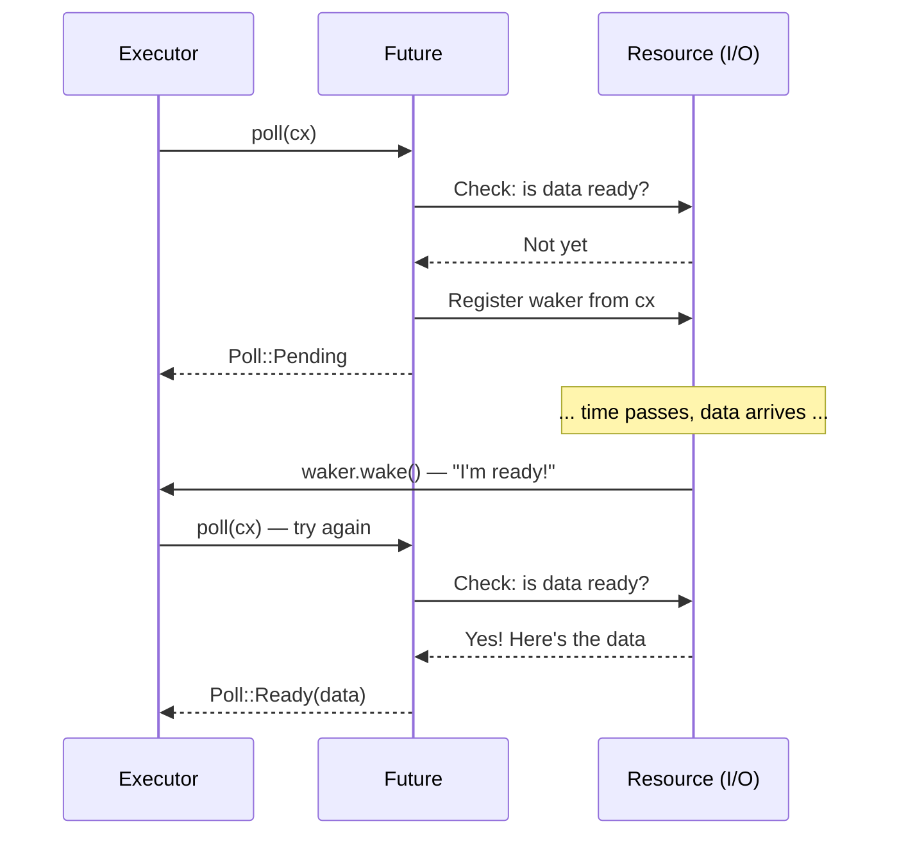

# 2. The Future Trait 🟡<br><span class="zh-inline">2. Future Trait 🟡</span>

> **What you'll learn:**<br><span class="zh-inline">**将学到什么：**</span>
> - The `Future` trait: `Output`, `poll()`, `Context`, `Waker`<br><span class="zh-inline">`Future` trait 的核心组成：`Output`、`poll()`、`Context`、`Waker`</span>
> - How a waker tells the executor "poll me again"<br><span class="zh-inline">waker 如何通知执行器“再 poll 我一次”</span>
> - The contract: never call `wake()` = your program silently hangs<br><span class="zh-inline">这套契约的关键：如果从不调用 `wake()`，程序就会悄悄挂住</span>
> - Implementing a real future by hand (`Delay`)<br><span class="zh-inline">如何手写一个真正可工作的 future，也就是 `Delay`</span>

## Anatomy of a Future<br><span class="zh-inline">Future 的结构</span>

Everything in async Rust ultimately implements this trait:<br><span class="zh-inline">Rust 异步体系中的一切，最终都要落到这个 trait 上：</span>

```rust
pub trait Future {
    type Output;

    fn poll(self: Pin<&mut Self>, cx: &mut Context<'_>) -> Poll<Self::Output>;
}

pub enum Poll<T> {
    Ready(T),   // The future has completed with value T
    Pending,    // The future is not ready yet — call me back later
}
```

That's it. A `Future` is anything that can be *polled* — asked "are you done yet?" — and responds with either "yes, here's the result" or "not yet, I'll wake you up when I'm ready."<br><span class="zh-inline">核心就这么多。`Future` 就是任何可以被 *poll* 的对象，也就是可以被问一句“做完了吗？”；它要么回答“做完了，结果在这”，要么回答“还没有，等我准备好了会叫醒你”。</span>

### Output, poll(), Context, Waker<br><span class="zh-inline">Output、poll()、Context、Waker</span>



Let's break down each piece:<br><span class="zh-inline">下面把这些组成部分逐个拆开来看：</span>

```rust
use std::future::Future;
use std::pin::Pin;
use std::task::{Context, Poll};

// A future that returns 42 immediately
struct Ready42;

impl Future for Ready42 {
    type Output = i32; // What the future eventually produces

    fn poll(self: Pin<&mut Self>, _cx: &mut Context<'_>) -> Poll<i32> {
        Poll::Ready(42) // Always ready — no waiting
    }
}
```

**The components**:<br><span class="zh-inline">**这些组件分别代表：**</span>
- **`Output`** — the type of value produced when the future completes<br><span class="zh-inline">**`Output`**：future 完成时最终产出的值类型</span>
- **`poll()`** — called by the executor to check progress; returns `Ready(value)` or `Pending`<br><span class="zh-inline">**`poll()`**：由执行器调用，用来检查 future 是否取得进展；返回值只能是 `Ready(value)` 或 `Pending`</span>
- **`Pin<&mut Self>`** — ensures the future won't be moved in memory (we'll cover why in Ch. 4)<br><span class="zh-inline">**`Pin<&mut Self>`**：保证 future 在内存中不会被移动，至于原因会在第 4 章展开</span>
- **`Context`** — carries the `Waker` so the future can signal the executor when it's ready to make progress<br><span class="zh-inline">**`Context`**：内部携带 `Waker`，future 可以借此在准备好继续推进时通知执行器</span>

### The Waker Contract<br><span class="zh-inline">Waker 契约</span>

The `Waker` is the callback mechanism. When a future returns `Pending`, it *must* arrange for `waker.wake()` to be called later — otherwise the executor will never poll it again and the program hangs.<br><span class="zh-inline">`Waker` 就是回调通知机制。当 future 返回 `Pending` 时，它**必须**安排之后某个时刻调用 `waker.wake()`；否则执行器永远不会再次 poll 它，程序就会卡死。</span>

```rust
use std::task::{Context, Poll, Waker};
use std::pin::Pin;
use std::future::Future;
use std::sync::{Arc, Mutex};
use std::thread;
use std::time::Duration;

/// A future that completes after a delay (toy implementation)
struct Delay {
    completed: Arc<Mutex<bool>>,
    waker_stored: Arc<Mutex<Option<Waker>>>,
    duration: Duration,
    started: bool,
}

impl Delay {
    fn new(duration: Duration) -> Self {
        Delay {
            completed: Arc::new(Mutex::new(false)),
            waker_stored: Arc::new(Mutex::new(None)),
            duration,
            started: false,
        }
    }
}

impl Future for Delay {
    type Output = ();

    fn poll(mut self: Pin<&mut Self>, cx: &mut Context<'_>) -> Poll<()> {
        // Check if already completed
        if *self.completed.lock().unwrap() {
            return Poll::Ready(());
        }

        // Store the waker so the background thread can wake us
        *self.waker_stored.lock().unwrap() = Some(cx.waker().clone());

        // Start the background timer on first poll
        if !self.started {
            self.started = true;
            let completed = Arc::clone(&self.completed);
            let waker = Arc::clone(&self.waker_stored);
            let duration = self.duration;

            thread::spawn(move || {
                thread::sleep(duration);
                *completed.lock().unwrap() = true;

                // CRITICAL: wake the executor so it polls us again
                if let Some(w) = waker.lock().unwrap().take() {
                    w.wake(); // "Hey executor, I'm ready — poll me again!"
                }
            });
        }

        Poll::Pending // Not done yet
    }
}
```

> **Key insight**: In C#, the TaskScheduler handles waking automatically.<br><span class="zh-inline">**关键理解**：在 C# 里，唤醒逻辑通常由 TaskScheduler 自动处理。</span>
> In Rust, **you** (or the I/O library you use) are responsible for calling<br><span class="zh-inline">而在 Rust 里，调用</span>
> `waker.wake()`. Forget it, and your program silently hangs.<br><span class="zh-inline">`waker.wake()` 的责任在开发者自己，或者所使用的 I/O 库身上。漏掉这一点，程序就会悄无声息地挂住。</span>

### Exercise: Implement a CountdownFuture<br><span class="zh-inline">练习：实现一个 CountdownFuture</span>

<details>
<summary>🏋️ Exercise (click to expand)<br><span class="zh-inline">🏋️ 练习（点击展开）</span></summary>

**Challenge**: Implement a `CountdownFuture` that counts down from N to 0, printing the current count each time it's polled. When it reaches 0, it completes with `Ready("Liftoff!")`.<br><span class="zh-inline">**挑战**：实现一个 `CountdownFuture`，让它从 N 倒数到 0，每次被 poll 时都打印当前数字；当计数归零时，返回 `Ready("Liftoff!")`。</span>

*Hint*: The future needs to store the current count and decrement it on each poll. Remember to always re-register the waker!<br><span class="zh-inline">*提示*：这个 future 需要保存当前计数，并在每次 poll 时递减。记得每次都要重新注册 waker。</span>

<details>
<summary>🔑 Solution<br><span class="zh-inline">🔑 参考答案</span></summary>

```rust
use std::future::Future;
use std::pin::Pin;
use std::task::{Context, Poll};

struct CountdownFuture {
    count: u32,
}

impl CountdownFuture {
    fn new(start: u32) -> Self {
        CountdownFuture { count: start }
    }
}

impl Future for CountdownFuture {
    type Output = &'static str;

    fn poll(mut self: Pin<&mut Self>, cx: &mut Context<'_>) -> Poll<Self::Output> {
        if self.count == 0 {
            println!("Liftoff!");
            Poll::Ready("Liftoff!")
        } else {
            println!("{}...", self.count);
            self.count -= 1;
            cx.waker().wake_by_ref(); // Schedule re-poll immediately
            Poll::Pending
        }
    }
}
```

**Key takeaway**: This future is polled once per count. Each time it returns `Pending`, it immediately wakes itself to be polled again. In production, you'd use a timer instead of busy-polling.<br><span class="zh-inline">**关键点**：这个 future 每减少一次计数就会被 poll 一次。每次返回 `Pending` 时，它都会立即把自己重新唤醒，以便再次被 poll。生产环境里通常会用计时器，而不是这种忙轮询方式。</span>

</details>
</details>

> **Key Takeaways — The Future Trait**<br><span class="zh-inline">**关键结论：Future Trait**</span>
> - `Future::poll()` returns `Poll::Ready(value)` or `Poll::Pending`<br><span class="zh-inline">`Future::poll()` 的返回值只能是 `Poll::Ready(value)` 或 `Poll::Pending`</span>
> - A future must register a `Waker` before returning `Pending` — the executor uses it to know when to re-poll<br><span class="zh-inline">future 在返回 `Pending` 之前必须注册 `Waker`，执行器靠它来判断何时再次 poll</span>
> - `Pin<&mut Self>` guarantees the future won't be moved in memory (needed for self-referential state machines — see Ch 4)<br><span class="zh-inline">`Pin<&mut Self>` 保证 future 不会在内存中移动，这对自引用状态机是必需的，详见第 4 章</span>
> - Everything in async Rust — `async fn`, `.await`, combinators — is built on this one trait<br><span class="zh-inline">Rust async 里的所有东西，无论是 `async fn`、`.await` 还是各种组合器，底层都建立在这一个 trait 之上</span>

> **See also:** [Ch 3 — How Poll Works](ch03-how-poll-works.md) for the executor loop, [Ch 6 — Building Futures by Hand](ch06-building-futures-by-hand.md) for more complex implementations<br><span class="zh-inline">**延伸阅读：** [第 3 章 How Poll Works](ch03-how-poll-works.md) 介绍执行器循环；[第 6 章 Building Futures by Hand](ch06-building-futures-by-hand.md) 介绍更复杂的手写实现。</span>

***


