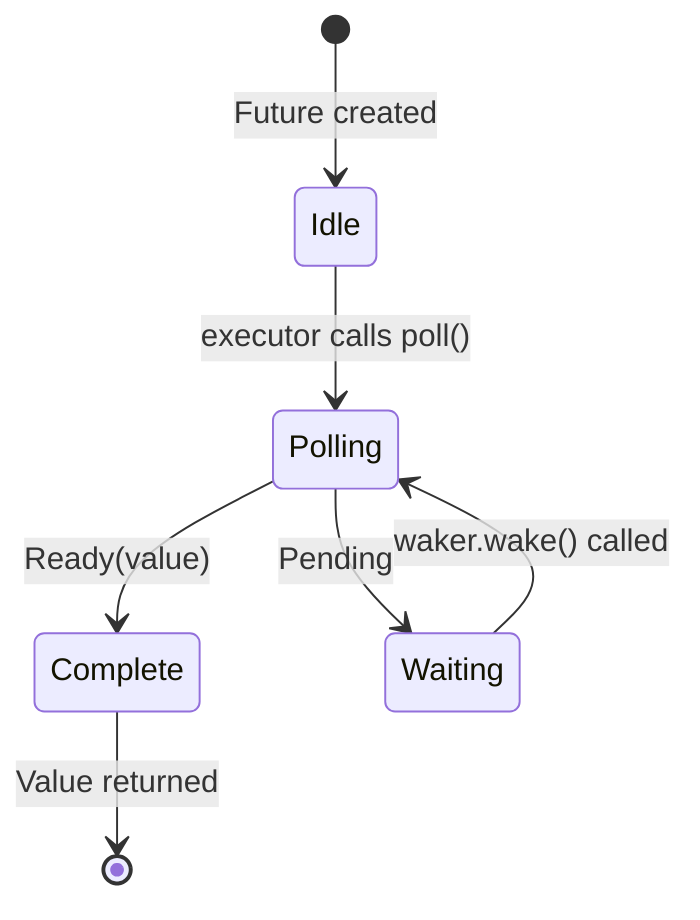

# 3. How Poll Works 🟡<br><span class="zh-inline">3. `poll` 到底是怎么运作的 🟡</span>

> **What you'll learn:**<br><span class="zh-inline">**本章将学到什么：**</span>
> - The executor's poll loop: poll → pending → wake → poll again<br><span class="zh-inline">执行器的 `poll` 循环：`poll` → `Pending` → `wake` → 再次 `poll`</span>
> - How to build a minimal executor from scratch<br><span class="zh-inline">如何从零写出一个最小执行器</span>
> - Spurious wake rules and why they matter<br><span class="zh-inline">虚假唤醒规则是什么，以及它为什么重要</span>
> - Utility functions: `poll_fn()` and `yield_now()`<br><span class="zh-inline">两个常用工具：`poll_fn()` 和 `yield_now()`</span>

## The Polling State Machine<br><span class="zh-inline">轮询状态机</span>

The executor runs a loop: poll a future, if it's `Pending`, park it until its waker fires, then poll again. This is fundamentally different from OS threads where the kernel handles scheduling.<br><span class="zh-inline">执行器的核心动作就是循环调用 future 的 `poll`：如果返回 `Pending`，就把它挂起，等对应的 waker 触发后再回来继续 `poll`。这和操作系统线程很不一样，线程调度主要由内核负责，而 async 调度基本是用户态自己做。</span>



> **Important:** While in the *Waiting* state the future **must** have registered the waker with an I/O source. No registration = hang forever.<br><span class="zh-inline">**重点：** future 进入 *Waiting* 状态时，**必须** 已经把 waker 注册到 I/O 事件源上。要是没注册，就没人会把它唤醒，它会老老实实卡到天荒地老。</span>

### A Minimal Executor<br><span class="zh-inline">一个最小执行器</span>

To demystify executors, let's build the simplest possible one:<br><span class="zh-inline">为了把执行器这件事讲透，先写一个最简单、近乎裸奔版的执行器：</span>

```rust
use std::future::Future;
use std::task::{Context, Poll, RawWaker, RawWakerVTable, Waker};
use std::pin::Pin;

/// The simplest possible executor: busy-loop poll until Ready
fn block_on<F: Future>(mut future: F) -> F::Output {
    // Pin the future on the stack
    // SAFETY: `future` is never moved after this point — we only
    // access it through the pinned reference until it completes.
    let mut future = unsafe { Pin::new_unchecked(&mut future) };

    // Create a no-op waker (just keeps polling — inefficient but simple)
    fn noop_raw_waker() -> RawWaker {
        fn no_op(_: *const ()) {}
        fn clone(_: *const ()) -> RawWaker { noop_raw_waker() }
        let vtable = &RawWakerVTable::new(clone, no_op, no_op, no_op);
        RawWaker::new(std::ptr::null(), vtable)
    }

    let waker = unsafe { Waker::from_raw(noop_raw_waker()) };
    let mut cx = Context::from_waker(&waker);

    // Busy-loop until the future completes
    loop {
        match future.as_mut().poll(&mut cx) {
            Poll::Ready(value) => return value,
            Poll::Pending => {
                // A real executor would park the thread here
                // and wait for waker.wake() — we just spin
                std::thread::yield_now();
            }
        }
    }
}

// Usage:
fn main() {
    let result = block_on(async {
        println!("Hello from our mini executor!");
        42
    });
    println!("Got: {result}");
}
```

这个版本很土，但它把核心逻辑掰得非常清楚：执行器其实就是一个反复调用 `poll()` 的循环。future 说“还没准备好”，执行器就先让开；future 说“值准备好了”，执行器就把结果取走。<br><span class="zh-inline">真正常见的运行时，例如 Tokio，不会像这个例子一样傻转 CPU，而是会把线程挂到 `epoll`、`kqueue`、`io_uring` 这类系统机制上，等事件到了再回来继续跑。</span>

> **Don't use this in production!** It busy-loops, wasting CPU. Real executors (tokio, smol) use `epoll`/`kqueue`/`io_uring` to sleep until I/O is ready. But this shows the core idea: an executor is just a loop that calls `poll()`.<br><span class="zh-inline">**别把这玩意拿去上生产。** 它会忙等，纯烧 CPU。真正的执行器会睡眠等待 I/O 就绪。但这段代码非常适合建立直觉：执行器本质上就是一个会反复调用 `poll()` 的调度循环。</span>

### Wake-Up Notifications<br><span class="zh-inline">唤醒通知</span>

A real executor is event-driven. When all futures are `Pending`, the executor sleeps. The waker is an interrupt mechanism:<br><span class="zh-inline">真正的执行器是事件驱动的。当所有 future 都是 `Pending` 时，它会休眠；等某个 waker 触发，再回来继续调度。waker 就像是用户态的一套“中断通知”。</span>

```rust
// Conceptual model of a real executor's main loop:
fn executor_loop(tasks: &mut TaskQueue) {
    loop {
        // 1. Poll all tasks that have been woken
        while let Some(task) = tasks.get_woken_task() {
            match task.poll() {
                Poll::Ready(result) => task.complete(result),
                Poll::Pending => { /* task stays in queue, waiting for wake */ }
            }
        }

        // 2. Sleep until something wakes us up (epoll_wait, kevent, etc.)
        //    This is where mio/polling does the heavy lifting
        tasks.wait_for_events(); // blocks until an I/O event or waker fires
    }
}
```

可以把这个过程理解成两步：先处理已经被唤醒的任务，再去系统层等待下一批事件。谁醒了，谁先回来被 `poll`。没醒的任务，执行器连看都懒得看。<br><span class="zh-inline">这也是 async 高效的关键之一：它不靠一堆线程空转，而是让真正有进展的任务继续跑。</span>

### Spurious Wakes<br><span class="zh-inline">虚假唤醒</span>

A future may be polled even when its I/O isn't ready. This is called a *spurious wake*. Futures must handle this correctly:<br><span class="zh-inline">有时候 future 会被唤醒，但对应的 I/O 其实还没真准备好。这就叫 *spurious wake*，也就是虚假唤醒。实现 `Future` 时必须正确处理这种情况。</span>

```rust
impl Future for MyFuture {
    type Output = Data;

    fn poll(self: Pin<&mut Self>, cx: &mut Context<'_>) -> Poll<Data> {
        // ✅ CORRECT: Always re-check the actual condition
        if let Some(data) = self.try_read_data() {
            Poll::Ready(data)
        } else {
            // Re-register the waker (it might have changed!)
            self.register_waker(cx.waker());
            Poll::Pending
        }

        // ❌ WRONG: Assuming poll means data is ready
        // let data = self.read_data(); // might block or panic
        // Poll::Ready(data)
    }
}
```

这里最容易犯蠢的地方，就是误以为“既然又被 `poll` 了，那一定有数据了”。这想法可太天真了。`poll` 只是一次机会，不是成功保证。<br><span class="zh-inline">每次进 `poll()` 都要重新检查真实条件，发现还没好，就重新登记 waker，然后继续返回 `Pending`。</span>

**Rules for implementing `poll()`**:<br><span class="zh-inline">**实现 `poll()` 时的规则：**</span>

1. **Never block** — return `Pending` immediately if not ready<br><span class="zh-inline">1. **绝对别阻塞**：条件没满足就立刻返回 `Pending`。</span>
2. **Always re-register the waker** — it may have changed between polls<br><span class="zh-inline">2. **每次都重新注册 waker**：两次 `poll` 之间，waker 可能已经变了。</span>
3. **Handle spurious wakes** — check the actual condition, don't assume readiness<br><span class="zh-inline">3. **正确处理虚假唤醒**：检查真实状态，别脑补“既然被叫醒就一定能继续”。</span>
4. **Don't poll after `Ready`** — behavior is **unspecified** (may panic, return `Pending`, or repeat `Ready`). Only `FusedFuture` guarantees safe post-completion polling<br><span class="zh-inline">4. **返回 `Ready` 后别再继续 `poll`**：这之后的行为是 **未指定的**，可能 panic，可能返回 `Pending`，也可能重复 `Ready`。只有 `FusedFuture` 才会额外保证完成后继续轮询是安全的。</span>

<details>
<summary><strong>🏋️ Exercise: Implement a CountdownFuture</strong> <span class="zh-inline">🏋️ 练习：实现一个倒计时 Future</span></summary>

**Challenge**: Implement a `CountdownFuture` that counts down from N to 0, *printing* the current count as a side-effect each time it's polled. When it reaches 0, it completes with `Ready("Liftoff!")`. (Note: a `Future` produces only **one** final value — the printing is a side-effect, not a yielded value. For multiple async values, see `Stream` in Ch. 11.)<br><span class="zh-inline">**挑战题：** 实现一个 `CountdownFuture`，从 N 倒数到 0。每次被 `poll` 时，都把当前数字打印出来作为副作用；当数到 0 时，返回 `Ready("Liftoff!")``。注意，`Future` 最终只产生 **一个** 值，打印只是副作用，不是多次产出。要处理多次异步产出，得看第 11 章的 `Stream`。</span>

*Hint*: This doesn't need a real I/O source — it can wake itself immediately with `cx.waker().wake_by_ref()` after each decrement.<br><span class="zh-inline">*提示：* 这个练习不需要真实 I/O。每次减 1 之后，用 `cx.waker().wake_by_ref()` 立刻把自己重新唤醒就行。</span>

<details>
<summary>🔑 Solution <span class="zh-inline">🔑 参考答案</span></summary>

```rust
use std::future::Future;
use std::pin::Pin;
use std::task::{Context, Poll};

struct CountdownFuture {
    count: u32,
}

impl CountdownFuture {
    fn new(start: u32) -> Self {
        CountdownFuture { count: start }
    }
}

impl Future for CountdownFuture {
    type Output = &'static str;

    fn poll(mut self: Pin<&mut Self>, cx: &mut Context<'_>) -> Poll<Self::Output> {
        if self.count == 0 {
            Poll::Ready("Liftoff!")
        } else {
            println!("{}...", self.count);
            self.count -= 1;
            // Wake immediately — we're always ready to make progress
            cx.waker().wake_by_ref();
            Poll::Pending
        }
    }
}

// Usage with our mini executor or tokio:
// let msg = block_on(CountdownFuture::new(5));
// prints: 5... 4... 3... 2... 1...
// msg == "Liftoff!"
```

**Key takeaway**: Even though this future is always ready to progress, it returns `Pending` to yield control between steps. It calls `wake_by_ref()` immediately so the executor re-polls it right away. This is the basis of cooperative multitasking — each future voluntarily yields.<br><span class="zh-inline">**关键点：** 这个 future 虽然每一步都能继续推进，但它依然会先返回 `Pending`，把控制权交还给执行器，然后立刻主动唤醒自己。协作式多任务的基础就是这个味道：每个 future 在合适的位置主动让出执行机会。</span>

</details>
</details>

### Handy Utilities: `poll_fn` and `yield_now`<br><span class="zh-inline">两个顺手好用的工具：`poll_fn` 和 `yield_now`</span>

Two utilities from the standard library and tokio that avoid writing full `Future` impls:<br><span class="zh-inline">标准库和 Tokio 各给了一个很好用的小工具，很多时候可以避免手写整套 `Future` 实现：</span>

```rust
use std::future::poll_fn;
use std::task::Poll;

// poll_fn: create a one-off future from a closure
let value = poll_fn(|cx| {
    // Do something with cx.waker(), return Ready or Pending
    Poll::Ready(42)
}).await;

// Real-world use: bridge a callback-based API into async
async fn read_when_ready(source: &MySource) -> Data {
    poll_fn(|cx| source.poll_read(cx)).await
}
```

`poll_fn()` 很适合把“已经有一个像 `poll_xxx(cx)` 这样的回调式接口”包装成 async 形式。它特别适合作桥接层，用一次就走，不必专门定义一个新 future 类型。<br><span class="zh-inline">如果只是临时把某段轮询逻辑塞进 async 流程，`poll_fn()` 基本就是现成的瑞士军刀。</span>

```rust
// yield_now: voluntarily yield control to the executor
// Useful in CPU-heavy async loops to avoid starving other tasks
async fn cpu_heavy_work(items: &[Item]) {
    for (i, item) in items.iter().enumerate() {
        process(item); // CPU work

        // Every 100 items, yield to let other tasks run
        if i % 100 == 0 {
            tokio::task::yield_now().await;
        }
    }
}
```

`yield_now()` 则是“我虽然还能继续算，但先让别人跑一下”的主动让步。这个在 CPU 密集型 async 循环里尤其重要，不然一个任务可能霸占执行器线程，把别的任务活活饿着。<br><span class="zh-inline">只要一个 async 函数里长时间没有 `.await`，它就很容易把 cooperative scheduling 搞成单任务独占。适当插入 `yield_now().await`，调度才会重新均衡起来。</span>

> **When to use `yield_now()`**: If your async function does CPU work in a loop without any `.await` points, it monopolizes the executor thread. Insert `yield_now().await` periodically to enable cooperative multitasking.<br><span class="zh-inline">**什么时候该用 `yield_now()`：** 如果 async 函数在循环里做的是纯 CPU 工作，而且长时间没有 `.await`，那它就会长期霸占执行器线程。周期性插入 `yield_now().await`，才能把协作式调度重新扶正。</span>

> **Key Takeaways — How Poll Works**<br><span class="zh-inline">**本章要点：`poll` 的工作方式**</span>
> - An executor repeatedly calls `poll()` on futures that have been woken<br><span class="zh-inline">执行器会反复对已被唤醒的 future 调用 `poll()`。</span>
> - Futures must handle **spurious wakes** — always re-check the actual condition<br><span class="zh-inline">future 必须能处理 **虚假唤醒**，每次都重新检查真实条件。</span>
> - `poll_fn()` lets you create ad-hoc futures from closures<br><span class="zh-inline">`poll_fn()` 可以把闭包快速包装成临时 future。</span>
> - `yield_now()` is a cooperative scheduling escape hatch for CPU-heavy async code<br><span class="zh-inline">`yield_now()` 是 CPU 密集型 async 代码里常用的协作式调度让步点。</span>

> **See also:** [Ch 2 — The Future Trait](ch02-the-future-trait.md) for the trait definition, [Ch 5 — The State Machine Reveal](ch05-the-state-machine-reveal.md) for what the compiler generates<br><span class="zh-inline">**继续阅读：** [第 2 章：Future Trait](ch02-the-future-trait.md) 讲 trait 定义本身，[第 5 章：状态机的真相](ch05-the-state-machine-reveal.md) 会继续拆开编译器到底生成了什么。</span>

***
