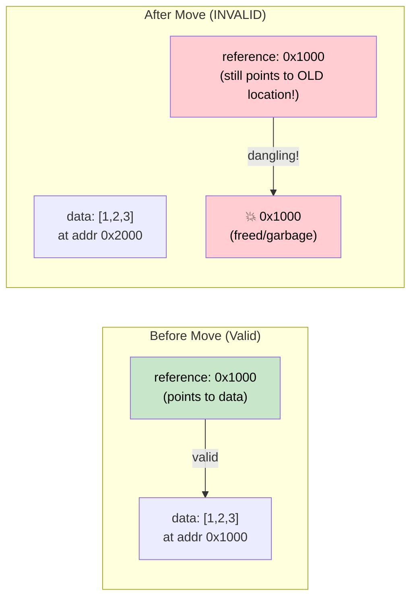

# 4. Pin and Unpin 🔴<br><span class="zh-inline">4. Pin 与 Unpin 🔴</span>

> **What you'll learn:**<br><span class="zh-inline">**本章将学到什么：**</span>
> - Why self-referential structs break when moved in memory<br><span class="zh-inline">为什么自引用结构体一旦在内存里移动就会出问题</span>
> - What `Pin<P>` guarantees and how it prevents moves<br><span class="zh-inline">`Pin<P>` 到底保证了什么，以及它如何阻止移动</span>
> - The three practical pinning patterns: `Box::pin()`, `tokio::pin!()`, `Pin::new()`<br><span class="zh-inline">三种常见的 pin 用法：`Box::pin()`、`tokio::pin!()`、`Pin::new()`</span>
> - When `Unpin` gives you an escape hatch<br><span class="zh-inline">什么时候 `Unpin` 能让局面轻松很多</span>

## Why Pin Exists<br><span class="zh-inline">为什么会有 Pin</span>

This is the most confusing concept in async Rust. Let's build the intuition step by step.<br><span class="zh-inline">这是 async Rust 里最容易把人绕晕的概念之一。别急，按步骤把直觉搭起来就顺了。</span>

### The Problem: Self-Referential Structs<br><span class="zh-inline">问题所在：自引用结构体</span>

When the compiler transforms an `async fn` into a state machine, that state machine may contain references to its own fields. This creates a *self-referential struct* — and moving it in memory would invalidate those internal references.<br><span class="zh-inline">编译器把 `async fn` 变成状态机之后，这个状态机里可能会包含指向它自身字段的引用。这样一来，就形成了一个 *自引用结构体*。而这种结构如果在内存里被挪动，内部那些引用就会立刻失效。</span>

```rust
// What the compiler generates (simplified) for:
// async fn example() {
//     let data = vec![1, 2, 3];
//     let reference = &data;       // Points to data above
//     use_ref(reference).await;
// }

// Becomes something like:
enum ExampleStateMachine {
    State0 {
        data: Vec<i32>,
        // reference: &Vec<i32>,  // PROBLEM: points to `data` above
        //                        // If this struct moves, the pointer is dangling!
    },
    State1 {
        data: Vec<i32>,
        reference: *const Vec<i32>, // Internal pointer to data field
    },
    Complete,
}
```



### Self-Referential Structs<br><span class="zh-inline">自引用结构体并不是纸上谈兵</span>

This isn't an academic concern. Every `async fn` that holds a reference across an `.await` point creates a self-referential state machine:<br><span class="zh-inline">这不是学术层面的边角问题。任何一个在 `.await` 前后跨越持有引用的 `async fn`，都会生成自引用状态机：</span>

```rust
async fn problematic() {
    let data = String::from("hello");
    let slice = &data[..]; // slice borrows data
    
    some_io().await; // <-- .await point: state machine stores both data AND slice
    
    println!("{slice}"); // uses the reference after await
}
// The generated state machine has `data: String` and `slice: &str`
// where slice points INTO data. Moving the state machine = dangling pointer.
```

### Pin in Practice<br><span class="zh-inline">Pin 在实战里是什么样子</span>

`Pin<P>` is a wrapper that prevents moving the value behind the pointer:<br><span class="zh-inline">`Pin<P>` 是一个包装器，用来阻止指针背后的那个值被移动：</span>

```rust
use std::pin::Pin;

let mut data = String::from("hello");

// Pin it — now it can't be moved
let pinned: Pin<&mut String> = Pin::new(&mut data);

// Can still use it:
println!("{}", pinned.as_ref().get_ref()); // "hello"

// But we can't get &mut String back (which would allow mem::swap):
// let mutable: &mut String = Pin::into_inner(pinned); // Only if String: Unpin
// String IS Unpin, so this actually works for String.
// But for self-referential state machines (which are !Unpin), it's blocked.
```

In real code, you mostly encounter Pin in three places:<br><span class="zh-inline">实际代码里，Pin 主要会在三种地方碰见：</span>

```rust
// 1. poll() signature — all futures are polled through Pin
fn poll(self: Pin<&mut Self>, cx: &mut Context<'_>) -> Poll<Output>;

// 2. Box::pin() — heap-allocate and pin a future
let future: Pin<Box<dyn Future<Output = i32>>> = Box::pin(async { 42 });

// 3. tokio::pin!() — pin a future on the stack
tokio::pin!(my_future);
// Now my_future: Pin<&mut impl Future>
```

### The Unpin Escape Hatch<br><span class="zh-inline">Unpin 这条“逃生通道”</span>

Most types in Rust are `Unpin` — they don't contain self-references, so pinning is a no-op. Only compiler-generated state machines (from `async fn`) are `!Unpin`.<br><span class="zh-inline">Rust 里绝大多数类型都是 `Unpin`，因为它们根本不包含自引用，所以 pin 上去也只是走个形式。真正属于 `!Unpin` 的，主要是编译器从 `async fn` 生成出来的那些状态机。</span>

```rust
// These are all Unpin — pinning them does nothing special:
// i32, String, Vec<T>, HashMap<K,V>, Box<T>, &T, &mut T

// These are !Unpin — they MUST be pinned before polling:
// The state machines generated by `async fn` and `async {}`

// Practical implication:
// If you write a Future by hand and it has NO self-references,
// implement Unpin to make it easier to work with:
impl Unpin for MySimpleFuture {} // "I'm safe to move, trust me"
```

### Quick Reference<br><span class="zh-inline">快速参考</span>

| What | When | How |
|------|------|-----|
| Pin a future on the heap<br><span class="zh-inline">把 future pin 到堆上</span> | Storing in a collection, returning from function<br><span class="zh-inline">需要放进集合，或者要从函数里返回</span> | `Box::pin(future)`<br><span class="zh-inline">`Box::pin(future)`</span> |
| Pin a future on the stack<br><span class="zh-inline">把 future pin 到栈上</span> | Local use in `select!` or manual polling<br><span class="zh-inline">只在局部 `select!` 或手动 poll 时使用</span> | `tokio::pin!(future)` or `pin_mut!` from `pin-utils`<br><span class="zh-inline">`tokio::pin!(future)` 或 `pin-utils` 里的 `pin_mut!`</span> |
| Pin in function signature<br><span class="zh-inline">在函数签名里使用 Pin</span> | Accepting pinned futures<br><span class="zh-inline">函数要接收已经 pin 好的 future</span> | `future: Pin<&mut F>`<br><span class="zh-inline">`future: Pin<&mut F>`</span> |
| Require Unpin<br><span class="zh-inline">要求 Unpin</span> | When you need to move a future after creation<br><span class="zh-inline">future 创建之后还需要继续移动它</span> | `F: Future + Unpin`<br><span class="zh-inline">`F: Future + Unpin`</span> |

<details>
<summary><strong>🏋️ Exercise: Pin and Move</strong> <span class="zh-inline">🏋️ 练习：Pin 与移动</span></summary>

**Challenge**: Which of these code snippets compile? For each one that doesn't, explain why and fix it.<br><span class="zh-inline">**挑战题**：下面这些代码片段里，哪些能编译通过？哪些不能？对每个不能通过的片段，说明原因并给出修正方式。</span>

```rust
// Snippet A
let fut = async { 42 };
let pinned = Box::pin(fut);
let moved = pinned; // Move the Box
let result = moved.await;

// Snippet B
let fut = async { 42 };
tokio::pin!(fut);
let moved = fut; // Move the pinned future
let result = moved.await;

// Snippet C
use std::pin::Pin;
let mut fut = async { 42 };
let pinned = Pin::new(&mut fut);
```

<details>
<summary>🔑 Solution <span class="zh-inline">🔑 参考答案</span></summary>

**Snippet A**: ✅ **Compiles.** `Box::pin()` puts the future on the heap. Moving the `Box` moves the *pointer*, not the future itself. The future stays pinned in its heap location.<br><span class="zh-inline">**片段 A**：✅ **可以编译。** `Box::pin()` 会把 future 放到堆上。后面移动的是 `Box` 这个 *指针*，不是 future 本体，所以 future 仍然固定在原来的堆地址上。</span>

**Snippet B**: ❌ **Does not compile.** `tokio::pin!` pins the future to the stack and rebinds `fut` as `Pin<&mut ...>`. You can't move out of a pinned reference. **Fix**: Don't move it — use it in place:<br><span class="zh-inline">**片段 B**：❌ **不能编译。** `tokio::pin!` 会把 future pin 在栈上，并把 `fut` 重新绑定成 `Pin<&mut ...>`。从一个已经 pin 住的引用里把值再挪出去，是不允许的。**修正办法**：别移动它，原地使用。</span>

```rust
let fut = async { 42 };
tokio::pin!(fut);
let result = fut.await; // Use directly, don't reassign
```

**Snippet C**: ❌ **Does not compile.** `Pin::new()` requires `T: Unpin`. Async blocks generate `!Unpin` types. **Fix**: Use `Box::pin()` or `unsafe Pin::new_unchecked()`:<br><span class="zh-inline">**片段 C**：❌ **不能编译。** `Pin::new()` 要求 `T: Unpin`，而 async block 生成出来的类型通常是 `!Unpin`。**修正办法**：用 `Box::pin()`，或者在极少数非常确定的场景下用 `unsafe Pin::new_unchecked()`。</span>

```rust
let fut = async { 42 };
let pinned = Box::pin(fut); // Heap-pin — works with !Unpin
```

**Key takeaway**: `Box::pin()` is the safe, easy way to pin `!Unpin` futures. `tokio::pin!()` pins on the stack but the future can't be moved after. `Pin::new()` only works with `Unpin` types.<br><span class="zh-inline">**关键结论**：`Box::pin()` 是处理 `!Unpin` future 最稳妥、最省心的方式。`tokio::pin!()` 能把 future pin 在栈上，但之后就别想再挪它了。`Pin::new()` 只适用于 `Unpin` 类型。</span>

</details>
</details>

> **Key Takeaways — Pin and Unpin**<br><span class="zh-inline">**本章要点：Pin 与 Unpin**</span>
> - `Pin<P>` is a wrapper that **prevents the pointee from being moved** — essential for self-referential state machines<br><span class="zh-inline">`Pin<P>` 是一个包装器，它会 **阻止被指向的值继续移动**，这对自引用状态机至关重要。</span>
> - `Box::pin()` is the safe, easy default for pinning futures on the heap<br><span class="zh-inline">`Box::pin()` 是把 future pin 到堆上的安全默认解法。</span>
> - `tokio::pin!()` pins on the stack — cheaper but the future can't be moved afterward<br><span class="zh-inline">`tokio::pin!()` 会把 future pin 在栈上，成本更低，但后面就不能再移动它。</span>
> - `Unpin` is an auto-trait opt-out: types that implement `Unpin` can be moved even when pinned (most types are `Unpin`; async blocks are not)<br><span class="zh-inline">`Unpin` 是一个自动 trait。实现了 `Unpin` 的类型，即使被 pin，也仍然允许移动。大多数普通类型都是 `Unpin`，但 async block 生成的类型通常不是。</span>

> **See also:** [Ch 2 — The Future Trait](ch02-the-future-trait.md) for `Pin<&mut Self>` in poll, [Ch 5 — The State Machine Reveal](ch05-the-state-machine-reveal.md) for why async state machines are self-referential<br><span class="zh-inline">**继续阅读：** [第 2 章：Future Trait](ch02-the-future-trait.md) 会解释 poll 里的 `Pin<&mut Self>`，[第 5 章：状态机的真相](ch05-the-state-machine-reveal.md) 会说明为什么 async 状态机天然就是自引用的。</span>

***
