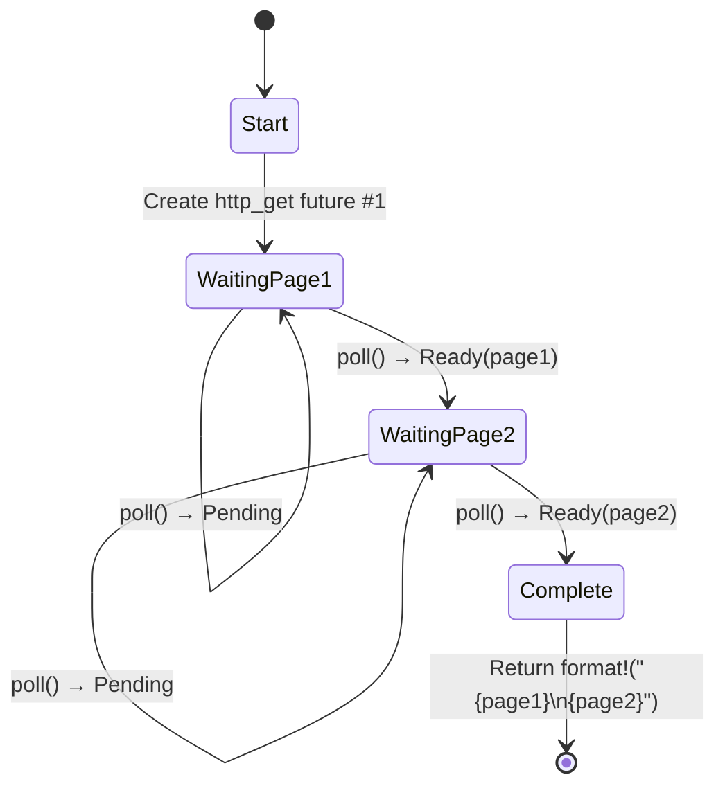

# 5. The State Machine Reveal 🟢<br><span class="zh-inline">5. 状态机的真相 🟢</span>

> **What you'll learn:**<br><span class="zh-inline">**本章将学到什么：**</span>
> - How the compiler transforms `async fn` into an enum state machine<br><span class="zh-inline">编译器如何把 `async fn` 变成基于枚举的状态机</span>
> - Side-by-side comparison: source code vs generated states<br><span class="zh-inline">源代码与生成状态之间的一一对照</span>
> - Why large stack allocations in `async fn` blow up future sizes<br><span class="zh-inline">为什么 `async fn` 里的大栈分配会把 future 的尺寸撑爆</span>
> - The drop optimization: values drop as soon as they're no longer needed<br><span class="zh-inline">drop 优化：值一旦不再需要就会立刻被释放</span>

## What the Compiler Actually Generates<br><span class="zh-inline">编译器实际生成了什么</span>

When you write `async fn`, the compiler transforms your sequential-looking code into an enum-based state machine. Understanding this transformation is the key to understanding async Rust's performance characteristics and many of its quirks.<br><span class="zh-inline">当写下 `async fn` 时，编译器会把看起来像顺序执行的代码改写成一个基于枚举的状态机。想弄懂 async Rust 的性能特征和很多古怪之处，关键就是先把这个转换过程看明白。</span>

### Side-by-Side: async fn vs State Machine<br><span class="zh-inline">并排看：`async fn` 与状态机</span>

```rust
// What you write:
async fn fetch_two_pages() -> String {
    let page1 = http_get("https://example.com/a").await;
    let page2 = http_get("https://example.com/b").await;
    format!("{page1}\n{page2}")
}
```

The compiler generates something conceptually like this:<br><span class="zh-inline">编译器在概念上会生成类似下面这样的东西：</span>

```rust
enum FetchTwoPagesStateMachine {
    // State 0: About to call http_get for page1
    Start,

    // State 1: Waiting for page1, holding the future
    WaitingPage1 {
        fut1: HttpGetFuture,
    },

    // State 2: Got page1, waiting for page2
    WaitingPage2 {
        page1: String,
        fut2: HttpGetFuture,
    },

    // Terminal state
    Complete,
}

impl Future for FetchTwoPagesStateMachine {
    type Output = String;

    fn poll(mut self: Pin<&mut Self>, cx: &mut Context<'_>) -> Poll<String> {
        loop {
            match self.as_mut().get_mut() {
                Self::Start => {
                    let fut1 = http_get("https://example.com/a");
                    *self.as_mut().get_mut() = Self::WaitingPage1 { fut1 };
                }
                Self::WaitingPage1 { fut1 } => {
                    let page1 = match Pin::new(fut1).poll(cx) {
                        Poll::Ready(v) => v,
                        Poll::Pending => return Poll::Pending,
                    };
                    let fut2 = http_get("https://example.com/b");
                    *self.as_mut().get_mut() = Self::WaitingPage2 { page1, fut2 };
                }
                Self::WaitingPage2 { page1, fut2 } => {
                    let page2 = match Pin::new(fut2).poll(cx) {
                        Poll::Ready(v) => v,
                        Poll::Pending => return Poll::Pending,
                    };
                    let result = format!("{page1}\n{page2}");
                    *self.as_mut().get_mut() = Self::Complete;
                    return Poll::Ready(result);
                }
                Self::Complete => panic!("polled after completion"),
            }
        }
    }
}
```

> **Note**: This desugaring is *conceptual*. The real compiler output uses `unsafe` pin projections — the `get_mut()` calls shown here require `Unpin`, but async state machines are `!Unpin`. The goal is to illustrate state transitions, not produce compilable code.<br><span class="zh-inline">**注意：** 这段反语法糖代码只是 *概念示意*。真正的编译器输出会使用 `unsafe` 的 pin projection。这里展示的 `get_mut()` 需要 `Unpin`，但 async 状态机本身通常是 `!Unpin`。重点是说明状态如何迁移，不是给出一份可直接编译的实现。</span>



> **State contents:**<br><span class="zh-inline">**各个状态里保存的内容：**</span>
> - **WaitingPage1** — stores `fut1: HttpGetFuture` (page2 not yet allocated)<br><span class="zh-inline">**WaitingPage1**：保存 `fut1: HttpGetFuture`，此时 `page2` 还没开始分配。</span>
> - **WaitingPage2** — stores `page1: String`, `fut2: HttpGetFuture` (fut1 has been dropped)<br><span class="zh-inline">**WaitingPage2**：保存 `page1: String` 和 `fut2: HttpGetFuture`，这时 `fut1` 已经被释放了。</span>

### Why This Matters for Performance<br><span class="zh-inline">为什么这和性能直接相关</span>

**Zero-cost**: The state machine is a stack-allocated enum. No heap allocation per future, no garbage collector, no boxing — unless you explicitly use `Box::pin()`.<br><span class="zh-inline">**零成本**：这个状态机本质上是一个分配在栈上的枚举。每个 future 默认都不会额外做堆分配，也没有垃圾回收，更不会自动装箱，除非显式使用 `Box::pin()`。</span>

**Size**: The enum's size is the maximum of all its variants. Each `.await` point creates a new variant. This means:<br><span class="zh-inline">**尺寸**：这个枚举的大小取决于所有变体里最大的那个。每出现一个 `.await`，就会多出一个新状态。因此会出现下面这种情况：</span>

```rust
async fn small() {
    let a: u8 = 0;
    yield_now().await;
    let b: u8 = 0;
    yield_now().await;
}
// Size ≈ max(size_of(u8), size_of(u8)) + discriminant + future sizes
//      ≈ small!

async fn big() {
    let buf: [u8; 1_000_000] = [0; 1_000_000]; // 1MB on the stack!
    some_io().await;
    process(&buf);
}
// Size ≈ 1MB + inner future sizes
// ⚠️ Don't stack-allocate huge buffers in async functions!
// Use Vec<u8> or Box<[u8]> instead.
```

**Drop optimization**: When a state machine transitions, it drops values no longer needed. In the example above, `fut1` is dropped when we transition from `WaitingPage1` to `WaitingPage2` — the compiler inserts the drop automatically.<br><span class="zh-inline">**Drop 优化**：状态机一旦迁移，就会把后续不再需要的值立刻释放掉。上面的例子里，从 `WaitingPage1` 切到 `WaitingPage2` 时，`fut1` 就会被自动 drop，这个释放动作由编译器直接插进去。</span>

> **Practical rule**: Large stack allocations in `async fn` blow up the future's size. If you see stack overflows in async code, check for large arrays or deeply nested futures. Use `Box::pin()` to heap-allocate sub-futures if needed.<br><span class="zh-inline">**实战规则**：`async fn` 里的大栈分配会直接把 future 的体积顶上去。如果在 async 代码里遇到栈溢出，先去查有没有超大数组，或者 future 嵌套得过深。必要时用 `Box::pin()` 把子 future 放到堆上。</span>

### Exercise: Predict the State Machine<br><span class="zh-inline">练习：预测状态机</span>

<details>
<summary>🏋️ Exercise <span class="zh-inline">🏋️ 练习</span></summary>

**Challenge**: Given this async function, sketch the state machine the compiler generates. How many states (enum variants) does it have? What values are stored in each?<br><span class="zh-inline">**挑战题**：给定下面这个 async 函数，画出编译器会生成的状态机。它总共有多少个状态，也就是多少个枚举变体？每个状态里各自保存什么值？</span>

```rust
async fn pipeline(url: &str) -> Result<usize, Error> {
    let response = fetch(url).await?;
    let body = response.text().await?;
    let parsed = parse(body).await?;
    Ok(parsed.len())
}
```

<details>
<summary>🔑 Solution <span class="zh-inline">🔑 参考答案</span></summary>

Four states:<br><span class="zh-inline">可以拆成四个核心等待状态，再加一个完成态：</span>

1. **Start** — stores `url`<br><span class="zh-inline">1. **Start**：保存 `url`。</span>
2. **WaitingFetch** — stores `url`, `fetch` future<br><span class="zh-inline">2. **WaitingFetch**：保存 `url` 和 `fetch` future。</span>
3. **WaitingText** — stores `response`, `text()` future<br><span class="zh-inline">3. **WaitingText**：保存 `response` 和 `text()` future。</span>
4. **WaitingParse** — stores `body`, `parse` future<br><span class="zh-inline">4. **WaitingParse**：保存 `body` 和 `parse` future。</span>
5. **Done** — returned `Ok(parsed.len())`<br><span class="zh-inline">5. **Done**：已经返回 `Ok(parsed.len())`。</span>

Each `.await` creates a yield point = a new enum variant. The `?` adds early-exit paths but doesn't add extra states — it's just a `match` on the `Poll::Ready` value.<br><span class="zh-inline">每个 `.await` 都对应一个新的 yield point，也就对应一个新的枚举变体。`?` 只是在 `Poll::Ready` 之后追加了错误分支处理，本身不会额外引入新的状态。</span>

</details>
</details>

> **Key Takeaways — The State Machine Reveal**<br><span class="zh-inline">**本章要点：状态机的真相**</span>
> - `async fn` compiles to an enum with one variant per `.await` point<br><span class="zh-inline">`async fn` 会被编译成一个枚举，每个 `.await` 都对应一个状态变体。</span>
> - The future's **size** = max of all variant sizes — large stack values blow it up<br><span class="zh-inline">future 的 **尺寸** 等于所有变体中最大的那个，因此大栈对象会把它直接撑大。</span>
> - The compiler inserts **drops** at state transitions automatically<br><span class="zh-inline">状态迁移时需要的 **drop** 会由编译器自动插入。</span>
> - Use `Box::pin()` or heap allocation when future size becomes a problem<br><span class="zh-inline">如果 future 体积成了问题，就用 `Box::pin()` 或其他堆分配方式拆分它。</span>

> **See also:** [Ch 4 — Pin and Unpin](ch04-pin-and-unpin.md) for why the generated enum needs pinning, [Ch 6 — Building Futures by Hand](ch06-building-futures-by-hand.md) to build these state machines yourself<br><span class="zh-inline">**继续阅读：** [第 4 章：Pin 与 Unpin](ch04-pin-and-unpin.md) 会解释为什么生成的枚举需要 pin，[第 6 章：手写 Future](ch06-building-futures-by-hand.md) 会带着亲手把这类状态机写出来。</span>

***
