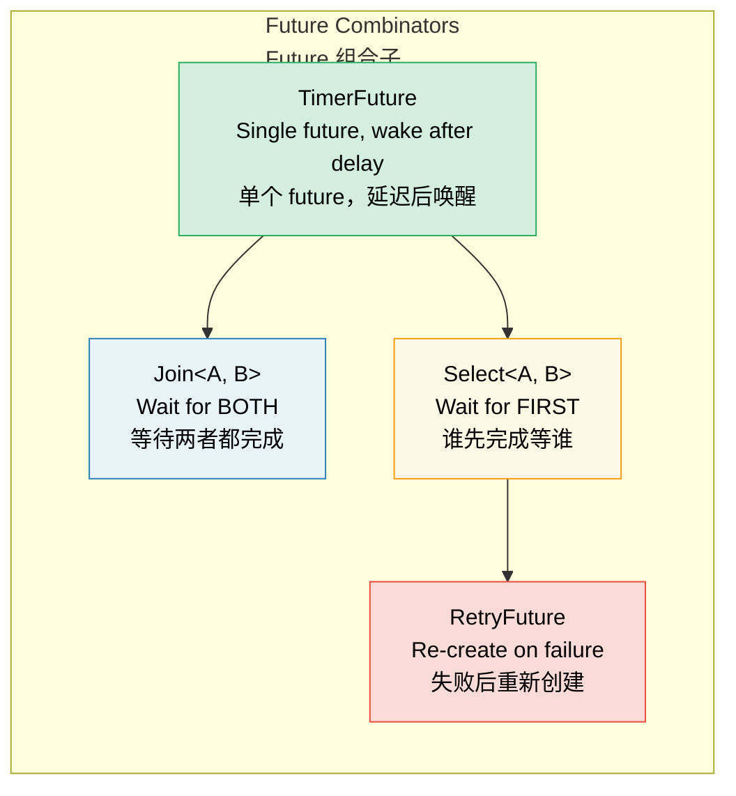

# 6. Building Futures by Hand 🟡<br><span class="zh-inline">6. 亲手构建 Future 🟡</span>

> **What you'll learn:**<br><span class="zh-inline">**本章将学到什么：**</span>
> - Implementing a `TimerFuture` with thread-based waking<br><span class="zh-inline">如何实现一个依靠线程唤醒的 `TimerFuture`</span>
> - Building a `Join` combinator: run two futures concurrently<br><span class="zh-inline">如何构建 `Join` 组合子：并发推进两个 future</span>
> - Building a `Select` combinator: race two futures<br><span class="zh-inline">如何构建 `Select` 组合子：让两个 future 赛跑</span>
> - How combinators compose — futures all the way down<br><span class="zh-inline">组合子是如何层层嵌套的：归根到底还是 future 套 future</span>

## A Simple Timer Future<br><span class="zh-inline">一个简单的计时器 Future</span>

Now let's build some real and useful futures from scratch. This chapter is where chapters 2 through 5 really settle into muscle memory.<br><span class="zh-inline">现在开始从零手搓一些真正有用的 future。前面第 2 到第 5 章讲过的那些概念，到这里才算真正被钉牢。</span>

### TimerFuture: A Complete Example<br><span class="zh-inline">`TimerFuture`：一个完整例子</span>

```rust
use std::future::Future;
use std::pin::Pin;
use std::sync::{Arc, Mutex};
use std::task::{Context, Poll, Waker};
use std::thread;
use std::time::{Duration, Instant};

pub struct TimerFuture {
    shared_state: Arc<Mutex<SharedState>>,
}

struct SharedState {
    completed: bool,
    waker: Option<Waker>,
}

impl TimerFuture {
    pub fn new(duration: Duration) -> Self {
        let shared_state = Arc::new(Mutex::new(SharedState {
            completed: false,
            waker: None,
        }));

        // Spawn a thread that sets completed=true after the duration
        let thread_shared_state = Arc::clone(&shared_state);
        thread::spawn(move || {
            thread::sleep(duration);
            let mut state = thread_shared_state.lock().unwrap();
            state.completed = true;
            if let Some(waker) = state.waker.take() {
                waker.wake(); // Notify the executor
            }
        });

        TimerFuture { shared_state }
    }
}

impl Future for TimerFuture {
    type Output = ();

    fn poll(self: Pin<&mut Self>, cx: &mut Context<'_>) -> Poll<()> {
        let mut state = self.shared_state.lock().unwrap();
        if state.completed {
            Poll::Ready(())
        } else {
            // Store the waker so the timer thread can wake us
            // IMPORTANT: Always update the waker — the executor may
            // have changed it between polls
            state.waker = Some(cx.waker().clone());
            Poll::Pending
        }
    }
}

// Usage:
// async fn example() {
//     println!("Starting timer...");
//     TimerFuture::new(Duration::from_secs(2)).await;
//     println!("Timer done!");
// }
//
// ⚠️ This spawns an OS thread per timer — fine for learning, but in
// production use `tokio::time::sleep` which is backed by a shared
// timer wheel and requires zero extra threads.
```

This example has all the moving pieces a real future needs: state storage, a `poll()` method, and a way to wake the executor later.<br><span class="zh-inline">这个例子已经把一个真实 future 需要的零件全摆出来了：状态存储、`poll()` 实现，以及稍后重新唤醒执行器的办法。</span>

### Join: Running Two Futures Concurrently<br><span class="zh-inline">`Join`：并发推进两个 Future</span>

`Join` polls two futures and finishes only when *both* are complete. This is the core idea behind `tokio::join!`.<br><span class="zh-inline">`Join` 会同时轮询两个 future，只有当 *两者都完成* 时才算结束。这就是 `tokio::join!` 背后的核心思路。</span>

```rust
use std::future::Future;
use std::pin::Pin;
use std::task::{Context, Poll};

/// Polls two futures concurrently, returns both results as a tuple
pub struct Join<A, B>
where
    A: Future,
    B: Future,
{
    a: MaybeDone<A>,
    b: MaybeDone<B>,
}

enum MaybeDone<F: Future> {
    Pending(F),
    Done(F::Output),
    Taken, // Output has been taken
}

impl<A, B> Join<A, B>
where
    A: Future,
    B: Future,
{
    pub fn new(a: A, b: B) -> Self {
        Join {
            a: MaybeDone::Pending(a),
            b: MaybeDone::Pending(b),
        }
    }
}

impl<A, B> Future for Join<A, B>
where
    A: Future + Unpin,
    B: Future + Unpin,
{
    type Output = (A::Output, B::Output);

    fn poll(mut self: Pin<&mut Self>, cx: &mut Context<'_>) -> Poll<Self::Output> {
        // Poll A if not done
        if let MaybeDone::Pending(ref mut fut) = self.a {
            if let Poll::Ready(val) = Pin::new(fut).poll(cx) {
                self.a = MaybeDone::Done(val);
            }
        }

        // Poll B if not done
        if let MaybeDone::Pending(ref mut fut) = self.b {
            if let Poll::Ready(val) = Pin::new(fut).poll(cx) {
                self.b = MaybeDone::Done(val);
            }
        }

        // Both done?
        match (&self.a, &self.b) {
            (MaybeDone::Done(_), MaybeDone::Done(_)) => {
                // Take both outputs
                let a_val = match std::mem::replace(&mut self.a, MaybeDone::Taken) {
                    MaybeDone::Done(v) => v,
                    _ => unreachable!(),
                };
                let b_val = match std::mem::replace(&mut self.b, MaybeDone::Taken) {
                    MaybeDone::Done(v) => v,
                    _ => unreachable!(),
                };
                Poll::Ready((a_val, b_val))
            }
            _ => Poll::Pending, // At least one is still pending
        }
    }
}

// Usage:
// let (page1, page2) = Join::new(
//     http_get("https://example.com/a"),
//     http_get("https://example.com/b"),
// ).await;
// Both requests run concurrently!
```

> **Key insight**: “Concurrent” here means *interleaved on the same thread*. `Join` does not create threads; it simply polls both child futures during the same `poll()` cycle.<br><span class="zh-inline">**关键理解：** 这里的“并发”指的是 *在同一线程上交错推进*。`Join` 不会新开线程，它只是把两个子 future 放进同一个 `poll()` 周期里轮着推。</span>



### Select: Racing Two Futures<br><span class="zh-inline">`Select`：让两个 Future 赛跑</span>

`Select` finishes as soon as *either* future completes, and whichever future loses the race gets dropped.<br><span class="zh-inline">`Select` 只要发现 *任意一个* future 先完成，就立即结束，输掉赛跑的那个 future 会被直接丢弃。</span>

```rust
use std::future::Future;
use std::pin::Pin;
use std::task::{Context, Poll};

pub enum Either<A, B> {
    Left(A),
    Right(B),
}

/// Returns whichever future completes first; drops the other
pub struct Select<A, B> {
    a: A,
    b: B,
}

impl<A, B> Select<A, B>
where
    A: Future + Unpin,
    B: Future + Unpin,
{
    pub fn new(a: A, b: B) -> Self {
        Select { a, b }
    }
}

impl<A, B> Future for Select<A, B>
where
    A: Future + Unpin,
    B: Future + Unpin,
{
    type Output = Either<A::Output, B::Output>;

    fn poll(mut self: Pin<&mut Self>, cx: &mut Context<'_>) -> Poll<Self::Output> {
        // Poll A first
        if let Poll::Ready(val) = Pin::new(&mut self.a).poll(cx) {
            return Poll::Ready(Either::Left(val));
        }

        // Then poll B
        if let Poll::Ready(val) = Pin::new(&mut self.b).poll(cx) {
            return Poll::Ready(Either::Right(val));
        }

        Poll::Pending
    }
}

// Usage with timeout:
// match Select::new(http_get(url), TimerFuture::new(timeout)).await {
//     Either::Left(response) => println!("Got response: {}", response),
//     Either::Right(()) => println!("Request timed out!"),
// }
```

> **Fairness note**: this hand-written `Select` always polls `A` first, so if both futures are ready at the same time, `A` always wins. Tokio's `select!` randomizes polling order to make this fairer.<br><span class="zh-inline">**公平性提示：** 这个手写版 `Select` 总是先轮询 `A`，所以如果两个 future 同时 ready，`A` 永远获胜。Tokio 的 `select!` 会对轮询顺序做随机化，以减少这种偏置。</span>

<details>
<summary><strong>🏋️ Exercise: Build a RetryFuture</strong><br><span class="zh-inline"><strong>🏋️ 练习：实现一个 RetryFuture</strong></span></summary>

**Challenge**: Build a `RetryFuture<F, Fut>` that accepts a closure `F: Fn() -> Fut` and retries up to N times if the inner future returns `Err`. It should yield the first `Ok` result, or the last `Err` if all attempts fail.<br><span class="zh-inline">**挑战**：实现一个 `RetryFuture&lt;F, Fut&gt;`，它接收闭包 `F: Fn() -> Fut`，当内部 future 返回 `Err` 时最多重试 N 次。结果应该是第一个 `Ok`，或者在所有尝试都失败后返回最后一个 `Err`。</span>

*Hint*: You'll need states for “currently running an attempt” and “all attempts exhausted.”<br><span class="zh-inline">*提示*：至少需要区分“当前正在执行某次尝试”和“所有尝试次数都已经耗尽”这两类状态。</span>

<details>
<summary>🔑 Solution<br><span class="zh-inline">🔑 参考答案</span></summary>

```rust
use std::future::Future;
use std::pin::Pin;
use std::task::{Context, Poll};

pub struct RetryFuture<F, Fut, T, E>
where
    F: Fn() -> Fut,
    Fut: Future<Output = Result<T, E>> + Unpin,
{
    factory: F,
    current: Option<Fut>,
    remaining: usize,
    last_error: Option<E>,
}

impl<F, Fut, T, E> RetryFuture<F, Fut, T, E>
where
    F: Fn() -> Fut,
    Fut: Future<Output = Result<T, E>> + Unpin,
{
    pub fn new(max_attempts: usize, factory: F) -> Self {
        let current = Some((factory)());
        RetryFuture {
            factory,
            current,
            remaining: max_attempts.saturating_sub(1),
            last_error: None,
        }
    }
}

impl<F, Fut, T, E> Future for RetryFuture<F, Fut, T, E>
where
    F: Fn() -> Fut + Unpin,
    Fut: Future<Output = Result<T, E>> + Unpin,
    T: Unpin,
    E: Unpin,
{
    type Output = Result<T, E>;

    fn poll(mut self: Pin<&mut Self>, cx: &mut Context<'_>) -> Poll<Self::Output> {
        loop {
            if let Some(ref mut fut) = self.current {
                match Pin::new(fut).poll(cx) {
                    Poll::Ready(Ok(val)) => return Poll::Ready(Ok(val)),
                    Poll::Ready(Err(e)) => {
                        self.last_error = Some(e);
                        if self.remaining > 0 {
                            self.remaining -= 1;
                            self.current = Some((self.factory)());
                            // Loop to poll the new future immediately
                        } else {
                            return Poll::Ready(Err(self.last_error.take().unwrap()));
                        }
                    }
                    Poll::Pending => return Poll::Pending,
                }
            } else {
                return Poll::Ready(Err(self.last_error.take().unwrap()));
            }
        }
    }
}

// Usage:
// let result = RetryFuture::new(3, || async {
//     http_get("https://flaky-server.com/api").await
// }).await;
```

**Key takeaway**: the retry future is itself another state machine. It remembers the current attempt, stores the last error, and recreates a new inner future whenever another attempt is needed.<br><span class="zh-inline">**核心收获：** 重试 future 本身又是一个状态机。它要记住当前尝试、保存上一次错误，并在需要重试时重新创建新的内部 future。</span>

</details>
</details>

> **Key Takeaways — Building Futures by Hand**<br><span class="zh-inline">**本章要点——亲手构建 Future**</span>
> - A future needs three essentials: state, a `poll()` implementation, and waker registration<br><span class="zh-inline">一个 future 至少需要三样东西：状态、`poll()` 实现，以及 waker 注册逻辑</span>
> - `Join` polls both child futures; `Select` returns whichever finishes first<br><span class="zh-inline">`Join` 会轮询两个子 future；`Select` 则返回先完成的那个</span>
> - Combinators are futures wrapping other futures — everything keeps nesting<br><span class="zh-inline">组合子本质上也是 future，只不过它包着别的 future，一层套一层</span>
> - Hand-writing futures helps build直觉，但生产代码里优先用 `tokio::join!` 和 `select!`<br><span class="zh-inline">亲手写 future 很能建立直觉，但在生产代码里，优先使用 `tokio::join!` 和 `select!` 这类成熟工具</span>

> **See also:** [Ch 2 — The Future Trait](ch02-the-future-trait.md) for the trait definition, [Ch 8 — Tokio Deep Dive](ch08-tokio-deep-dive.md) for production-grade equivalents.<br><span class="zh-inline">**继续阅读：** [第 2 章——The Future Trait](ch02-the-future-trait.md) 会回到 trait 定义本身，[第 8 章——Tokio Deep Dive](ch08-tokio-deep-dive.md) 会给出生产级替代方案。</span>

***
