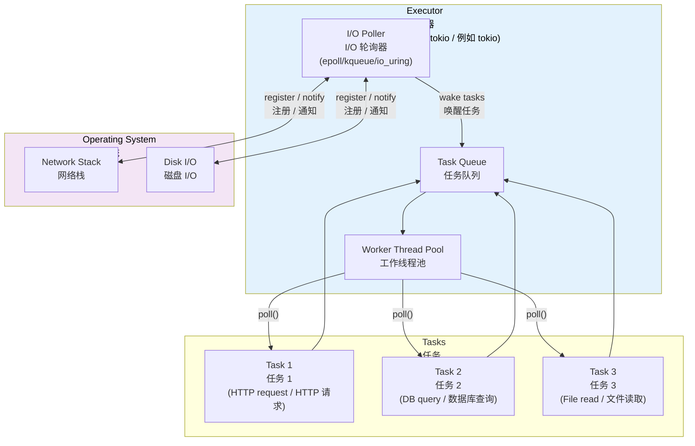
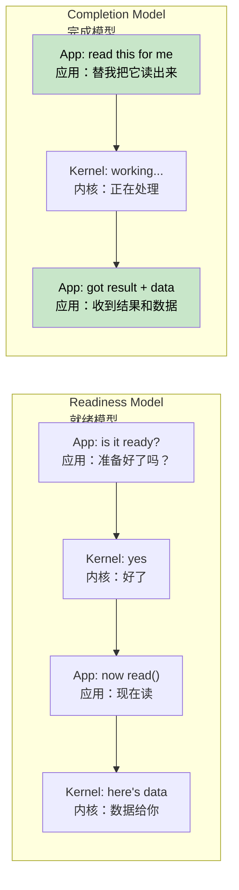
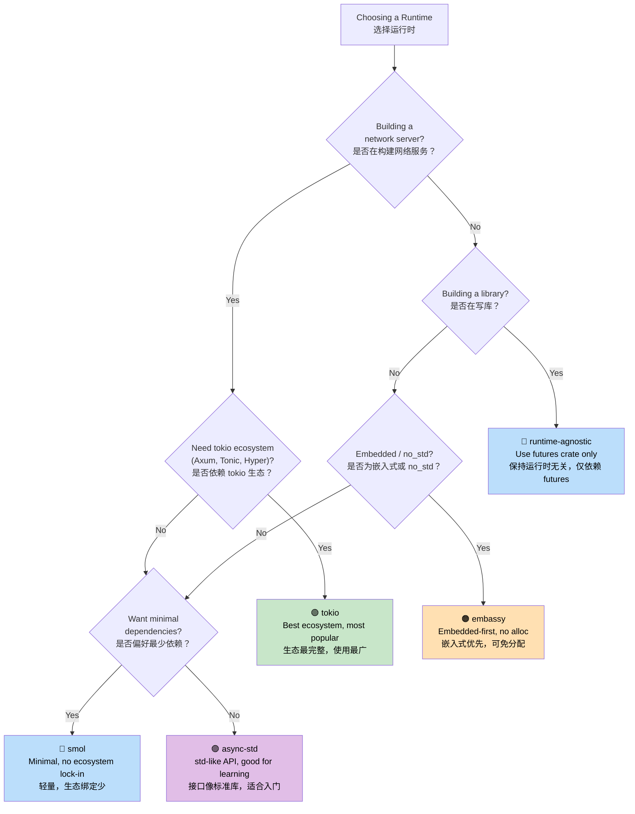

# 7. Executors and Runtimes 🟡<br><span class="zh-inline">7. 执行器与运行时 🟡</span>

> **What you'll learn:**<br><span class="zh-inline">本章将学习：</span>
> - What an executor does: poll + sleep efficiently<br><span class="zh-inline">执行器的职责：在合适时机轮询，并在空闲时高效休眠</span>
> - The six major runtimes: mio, io_uring, tokio, async-std, smol, embassy<br><span class="zh-inline">六类关键运行时与基础设施：mio、io_uring、tokio、async-std、smol、embassy</span>
> - A decision tree for choosing the right runtime<br><span class="zh-inline">如何根据场景选择合适运行时</span>
> - Why runtime-agnostic library design matters<br><span class="zh-inline">为什么库设计应尽量保持运行时无关</span>

## What an Executor Does<br><span class="zh-inline">执行器到底做什么</span>

An executor has two jobs:<br><span class="zh-inline">执行器主要负责两件事：</span>

1. **Poll futures** when they're ready to make progress<br><span class="zh-inline">在 Future 可以继续推进时对其进行 `poll`</span>
2. **Sleep efficiently** when no futures are ready using OS I/O notification APIs<br><span class="zh-inline">当暂时没有 Future 可推进时，借助操作系统的 I/O 通知机制高效休眠</span>



### mio: The Foundation Layer<br><span class="zh-inline">mio：底层基座</span>

[mio](https://github.com/tokio-rs/mio) (Metal I/O) is not an executor. It is the lowest-level cross-platform I/O notification library. It wraps `epoll` on Linux, `kqueue` on macOS and BSD, and IOCP on Windows.<br><span class="zh-inline">[mio](https://github.com/tokio-rs/mio) 意为 Metal I/O，它本身并不是执行器，而是跨平台 I/O 通知能力的底层抽象。它对 Linux 的 `epoll`、macOS 和 BSD 的 `kqueue`、以及 Windows 的 IOCP 做了统一封装。</span>

```rust
// Conceptual mio usage (simplified):
use mio::{Events, Interest, Poll, Token};
use mio::net::TcpListener;

let mut poll = Poll::new()?;
let mut events = Events::with_capacity(128);

let mut server = TcpListener::bind("0.0.0.0:8080")?;
poll.registry().register(&mut server, Token(0), Interest::READABLE)?;

// Event loop — blocks until something happens
loop {
    poll.poll(&mut events, None)?; // Sleeps until I/O event
    for event in events.iter() {
        match event.token() {
            Token(0) => { /* server has a new connection */ }
            _ => { /* other I/O ready */ }
        }
    }
}
```

Most developers never touch mio directly. Tokio and smol sit on top of it.<br><span class="zh-inline">多数开发者并不会直接操作 mio，tokio 和 smol 这类运行时已经把它包在更上层的抽象之下。</span>

### io_uring: The Completion-Based Future<br><span class="zh-inline">io_uring：基于完成通知的未来方向</span>

Linux `io_uring` requires kernel 5.1 or newer. It represents a fundamental shift from the readiness-based I/O model used by mio and epoll.<br><span class="zh-inline">Linux 的 `io_uring` 需要 5.1 及以上内核，它代表了一种和 mio、epoll 所采用的“就绪通知模型”截然不同的思路。</span>

```text
Readiness-based (epoll / mio / tokio):
  1. Ask: "Is this socket readable?"     → epoll_wait()
  2. Kernel: "Yes, it's ready"           → EPOLLIN event
  3. App:   read(fd, buf)                → might still block briefly!

Completion-based (io_uring):
  1. Submit: "Read from this socket into this buffer"  → SQE
  2. Kernel: does the read asynchronously
  3. App:   gets completed result with data            → CQE
```

<span class="zh-inline">
基于就绪的模型（epoll / mio / tokio）：<br>
1. 先问：“这个 socket 现在可读吗？” → `epoll_wait()`<br>
2. 内核回答：“可读了。” → 收到 `EPOLLIN` 事件<br>
3. 应用再调用 `read(fd, buf)` → 这一步仍可能出现短暂阻塞
<br><br>
基于完成的模型（io_uring）：<br>
1. 直接提交：“把这个 socket 读进这个缓冲区。” → SQE<br>
2. 内核异步执行读取<br>
3. 应用收到“已完成”的结果与数据 → CQE
</span>



**The ownership challenge**: `io_uring` needs the kernel to own the buffer until the operation completes. That clashes with Rust's standard `AsyncRead` trait, which only borrows the buffer. This is why `tokio-uring` exposes different I/O traits.<br><span class="zh-inline">**所有权上的难点**：`io_uring` 需要在操作完成前把缓冲区控制权交给内核，而 Rust 标准 `AsyncRead` trait 只借用缓冲区。这就是 `tokio-uring` 必须设计不同 I/O trait 的原因。</span>

```rust
// Standard tokio (readiness-based) — borrows the buffer:
let n = stream.read(&mut buf).await?;  // buf is borrowed

// tokio-uring (completion-based) — takes ownership of the buffer:
let (result, buf) = stream.read(buf).await;  // buf is moved in, returned back
let n = result?;
```

```rust
// Cargo.toml: tokio-uring = "0.5"
// NOTE: Linux-only, requires kernel 5.1+

fn main() {
    tokio_uring::start(async {
        let file = tokio_uring::fs::File::open("data.bin").await.unwrap();
        let buf = vec![0u8; 4096];
        let (result, buf) = file.read_at(buf, 0).await;
        let bytes_read = result.unwrap();
        println!("Read {} bytes: {:?}", bytes_read, &buf[..bytes_read]);
    });
}
```

| Aspect<br><span class="zh-inline">维度</span> | epoll (tokio)<br><span class="zh-inline">epoll（tokio）</span> | io_uring (tokio-uring)<br><span class="zh-inline">io_uring（tokio-uring）</span> |
|--------|--------------|----------------------|
| **Model**<br><span class="zh-inline">模型</span> | Readiness notification<br><span class="zh-inline">就绪通知</span> | Completion notification<br><span class="zh-inline">完成通知</span> |
| **Syscalls**<br><span class="zh-inline">系统调用</span> | `epoll_wait + read/write` | Batched SQE/CQE ring<br><span class="zh-inline">批量 SQE/CQE 环</span> |
| **Buffer ownership**<br><span class="zh-inline">缓冲区所有权</span> | App retains (`&mut buf`)<br><span class="zh-inline">应用保留所有权</span> | Ownership transfer (`move buf`)<br><span class="zh-inline">所有权转移给内核</span> |
| **Platform**<br><span class="zh-inline">平台</span> | Linux, macOS, Windows | Linux 5.1+ only<br><span class="zh-inline">仅 Linux 5.1+</span> |
| **Zero-copy**<br><span class="zh-inline">零拷贝</span> | No<br><span class="zh-inline">否</span> | Yes<br><span class="zh-inline">是</span> |
| **Maturity**<br><span class="zh-inline">成熟度</span> | Production-ready<br><span class="zh-inline">生产可用</span> | Experimental<br><span class="zh-inline">实验性</span> |

> **When to use io_uring**: Use it when high-throughput networking or file I/O is bottlenecked by syscall overhead, such as databases, storage engines, or proxies serving 100k+ connections. For most applications, standard tokio is still the correct default.<br><span class="zh-inline">**什么时候该用 io_uring**：当网络或文件 I/O 的系统调用开销已经成为主要瓶颈，例如数据库、存储引擎、或者需要支撑十万级连接的代理服务时，再认真考虑它。对绝大多数应用而言，标准 tokio 依旧是更合适的默认方案。</span>

### tokio: The Batteries-Included Runtime<br><span class="zh-inline">tokio：配套最完整的运行时</span>

Tokio is the dominant async runtime in the Rust ecosystem. Axum, Hyper, Tonic, and most production Rust servers build on top of it.<br><span class="zh-inline">Tokio 是 Rust 生态里最主流的异步运行时。Axum、Hyper、Tonic，以及大多数生产级 Rust 服务都建立在它之上。</span>

```rust
// Cargo.toml:
// [dependencies]
// tokio = { version = "1", features = ["full"] }

#[tokio::main]
async fn main() {
    // Spawns a multi-threaded runtime with work-stealing scheduler
    let handle = tokio::spawn(async {
        tokio::time::sleep(std::time::Duration::from_secs(1)).await;
        "done"
    });

    let result = handle.await.unwrap();
    println!("{result}");
}
```

**tokio features**: timers, I/O, TCP and UDP, Unix sockets, signal handling, synchronization primitives, filesystem access, process management, and tracing integration.<br><span class="zh-inline">**tokio 自带能力**：定时器、I/O、TCP/UDP、Unix Socket、信号处理、同步原语、文件系统、进程管理，以及和 `tracing` 的集成。</span>

### async-std: The Standard Library Mirror<br><span class="zh-inline">async-std：贴近标准库风格</span>

`async-std` offers async APIs that mirror `std`. It is less popular than tokio, but many newcomers feel it is easier to approach.<br><span class="zh-inline">`async-std` 试图提供一套与 `std` 形态相近的异步 API。它的生态热度低于 tokio，但对于初学者来说通常更直观一些。</span>

```rust
// Cargo.toml:
// [dependencies]
// async-std = { version = "1", features = ["attributes"] }

#[async_std::main]
async fn main() {
    use async_std::fs;
    let content = fs::read_to_string("hello.txt").await.unwrap();
    println!("{content}");
}
```

### smol: The Minimalist Runtime<br><span class="zh-inline">smol：极简派运行时</span>

Smol is a compact, low-dependency async runtime. It is useful for libraries that want async support without pulling in the full tokio stack.<br><span class="zh-inline">Smol 是一个体量小、依赖少的异步运行时。对于想提供异步能力、又不愿意把整套 tokio 依赖拖进来的库来说，它很合适。</span>

```rust
// Cargo.toml:
// [dependencies]
// smol = "2"

fn main() {
    smol::block_on(async {
        let result = smol::unblock(|| {
            // Runs blocking code on a thread pool
            std::fs::read_to_string("hello.txt")
        }).await.unwrap();
        println!("{result}");
    });
}
```

### embassy: Async for Embedded (no_std)<br><span class="zh-inline">embassy：面向嵌入式的异步方案</span>

Embassy targets embedded systems. It avoids heap allocation, works without `std`, and fits microcontrollers well.<br><span class="zh-inline">Embassy 面向嵌入式系统，通常无需堆分配，也不依赖 `std`，非常适合微控制器环境。</span>

```rust
// Runs on microcontrollers (e.g., STM32, nRF52, RP2040)
#[embassy_executor::main]
async fn main(spawner: embassy_executor::Spawner) {
    // Blink an LED with async/await — no RTOS needed!
    let mut led = Output::new(p.PA5, Level::Low, Speed::Low);
    loop {
        led.set_high();
        Timer::after(Duration::from_millis(500)).await;
        led.set_low();
        Timer::after(Duration::from_millis(500)).await;
    }
}
```

### Runtime Decision Tree<br><span class="zh-inline">运行时选择树</span>



### Runtime Comparison Table<br><span class="zh-inline">运行时对比表</span>

| Feature<br><span class="zh-inline">特性</span> | tokio | async-std | smol | embassy |
|---------|-------|-----------|------|---------|
| **Ecosystem**<br><span class="zh-inline">生态</span> | Dominant<br><span class="zh-inline">主流</span> | Small<br><span class="zh-inline">较小</span> | Minimal<br><span class="zh-inline">精简</span> | Embedded<br><span class="zh-inline">嵌入式</span> |
| **Multi-threaded**<br><span class="zh-inline">多线程</span> | ✅ Work-stealing<br><span class="zh-inline">支持工作窃取</span> | ✅ | ✅ | ❌ Single-core<br><span class="zh-inline">单核场景为主</span> |
| **no_std**<br><span class="zh-inline">支持 `no_std`</span> | ❌ | ❌ | ❌ | ✅ |
| **Timer**<br><span class="zh-inline">定时器</span> | ✅ Built-in<br><span class="zh-inline">内建</span> | ✅ Built-in<br><span class="zh-inline">内建</span> | Via `async-io`<br><span class="zh-inline">依赖 `async-io`</span> | ✅ HAL-based<br><span class="zh-inline">基于 HAL</span> |
| **I/O**<br><span class="zh-inline">I/O</span> | ✅ Own abstractions<br><span class="zh-inline">自有抽象</span> | ✅ std mirror<br><span class="zh-inline">贴近 `std`</span> | ✅ Via `async-io`<br><span class="zh-inline">经由 `async-io`</span> | ✅ HAL drivers<br><span class="zh-inline">HAL 驱动</span> |
| **Channels**<br><span class="zh-inline">通道</span> | ✅ Rich set<br><span class="zh-inline">种类丰富</span> | ✅ | Via `async-channel`<br><span class="zh-inline">依赖 `async-channel`</span> | ✅ |
| **Learning curve**<br><span class="zh-inline">学习成本</span> | Medium<br><span class="zh-inline">中等</span> | Low<br><span class="zh-inline">较低</span> | Low<br><span class="zh-inline">较低</span> | High<br><span class="zh-inline">较高，需要硬件背景</span> |
| **Binary size**<br><span class="zh-inline">二进制体积</span> | Large<br><span class="zh-inline">较大</span> | Medium<br><span class="zh-inline">中等</span> | Small<br><span class="zh-inline">较小</span> | Tiny<br><span class="zh-inline">很小</span> |

<details>
<summary><strong>🏋️ Exercise: Runtime Comparison</strong><br><span class="zh-inline"><strong>🏋️ 练习：运行时对比</strong></span></summary>

**Challenge**: Write the same program using three different runtimes: tokio, smol, and async-std. The program should fetch a URL, read a file, and print both results. Here both operations can be simulated with sleeps.<br><span class="zh-inline">**挑战**：分别用 tokio、smol 和 async-std 写出同一个程序。程序需要获取一个 URL、读取一个文件，然后打印两个结果。这里可以用休眠来模拟这两类操作。</span>

This exercise shows that most async business logic stays the same. What changes is the runtime bootstrap and the timer or I/O API surface.<br><span class="zh-inline">这个练习要强调的是：异步业务逻辑大多相同，变化主要集中在运行时入口以及计时器、I/O 相关 API 的样式上。</span>

<details>
<summary>🔑 Solution<br><span class="zh-inline">🔑 参考答案</span></summary>

```rust
// ----- tokio version -----
// Cargo.toml: tokio = { version = "1", features = ["full"] }
#[tokio::main]
async fn main() {
    let (url_result, file_result) = tokio::join!(
        async {
            tokio::time::sleep(std::time::Duration::from_millis(100)).await;
            "Response from URL"
        },
        async {
            tokio::time::sleep(std::time::Duration::from_millis(50)).await;
            "Contents of file"
        },
    );
    println!("URL: {url_result}, File: {file_result}");
}

// ----- smol version -----
// Cargo.toml: smol = "2", futures-lite = "2"
fn main() {
    smol::block_on(async {
        let (url_result, file_result) = futures_lite::future::zip(
            async {
                smol::Timer::after(std::time::Duration::from_millis(100)).await;
                "Response from URL"
            },
            async {
                smol::Timer::after(std::time::Duration::from_millis(50)).await;
                "Contents of file"
            },
        ).await;
        println!("URL: {url_result}, File: {file_result}");
    });
}

// ----- async-std version -----
// Cargo.toml: async-std = { version = "1", features = ["attributes"] }
#[async_std::main]
async fn main() {
    let (url_result, file_result) = futures::future::join(
        async {
            async_std::task::sleep(std::time::Duration::from_millis(100)).await;
            "Response from URL"
        },
        async {
            async_std::task::sleep(std::time::Duration::from_millis(50)).await;
            "Contents of file"
        },
    ).await;
    println!("URL: {url_result}, File: {file_result}");
}
```

**Key takeaway**: The business logic remains identical across runtimes. Entry points and helper APIs are the main differences. That is why runtime-agnostic libraries built on `std::future::Future` are so valuable.<br><span class="zh-inline">**核心收获**：不同运行时之间，业务逻辑几乎不变，主要变化点在入口和辅助 API 上。这也说明，建立在 `std::future::Future` 之上的运行时无关库会更有长期价值。</span>

</details>
</details>

> **Key Takeaways — Executors and Runtimes**<br><span class="zh-inline">**本章要点——执行器与运行时**</span>
> - An executor polls futures when woken and sleeps efficiently using OS I/O APIs<br><span class="zh-inline">执行器会在 Future 被唤醒时轮询它，并在空闲时依靠操作系统 I/O 机制高效休眠</span>
> - **tokio** is the default choice for servers, **smol** fits minimal footprints, and **embassy** is for embedded systems<br><span class="zh-inline">**tokio** 适合作为服务端默认方案，**smol** 适合追求轻量依赖，**embassy** 面向嵌入式场景</span>
> - Business logic should depend on `std::future::Future`, not on a specific runtime type<br><span class="zh-inline">业务逻辑应依赖 `std::future::Future`，而不是把自己绑死在某个运行时类型上</span>
> - `io_uring` may become a major direction for high-performance I/O, but the ecosystem is still maturing<br><span class="zh-inline">`io_uring` 可能会成为高性能 I/O 的重要方向，但整个生态仍在持续完善</span>

> **See also:** [Ch 8 — Tokio Deep Dive](ch08-tokio-deep-dive.md) for tokio specifics, [Ch 9 — When Tokio Isn't the Right Fit](ch09-when-tokio-isnt-the-right-fit.md) for alternatives.<br><span class="zh-inline">**延伸阅读：** [第 8 章——Tokio 深入解析](ch08-tokio-deep-dive.md) 关注 tokio 细节，[第 9 章——什么时候 Tokio 不是最佳选择](ch09-when-tokio-isnt-the-right-fit.md) 讨论替代方案。</span>

***
