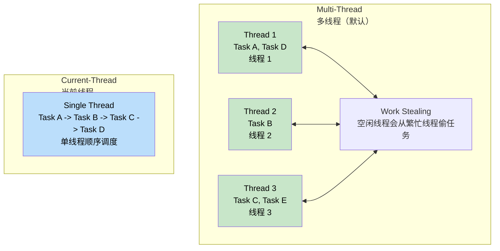
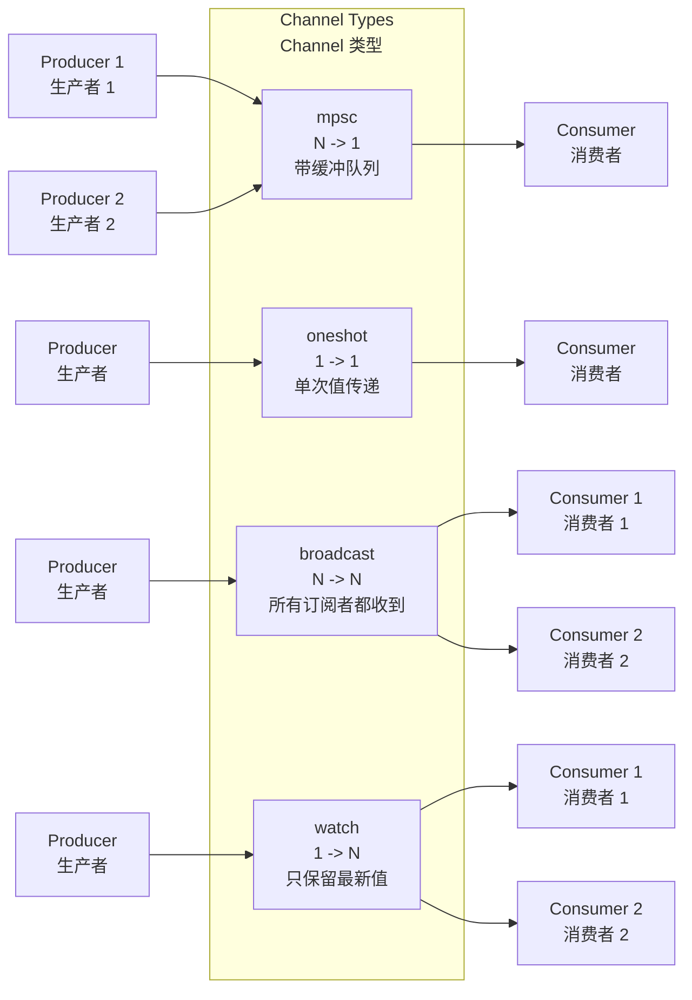
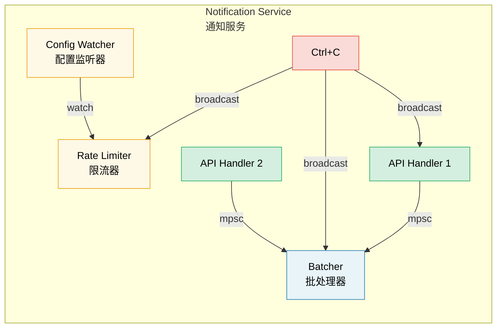

# 8. Tokio Deep Dive 🟡<br><span class="zh-inline">8. Tokio 深入剖析 🟡</span>

> **What you'll learn:**<br><span class="zh-inline">**本章将学到什么：**</span>
> - Runtime flavors: multi-thread vs current-thread and when to use each<br><span class="zh-inline">运行时的两种风格：多线程和当前线程，以及它们各自适合什么场景</span>
> - `tokio::spawn`, the `'static` requirement, and `JoinHandle`<br><span class="zh-inline">`tokio::spawn`、`'static` 约束，以及 `JoinHandle` 的行为</span>
> - Task cancellation semantics<br><span class="zh-inline">任务取消的语义</span>
> - Sync primitives: `Mutex`、`RwLock`、`Semaphore` and four channel types<br><span class="zh-inline">同步原语：`Mutex`、`RwLock`、`Semaphore`，以及四种 channel</span>

## Runtime Flavors: Multi-Thread vs Current-Thread<br><span class="zh-inline">运行时风格：多线程与当前线程</span>

Tokio provides two major runtime configurations:<br><span class="zh-inline">Tokio 主要提供两种运行时配置：</span>

```rust
// Multi-threaded (default with #[tokio::main])
// Uses a work-stealing thread pool
#[tokio::main]
async fn main() {
    // N worker threads (default = CPU core count)
    // Tasks must be Send + 'static
}

// Current-thread — everything stays on one thread
#[tokio::main(flavor = "current_thread")]
async fn main() {
    // Single-threaded
    // Tasks do not need to be Send
    // Good for small tools or WASM
}

// Manual runtime construction
let rt = tokio::runtime::Builder::new_multi_thread()
    .worker_threads(4)
    .enable_all()
    .build()
    .unwrap();

rt.block_on(async {
    println!("Running on custom runtime");
});
```



Multi-thread runtimes are the default choice for servers and background systems with lots of independent work. Current-thread runtimes are lighter, easier to reason about, and especially useful when tasks are `!Send`, or when the whole program is intentionally single-threaded.<br><span class="zh-inline">多线程运行时通常是服务端和后台系统的默认选择，适合并发任务很多的场景。当前线程运行时更轻、更容易推理，特别适合 `!Send` 任务，或者本来就打算完全单线程执行的程序。</span>

### `tokio::spawn` and the `'static` Requirement<br><span class="zh-inline">`tokio::spawn` 与 `'static` 约束</span>

`tokio::spawn` places a future into Tokio's task queue. Because that task might run on any worker thread and might outlive the scope that created it, the future must be `Send + 'static`.<br><span class="zh-inline">`tokio::spawn` 会把一个 future 扔进 Tokio 的任务队列。由于这个任务可能在任意工作线程上运行，也可能活得比创建它的作用域还久，所以这个 future 必须满足 `Send + 'static`。</span>

```rust
use tokio::task;

async fn example() {
    let data = String::from("hello");

    // Works: ownership is moved into the task
    let handle = task::spawn(async move {
        println!("{data}");
        data.len()
    });

    let len = handle.await.unwrap();
    println!("Length: {len}");
}

async fn problem() {
    let data = String::from("hello");

    // Fails: borrows local data, so not 'static
    // task::spawn(async {
    //     println!("{data}");
    // });

    // Fails: Rc is !Send
    // let rc = std::rc::Rc::new(42);
    // task::spawn(async move {
    //     println!("{rc}");
    // });
}
```

**Why `'static`?** Because the task may outlive the caller's stack frame, borrowed references are not acceptable unless the compiler can prove they live forever.<br><span class="zh-inline">**为什么要 `'static`？** 因为任务可能活得比调用方栈帧还久，所以除非编译器能证明某个引用能一直有效，否则就不能把借用数据塞进去。</span>

**Why `Send`?** Because on a multi-thread runtime, a task may be resumed on a different worker thread after an `.await`, so anything carried across suspension points must be thread-transfer safe.<br><span class="zh-inline">**为什么要 `Send`？** 因为在多线程运行时里，一个任务在 `.await` 之后完全可能换到另一条线程继续执行，所以所有跨挂起点保存下来的数据都必须能安全跨线程移动。</span>

```rust
// Common pattern: clone shared ownership into each task
let shared = Arc::new(config);

for i in 0..10 {
    let shared = Arc::clone(&shared);
    tokio::spawn(async move {
        process_item(i, &shared).await;
    });
}
```

### `JoinHandle` and Task Cancellation<br><span class="zh-inline">`JoinHandle` 与任务取消</span>

```rust
use tokio::task::JoinHandle;
use tokio::time::{sleep, Duration};

async fn cancellation_example() {
    let handle: JoinHandle<String> = tokio::spawn(async {
        sleep(Duration::from_secs(10)).await;
        "completed".to_string()
    });

    // Dropping JoinHandle does NOT cancel the task
    // drop(handle);

    // Explicit cancellation
    handle.abort();

    match handle.await {
        Ok(val) => println!("Got: {val}"),
        Err(e) if e.is_cancelled() => println!("Task was cancelled"),
        Err(e) => println!("Task panicked: {e}"),
    }
}
```

> **Important:** Dropping a `JoinHandle` in Tokio does not cancel the task. It only detaches it. To cancel the task, call `.abort()` explicitly. That is very different from dropping a plain `Future`, which does cancel the computation by dropping it.<br><span class="zh-inline">**重要：** 在 Tokio 里，丢掉 `JoinHandle` 并不会取消任务，只会让任务脱离追踪继续后台运行。真想取消，就得显式调用 `.abort()`。这一点和直接丢弃普通 `Future` 很不一样，后者会随着被 drop 一起结束计算。</span>

### Tokio Sync Primitives<br><span class="zh-inline">Tokio 的同步原语</span>

Tokio provides async-aware synchronization primitives. The most important rule is simple: **do not hold `std::sync::Mutex` across `.await` points**.<br><span class="zh-inline">Tokio 提供了一套“知道自己活在异步环境里”的同步原语。最关键的一条规矩很简单：**不要把 `std::sync::Mutex` 的锁跨着 `.await` 持有**。</span>

```rust
use tokio::sync::{Mutex, RwLock, Semaphore, mpsc, oneshot, broadcast, watch};

// --- Mutex ---
let data = Arc::new(Mutex::new(vec![1, 2, 3]));
{
    let mut guard = data.lock().await;
    guard.push(4);
}

// --- Channels ---
// mpsc: multiple producers, single consumer
let (tx, mut rx) = mpsc::channel::<String>(100);

tokio::spawn(async move {
    tx.send("hello".into()).await.unwrap();
});

let msg = rx.recv().await.unwrap();

// oneshot: one value, one receiver
let (tx, rx) = oneshot::channel::<i32>();
tx.send(42).unwrap();
let val = rx.await.unwrap();

// broadcast: every subscriber receives every message
let (tx, _) = broadcast::channel::<String>(100);
let mut rx1 = tx.subscribe();
let mut rx2 = tx.subscribe();

// watch: only the latest value matters
let (tx, rx) = watch::channel(0u64);
tx.send(42).unwrap();
println!("Latest: {}", *rx.borrow());
```



## Case Study: Choosing the Right Channel for a Notification Service<br><span class="zh-inline">案例：通知服务里该怎么挑 channel</span>

Suppose a notification service has the following needs:<br><span class="zh-inline">假设有一个通知服务，需要满足下面这些条件：</span>

- Multiple API handlers produce events.<br><span class="zh-inline">多个 API handler 会产生日志或事件。</span>
- A single background task batches and sends them.<br><span class="zh-inline">有一个单独的后台任务负责批量发送。</span>
- A config watcher updates rate limits at runtime.<br><span class="zh-inline">配置监听器会在运行时更新限流参数。</span>
- A shutdown signal must reach every component.<br><span class="zh-inline">关停信号必须送达到所有组件。</span>

**Which channels match each requirement?**<br><span class="zh-inline">**每个需求分别该用哪种 channel？**</span>

| Requirement<br><span class="zh-inline">需求</span> | Channel | Why<br><span class="zh-inline">原因</span> |
|-------------|---------|-----|
| API handlers -> Batcher | `mpsc` (bounded) | Many producers, one consumer. Bounded capacity creates backpressure instead of silently OOMing.<br><span class="zh-inline">多生产者、单消费者。容量设成有界，批处理跟不上时会自然产生背压，而不是悄悄把内存吃爆。</span> |
| Config watcher -> Rate limiter | `watch` | Only the latest config matters, and many readers may want that latest value.<br><span class="zh-inline">这里只关心最新配置，而且多个读者都可能需要它。</span> |
| Shutdown signal -> All components | `broadcast` | Every component must independently receive the shutdown notification.<br><span class="zh-inline">每个组件都必须独立收到同一份关停通知。</span> |
| Single health-check response | `oneshot` | Standard one-request one-response shape.<br><span class="zh-inline">典型的一问一答模型。</span> |



<details>
<summary><strong>🏋️ Exercise: Build a Task Pool</strong> <span class="zh-inline">🏋️ 练习：实现一个任务池</span></summary>

**Challenge:** Implement a function `run_with_limit` that accepts a list of async closures plus a concurrency limit, and ensures at most `N` tasks run simultaneously. Use `tokio::sync::Semaphore`.<br><span class="zh-inline">**挑战题：** 实现一个 `run_with_limit` 函数，它接收一组异步闭包和一个并发上限，保证同一时间最多只有 `N` 个任务在跑。要求使用 `tokio::sync::Semaphore`。</span>

<details>
<summary>🔑 Solution <span class="zh-inline">🔑 参考答案</span></summary>

```rust
use std::future::Future;
use std::sync::Arc;
use tokio::sync::Semaphore;

async fn run_with_limit<F, Fut, T>(tasks: Vec<F>, limit: usize) -> Vec<T>
where
    F: FnOnce() -> Fut + Send + 'static,
    Fut: Future<Output = T> + Send + 'static,
    T: Send + 'static,
{
    let semaphore = Arc::new(Semaphore::new(limit));
    let mut handles = Vec::new();

    for task in tasks {
        let permit = Arc::clone(&semaphore);
        let handle = tokio::spawn(async move {
            let _permit = permit.acquire().await.unwrap();
            task().await
        });
        handles.push(handle);
    }

    let mut results = Vec::new();
    for handle in handles {
        results.push(handle.await.unwrap());
    }
    results
}
```

**Key takeaway:** `Semaphore` is Tokio's standard tool for concurrency limiting. Each task acquires a permit before starting work; when permits run out, later tasks wait asynchronously instead of blocking a worker thread.<br><span class="zh-inline">**要点：** `Semaphore` 就是 Tokio 里限制并发度的标准工具。每个任务开工前先拿一个 permit，permit 用光之后，后面的任务会异步等待，而不是把工作线程堵死。</span>

</details>
</details>

> **Key Takeaways — Tokio Deep Dive**<br><span class="zh-inline">**本章要点：Tokio 深入剖析**</span>
> - Use `multi_thread` for servers and heavier concurrent workloads; use `current_thread` for CLIs, tests, or `!Send` tasks.<br><span class="zh-inline">服务器和重并发任务优先选 `multi_thread`；CLI、小工具、测试或者 `!Send` 任务更适合 `current_thread`。</span>
> - `tokio::spawn` requires `'static` futures; `Arc` and channels are the common ways to share state safely.<br><span class="zh-inline">`tokio::spawn` 需要 `'static` future，常见解法是用 `Arc` 或 channel 共享状态。</span>
> - Dropping a `JoinHandle` does not cancel the task; use `.abort()` when cancellation is intentional.<br><span class="zh-inline">丢掉 `JoinHandle` 不会取消任务，真要取消就显式调用 `.abort()`。</span>
> - Pick sync primitives by problem shape: `Mutex` for shared mutable state, `Semaphore` for concurrency caps, and channels for communication flows.<br><span class="zh-inline">同步原语要按问题形状选：共享可变状态用 `Mutex`，并发限流用 `Semaphore`，任务之间传递消息就上 channel。</span>

> **See also:** [Ch 9 — When Tokio Isn't the Right Fit](ch09-when-tokio-isnt-the-right-fit.md) and [Ch 12 — Common Pitfalls](ch12-common-pitfalls.md).<br><span class="zh-inline">**继续阅读：** [第 9 章：什么时候 Tokio 并不合适](ch09-when-tokio-isnt-the-right-fit.md) 和 [第 12 章：常见陷阱](ch12-common-pitfalls.md)。</span>

***
