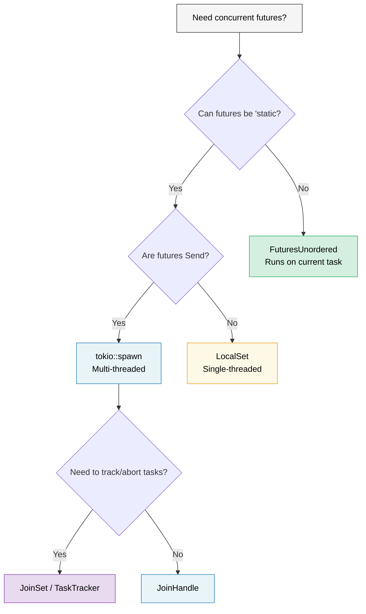

# 9. When Tokio Isn't the Right Fit 🟡<br><span class="zh-inline">9. Tokio 不一定合适的场景 🟡</span>

> **What you'll learn:**<br><span class="zh-inline">**本章将学到什么：**</span>
> - The `'static` problem: when `tokio::spawn` forces you into `Arc` everywhere<br><span class="zh-inline">`'static` 问题：什么时候 `tokio::spawn` 会逼得代码里到处都是 `Arc`</span>
> - `LocalSet` for `!Send` futures<br><span class="zh-inline">如何用 `LocalSet` 承载 `!Send` future</span>
> - `FuturesUnordered` for borrow-friendly concurrency (no spawn needed)<br><span class="zh-inline">如何用 `FuturesUnordered` 实现更适合借用的并发，而且不需要 spawn</span>
> - `JoinSet` for managed task groups<br><span class="zh-inline">如何用 `JoinSet` 管理成组任务</span>
> - Writing runtime-agnostic libraries<br><span class="zh-inline">怎样写对运行时无绑定的库</span>



## The 'static Future Problem<br><span class="zh-inline">`'static` Future 问题</span>

Tokio's `spawn` requires `'static` futures. This means you can't borrow local data in spawned tasks:<br><span class="zh-inline">Tokio 的 `spawn` 要求 future 满足 `'static`。这就意味着，被 spawn 出去的任务里没法直接借用局部数据：</span>

```rust
async fn process_items(items: &[String]) {
    // ❌ Can't do this — items is borrowed, not 'static
    // for item in items {
    //     tokio::spawn(async {
    //         process(item).await;
    //     });
    // }

    // 😐 Workaround 1: Clone everything
    for item in items {
        let item = item.clone();
        tokio::spawn(async move {
            process(&item).await;
        });
    }

    // 😐 Workaround 2: Use Arc
    let items = Arc::new(items.to_vec());
    for i in 0..items.len() {
        let items = Arc::clone(&items);
        tokio::spawn(async move {
            process(&items[i]).await;
        });
    }
}
```

This is annoying! In Go, you can just `go func() { use(item) }` with a closure. In Rust, the ownership system forces you to think about who owns what and how long it lives.<br><span class="zh-inline">这就很烦。在 Go 里，闭包一包，`go func() { use(item) }` 就完了。到了 Rust，所有权系统会逼着把“谁拥有数据、它能活多久”想得明明白白。</span>

### Scoped Tasks and Alternatives<br><span class="zh-inline">作用域任务与替代方案</span>

Several solutions exist for the `'static` problem:<br><span class="zh-inline">针对 `'static` 这件事，其实有好几条路可走：</span>

```rust
// 1. tokio::task::LocalSet — run !Send futures on current thread
use tokio::task::LocalSet;

let local_set = LocalSet::new();
local_set.run_until(async {
    tokio::task::spawn_local(async {
        // Can use Rc, Cell, and other !Send types here
        let rc = std::rc::Rc::new(42);
        println!("{rc}");
    }).await.unwrap();
}).await;

// 2. FuturesUnordered — concurrent without spawning
use futures::stream::{FuturesUnordered, StreamExt};

async fn process_items(items: &[String]) {
    let futures: FuturesUnordered<_> = items
        .iter()
        .map(|item| async move {
            // ✅ Can borrow item — no spawn, no 'static needed!
            process(item).await
        })
        .collect();

    // Drive all futures to completion
    futures.for_each(|result| async {
        println!("Result: {result:?}");
    }).await;
}

// 3. tokio JoinSet (tokio 1.21+) — managed set of spawned tasks
use tokio::task::JoinSet;

async fn with_joinset() {
    let mut set = JoinSet::new();

    for i in 0..10 {
        set.spawn(async move {
            tokio::time::sleep(Duration::from_millis(100)).await;
            i * 2
        });
    }

    while let Some(result) = set.join_next().await {
        println!("Task completed: {:?}", result.unwrap());
    }
}
```

### Lightweight Runtimes for Libraries<br><span class="zh-inline">面向库的轻依赖运行时策略</span>

If you're writing a library — don't force users into tokio:<br><span class="zh-inline">如果写的是库，尽量别强行把使用者绑死在 tokio 上：</span>

```rust
// ❌ BAD: Library forces tokio on users
pub async fn my_lib_function() {
    tokio::time::sleep(Duration::from_secs(1)).await;
    // Now your users MUST use tokio
}

// ✅ GOOD: Library is runtime-agnostic
pub async fn my_lib_function() {
    // Use only types from std::future and futures crate
    do_computation().await;
}

// ✅ GOOD: Accept a generic future for I/O operations
pub async fn fetch_with_retry<F, Fut, T, E>(
    operation: F,
    max_retries: usize,
) -> Result<T, E>
where
    F: Fn() -> Fut,
    Fut: Future<Output = Result<T, E>>,
{
    for attempt in 0..max_retries {
        match operation().await {
            Ok(val) => return Ok(val),
            Err(e) if attempt == max_retries - 1 => return Err(e),
            Err(_) => continue,
        }
    }
    unreachable!()
}
```

> **Rule of thumb**: Libraries should depend on `futures` crate, not `tokio`. Applications should depend on `tokio` (or their chosen runtime). This keeps the ecosystem composable.<br><span class="zh-inline">**经验法则**：库更适合依赖 `futures` crate，而不是 `tokio`。应用程序则直接依赖 `tokio`，或者自己选定的运行时。这样整个生态才更容易组合和复用。</span>

<details>
<summary><strong>🏋️ Exercise: FuturesUnordered vs Spawn</strong> <span class="zh-inline">🏋️ 练习：`FuturesUnordered` 和 `spawn` 的区别</span></summary>

**Challenge**: Write the same function two ways — once using `tokio::spawn` (requires `'static`) and once using `FuturesUnordered` (borrows data). The function receives `&[String]` and returns the length of each string after a simulated async lookup.<br><span class="zh-inline">**挑战题**：用两种方式实现同一个函数，一种用 `tokio::spawn`，因此需要 `'static`；另一种用 `FuturesUnordered`，因此可以借用数据。这个函数接收 `&[String]`，对每个字符串做一次模拟异步查询，然后返回对应长度。</span>

Compare: Which approach requires `.clone()`? Which can borrow the input slice?<br><span class="zh-inline">再比较一下：哪种方式必须 `.clone()`？哪种方式可以直接借用输入切片？</span>

<details>
<summary>🔑 Solution <span class="zh-inline">🔑 参考答案</span></summary>

```rust
use futures::stream::{FuturesUnordered, StreamExt};
use tokio::time::{sleep, Duration};

// Version 1: tokio::spawn — requires 'static, must clone
async fn lengths_with_spawn(items: &[String]) -> Vec<usize> {
    let mut handles = Vec::new();
    for item in items {
        let owned = item.clone(); // Must clone — spawn requires 'static
        handles.push(tokio::spawn(async move {
            sleep(Duration::from_millis(10)).await;
            owned.len()
        }));
    }

    let mut results = Vec::new();
    for handle in handles {
        results.push(handle.await.unwrap());
    }
    results
}

// Version 2: FuturesUnordered — borrows data, no clone needed
async fn lengths_without_spawn(items: &[String]) -> Vec<usize> {
    let futures: FuturesUnordered<_> = items
        .iter()
        .map(|item| async move {
            sleep(Duration::from_millis(10)).await;
            item.len() // ✅ Borrows item — no clone!
        })
        .collect();

    futures.collect().await
}

#[tokio::test]
async fn test_both_versions() {
    let items = vec!["hello".into(), "world".into(), "rust".into()];

    let v1 = lengths_with_spawn(&items).await;
    // Note: v1 preserves insertion order (sequential join)

    let mut v2 = lengths_without_spawn(&items).await;
    v2.sort(); // FuturesUnordered returns in completion order

    assert_eq!(v1, vec![5, 5, 4]);
    assert_eq!(v2, vec![4, 5, 5]);
}
```

**Key takeaway**: `FuturesUnordered` avoids the `'static` requirement by running all futures on the current task (no thread migration). The trade-off: all futures share one task — if one blocks, the others stall. Use `spawn` for CPU-heavy work that should run on separate threads.<br><span class="zh-inline">**关键结论**：`FuturesUnordered` 通过把所有 future 都跑在当前任务上，绕开了 `'static` 要求，也就不需要线程迁移。代价是所有 future 共用一个任务，里头只要有一个阻塞，其它的都得跟着等。真正需要拆到独立线程上的重 CPU 工作，还是得上 `spawn`。</span>

</details>
</details>

> **Key Takeaways — When Tokio Isn't the Right Fit**<br><span class="zh-inline">**本章要点：什么时候 Tokio 不是最合适的选择**</span>
> - `FuturesUnordered` runs futures concurrently on the current task — no `'static` requirement<br><span class="zh-inline">`FuturesUnordered` 会在当前任务上并发推进多个 future，因此没有 `'static` 限制。</span>
> - `LocalSet` enables `!Send` futures on a single-threaded executor<br><span class="zh-inline">`LocalSet` 让 `!Send` future 能在单线程执行器里安全运行。</span>
> - `JoinSet` (tokio 1.21+) provides managed task groups with automatic cleanup<br><span class="zh-inline">`JoinSet` 从 tokio 1.21 开始提供了可管理的任务组，并带自动清理能力。</span>
> - For libraries: depend only on `std::future::Future` + `futures` crate, not tokio directly<br><span class="zh-inline">写库时最好只依赖 `std::future::Future` 和 `futures` crate，别把 tokio 当成硬依赖塞进去。</span>

> **See also:** [Ch 8 — Tokio Deep Dive](ch08-tokio-deep-dive.md) for when spawn is the right tool, [Ch 11 — Streams](ch11-streams-and-asynciterator.md) for `buffer_unordered()` as another concurrency limiter<br><span class="zh-inline">**继续阅读：** [第 8 章：Tokio 深入解析](ch08-tokio-deep-dive.md) 会说明什么时候 spawn 才是正解；[第 11 章：Stream](ch11-streams-and-asynciterator.md) 还会介绍另一种限流并发手段 `buffer_unordered()`。</span>

***
