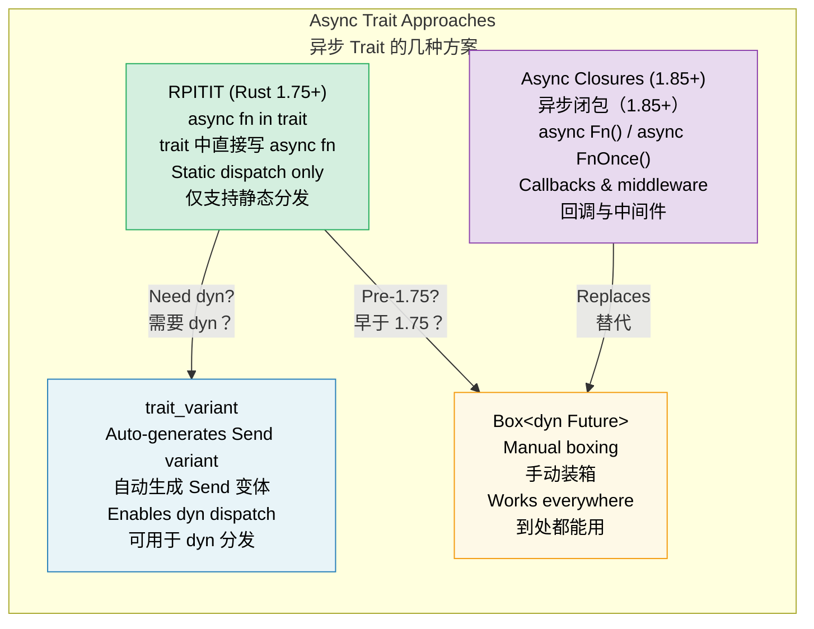

# 10. Async Traits 🟡<br><span class="zh-inline">10. 异步 Trait 🟡</span>

> **What you'll learn:**<br><span class="zh-inline">**本章将学到什么：**</span>
> - Why async methods in traits took years to stabilize<br><span class="zh-inline">为什么 trait 里的异步方法拖了很多年才稳定</span>
> - RPITIT: native async trait methods (Rust 1.75+)<br><span class="zh-inline">RPITIT：原生 async trait 方法（Rust 1.75+）</span>
> - The `dyn` dispatch challenge and the `trait_variant` workaround<br><span class="zh-inline">`dyn` 分发为什么麻烦，以及 `trait_variant` 怎么补位</span>
> - Async closures (Rust 1.85+): `async Fn()` and `async FnOnce()`<br><span class="zh-inline">异步闭包（Rust 1.85+）：`async Fn()` 与 `async FnOnce()`</span>



## The History: Why It Took So Long<br><span class="zh-inline">历史背景：为什么它拖了这么久</span>

Async methods in traits were one of Rust's most requested features for years. The original problem looked like this:<br><span class="zh-inline">trait 里的异步方法，多年来一直是 Rust 社区呼声最高的能力之一。它迟迟上不了岸，核心难点其实就在下面这段东西背后。</span>

```rust
// This didn't compile until Rust 1.75 (Dec 2023):
trait DataStore {
    async fn get(&self, key: &str) -> Option<String>;
}
// Why? Because async fn returns `impl Future<Output = T>`,
// and `impl Trait` in trait return position wasn't supported.
```

The fundamental challenge is that when a trait method returns `impl Future`, every implementor produces a different concrete type. The compiler needs to know the size of the return type, but trait methods are also expected to work with dynamic dispatch. That combination is what made the feature so stubborn.<br><span class="zh-inline">根上的麻烦在于：trait 方法一旦返回 `impl Future`，每个实现者吐出来的其实都是不同的具体类型。编译器又得知道返回值到底多大，trait 方法还偏偏常常要支持动态分发。几件事搅在一起，就把这个功能拖成了硬骨头。</span>

### RPITIT: Return Position Impl Trait in Trait<br><span class="zh-inline">RPITIT：trait 返回位置上的 `impl Trait`</span>

Since Rust 1.75, native async trait methods work for static dispatch:<br><span class="zh-inline">从 Rust 1.75 开始，原生 async trait 在静态分发场景里终于能用了：</span>

```rust
trait DataStore {
    async fn get(&self, key: &str) -> Option<String>;
    // Desugars to:
    // fn get(&self, key: &str) -> impl Future<Output = Option<String>>;
}

struct InMemoryStore {
    data: std::collections::HashMap<String, String>,
}

impl DataStore for InMemoryStore {
    async fn get(&self, key: &str) -> Option<String> {
        self.data.get(key).cloned()
    }
}

// Works with generics (static dispatch)
async fn lookup<S: DataStore>(store: &S, key: &str) {
    if let Some(val) = store.get(key).await {
        println!("{key} = {val}");
    }
}
```

### `dyn` Dispatch and `Send` Bounds<br><span class="zh-inline">`dyn` 分发与 `Send` 约束</span>

The limitation is still real: native async trait methods do not make the trait object-safe for `dyn` use. The compiler still cannot name the concrete future type returned by the method.<br><span class="zh-inline">但局限也很实在：原生 async trait 目前还没有神到让 trait 立刻对 `dyn` 友好。编译器依然没法给这个返回的具体 future 类型起一个固定名字。</span>

```rust
// Doesn't work:
// async fn lookup_dyn(store: &dyn DataStore, key: &str) { ... }
// Error: the trait `DataStore` is not dyn-compatible because method `get`
//        is `async`

// Workaround: return a boxed future
trait DynDataStore {
    fn get(&self, key: &str) -> Pin<Box<dyn Future<Output = Option<String>> + Send + '_>>;
}

// Or use the trait_variant macro (see below)
```

**The `Send` problem**: spawned tasks on multi-threaded runtimes must themselves be `Send`. Native async trait methods do not automatically add that bound to the returned future.<br><span class="zh-inline">**`Send` 这个坑** 也绕不过去：多线程运行时里被 `spawn` 出去的任务必须是 `Send`。而原生 async trait 方法并不会自动替返回 future 补上 `Send` 约束。</span>

```rust
trait Worker {
    async fn run(&self); // Future might or might not be Send
}

struct MyWorker;

impl Worker for MyWorker {
    async fn run(&self) {
        // If this uses !Send types, the future is !Send
        let rc = std::rc::Rc::new(42);
        some_work().await;
        println!("{rc}");
    }
}

// This fails if the future isn't Send:
// tokio::spawn(worker.run()); // Requires Send + 'static
```

### The `trait_variant` Crate<br><span class="zh-inline">`trait_variant` 这个 crate</span>

The `trait_variant` crate, maintained by the Rust async working group, can generate a `Send` variant automatically:<br><span class="zh-inline">Rust async 工作组维护的 `trait_variant` 可以自动生成一个带 `Send` 约束的变体，专门收拾这摊事：</span>

```rust
// Cargo.toml: trait-variant = "0.1"

#[trait_variant::make(SendDataStore: Send)]
trait DataStore {
    async fn get(&self, key: &str) -> Option<String>;
    async fn set(&self, key: &str, value: String);
}

// Now you have two traits:
// - DataStore: no Send bound on the futures
// - SendDataStore: all futures are Send
// Both have the same methods, implementors implement DataStore
// and get SendDataStore for free if their futures are Send.

// Use SendDataStore when you need to spawn:
async fn spawn_lookup(store: Arc<dyn SendDataStore>) {
    tokio::spawn(async move {
        store.get("key").await;
    });
}
```

### Quick Reference: Async Traits<br><span class="zh-inline">速查表：异步 Trait 的几种方案</span>

| Approach<br><span class="zh-inline">方案</span> | Static Dispatch<br><span class="zh-inline">静态分发</span> | Dynamic Dispatch<br><span class="zh-inline">动态分发</span> | Send | Syntax Overhead<br><span class="zh-inline">语法负担</span> |
|----------|:---:|:---:|:---:|---|
| Native `async fn` in trait<br><span class="zh-inline">trait 里原生 `async fn`</span> | ✅ | ❌ | Implicit<br><span class="zh-inline">隐式</span> | None<br><span class="zh-inline">几乎没有</span> |
| `trait_variant` | ✅ | ✅ | Explicit<br><span class="zh-inline">显式</span> | `#[trait_variant::make]` |
| Manual `Box::pin`<br><span class="zh-inline">手动 `Box::pin`</span> | ✅ | ✅ | Explicit<br><span class="zh-inline">显式</span> | High<br><span class="zh-inline">较高</span> |
| `async-trait` crate | ✅ | ✅ | `#[async_trait]` | Medium (proc macro)<br><span class="zh-inline">中等（过程宏）</span> |

> **Recommendation**: For new code on Rust 1.75+, use native async traits first. When `dyn` dispatch or spawned tasks matter, pair them with `trait_variant`. The old `async-trait` crate still works and is still common, but it boxes every future, so the native approach is cheaper for static dispatch.<br><span class="zh-inline">**建议：** 新代码只要跑在 Rust 1.75+ 上，优先使用原生 async trait。只要碰到 `dyn` 分发或者要把任务扔进运行时线程池，再配上 `trait_variant`。`async-trait` 这个老牌 crate 依然常见，也照样能用，但它会给每个 future 做装箱；在静态分发场景里，原生方案更省。</span>

### Async Closures (Rust 1.85+)<br><span class="zh-inline">异步闭包（Rust 1.85+）</span>

Since Rust 1.85, async closures are stable. They capture environment just like normal closures, but the closure body itself is asynchronous and returns a future.<br><span class="zh-inline">从 Rust 1.85 开始，异步闭包终于稳定了。它和普通闭包一样能捕获环境，只是闭包体本身是异步的，返回的是一个 future。</span>

```rust
// Before 1.85: awkward workaround
let urls = vec!["https://a.com", "https://b.com"];
let fetchers: Vec<_> = urls.iter().map(|url| {
    let url = url.to_string();
    // Returns a non-async closure that returns an async block
    move || async move { reqwest::get(&url).await }
}).collect();

// After 1.85: async closures just work
let fetchers: Vec<_> = urls.iter().map(|url| {
    async move || { reqwest::get(url).await }
    // This is an async closure: captures url and returns a Future
}).collect();
```

Async closures implement the new `AsyncFn`, `AsyncFnMut`, and `AsyncFnOnce` traits, which mirror `Fn`, `FnMut`, and `FnOnce` in the synchronous world:<br><span class="zh-inline">异步闭包会实现新的 `AsyncFn`、`AsyncFnMut` 和 `AsyncFnOnce` trait。它们和同步世界里的 `Fn`、`FnMut`、`FnOnce` 是一一对应的。</span>

```rust
// Generic function accepting an async closure
async fn retry<F>(max: usize, f: F) -> Result<String, Error>
where
    F: AsyncFn() -> Result<String, Error>,
{
    for _ in 0..max {
        if let Ok(val) = f().await {
            return Ok(val);
        }
    }
    f().await
}
```

> **Migration tip**: If older code uses `Fn() -> impl Future<Output = T>`, it is worth considering `AsyncFn() -> T` now. The signatures read better, and callback-heavy APIs become much easier to understand.<br><span class="zh-inline">**迁移建议：** 如果旧代码里满地都是 `Fn() -> impl Future<Output = T>` 这种签名，现在完全可以考虑改成 `AsyncFn() -> T`。签名会清爽很多，回调密集的 API 也更容易看懂。</span>

<details>
<summary><strong>🏋️ Exercise: Design an Async Service Trait</strong> <span class="zh-inline">🏋️ 练习：设计一个异步服务 Trait</span></summary>

**Challenge**: Design a `Cache` trait with async `get` and `set` methods. Implement it twice: once with a `HashMap` in memory and once with a simulated Redis backend that uses `tokio::time::sleep` to mimic network latency. Then write a generic function that works with both implementations.<br><span class="zh-inline">**挑战题：** 设计一个带异步 `get` 和 `set` 方法的 `Cache` trait。做两份实现：一份用内存里的 `HashMap`，另一份模拟 Redis 后端，用 `tokio::time::sleep` 模拟网络延迟。最后再写一个能同时操作这两种实现的泛型函数。</span>

<details>
<summary>🔑 Solution <span class="zh-inline">🔑 参考答案</span></summary>

```rust
use std::collections::HashMap;
use std::sync::Arc;
use tokio::sync::Mutex;
use tokio::time::{sleep, Duration};

trait Cache {
    async fn get(&self, key: &str) -> Option<String>;
    async fn set(&self, key: &str, value: String);
}

// --- In-memory implementation ---
struct MemoryCache {
    store: Mutex<HashMap<String, String>>,
}

impl MemoryCache {
    fn new() -> Self {
        MemoryCache {
            store: Mutex::new(HashMap::new()),
        }
    }
}

impl Cache for MemoryCache {
    async fn get(&self, key: &str) -> Option<String> {
        self.store.lock().await.get(key).cloned()
    }

    async fn set(&self, key: &str, value: String) {
        self.store.lock().await.insert(key.to_string(), value);
    }
}

// --- Simulated Redis implementation ---
struct RedisCache {
    store: Mutex<HashMap<String, String>>,
    latency: Duration,
}

impl RedisCache {
    fn new(latency_ms: u64) -> Self {
        RedisCache {
            store: Mutex::new(HashMap::new()),
            latency: Duration::from_millis(latency_ms),
        }
    }
}

impl Cache for RedisCache {
    async fn get(&self, key: &str) -> Option<String> {
        sleep(self.latency).await; // Simulate network round-trip
        self.store.lock().await.get(key).cloned()
    }

    async fn set(&self, key: &str, value: String) {
        sleep(self.latency).await;
        self.store.lock().await.insert(key.to_string(), value);
    }
}

// --- Generic function working with any Cache ---
async fn cache_demo<C: Cache>(cache: &C, label: &str) {
    cache.set("greeting", "Hello, async!".into()).await;
    let val = cache.get("greeting").await;
    println!("[{label}] greeting = {val:?}");
}

#[tokio::main]
async fn main() {
    let mem = MemoryCache::new();
    cache_demo(&mem, "memory").await;

    let redis = RedisCache::new(50);
    cache_demo(&redis, "redis").await;
}
```

**Key takeaway**: The same generic function works for both implementations through static dispatch. There is no boxing and no allocation overhead. If dynamic dispatch becomes necessary, adding `trait_variant::make(SendCache: Send)` is the next step.<br><span class="zh-inline">**要点：** 这两个实现都能通过静态分发喂给同一个泛型函数，中间没有额外装箱，也没有多余分配。如果后面确实需要动态分发，再补上 `trait_variant::make(SendCache: Send)` 就行。</span>

</details>
</details>

> **Key Takeaways — Async Traits**<br><span class="zh-inline">**本章要点：异步 Trait**</span>
> - Since Rust 1.75, `async fn` can be written directly in traits without `#[async_trait]`.<br><span class="zh-inline">从 Rust 1.75 起，trait 里可以直接写 `async fn`，不再强依赖 `#[async_trait]`。</span>
> - `trait_variant::make` can auto-generate a `Send` variant for dynamic dispatch scenarios.<br><span class="zh-inline">`trait_variant::make` 能自动生成带 `Send` 的变体，适合动态分发场景。</span>
> - Async closures (`async Fn()`) stabilized in 1.85 and are very suitable for callbacks and middleware.<br><span class="zh-inline">异步闭包 `async Fn()` 在 1.85 稳定后，写回调和中间件舒服多了。</span>
> - Prefer static dispatch such as `<S: Service>` when performance matters.<br><span class="zh-inline">只要性能敏感，优先使用 `<S: Service>` 这种静态分发写法。</span>

> **See also:** [Ch 13 — Production Patterns](ch13-production-patterns.md) for Tower's `Service` trait, and [Ch 6 — Building Futures by Hand](ch06-building-futures-by-hand.md) for manually implemented state machines.<br><span class="zh-inline">**继续阅读：** [第 13 章：生产实践模式](ch13-production-patterns.md) 会讲 Tower 的 `Service` trait；[第 6 章：手写 Future](ch06-building-futures-by-hand.md) 会带着手动实现状态机。</span>

***
