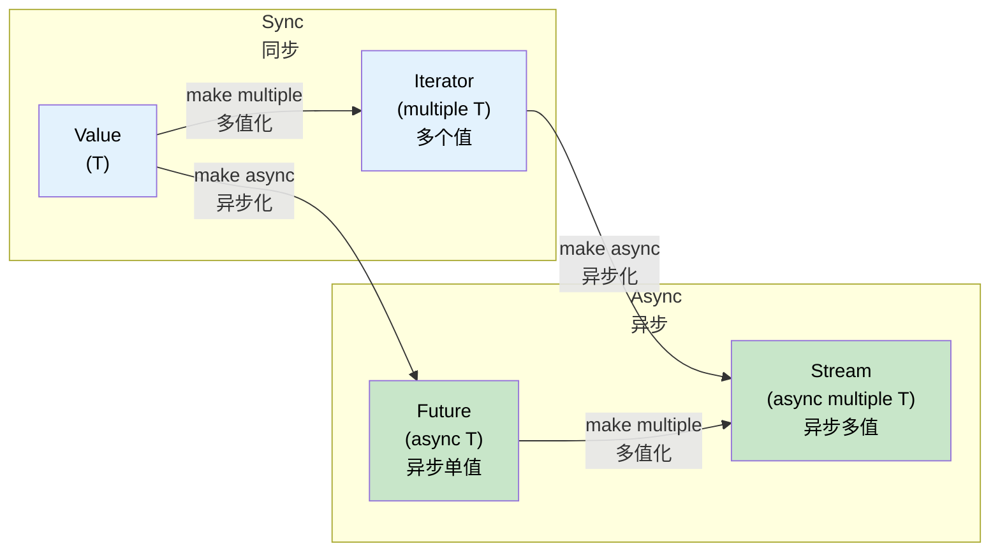

# 11. Streams and AsyncIterator 🟡<br><span class="zh-inline">11. Stream 与异步迭代 🟡</span>

> **What you'll learn:**<br><span class="zh-inline">**本章将学到什么：**</span>
> - The `Stream` trait: async iteration over multiple values<br><span class="zh-inline">`Stream` trait 是什么：如何异步迭代多个值</span>
> - Creating streams: `stream::iter`, `async_stream`, `unfold`<br><span class="zh-inline">如何创建 stream：`stream::iter`、`async_stream`、`unfold`</span>
> - Stream combinators: `map`, `filter`, `buffer_unordered`, `fold`<br><span class="zh-inline">常见 stream 组合子：`map`、`filter`、`buffer_unordered`、`fold`</span>
> - Async I/O traits: `AsyncRead`, `AsyncWrite`, `AsyncBufRead`<br><span class="zh-inline">异步 I/O trait：`AsyncRead`、`AsyncWrite`、`AsyncBufRead`</span>

## Stream Trait Overview<br><span class="zh-inline">`Stream` trait 总览</span>

A `Stream` relates to `Iterator` the same way `Future` relates to a single value: it produces multiple values, but does so asynchronously.<br><span class="zh-inline">`Stream` 和 `Iterator` 的关系，差不多就像 `Future` 和“单个值”的关系：它会产出多个值，只不过这个过程是异步的。</span>

```rust
// std::iter::Iterator (synchronous, multiple values)
trait Iterator {
    type Item;
    fn next(&mut self) -> Option<Self::Item>;
}

// futures::Stream (async, multiple values)
trait Stream {
    type Item;
    fn poll_next(self: Pin<&mut Self>, cx: &mut Context<'_>) -> Poll<Option<Self::Item>>;
}
```



### Creating Streams<br><span class="zh-inline">创建 Stream 的几种方式</span>

```rust
use futures::stream::{self, StreamExt};
use tokio::time::{interval, Duration};
use tokio_stream::wrappers::IntervalStream;

// 1. From an iterator
let s = stream::iter(vec![1, 2, 3]);

// 2. From an async generator (using async_stream crate)
// Cargo.toml: async-stream = "0.3"
use async_stream::stream;

fn countdown(from: u32) -> impl futures::Stream<Item = u32> {
    stream! {
        for i in (0..=from).rev() {
            tokio::time::sleep(Duration::from_millis(500)).await;
            yield i;
        }
    }
}

// 3. From a tokio interval
let tick_stream = IntervalStream::new(interval(Duration::from_secs(1)));

// 4. From a channel receiver (tokio_stream::wrappers)
let (tx, rx) = tokio::sync::mpsc::channel::<String>(100);
let rx_stream = tokio_stream::wrappers::ReceiverStream::new(rx);

// 5. From unfold (generate from async state)
let s = stream::unfold(0u32, |state| async move {
    if state >= 5 {
        None // Stream ends
    } else {
        let next = state + 1;
        Some((state, next)) // yield `state`, new state is `next`
    }
});
```

Different constructors fit different situations: static data, timer ticks, channel messages, or stateful generation. The important point is that they all unify under the same `Stream` abstraction once created.<br><span class="zh-inline">不同的构造方式适合不同场景：静态数据、定时器节拍、channel 消息，或者带状态的生成器。关键在于，一旦构造出来，它们就都能统一被当成 `Stream` 来处理。</span>

### Consuming Streams<br><span class="zh-inline">消费 Stream</span>

```rust
use futures::stream::{self, StreamExt};

async fn stream_examples() {
    let s = stream::iter(vec![1, 2, 3, 4, 5]);

    // for_each — process each item
    s.for_each(|x| async move {
        println!("{x}");
    }).await;

    // map + collect
    let doubled: Vec<i32> = stream::iter(vec![1, 2, 3])
        .map(|x| x * 2)
        .collect()
        .await;

    // filter
    let evens: Vec<i32> = stream::iter(1..=10)
        .filter(|x| futures::future::ready(x % 2 == 0))
        .collect()
        .await;

    // buffer_unordered — process N items concurrently
    let results: Vec<_> = stream::iter(vec!["url1", "url2", "url3"])
        .map(|url| async move {
            // Simulate HTTP fetch
            tokio::time::sleep(Duration::from_millis(100)).await;
            format!("response from {url}")
        })
        .buffer_unordered(10) // Up to 10 concurrent fetches
        .collect()
        .await;

    // take, skip, zip, chain — just like Iterator
    let first_three: Vec<i32> = stream::iter(1..=100)
        .take(3)
        .collect()
        .await;
}
```

If ordinary `Iterator` chains feel familiar, stream combinators should feel surprisingly natural. The main difference is that collection and traversal are now async-aware and may suspend between items.<br><span class="zh-inline">如果已经熟悉普通 `Iterator` 链，那么 stream 组合子其实会很顺手。最大的区别只是：现在收集和遍历过程本身也带上了异步语义，中途可能发生挂起。</span>

### Comparison with C# `IAsyncEnumerable`<br><span class="zh-inline">和 C# `IAsyncEnumerable` 的对照</span>

| Feature<br><span class="zh-inline">特性</span> | Rust `Stream` | C# `IAsyncEnumerable<T>` |
|---------|--------------|--------------------------|
| **Syntax**<br><span class="zh-inline">语法</span> | `stream! { yield x; }` | `await foreach` / `yield return` |
| **Cancellation**<br><span class="zh-inline">取消</span> | Drop the stream<br><span class="zh-inline">直接丢弃 stream</span> | `CancellationToken` |
| **Backpressure**<br><span class="zh-inline">背压</span> | Consumer controls poll rate<br><span class="zh-inline">消费者控制轮询速度</span> | Consumer controls `MoveNextAsync` |
| **Built-in**<br><span class="zh-inline">是否内建</span> | No, via crate<br><span class="zh-inline">不是标准库内建，需要 crate</span> | Yes |
| **Combinators**<br><span class="zh-inline">组合子</span> | `.map()`、`.filter()`、`.buffer_unordered()` | LINQ + `System.Linq.Async` |
| **Error handling**<br><span class="zh-inline">错误处理</span> | `Stream<Item = Result<T, E>>` | Throw inside async iterator<br><span class="zh-inline">在异步迭代器里抛异常</span> |

```rust
// Rust: Stream of database rows
// NOTE: try_stream! (not stream!) is required when using ? inside the body.
// stream! doesn't propagate errors — try_stream! yields Err(e) and ends.
fn get_users(db: &Database) -> impl Stream<Item = Result<User, DbError>> + '_ {
    try_stream! {
        let mut cursor = db.query("SELECT * FROM users").await?;
        while let Some(row) = cursor.next().await {
            yield User::from_row(row?);
        }
    }
}

// Consume:
let mut users = pin!(get_users(&db));
while let Some(result) = users.next().await {
    match result {
        Ok(user) => println!("{}", user.name),
        Err(e) => eprintln!("Error: {e}"),
    }
}
```

```csharp
// C# equivalent:
async IAsyncEnumerable<User> GetUsers() {
    await using var reader = await db.QueryAsync("SELECT * FROM users");
    while (await reader.ReadAsync()) {
        yield return User.FromRow(reader);
    }
}

// Consume:
await foreach (var user in GetUsers()) {
    Console.WriteLine(user.Name);
}
```

<details>
<summary><strong>🏋️ Exercise: Build an Async Stats Aggregator</strong><br><span class="zh-inline"><strong>🏋️ 练习：实现一个异步统计聚合器</strong></span></summary>

**Challenge**: Given a sensor reading stream `Stream<Item = f64>`, write an async function that returns `(count, min, max, average)` without collecting the whole stream into a `Vec` first.<br><span class="zh-inline">**挑战**：给定一个传感器读数流 `Stream&lt;Item = f64&gt;`，写一个异步函数返回 `(count, min, max, average)`，并且不要先把整个 stream 收集进 `Vec`。</span>

*Hint*: Use `.fold()` to accumulate state across items.<br><span class="zh-inline">*提示*：可以用 `.fold()` 一边消费 stream，一边累积状态。</span>

<details>
<summary>🔑 Solution<br><span class="zh-inline">🔑 参考答案</span></summary>

```rust
use futures::stream::{self, StreamExt};

#[derive(Debug)]
struct Stats {
    count: usize,
    min: f64,
    max: f64,
    sum: f64,
}

impl Stats {
    fn average(&self) -> f64 {
        if self.count == 0 { 0.0 } else { self.sum / self.count as f64 }
    }
}

async fn compute_stats<S: futures::Stream<Item = f64> + Unpin>(stream: S) -> Stats {
    stream
        .fold(
            Stats { count: 0, min: f64::INFINITY, max: f64::NEG_INFINITY, sum: 0.0 },
            |mut acc, value| async move {
                acc.count += 1;
                acc.min = acc.min.min(value);
                acc.max = acc.max.max(value);
                acc.sum += value;
                acc
            },
        )
        .await
}

#[tokio::test]
async fn test_stats() {
    let readings = stream::iter(vec![23.5, 24.1, 22.8, 25.0, 23.9]);
    let stats = compute_stats(readings).await;

    assert_eq!(stats.count, 5);
    assert!((stats.min - 22.8).abs() < f64::EPSILON);
    assert!((stats.max - 25.0).abs() < f64::EPSILON);
    assert!((stats.average() - 23.86).abs() < 0.01);
}
```

**Key takeaway**: combinators like `.fold()` let a stream be processed item by item without buffering the whole thing in memory. That matters a lot once the stream is very large or potentially unbounded.<br><span class="zh-inline">**核心收获：** `.fold()` 这类组合子可以让 stream 一项一项地被处理，而不是先整体装进内存。只要数据量很大，或者流本身没有上界，这一点就非常重要。</span>

</details>
</details>

### Async I/O Traits: `AsyncRead`, `AsyncWrite`, `AsyncBufRead`<br><span class="zh-inline">异步 I/O trait：`AsyncRead`、`AsyncWrite`、`AsyncBufRead`</span>

Just as `std::io::Read` and `Write` are the foundation of synchronous I/O, the async traits in `tokio::io` or `futures::io` form the foundation of async I/O code.<br><span class="zh-inline">就像 `std::io::Read` 和 `Write` 是同步 I/O 的根基一样，`tokio::io` 或 `futures::io` 里的异步 trait 也是异步 I/O 代码的根基。</span>

```rust
// tokio::io — the async versions of std::io traits

/// Read bytes from a source asynchronously
pub trait AsyncRead {
    fn poll_read(
        self: Pin<&mut Self>,
        cx: &mut Context<'_>,
        buf: &mut ReadBuf<'_>,  // Tokio's safe wrapper around uninitialized memory
    ) -> Poll<io::Result<()>>;
}

/// Write bytes to a sink asynchronously
pub trait AsyncWrite {
    fn poll_write(
        self: Pin<&mut Self>,
        cx: &mut Context<'_>,
        buf: &[u8],
    ) -> Poll<io::Result<usize>>;

    fn poll_flush(self: Pin<&mut Self>, cx: &mut Context<'_>) -> Poll<io::Result<()>>;
    fn poll_shutdown(self: Pin<&mut Self>, cx: &mut Context<'_>) -> Poll<io::Result<()>>;
}

/// Buffered reading with line support
pub trait AsyncBufRead: AsyncRead {
    fn poll_fill_buf(self: Pin<&mut Self>, cx: &mut Context<'_>) -> Poll<io::Result<&[u8]>>;
    fn consume(self: Pin<&mut Self>, amt: usize);
}
```

**In practice**, most code will not call these `poll_*` methods directly. Instead, the extension traits `AsyncReadExt` and `AsyncWriteExt` provide ergonomic `.await`-friendly helpers.<br><span class="zh-inline">**实战里**，大多数代码都不会自己去直接调这些 `poll_*` 方法。通常会通过 `AsyncReadExt`、`AsyncWriteExt` 这类扩展 trait 使用更顺手、能直接 `.await` 的辅助方法。</span>

```rust
use tokio::io::{AsyncReadExt, AsyncWriteExt, AsyncBufReadExt};
use tokio::net::TcpStream;
use tokio::io::BufReader;

async fn io_examples() -> tokio::io::Result<()> {
    let mut stream = TcpStream::connect("127.0.0.1:8080").await?;

    // AsyncWriteExt: write_all, write_u32, write_buf, etc.
    stream.write_all(b"GET / HTTP/1.0\r\n\r\n").await?;

    // AsyncReadExt: read, read_exact, read_to_end, read_to_string
    let mut response = Vec::new();
    stream.read_to_end(&mut response).await?;

    // AsyncBufReadExt: read_line, lines(), split()
    let file = tokio::fs::File::open("config.txt").await?;
    let reader = BufReader::new(file);
    let mut lines = reader.lines();
    while let Some(line) = lines.next_line().await? {
        println!("{line}");
    }

    Ok(())
}
```

**Implementing custom async I/O** often means wrapping a raw transport in a higher-level protocol abstraction.<br><span class="zh-inline">**实现自定义异步 I/O** 时，常见套路是把底层原始传输包装成更高层的协议抽象。</span>

```rust
use tokio::io::{AsyncRead, AsyncWrite, ReadBuf};
use std::pin::Pin;
use std::task::{Context, Poll};

/// A length-prefixed protocol: [u32 length][payload bytes]
struct FramedStream<T> {
    inner: T,
}

impl<T: AsyncRead + AsyncReadExt + Unpin> FramedStream<T> {
    /// Read one complete frame
    async fn read_frame(&mut self) -> tokio::io::Result<Vec<u8>>
    {
        // Read the 4-byte length prefix
        let len = self.inner.read_u32().await? as usize;

        // Read exactly that many bytes
        let mut payload = vec![0u8; len];
        self.inner.read_exact(&mut payload).await?;
        Ok(payload)
    }
}

impl<T: AsyncWrite + AsyncWriteExt + Unpin> FramedStream<T> {
    /// Write one complete frame
    async fn write_frame(&mut self, data: &[u8]) -> tokio::io::Result<()>
    {
        self.inner.write_u32(data.len() as u32).await?;
        self.inner.write_all(data).await?;
        self.inner.flush().await?;
        Ok(())
    }
}
```

| Sync Trait<br><span class="zh-inline">同步 trait</span> | Async Trait (tokio) | Async Trait (futures) | Extension Trait<br><span class="zh-inline">扩展 trait</span> |
|-----------|--------------------|-----------------------|----------------|
| `std::io::Read` | `tokio::io::AsyncRead` | `futures::io::AsyncRead` | `AsyncReadExt` |
| `std::io::Write` | `tokio::io::AsyncWrite` | `futures::io::AsyncWrite` | `AsyncWriteExt` |
| `std::io::BufRead` | `tokio::io::AsyncBufRead` | `futures::io::AsyncBufRead` | `AsyncBufReadExt` |
| `std::io::Seek` | `tokio::io::AsyncSeek` | `futures::io::AsyncSeek` | `AsyncSeekExt` |

> **tokio vs futures I/O traits**: the two families are similar but not identical. Tokio's `AsyncRead` uses `ReadBuf`, which helps handle uninitialized memory safely, while `futures::AsyncRead` works with `&mut [u8]`. `tokio_util::compat` can bridge between them.<br><span class="zh-inline">**tokio 与 futures 的 I/O trait 差别**：两套接口长得像，但不是完全相同。Tokio 的 `AsyncRead` 使用 `ReadBuf`，对未初始化内存的处理更安全；`futures::AsyncRead` 则是基于 `&mut [u8]`。需要打通时可以用 `tokio_util::compat`。</span>

> **Copy utilities**: `tokio::io::copy(&mut reader, &mut writer)` is async 版的 `std::io::copy`，而 `tokio::io::copy_bidirectional` 则会双向同时复制，非常适合代理服务或文件转发场景。<br><span class="zh-inline">**复制工具**：`tokio::io::copy(&mut reader, &mut writer)` 可以看成 `std::io::copy` 的异步版本，而 `tokio::io::copy_bidirectional` 会把两个方向同时复制，非常适合代理服务和转发场景。</span>

<details>
<summary><strong>🏋️ Exercise: Build an Async Line Counter</strong><br><span class="zh-inline"><strong>🏋️ 练习：实现一个异步行计数器</strong></span></summary>

**Challenge**: Write an async function that accepts any `AsyncBufRead` source and returns the number of non-empty lines. It should work with files, TCP streams, or any buffered reader.<br><span class="zh-inline">**挑战**：写一个异步函数，它接收任意 `AsyncBufRead` 数据源，并返回非空行数量。这个函数应该能适用于文件、TCP 流，或者任何带缓冲的读取器。</span>

*Hint*: Use `AsyncBufReadExt::lines()` and count only lines where `!line.is_empty()`.<br><span class="zh-inline">*提示*：可以使用 `AsyncBufReadExt::lines()`，然后只统计满足 `!line.is_empty()` 的行。</span>

<details>
<summary>🔑 Solution<br><span class="zh-inline">🔑 参考答案</span></summary>

```rust
use tokio::io::AsyncBufReadExt;

async fn count_non_empty_lines<R: tokio::io::AsyncBufRead + Unpin>(
    reader: R,
) -> tokio::io::Result<usize> {
    let mut lines = reader.lines();
    let mut count = 0;
    while let Some(line) = lines.next_line().await? {
        if !line.is_empty() {
            count += 1;
        }
    }
    Ok(count)
}

// Works with any AsyncBufRead:
// let file = tokio::io::BufReader::new(tokio::fs::File::open("data.txt").await?);
// let count = count_non_empty_lines(file).await?;
//
// let tcp = tokio::io::BufReader::new(TcpStream::connect("...").await?);
// let count = count_non_empty_lines(tcp).await?;
```

**Key takeaway**: by programming against `AsyncBufRead` rather than one concrete reader type, the same logic becomes reusable across files, sockets, pipes, and in-memory buffers.<br><span class="zh-inline">**核心收获：** 只要代码是面向 `AsyncBufRead` 这个抽象来写，而不是绑死在某个具体读取器类型上，同一套逻辑就能复用到文件、socket、管道，甚至内存缓冲区。</span>

</details>
</details>

> **Key Takeaways — Streams and AsyncIterator**<br><span class="zh-inline">**本章要点——Stream 与异步迭代**</span>
> - `Stream` is the async equivalent of `Iterator` and yields `Poll::Ready(Some(item))` or `Poll::Ready(None)`<br><span class="zh-inline">`Stream` 就是 `Iterator` 的异步版本，会产出 `Poll::Ready(Some(item))` 或 `Poll::Ready(None)`</span>
> - `.buffer_unordered(N)` is the key stream tool for processing N items concurrently<br><span class="zh-inline">`.buffer_unordered(N)` 是 stream 场景里最关键的并发处理工具之一</span>
> - `async_stream::stream!` is usually the easiest way to create custom streams<br><span class="zh-inline">`async_stream::stream!` 往往是自定义 stream 最省事的入口</span>
> - `AsyncRead` and `AsyncBufRead` let I/O code stay generic and reusable across files, sockets, and pipes<br><span class="zh-inline">`AsyncRead` 和 `AsyncBufRead` 能让 I/O 代码在文件、socket、管道之间保持通用和可复用</span>

> **See also:** [Ch 9 — When Tokio Isn't the Right Fit](ch09-when-tokio-isnt-the-right-fit.md) for `FuturesUnordered`, and [Ch 13 — Production Patterns](ch13-production-patterns.md) for bounded-channel backpressure patterns.<br><span class="zh-inline">**继续阅读：** [第 9 章——When Tokio Isn't the Right Fit](ch09-when-tokio-isnt-the-right-fit.md) 会提到 `FuturesUnordered`，而 [第 13 章——Production Patterns](ch13-production-patterns.md) 会继续展开有界 channel 的背压模式。</span>

***
