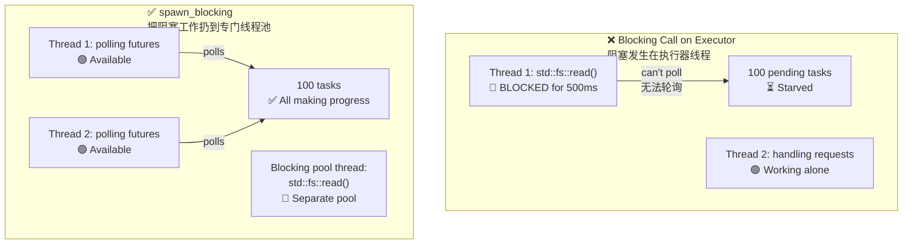

# 12. Common Pitfalls 🔴<br><span class="zh-inline">12. 常见陷阱 🔴</span>

> **What you'll learn:**<br><span class="zh-inline">**本章将学到什么：**</span>
> - 9 common async Rust bugs and how to fix them<br><span class="zh-inline">9 类常见 async Rust 问题，以及各自的修正思路</span>
> - Why blocking the executor is the #1 mistake<br><span class="zh-inline">为什么阻塞执行器线程是头号大坑</span>
> - Cancellation hazards when a future is dropped mid-await<br><span class="zh-inline">future 在 `.await` 中途被丢弃时会带来哪些取消风险</span>
> - Debugging with `tokio-console`, `tracing`, and `#[instrument]`<br><span class="zh-inline">如何用 `tokio-console`、`tracing`、`#[instrument]` 调试异步代码</span>
> - Testing with `#[tokio::test]`, `time::pause()`, and trait-based mocking<br><span class="zh-inline">如何用 `#[tokio::test]`、`time::pause()` 和基于 trait 的 mock 做测试</span>

## Blocking the Executor<br><span class="zh-inline">阻塞执行器</span>

The number one async Rust mistake is running blocking work on an executor thread. Once that happens, other tasks sharing that thread stop making progress.<br><span class="zh-inline">async Rust 里排名第一的错误，就是把阻塞操作丢到执行器线程上跑。一旦这么干，同一线程上的其他任务就会一起被卡住，完全推不动。</span>

```rust
// ❌ WRONG: Blocks the entire executor thread
async fn bad_handler() -> String {
    let data = std::fs::read_to_string("big_file.txt").unwrap(); // BLOCKS!
    process(&data)
}

// ✅ CORRECT: Offload blocking work to a dedicated thread pool
async fn good_handler() -> String {
    let data = tokio::task::spawn_blocking(|| {
        std::fs::read_to_string("big_file.txt").unwrap()
    }).await.unwrap();
    process(&data)
}

// ✅ ALSO CORRECT: Use tokio's async fs
async fn also_good_handler() -> String {
    let data = tokio::fs::read_to_string("big_file.txt").await.unwrap();
    process(&data)
}
```



### `std::thread::sleep` vs `tokio::time::sleep`<br><span class="zh-inline">`std::thread::sleep` 与 `tokio::time::sleep` 的区别</span>

```rust
// ❌ WRONG: Blocks the executor thread for 5 seconds
async fn bad_delay() {
    std::thread::sleep(Duration::from_secs(5)); // Thread can't poll anything else!
}

// ✅ CORRECT: Yields to the executor, other tasks can run
async fn good_delay() {
    tokio::time::sleep(Duration::from_secs(5)).await; // Non-blocking!
}
```

The rule is simple: inside async code, always ask whether an operation parks the task or blocks the thread. Only the first one is what you want.<br><span class="zh-inline">判断标准其实很简单：在 async 代码里，先问自己这一步到底是“挂起当前任务”，还是“卡死当前线程”。真正想要的只有前者。</span>

### Holding `MutexGuard` Across `.await`<br><span class="zh-inline">把 `MutexGuard` 跨 `.await` 持有</span>

```rust
use std::sync::Mutex; // std Mutex — NOT async-aware

// ❌ WRONG: MutexGuard held across .await
async fn bad_mutex(data: &Mutex<Vec<String>>) {
    let mut guard = data.lock().unwrap();
    guard.push("item".into());
    some_io().await; // 💥 Guard is held here — blocks other threads from locking!
    guard.push("another".into());
}
// Also: std::sync::MutexGuard is !Send, so this won't compile
// with tokio's multi-threaded runtime.

// ✅ FIX 1: Scope the guard to drop before .await
async fn good_mutex_scoped(data: &Mutex<Vec<String>>) {
    {
        let mut guard = data.lock().unwrap();
        guard.push("item".into());
    } // Guard dropped here
    some_io().await; // Safe — lock is released
    {
        let mut guard = data.lock().unwrap();
        guard.push("another".into());
    }
}

// ✅ FIX 2: Use tokio::sync::Mutex (async-aware)
use tokio::sync::Mutex as AsyncMutex;

async fn good_async_mutex(data: &AsyncMutex<Vec<String>>) {
    let mut guard = data.lock().await; // Async lock — doesn't block the thread
    guard.push("item".into());
    some_io().await; // OK — tokio Mutex guard is Send
    guard.push("another".into());
}
```

> **When to use which mutex**:<br><span class="zh-inline">**什么时候用哪种 mutex**：</span>
> - `std::sync::Mutex`: short critical sections with no `.await` inside<br><span class="zh-inline">`std::sync::Mutex`：临界区很短，而且中间绝对没有 `.await`</span>
> - `tokio::sync::Mutex`: when the lock must survive across `.await` points<br><span class="zh-inline">`tokio::sync::Mutex`：锁必须跨 `.await` 存活时</span>
> - `parking_lot::Mutex`: faster `std`-style mutex, but still not for `.await`<br><span class="zh-inline">`parking_lot::Mutex`：更快更轻的同步 mutex，但依旧不该跨 `.await`</span>

### Cancellation Hazards<br><span class="zh-inline">取消风险</span>

Dropping a future cancels it immediately. That sounds simple, but partial side effects can leave systems in a broken intermediate state.<br><span class="zh-inline">future 一旦被丢弃，就会立刻取消。听起来很直接，但如果操作只做了一半，系统就可能被留在一个非常难看的中间态里。</span>

```rust
// ❌ DANGEROUS: Resource leak on cancellation
async fn transfer(from: &Account, to: &Account, amount: u64) {
    from.debit(amount).await;  // If cancelled HERE...
    to.credit(amount).await;   // ...money vanishes!
}

// ✅ SAFE: Make operations atomic or use compensation
async fn safe_transfer(from: &Account, to: &Account, amount: u64) -> Result<(), Error> {
    // Use a database transaction (all-or-nothing)
    let tx = db.begin_transaction().await?;
    tx.debit(from, amount).await?;
    tx.credit(to, amount).await?;
    tx.commit().await?; // Only commits if everything succeeded
    Ok(())
}

// ✅ ALSO SAFE: Use tokio::select! with cancellation awareness
tokio::select! {
    result = transfer(from, to, amount) => {
        // Transfer completed
    }
    _ = shutdown_signal() => {
        // Don't cancel mid-transfer — let it finish
        // Or: roll back explicitly
    }
}
```

### No Async Drop<br><span class="zh-inline">没有异步 Drop</span>

Rust's `Drop` trait is synchronous. That means there is no legal way to `.await` inside `drop()`.<br><span class="zh-inline">Rust 的 `Drop` trait 是同步的，所以根本不存在“在 `drop()` 里 `.await` 一下”的合法写法。</span>

```rust
struct DbConnection { /* ... */ }

impl Drop for DbConnection {
    fn drop(&mut self) {
        // ❌ Can't do this — drop() is sync!
        // self.connection.shutdown().await;

        // ✅ Workaround 1: Spawn a cleanup task (fire-and-forget)
        let conn = self.connection.take();
        tokio::spawn(async move {
            let _ = conn.shutdown().await;
        });

        // ✅ Workaround 2: Use a synchronous close
        // self.connection.blocking_close();
    }
}
```

Best practice is to provide an explicit `async fn close(self)` and document that callers should use it. `Drop` should be treated as a fallback safety net, not the main cleanup path.<br><span class="zh-inline">更靠谱的做法，是显式提供一个 `async fn close(self)`，并在文档里说清楚调用方应该主动调用它。`Drop` 更适合作为兜底，而不是主要清理通道。</span>

### `select!` Fairness and Starvation<br><span class="zh-inline">`select!` 的公平性与饥饿问题</span>

```rust
use tokio::sync::mpsc;

// ❌ UNFAIR: busy_stream always wins, slow_stream starves
async fn unfair(mut fast: mpsc::Receiver<i32>, mut slow: mpsc::Receiver<i32>) {
    loop {
        tokio::select! {
            Some(v) = fast.recv() => println!("fast: {v}"),
            Some(v) = slow.recv() => println!("slow: {v}"),
            // If both are ready, tokio randomly picks one.
            // But if `fast` is ALWAYS ready, `slow` rarely gets polled.
        }
    }
}

// ✅ FAIR: Use biased select or drain in batches
async fn fair(mut fast: mpsc::Receiver<i32>, mut slow: mpsc::Receiver<i32>) {
    loop {
        tokio::select! {
            biased; // Always check in order — explicit priority

            Some(v) = slow.recv() => println!("slow: {v}"),  // Priority!
            Some(v) = fast.recv() => println!("fast: {v}"),
        }
    }
}
```

### Accidental Sequential Execution<br><span class="zh-inline">不小心写成串行执行</span>

```rust
// ❌ SEQUENTIAL: Takes 2 seconds total
async fn slow() {
    let a = fetch("url_a").await; // 1 second
    let b = fetch("url_b").await; // 1 second (waits for a to finish first!)
}

// ✅ CONCURRENT: Takes 1 second total
async fn fast() {
    let (a, b) = tokio::join!(
        fetch("url_a"), // Both start immediately
        fetch("url_b"),
    );
}

// ✅ ALSO CONCURRENT: Using let + join
async fn also_fast() {
    let fut_a = fetch("url_a"); // Create future (lazy — not started yet)
    let fut_b = fetch("url_b"); // Create future
    let (a, b) = tokio::join!(fut_a, fut_b); // NOW both run concurrently
}
```

> **Trap**: `let a = fetch(url).await; let b = fetch(url).await;` is sequential. If both tasks are independent, reach for `join!`, `spawn`, or stream-based concurrency instead.<br><span class="zh-inline">**陷阱**：`let a = fetch(url).await; let b = fetch(url).await;` 就是标准串行写法。如果两件事互相独立，该用的是 `join!`、`spawn`，或者基于 stream 的并发处理。</span>

## Case Study: Debugging a Hung Production Service<br><span class="zh-inline">案例：排查一个卡死的生产服务</span>

Imagine a service that runs normally for ten minutes and then silently stops responding. There are no obvious errors, CPU is near zero, and logs看起来也没什么异常。<br><span class="zh-inline">设想这样一个场景：服务前十分钟一切正常，之后突然不再响应。日志里没有明显报错，CPU 也接近零，看着就像“没崩，但也不干活了”。</span>

**Diagnosis steps**:<br><span class="zh-inline">**排查步骤：**</span>
1. Attach `tokio-console` and discover 200+ tasks stuck in `Pending`.<br><span class="zh-inline">1. 先接上 `tokio-console`，发现 200 多个任务全卡在 `Pending`。</span>
2. Inspect the tasks and notice they are all waiting on the same `Mutex::lock().await`.<br><span class="zh-inline">2. 看任务细节，发现它们全在等同一个 `Mutex::lock().await`。</span>
3. Find the root cause: one task held a `std::sync::MutexGuard` across an `.await`, then panicked and poisoned the mutex.<br><span class="zh-inline">3. 最终根因是：有一个任务把 `std::sync::MutexGuard` 跨 `.await` 持有，随后 panic，把 mutex 毒化了。</span>

**The fix**:<br><span class="zh-inline">**修正方式：**</span>

| Before (broken)<br><span class="zh-inline">修之前</span> | After (fixed)<br><span class="zh-inline">修之后</span> |
|-----------------|---------------|
| `std::sync::Mutex` | `tokio::sync::Mutex` |
| `.lock().unwrap()` across `.await` | Drop the lock before `.await` |
| No timeout on lock acquisition | `tokio::time::timeout(dur, mutex.lock())` |
| No recovery on poisoned mutex | `tokio::sync::Mutex` doesn't poison |

**Prevention checklist**:<br><span class="zh-inline">**预防清单：**</span>
- [ ] Use `tokio::sync::Mutex` if a guard may cross any `.await`.<br><span class="zh-inline">如果 guard 可能跨 `.await`，优先换成 `tokio::sync::Mutex`。</span>
- [ ] Add `#[tracing::instrument]` to important async functions.<br><span class="zh-inline">给关键异步函数加上 `#[tracing::instrument]`。</span>
- [ ] Run `tokio-console` in staging and pre-release environments.<br><span class="zh-inline">在预发或 staging 环境把 `tokio-console` 跑起来。</span>
- [ ] Add health checks that verify task responsiveness, not just process liveness.<br><span class="zh-inline">健康检查别只看进程活着没，要能反映任务是否还能正常推进。</span>

<details>
<summary><strong>🏋️ Exercise: Spot the Bugs</strong><br><span class="zh-inline"><strong>🏋️ 练习：找出这些坑</strong></span></summary>

**Challenge**: Find the async problems in this code and fix them.<br><span class="zh-inline">**挑战**：把下面这段代码里的异步陷阱全找出来，并给出修正版本。</span>

```rust
use std::sync::Mutex;

async fn process_requests(urls: Vec<String>) -> Vec<String> {
    let results = Mutex::new(Vec::new());
    
    for url in &urls {
        let response = reqwest::get(url).await.unwrap().text().await.unwrap();
        std::thread::sleep(std::time::Duration::from_millis(100)); // Rate limit
        let mut guard = results.lock().unwrap();
        guard.push(response);
        expensive_parse(&guard).await; // Parse all results so far
    }
    
    results.into_inner().unwrap()
}
```

<details>
<summary>🔑 Solution<br><span class="zh-inline">🔑 参考答案</span></summary>

**Bugs found**:<br><span class="zh-inline">**发现的问题：**</span>
1. Sequential fetches instead of concurrent ones.<br><span class="zh-inline">1. 请求是一个一个串行抓的，没有并发。</span>
2. `std::thread::sleep` blocks the executor thread.<br><span class="zh-inline">2. `std::thread::sleep` 会卡死执行器线程。</span>
3. `MutexGuard` is held across `.await`.<br><span class="zh-inline">3. `MutexGuard` 被跨 `.await` 持有。</span>
4. The mutex itself is unnecessary once the flow is restructured.<br><span class="zh-inline">4. 只要流程改对，整个 mutex 都可以不要。</span>

```rust
use tokio::sync::Mutex;
use std::sync::Arc;
use futures::stream::{self, StreamExt};

async fn process_requests(urls: Vec<String>) -> Vec<String> {
    // Fix 4: Process URLs concurrently with buffer_unordered
    let results: Vec<String> = stream::iter(urls)
        .map(|url| async move {
            let response = reqwest::get(&url).await.unwrap().text().await.unwrap();
            // Fix 2: Use tokio::time::sleep instead of std::thread::sleep
            tokio::time::sleep(std::time::Duration::from_millis(100)).await;
            response
        })
        .buffer_unordered(10) // Up to 10 concurrent requests
        .collect()
        .await;

    // Fix 3: Parse after collecting — no mutex needed at all!
    for result in &results {
        expensive_parse(result).await;
    }

    results
}
```

**Key takeaway**: a lot of async mutex pain disappears once the flow is redesigned. Often the real fix is not “use a better mutex”, but “stop sharing mutable state unnecessarily”.<br><span class="zh-inline">**核心收获：** 很多异步 mutex 痛点，其实在重排流程之后就会自己消失。真正的修正往往不是“换个更好的锁”，而是“别让本来就没必要共享的可变状态继续共享”。</span>

</details>
</details>

---

### Debugging Async Code<br><span class="zh-inline">调试异步代码</span>

Async stack traces often look weird because what you see is the executor's poll machinery, not the logical call chain in the form the source code suggests.<br><span class="zh-inline">异步代码的栈追踪经常很难看，因为屏幕上看到的往往是执行器的轮询过程，而不是源码里那个“看起来像顺序执行”的逻辑调用链。</span>

#### `tokio-console`: Real-Time Task Inspector<br><span class="zh-inline">`tokio-console`：实时任务观察器</span>

[`tokio-console`](https://github.com/tokio-rs/console) provides an `htop`-style view of every spawned task: task state, poll duration, wake activity, and more.<br><span class="zh-inline">[`tokio-console`](https://github.com/tokio-rs/console) 会给每个 spawn 出去的任务提供一个类似 `htop` 的视图：状态、轮询耗时、唤醒情况、资源使用都能看。</span>

```toml
# Cargo.toml
[dependencies]
console-subscriber = "0.4"
tokio = { version = "1", features = ["full", "tracing"] }
```

```rust
#[tokio::main]
async fn main() {
    console_subscriber::init(); // Replaces the default tracing subscriber
    // ... rest of your application
}
```

Then in another terminal:<br><span class="zh-inline">然后在另一个终端里运行：</span>

```bash
$ RUSTFLAGS="--cfg tokio_unstable" cargo run
$ tokio-console
```

#### `tracing` + `#[instrument]`<br><span class="zh-inline">`tracing` + `#[instrument]`</span>

The [`tracing`](https://docs.rs/tracing) crate understands async lifetimes. Spans stay alive across `.await` points, which makes the logical flow much easier to reconstruct.<br><span class="zh-inline">[`tracing`](https://docs.rs/tracing) 对异步执行周期是有感知的。span 可以跨 `.await` 存活，这会让逻辑调用过程更容易被重新拼起来。</span>

```rust
use tracing::{info, instrument};

#[instrument(skip(db_pool), fields(user_id = %user_id))]
async fn handle_request(user_id: u64, db_pool: &Pool) -> Result<Response> {
    info!("looking up user");
    let user = db_pool.get_user(user_id).await?;  // span stays open across .await
    info!(email = %user.email, "found user");
    let orders = fetch_orders(user_id).await?;     // still the same span
    Ok(build_response(user, orders))
}
```

```json
{"timestamp":"...","level":"INFO","span":{"name":"handle_request","user_id":"42"},"message":"looking up user"}
{"timestamp":"...","level":"INFO","span":{"name":"handle_request","user_id":"42"},"fields":{"email":"a@b.com"},"message":"found user"}
```

#### Debugging Checklist<br><span class="zh-inline">调试清单</span>

| Symptom<br><span class="zh-inline">现象</span> | Likely Cause<br><span class="zh-inline">常见原因</span> | Tool<br><span class="zh-inline">工具</span> |
|---------|-------------|------|
| Task hangs forever<br><span class="zh-inline">任务永远挂着</span> | Missing `.await` or deadlocked mutex<br><span class="zh-inline">漏了 `.await`，或者 mutex 卡死</span> | `tokio-console` task view |
| Low throughput<br><span class="zh-inline">吞吐很低</span> | Blocking call on async thread<br><span class="zh-inline">异步线程里混入阻塞调用</span> | `tokio-console` poll histogram |
| `Future is not Send`<br><span class="zh-inline">编译器说 `Future is not Send`</span> | Non-Send value held across `.await`<br><span class="zh-inline">有非 `Send` 值跨 `.await` 存活</span> | Compiler + `#[instrument]` |
| Mysterious cancellation<br><span class="zh-inline">莫名其妙被取消</span> | A branch got dropped by `select!`<br><span class="zh-inline">`select!` 把某个分支直接丢了</span> | `tracing` span lifecycle |

> **Tip**: `tokio-console` 的很多任务级指标需要在编译时开启 `RUSTFLAGS="--cfg tokio_unstable"`。这是编译期开关，不是运行时选项。<br><span class="zh-inline">**提示**：`tokio-console` 里一些更细的任务指标，需要在编译时打开 `RUSTFLAGS="--cfg tokio_unstable"`。这不是运行时参数，而是编译期配置。</span>

### Testing Async Code<br><span class="zh-inline">测试异步代码</span>

Async code brings extra testing challenges: you need a runtime, often need controllable time, and sometimes need deterministic scheduling for race-sensitive logic.<br><span class="zh-inline">异步代码的测试会多出几件麻烦事：需要运行时、经常需要可控时间，还可能需要更可预测的调度行为来复现竞态相关逻辑。</span>

**Basic async tests**:<br><span class="zh-inline">**基础异步测试：**</span>

```rust
// Cargo.toml
// [dev-dependencies]
// tokio = { version = "1", features = ["full", "test-util"] }

#[tokio::test]
async fn test_basic_async() {
    let result = fetch_data().await;
    assert_eq!(result, "expected");
}

// Single-threaded test (useful for !Send types):
#[tokio::test(flavor = "current_thread")]
async fn test_single_threaded() {
    let rc = std::rc::Rc::new(42);
    let val = async { *rc }.await;
    assert_eq!(val, 42);
}

// Multi-threaded with explicit worker count:
#[tokio::test(flavor = "multi_thread", worker_threads = 2)]
async fn test_concurrent_behavior() {
    // Tests race conditions with real concurrency
    let counter = std::sync::Arc::new(std::sync::atomic::AtomicU32::new(0));
    let c1 = counter.clone();
    let c2 = counter.clone();
    let (a, b) = tokio::join!(
        tokio::spawn(async move { c1.fetch_add(1, std::sync::atomic::Ordering::SeqCst) }),
        tokio::spawn(async move { c2.fetch_add(1, std::sync::atomic::Ordering::SeqCst) }),
    );
    a.unwrap();
    b.unwrap();
    assert_eq!(counter.load(std::sync::atomic::Ordering::SeqCst), 2);
}
```

**Time manipulation**:<br><span class="zh-inline">**时间控制：**</span>

```rust
use tokio::time::{self, Duration, Instant};

#[tokio::test]
async fn test_timeout_behavior() {
    // Pause time — sleep() advances instantly, no real wall-clock delay
    time::pause();

    let start = Instant::now();
    time::sleep(Duration::from_secs(3600)).await; // "waits" 1 hour — takes 0ms
    assert!(start.elapsed() >= Duration::from_secs(3600));
}

#[tokio::test]
async fn test_retry_timing() {
    time::pause();

    let start = Instant::now();
    let result = retry_with_backoff(|| async {
        Err::<(), _>("simulated failure")
    }, 3, Duration::from_secs(1))
    .await;

    assert!(result.is_err());
    assert!(start.elapsed() >= Duration::from_secs(7));
}

#[tokio::test]
async fn test_deadline_exceeded() {
    time::pause();

    let result = tokio::time::timeout(
        Duration::from_secs(5),
        async {
            time::sleep(Duration::from_secs(10)).await;
            "done"
        }
    ).await;

    assert!(result.is_err()); // Timed out
}
```

**Mocking async dependencies**:<br><span class="zh-inline">**给异步依赖做 mock：**</span>

```rust
// Define a trait for the dependency:
trait Storage {
    async fn get(&self, key: &str) -> Option<String>;
    async fn set(&self, key: &str, value: String);
}

// Production implementation:
struct RedisStorage { /* ... */ }
impl Storage for RedisStorage {
    async fn get(&self, key: &str) -> Option<String> {
        // Real Redis call
        todo!()
    }
    async fn set(&self, key: &str, value: String) {
        todo!()
    }
}

// Test mock:
struct MockStorage {
    data: std::sync::Mutex<std::collections::HashMap<String, String>>,
}

impl MockStorage {
    fn new() -> Self {
        MockStorage { data: std::sync::Mutex::new(std::collections::HashMap::new()) }
    }
}

impl Storage for MockStorage {
    async fn get(&self, key: &str) -> Option<String> {
        self.data.lock().unwrap().get(key).cloned()
    }
    async fn set(&self, key: &str, value: String) {
        self.data.lock().unwrap().insert(key.to_string(), value);
    }
}

// Tested function is generic over Storage:
async fn cache_lookup<S: Storage>(store: &S, key: &str) -> String {
    match store.get(key).await {
        Some(val) => val,
        None => {
            let val = "computed".to_string();
            store.set(key, val.clone()).await;
            val
        }
    }
}

#[tokio::test]
async fn test_cache_miss_then_hit() {
    let mock = MockStorage::new();

    // First call: miss → computes and stores
    let val = cache_lookup(&mock, "key1").await;
    assert_eq!(val, "computed");

    // Second call: hit → returns stored value
    let val = cache_lookup(&mock, "key1").await;
    assert_eq!(val, "computed");
    assert!(mock.data.lock().unwrap().contains_key("key1"));
}
```

**Testing channels and task communication**:<br><span class="zh-inline">**测试 channel 与任务通信：**</span>

```rust
#[tokio::test]
async fn test_producer_consumer() {
    let (tx, mut rx) = tokio::sync::mpsc::channel(10);

    tokio::spawn(async move {
        for i in 0..5 {
            tx.send(i).await.unwrap();
        }
        // tx dropped here — channel closes
    });

    let mut received = Vec::new();
    while let Some(val) = rx.recv().await {
        received.push(val);
    }

    assert_eq!(received, vec![0, 1, 2, 3, 4]);
}
```

| Test Pattern<br><span class="zh-inline">测试模式</span> | When to Use<br><span class="zh-inline">适用场景</span> | Key Tool<br><span class="zh-inline">关键工具</span> |
|-------------|-------------|----------|
| `#[tokio::test]` | All async tests<br><span class="zh-inline">通用异步测试</span> | Tokio test runtime |
| `time::pause()` | Timeouts, retries, periodic tasks<br><span class="zh-inline">超时、重试、定时任务</span> | Virtual time |
| Trait mocking | Business logic without real I/O<br><span class="zh-inline">隔离真实 I/O 的业务逻辑测试</span> | Generic `<S: Storage>` |
| `current_thread` flavor | `!Send` types, deterministic scheduling<br><span class="zh-inline">测试 `!Send` 类型，或需要更稳定调度</span> | `#[tokio::test(flavor = "current_thread")]` |
| `multi_thread` flavor | Race-condition testing<br><span class="zh-inline">并发竞态相关测试</span> | `#[tokio::test(flavor = "multi_thread")]` |

> **Key Takeaways — Common Pitfalls**<br><span class="zh-inline">**本章要点——常见陷阱**</span>
> - Never block the executor; use `spawn_blocking` or async-native APIs<br><span class="zh-inline">永远别阻塞执行器；要么用 `spawn_blocking`，要么用原生异步 API</span>
> - Never hold a `MutexGuard` across `.await` unless the abstraction is designed for it<br><span class="zh-inline">除非抽象本来就是为此设计的，否则别把 `MutexGuard` 跨 `.await` 持有</span>
> - Cancellation means the future is dropped immediately, so partial side effects must be handled carefully<br><span class="zh-inline">取消就意味着 future 会立刻被丢弃，因此任何“做了一半”的副作用都要提前设计好</span>
> - Use `tokio-console` and `#[tracing::instrument]` to make async behavior visible<br><span class="zh-inline">用 `tokio-console` 和 `#[tracing::instrument]` 把异步行为变得可见</span>
> - Use `#[tokio::test]` and `time::pause()` to make async tests deterministic and fast<br><span class="zh-inline">用 `#[tokio::test]` 和 `time::pause()` 让异步测试又快又稳定</span>

> **See also:** [Ch 8 — Tokio Deep Dive](ch08-tokio-deep-dive.md) for sync primitives, [Ch 13 — Production Patterns](ch13-production-patterns.md) for graceful shutdown and structured concurrency.<br><span class="zh-inline">**继续阅读：** [第 8 章——Tokio Deep Dive](ch08-tokio-deep-dive.md) 会继续讲同步原语，[第 13 章——Production Patterns](ch13-production-patterns.md) 则会把优雅停机和结构化并发展开讲清楚。</span>

***
