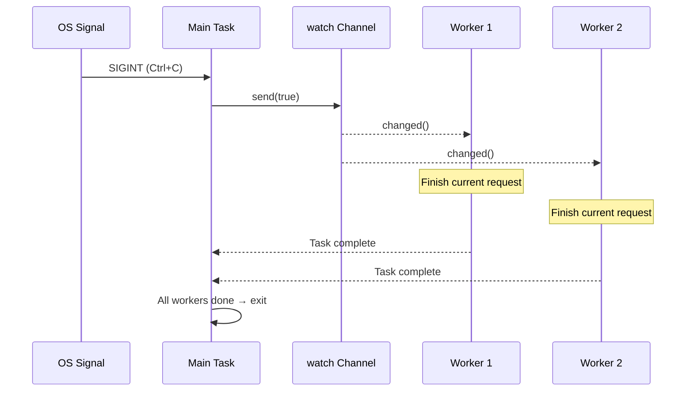

# 13. Production Patterns 🔴<br><span class="zh-inline">13. 生产环境模式 🔴</span>

> **What you'll learn:**<br><span class="zh-inline">**本章将学到什么：**</span>
> - Graceful shutdown with `watch` channels and `select!`<br><span class="zh-inline">如何用 `watch` channel 和 `select!` 做优雅停机</span>
> - Backpressure: bounded channels prevent OOM<br><span class="zh-inline">什么是背压：为什么有界 channel 能防止 OOM</span>
> - Structured concurrency: `JoinSet` and `TaskTracker`<br><span class="zh-inline">结构化并发：`JoinSet` 与 `TaskTracker`</span>
> - Timeouts, retries, and exponential backoff<br><span class="zh-inline">超时、重试与指数退避</span>
> - Error handling: `thiserror` vs `anyhow`, the double-`?` pattern<br><span class="zh-inline">错误处理：`thiserror` 与 `anyhow`，以及双重 `?` 模式</span>
> - Tower: the middleware pattern used by axum, tonic, and hyper<br><span class="zh-inline">Tower：axum、tonic、hyper 使用的中间件模式</span>

## Graceful Shutdown<br><span class="zh-inline">优雅停机</span>

Production servers need to stop cleanly: stop accepting new work, let in-flight requests finish, flush buffers, and close resources in order.<br><span class="zh-inline">生产环境里的服务不能粗暴退出。正确做法通常是：停止接收新请求，让正在处理的请求收尾，把缓冲区刷干净，再按顺序关闭连接和资源。</span>

```rust
use tokio::signal;
use tokio::sync::watch;

async fn main_server() {
    // Create a shutdown signal channel
    let (shutdown_tx, shutdown_rx) = watch::channel(false);

    // Spawn the server
    let server_handle = tokio::spawn(run_server(shutdown_rx.clone()));

    // Wait for Ctrl+C
    signal::ctrl_c().await.expect("Failed to listen for Ctrl+C");
    println!("Shutdown signal received, finishing in-flight requests...");

    // Notify all tasks to shut down
    // NOTE: .unwrap() is used for brevity. Production code should handle
    // the case where all receivers have been dropped.
    shutdown_tx.send(true).unwrap();

    // Wait for server to finish (with timeout)
    match tokio::time::timeout(
        std::time::Duration::from_secs(30),
        server_handle,
    ).await {
        Ok(Ok(())) => println!("Server shut down gracefully"),
        Ok(Err(e)) => eprintln!("Server error: {e}"),
        Err(_) => eprintln!("Server shutdown timed out — forcing exit"),
    }
}

async fn run_server(mut shutdown: watch::Receiver<bool>) {
    loop {
        tokio::select! {
            // Accept new connections
            conn = accept_connection() => {
                let shutdown = shutdown.clone();
                tokio::spawn(handle_connection(conn, shutdown));
            }
            // Shutdown signal
            _ = shutdown.changed() => {
                if *shutdown.borrow() {
                    println!("Stopping accepting new connections");
                    break;
                }
            }
        }
    }
    // In-flight connections will finish on their own
    // because they have their own shutdown_rx clone
}

async fn handle_connection(conn: Connection, mut shutdown: watch::Receiver<bool>) {
    loop {
        tokio::select! {
            request = conn.next_request() => {
                // Process the request fully — don't abandon mid-request
                process_request(request).await;
            }
            _ = shutdown.changed() => {
                if *shutdown.borrow() {
                    // Finish current request, then exit
                    break;
                }
            }
        }
    }
}
```



The important idea is coordination. A shutdown signal should flow through the whole task tree, instead of every task inventing its own local exit rule.<br><span class="zh-inline">这里最关键的是“协调”。停机信号应该沿着整个任务树往下传，而不是每个任务自己想一套退出规则，最后收不拢。</span>

### Backpressure with Bounded Channels<br><span class="zh-inline">用有界 Channel 做背压</span>

If producers can outrun consumers forever, memory usage will grow forever too. That is why unbounded channels are dangerous in production systems.<br><span class="zh-inline">如果生产者能一直比消费者快，内存占用也会一直涨。所以无界 channel 在生产环境里很危险，尤其是流量高峰和下游变慢的时候。</span>

```rust
use tokio::sync::mpsc;

async fn backpressure_example() {
    // Bounded channel: max 100 items buffered
    let (tx, mut rx) = mpsc::channel::<WorkItem>(100);

    // Producer: slows down naturally when buffer is full
    let producer = tokio::spawn(async move {
        for i in 0..1_000_000 {
            // send() is async — waits if buffer is full
            // This creates natural backpressure!
            tx.send(WorkItem { id: i }).await.unwrap();
        }
    });

    // Consumer: processes items at its own pace
    let consumer = tokio::spawn(async move {
        while let Some(item) = rx.recv().await {
            process(item).await; // Slow processing is OK — producer waits
        }
    });

    let _ = tokio::join!(producer, consumer);
}

// Compare with unbounded — DANGEROUS:
// let (tx, rx) = mpsc::unbounded_channel(); // No backpressure!
// Producer can fill memory indefinitely
```

With a bounded channel, slowness propagates upstream. That is usually exactly what a stable system wants.<br><span class="zh-inline">有界 channel 的价值就在于：下游一旦变慢，压力会自然往上游传。对一个稳定系统来说，这往往正是想要的行为。</span>

### Structured Concurrency: `JoinSet` and `TaskTracker`<br><span class="zh-inline">结构化并发：`JoinSet` 与 `TaskTracker`</span>

`JoinSet` gives a way to spawn a related group of tasks and then wait for them as a group. This avoids“任务飞出去以后没人管”的局面。<br><span class="zh-inline">`JoinSet` 提供了一种把一组相关任务绑在一起管理的方式。它能避免“任务一 spawn 就飞走，后面没人收尾”的情况。</span>

```rust
use tokio::task::JoinSet;
use tokio::time::{sleep, Duration};

async fn structured_concurrency() {
    let mut set = JoinSet::new();

    // Spawn a batch of tasks
    for url in get_urls() {
        set.spawn(async move {
            fetch_and_process(url).await
        });
    }

    // Collect all results (order not guaranteed)
    let mut results = Vec::new();
    while let Some(result) = set.join_next().await {
        match result {
            Ok(Ok(data)) => results.push(data),
            Ok(Err(e)) => eprintln!("Task error: {e}"),
            Err(e) => eprintln!("Task panicked: {e}"),
        }
    }

    // ALL tasks are done here — no dangling background work
    println!("Processed {} items", results.len());
}

// TaskTracker (tokio-util 0.7.9+) — wait for all spawned tasks
use tokio_util::task::TaskTracker;

async fn with_tracker() {
    let tracker = TaskTracker::new();

    for i in 0..10 {
        tracker.spawn(async move {
            sleep(Duration::from_millis(100 * i)).await;
            println!("Task {i} done");
        });
    }

    tracker.close(); // No more tasks will be added
    tracker.wait().await; // Wait for ALL tracked tasks
    println!("All tasks finished");
}
```

### Timeouts and Retries<br><span class="zh-inline">超时与重试</span>

```rust
use tokio::time::{timeout, sleep, Duration};

// Simple timeout
async fn with_timeout() -> Result<Response, Error> {
    match timeout(Duration::from_secs(5), fetch_data()).await {
        Ok(Ok(response)) => Ok(response),
        Ok(Err(e)) => Err(Error::Fetch(e)),
        Err(_) => Err(Error::Timeout),
    }
}

// Exponential backoff retry
async fn retry_with_backoff<F, Fut, T, E>(
    max_attempts: u32,
    base_delay_ms: u64,
    operation: F,
) -> Result<T, E>
where
    F: Fn() -> Fut,
    Fut: std::future::Future<Output = Result<T, E>>,
    E: std::fmt::Display,
{
    let mut delay = Duration::from_millis(base_delay_ms);

    for attempt in 1..=max_attempts {
        match operation().await {
            Ok(result) => return Ok(result),
            Err(e) => {
                if attempt == max_attempts {
                    eprintln!("Final attempt {attempt} failed: {e}");
                    return Err(e);
                }
                eprintln!("Attempt {attempt} failed: {e}, retrying in {delay:?}");
                sleep(delay).await;
                delay *= 2; // Exponential backoff
            }
        }
    }
    unreachable!()
}

// Usage:
// let result = retry_with_backoff(3, 100, || async {
//     reqwest::get("https://api.example.com/data").await
// }).await?;
```

> **Production tip — add jitter**: pure exponential backoff can make many clients retry in lockstep. Add random jitter so the retries spread out instead of hammering the service again at the same instant.<br><span class="zh-inline">**生产提示——加抖动**：纯指数退避很容易让大量客户端按同样的时间点一起重试，形成新的尖峰。加一点随机抖动，能把这些重试时间打散。</span>

### Error Handling in Async Code<br><span class="zh-inline">异步代码里的错误处理</span>

Async code introduces a few extra complications: spawned tasks create error boundaries, timeout wrappers add another error layer, and `?` behaves differently once results cross task boundaries.<br><span class="zh-inline">异步代码的错误处理会多出几层麻烦：spawn 出去的任务天然形成错误边界，超时又会多套一层错误包装，而 `?` 一旦跨过任务边界，展开方式也会变得不一样。</span>

**`thiserror` vs `anyhow`**:<br><span class="zh-inline">**`thiserror` 与 `anyhow` 的选择：**</span>

```rust
// thiserror: Define typed errors for libraries and public APIs
// Every variant is explicit — callers can match on specific errors
use thiserror::Error;

#[derive(Error, Debug)]
enum DiagError {
    #[error("IPMI command failed: {0}")]
    Ipmi(#[from] IpmiError),

    #[error("Sensor {sensor} out of range: {value}°C (max {max}°C)")]
    OverTemp { sensor: String, value: f64, max: f64 },

    #[error("Operation timed out after {0:?}")]
    Timeout(std::time::Duration),

    #[error("Task panicked: {0}")]
    TaskPanic(#[from] tokio::task::JoinError),
}

// anyhow: Quick error handling for applications and prototypes
// Wraps any error — no need to define types for every case
use anyhow::{Context, Result};

async fn run_diagnostics() -> Result<()> {
    let config = load_config()
        .await
        .context("Failed to load diagnostic config")?;

    let result = run_gpu_test(&config)
        .await
        .context("GPU diagnostic failed")?;

    Ok(())
}
// anyhow prints: "GPU diagnostic failed: IPMI command failed: timeout"
```

| Crate<br><span class="zh-inline">工具</span> | Use When<br><span class="zh-inline">适用场景</span> | Error Type<br><span class="zh-inline">错误类型</span> | Matching<br><span class="zh-inline">匹配方式</span> |
|-------|----------|-----------|----------|
| `thiserror` | Library code, public APIs<br><span class="zh-inline">库代码、公开 API</span> | `enum MyError { ... }` | `match err { MyError::Timeout => ... }` |
| `anyhow` | Applications, CLI tools, scripts<br><span class="zh-inline">应用、CLI、脚本</span> | `anyhow::Error` | `err.downcast_ref::<MyError>()` |
| Both together<br><span class="zh-inline">两者结合</span> | Library exposes typed errors, app wraps them<br><span class="zh-inline">库对外暴露强类型错误，应用层统一包裹</span> | Best of both<br><span class="zh-inline">两边优点都拿</span> | Typed in library, erased in app<br><span class="zh-inline">库层强类型，应用层无需细分</span> |

**The double-`?` pattern** with `tokio::spawn`:<br><span class="zh-inline">**`tokio::spawn` 里的双重 `?` 模式：**</span>

```rust
use thiserror::Error;
use tokio::task::JoinError;

#[derive(Error, Debug)]
enum AppError {
    #[error("HTTP error: {0}")]
    Http(#[from] reqwest::Error),

    #[error("Task panicked: {0}")]
    TaskPanic(#[from] JoinError),
}

async fn spawn_with_errors() -> Result<String, AppError> {
    let handle = tokio::spawn(async {
        let resp = reqwest::get("https://example.com").await?;
        Ok::<_, reqwest::Error>(resp.text().await?)
    });

    // Double ?: First ? unwraps JoinError (task panic), second ? unwraps inner Result
    let result = handle.await??;
    Ok(result)
}
```

**The error boundary problem**:<br><span class="zh-inline">**错误边界问题：**</span>

```rust
// ❌ Error context is lost across spawn boundaries:
async fn bad_error_handling() -> Result<()> {
    let handle = tokio::spawn(async {
        some_fallible_work().await
    });

    let result = handle.await??;
    Ok(())
}

// ✅ Add context at the spawn boundary:
async fn good_error_handling() -> Result<()> {
    let handle = tokio::spawn(async {
        some_fallible_work()
            .await
            .context("worker task failed")
    });

    let result = handle.await
        .context("worker task panicked")??;
    Ok(())
}
```

**Timeout errors**:<br><span class="zh-inline">**超时错误包装：**</span>

```rust
use tokio::time::{timeout, Duration};

async fn with_timeout_context() -> Result<String, DiagError> {
    let dur = Duration::from_secs(30);
    match timeout(dur, fetch_sensor_data()).await {
        Ok(Ok(data)) => Ok(data),
        Ok(Err(e)) => Err(e),
        Err(_) => Err(DiagError::Timeout(dur)),
    }
}
```

### Tower: The Middleware Pattern<br><span class="zh-inline">Tower：中间件模式</span>

The [Tower](https://docs.rs/tower) crate defines a composable `Service` trait. It is the backbone of middleware composition in the Rust async web ecosystem.<br><span class="zh-inline">[Tower](https://docs.rs/tower) crate 定义了一套可组合的 `Service` trait，它基本就是 Rust 异步 Web 生态里中间件组合的主骨架。</span>

```rust
// Tower's core trait (simplified):
pub trait Service<Request> {
    type Response;
    type Error;
    type Future: Future<Output = Result<Self::Response, Self::Error>>;

    fn poll_ready(&mut self, cx: &mut Context<'_>) -> Poll<Result<(), Self::Error>>;
    fn call(&mut self, req: Request) -> Self::Future;
}
```

Middleware wraps a `Service` to add logging, timeout control, rate limiting, auth, and other cross-cutting concerns without touching the handler's inner logic.<br><span class="zh-inline">中间件本质上就是把一个 `Service` 再包一层，把日志、超时、限流、鉴权之类横切逻辑加进去，而不去污染真正的业务处理器。</span>

```rust
use tower::{ServiceBuilder, timeout::TimeoutLayer, limit::RateLimitLayer};
use std::time::Duration;

let service = ServiceBuilder::new()
    .layer(TimeoutLayer::new(Duration::from_secs(10)))       // Outermost: timeout
    .layer(RateLimitLayer::new(100, Duration::from_secs(1))) // Then: rate limit
    .service(my_handler);                                     // Innermost: your code
```

If ASP.NET middleware or Express middleware feels familiar, Tower is the same family of idea in Rust form.<br><span class="zh-inline">如果已经熟悉 ASP.NET 中间件或者 Express 中间件，那 Tower 的思路基本就是同一家子，只是换成了 Rust 里的抽象写法。</span>

### Exercise: Graceful Shutdown with Worker Pool<br><span class="zh-inline">练习：带工作池的优雅停机</span>

<details>
<summary>🏋️ Exercise<br><span class="zh-inline">🏋️ 练习</span></summary>

**Challenge**: Build a task processor with a channel-based queue, N workers, and Ctrl+C graceful shutdown. Workers should finish any in-flight work before leaving.<br><span class="zh-inline">**挑战**：实现一个基于 channel 队列的任务处理器，包含 N 个 worker，并支持 Ctrl+C 优雅停机。要求 worker 在退出前把手头正在处理的工作完成。</span>

<details>
<summary>🔑 Solution<br><span class="zh-inline">🔑 参考答案</span></summary>

```rust
use tokio::sync::{mpsc, watch};
use tokio::time::{sleep, Duration};

struct WorkItem { id: u64, payload: String }

#[tokio::main]
async fn main() {
    let (work_tx, work_rx) = mpsc::channel::<WorkItem>(100);
    let (shutdown_tx, shutdown_rx) = watch::channel(false);
    let work_rx = std::sync::Arc::new(tokio::sync::Mutex::new(work_rx));

    let mut handles = Vec::new();
    for id in 0..4 {
        let rx = work_rx.clone();
        let mut shutdown = shutdown_rx.clone();
        handles.push(tokio::spawn(async move {
            loop {
                let item = {
                    let mut rx = rx.lock().await;
                    tokio::select! {
                        item = rx.recv() => item,
                        _ = shutdown.changed() => {
                            if *shutdown.borrow() { None } else { continue }
                        }
                    }
                };
                match item {
                    Some(work) => {
                        println!("Worker {id}: processing {}", work.id);
                        sleep(Duration::from_millis(200)).await;
                    }
                    None => break,
                }
            }
        }));
    }

    // Submit work
    for i in 0..20 {
        let _ = work_tx.send(WorkItem { id: i, payload: format!("task-{i}") }).await;
        sleep(Duration::from_millis(50)).await;
    }

    // On Ctrl+C: signal shutdown, wait for workers
    tokio::signal::ctrl_c().await.unwrap();
    // NOTE: .unwrap() is used for brevity — handle errors in production.
    shutdown_tx.send(true).unwrap();
    for h in handles { let _ = h.await; }
    println!("Shut down cleanly.");
}
```

</details>
</details>

> **Key Takeaways — Production Patterns**<br><span class="zh-inline">**本章要点——生产环境模式**</span>
> - Use a `watch` channel plus `select!` for coordinated graceful shutdown<br><span class="zh-inline">优雅停机最常见的做法是 `watch` channel 配合 `select!` 协同广播</span>
> - Bounded channels provide backpressure by forcing senders to wait when the buffer is full<br><span class="zh-inline">有界 channel 通过“缓冲满了就让发送方等待”来提供背压</span>
> - `JoinSet` and `TaskTracker` give structured ways to跟踪、等待、收拢任务组<br><span class="zh-inline">`JoinSet` 和 `TaskTracker` 提供了结构化的任务分组跟踪与收尾方式</span>
> - Network operations should almost always have explicit timeouts<br><span class="zh-inline">网络操作几乎都应该显式加上超时</span>
> - Tower's `Service` trait is the standard middleware foundation in production Rust services<br><span class="zh-inline">Tower 的 `Service` trait 是生产级 Rust 服务里最常见的中间件基础抽象</span>

> **See also:** [Ch 8 — Tokio Deep Dive](ch08-tokio-deep-dive.md) for channels and sync primitives, [Ch 12 — Common Pitfalls](ch12-common-pitfalls.md) for cancellation hazards during shutdown.<br><span class="zh-inline">**继续阅读：** [第 8 章——Tokio Deep Dive](ch08-tokio-deep-dive.md) 会继续讲 channel 和同步原语，[第 12 章——Common Pitfalls](ch12-common-pitfalls.md) 会补上停机阶段容易踩到的取消陷阱。</span>

***
