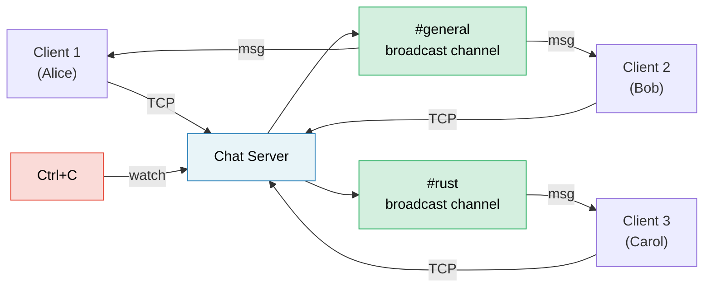

# Capstone Project: Async Chat Server<br><span class="zh-inline">综合项目：异步聊天室服务器</span>

This project integrates patterns from across the book into a single, production-style application. You'll build a **multi-room async chat server** using tokio, channels, streams, graceful shutdown, and proper error handling.<br><span class="zh-inline">这个项目会把整本书里前面讲过的模式揉进一个更接近生产风格的应用里。目标是用 Tokio、channel、stream、优雅停机和规范错误处理，搭一个**支持多房间的异步聊天服务器**。</span>

**Estimated time**: 4–6 hours | **Difficulty**: ★★★<br><span class="zh-inline">**预估耗时：** 4 到 6 小时 | **难度：** ★★★</span>

> **What you'll practice:**<br><span class="zh-inline">**这一章会练到的内容：**</span>
> - `tokio::spawn` and the `'static` requirement (Ch 8)<br><span class="zh-inline">`tokio::spawn` 以及它为什么经常要求 `'static`（第 8 章）</span>
> - Channels: `mpsc` for messages, `broadcast` for rooms, `watch` for shutdown (Ch 8)<br><span class="zh-inline">channel 组合：`mpsc` 传消息，`broadcast` 做房间广播，`watch` 传停机信号（第 8 章）</span>
> - Streams: reading lines from TCP connections (Ch 11)<br><span class="zh-inline">stream 思维：从 TCP 连接里持续读取行数据（第 11 章）</span>
> - Common pitfalls: cancellation safety, `MutexGuard` across `.await` (Ch 12)<br><span class="zh-inline">常见坑：取消安全、`MutexGuard` 跨 `.await` 等问题（第 12 章）</span>
> - Production patterns: graceful shutdown, backpressure (Ch 13)<br><span class="zh-inline">生产模式：优雅停机、背压控制（第 13 章）</span>
> - Async traits for pluggable backends (Ch 10)<br><span class="zh-inline">可插拔后端所需的 async trait 思路（第 10 章）</span>

## The Problem<br><span class="zh-inline">问题定义</span>

Build a TCP chat server where:<br><span class="zh-inline">要实现一个 TCP 聊天服务器，满足下面这些要求：</span>

1. **Clients** connect via TCP and join named rooms<br><span class="zh-inline">1. **客户端** 通过 TCP 连接，并加入具名房间。</span>
2. **Messages** are broadcast to all clients in the same room<br><span class="zh-inline">2. **消息** 会广播给同一房间里的所有客户端。</span>
3. **Commands**: `/join <room>`, `/nick <name>`, `/rooms`, `/quit`<br><span class="zh-inline">3. 支持命令：`/join <room>`、`/nick <name>`、`/rooms`、`/quit`。</span>
4. The server shuts down gracefully on Ctrl+C — finishing in-flight messages<br><span class="zh-inline">4. 按下 Ctrl+C 时，服务器要能优雅停机，把飞行中的消息尽量收完再退出。</span>



这张图背后的核心思路很简单：TCP 连接负责“谁连进来了”，房间广播负责“消息往哪发”，停机信号负责“什么时候开始收摊”。<br><span class="zh-inline">把这几种责任拆开之后，整个系统就会清楚很多，不容易在一个大循环里全搅成一锅。</span>

## Step 1: Basic TCP Accept Loop<br><span class="zh-inline">步骤 1：先搭一个最小 TCP 接收循环</span>

Start with a server that accepts connections and echoes lines back:<br><span class="zh-inline">先从一个最小版本开始：接受连接，然后把客户端发来的每一行原样回显回去。</span>

```rust
use tokio::io::{AsyncBufReadExt, AsyncWriteExt, BufReader};
use tokio::net::TcpListener;

#[tokio::main]
async fn main() -> anyhow::Result<()> {
    let listener = TcpListener::bind("127.0.0.1:8080").await?;
    println!("Chat server listening on :8080");

    loop {
        let (socket, addr) = listener.accept().await?;
        println!("[{addr}] Connected");

        tokio::spawn(async move {
            let (reader, mut writer) = socket.into_split();
            let mut reader = BufReader::new(reader);
            let mut line = String::new();

            loop {
                line.clear();
                match reader.read_line(&mut line).await {
                    Ok(0) | Err(_) => break,
                    Ok(_) => {
                        let _ = writer.write_all(line.as_bytes()).await;
                    }
                }
            }
            println!("[{addr}] Disconnected");
        });
    }
}
```

**Your job**: Verify this compiles and works with `telnet localhost 8080`.<br><span class="zh-inline">**练习目标：** 先确认这段代码能编译，并且能用 `telnet localhost 8080` 连上测试。</span>

这一小步虽然看着朴素，但很重要。先确认 accept loop、`into_split()`、逐行读取和独立任务派发都没问题，后面再往里加房间和命令，排查起来才不会一团乱。<br><span class="zh-inline">别一上来就把所有功能全堆进去，那样出问题时很容易连是哪一层坏了都看不出来。</span>

## Step 2: Room State with Broadcast Channels<br><span class="zh-inline">步骤 2：用广播 channel 管理房间状态</span>

Each room is a `broadcast::Sender`. All clients in a room subscribe to receive messages.<br><span class="zh-inline">这里的设计是：每个房间对应一个 `broadcast::Sender`，房间里的客户端通过订阅它来接收消息。</span>

```rust
use std::collections::HashMap;
use std::sync::Arc;
use tokio::sync::{broadcast, RwLock};

type RoomMap = Arc<RwLock<HashMap<String, broadcast::Sender<String>>>>;

fn get_or_create_room(rooms: &mut HashMap<String, broadcast::Sender<String>>, name: &str) -> broadcast::Sender<String> {
    rooms.entry(name.to_string())
        .or_insert_with(|| {
            let (tx, _) = broadcast::channel(100); // 100-message buffer
            tx
        })
        .clone()
}
```

**Your job**: Implement room state so that:<br><span class="zh-inline">**练习目标：** 把房间状态补完整，让它满足下面这些要求：</span>

- Clients start in `#general`<br><span class="zh-inline">客户端默认进入 `#general`。</span>
- `/join <room>` switches rooms (unsubscribe from old, subscribe to new)<br><span class="zh-inline">`/join <room>` 可以切房间，需要从旧房间退订，再订阅新房间。</span>
- Messages are broadcast to all clients in the sender's current room<br><span class="zh-inline">普通消息要广播给发送者当前房间里的所有客户端。</span>

<details>
<summary>💡 Hint — Client task structure <span class="zh-inline">💡 提示：客户端任务结构</span></summary>

Each client task needs two concurrent loops:<br><span class="zh-inline">每个客户端任务本质上要同时处理两件事：</span>

1. **Read from TCP** → parse commands or broadcast to room<br><span class="zh-inline">1. **从 TCP 读输入**，然后解析命令或往房间广播。</span>
2. **Read from broadcast receiver** → write to TCP<br><span class="zh-inline">2. **从房间广播接收器读消息**，再写回 TCP。</span>

Use `tokio::select!` to run both:<br><span class="zh-inline">用 `tokio::select!` 把这两条流并起来：</span>

```rust
loop {
    tokio::select! {
        // Client sent us a line
        result = reader.read_line(&mut line) => {
            match result {
                Ok(0) | Err(_) => break,
                Ok(_) => {
                    // Parse command or broadcast message
                }
            }
        }
        // Room broadcast received
        result = room_rx.recv() => {
            match result {
                Ok(msg) => {
                    let _ = writer.write_all(msg.as_bytes()).await;
                }
                Err(_) => break,
            }
        }
    }
}
```

</details>

这里其实已经能看出 async 的味道了：单个客户端任务里，不是写两个线程，也不是先读完再写，而是把两条异步事件源放进同一个 `select!` 里竞争。<br><span class="zh-inline">谁先来事件就先处理谁，这种写法对聊天室、代理、网关、推送服务都特别常见。</span>

## Step 3: Commands<br><span class="zh-inline">步骤 3：实现命令协议</span>

Implement the command protocol:<br><span class="zh-inline">接下来把命令系统补上：</span>

| Command<br><span class="zh-inline">命令</span> | Action<br><span class="zh-inline">动作</span> |
|---------|--------|
| `/join <room>` | Leave current room, join new room, announce in both<br><span class="zh-inline">离开当前房间，加入新房间，并在两边做提示广播</span> |
| `/nick <name>` | Change display name<br><span class="zh-inline">修改显示昵称</span> |
| `/rooms` | List all active rooms and member counts<br><span class="zh-inline">列出所有活跃房间及成员数</span> |
| `/quit` | Disconnect gracefully<br><span class="zh-inline">优雅断开连接</span> |
| Anything else | Broadcast as a chat message<br><span class="zh-inline">其他普通输入都当成聊天消息广播</span> |

**Your job**: Parse commands from the input line. For `/rooms`, you'll need to read from the `RoomMap` — use `RwLock::read()` to avoid blocking other clients.<br><span class="zh-inline">**练习目标：** 从输入行里解析命令。处理 `/rooms` 时需要读取 `RoomMap`，这里用 `RwLock::read()`，避免把其他客户端也给堵住。</span>

命令系统是把 demo 做成“真能互动”的第一步。也正是在这里，会开始出现共享状态读取、用户状态切换、广播通知这些更像真实系统的动作。<br><span class="zh-inline">这一步写顺了，后面加更多命令就会自然很多。</span>

## Step 4: Graceful Shutdown<br><span class="zh-inline">步骤 4：优雅停机</span>

Add Ctrl+C handling so the server:<br><span class="zh-inline">给服务器加上 Ctrl+C 处理逻辑，让它能做到：</span>

1. Stops accepting new connections<br><span class="zh-inline">1. 停止接受新连接。</span>
2. Sends "Server shutting down..." to all rooms<br><span class="zh-inline">2. 向所有房间广播“服务器即将关闭”。</span>
3. Waits for in-flight messages to drain<br><span class="zh-inline">3. 尽量把正在路上的消息处理完。</span>
4. Exits cleanly<br><span class="zh-inline">4. 最终干净退出。</span>

```rust
use tokio::sync::watch;

let (shutdown_tx, shutdown_rx) = watch::channel(false);

// In the accept loop:
loop {
    tokio::select! {
        result = listener.accept() => {
            let (socket, addr) = result?;
            // spawn client task with shutdown_rx.clone()
        }
        _ = tokio::signal::ctrl_c() => {
            println!("Shutdown signal received");
            shutdown_tx.send(true)?;
            break;
        }
    }
}
```

**Your job**: Add `shutdown_rx.changed()` to each client's `select!` loop so clients exit when shutdown is signaled.<br><span class="zh-inline">**练习目标：** 把 `shutdown_rx.changed()` 也接进每个客户端自己的 `select!` 循环里，这样收到停机信号后，客户端任务也能自己有序退出。</span>

优雅停机这个点特别像样板活，但线上价值很大。没有它，服务一停就是硬切，消息半路丢了也没人管。<br><span class="zh-inline">聊天室这种东西看着简单，一旦开始涉及关闭过程中的数据一致性，就已经很接近真实服务端系统了。</span>

## Step 5: Error Handling and Edge Cases<br><span class="zh-inline">步骤 5：错误处理与边界情况</span>

Production-harden the server:<br><span class="zh-inline">接下来把服务器往生产可用方向再拧紧一点：</span>

1. **Lagging receivers**: `broadcast::recv()` returns `RecvError::Lagged(n)` if a slow client misses messages. Handle it gracefully (log + continue, don't crash).<br><span class="zh-inline">1. **慢消费者**：如果客户端太慢，`broadcast::recv()` 可能返回 `RecvError::Lagged(n)`。这里应该优雅处理，打日志后继续，不要直接炸掉。</span>
2. **Nickname validation**: Reject empty or too-long nicknames.<br><span class="zh-inline">2. **昵称校验**：空昵称或过长昵称都该拒绝。</span>
3. **Backpressure**: The broadcast channel buffer is bounded (100). If a client can't keep up, they get the `Lagged` error.<br><span class="zh-inline">3. **背压**：广播缓冲区是有界的，大小 100。跟不上的客户端会收到 `Lagged` 错误。</span>
4. **Timeout**: Disconnect clients that are idle for >5 minutes.<br><span class="zh-inline">4. **超时**：超过 5 分钟没动静的客户端要断开。</span>

```rust
use tokio::time::{timeout, Duration};

// Wrap the read in a timeout:
match timeout(Duration::from_secs(300), reader.read_line(&mut line)).await {
    Ok(Ok(0)) | Ok(Err(_)) | Err(_) => break, // EOF, error, or timeout
    Ok(Ok(_)) => { /* process line */ }
}
```

这一步才是真正把 demo 和“像回事的服务”拉开差距的地方。<br><span class="zh-inline">很多项目表面功能都能跑，但一遇到慢连接、超时、积压、异常输入就开始冒烟。边界情况处理得越早，后面越省心。</span>

## Step 6: Integration Test<br><span class="zh-inline">步骤 6：集成测试</span>

Write a test that starts the server, connects two clients, and verifies message delivery:<br><span class="zh-inline">最后写一个集成测试，启动服务器、连接两个客户端，并验证消息确实能送达：</span>

```rust
#[tokio::test]
async fn two_clients_can_chat() {
    // Start server in background
    let server = tokio::spawn(run_server("127.0.0.1:0")); // Port 0 = OS picks

    // Connect two clients
    let mut client1 = TcpStream::connect(addr).await.unwrap();
    let mut client2 = TcpStream::connect(addr).await.unwrap();

    // Client 1 sends a message
    client1.write_all(b"Hello from client 1\n").await.unwrap();

    // Client 2 should receive it
    let mut buf = vec![0u8; 1024];
    let n = client2.read(&mut buf).await.unwrap();
    let msg = String::from_utf8_lossy(&buf[..n]);
    assert!(msg.contains("Hello from client 1"));
}
```

如果只靠手动 `telnet` 点一点，这个项目永远停留在“看着能跑”。把它写成集成测试，才算把聊天室真正送进可验证区。<br><span class="zh-inline">尤其是并发系统，手动验证一次通过并不能说明问题，测试才是后面敢重构的底气。</span>

## Evaluation Criteria<br><span class="zh-inline">评估标准</span>

| Criterion<br><span class="zh-inline">维度</span> | Target<br><span class="zh-inline">目标</span> |
|-----------|--------|
| Concurrency<br><span class="zh-inline">并发性</span> | Multiple clients in multiple rooms, no blocking<br><span class="zh-inline">多客户端、多房间，整体不被单点阻塞</span> |
| Correctness<br><span class="zh-inline">正确性</span> | Messages only go to clients in the same room<br><span class="zh-inline">消息只发给同一房间内的客户端</span> |
| Graceful shutdown<br><span class="zh-inline">优雅停机</span> | Ctrl+C drains messages and exits cleanly<br><span class="zh-inline">Ctrl+C 后能尽量收完消息，再干净退出</span> |
| Error handling<br><span class="zh-inline">错误处理</span> | Lagged receivers, disconnections, timeouts handled<br><span class="zh-inline">慢消费者、断连、超时都要处理好</span> |
| Code organization<br><span class="zh-inline">代码组织</span> | Clean separation: accept loop, client task, room state<br><span class="zh-inline">accept loop、客户端任务、房间状态边界清晰</span> |
| Testing<br><span class="zh-inline">测试</span> | At least 2 integration tests<br><span class="zh-inline">至少两条集成测试</span> |

## Extension Ideas<br><span class="zh-inline">扩展方向</span>

Once the basic chat server works, try these enhancements:<br><span class="zh-inline">基础聊天室跑通之后，可以继续往下加这些增强项：</span>

1. **Persistent history**: Store last N messages per room; replay to new joiners<br><span class="zh-inline">1. **持久化历史**：每个房间保留最近 N 条消息，新加入用户自动回放。</span>
2. **WebSocket support**: Accept both TCP and WebSocket clients using `tokio-tungstenite`<br><span class="zh-inline">2. **WebSocket 支持**：用 `tokio-tungstenite` 同时接入 TCP 和 WebSocket 客户端。</span>
3. **Rate limiting**: Use `tokio::time::Interval` to limit messages per client per second<br><span class="zh-inline">3. **限流**：通过 `tokio::time::Interval` 限制每个客户端每秒发消息数量。</span>
4. **Metrics**: Track connected clients, messages/sec, room count via `prometheus` crate<br><span class="zh-inline">4. **指标监控**：借助 `prometheus` 统计在线人数、消息吞吐、房间数量。</span>
5. **TLS**: Add `tokio-rustls` for encrypted connections<br><span class="zh-inline">5. **TLS**：用 `tokio-rustls` 给连接加密。</span>

这一章其实就是一次完整的收官演练：把 async 基础、channel 模型、stream 读取、超时、广播、停机和测试全都揉在一起。<br><span class="zh-inline">做完它之后，对 Tokio 生态里常见服务端写法会有非常扎实的直觉。</span>

***
