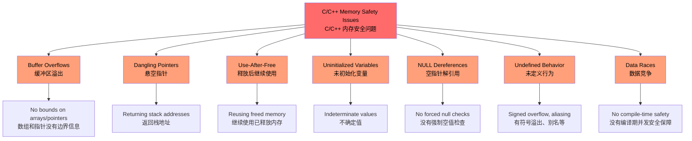
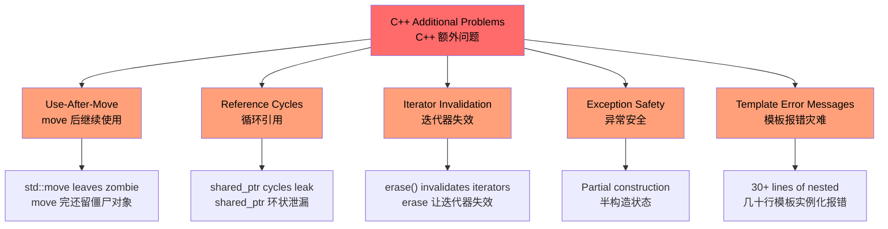
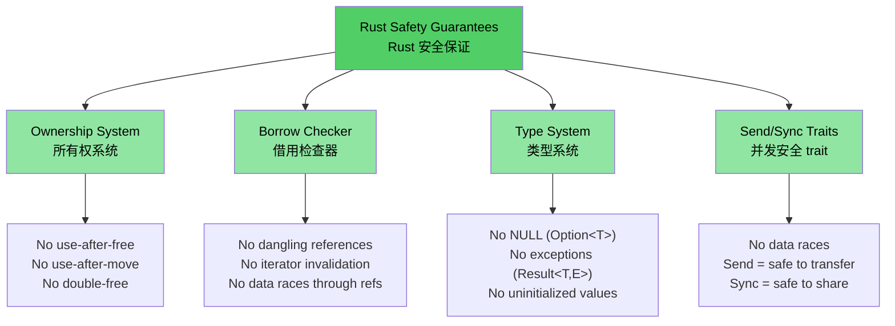

# Why C/C++ Developers Need Rust<br><span class="zh-inline">为什么 C/C++ 开发者需要 Rust</span>

> **What you'll learn:**<br><span class="zh-inline">**本章将学到什么：**</span>
> - The full set of problems Rust removes: memory safety bugs, undefined behavior, data races, and more<br><span class="zh-inline">Rust 能从结构上消灭哪些问题：内存安全漏洞、未定义行为、数据竞争等等</span>
> - Why `shared_ptr`、`unique_ptr` and other C++ mitigations are patches rather than cures<br><span class="zh-inline">为什么 `shared_ptr`、`unique_ptr` 等 C++ 缓解手段更像补丁，而不是根治方案</span>
> - Concrete vulnerability patterns in C and C++ that are structurally impossible in safe Rust<br><span class="zh-inline">C 与 C++ 中那些真实存在的漏洞模式，为什么在安全 Rust 里从结构上就写不出来</span>

> **Want to skip straight to code?** Jump to [Show me some code](ch02-getting-started.md#enough-talk-already-show-me-some-code)<br><span class="zh-inline">**想直接看代码？** 可以跳到 [给点代码看看](ch02-getting-started.md#enough-talk-already-show-me-some-code)。</span>

## What Rust Eliminates — The Complete List<br><span class="zh-inline">Rust 到底消灭了什么——完整清单</span>

Before looking at examples, here is the executive summary: safe Rust prevents every issue in the list below by construction. These are not “best practices” that depend on discipline or review; they are guarantees enforced by the compiler and type system.<br><span class="zh-inline">先别急着看例子，先看一句总纲：下面这张表里的每一类问题，安全 Rust 都是从结构上卡死的。这不是“靠自觉遵守规范”，也不是“靠 code review 多盯一眼”，而是编译器和类型系统直接给出的保证。</span>

| **Eliminated Issue** | **C** | **C++** | **How Rust Prevents It**<br><span class="zh-inline">Rust 如何避免</span> |
|----------------------|:-----:|:-------:|--------------------------|
| Buffer overflows / underflows | ✅ | ✅ | Arrays, slices, and strings carry bounds; indexing is checked at runtime<br><span class="zh-inline">数组、切片、字符串都自带边界信息；下标访问会检查边界</span> |
| Memory leaks | ✅ | ✅ | `Drop` trait makes RAII automatic and uniform<br><span class="zh-inline">`Drop` trait 让 RAII 自动且统一</span> |
| Dangling pointers | ✅ | ✅ | Lifetimes prove references outlive what they point to<br><span class="zh-inline">生命周期系统证明引用不会比被引用对象活得更久</span> |
| Use-after-free | ✅ | ✅ | Ownership turns it into a compile error<br><span class="zh-inline">所有权系统直接把它变成编译错误</span> |
| Use-after-move | — | ✅ | Moves are destructive; old bindings become invalid<br><span class="zh-inline">move 是破坏性的，旧变量直接失效</span> |
| Uninitialized variables | ✅ | ✅ | The compiler requires initialization before use<br><span class="zh-inline">编译器要求变量使用前必须初始化</span> |
| Integer overflow / underflow UB | ✅ | ✅ | Debug build panic, release wrap; both are defined behavior<br><span class="zh-inline">调试版 panic，发布版环绕，行为总是明确的</span> |
| NULL dereferences / SEGVs | ✅ | ✅ | No null references in safe code; `Option<T>` forces handling<br><span class="zh-inline">安全代码没有空引用，`Option<T>` 强制显式处理</span> |
| Data races | ✅ | ✅ | `Send` / `Sync` plus borrow checking make races a compile error<br><span class="zh-inline">`Send` / `Sync` 配合借用检查，把数据竞争变成编译错误</span> |
| Uncontrolled side-effects | ✅ | ✅ | Immutability by default; mutation requires explicit `mut`<br><span class="zh-inline">默认不可变，修改必须显式写 `mut`</span> |
| No inheritance complexity | — | ✅ | Traits and composition replace fragile hierarchies<br><span class="zh-inline">trait 与组合替代脆弱继承树</span> |
| No hidden exceptions | — | ✅ | Errors are values via `Result<T, E>`<br><span class="zh-inline">错误就是值，用 `Result<T, E>` 明确表达</span> |
| Iterator invalidation | — | ✅ | Borrow checking forbids mutation while iterating<br><span class="zh-inline">借用检查禁止“边迭代边乱改”</span> |
| Reference cycles / leaked finalizers | — | ✅ | `Rc` cycles are opt-in and breakable with `Weak`<br><span class="zh-inline">`Rc` 环必须显式构造，并且能用 `Weak` 打断</span> |
| Forgotten mutex unlocks | ✅ | ✅ | `Mutex<T>` exposes the data only through a guard<br><span class="zh-inline">`Mutex<T>` 只能通过 guard 访问数据，离开作用域自动解锁</span> |
| Undefined behavior in safe code | ✅ | ✅ | Safe Rust has zero UB by definition<br><span class="zh-inline">安全 Rust 按定义就没有 UB</span> |

> **Bottom line:** These are compile-time guarantees, not aspirations. If safe Rust code compiles, these classes of bugs cannot be present.<br><span class="zh-inline">**一句话概括：** 这不是靠理想主义喊口号，而是编译期保证。只要安全 Rust 代码能编过，这些类别的 bug 就不存在。</span>

---

## The Problems Shared by C and C++<br><span class="zh-inline">C 和 C++ 共有的问题</span>

> **Want to skip the examples?** Jump to [How Rust Addresses All of This](#how-rust-addresses-all-of-this) or straight to [Show me some code](ch02-getting-started.md#enough-talk-already-show-me-some-code).<br><span class="zh-inline">**如果懒得看这些例子：** 可以直接跳到 [Rust 是怎么把这些问题都收拾掉的](#how-rust-addresses-all-of-this)，或者直接去 [给点代码看看](ch02-getting-started.md#enough-talk-already-show-me-some-code)。</span>

Both languages share a core group of memory-safety problems, and these problems sit behind a huge fraction of real-world CVEs.<br><span class="zh-inline">这两门语言共享一整套核心内存安全问题，而现实世界里大量 CVE 的根子，基本都能追到这些地方来。</span>

### Buffer overflows<br><span class="zh-inline">缓冲区溢出</span>

C arrays, pointers, and C strings carry no built-in bounds information, so stepping past the end is absurdly easy.<br><span class="zh-inline">C 的数组、指针和 C 风格字符串本身没有边界信息，所以越界这件事简直轻松得离谱。</span>

```c
#include <stdlib.h>
#include <string.h>

void buffer_dangers() {
    char buffer[10];
    strcpy(buffer, "This string is way too long!");  // Buffer overflow

    int arr[5] = {1, 2, 3, 4, 5};
    int *ptr = arr;           // Loses size information
    ptr[10] = 42;             // No bounds check — undefined behavior
}
```

在 C++ 里也没有彻底解决这个问题，`std::vector::operator[]` 一样不做边界检查，真想检查还得主动用 `.at()`。然后异常谁来接、什么时候接，又是另一坨事。<br><span class="zh-inline">C++ does not fully solve this either: `std::vector::operator[]` still skips bounds checking. You only get checking with `.at()`, and then you are back to asking who catches the exception and where.</span>

### Dangling pointers and use-after-free<br><span class="zh-inline">悬空指针与释放后继续使用</span>

```c
int *bar() {
    int i = 42;
    return &i;    // Returns address of stack variable — dangling!
}

void use_after_free() {
    char *p = (char *)malloc(20);
    free(p);
    *p = '\0';   // Use after free — undefined behavior
}
```

### Uninitialized variables and undefined behavior<br><span class="zh-inline">未初始化变量与未定义行为</span>

C 和 C++ 都允许未初始化变量存在，读它们的时候会发生什么，全靠运气和编译器心情。<br><span class="zh-inline">Both C and C++ allow uninitialized variables, and reading them is undefined behavior. What actually happens depends on luck, compiler optimizations, and whatever garbage happened to be in memory.</span>

```c
int x;               // Uninitialized
if (x > 0) { ... }  // UB — x could be anything
```

Signed integer overflow is also a classic trap. Unsigned overflow in C is defined, but signed overflow in both C and C++ is undefined behavior, and modern compilers absolutely exploit that fact for optimization.<br><span class="zh-inline">有符号整数溢出也是老坑。C 里无符号溢出有定义，但有符号溢出在 C 和 C++ 里都是 UB。现代编译器是真的会利用这一点做优化，不是在吓唬人。</span>

### NULL pointer dereferences<br><span class="zh-inline">空指针解引用</span>

```c
int *ptr = NULL;
*ptr = 42;           // SEGV — but the compiler won't stop you
```

在 C++ 里，`std::optional<T>` 确实能缓和一部分空值问题，但很多人最后还是直接 `.value()`，然后把风险换成抛异常。<br><span class="zh-inline">C++ offers `std::optional<T>`, which helps, but many codebases still end up calling `.value()` and merely replacing null bugs with hidden exception paths.</span>

### The visualization: shared problems<br><span class="zh-inline">可视化：共有问题</span>



---

## C++ Adds More Problems on Top<br><span class="zh-inline">C++ 还额外叠了一层问题</span>

> **C audience:** If C++ is not part of your world, you can skip ahead to [How Rust Addresses All of This](#how-rust-addresses-all-of-this).<br><span class="zh-inline">**如果主要写 C，不怎么碰 C++：** 可以直接跳到 [Rust 是怎么把这些问题都收拾掉的](#how-rust-addresses-all-of-this)。</span>
>
> **Want to skip straight to code?** Jump to [Show me some code](ch02-getting-started.md#enough-talk-already-show-me-some-code).<br><span class="zh-inline">**想直接看代码？** 可以直接跳到 [给点代码看看](ch02-getting-started.md#enough-talk-already-show-me-some-code)。</span>

C++ introduced smart pointers, RAII, move semantics, templates, and exceptions to improve on C. These are meaningful improvements, but they often change “obvious crash at runtime” into “subtler bug at runtime” rather than eliminating the entire class of failure.<br><span class="zh-inline">C++ 引入了智能指针、RAII、move 语义、模板、异常，确实比 C 前进了一大步。但很多时候，它做的是把“当场炸掉的 bug”换成“更隐蔽、更难查的 bug”，而不是直接把这类错误从语言层面抹掉。</span>

### `unique_ptr` and `shared_ptr` — patches, not cures<br><span class="zh-inline">`unique_ptr` 和 `shared_ptr`——补丁，不是根治</span>

| C++ Mitigation | What It Fixes | What It **Doesn't** Fix<br><span class="zh-inline">仍然没解决什么</span> |
|----------------|---------------|------------------------|
| `std::unique_ptr` | Prevents many leaks via RAII<br><span class="zh-inline">通过 RAII 防住很多泄漏</span> | Use-after-move still compiles<br><span class="zh-inline">释放后继续用不一定能拦住，move 之后继续碰也照样能编</span> |
| `std::shared_ptr` | Shared ownership<br><span class="zh-inline">共享所有权</span> | Reference cycles leak silently<br><span class="zh-inline">循环引用照样会静悄悄泄漏</span> |
| `std::optional` | Replaces some null checks<br><span class="zh-inline">替代部分空值判断</span> | `.value()` can still throw<br><span class="zh-inline">`.value()` 还是能抛异常</span> |
| `std::string_view` | Avoids copies<br><span class="zh-inline">减少复制</span> | Can dangle if source dies<br><span class="zh-inline">源字符串一死就悬空</span> |
| Move semantics | Efficient transfer<br><span class="zh-inline">提高转移效率</span> | Moved-from objects remain valid-but-unspecified<br><span class="zh-inline">被 move 后的对象还活着，但状态含糊</span> |
| RAII | Automatic cleanup<br><span class="zh-inline">自动清理</span> | Rule of Five mistakes still bite hard<br><span class="zh-inline">Rule of Five 稍有失误还是会炸</span> |

```cpp
// unique_ptr: use-after-move compiles cleanly
std::unique_ptr<int> ptr = std::make_unique<int>(42);
std::unique_ptr<int> ptr2 = std::move(ptr);
std::cout << *ptr;  // Compiles! Undefined behavior at runtime.
                     // In Rust, this is a compile error: "value used after move"
```

```cpp
// shared_ptr: reference cycles leak silently
struct Node {
    std::shared_ptr<Node> next;
    std::shared_ptr<Node> parent;  // Cycle! Destructor never called.
};
auto a = std::make_shared<Node>();
auto b = std::make_shared<Node>();
a->next = b;
b->parent = a;  // Memory leak — ref count never reaches 0
                 // In Rust, Rc<T> + Weak<T> makes cycles explicit and breakable
```

### Use-after-move — the quiet killer<br><span class="zh-inline">move 之后继续使用——安静又致命</span>

C++ 的 `std::move` 并不是真的“把原变量从语义上抹掉”，它更像一个 cast。原对象还在，只是处于“合法但未指定状态”。而编译器允许继续用它。<br><span class="zh-inline">C++ `std::move` is not a destructive move in the Rust sense. It is closer to a cast that enables moving, while leaving the original object in a “valid but unspecified” state. The compiler still lets you touch it.</span>

```cpp
auto vec = std::make_unique<std::vector<int>>({1, 2, 3});
auto vec2 = std::move(vec);
vec->size();  // Compiles! But dereferencing nullptr — crash at runtime
```

In Rust, the move is destructive and the old binding is gone.<br><span class="zh-inline">Rust 则不玩这套暧昧状态，move 完就是没了。</span>

```rust
let vec = vec![1, 2, 3];
let vec2 = vec;           // Move — vec is consumed
// vec.len();             // Compile error: value used after move
```

### Iterator invalidation — real production bugs<br><span class="zh-inline">迭代器失效——线上常见真 bug</span>

These are not toy snippets. They represent real bug patterns that repeatedly appear in large C++ codebases.<br><span class="zh-inline">下面这些不是教学玩具，而是大体量 C++ 代码库里反复出现的真问题模式。</span>

```cpp
// BUG 1: erase without reassigning iterator (undefined behavior)
while (it != pending_faults.end()) {
    if (*it != nullptr && (*it)->GetId() == fault->GetId()) {
        pending_faults.erase(it);   // ← iterator invalidated!
        removed_count++;            //   next loop uses dangling iterator
    } else {
        ++it;
    }
}
// Fix: it = pending_faults.erase(it);
```

```cpp
// BUG 2: index-based erase skips elements
for (auto i = 0; i < entries.size(); i++) {
    if (config_status == ConfigDisable::Status::Disabled) {
        entries.erase(entries.begin() + i);  // ← shifts elements
    }                                         //   i++ skips the shifted one
}
```

```cpp
// BUG 3: one erase path correct, the other isn't
while (it != incomplete_ids.end()) {
    if (current_action == nullptr) {
        incomplete_ids.erase(it);  // ← BUG: iterator not reassigned
        continue;
    }
    it = incomplete_ids.erase(it); // ← Correct path
}
```

These all compile. Rust simply refuses to let the same “iterate while mutating unsafely” shape exist in safe code.<br><span class="zh-inline">这些代码全都能编。Rust 的做法更干脆：这种“边迭代边危险修改”的代码形状，在安全代码里根本不给过。</span>

### Exception safety and `dynamic_cast` plus `new`<br><span class="zh-inline">异常安全，以及 `dynamic_cast` 加 `new` 这一套</span>

```cpp
// Typical C++ factory pattern — every branch is a potential bug
DriverBase* driver = nullptr;
if (dynamic_cast<ModelA*>(device)) {
    driver = new DriverForModelA(framework);
} else if (dynamic_cast<ModelB*>(device)) {
    driver = new DriverForModelB(framework);
}
// What if driver is still nullptr? What if new throws? Who owns driver?
```

这种模式的问题不是“写不出来”，而是每一个分支都在偷藏前提：谁负责释放，哪个分支可能抛异常，没匹配到类型时怎么办，半构造状态怎么收尾。<br><span class="zh-inline">The issue here is not that the code cannot be made to work. The issue is that every branch quietly depends on ownership, construction, and failure assumptions that the compiler does not fully verify.</span>

### Dangling references and lambda captures<br><span class="zh-inline">悬空引用与 lambda 捕获</span>

```cpp
int& get_reference() {
    int x = 42;
    return x;  // Dangling reference — compiles, UB at runtime
}

auto make_closure() {
    int local = 42;
    return [&local]() { return local; };  // Dangling capture!
}
```

### The visualization: C++ additional problems<br><span class="zh-inline">可视化：C++ 额外叠加的问题</span>



---

## How Rust Addresses All of This<br><span class="zh-inline">Rust 是怎么把这些问题都收拾掉的</span>

Every issue above maps to one or more compile-time guarantees in Rust.<br><span class="zh-inline">上面那些问题，在 Rust 里基本都能对应到一条或几条编译期保证。</span>

| Problem | Rust's Solution<br><span class="zh-inline">Rust 的解法</span> |
|---------|-----------------|
| Buffer overflows | Slices carry length; indexing checks bounds<br><span class="zh-inline">切片自带长度；下标访问检查边界</span> |
| Dangling pointers / use-after-free | Lifetimes prove references remain valid<br><span class="zh-inline">生命周期证明引用始终有效</span> |
| Use-after-move | Moves are destructive and enforced by the compiler<br><span class="zh-inline">move 是破坏性的，由编译器强制执行</span> |
| Memory leaks | `Drop` gives RAII without the Rule of Five mess<br><span class="zh-inline">`Drop` 提供 RAII，但没有 Rule of Five 那堆包袱</span> |
| Reference cycles | `Rc` with `Weak` makes cycles explicit and manageable<br><span class="zh-inline">`Rc` 加 `Weak` 把环暴露成显式设计选择</span> |
| Iterator invalidation | Borrow checking forbids mutation while borrowed<br><span class="zh-inline">借用检查禁止借用期间乱改容器</span> |
| NULL pointers | `Option<T>` forces explicit absence handling<br><span class="zh-inline">`Option<T>` 强制显式处理“没有值”</span> |
| Data races | `Send` / `Sync` plus ownership rules stop them at compile time<br><span class="zh-inline">`Send` / `Sync` 配合所有权规则在编译期拦截</span> |
| Uninitialized variables | The compiler requires initialization<br><span class="zh-inline">编译器强制初始化</span> |
| Integer UB | Overflow behavior is always defined<br><span class="zh-inline">溢出行为始终有定义</span> |
| Exceptions | `Result<T, E>` keeps error flow visible<br><span class="zh-inline">`Result<T, E>` 让错误流显式可见</span> |
| Inheritance complexity | Traits plus composition replace brittle hierarchies<br><span class="zh-inline">trait 加组合替代脆弱继承体系</span> |
| Forgotten mutex unlocks | Lock guards release automatically on scope exit<br><span class="zh-inline">锁 guard 离开作用域自动释放</span> |

```rust
fn rust_prevents_everything() {
    // ✅ No buffer overflow — bounds checked
    let arr = [1, 2, 3, 4, 5];
    // arr[10];  // panic at runtime, never UB

    // ✅ No use-after-move — compile error
    let data = vec![1, 2, 3];
    let moved = data;
    // data.len();  // error: value used after move

    // ✅ No dangling pointer — lifetime error
    // let r;
    // { let x = 5; r = &x; }  // error: x does not live long enough

    // ✅ No null — Option forces handling
    let maybe: Option<i32> = None;
    // maybe.unwrap();  // panic, but you'd use match or if let instead

    // ✅ No data race — compile error
    // let mut shared = vec![1, 2, 3];
    // std::thread::spawn(|| shared.push(4));  // error: closure may outlive
    // shared.push(5);                         //   borrowed value
}
```

### Rust's safety model — the full picture<br><span class="zh-inline">Rust 安全模型全景图</span>



## Quick Reference: C vs C++ vs Rust<br><span class="zh-inline">速查表：C、C++ 与 Rust 对照</span>

| **Concept** | **C** | **C++** | **Rust** | **Key Difference**<br><span class="zh-inline">关键差异</span> |
|-------------|-------|---------|----------|-------------------|
| Memory management | `malloc()/free()` | `unique_ptr`, `shared_ptr` | `Box<T>`, `Rc<T>`, `Arc<T>` | Automatic, explicit, and safer<br><span class="zh-inline">更自动、更显式、也更安全</span> |
| Arrays | `int arr[10]` | `std::vector<T>`, `std::array<T>` | `Vec<T>`, `[T; N]` | Bounds checking by default<br><span class="zh-inline">默认有边界检查</span> |
| Strings | `char*` with `\0` | `std::string`, `string_view` | `String`, `&str` | UTF-8 plus lifetime checking<br><span class="zh-inline">UTF-8 默认支持，还带生命周期检查</span> |
| References | `int*` | `T&`, `T&&` | `&T`, `&mut T` | Borrow rules and lifetime checking<br><span class="zh-inline">有借用规则和生命周期检查</span> |
| Polymorphism | Function pointers | Virtual functions, inheritance | Traits, trait objects | Composition over inheritance<br><span class="zh-inline">组合优先于继承</span> |
| Generics | Macros / `void*` | Templates | Generics + trait bounds | Clearer semantics<br><span class="zh-inline">语义更明确</span> |
| Error handling | Return codes, `errno` | Exceptions, `optional` | `Result<T, E>`, `Option<T>` | Errors stay visible in signatures<br><span class="zh-inline">错误流在签名里可见</span> |
| NULL safety | Manual checks | `nullptr`, `optional` | `Option<T>` | Explicit absence handling<br><span class="zh-inline">缺失值处理更显式</span> |
| Thread safety | Manual | Manual | Compile-time `Send` / `Sync` | Data races prevented structurally<br><span class="zh-inline">数据竞争被结构性禁止</span> |
| Build system | Make, CMake | CMake, Make, etc. | Cargo | Integrated toolchain<br><span class="zh-inline">工具链一体化</span> |
| Undefined behavior | Everywhere | Subtle but everywhere | Zero in safe code | Safe code has no UB<br><span class="zh-inline">安全代码没有 UB</span> |

***
