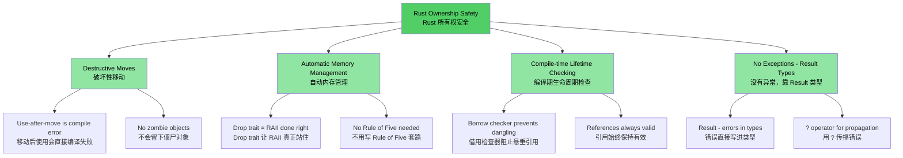
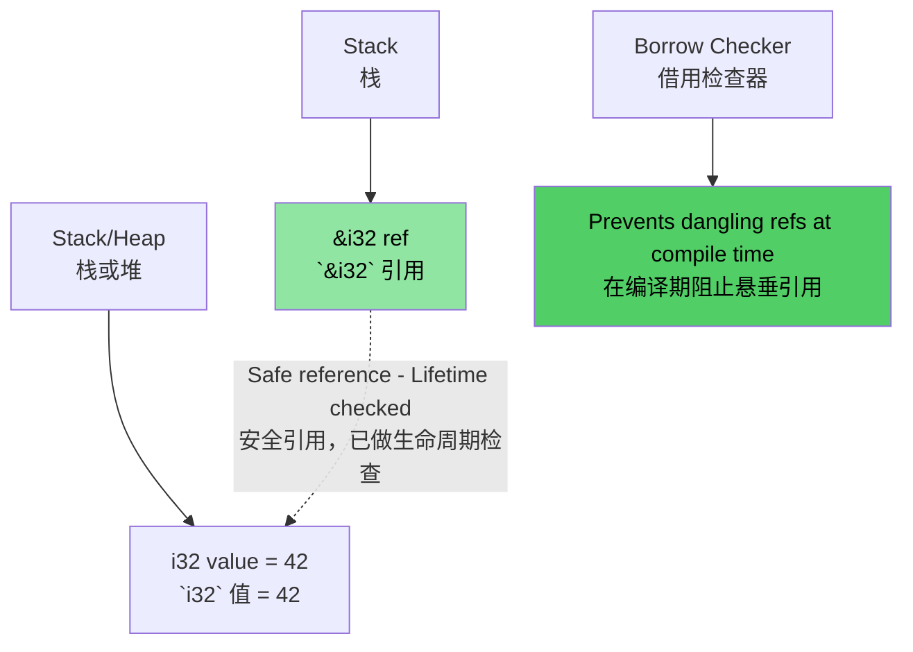
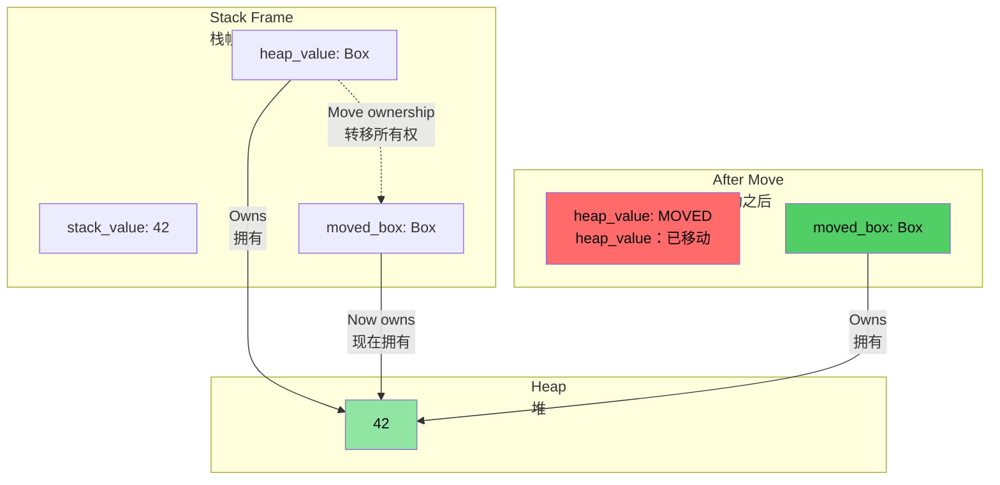
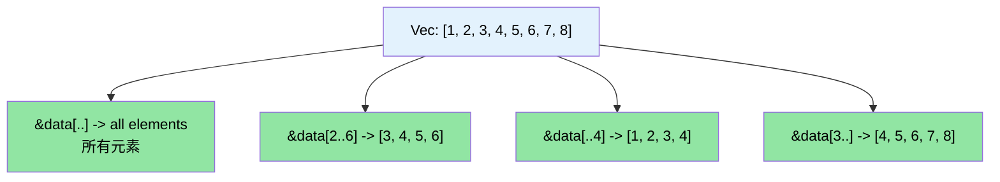

# Speaker intro and general approach<br><span class="zh-inline">讲者介绍与课程整体思路</span>

> **What you'll learn:** Course structure, the interactive format, and how familiar C/C++ concepts map to Rust equivalents. This chapter sets expectations and gives you a roadmap for the rest of the book.<br><span class="zh-inline">**本章将学到什么：** 课程结构、互动式学习方式，以及熟悉的 C / C++ 概念如何映射到 Rust。本章先把预期对齐，再给出整本书的路线图。</span>

- Speaker intro<br><span class="zh-inline">讲者背景</span>
  - Principal Firmware Architect in Microsoft SCHIE (Silicon and Cloud Hardware Infrastructure Engineering) team<br><span class="zh-inline">微软 SCHIE（Silicon and Cloud Hardware Infrastructure Engineering）团队的首席固件架构师。</span>
  - Industry veteran with expertise in security, systems programming, CPU and platform architecture, and C++ systems<br><span class="zh-inline">长期深耕安全、系统编程、CPU 与平台架构，以及 C++ 系统开发。</span>
  - Started programming in Rust in 2017 at AWS EC2 and have been deeply invested in the language ever since<br><span class="zh-inline">2017 年在 AWS EC2 开始写 Rust，之后就一直深度投入这门语言。</span>
- This course is intended to be as interactive as possible.<br><span class="zh-inline">这门课会尽量做成高互动形式。</span>
  - Assumption: You know C, C++, or both<br><span class="zh-inline">默认前提：已经熟悉 C、C++，或者两者都熟。</span>
  - Examples deliberately map familiar concepts to Rust equivalents<br><span class="zh-inline">示例会故意沿着熟悉概念往 Rust 对应物上带，减少认知跳跃。</span>
  - **Please feel free to ask clarifying questions at any point of time**<br><span class="zh-inline">**任何时候都可以插进来问澄清问题。**</span>
- Continued engagement with engineering teams is encouraged.<br><span class="zh-inline">也希望后续能继续和工程团队深入交流。</span>

# The case for Rust<br><span class="zh-inline">为什么值得认真看 Rust</span>

> **Want to skip straight to code?** Jump to [Show me some code](ch02-getting-started.md#enough-talk-already-show-me-some-code)<br><span class="zh-inline">**想直接看代码？** 可以跳到 [给点代码看看](ch02-getting-started.md#enough-talk-already-show-me-some-code)。</span>

Whether the background is C or C++, the core pain points are basically the same: memory-safety bugs that compile cleanly, then crash, corrupt, or leak at runtime.<br><span class="zh-inline">不管主要背景是 C 还是 C++，最烦人的核心问题其实都差不多：内存安全 bug 编译时屁事没有，运行时却能把程序搞崩、把数据搞坏、把资源搞漏。</span>

- Over **70% of CVEs** are caused by memory-safety issues such as buffer overflows, dangling pointers, and use-after-free.<br><span class="zh-inline">超过 **70% 的 CVE** 都和内存安全问题有关，比如缓冲区溢出、悬垂指针、释放后继续使用。</span>
- C++ `shared_ptr`、`unique_ptr`、RAII and move semantics are useful steps forward, but they are still **bandaids, not cures**.<br><span class="zh-inline">C++ 的 `shared_ptr`、`unique_ptr`、RAII 和移动语义确实进步很大，但本质上还只是 **止血贴，不是根治方案**。</span>
- Gaps such as use-after-move, reference cycles, iterator invalidation, and exception-safety hazards are still left open.<br><span class="zh-inline">像 use-after-move、引用环、迭代器失效、异常安全这些口子，依然都在。</span>
- Rust keeps the performance expectations of C / C++, while adding **compile-time guarantees** for safety.<br><span class="zh-inline">Rust 保住了 C / C++ 这一级别的性能，同时把安全保证提前到 **编译期**。</span>

> **📖 Deep dive:** See [Why C/C++ Developers Need Rust](ch01-1-why-c-cpp-developers-need-rust.md) for concrete vulnerability examples, the full list of problems Rust eliminates, and why C++ smart pointers still fall short.<br><span class="zh-inline">**📖 深入阅读：** [为什么 C / C++ 开发者需要 Rust](ch01-1-why-c-cpp-developers-need-rust.md) 里有更具体的漏洞案例、Rust 能消灭的问题清单，以及为什么 C++ 智能指针依然不够。</span>

----

# How does Rust address these issues?<br><span class="zh-inline">Rust 是怎么处理这些问题的</span>

## Buffer overflows and bounds violations<br><span class="zh-inline">缓冲区溢出与越界访问</span>

- All Rust arrays, slices, and strings carry explicit bounds information.<br><span class="zh-inline">Rust 的数组、切片和字符串都带着明确的边界信息。</span>
- The compiler inserts checks so that a bounds violation becomes a **runtime panic**, never undefined behavior.<br><span class="zh-inline">编译器会插入边界检查，越界访问顶多触发 **运行时 panic**，不会悄悄掉进未定义行为。</span>

## Dangling pointers and references<br><span class="zh-inline">悬垂指针与悬垂引用</span>

- Rust introduces lifetimes and borrow checking to eliminate dangling references at **compile time**.<br><span class="zh-inline">Rust 通过生命周期和借用检查，在 **编译期** 直接消灭悬垂引用。</span>
- No dangling pointers and no use-after-free — the compiler simply refuses to accept such code.<br><span class="zh-inline">没有悬垂指针，也没有释放后继续使用；这种代码编译器压根就不让过。</span>

## Use-after-move<br><span class="zh-inline">移动后继续使用</span>

- Rust's ownership system makes moves **destructive**. Once a value is moved, the original binding is unusable.<br><span class="zh-inline">Rust 的所有权系统把 move 设计成 **破坏性转移**。值一旦被移动，原绑定立刻失效。</span>
- That means no zombie objects and no “valid but unspecified state” nonsense left behind.<br><span class="zh-inline">这样就不会留下什么僵尸对象，也不会冒出那种“有效但状态未指定”的烂摊子。</span>

## Resource management<br><span class="zh-inline">资源管理</span>

- Rust's `Drop` trait is RAII done properly: resources are released automatically when they go out of scope.<br><span class="zh-inline">Rust 的 `Drop` trait 把 RAII 真正做扎实了：资源一出作用域就自动释放。</span>
- It also blocks use-after-move, which is exactly the hole C++ RAII still cannot seal completely.<br><span class="zh-inline">同时它还和所有权系统联动，直接堵上了 C++ RAII 依然兜不住的 use-after-move 问题。</span>
- No Rule of Five ceremony is required.<br><span class="zh-inline">也不用再背什么 Rule of Five 套路。</span>

## Error handling<br><span class="zh-inline">错误处理</span>

- Rust has no exceptions. Errors are values, usually represented as `Result<T, E>`.<br><span class="zh-inline">Rust 没有异常系统，错误就是值，最常见的载体就是 `Result<T, E>`。</span>
- Error paths stay explicit in the type signature instead of藏在控制流后面。<br><span class="zh-inline">错误分支会直接写进类型签名里，而不是躲在隐蔽控制流后面。</span>

## Iterator invalidation<br><span class="zh-inline">迭代器失效</span>

- Rust's borrow checker **forbids modifying a collection while iterating over it**.<br><span class="zh-inline">Rust 的借用检查器会 **禁止边遍历边改容器** 这种写法。</span>
- A whole class of C++ 老毛病 therefore cannot even be expressed in valid Rust.<br><span class="zh-inline">这类在 C++ 代码库里反复出没的老毛病，在 Rust 里连合法代码都写不出来。</span>

```rust
// Rust equivalent of erase-during-iteration: retain()
pending_faults.retain(|f| f.id != fault_to_remove.id);

// Or: collect into a new Vec (functional style)
let remaining: Vec<_> = pending_faults
    .into_iter()
    .filter(|f| f.id != fault_to_remove.id)
    .collect();
```

## Data races<br><span class="zh-inline">数据竞争</span>

- The type system prevents data races at **compile time** through `Send` and `Sync`.<br><span class="zh-inline">类型系统通过 `Send` 和 `Sync` 在 **编译期** 阻止数据竞争。</span>

## Memory Safety Visualization<br><span class="zh-inline">内存安全可视化</span>

### Rust Ownership — Safe by Design<br><span class="zh-inline">Rust 所有权：从设计上就偏安全</span>

```rust
fn safe_rust_ownership() {
    // Move is destructive: original is gone
    let data = vec![1, 2, 3];
    let data2 = data;           // Move happens
    // data.len();              // Compile error: value used after move
    
    // Borrowing: safe shared access
    let owned = String::from("Hello, World!");
    let slice: &str = &owned;  // Borrow — no allocation
    println!("{}", slice);     // Always safe
    
    // No dangling references possible
    /*
    let dangling_ref;
    {
        let temp = String::from("temporary");
        dangling_ref = &temp;  // Compile error: temp doesn't live long enough
    }
    */
}
```



## Memory Layout: Rust References<br><span class="zh-inline">内存布局：Rust 引用</span>



### `Box<T>` Heap Allocation Visualization<br><span class="zh-inline">`Box<T>` 堆分配示意</span>

```rust
fn box_allocation_example() {
    // Stack allocation
    let stack_value = 42;
    
    // Heap allocation with Box
    let heap_value = Box::new(42);
    
    // Moving ownership
    let moved_box = heap_value;
    // heap_value is no longer accessible
}
```



## Slice Operations Visualization<br><span class="zh-inline">切片操作示意</span>

```rust
fn slice_operations() {
    let data = vec![1, 2, 3, 4, 5, 6, 7, 8];
    
    let full_slice = &data[..];        // [1,2,3,4,5,6,7,8]
    let partial_slice = &data[2..6];   // [3,4,5,6]
    let from_start = &data[..4];       // [1,2,3,4]
    let to_end = &data[3..];           // [4,5,6,7,8]
}
```



# Other Rust USPs and features<br><span class="zh-inline">Rust 其他明显优势</span>

- No data races between threads because `Send` / `Sync` are checked at compile time.<br><span class="zh-inline">线程之间没有数据竞争，因为 `Send` / `Sync` 会在编译期被检查。</span>
- No use-after-move, unlike C++ `std::move`, which can留下“被搬空但还能碰”的对象。<br><span class="zh-inline">没有 use-after-move，这一点和 C++ `std::move` 形成鲜明对比。</span>
- No uninitialized variables.<br><span class="zh-inline">没有未初始化变量。</span>
  - Every variable must be initialized before it is used.<br><span class="zh-inline">所有变量都必须先初始化再使用。</span>
- No trivial memory leaks.<br><span class="zh-inline">不会出现那种轻轻松松就漏掉的内存泄漏。</span>
  - `Drop` trait gives proper RAII without Rule of Five ceremony.<br><span class="zh-inline">`Drop` trait 把 RAII 做顺了，不需要 Rule of Five 仪式感写法。</span>
  - The compiler releases memory automatically when values go out of scope.<br><span class="zh-inline">值离开作用域时，编译器会自动安排释放。</span>
- No forgotten locks on mutexes.<br><span class="zh-inline">不会忘记解互斥锁。</span>
  - Lock guards are the only legal way to access the protected data.<br><span class="zh-inline">锁守卫才是访问受保护数据的唯一正规入口。</span>
- No exception-handling maze.<br><span class="zh-inline">也没有异常处理迷宫。</span>
  - Errors are values (`Result<T, E>`) and are propagated with `?`.<br><span class="zh-inline">错误就是值，通过 `Result<T, E>` 表达，再用 `?` 传播。</span>
- Excellent support for type inference, enums, pattern matching, and zero-cost abstractions.<br><span class="zh-inline">类型推断、枚举、模式匹配和零成本抽象都很能打。</span>
- Built-in support for dependency management, building, testing, formatting, and linting.<br><span class="zh-inline">依赖管理、构建、测试、格式化、lint 这一整套工具链都是自带的。</span>
  - `cargo` replaces the usual make / CMake plus extra lint and test glue.<br><span class="zh-inline">`cargo` 基本能替代 make / CMake 再加一堆零碎测试与检查工具。</span>

# Quick Reference: Rust vs C/C++<br><span class="zh-inline">速查表：Rust 与 C / C++ 对照</span>

| **Concept**<br><span class="zh-inline">概念</span> | **C** | **C++** | **Rust** | **Key Difference**<br><span class="zh-inline">关键差别</span> |
|-------------|-------|---------|----------|-------------------|
| Memory management<br><span class="zh-inline">内存管理</span> | `malloc()/free()` | `unique_ptr`, `shared_ptr` | `Box<T>`, `Rc<T>`, `Arc<T>` | Automatic, no cycles<br><span class="zh-inline">自动管理，并尽量避开引用环问题</span> |
| Arrays<br><span class="zh-inline">数组</span> | `int arr[10]` | `std::vector<T>`, `std::array<T>` | `Vec<T>`, `[T; N]` | Bounds checking by default<br><span class="zh-inline">默认带边界检查</span> |
| Strings<br><span class="zh-inline">字符串</span> | `char*` with `\0` | `std::string`, `string_view` | `String`, `&str` | UTF-8 guaranteed, lifetime-checked<br><span class="zh-inline">UTF-8 默认保证，生命周期可检查</span> |
| References<br><span class="zh-inline">引用</span> | `int* ptr` | `T&`, `T&&` | `&T`, `&mut T` | Borrow checking, lifetimes<br><span class="zh-inline">借用检查加生命周期</span> |
| Polymorphism<br><span class="zh-inline">多态</span> | Function pointers | Virtual functions, inheritance | Traits, trait objects | Composition over inheritance<br><span class="zh-inline">更强调组合而不是继承</span> |
| Generic programming<br><span class="zh-inline">泛型编程</span> | Macros (`void*`) | Templates | Generics + trait bounds | Better error messages<br><span class="zh-inline">错误信息通常更友好</span> |
| Error handling<br><span class="zh-inline">错误处理</span> | Return codes, `errno` | Exceptions, `std::optional` | `Result<T, E>`, `Option<T>` | No hidden control flow<br><span class="zh-inline">没有隐藏控制流</span> |
| NULL / null safety<br><span class="zh-inline">空值安全</span> | `ptr == NULL` | `nullptr`, `std::optional<T>` | `Option<T>` | Forced null checking<br><span class="zh-inline">强制显式处理空值</span> |
| Thread safety<br><span class="zh-inline">线程安全</span> | Manual (`pthreads`) | Manual synchronization | Compile-time guarantees | Data races impossible in safe Rust<br><span class="zh-inline">安全 Rust 中数据竞争写不出来</span> |
| Build system<br><span class="zh-inline">构建系统</span> | Make, CMake | CMake, Make, etc. | Cargo | Integrated toolchain<br><span class="zh-inline">工具链一体化</span> |
| Undefined behavior<br><span class="zh-inline">未定义行为</span> | Runtime crashes | Subtle UB (signed overflow, aliasing) | Compile-time errors | Safety guaranteed far earlier<br><span class="zh-inline">更早把安全问题挡在编译阶段</span> |

***
