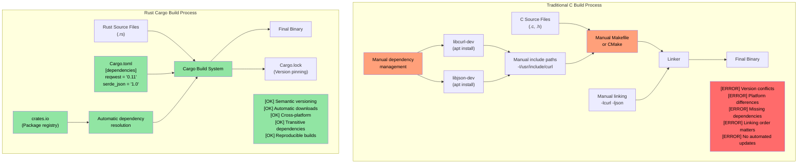
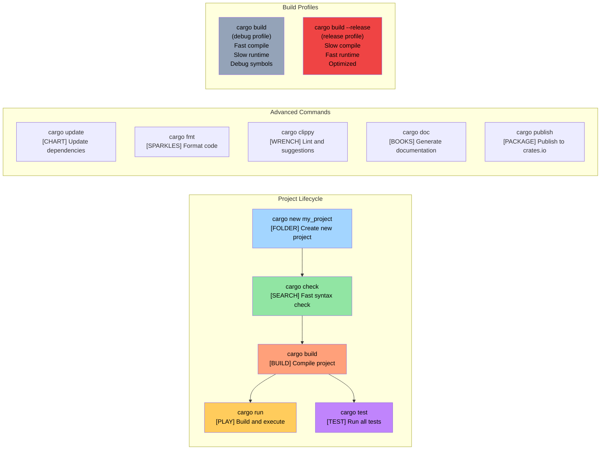

# Enough talk already: Show me some code<br><span class="zh-inline">废话少说，先上代码</span>

> **What you'll learn:** Your first Rust program — `fn main()`, `println!()`, and how Rust macros differ fundamentally from C/C++ preprocessor macros. By the end you'll be able to write, compile, and run simple Rust programs.<br><span class="zh-inline">**本章将学到什么：** 第一个 Rust 程序应该怎么写，`fn main()` 和 `println!()` 是什么，以及 Rust 宏和 C/C++ 预处理宏在根子上有什么不同。读完这一章，就能自己写、编译并运行简单的 Rust 程序。</span>

```rust
fn main() {
    println!("Hello world from Rust");
}
```

- The above syntax should be similar to anyone familiar with C-style languages<br><span class="zh-inline">上面这段语法，对熟悉 C 风格语言的人来说应该很眼熟。</span>
    - All functions in Rust begin with the `fn` keyword<br><span class="zh-inline">Rust 里的函数统一用 `fn` 关键字开头。</span>
    - The default entry point for executables is `main()`<br><span class="zh-inline">可执行程序的默认入口函数就是 `main()`。</span>
    - The `println!` looks like a function, but is actually a **macro**. Macros in Rust are very different from C/C++ preprocessor macros — they are hygienic, type-safe, and operate on the syntax tree rather than text substitution<br><span class="zh-inline">`println!` 看着像函数，其实是 **宏**。Rust 的宏和 C/C++ 的预处理宏差别很大，它们具备卫生性和类型安全，操作对象是语法树，而不是简单的文本替换。</span>

- Two great ways to quickly try out Rust snippets:<br><span class="zh-inline">想快速试一小段 Rust 代码，有两个特别方便的办法：</span>
    - **Online**: [Rust Playground](https://play.rust-lang.org/) — paste code, hit Run, share results. No install needed<br><span class="zh-inline">**在线方式**：[Rust Playground](https://play.rust-lang.org/)。把代码贴进去，点 Run 就能跑，还方便分享结果，连安装都省了。</span>
    - **Local REPL**: Install [`evcxr_repl`](https://github.com/evcxr/evcxr) for an interactive Rust REPL (like Python's REPL, but for Rust):<br><span class="zh-inline">**本地 REPL**：安装 [`evcxr_repl`](https://github.com/evcxr/evcxr)，就能得到一个交互式 Rust REPL，体验上有点像 Python 的交互解释器。</span>

```bash
cargo install --locked evcxr_repl
evcxr   # Start the REPL, type Rust expressions interactively
```

### Rust Local installation<br><span class="zh-inline">Rust 本地安装</span>

- Rust can be locally installed using the following methods<br><span class="zh-inline">Rust 本地安装通常用下面这些方式：</span>
    - Windows: https://static.rust-lang.org/rustup/dist/x86_64-pc-windows-msvc/rustup-init.exe<br><span class="zh-inline">Windows 直接运行 `rustup-init.exe` 安装器即可。</span>
    - Linux / WSL: `curl --proto '=https' --tlsv1.2 -sSf https://sh.rustup.rs | sh`<br><span class="zh-inline">Linux / WSL 一般用官方提供的一条 shell 安装命令。</span>

- The Rust ecosystem is composed of the following components<br><span class="zh-inline">Rust 工具链大致由下面几块组成：</span>
    - `rustc` is the standalone compiler, but it's seldom used directly<br><span class="zh-inline">`rustc` 是底层编译器，但平时很少直接裸用它。</span>
    - The preferred tool, `cargo` is the Swiss Army knife and is used for dependency management, building, testing, formatting, linting, etc.<br><span class="zh-inline">真正高频使用的是 `cargo`。这玩意就是 Rust 世界的瑞士军刀，依赖管理、构建、测试、格式化、lint 基本都归它管。</span>
    - The Rust toolchain comes in the `stable`, `beta` and `nightly` (experimental) channels, but we'll stick with `stable`. Use the `rustup update` command to upgrade the `stable` installation that's released every six weeks<br><span class="zh-inline">Rust 工具链分 `stable`、`beta` 和实验性质更强的 `nightly`。这里默认先用 `stable`。它大约每六周发一版，更新时跑 `rustup update` 就行。</span>

- We'll also install the `rust-analyzer` plug-in for VSCode<br><span class="zh-inline">另外也建议顺手装上 VS Code 的 `rust-analyzer` 插件，补全、跳转和诊断体验会好很多。</span>

这套安装流程比传统 C/C++ 开发环境省心得多。尤其是刚从“编译器、构建系统、包管理器、IDE 插件全靠自己拼”的世界里过来时，Cargo 和 rustup 的统一体验会显得格外顺。<br><span class="zh-inline">很多人第一次碰 Rust 就觉得工具链终于像一个整体了，说的就是这个感觉。</span>

# Rust packages (crates)<br><span class="zh-inline">Rust 包，也就是 crate</span>

- Rust binaries are created using packages (hereby called crates)<br><span class="zh-inline">Rust 的可执行程序通常由 package 构建出来，这里统一把它们叫 crate。</span>
    - A crate may either be standalone, or may have dependency on other crates. The crates for the dependencies can be local or remote. Third-party crates are typically downloaded from a centralized repository called `crates.io`.<br><span class="zh-inline">crate 可以是独立项目，也可以依赖其他 crate。依赖既可以是本地路径，也可以是远程来源。第三方 crate 通常从集中仓库 `crates.io` 下载。</span>
    - The `cargo` tool automatically handles the downloading of crates and their dependencies. This is conceptually equivalent to linking to C-libraries<br><span class="zh-inline">`cargo` 会自动处理 crate 以及其依赖的下载和构建。从概念上说，这有点像 C 里链接外部库，但流程自动化程度高得多。</span>
    - Crate dependencies are expressed in a file called `Cargo.toml`. It also defines the target type for the crate: standalone executable, static library, dynamic library (uncommon)<br><span class="zh-inline">crate 的依赖都写在 `Cargo.toml` 里。这个文件还会描述目标类型，例如独立可执行程序、静态库、动态库等。</span>
    - Reference: https://doc.rust-lang.org/cargo/reference/cargo-targets.html<br><span class="zh-inline">参考文档： https://doc.rust-lang.org/cargo/reference/cargo-targets.html</span>

对 C/C++ 开发者来说，这一节是非常关键的思维切换。Rust 不是“把源码交给编译器，再自己去 Makefile 或 CMake 里补完剩下的一切”；它默认就把项目定义、依赖图和构建流程绑在一起了。<br><span class="zh-inline">这会让不少老 C++ 工程师一开始觉得有点不习惯，但习惯之后基本回不去手搓依赖那套日子。</span>

## Cargo vs Traditional C Build Systems<br><span class="zh-inline">Cargo 与传统 C 构建系统对比</span>

### Dependency Management Comparison<br><span class="zh-inline">依赖管理对比</span>



这张图的意思很直接。传统 C 构建流程里，依赖安装、头文件路径、链接顺序、平台差异，样样都可能整出幺蛾子。Cargo 则把其中大半脏活统一吃掉了。<br><span class="zh-inline">当然 Cargo 不是万能药，但它至少把“构建一份正常项目”这件事从手工拼装活，改造成了标准工作流。</span>

### Cargo Project Structure<br><span class="zh-inline">Cargo 项目结构</span>

```text
my_project/
|-- Cargo.toml          # Project configuration (like package.json)
|-- Cargo.lock          # Exact dependency versions (auto-generated)
|-- src/
|   |-- main.rs         # Main entry point for binary
|   |-- lib.rs          # Library root (if creating a library)
|   `-- bin/            # Additional binary targets
|-- tests/              # Integration tests
|-- examples/           # Example code
|-- benches/            # Benchmarks
`-- target/             # Build artifacts (like C's build/ or obj/)
    |-- debug/          # Debug builds (fast compile, slow runtime)
    `-- release/        # Release builds (slow compile, fast runtime)
```

这个目录结构很值得熟悉，因为后面几乎所有 Rust 项目都会长得差不多。<br><span class="zh-inline">它最大的好处，就是“哪里放主程序、哪里放库代码、哪里放测试和例子”这类问题不再需要团队每次重新发明一套规矩。</span>

### Common Cargo Commands<br><span class="zh-inline">常用 Cargo 命令</span>



这里最值得尽快养成习惯的命令通常有三个：`cargo check`、`cargo run`、`cargo test`。<br><span class="zh-inline">`cargo check` 特别好使，它只做类型检查和分析，不生成最终二进制，速度比完整编译快得多。写代码时高频跑这个，体验会舒服不少。</span>

# Example: cargo and crates<br><span class="zh-inline">示例：Cargo 与 crate 的基本使用</span>

- In this example, we have a standalone executable crate with no other dependencies<br><span class="zh-inline">这个例子里先只建一个没有额外依赖的独立可执行 crate。</span>
- Use the following commands to create a new crate called `helloworld`<br><span class="zh-inline">用下面这些命令创建一个叫 `helloworld` 的 crate：</span>

```bash
cargo new helloworld
cd helloworld
cat Cargo.toml
```

- By default, `cargo run` will compile and run the `debug` (unoptimized) version of the crate. To execute the `release` version, use `cargo run --release`<br><span class="zh-inline">默认情况下，`cargo run` 会编译并运行 `debug` 版本，也就是未优化构建。想跑优化版，就用 `cargo run --release`。</span>
- Note that actual binary file resides under the `target` folder under the `debug` or `release` folder<br><span class="zh-inline">真正生成出来的二进制文件，会落在 `target/debug/` 或 `target/release/` 下面。</span>
- We might have also noticed a file called `Cargo.lock` in the same folder as the source. It is automatically generated and should not be modified by hand<br><span class="zh-inline">同目录里还会看到一个 `Cargo.lock` 文件，它是自动生成的，别手动瞎改。</span>
    - We will revisit the specific purpose of `Cargo.lock` later<br><span class="zh-inline">后面还会专门回头讲 `Cargo.lock` 的具体作用。</span>

这一章最重要的，不是记住某个命令，而是接受一个事实：Rust 项目开发默认就是围绕 Cargo 展开的。<br><span class="zh-inline">只要把这套工作方式吃透，后面学习依赖管理、测试、文档、工作区和发布流程时，很多东西都会顺着接上。</span>
