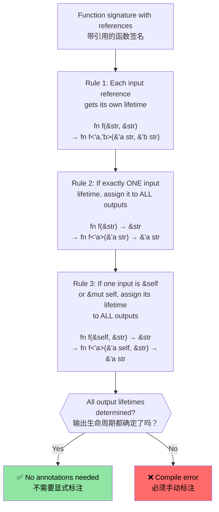

# Rust lifetime and borrowing<br><span class="zh-inline">Rust 的生命周期与借用</span>

> **What you'll learn:** How Rust's lifetime system ensures references never dangle, from implicit lifetimes through explicit annotations to the three elision rules that keep most code annotation-free. This chapter is worth understanding before moving on to smart pointers.<br><span class="zh-inline">**本章将学到什么：** Rust 的生命周期系统如何确保引用永远不会悬空；从隐式生命周期、显式标注，到让大部分代码都能免标注的三条省略规则。想继续往智能指针那部分走，这一章最好先吃透。</span>

- Rust enforces one mutable reference or many immutable references at a time<br><span class="zh-inline">Rust 强制执行一条核心规则：同一时间要么只有一个可变引用，要么可以有多个不可变引用。</span>
    - Every reference must live no longer than the original owner it borrows from. In most cases this lifetime information is inferred automatically by the compiler.<br><span class="zh-inline">任何引用的存活时间都不能超过它所借用的原始所有者。大多数情况下，编译器会自动把这些生命周期推导出来。</span>

```rust
fn borrow_mut(x: &mut u32) {
    *x = 43;
}
fn main() {
    let mut x = 42;
    let y = &mut x;
    borrow_mut(y);
    let _z = &x; // Permitted because the compiler knows y isn't subsequently used
    //println!("{y}"); // Will not compile if this is uncommented
    borrow_mut(&mut x); // Permitted because _z isn't used 
    let z = &x; // Ok -- mutable borrow of x ended after foo() returned
    println!("{z}");
}
```

# Rust lifetime annotations<br><span class="zh-inline">Rust 的生命周期标注</span>

- Explicit lifetime annotations become necessary when multiple borrowed values are involved and the compiler cannot infer how returned references relate to the inputs.<br><span class="zh-inline">一旦函数同时处理多个借用值，而编译器又看不清返回引用到底和哪个输入相关，就需要显式生命周期标注了。</span>
    - Lifetimes are written with `'` and an identifier such as `'a`、`'b`、`'static`。<br><span class="zh-inline">生命周期用前导 `'` 加标识符表示，比如 `'a`、`'b`、`'static`。</span>
    - The goal is not “manual memory management” again, but telling the compiler how references are related.<br><span class="zh-inline">重点不是重新手工管内存，而是把“这些引用之间是什么关系”讲清楚给编译器听。</span>
- **Common scenario**: a function returns a reference, but which input reference does it come from?<br><span class="zh-inline">**最常见的场景：** 函数要返回一个引用，可这个引用到底来自哪个输入参数？</span>

```rust
#[derive(Debug)]
struct Point {x: u32, y: u32}

// Without lifetime annotation, this won't compile:
// fn left_or_right(pick_left: bool, left: &Point, right: &Point) -> &Point

// With lifetime annotation - all references share the same lifetime 'a
fn left_or_right<'a>(pick_left: bool, left: &'a Point, right: &'a Point) -> &'a Point {
    if pick_left { left } else { right }
}

// More complex: different lifetimes for inputs
fn get_x_coordinate<'a, 'b>(p1: &'a Point, _p2: &'b Point) -> &'a u32 {
    &p1.x  // Return value lifetime tied to p1, not p2
}

fn main() {
    let p1 = Point {x: 20, y: 30};
    let result;
    {
        let p2 = Point {x: 42, y: 50};
        result = left_or_right(true, &p1, &p2);
        // This works because we use result before p2 goes out of scope
        println!("Selected: {result:?}");
    }
    // This would NOT work - result references p2 which is now gone:
    // println!("After scope: {result:?}");
}
```

# Rust lifetime annotations in data structures<br><span class="zh-inline">数据结构里的生命周期标注</span>

- Lifetime annotations are also needed when a data structure stores references instead of owning its contents.<br><span class="zh-inline">如果一个数据结构里保存的是引用，而不是自己拥有数据，那么这个结构体本身也要把生命周期写出来。</span>

```rust
use std::collections::HashMap;
#[derive(Debug)]
struct Point {x: u32, y: u32}
struct Lookup<'a> {
    map: HashMap<u32, &'a Point>,
}
fn main() {
    let p = Point{x: 42, y: 42};
    let p1 = Point{x: 50, y: 60};
    let mut m = Lookup {map : HashMap::new()};
    m.map.insert(0, &p);
    m.map.insert(1, &p1);
    {
        let p3 = Point{x: 60, y:70};
        //m.map.insert(3, &p3); // Will not compile
        // p3 is dropped here, but m will outlive
    }
    for (k, v) in m.map {
        println!("{v:?}");
    }
    // m is dropped here
    // p1 and p are dropped here in that order
} 
```

这正是生命周期最实在的地方。结构体里如果只是借用外部对象，Rust 会逼着把“它能借多久”写清楚，省得把一个马上要消失的地址偷偷塞进去。<br><span class="zh-inline">This is where lifetimes become especially concrete. If a struct only borrows outside data, Rust requires the borrowing relationship to be spelled out so temporary values cannot be smuggled into long-lived containers.</span>

# Exercise: First word with lifetimes<br><span class="zh-inline">练习：带生命周期的首个单词</span>

🟢 **Starter** — practice lifetime elision in action<br><span class="zh-inline">🟢 **基础练习**：感受生命周期省略规则是怎么在真实代码里生效的。</span>

Write a function `fn first_word(s: &str) -> &str` that returns the first whitespace-delimited word from a string. Think about why this compiles without explicit lifetime annotations.<br><span class="zh-inline">写一个函数 `fn first_word(s: &str) -> &str`，返回字符串里按空白分隔的第一个单词。顺手想想：为什么这个函数明明返回引用，却完全不用显式生命周期标注？</span>

<details><summary>Solution <span class="zh-inline">参考答案</span></summary>

```rust
fn first_word(s: &str) -> &str {
    // The compiler applies elision rules:
    // Rule 1: input &str gets lifetime 'a → fn first_word(s: &'a str) -> &str
    // Rule 2: single input lifetime → output gets same → fn first_word(s: &'a str) -> &'a str
    match s.find(' ') {
        Some(pos) => &s[..pos],
        None => s,
    }
}

fn main() {
    let text = "hello world foo";
    let word = first_word(text);
    println!("First word: {word}");  // "hello"
    
    let single = "onlyone";
    println!("First word: {}", first_word(single));  // "onlyone"
}
```

</details>

# Exercise: Slice storage with lifetimes<br><span class="zh-inline">练习：带生命周期的切片存储结构</span>

🟡 **Intermediate** — your first encounter with explicit lifetime annotations<br><span class="zh-inline">🟡 **进阶练习**：第一次正面写显式生命周期标注。</span>

- Create a structure that stores a reference to a `&str` slice<br><span class="zh-inline">创建一个结构体，用来保存某个 `&str` 切片的引用。</span>
    - Create one long `&str` and store multiple slices derived from it inside the structure<br><span class="zh-inline">先准备一个较长的 `&str`，再从中切出多个子切片存进结构体。</span>
    - Write a function that accepts the structure and returns the stored slice<br><span class="zh-inline">再写一个函数，接收这个结构体并把里面的切片返回出来。</span>

```rust
// TODO: Create a structure to store a reference to a slice
struct SliceStore {

}
fn main() {
    let s = "This is long string";
    let s1 = &s[0..];
    let s2 = &s[1..2];
    // let slice = struct SliceStore {...};
    // let slice2 = struct SliceStore {...};
}
```

<details><summary>Solution <span class="zh-inline">参考答案</span></summary>

```rust
struct SliceStore<'a> {
    slice: &'a str,
}

impl<'a> SliceStore<'a> {
    fn new(slice: &'a str) -> Self {
        SliceStore { slice }
    }

    fn get_slice(&self) -> &'a str {
        self.slice
    }
}

fn main() {
    let s = "This is a long string";
    let store1 = SliceStore::new(&s[0..4]);   // "This"
    let store2 = SliceStore::new(&s[5..7]);   // "is"
    println!("store1: {}", store1.get_slice());
    println!("store2: {}", store2.get_slice());
}
// Output:
// store1: This
// store2: is
```

</details>

---

## Lifetime Elision Rules Deep Dive<br><span class="zh-inline">生命周期省略规则深入讲解</span>

C programmers often ask: “If lifetimes are so important, why don't most Rust functions have `'a` annotations?” The answer is lifetime elision: the compiler applies three deterministic rules to infer lifetimes automatically.<br><span class="zh-inline">很多 C 程序员第一次看到这里都会问一句：“如果生命周期这么重要，为什么大多数 Rust 函数签名里根本看不到 `'a`？”答案就是生命周期省略规则。编译器会按三条固定规则自动把很多生命周期推出来。</span>

### The Three Elision Rules<br><span class="zh-inline">三条省略规则</span>

The compiler applies these rules in order. If all output lifetimes become determined after the rules run, no explicit annotation is required.<br><span class="zh-inline">编译器会按顺序套用这三条规则。只要规则跑完以后，所有输出生命周期都能唯一确定，就不需要手写标注。</span>



### Rule-by-Rule Examples<br><span class="zh-inline">逐条看例子</span>

**Rule 1** — each input reference gets its own lifetime parameter<br><span class="zh-inline">**规则 1**：每个输入引用都会先拿到自己的生命周期参数。</span>

```rust
// What you write:
fn first_word(s: &str) -> &str { ... }

// What the compiler sees after Rule 1:
fn first_word<'a>(s: &'a str) -> &str { ... }
// Only one input lifetime → Rule 2 applies
```

**Rule 2** — a single input lifetime propagates to all outputs<br><span class="zh-inline">**规则 2**：如果只有一个输入生命周期，那所有输出都继承它。</span>

```rust
// After Rule 2:
fn first_word<'a>(s: &'a str) -> &'a str { ... }
// ✅ All output lifetimes determined — no annotation needed!
```

**Rule 3** — the lifetime of `&self` propagates to outputs<br><span class="zh-inline">**规则 3**：如果参数里有 `&self` 或 `&mut self`，输出默认和它绑定。</span>

```rust
// What you write:
impl SliceStore<'_> {
    fn get_slice(&self) -> &str { self.slice }
}

// What the compiler sees after Rules 1 + 3:
impl SliceStore<'_> {
    fn get_slice<'a>(&'a self) -> &'a str { self.slice }
}
// ✅ No annotation needed — &self lifetime used for output
```

**When elision fails** — manual annotation is required<br><span class="zh-inline">**省略失败时**：就得自己手动标注。</span>

```rust
// Two input references, no &self → Rules 2 and 3 don't apply
// fn longest(a: &str, b: &str) -> &str  ← WON'T COMPILE

// Fix: tell the compiler which input the output borrows from
fn longest<'a>(a: &'a str, b: &'a str) -> &'a str {
    if a.len() >= b.len() { a } else { b }
}
```

### C Programmer Mental Model<br><span class="zh-inline">给 C 程序员的心智模型</span>

In C, every pointer is independent and the compiler trusts the programmer completely. In Rust, lifetimes make these relationships explicit and compiler-checked.<br><span class="zh-inline">在 C 里，每个指针基本都是独立的，编译器默认信任程序员自己兜底。Rust 则把这些关系显式写出来，再交给编译器验证。</span>

| C | Rust | What happens<br><span class="zh-inline">发生了什么</span> |
|---|------|-------------|
| `char* get_name(struct User* u)` | `fn get_name(&self) -> &str` | Output borrows from `self`<br><span class="zh-inline">返回值借自 `self`</span> |
| `char* concat(char* a, char* b)` | `fn concat<'a>(a: &'a str, b: &'a str) -> &'a str` | Must annotate because there are two inputs<br><span class="zh-inline">两个输入，必须标清楚</span> |
| `void process(char* in, char* out)` | `fn process(input: &str, output: &mut String)` | No returned reference, so no lifetime annotation on the output<br><span class="zh-inline">没有返回引用，输出位置也就没什么可标的</span> |
| `char* buf; /* who owns this? */` | Compile error if lifetime is wrong | Compiler catches dangling pointers<br><span class="zh-inline">生命周期不对时直接编译报错</span> |

### The `'static` Lifetime<br><span class="zh-inline">`'static` 生命周期</span>

`'static` means a reference remains valid for the entire duration of the program. String literals and true global data are the most common examples.<br><span class="zh-inline">`'static` 表示这个引用在整个程序运行期间都有效。最典型的例子就是字符串字面量和真正的全局静态数据。</span>

```rust
// String literals are always 'static — they live in the binary's read-only section
let s: &'static str = "hello";  // Same as: static const char* s = "hello"; in C

// Constants are also 'static
static GREETING: &str = "hello";

// Common in trait bounds for thread spawning:
fn spawn<F: FnOnce() + Send + 'static>(f: F) { /* ... */ }
// 'static here means: "the closure must not borrow any local variables"
// (either move them in, or use only 'static data)
```

### Exercise: Predict the Elision<br><span class="zh-inline">练习：猜猜生命周期能不能省略</span>

🟡 **Intermediate**<br><span class="zh-inline">🟡 **进阶练习**</span>

For each function signature below, predict whether the compiler can elide lifetimes. If not, add the necessary annotations.<br><span class="zh-inline">看下面这些函数签名，先判断编译器能不能自动省略生命周期；如果不能，就把需要的标注补出来。</span>

```rust
// 1. Can the compiler elide?
fn trim_prefix(s: &str) -> &str { &s[1..] }

// 2. Can the compiler elide?
fn pick(flag: bool, a: &str, b: &str) -> &str {
    if flag { a } else { b }
}

// 3. Can the compiler elide?
struct Parser { data: String }
impl Parser {
    fn next_token(&self) -> &str { &self.data[..5] }
}

// 4. Can the compiler elide?
fn split_at(s: &str, pos: usize) -> (&str, &str) {
    (&s[..pos], &s[pos..])
}
```

<details><summary>Solution <span class="zh-inline">参考答案</span></summary>

```rust,ignore
// 1. YES — Rule 1 gives 'a to s, Rule 2 propagates to output
fn trim_prefix(s: &str) -> &str { &s[1..] }

// 2. NO — Two input references, no &self. Must annotate:
fn pick<'a>(flag: bool, a: &'a str, b: &'a str) -> &'a str {
    if flag { a } else { b }
}

// 3. YES — Rule 1 gives 'a to &self, Rule 3 propagates to output
impl Parser {
    fn next_token(&self) -> &str { &self.data[..5] }
}

// 4. YES — Rule 1 gives 'a to s (only one input reference),
//    Rule 2 propagates to BOTH outputs. Both slices borrow from s.
fn split_at(s: &str, pos: usize) -> (&str, &str) {
    (&s[..pos], &s[pos..])
}
```

</details>
