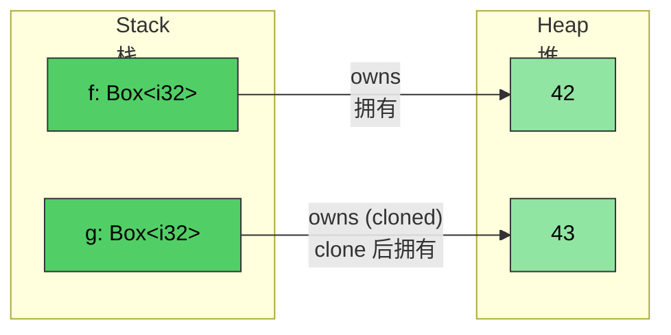
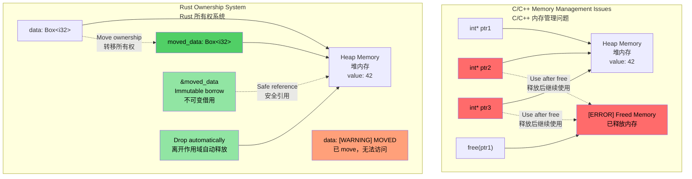
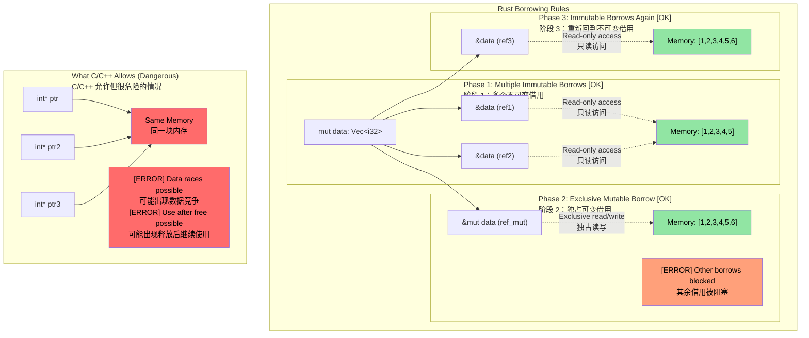

# Rust `Box<T>`<br><span class="zh-inline">Rust 的 `Box<T>`</span>

> **What you'll learn:** Rust's smart pointer types — `Box<T>` for heap allocation, `Rc<T>` for shared ownership, and `Cell<T>`/`RefCell<T>` for interior mutability. These build on the ownership and lifetime concepts from the previous sections. You'll also see a brief introduction to `Weak<T>` for breaking reference cycles.<br><span class="zh-inline">**本章将学到什么：** Rust 里的几种核心智能指针类型：负责堆分配的 `Box<T>`，负责共享所有权的 `Rc<T>`，以及负责内部可变性的 `Cell<T>` 和 `RefCell<T>`。这些内容都建立在前面讲过的所有权和生命周期之上。本章也会顺手介绍一下 `Weak<T>`，看看它是怎么打破引用环的。</span>

**Why `Box<T>`?** In C, you use `malloc`/`free` for heap allocation. In C++, `std::unique_ptr<T>` wraps `new`/`delete`. Rust's `Box<T>` is the equivalent — a heap-allocated, single-owner pointer that is automatically freed when it goes out of scope. Unlike `malloc`, there's no matching `free` to forget. Unlike `unique_ptr`, there's no use-after-move — the compiler prevents it entirely.<br><span class="zh-inline">**为什么需要 `Box<T>`？** 在 C 里，堆分配通常靠 `malloc`/`free`。在 C++ 里，对应的是把 `new`/`delete` 封进 `std::unique_ptr<T>`。Rust 里的 `Box<T>` 就是这一类东西：它指向堆上数据，只允许单一所有者，而且一离开作用域就会自动释放。和 `malloc` 相比，不存在忘记 `free` 的问题；和 `unique_ptr` 相比，编译器会把 use-after-move 这类事故直接拦下来。</span>

**When to use `Box` vs stack allocation:**<br><span class="zh-inline">**什么时候该用 `Box`，什么时候继续放在栈上：**</span>

- The contained type is large and you don't want to copy it on the stack<br><span class="zh-inline">值本身比较大，放在栈上复制来复制去不划算。</span>
- You need a recursive type, such as a linked-list node that contains itself<br><span class="zh-inline">需要定义递归类型，比如链表节点里再套同类节点。</span>
- You need trait objects such as `Box<dyn Trait>`<br><span class="zh-inline">需要 trait object，比如 `Box<dyn Trait>`。</span>

- `Box<T>` can be used to create a pointer to a heap-allocated value. The pointer itself is always a fixed size regardless of `T`.<br><span class="zh-inline">`Box<T>` 用来创建一个指向堆上数据的指针。无论 `T` 有多大，这个指针本身的大小都是固定的。</span>

```rust
fn main() {
    // Creates a pointer to an integer (with value 42) created on the heap
    let f = Box::new(42);
    println!("{} {}", *f, f);
    // Cloning a box creates a new heap allocation
    let mut g = f.clone();
    *g = 43;
    println!("{f} {g}");
    // g and f go out of scope here and are automatically deallocated
}
```



## Ownership and Borrowing Visualization<br><span class="zh-inline">所有权与借用的可视化理解</span>

### C/C++ vs Rust: Pointer and Ownership Management<br><span class="zh-inline">C/C++ 与 Rust：指针和所有权管理对比</span>

```c
// C - Manual memory management, potential issues
void c_pointer_problems() {
    int* ptr1 = malloc(sizeof(int));
    *ptr1 = 42;
    
    int* ptr2 = ptr1;  // Both point to same memory
    int* ptr3 = ptr1;  // Three pointers to same memory
    
    free(ptr1);        // Frees the memory
    
    *ptr2 = 43;        // Use after free - undefined behavior!
    *ptr3 = 44;        // Use after free - undefined behavior!
}
```

> **For C++ developers:** Smart pointers help, but they still do not eliminate every class of mistake.<br><span class="zh-inline">**给 C++ 开发者：** 智能指针当然有帮助，但它们还没有强到能把所有错误一把掐死。</span>
>
> ```cpp
> // C++ - Smart pointers help, but don't prevent all issues
> void cpp_pointer_issues() {
>     auto ptr1 = std::make_unique<int>(42);
>     
>     // auto ptr2 = ptr1;  // Compile error: unique_ptr not copyable
>     auto ptr2 = std::move(ptr1);  // OK: ownership transferred
>     
>     // But C++ still allows use-after-move:
>     // std::cout << *ptr1;  // Compiles! But undefined behavior!
>     
>     // shared_ptr aliasing:
>     auto shared1 = std::make_shared<int>(42);
>     auto shared2 = shared1;  // Both own the data
>     // Who "really" owns it? Neither. Ref count overhead everywhere.
> }
> ```

```rust
// Rust - Ownership system prevents these issues
fn rust_ownership_safety() {
    let data = Box::new(42);  // data owns the heap allocation
    
    let moved_data = data;    // Ownership transferred to moved_data
    // data is no longer accessible - compile error if used
    
    let borrowed = &moved_data;  // Immutable borrow
    println!("{}", borrowed);    // Safe to use
    
    // moved_data automatically freed when it goes out of scope
}
```



### Borrowing Rules Visualization<br><span class="zh-inline">借用规则可视化</span>

```rust
fn borrowing_rules_example() {
    let mut data = vec![1, 2, 3, 4, 5];
    
    // Multiple immutable borrows - OK
    let ref1 = &data;
    let ref2 = &data;
    println!("{:?} {:?}", ref1, ref2);  // Both can be used
    
    // Mutable borrow - exclusive access
    let ref_mut = &mut data;
    ref_mut.push(6);
    // ref1 and ref2 can't be used while ref_mut is active
    
    // After ref_mut is done, immutable borrows work again
    let ref3 = &data;
    println!("{:?}", ref3);
}
```



---

## Interior Mutability: `Cell<T>` and `RefCell<T>`<br><span class="zh-inline">内部可变性：`Cell<T>` 与 `RefCell<T>`</span>

Recall that by default variables are immutable in Rust. Sometimes it is useful to keep most of a type read-only while permitting writes to one specific field.<br><span class="zh-inline">前面已经看过，Rust 默认让变量保持不可变。有时候会希望一个类型的大部分字段都保持只读，只给某一个字段开个可写口子。</span>

```rust
struct Employee {
    employee_id : u64,   // This must be immutable
    on_vacation: bool,   // What if we wanted to permit write-access to this field, but make employee_id immutable?
}
```

- Rust normally allows one mutable reference or many immutable references, and this is enforced at compile time.<br><span class="zh-inline">Rust 平时遵守的规则还是那一套：一个可变引用，或者多个不可变引用，而且由编译器在编译期检查。</span>
- But what if we wanted to pass an immutable slice or vector of employees while still allowing the `on_vacation` flag to change, and at the same time ensuring that `employee_id` remains immutable?<br><span class="zh-inline">可如果现在想把员工列表作为不可变引用传出去，同时又允许 `on_vacation` 这个标记更新，而且还得保证 `employee_id` 完全不许改，那怎么办？</span>

### `Cell<T>` — interior mutability for Copy types<br><span class="zh-inline">`Cell<T>`：适用于 `Copy` 类型的内部可变性</span>

- `Cell<T>` provides **interior mutability**, meaning specific fields can be changed even through an otherwise immutable reference.<br><span class="zh-inline">`Cell<T>` 提供的是 **内部可变性**：即使拿到的是不可变引用，也能改动其中某些字段。</span>
- It works by copying values in and out, so `.get()` requires `T: Copy`.<br><span class="zh-inline">它的做法是把值拷进来、再拷出去，因此 `.get()` 这条路要求 `T: Copy`。</span>

### `RefCell<T>` — interior mutability with runtime borrow checking<br><span class="zh-inline">`RefCell<T>`：把借用检查推迟到运行时</span>

- `RefCell<T>` is the variant that works for borrowed access to non-`Copy` data.<br><span class="zh-inline">`RefCell<T>` 则适合那些不能简单复制、需要借用访问的类型。</span>
- It enforces borrow rules at runtime instead of compile time.<br><span class="zh-inline">它不在编译期检查借用规则，而是在运行时动态检查。</span>
- It allows one mutable borrow, but panics if another borrow is still active.<br><span class="zh-inline">它同样只允许一个可变借用；如果还有别的借用活着，再去可变借用就会 panic。</span>
- Use `.borrow()` for immutable access and `.borrow_mut()` for mutable access.<br><span class="zh-inline">只读访问用 `.borrow()`，可变访问用 `.borrow_mut()`。</span>

### When to Choose `Cell` vs `RefCell`<br><span class="zh-inline">`Cell` 和 `RefCell` 该怎么选</span>

| Criterion<br><span class="zh-inline">维度</span> | `Cell<T>` | `RefCell<T>` |
|-----------|-----------|-------------|
| Works with<br><span class="zh-inline">适用类型</span> | `Copy` types such as integers, booleans, and floats<br><span class="zh-inline">整数、布尔值、浮点数这类 `Copy` 类型</span> | Any type such as `String`、`Vec` or custom structs<br><span class="zh-inline">几乎任意类型，比如 `String`、`Vec` 和自定义结构体</span> |
| Access pattern<br><span class="zh-inline">访问方式</span> | Copies values in and out with `.get()` / `.set()`<br><span class="zh-inline">通过 `.get()` / `.set()` 取值和设值</span> | Borrows the value in place with `.borrow()` / `.borrow_mut()`<br><span class="zh-inline">通过 `.borrow()` / `.borrow_mut()` 原地借用</span> |
| Failure mode<br><span class="zh-inline">失败方式</span> | Cannot fail; there are no runtime borrow checks<br><span class="zh-inline">本身不会失败，没有运行时借用检查</span> | Panics if mutably borrowed while another borrow is active<br><span class="zh-inline">如果别的借用还活着就去做可变借用，会 panic</span> |
| Overhead<br><span class="zh-inline">额外开销</span> | Essentially zero beyond copying bytes<br><span class="zh-inline">除了拷贝那点字节，几乎没有额外成本</span> | Small runtime bookkeeping for borrow state<br><span class="zh-inline">要多维护一点运行时借用状态</span> |
| Use when<br><span class="zh-inline">典型用途</span> | Mutable flags, counters, or small scalar fields inside immutable structs<br><span class="zh-inline">不可变结构体里的一些可变标记、计数器、小标量字段</span> | Mutating a `String`、`Vec` or more complex field inside an immutable struct<br><span class="zh-inline">在不可变结构体里修改 `String`、`Vec` 或更复杂的字段</span> |

---

## Shared Ownership: `Rc<T>`<br><span class="zh-inline">共享所有权：`Rc<T>`</span>

`Rc<T>` allows reference-counted shared ownership of immutable data. This is useful when the same value needs to appear in multiple places without being copied.<br><span class="zh-inline">`Rc<T>` 允许通过引用计数实现对不可变数据的共享所有权。它适合那种“同一份对象要挂在多个地方，但又不想真的复制几份”的场景。</span>

```rust
#[derive(Debug)]
struct Employee {
    employee_id: u64,
}
fn main() {
    let mut us_employees = vec![];
    let mut all_global_employees = Vec::<Employee>::new();
    let employee = Employee { employee_id: 42 };
    us_employees.push(employee);
    // Won't compile — employee was already moved
    //all_global_employees.push(employee);
}
```

`Rc<T>` solves the problem by allowing shared immutable access.<br><span class="zh-inline">`Rc<T>` 解决这个问题的方式，就是把“多个地方都要拥有它”转成“多个地方一起共享这份不可变数据”。</span>

- The inner type is dereferenced automatically.<br><span class="zh-inline">内部值可以自动解引用使用。</span>
- The value is dropped when the strong reference count reaches zero.<br><span class="zh-inline">当强引用计数归零时，内部值就会被释放。</span>

```rust
use std::rc::Rc;
#[derive(Debug)]
struct Employee {employee_id: u64}
fn main() {
    let mut us_employees = vec![];
    let mut all_global_employees = vec![];
    let employee = Employee { employee_id: 42 };
    let employee_rc = Rc::new(employee);
    us_employees.push(employee_rc.clone());
    all_global_employees.push(employee_rc.clone());
    let employee_one = all_global_employees.get(0); // Shared immutable reference
    for e in us_employees {
        println!("{}", e.employee_id);  // Shared immutable reference
    }
    println!("{employee_one:?}");
}
```

> **For C++ developers: Smart Pointer Mapping**<br><span class="zh-inline">**给 C++ 开发者的智能指针对照：**</span>
>
> | C++ Smart Pointer<br><span class="zh-inline">C++ 智能指针</span> | Rust Equivalent<br><span class="zh-inline">Rust 对应物</span> | Key Difference<br><span class="zh-inline">关键差异</span> |
> |---|---|---|
> | `std::unique_ptr<T>` | `Box<T>` | Rust 把 move 做成了语言级默认行为，不是额外自觉选择的约定<br><span class="zh-inline">Rust 里的 move 是语言层规则，不是“想安全时再套一个指针”</span> |
> | `std::shared_ptr<T>` | `Rc<T>` single-thread, `Arc<T>` multi-thread | `Rc` 没有原子计数开销；跨线程共享时再上 `Arc`<br><span class="zh-inline">单线程先用 `Rc`，跨线程再换 `Arc`</span> |
> | `std::weak_ptr<T>` | `Weak<T>` | 两边的目的都一样：打破引用环<br><span class="zh-inline">都是用来处理循环引用的</span> |
>
> **Key distinction:** In C++, smart pointers are a deliberate library choice. In Rust, owned values `T` plus borrowing `&T` already cover most cases; `Box`、`Rc` and `Arc` are reserved for situations that genuinely need heap allocation or shared ownership.<br><span class="zh-inline">**最重要的区别：** 在 C++ 里，智能指针通常是一种“主动选型”；在 Rust 里，普通拥有值 `T` 加借用 `&T` 已经覆盖了大多数场景。只有真的需要堆分配或者共享所有权时，才把 `Box`、`Rc`、`Arc` 拿出来。</span>

### Breaking Reference Cycles with `Weak<T>`<br><span class="zh-inline">用 `Weak<T>` 打破引用环</span>

`Rc<T>` uses reference counting. If two `Rc` values point to each other, neither side can ever reach a strong count of zero, so the memory is leaked. `Weak<T>` is the escape hatch.<br><span class="zh-inline">`Rc<T>` 靠引用计数工作。如果两个 `Rc` 互相指着对方，双方的强引用计数就永远降不到零，内存也就永远回收不了。`Weak<T>` 就是专门拿来破这个局的。</span>

```rust
use std::rc::{Rc, Weak};

struct Node {
    value: i32,
    parent: Option<Weak<Node>>,  // Weak reference — doesn't prevent drop
}

fn main() {
    let parent = Rc::new(Node { value: 1, parent: None });
    let child = Rc::new(Node {
        value: 2,
        parent: Some(Rc::downgrade(&parent)),  // Weak ref to parent
    });

    // To use a Weak, try to upgrade it — returns Option<Rc<T>>
    if let Some(parent_rc) = child.parent.as_ref().unwrap().upgrade() {
        println!("Parent value: {}", parent_rc.value);
    }
    println!("Parent strong count: {}", Rc::strong_count(&parent)); // 1, not 2
}
```

> `Weak<T>` is covered in more depth in [Avoiding Excessive clone()](ch17-1-avoiding-excessive-clone.md). For now, the key takeaway is simple: use `Weak` for back-references in tree or graph structures so those structures can still be freed.<br><span class="zh-inline">`Weak<T>` 会在 [Avoiding Excessive clone()](ch17-1-avoiding-excessive-clone.md) 里再展开讲。这里先记住一句话：树和图结构里，凡是“回指父节点”这类反向引用，优先考虑 `Weak`，这样整棵结构在不用时才能正常释放。</span>

---

## Combining `Rc` with Interior Mutability<br><span class="zh-inline">把 `Rc` 和内部可变性组合起来</span>

The real power shows up when `Rc<T>` is combined with `Cell<T>` or `RefCell<T>`. This allows multiple owners to read and also modify shared state.<br><span class="zh-inline">真正有意思的地方，在于把 `Rc<T>` 和 `Cell<T>` 或 `RefCell<T>` 叠在一起。这样一来，多个所有者不仅能读同一份数据，还能在受控条件下修改它。</span>

| Pattern<br><span class="zh-inline">模式</span> | Use case<br><span class="zh-inline">适用场景</span> |
|---------|----------|
| `Rc<RefCell<T>>` | Shared mutable data in a single-threaded context<br><span class="zh-inline">单线程场景下的共享可变数据</span> |
| `Arc<Mutex<T>>` | Shared mutable data across threads, discussed in [ch13](ch13-concurrency.md)<br><span class="zh-inline">跨线程共享可变数据，后面 [ch13](ch13-concurrency.md) 会展开</span> |
| `Rc<Cell<T>>` | Shared mutable `Copy` values such as simple flags or counters<br><span class="zh-inline">共享的可变 `Copy` 类型，比如标记位和计数器</span> |

---

# Exercise: Shared ownership and interior mutability<br><span class="zh-inline">练习：共享所有权与内部可变性</span>

🟡 **Intermediate**<br><span class="zh-inline">🟡 **进阶练习**</span>

- **Part 1 (`Rc`)**: Create an `Employee` struct with `employee_id: u64` and `name: String`. Place it in an `Rc<Employee>` and clone it into two separate `Vec`s, `us_employees` and `global_employees`. Print both vectors to show they share the same data.<br><span class="zh-inline">**第 1 部分（`Rc`）**：定义一个 `Employee`，包含 `employee_id: u64` 和 `name: String`。把它放进 `Rc<Employee>` 里，然后 clone 到两个不同的 `Vec`，分别叫 `us_employees` 和 `global_employees`。最后分别打印，确认两边看到的是同一份数据。</span>
- **Part 2 (`Cell`)**: Add an `on_vacation: Cell<bool>` field. Pass an immutable `&Employee` into a function and toggle `on_vacation` inside that function, without making the reference mutable.<br><span class="zh-inline">**第 2 部分（`Cell`）**：给 `Employee` 增加 `on_vacation: Cell<bool>`。把不可变的 `&Employee` 传给一个函数，在函数内部切换 `on_vacation` 的值，而且整个过程中都不把引用改成可变。</span>
- **Part 3 (`RefCell`)**: Replace `name: String` with `name: RefCell<String>` and write a function that appends a suffix to the employee name through an immutable `&Employee` reference.<br><span class="zh-inline">**第 3 部分（`RefCell`）**：把 `name: String` 换成 `name: RefCell<String>`，然后写一个函数，接收不可变的 `&Employee`，给员工名字追加后缀。</span>

**Starter code:**<br><span class="zh-inline">**起始代码：**</span>

```rust
use std::cell::{Cell, RefCell};
use std::rc::Rc;

#[derive(Debug)]
struct Employee {
    employee_id: u64,
    name: RefCell<String>,
    on_vacation: Cell<bool>,
}

fn toggle_vacation(emp: &Employee) {
    // TODO: Flip on_vacation using Cell::set()
}

fn append_title(emp: &Employee, title: &str) {
    // TODO: Borrow name mutably via RefCell and push_str the title
}

fn main() {
    // TODO: Create an employee, wrap in Rc, clone into two Vecs,
    // call toggle_vacation and append_title, print results
}
```

<details><summary>Solution <span class="zh-inline">参考答案</span></summary>

```rust
use std::cell::{Cell, RefCell};
use std::rc::Rc;

#[derive(Debug)]
struct Employee {
    employee_id: u64,
    name: RefCell<String>,
    on_vacation: Cell<bool>,
}

fn toggle_vacation(emp: &Employee) {
    emp.on_vacation.set(!emp.on_vacation.get());
}

fn append_title(emp: &Employee, title: &str) {
    emp.name.borrow_mut().push_str(title);
}

fn main() {
    let emp = Rc::new(Employee {
        employee_id: 42,
        name: RefCell::new("Alice".to_string()),
        on_vacation: Cell::new(false),
    });

    let mut us_employees = vec![];
    let mut global_employees = vec![];
    us_employees.push(Rc::clone(&emp));
    global_employees.push(Rc::clone(&emp));

    // Toggle vacation through an immutable reference
    toggle_vacation(&emp);
    println!("On vacation: {}", emp.on_vacation.get()); // true

    // Append title through an immutable reference
    append_title(&emp, ", Sr. Engineer");
    println!("Name: {}", emp.name.borrow()); // "Alice, Sr. Engineer"

    // Both Vecs see the same data (Rc shares ownership)
    println!("US: {:?}", us_employees[0].name.borrow());
    println!("Global: {:?}", global_employees[0].name.borrow());
    println!("Rc strong count: {}", Rc::strong_count(&emp));
}
// Output:
// On vacation: true
// Name: Alice, Sr. Engineer
// US: "Alice, Sr. Engineer"
// Global: "Alice, Sr. Engineer"
// Rc strong count: 3
```

</details>
