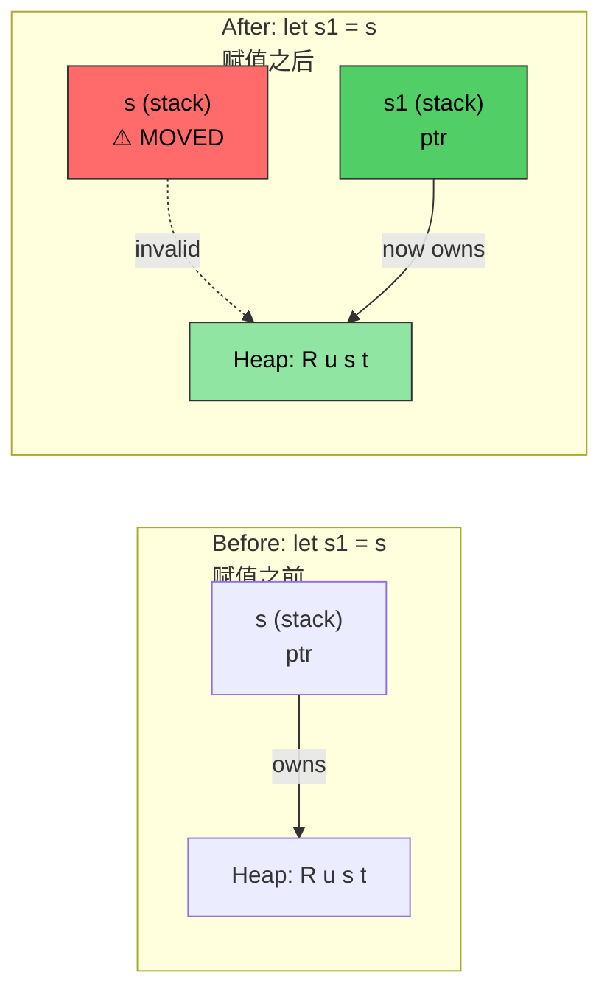
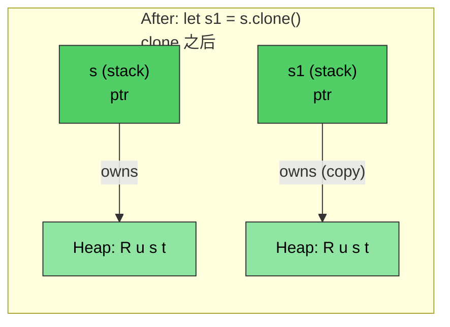

# Rust memory management<br><span class="zh-inline">Rust 的内存管理</span>

> **What you'll learn:** Rust's ownership system, the single most important concept in the language. This chapter covers move semantics, borrowing rules, `Clone`、`Copy` and `Drop`. For many C/C++ developers, once ownership clicks, the rest of Rust suddenly stops looking mystical.<br><span class="zh-inline">**本章将学到什么：** Rust 的所有权系统，也就是整门语言里最核心的概念。本章会讲 move 语义、借用规则、`Clone`、`Copy` 和 `Drop`。对很多 C/C++ 开发者来说，一旦所有权想明白了，Rust 后面的大半内容都会顺眼很多。</span>

- Memory management in C and C++ is a major source of bugs<br><span class="zh-inline">C 和 C++ 里的内存管理，本来就是大量 bug 的来源。</span>
    - In C, `malloc()` and `free()` offer no built-in protection against dangling pointers, use-after-free, or double-free.<br><span class="zh-inline">在 C 里，`malloc()` 和 `free()` 本身不会替着防悬空指针、释放后继续使用、重复释放这些事故。</span>
    - In C++, RAII and smart pointers help a lot, but moved-from objects still exist and misuse can slide into undefined behavior.<br><span class="zh-inline">在 C++ 里，RAII 和智能指针当然已经好很多了，但 moved-from 对象依然存在，玩脱了照样可能滚进未定义行为。</span>
- Rust turns RAII into something much harder to misuse<br><span class="zh-inline">Rust 把 RAII 这套机制做得更难被误用。</span>
    - Moves are destructive: once ownership is moved, the old binding becomes invalid.<br><span class="zh-inline">move 是破坏性的：一旦所有权转走，旧变量立刻失效。</span>
    - No Rule of Five ceremony is needed.<br><span class="zh-inline">不需要再手动背一套 Rule of Five 样板。</span>
    - Rust still gives low-level control over stack and heap allocation, but safety is enforced at compile time.<br><span class="zh-inline">Rust 依然保留了对栈和堆分配的控制力，只不过安全检查被前移到了编译期。</span>
    - Ownership, borrowing, mutability, and lifetimes work together to make this possible.<br><span class="zh-inline">它靠的是所有权、借用、可变性和生命周期这几套机制一起配合。</span>

> **For C++ developers — Smart Pointer Mapping:**<br><span class="zh-inline">**给 C++ 开发者的智能指针对照表：**</span>
>
> | **C++** | **Rust** | **Safety Improvement** |
> |---------|----------|----------------------|
> | `std::unique_ptr<T>` | `Box<T>` | No use-after-move possible |
> | `std::shared_ptr<T>` | `Rc<T>` (single-thread) | No reference cycles by default |
> | `std::shared_ptr<T>` (thread-safe) | `Arc<T>` | Explicit thread-safety |
> | `std::weak_ptr<T>` | `Weak<T>` | Must check validity |
> | Raw pointer | `*const T` / `*mut T` | Only in `unsafe` blocks |
>
> <span class="zh-inline">对 C 开发者来说，`Box<T>` 可以看成替代 `malloc`/`free` 配对，`Rc<T>` 可以看成替代手写引用计数，而裸指针虽然还在，但基本被关进了 `unsafe` 区域。</span>

# Rust ownership, borrowing and lifetimes<br><span class="zh-inline">Rust 的所有权、借用与生命周期</span>

- Rust permits either one mutable reference or many read-only references to the same value<br><span class="zh-inline">Rust 允许的模式非常明确：同一时间要么一个可变引用，要么多个只读引用。</span>
    - The original variable owns the value.<br><span class="zh-inline">最初声明变量时，它就成了该值的所有者。</span>
    - Later references borrow from that owner.<br><span class="zh-inline">后续产生的引用，则是在向这个所有者借用。</span>
    - A borrow can never outlive the owning scope.<br><span class="zh-inline">借用的存活时间绝对不能超过拥有者的作用域。</span>

```rust
fn main() {
    let a = 42; // Owner
    let b = &a; // First borrow
    {
        let aa = 42;
        let c = &a; // Second borrow; a is still in scope
        // Ok: c goes out of scope here
        // aa goes out of scope here
    }
    // let d = &aa; // Will not compile unless aa is moved to outside scope
    // b implicitly goes out of scope before a
    // a goes out of scope last
}
```

- Functions can receive values in several ways<br><span class="zh-inline">函数接收参数时，也有几种不同方式。</span>
    - By value copy for small `Copy` types.<br><span class="zh-inline">按值复制，常见于实现了 `Copy` 的小类型。</span>
    - By reference using `&` or `&mut`.<br><span class="zh-inline">按引用借用，用 `&` 或 `&mut` 表示。</span>
    - By move, transferring ownership into the function.<br><span class="zh-inline">按 move 转移所有权，把值整个交给函数。</span>

```rust
fn foo(x: &u32) {
    println!("{x}");
}
fn bar(x: u32) {
    println!("{x}");
}
fn main() {
    let a = 42;
    foo(&a);    // By reference
    bar(a);     // By value (copy)
}
```

- Rust forbids returning dangling references<br><span class="zh-inline">Rust 明确禁止返回悬空引用。</span>
    - Returned references must still refer to something that is alive when the function ends.<br><span class="zh-inline">函数返回的引用，在函数结束之后也必须还能指向活着的数据。</span>
    - When a value leaves scope, Rust automatically drops it.<br><span class="zh-inline">值离开作用域时，Rust 会自动执行清理。</span>

```rust
fn no_dangling() -> &u32 {
    // lifetime of a begins here
    let a = 42;
    // Won't compile. lifetime of a ends here
    &a
}

fn ok_reference(a: &u32) -> &u32 {
    // Ok because the lifetime of a always exceeds ok_reference()
    a
}
fn main() {
    let a = 42;     // lifetime of a begins here
    let b = ok_reference(&a);
    // lifetime of b ends here
    // lifetime of a ends here
}
```

# Rust move semantics<br><span class="zh-inline">Rust 的 move 语义</span>

- By default, assignment transfers ownership for non-`Copy` values<br><span class="zh-inline">默认情况下，对非 `Copy` 类型做赋值时，会转移所有权。</span>

```rust
fn main() {
    let s = String::from("Rust");    // Allocate a string from the heap
    let s1 = s; // Transfer ownership to s1. s is invalid at this point
    println!("{s1}");
    // This will not compile
    //println!("{s}");
    // s1 goes out of scope here and the memory is deallocated
    // s goes out of scope here, but nothing happens because it doesn't own anything
}
```



*After `let s1 = s`, ownership transfers to `s1`. The heap data stays where it is; only the owning pointer moves, and `s` becomes invalid.*<br><span class="zh-inline">*执行 `let s1 = s` 之后，所有权转移给 `s1`。堆上的数据并没有搬家，移动的只是拥有它的那根指针，而 `s` 从此失效。*</span>

----

# Rust move semantics and borrowing<br><span class="zh-inline">move 语义与借用</span>

```rust
fn foo(s : String) {
    println!("{s}");
    // The heap memory pointed to by s will be deallocated here
}
fn bar(s : &String) {
    println!("{s}");
    // Nothing happens -- s is borrowed
}
fn main() {
    let s = String::from("Rust string move example");    // Allocate a string from the heap
    foo(s); // Transfers ownership; s is invalid now
    // println!("{s}");  // will not compile
    let t = String::from("Rust string borrow example");
    bar(&t);    // t continues to hold ownership
    println!("{t}"); 
}
```

# Rust move semantics and ownership<br><span class="zh-inline">move 与所有权转移</span>

- It is perfectly legal to transfer ownership by moving<br><span class="zh-inline">通过 move 转移所有权，本身就是 Rust 的正常操作。</span>
    - Any outstanding borrows must be respected; moved values cannot still be used through old bindings.<br><span class="zh-inline">但借用规则仍然有效，已经转走的值不能再通过旧变量继续碰。</span>
    - If moving feels too destructive, borrowing is usually the first alternative to consider.<br><span class="zh-inline">如果 move 太“狠”，第一反应通常应该是改成借用。</span>

```rust
struct Point {
    x: u32,
    y: u32,
}
fn consume_point(p: Point) {
    println!("{} {}", p.x, p.y);
}
fn borrow_point(p: &Point) {
    println!("{} {}", p.x, p.y);
}
fn main() {
    let p = Point {x: 10, y: 20};
    // Try flipping the two lines
    borrow_point(&p);
    consume_point(p);
}
```

# Rust `Clone`<br><span class="zh-inline">Rust 的 `Clone`</span>

- `clone()` creates a true duplicate of the owned data<br><span class="zh-inline">`clone()` 会把拥有的数据真正复制一份出来。</span>
    - The upside is both values stay valid.<br><span class="zh-inline">好处是原值和新值都继续有效。</span>
    - The downside is that extra allocation or copy work may happen.<br><span class="zh-inline">代价则是会产生额外分配或复制成本。</span>

```rust
fn main() {
    let s = String::from("Rust");    // Allocate a string from the heap
    let s1 = s.clone(); // Copy the string; creates a new allocation on the heap
    println!("{s1}");  
    println!("{s}");
    // s1 goes out of scope here and the memory is deallocated
    // s goes out of scope here, and the memory is deallocated
}
```



*`clone()` creates a separate heap allocation. Both values are valid because each owns its own copy.*<br><span class="zh-inline">*`clone()` 会得到一块独立的堆内存。两个变量都合法，因为它们各自拥有自己那份副本。*</span>

# Rust `Copy` trait<br><span class="zh-inline">Rust 的 `Copy` trait</span>

- Primitive types use copy semantics through the `Copy` trait<br><span class="zh-inline">Rust 里的很多原始类型，都是通过 `Copy` trait 按值拷贝的。</span>
    - Examples include `u8`、`u32`、`i32` 这些简单值。<br><span class="zh-inline">像 `u8`、`u32`、`i32` 这些简单数值类型，基本都属于这一类。</span>
    - User-defined types can opt in with `#[derive(Copy, Clone)]` if every field is also `Copy`.<br><span class="zh-inline">用户自定义类型如果所有字段都满足条件，也可以通过 `#[derive(Copy, Clone)]` 主动加入 `Copy` 语义。</span>

```rust
// Try commenting this out to see the change in let p1 = p; belw
#[derive(Copy, Clone, Debug)]   // We'll discuss this more later
struct Point{x: u32, y:u32}
fn main() {
    let p = Point {x: 42, y: 40};
    let p1 = p;     // This will perform a copy now instead of move
    println!("p: {p:?}");
    println!("p1: {p:?}");
    let p2 = p1.clone();    // Semantically the same as copy
}
```

# Rust `Drop` trait<br><span class="zh-inline">Rust 的 `Drop` trait</span>

- Rust automatically calls `drop()` at the end of scope<br><span class="zh-inline">值离开作用域时，Rust 会自动调用对应的 `drop()` 逻辑。</span>
    - `Drop` is the trait that defines custom destruction behavior.<br><span class="zh-inline">`Drop` trait 用来定义自定义析构行为。</span>
    - `String` uses it to release heap memory, and other resource-owning types do similar cleanup.<br><span class="zh-inline">比如 `String` 就靠它释放堆内存，其他资源管理类型也一样会在这里做清理。</span>
    - For C developers, this replaces a lot of manual `free()` calls with scope-based cleanup.<br><span class="zh-inline">对 C 开发者来说，这基本就是把大量手动 `free()` 换成了作用域结束自动清理。</span>
- **Key safety:** You cannot call `.drop()` directly. Instead use `drop(obj)`, which consumes the value and prevents further use.<br><span class="zh-inline">**关键安全点：** 不能直接手调 `.drop()` 方法。正确方式是 `drop(obj)`，它会把值吃掉，析构完之后也杜绝再次使用。</span>

> **For C++ developers:** `Drop` maps very closely to a destructor.<br><span class="zh-inline">**给 C++ 开发者：** `Drop` 基本就对应析构函数。</span>
>
> | | **C++ destructor** | **Rust `Drop`** |
> |---|---|---|
> | **Syntax** | `~MyClass() { ... }` | `impl Drop for MyType { fn drop(&mut self) { ... } }` |
> | **When called** | End of scope | End of scope |
> | **Called on move** | Moved-from object still exists | Moved-from value is gone |
> | **Manual call** | Dangerous explicit destructor call | `drop(obj)` consumes safely |
> | **Order** | Reverse declaration order | Reverse declaration order |
> | **Rule of Five** | Must manage special member functions | Only `Drop`; `Clone` is opt-in |
> | **Virtual dtor needed?** | Sometimes yes | No inheritance, no slicing issue |

```rust
struct Point {x: u32, y:u32}

// Equivalent to: ~Point() { printf("Goodbye point x:%u, y:%u\n", x, y); }
impl Drop for Point {
    fn drop(&mut self) {
        println!("Goodbye point x:{}, y:{}", self.x, self.y);
    }
}
fn main() {
    let p = Point{x: 42, y: 42};
    {
        let p1 = Point{x:43, y: 43};
        println!("Exiting inner block");
        // p1.drop() called here — like C++ end-of-scope destructor
    }
    println!("Exiting main");
    // p.drop() called here
}
```

# Exercise: Move, Copy and Drop<br><span class="zh-inline">练习：move、copy 与 drop</span>

🟡 **Intermediate** — experiment freely; the compiler will teach a lot here<br><span class="zh-inline">🟡 **进阶练习**：这里很适合自己多试，编译器会把很多关键区别直接指出来。</span>

- Create your own `Point` experiments with and without `Copy` in the derive list, and make sure the difference between move and copy is fully clear.<br><span class="zh-inline">给 `Point` 自己做几组实验，分别试试带 `Copy` 和不带 `Copy` 的情况，务必把 move 和 copy 的区别看明白。</span>
- Implement a custom `Drop` for `Point` that sets `x` and `y` to `0` inside `drop()` just to observe the pattern.<br><span class="zh-inline">再给 `Point` 手写一个 `Drop`，在 `drop()` 里把 `x` 和 `y` 设成 `0`，单纯用来感受这类资源释放模式。</span>

```rust
struct Point{x: u32, y: u32}
fn main() {
    // Create Point, assign it to a different variable, create a new scope,
    // pass point to a function, etc.
}
```

<details><summary>Solution <span class="zh-inline">参考答案</span></summary>

```rust
#[derive(Debug)]
struct Point { x: u32, y: u32 }

impl Drop for Point {
    fn drop(&mut self) {
        println!("Dropping Point({}, {})", self.x, self.y);
        self.x = 0;
        self.y = 0;
        // Note: setting to 0 in drop demonstrates the pattern,
        // but you can't observe these values after drop completes
    }
}

fn consume(p: Point) {
    println!("Consuming: {:?}", p);
    // p is dropped here
}

fn main() {
    let p1 = Point { x: 10, y: 20 };
    let p2 = p1;  // Move — p1 is no longer valid
    // println!("{:?}", p1);  // Won't compile: p1 was moved

    {
        let p3 = Point { x: 30, y: 40 };
        println!("p3 in inner scope: {:?}", p3);
        // p3 is dropped here (end of scope)
    }

    consume(p2);  // p2 is moved into consume and dropped there
    // println!("{:?}", p2);  // Won't compile: p2 was moved

    // Now try: add #[derive(Copy, Clone)] to Point (and remove the Drop impl)
    // and observe how p1 remains valid after let p2 = p1;
}
// Output:
// p3 in inner scope: Point { x: 30, y: 40 }
// Dropping Point(30, 40)
// Consuming: Point { x: 10, y: 20 }
// Dropping Point(10, 20)
```

</details>
