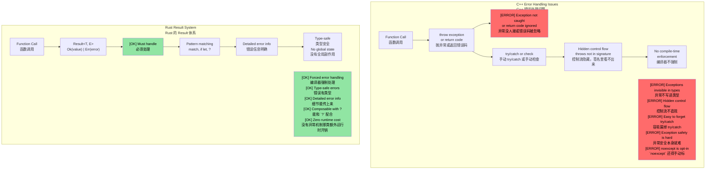
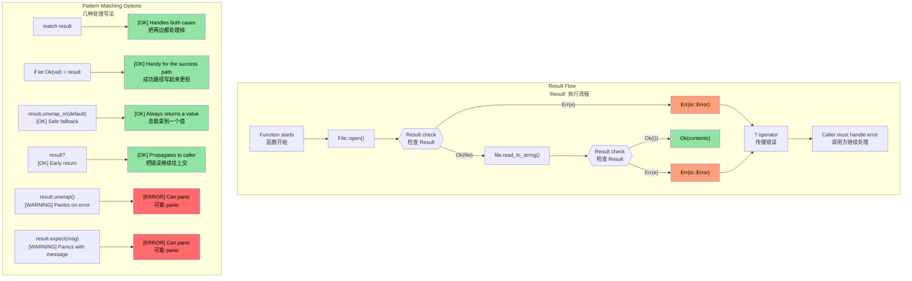

## Connecting enums to `Option` and `Result`<br><span class="zh-inline">把枚举和 `Option`、`Result` 串起来</span>

> **What you'll learn:** How Rust replaces null pointers with `Option<T>` and exceptions with `Result<T, E>`, and how the `?` operator makes error propagation concise. This is one of Rust's most distinctive ideas: errors are values, not hidden control flow.<br><span class="zh-inline">**本章将学到什么：** Rust 是怎样用 `Option<T>` 取代空指针、用 `Result<T, E>` 取代异常，以及 `?` 运算符怎样把错误传播写得简洁明白。这是 Rust 最有代表性的设计之一：错误就是值，而不是藏在控制流背后的机关。</span>

- Remember the `enum` type from earlier chapters? `Option` and `Result` are simply enums from the standard library.<br><span class="zh-inline">前面已经学过 `enum`。`Option` 和 `Result` 本质上就是标准库里定义好的两个枚举。</span>

```rust
// This is literally how Option is defined in std:
enum Option<T> {
    Some(T),  // Contains a value
    None,     // No value
}

// And Result:
enum Result<T, E> {
    Ok(T),    // Success with value
    Err(E),   // Error with details
}
```

- That means everything learned earlier about `match` and pattern matching applies directly to `Option` and `Result`.<br><span class="zh-inline">这就意味着，前面关于 `match` 和模式匹配学过的那一整套，可以原封不动地套到 `Option` 和 `Result` 上。</span>
- There is **no null pointer** in Rust. `Option<T>` is the replacement, and the compiler forces the `None` case to be handled.<br><span class="zh-inline">Rust 里 **没有空指针** 这回事。对应概念就是 `Option<T>`，而且编译器会强制把 `None` 分支处理掉。</span>

### C++ Comparison: Exceptions vs `Result`<br><span class="zh-inline">C++ 对照：异常机制与 `Result`</span>

| **C++ Pattern** | **Rust Equivalent** | **Advantage** |
|----------------|--------------------|--------------|
| `throw std::runtime_error(msg)` | `Err(MyError::Runtime(msg))` | Error is in the return type, so it cannot be forgotten<br><span class="zh-inline">错误写进返回类型，调用方没法装看不见</span> |
| `try { } catch (...) { }` | `match result { Ok(v) => ..., Err(e) => ... }` | No hidden control flow<br><span class="zh-inline">控制流清清楚楚摆在明面上</span> |
| `std::optional<T>` | `Option<T>` | Exhaustive matching required<br><span class="zh-inline">必须覆盖 `None`，漏不了</span> |
| `noexcept` annotation | Default behavior for ordinary Rust code | Exceptions do not exist<br><span class="zh-inline">Rust 根本没有异常这条隐蔽通道</span> |
| `errno` or return codes | `Result<T, E>` | Type-safe and harder to ignore<br><span class="zh-inline">类型安全，也更难被随手忽略</span> |

# Rust `Option` type<br><span class="zh-inline">Rust 的 `Option` 类型</span>

- Rust 的 `Option` 是一个只有两个变体的 `enum`：`Some<T>` 和 `None`。<br><span class="zh-inline">它的结构很朴素，就两个分支：要么有值，要么没值。</span>
- 它表达的是“这个位置可能为空”的语义。要么里面装着一个有效值 `Some<T>`，要么就是没有值的 `None`。<br><span class="zh-inline">和 C/C++ 那种靠约定判断空值的写法比起来，这种表达方式更直接，也更难误用。</span>
- `Option` 常用于“操作可能成功拿到值，也可能失败，但失败原因本身没必要额外说明”的场景。比如在字符串里查找子串位置。<br><span class="zh-inline">这类情况里，调用方关心的是“有没有”，而不是“为什么没有”。</span>

```rust
fn main() {
    // Returns Option<usize>
    let a = "1234".find("1");
    match a {
        Some(a) => println!("Found 1 at index {a}"),
        None => println!("Couldn't find 1")
    }
}
```

# Working with `Option`<br><span class="zh-inline">处理 `Option` 的常见方式</span>

- Rust 的 `Option` 有很多处理方式。<br><span class="zh-inline">重点是别一上来就手痒去写 `unwrap()`。</span>
- `unwrap()` 会在 `Option<T>` 是 `None` 时 panic，在有值时返回内部的 `T`；这是最不推荐的基础写法。<br><span class="zh-inline">除非已经百分百确认值一定存在，否则这玩意儿属于把雷埋给未来的自己。</span>
- `or()` 可以在当前值为空时提供一个替代值。<br><span class="zh-inline">适合准备一个后备选项。</span>
- `if let` 可以快速只处理 `Some<T>` 的情况。<br><span class="zh-inline">不想完整展开 `match` 时，这个写法更轻快。</span>

> **Production patterns:** See [Safe value extraction with unwrap_or](ch17-2-avoiding-unchecked-indexing.md#safe-value-extraction-with-unwrap_or) and [Functional transforms: map, map_err, find_map](ch17-2-avoiding-unchecked-indexing.md#functional-transforms-map-map_err-find_map) for real-world examples from production Rust code.<br><span class="zh-inline">**生产代码里的惯用法：** 可以继续看 [Safe value extraction with unwrap_or](ch17-2-avoiding-unchecked-indexing.md#safe-value-extraction-with-unwrap_or) 和 [Functional transforms: map, map_err, find_map](ch17-2-avoiding-unchecked-indexing.md#functional-transforms-map-map_err-find_map)，那里面是更贴近真实项目的写法。</span>

```rust
fn main() {
  // This return an Option<usize>
  let a = "1234".find("1");
  println!("{a:?} {}", a.unwrap());
  let a = "1234".find("5").or(Some(42));
  println!("{a:?}");
  if let Some(a) = "1234".find("1") {
      println!("{a}");
  } else {
    println!("Not found in string");
  }
  // This will panic
  // "1234".find("5").unwrap();
}
```

# Rust `Result` type<br><span class="zh-inline">Rust 的 `Result` 类型</span>

- `Result` 是一个和 `Option` 很像的 `enum`，有两个变体：`Ok<T>` 和 `Err<E>`。<br><span class="zh-inline">区别在于，`Err<E>` 里可以把错误细节一起带出去。</span>
- `Result` 大量出现在可能失败的 Rust API 里。成功时返回 `Ok<T>`，失败时返回明确的错误值 `Err<E>`。<br><span class="zh-inline">这比“返回一个特殊值代表失败”或者“突然抛异常”都更直白。</span>

```rust
use std::num::ParseIntError;

fn main() {
    let a: Result<i32, ParseIntError> = "1234z".parse();
    match a {
        Ok(n) => println!("Parsed {n}"),
        Err(e) => println!("Parsing failed {e:?}"),
    }
    let a: Result<i32, ParseIntError> = "1234z".parse().or(Ok(-1));
    println!("{a:?}");
    if let Ok(a) = "1234".parse::<i32>() {
        println!("Let OK {a}");
    }
    // This will panic
    // "1234z".parse().unwrap();
}
```

## `Option` and `Result`: Two Sides of the Same Coin<br><span class="zh-inline">`Option` 和 `Result`：一枚硬币的两面</span>

`Option` 和 `Result` 之间关系非常近。可以把 `Option<T>` 看成一种“错误信息为空”的 `Result`。<br><span class="zh-inline">也就是说，两者表达的都是“操作可能成功，也可能失败”，只是失败时带的信息量不同。</span>

| `Option<T>` | `Result<T, E>` | Meaning |
|-------------|---------------|---------|
| `Some(value)` | `Ok(value)` | Success — value is present<br><span class="zh-inline">成功，值存在</span> |
| `None` | `Err(error)` | Failure — no value or explicit error<br><span class="zh-inline">失败，要么单纯没值，要么带错误细节</span> |

**Converting between them:**<br><span class="zh-inline">**两者之间也能互相转换：**</span>

```rust
fn main() {
    let opt: Option<i32> = Some(42);
    let res: Result<i32, &str> = opt.ok_or("value was None");  // Option → Result
    
    let res: Result<i32, &str> = Ok(42);
    let opt: Option<i32> = res.ok();  // Result → Option (discards error)
    
    // They share many of the same methods:
    // .map(), .and_then(), .unwrap_or(), .unwrap_or_else(), .is_some()/is_ok()
}
```

> **Rule of thumb:** Use `Option` when absence is normal, such as a map lookup. Use `Result` when failure needs explanation, such as file I/O or parsing.<br><span class="zh-inline">**经验判断：** “没有值”本来就是正常情况时，用 `Option`；失败需要解释清楚时，用 `Result`。例如查字典可以用 `Option`，文件读取和解析则更适合 `Result`。</span>

# Exercise: `log()` function implementation with `Option`<br><span class="zh-inline">练习：用 `Option` 实现 `log()`</span>

🟢 **Starter**<br><span class="zh-inline">🟢 **基础练习**</span>

- Implement a `log()` function that accepts `Option<&str>`. If the argument is `None`, print a default string.<br><span class="zh-inline">实现一个 `log()` 函数，参数类型是 `Option<&str>`。如果传入的是 `None`，就打印一条默认字符串。</span>
- The function should return `Result<(), ()>`. In this example the error branch is never used, but keeping the type makes the exercise align with the chapter theme.<br><span class="zh-inline">返回类型写成 `Result<(), ()>`。虽然这个练习里暂时用不到错误分支，但这样能顺手把本章的思路串起来。</span>

<details><summary>Solution <span class="zh-inline">参考答案</span></summary>

```rust
fn log(message: Option<&str>) -> Result<(), ()> {
    match message {
        Some(msg) => println!("LOG: {msg}"),
        None => println!("LOG: (no message provided)"),
    }
    Ok(())
}

fn main() {
    let _ = log(Some("System initialized"));
    let _ = log(None);
    
    // Alternative using unwrap_or:
    let msg: Option<&str> = None;
    println!("LOG: {}", msg.unwrap_or("(default message)"));
}
// Output:
// LOG: System initialized
// LOG: (no message provided)
// LOG: (default message)
```

</details>

----

# Rust error handling<br><span class="zh-inline">Rust 的错误处理</span>

- Rust 里的错误大体分成两类：不可恢复的致命错误，以及可恢复错误。致命错误通常表现为 `panic`。<br><span class="zh-inline">前者属于程序已经跑歪了，后者才是业务逻辑里应该正常传递和处理的那部分。</span>
- 一般来说，应该尽量减少 `panic`。大多数 `panic` 都意味着程序存在 bug，比如数组越界、对 `Option::None` 调用 `unwrap()` 等。<br><span class="zh-inline">这种错误如果出现在生产代码里，通常不是“用户用错了”，而是代码本身写得有毛病。</span>
- 对那些“理论上绝对不该发生”的情况，显式 `panic!` 或 `assert!` 仍然是合理的。<br><span class="zh-inline">拿它们做健全性检查没问题，但别把正常错误处理偷懒写成 panic。</span>

```rust
fn main() {
   let x : Option<u32> = None;
   // println!("{x}", x.unwrap()); // Will panic
   println!("{}", x.unwrap_or(0));  // OK -- prints 0
   let x = 41;
   //assert!(x == 42); // Will panic
   //panic!("Something went wrong"); // Unconditional panic
   let _a = vec![0, 1];
   // println!("{}", a[2]); // Out of bounds panic; use a.get(2) which will return Option<T>
}
```

## Error Handling: C++ vs Rust<br><span class="zh-inline">错误处理：C++ 与 Rust 对比</span>

### Problems with C++ exception-based handling<br><span class="zh-inline">C++ 异常式错误处理的麻烦</span>

```cpp
// C++ error handling - exceptions create hidden control flow
#include <fstream>
#include <stdexcept>

std::string read_config(const std::string& path) {
    std::ifstream file(path);
    if (!file.is_open()) {
        throw std::runtime_error("Cannot open: " + path);
    }
    std::string content;
    // What if getline throws? Is file properly closed?
    // With RAII yes, but what about other resources?
    std::getline(file, content);
    return content;  // What if caller doesn't try/catch?
}

int main() {
    // ERROR: Forgot to wrap in try/catch!
    auto config = read_config("nonexistent.txt");
    // Exception propagates silently, program crashes
    // Nothing in the function signature warned us
    return 0;
}
```



### `Result<T, E>` Visualization<br><span class="zh-inline">`Result<T, E>` 的流程图理解</span>

```rust
// Rust error handling - comprehensive and forced
use std::fs::File;
use std::io::Read;

fn read_file_content(filename: &str) -> Result<String, std::io::Error> {
    let mut file = File::open(filename)?;  // ? automatically propagates errors
    let mut contents = String::new();
    file.read_to_string(&mut contents)?;
    Ok(contents)  // Success case
}

fn main() {
    match read_file_content("example.txt") {
        Ok(content) => println!("File content: {}", content),
        Err(error) => println!("Failed to read file: {}", error),
        // Compiler forces us to handle both cases!
    }
}
```



# Recoverable errors with `Result<T, E>`<br><span class="zh-inline">用 `Result<T, E>` 处理可恢复错误</span>

- Rust 用 `Result<T, E>` 表达可恢复错误。<br><span class="zh-inline">成功时是 `Ok<T>`，失败时是 `Err<E>`，没有第三种神秘通道。</span>
- `Ok<T>` 里装成功结果，`Err<E>` 里装错误。<br><span class="zh-inline">调用方看到返回类型时，就已经知道这一步可能失败。</span>

```rust
fn main() {
    let x = "1234x".parse::<u32>();
    match x {
        Ok(x) => println!("Parsed number {x}"),
        Err(e) => println!("Parsing error {e:?}"),
    }
    let x  = "1234".parse::<u32>();
    // Same as above, but with valid number
    if let Ok(x) = &x {
        println!("Parsed number {x}")
    } else if let Err(e) = &x {
        println!("Error: {e:?}");
    }
}
```

# The `?` operator<br><span class="zh-inline">`?` 运算符</span>

- `?` 是 `match Ok / Err` 模式的一种简写。<br><span class="zh-inline">它做的事情很单纯：成功就把内部值拿出来，失败就立刻返回。</span>
- 要使用 `?`，当前函数本身也得返回 `Result<T, E>` 或兼容的类型。<br><span class="zh-inline">否则错误没地方往外传，编译器也就不会放行。</span>
- `Result<T, E>` 里的错误类型是可以转换的。下面这个例子里，函数直接沿用 `str::parse()` 的错误类型 `std::num::ParseIntError`。<br><span class="zh-inline">这也是 Rust 错误处理能层层组合起来的关键原因。</span>

```rust
fn double_string_number(s : &str) -> Result<u32, std::num::ParseIntError> {
   let x = s.parse::<u32>()?; // Returns immediately in case of an error
   Ok(x*2)
}
fn main() {
    let result = double_string_number("1234");
    println!("{result:?}");
    let result = double_string_number("1234x");
    println!("{result:?}");
}
```

# Mapping errors and defaults<br><span class="zh-inline">错误映射与默认值处理</span>

- Errors can be mapped into different types, or turned into default values when that is the right business decision.<br><span class="zh-inline">错误既可以转换成别的类型，也可以在合适的时候退化成默认值，这取决于业务语义，而不是语法限制。</span>
- `map_err()` is useful when the outer API wants a different error type.<br><span class="zh-inline">如果外层接口想统一错误类型，`map_err()` 就很好使。</span>
- `unwrap_or_default()` is useful when the type has a sensible default and swallowing the error is acceptable.<br><span class="zh-inline">如果类型本身有合理默认值，而且吞掉错误在语义上说得过去，可以考虑 `unwrap_or_default()`。</span>

```rust
// Changes the error type to () in case of error
fn double_string_number(s : &str) -> Result<u32, ()> {
   let x = s.parse::<u32>().map_err(|_|())?; // Returns immediately in case of an error
   Ok(x*2)
}
```

```rust
fn double_string_number(s : &str) -> Result<u32, ()> {
   let x = s.parse::<u32>().unwrap_or_default(); // Defaults to 0 in case of parse error
   Ok(x*2)
}
```

```rust
fn double_optional_number(x : Option<u32>) -> Result<u32, ()> {
    // ok_or converts Option<None> to Result<u32, ()> in the below
    x.ok_or(()).map(|x|x*2) // .map() is applied only on Ok(u32)
}
```

# Exercise: error handling<br><span class="zh-inline">练习：错误处理</span>

🟡 **Intermediate**<br><span class="zh-inline">🟡 **进阶练习**</span>

- Implement a `log()` function with a single `u32` parameter. If the parameter is not `42`, return an error. The success and error types should both be `()`. <br><span class="zh-inline">实现一个 `log()` 函数，参数只有一个 `u32`。如果这个参数不是 `42`，就返回错误。成功和错误类型都写成 `()`。</span>
- Write a `call_log()` function that calls `log()` and exits early with the same `Result` type if `log()` returns an error. Otherwise print a success message.<br><span class="zh-inline">再写一个 `call_log()`，调用 `log()`。如果 `log()` 返回错误，就用同样的 `Result` 提前退出；如果成功，再打印一条说明信息。</span>

```rust
fn log(x: u32) -> ?? {

}

fn call_log(x: u32) -> ?? {
    // Call log(x), then exit immediately if it return an error
    println!("log was successfully called");
}

fn main() {
    call_log(42);
    call_log(43);
}
``` 

<details><summary>Solution <span class="zh-inline">参考答案</span></summary>

```rust
fn log(x: u32) -> Result<(), ()> {
    if x == 42 {
        Ok(())
    } else {
        Err(())
    }
}

fn call_log(x: u32) -> Result<(), ()> {
    log(x)?;  // Exit immediately if log() returns an error
    println!("log was successfully called with {x}");
    Ok(())
}

fn main() {
    let _ = call_log(42);  // Prints: log was successfully called with 42
    let _ = call_log(43);  // Returns Err(()), nothing printed
}
// Output:
// log was successfully called with 42
```

</details>
