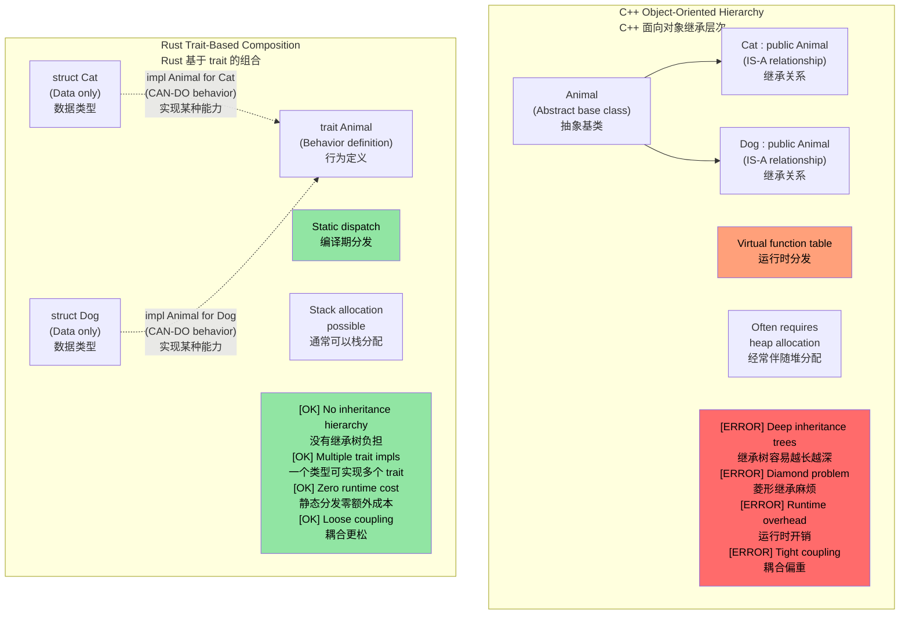
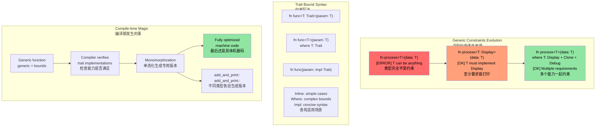

# Rust traits<br><span class="zh-inline">Rust 的 trait</span>

> **What you'll learn:** Traits are Rust's answer to interfaces, abstract base classes, and operator overloading. This chapter covers how to define traits, implement them for concrete types, and choose between static dispatch and dynamic dispatch. For C++ developers, traits overlap with virtual functions, CRTP, and concepts. For C developers, traits are Rust's structured form of polymorphism.<br><span class="zh-inline">**本章将学到什么：** trait 是 Rust 用来表达接口、抽象行为和运算符重载的核心机制。本章会讲 trait 怎么定义、怎么给类型实现，以及静态分发和动态分发该怎么选。对 C++ 开发者来说，它和虚函数、CRTP、concepts 都有交集；对 C 开发者来说，它就是 Rust 组织多态能力的正规方式。</span>

- Rust traits are conceptually similar to interfaces in other languages.<br><span class="zh-inline">trait 的核心作用，就是先把“某种能力长什么样”定义出来。</span>
    - A trait declares methods that implementing types must provide.<br><span class="zh-inline">实现这个 trait 的类型，就得把这些方法补上。</span>

```rust
fn main() {
    trait Pet {
        fn speak(&self);
    }
    struct Cat;
    struct Dog;
    impl Pet for Cat {
        fn speak(&self) {
            println!("Meow");
        }
    }
    impl Pet for Dog {
        fn speak(&self) {
            println!("Woof!")
        }
    }
    let c = Cat{};
    let d = Dog{};
    c.speak();  // There is no "is a" relationship between Cat and Dog
    d.speak(); // There is no "is a" relationship between Cat and Dog
}
```

## Traits vs C++ Concepts and Interfaces<br><span class="zh-inline">trait、C++ concepts 和接口的关系</span>

### Traditional C++ Inheritance vs Rust Traits<br><span class="zh-inline">传统 C++ 继承与 Rust trait 的对比</span>

```cpp
// C++ - Inheritance-based polymorphism
class Animal {
public:
    virtual void speak() = 0;  // Pure virtual function
    virtual ~Animal() = default;
};

class Cat : public Animal {  // "Cat IS-A Animal"
public:
    void speak() override {
        std::cout << "Meow" << std::endl;
    }
};

void make_sound(Animal* animal) {  // Runtime polymorphism
    animal->speak();  // Virtual function call
}
```

```rust
// Rust - Composition over inheritance with traits
trait Animal {
    fn speak(&self);
}

struct Cat;  // Cat is NOT an Animal, but IMPLEMENTS Animal behavior

impl Animal for Cat {  // "Cat CAN-DO Animal behavior"
    fn speak(&self) {
        println!("Meow");
    }
}

fn make_sound<T: Animal>(animal: &T) {  // Static polymorphism
    animal.speak();  // Direct function call (zero cost)
}
```



Rust 没有“类型必须继承自某个基类”这套默认思路。类型本身只关心数据和结构，行为能力再通过 trait 附着上去。<br><span class="zh-inline">这也是为什么 Rust 更像“组合能力”，而不是“塞进继承树”。</span>

### Trait bounds and generic constraints<br><span class="zh-inline">trait bound 与泛型约束</span>

```rust
use std::fmt::Display;
use std::ops::Add;

// C++ template equivalent (less constrained)
// template<typename T>
// T add_and_print(T a, T b) {
//     // No guarantee T supports + or printing
//     return a + b;  // Might fail at compile time
// }

// Rust - explicit trait bounds
fn add_and_print<T>(a: T, b: T) -> T 
where 
    T: Display + Add<Output = T> + Copy,
{
    println!("Adding {} + {}", a, b);  // Display trait
    a + b  // Add trait
}
```



这里最关键的一点是：Rust 不喜欢“先假设你什么都能做，等编译炸了再说”。trait bound 把能力要求写进签名里，函数能接什么类型一眼就看出来。<br><span class="zh-inline">对大型代码库来说，这种显式约束会省掉很多猜谜时间。</span>

### C++ operator overloading → Rust `std::ops` traits<br><span class="zh-inline">C++ 运算符重载在 Rust 里的对应物</span>

在 C++ 里，运算符重载是通过带特殊名字的成员函数或自由函数完成的。Rust 则把每个运算符都映射成了一个 trait。<br><span class="zh-inline">不是写 `operator+` 这种魔法名字，而是实现某个标准 trait。</span>

#### Side-by-side: `+` operator<br><span class="zh-inline">并排看 `+` 运算符</span>

```cpp
// C++: operator overloading as a member or free function
struct Vec2 {
    double x, y;
    Vec2 operator+(const Vec2& rhs) const {
        return {x + rhs.x, y + rhs.y};
    }
};

Vec2 a{1.0, 2.0}, b{3.0, 4.0};
Vec2 c = a + b;  // calls a.operator+(b)
```

```rust
use std::ops::Add;

#[derive(Debug, Clone, Copy)]
struct Vec2 { x: f64, y: f64 }

impl Add for Vec2 {
    type Output = Vec2;                     // Associated type — the result of +
    fn add(self, rhs: Vec2) -> Vec2 {
        Vec2 { x: self.x + rhs.x, y: self.y + rhs.y }
    }
}

let a = Vec2 { x: 1.0, y: 2.0 };
let b = Vec2 { x: 3.0, y: 4.0 };
let c = a + b;  // calls <Vec2 as Add>::add(a, b)
println!("{c:?}"); // Vec2 { x: 4.0, y: 6.0 }
```

#### Key differences from C++<br><span class="zh-inline">和 C++ 相比的关键差异</span>

| Aspect | C++ | Rust |
|--------|-----|------|
| **Mechanism** | Magic names like `operator+`<br><span class="zh-inline">特殊函数名</span> | Implement a trait such as `Add`<br><span class="zh-inline">通过 trait 实现</span> |
| **Discovery** | Search operator overloads or headers<br><span class="zh-inline">得去翻头文件或搜实现</span> | Look at trait impls; IDE support is usually excellent<br><span class="zh-inline">trait 实现集中得多</span> |
| **Return type** | Free choice<br><span class="zh-inline">完全自定</span> | Expressed through the associated type `Output`<br><span class="zh-inline">通过关联类型显式写出来</span> |
| **Receiver** | Often borrowed as `const T&`<br><span class="zh-inline">通常按借用接收</span> | Usually takes `self` by value by default<br><span class="zh-inline">默认常常是按值拿走 `self`</span> |
| **Symmetry** | Can overload in many flexible ways<br><span class="zh-inline">自由度更高</span> | Constrained by coherence/orphan rules<br><span class="zh-inline">会受到一致性规则限制</span> |
| **Printing** | `operator<<` on streams<br><span class="zh-inline">通过流重载</span> | `fmt::Display` / `fmt::Debug`<br><span class="zh-inline">显示和调试输出分开处理</span> |

#### The `self` by-value gotcha<br><span class="zh-inline">`self` 按值接收这个坑点</span>

Rust 的 `Add::add(self, rhs)` 默认会按值拿走 `self`。对 `Copy` 类型来说无所谓，因为编译器会自动复制。但对非 `Copy` 类型，这就意味着 `+` 可能把左操作数消耗掉。<br><span class="zh-inline">这一点和 C++ 里“加法通常返回新对象，原对象还在”很不一样。</span>

```rust
let s1 = String::from("hello ");
let s2 = String::from("world");
let s3 = s1 + &s2;  // s1 is MOVED into s3!
// println!("{s1}");  // ❌ Compile error: value used after move
println!("{s2}");     // ✅ s2 was only borrowed (&s2)
```

这就是为什么 `String + &str` 可行，而 `&str + &str` 不行。`String` 这边的实现会消费左值，重用它已有的缓冲区。<br><span class="zh-inline">这和 C++ `std::string::operator+` 的直觉差别挺大，第一次见容易发懵。</span>

#### Full mapping: C++ operators → Rust traits<br><span class="zh-inline">C++ 运算符与 Rust trait 的完整对照</span>

| C++ Operator | Rust Trait | Notes |
|-------------|-----------|-------|
| `operator+` | `std::ops::Add` | `Output` associated type<br><span class="zh-inline">结果类型写在关联类型里</span> |
| `operator-` | `std::ops::Sub` | |
| `operator*` | `std::ops::Mul` | Pointer deref is separate (`Deref`)<br><span class="zh-inline">乘法和解引用是两回事</span> |
| `operator/` | `std::ops::Div` | |
| `operator%` | `std::ops::Rem` | |
| Unary `operator-` | `std::ops::Neg` | |
| `operator!` / `operator~` | `std::ops::Not` | Rust uses `!` for both logical and bitwise not<br><span class="zh-inline">Rust 没有单独的 `~`</span> |
| `operator&`, `\|`, `^` | `BitAnd`, `BitOr`, `BitXor` | |
| Shift `<<`, `>>` | `Shl`, `Shr` | Not stream I/O<br><span class="zh-inline">这里说的是位移，不是输出流</span> |
| `operator+=` | `std::ops::AddAssign` | Takes `&mut self`<br><span class="zh-inline">复合赋值通常按可变借用处理</span> |
| `operator[]` | `Index` / `IndexMut` | Returns references<br><span class="zh-inline">返回借用，而不是任意对象</span> |
| `operator()` | `Fn` / `FnMut` / `FnOnce` | Used by closures<br><span class="zh-inline">闭包就是靠这套 trait 工作</span> |
| `operator==` | `PartialEq` and maybe `Eq` | In `std::cmp`<br><span class="zh-inline">属于比较 trait，不在 `std::ops`</span> |
| `operator<` | `PartialOrd` and maybe `Ord` | In `std::cmp` |
| `operator<<` for printing | `fmt::Display` | `println!("{}", x)` |
| `operator<<` for debug | `fmt::Debug` | `println!("{:?}", x)` |
| `operator bool` | No direct equivalent | Prefer named methods or `From` / `Into`<br><span class="zh-inline">Rust 不鼓励这种隐式转换</span> |
| Implicit conversion operators | No implicit conversions | Use `From` / `Into` explicitly<br><span class="zh-inline">转换必须显式发生</span> |

#### Guardrails: what Rust refuses to let you overload<br><span class="zh-inline">Rust 故意不让重载的那些危险东西</span>

1. **No implicit conversions.**<br><span class="zh-inline">没有隐式类型转换运算符。想转就显式 `.into()` 或调用 `From`。</span>
2. **No overloading `&&` and `||`.**<br><span class="zh-inline">短路逻辑运算符不给碰，省得把控制流语义玩坏。</span>
3. **No overloading assignment itself.**<br><span class="zh-inline">赋值永远是 move 或 copy，不允许自定义一套怪逻辑。</span>
4. **No overloading comma.**<br><span class="zh-inline">C++ 这个老坑，Rust 干脆整个封死。</span>
5. **No overloading address-of.**<br><span class="zh-inline">`&` 永远就是借用，不会突然搞出别的花活。</span>
6. **Coherence rules limit who can implement what.**<br><span class="zh-inline">trait 和类型的组合实现受一致性规则约束，避免不同 crate 相互打架。</span>

> **Bottom line:** C++ 的运算符重载很强，但自由度大到容易闹幺蛾子。Rust 保留了足够的表达力，却把历史上最危险的那一批重载口子堵上了。<br><span class="zh-inline">这样一来，算术和比较照样能写得优雅，语言本身却没那么容易被玩成谜语。</span>

----

# Implementing your own traits on types<br><span class="zh-inline">给类型实现自定义 trait</span>

- Rust allows implementing a user-defined trait even for built-in types like `u32`, as long as either the trait or the type belongs to the current crate.<br><span class="zh-inline">这就是所谓的孤儿规则边界：trait 和类型至少得有一个是自家的。</span>

```rust
trait IsSecret {
  fn is_secret(&self);
}
// The IsSecret trait belongs to the crate, so we are OK
impl IsSecret for u32 {
  fn is_secret(&self) {
      if *self == 42 {
          println!("Is secret of life");
      }
  }
}

fn main() {
  42u32.is_secret();
  43u32.is_secret();
}
```

这个规则的目的很简单：防止两个外部 crate 同时给“外部 trait + 外部类型”写实现，然后把整个生态搅成一锅粥。<br><span class="zh-inline">限制虽硬，但换来的是全局一致性。</span>

# Supertraits and default implementations<br><span class="zh-inline">supertrait 与默认实现</span>

- Traits can inherit requirements from other traits and can also provide default method implementations.<br><span class="zh-inline">也就是说，trait 不仅能要求“先满足某种能力”，还可以自带一部分通用实现。</span>

```rust
trait Animal {
  // Default implementation
  fn is_mammal(&self) -> bool {
    true
  }
}
trait Feline : Animal {
  // Default implementation
  fn is_feline(&self) -> bool {
    true
  }
}

struct Cat;
// Use default implementations. Note that all traits for the supertrait must be individually implemented
impl Feline for Cat {}
impl Animal for Cat {}
fn main() {
  let c = Cat{};
  println!("{} {}", c.is_mammal(), c.is_feline());
}
```

这里 `Feline: Animal` 的意思是：想实现 `Feline`，先得满足 `Animal`。默认实现则适合写那些“大多数类型都一样”的基础行为。<br><span class="zh-inline">需要特化时，再由具体类型覆写即可。</span>

----

# Exercise: Logger trait implementation<br><span class="zh-inline">练习：实现一个 Logger trait</span>

🟡 **Intermediate**<br><span class="zh-inline">🟡 **进阶练习**</span>

- Implement a `Log` trait with one method `log()` that accepts a `u64`.<br><span class="zh-inline">实现一个 `Log` trait，里面只有一个方法 `log()`，参数是 `u64`。</span>
- Create two loggers, `SimpleLogger` and `ComplexLogger`，都实现这个 trait。前者打印 `"Simple logger"` 和数值，后者打印 `"Complex logger"` 以及更详细的格式化信息。<br><span class="zh-inline">这道题的重点不是输出花样，而是体会“同一接口，不同实现”的结构。</span>

<details><summary>Solution <span class="zh-inline">参考答案</span></summary>

```rust
trait Log {
    fn log(&self, value: u64);
}

struct SimpleLogger;
struct ComplexLogger;

impl Log for SimpleLogger {
    fn log(&self, value: u64) {
        println!("Simple logger: {value}");
    }
}

impl Log for ComplexLogger {
    fn log(&self, value: u64) {
        println!("Complex logger: {value} (hex: 0x{value:x}, binary: {value:b})");
    }
}

fn main() {
    let simple = SimpleLogger;
    let complex = ComplexLogger;
    simple.log(42);
    complex.log(42);
}
// Output:
// Simple logger: 42
// Complex logger: 42 (hex: 0x2a, binary: 101010)
```

</details>

----

# Trait associated types<br><span class="zh-inline">trait 的关联类型</span>

```rust
#[derive(Debug)]
struct Small(u32);
#[derive(Debug)]
struct Big(u32);
trait Double {
    type T;
    fn double(&self) -> Self::T;
}

impl Double for Small {
    type T = Big;
    fn double(&self) -> Self::T {
        Big(self.0 * 2)
    }
}
fn main() {
    let a = Small(42);
    println!("{:?}", a.double());
}
```

关联类型的作用，是把“这个 trait 的某个相关类型由实现者决定”这件事写进接口本身。<br><span class="zh-inline">和泛型参数相比，它更适合表达“同一实现里固定绑定的一种返回类型或辅助类型”。</span>

# `impl Trait` in parameters<br><span class="zh-inline">参数位置里的 `impl Trait`</span>

- `impl` can be used with trait bounds to accept any type implementing a trait, while keeping the signature concise.<br><span class="zh-inline">语义上它还是泛型，只是写法更顺手。</span>

```rust
trait Pet {
    fn speak(&self);
}
struct Dog {}
struct Cat {}
impl Pet for Dog {
    fn speak(&self) {println!("Woof!")}
}
impl Pet for Cat {
    fn speak(&self) {println!("Meow")}
}
fn pet_speak(p: &impl Pet) {
    p.speak();
}
fn main() {
    let c = Cat {};
    let d = Dog {};
    pet_speak(&c);
    pet_speak(&d);
}
```

# `impl Trait` in return position<br><span class="zh-inline">返回值位置里的 `impl Trait`</span>

- `impl Trait` can also be used for return values, hiding the concrete type from the caller while still using static dispatch.<br><span class="zh-inline">调用方知道“返回的是某种实现了这个 trait 的类型”，但不需要知道它到底叫啥。</span>

```rust
trait Pet {}
struct Dog;
struct Cat;
impl Pet for Cat {}
impl Pet for Dog {}
fn cat_as_pet() -> impl Pet {
    let c = Cat {};
    c
}
fn dog_as_pet() -> impl Pet {
    let d = Dog {};
    d
}
fn main() {
    let p = cat_as_pet();
    let d = dog_as_pet();
}
```

这里要注意一点：同一个返回位置的 `impl Trait` 仍然只能对应一个具体类型，不能今天返回 `Cat`、明天返回 `Dog`。<br><span class="zh-inline">真想在同一个函数里返回多种具体类型，就得考虑 `dyn Trait` 或 `enum`。</span>

----

# Dynamic traits<br><span class="zh-inline">动态 trait 对象</span>

- Dynamic dispatch allows code to call trait methods without knowing the concrete underlying type at compile time. This is the familiar “type erasure” pattern.<br><span class="zh-inline">说白了，就是把具体类型藏在一个 trait 对象后面，运行时再通过 vtable 找到对应实现。</span>

```rust
trait Pet {
    fn speak(&self);
}
struct Dog {}
struct Cat {x: u32}
impl Pet for Dog {
    fn speak(&self) {println!("Woof!")}
}
impl Pet for Cat {
    fn speak(&self) {println!("Meow")}
}
fn pet_speak(p: &dyn Pet) {
    p.speak();
}
fn main() {
    let c = Cat {x: 42};
    let d = Dog {};
    pet_speak(&c);
    pet_speak(&d);
}
```

和泛型不同，这里不会为每个具体类型单独生成一份代码。代价是每次调用多一层动态分发。<br><span class="zh-inline">多数情况下开销很小，但如果在极高频热点路径里，还是值得心里有数。</span>

----

## Choosing between `impl Trait`, `dyn Trait`, and enums<br><span class="zh-inline">`impl Trait`、`dyn Trait` 和 `enum` 到底怎么选</span>

这三种写法都能表达“多态”，但适用场景并不一样。<br><span class="zh-inline">选错了也不至于立刻出事故，但代码会别扭，性能和可维护性也会跟着受影响。</span>

| Approach | Dispatch | Performance | Heterogeneous collections? | When to use |
|----------|----------|-------------|---------------------------|-------------|
| `impl Trait` / generics | Static dispatch<br><span class="zh-inline">静态分发</span> | Zero-cost after monomorphization<br><span class="zh-inline">编译后基本零额外成本</span> | No<br><span class="zh-inline">单个位置只能是一种具体类型</span> | Default choice for parameters and many return values<br><span class="zh-inline">默认优先考虑的方案</span> |
| `dyn Trait` | Dynamic dispatch<br><span class="zh-inline">动态分发</span> | Small per-call overhead<br><span class="zh-inline">每次调用多一层间接跳转</span> | Yes<br><span class="zh-inline">适合混合类型集合</span> | Plugin systems, heterogeneous containers, runtime flexibility<br><span class="zh-inline">插件式扩展、运行时决定具体类型</span> |
| `enum` | Pattern matching<br><span class="zh-inline">`match` 分发</span> | Zero-cost with closed set of variants<br><span class="zh-inline">已知变体集合时非常高效</span> | Yes, but only for known variants<br><span class="zh-inline">前提是变体集合固定</span> | Closed-world designs where all variants are known now<br><span class="zh-inline">自己掌控所有分支时非常合适</span> |

```rust
trait Shape {
    fn area(&self) -> f64;
}
struct Circle { radius: f64 }
struct Rect { w: f64, h: f64 }
impl Shape for Circle { fn area(&self) -> f64 { std::f64::consts::PI * self.radius * self.radius } }
impl Shape for Rect   { fn area(&self) -> f64 { self.w * self.h } }

// Static dispatch — compiler generates separate code for each type
fn print_area(s: &impl Shape) { println!("{}", s.area()); }

// Dynamic dispatch — one function, works with any Shape behind a pointer
fn print_area_dyn(s: &dyn Shape) { println!("{}", s.area()); }

// Enum — closed set, no trait needed
enum ShapeEnum { Circle(f64), Rect(f64, f64) }
impl ShapeEnum {
    fn area(&self) -> f64 {
        match self {
            ShapeEnum::Circle(r) => std::f64::consts::PI * r * r,
            ShapeEnum::Rect(w, h) => w * h,
        }
    }
}
```

> **For C++ developers:** `impl Trait` is closest to templates, `dyn Trait` is closest to virtual dispatch, and `enum + match` is the Rust-flavored counterpart to `std::variant + std::visit`。<br><span class="zh-inline">**给 C++ 开发者的速记：** `impl Trait` 像模板，`dyn Trait` 像虚函数表，`enum + match` 则像更受编译器强约束的 `variant` 方案。</span>

> **Rule of thumb:** Start with `impl Trait`. Reach for `dyn Trait` when the concrete type truly cannot be known ahead of time or when mixed collections are required. Use `enum` when the full set of variants is closed and controlled by the current crate.<br><span class="zh-inline">**经验法则：** 默认先从 `impl Trait` 开始。确实要做运行时多态、或者集合里要混装多种实现时，再考虑 `dyn Trait`。如果所有变体都掌握在当前 crate 手里，那 `enum` 往往更直接。</span>
