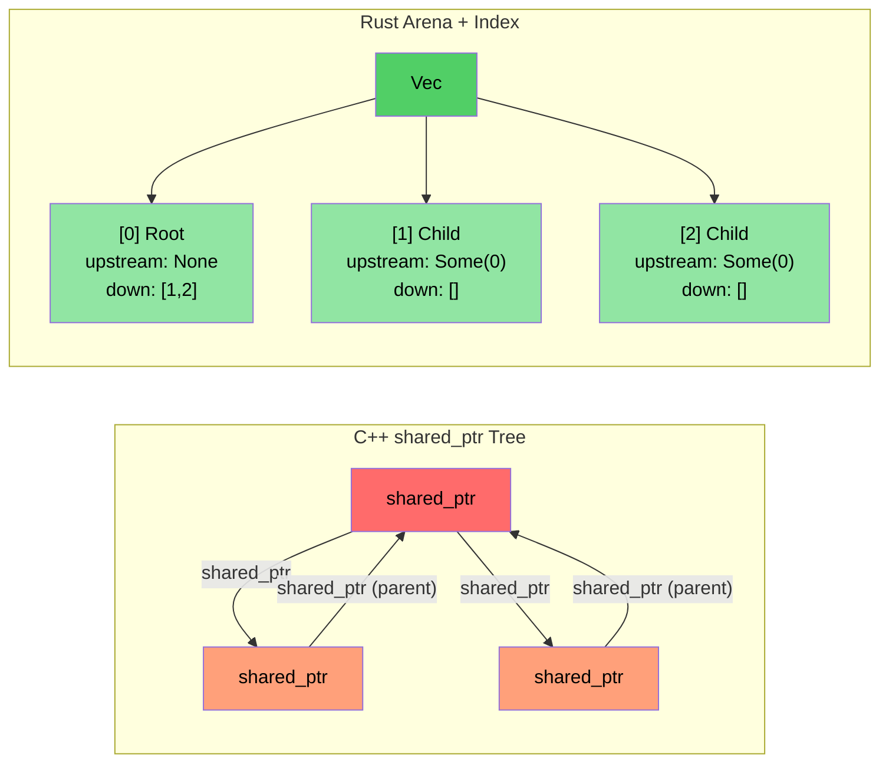

# Case Study Overview: C++ to Rust Translation<br><span class="zh-inline">案例总览：从 C++ 迁移到 Rust</span>

> **What you'll learn:** Lessons from a real-world translation of ~100K lines of C++ to ~90K lines of Rust across ~20 crates. Five key transformation patterns and the architectural decisions behind them.<br><span class="zh-inline">**本章将学到什么：** 一个真实项目把约 10 万行 C++ 重写成约 9 万行 Rust、拆成约 20 个 crate 之后，总结出的经验教训。重点看五类核心转化模式，以及这些架构选择背后的原因。</span>

- We translated a large C++ diagnostic system (~100K lines of C++) into a Rust implementation (~20 Rust crates, ~90K lines)<br><span class="zh-inline">我们把一个大型 C++ 诊断系统从头翻成了 Rust 实现，大约从 10 万行 C++ 变成了 20 个左右 Rust crate、总计约 9 万行代码。</span>
- This section shows the **actual patterns** used — not toy examples, but real production code<br><span class="zh-inline">这一节讲的都是**真实用过的模式**，不是课堂玩具例子，而是生产代码里真刀真枪踩出来的做法。</span>
- The five key transformations:<br><span class="zh-inline">五类关键转换如下：</span>

| **#** | **C++ Pattern**<br><span class="zh-inline">C++ 模式</span> | **Rust Pattern**<br><span class="zh-inline">Rust 模式</span> | **Impact**<br><span class="zh-inline">效果</span> |
|-------|----------------|-----------------|-----------|
| 1 | Class hierarchy + `dynamic_cast`<br><span class="zh-inline">类层级 + `dynamic_cast`</span> | Enum dispatch + `match`<br><span class="zh-inline">枚举分发 + `match`</span> | ~400 → 0 dynamic_casts<br><span class="zh-inline">`dynamic_cast` 从约 400 处降到 0</span> |
| 2 | `shared_ptr` / `enable_shared_from_this` tree<br><span class="zh-inline">`shared_ptr` / `enable_shared_from_this` 树结构</span> | Arena + index linkage<br><span class="zh-inline">Arena + 索引关联</span> | No reference cycles<br><span class="zh-inline">彻底避免引用环</span> |
| 3 | `Framework*` raw pointer in every module<br><span class="zh-inline">每个模块里都塞一个 `Framework*` 裸指针</span> | `DiagContext<'a>` with lifetime borrowing<br><span class="zh-inline">带生命周期借用的 `DiagContext<'a>`</span> | Compile-time validity<br><span class="zh-inline">有效性在编译期校验</span> |
| 4 | God object<br><span class="zh-inline">巨型上帝对象</span> | Composable state structs<br><span class="zh-inline">可组合的状态结构体</span> | Testable, modular<br><span class="zh-inline">更容易测试，也更模块化</span> |
| 5 | `vector<unique_ptr<Base>>` everywhere<br><span class="zh-inline">到处都是 `vector<unique_ptr<Base>>`</span> | Trait objects **only** where needed (~25 uses)<br><span class="zh-inline">只在必要场景下使用 trait object，大约 25 处</span> | Static dispatch default<br><span class="zh-inline">默认走静态分发</span> |

### Before and After Metrics<br><span class="zh-inline">迁移前后指标对比</span>

| **Metric**<br><span class="zh-inline">指标</span> | **C++ (Original)**<br><span class="zh-inline">C++ 原始实现</span> | **Rust (Rewrite)**<br><span class="zh-inline">Rust 重写实现</span> |
|------------|---------------------|------------------------|
| `dynamic_cast` / type downcasts<br><span class="zh-inline">`dynamic_cast` / 类型向下转型</span> | ~400 | 0 |
| `virtual` / `override` methods<br><span class="zh-inline">`virtual` / `override` 方法</span> | ~900 | ~25 (`Box<dyn Trait>`) |
| Raw `new` allocations<br><span class="zh-inline">裸 `new` 分配</span> | ~200 | 0 (all owned types)<br><span class="zh-inline">0，全部改成显式所有权类型</span> |
| `shared_ptr` / reference counting<br><span class="zh-inline">`shared_ptr` / 引用计数</span> | ~10 (topology lib)<br><span class="zh-inline">约 10 处，主要在拓扑库</span> | 0 (`Arc` only at FFI boundary)<br><span class="zh-inline">0，只有 FFI 边界才用 `Arc`</span> |
| `enum class` definitions<br><span class="zh-inline">`enum class` 定义</span> | ~60 | ~190 `pub enum` |
| Pattern matching expressions<br><span class="zh-inline">模式匹配表达式</span> | N/A | ~750 `match` |
| God objects (>5K lines)<br><span class="zh-inline">上帝对象（超过 5000 行）</span> | 2 | 0 |

这些数字很能说明问题：Rust 重写不是“把 C++ 语法改成 Rust 语法”那么简单，而是顺手把一整批原本靠运行时兜底的设计，改造成了更静态、更可验证的结构。<br><span class="zh-inline">也就是说，真正值钱的部分不是换了门语言，而是趁机把模型理顺了。否则只是把旧包袱换个皮接着背，纯属自讨苦吃。</span>

----

# Case Study 1: Inheritance hierarchy → Enum dispatch<br><span class="zh-inline">案例一：继承层级改成枚举分发</span>

## The C++ Pattern: Event Class Hierarchy<br><span class="zh-inline">C++ 的老路子：事件类层级</span>

```cpp
// C++ original: Every GPU event type is a class inheriting from GpuEventBase
class GpuEventBase {
public:
    virtual ~GpuEventBase() = default;
    virtual void Process(DiagFramework* fw) = 0;
    uint16_t m_recordId;
    uint8_t  m_sensorType;
    // ... common fields
};

class GpuPcieDegradeEvent : public GpuEventBase {
public:
    void Process(DiagFramework* fw) override;
    uint8_t m_linkSpeed;
    uint8_t m_linkWidth;
};

class GpuPcieFatalEvent : public GpuEventBase { /* ... */ };
class GpuBootEvent : public GpuEventBase { /* ... */ };
// ... 10+ event classes inheriting from GpuEventBase

// Processing requires dynamic_cast:
void ProcessEvents(std::vector<std::unique_ptr<GpuEventBase>>& events,
                   DiagFramework* fw) {
    for (auto& event : events) {
        if (auto* degrade = dynamic_cast<GpuPcieDegradeEvent*>(event.get())) {
            // handle degrade...
        } else if (auto* fatal = dynamic_cast<GpuPcieFatalEvent*>(event.get())) {
            // handle fatal...
        }
        // ... 10 more branches
    }
}
```

这种设计在 C++ 里不算少见：先搞一棵继承树，再往一个 `vector<unique_ptr<Base>>` 里乱炖，最后消费端一边遍历一边 `dynamic_cast`。能跑，但读起来像拆炸弹，改起来像挖雷。<br><span class="zh-inline">一旦事件种类越来越多，分支也会跟着爆炸，类型系统在这种结构里基本没帮上什么忙。</span>

## The Rust Solution: Enum Dispatch<br><span class="zh-inline">Rust 的解法：枚举分发</span>

```rust
// Example: types.rs — No inheritance, no vtable, no dynamic_cast
#[derive(Debug, Clone, PartialEq, Eq, Serialize, Deserialize)]
pub enum GpuEventKind {
    PcieDegrade,
    PcieFatal,
    PcieUncorr,
    Boot,
    BaseboardState,
    EccError,
    OverTemp,
    PowerRail,
    ErotStatus,
    Unknown,
}
```

```rust
// Example: manager.rs — Separate typed Vecs, no downcasting needed
pub struct GpuEventManager {
    sku: SkuVariant,
    degrade_events: Vec<GpuPcieDegradeEvent>,   // Concrete type, not Box<dyn>
    fatal_events: Vec<GpuPcieFatalEvent>,
    uncorr_events: Vec<GpuPcieUncorrEvent>,
    boot_events: Vec<GpuBootEvent>,
    baseboard_events: Vec<GpuBaseboardEvent>,
    ecc_events: Vec<GpuEccEvent>,
    // ... each event type gets its own Vec
}

// Accessors return typed slices — zero ambiguity
impl GpuEventManager {
    pub fn degrade_events(&self) -> &[GpuPcieDegradeEvent] {
        &self.degrade_events
    }
    pub fn fatal_events(&self) -> &[GpuPcieFatalEvent] {
        &self.fatal_events
    }
}
```

Rust 这边没有照着 C++ 生搬硬套。真正有效的做法，是把“类型分发”前移到数据建模阶段。不同事件该分开存，就老老实实分开存。<br><span class="zh-inline">这样一来，消费方根本不需要 downcast，也不需要猜“当前拿到的是不是这个子类”。拿到什么类型，就处理什么类型，代码一下就亮堂了。</span>

### Why Not `Vec<Box<dyn GpuEvent>>`?<br><span class="zh-inline">为什么不写成 `Vec<Box<dyn GpuEvent>>`？</span>

- **The Wrong Approach** (literal translation): Put all events in one heterogeneous collection, then downcast — this is what C++ does with `vector<unique_ptr<Base>>`<br><span class="zh-inline">**错误做法**：按字面直译，继续把所有事件塞进一个异构集合里，再去 downcast。这其实就是把 C++ 的毛病原封不动带进 Rust。</span>
- **The Right Approach**: Separate typed Vecs eliminate *all* downcasting. Each consumer asks for exactly the event type it needs<br><span class="zh-inline">**更好的做法**：按具体类型拆成独立 `Vec`，这样可以把 downcast 全部删掉。每个消费者只拿自己真正需要的那一类事件。</span>
- **Performance**: Separate Vecs give better cache locality (all degrade events are contiguous in memory)<br><span class="zh-inline">**性能收益**：拆开的 `Vec` 还会带来更好的缓存局部性，同类事件挨着存，遍历时更顺。</span>

这一刀砍下去，往往是迁移里最提气的一步：类型语义终于从“运行时猜”变成了“编译期定”。<br><span class="zh-inline">说得直白一点，就是少了很多“看着挺面向对象，其实全靠 if-else 补锅”的历史包袱。</span>

----

# Case Study 2: shared_ptr tree → Arena/index pattern<br><span class="zh-inline">案例二：`shared_ptr` 树改成 arena 加索引</span>

## The C++ Pattern: Reference-Counted Tree<br><span class="zh-inline">C++ 的老模式：引用计数树</span>

```cpp
// C++ topology library: PcieDevice uses enable_shared_from_this 
// because parent and child nodes both need to reference each other
class PcieDevice : public std::enable_shared_from_this<PcieDevice> {
public:
    std::shared_ptr<PcieDevice> m_upstream;
    std::vector<std::shared_ptr<PcieDevice>> m_downstream;
    // ... device data
    
    void AddChild(std::shared_ptr<PcieDevice> child) {
        child->m_upstream = shared_from_this();  // Parent ↔ child cycle!
        m_downstream.push_back(child);
    }
};
// Problem: parent→child and child→parent create reference cycles
// Need weak_ptr to break cycles, but easy to forget
```

这种树结构在 C++ 里也很常见：为了让父节点和子节点都能互相引用，先上 `shared_ptr`，再靠 `weak_ptr` 去拆环。写的时候像是图省事，后面排查生命周期时就容易变成灾难片。<br><span class="zh-inline">尤其是 `enable_shared_from_this` 一上场，说明所有权模型已经开始拧巴了，代码表面工整，底下全是暗流。</span>

## The Rust Solution: Arena with Index Linkage<br><span class="zh-inline">Rust 的解法：arena 加索引关联</span>

```rust
// Example: components.rs — Flat Vec owns all devices
pub struct PcieDevice {
    pub base: PcieDeviceBase,
    pub kind: PcieDeviceKind,

    // Tree linkage via indices — no reference counting, no cycles
    pub upstream_idx: Option<usize>,      // Index into the arena Vec
    pub downstream_idxs: Vec<usize>,      // Indices into the arena Vec
}

// The "arena" is simply a Vec<PcieDevice> owned by the tree:
pub struct DeviceTree {
    devices: Vec<PcieDevice>,  // Flat ownership — one Vec owns everything
}

impl DeviceTree {
    pub fn parent(&self, device_idx: usize) -> Option<&PcieDevice> {
        self.devices[device_idx].upstream_idx
            .map(|idx| &self.devices[idx])
    }
    
    pub fn children(&self, device_idx: usize) -> Vec<&PcieDevice> {
        self.devices[device_idx].downstream_idxs
            .iter()
            .map(|&idx| &self.devices[idx])
            .collect()
    }
}
```

Rust 这里的思路是干净得多的：树里所有节点统一交给一个 `Vec<PcieDevice>` 持有，节点之间只存索引。<br><span class="zh-inline">索引就是普通整数，不带所有权，不参与引用计数，更不会自己长出环。父子关系还在，但生命周期纠缠已经被拆开了。</span>

### Key Insight<br><span class="zh-inline">关键理解</span>

- **No `shared_ptr`, no `weak_ptr`, no `enable_shared_from_this`**<br><span class="zh-inline">**没有 `shared_ptr`，没有 `weak_ptr`，也不需要 `enable_shared_from_this`。**</span>
- **No reference cycles possible** — indices are just `usize` values<br><span class="zh-inline">**不会出现引用环**，因为索引只是 `usize` 值，本身不拥有任何对象。</span>
- **Better cache performance** — all devices in contiguous memory<br><span class="zh-inline">**缓存性能更好**，所有设备对象都连续摆在同一块内存里。</span>
- **Simpler reasoning** — one owner (the Vec), many viewers (indices)<br><span class="zh-inline">**推理更简单**：只有一个真正的拥有者，也就是 `Vec`；其余地方都只是通过索引去看。</span>



这张图已经把差异画得挺残忍了。左边那套是对象互相抱着不撒手，右边这套是一个统一仓库存对象，关系全部走编号。<br><span class="zh-inline">当数据结构规模一上来，后者在调试、性能和维护成本上都会舒服很多。</span>

----
