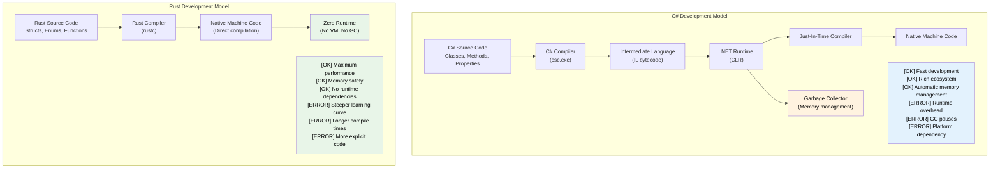

## Speaker Intro and General Approach<br><span class="zh-inline">讲者介绍与整体思路</span>

- Speaker intro<br><span class="zh-inline">讲者背景</span>
    <span class="zh-inline">微软 SCHIE 团队的首席固件架构师，长期做安全、系统编程、固件、操作系统、虚拟机、CPU 与平台架构相关工作。</span>
- Principal Firmware Architect in Microsoft SCHIE (Silicon and Cloud Hardware Infrastructure Engineering) team<br><span class="zh-inline">现任微软 SCHIE（Silicon and Cloud Hardware Infrastructure Engineering）团队首席固件架构师。</span>
- Industry veteran with expertise in security, systems programming (firmware, operating systems, hypervisors), CPU and platform architecture, and C++ systems<br><span class="zh-inline">是系统、安全、平台架构和 C++ 系统开发方向的资深从业者。</span>
- Started programming in Rust in 2017 (@AWS EC2), and have been in love with the language ever since<br><span class="zh-inline">从 2017 年在 AWS EC2 开始写 Rust，之后就一直很认这门语言。</span>
- This course is intended to be as interactive as possible<br><span class="zh-inline">这套课程的目标是尽量做成高互动式讲解。</span>
- Assumption: You know C# and .NET development<br><span class="zh-inline">默认前提：已经熟悉 C# 和 .NET 开发。</span>
- Examples deliberately map C# concepts to Rust equivalents<br><span class="zh-inline">示例会有意识地把 C# 概念映射到 Rust 对应物上。</span>
- **Please feel free to ask clarifying questions at any point of time**<br><span class="zh-inline">**随时都可以追问细节，不需要等到讲完再问。**</span>

---

## The Case for Rust for C# Developers<br><span class="zh-inline">为什么 C# 开发者值得学 Rust</span>

> **What you'll learn:** Why Rust matters for C# developers: the performance gap between managed and native code, how Rust eliminates null-reference exceptions and hidden control flow at compile time, and the main scenarios where Rust complements or replaces C#.<br><span class="zh-inline">**本章将学到什么：** 理解 Rust 为什么值得 C# 开发者认真投入：托管代码与原生代码的性能差异从哪来，Rust 如何在编译期消灭空引用异常和隐藏控制流，以及它在什么场景下适合补充甚至替代 C#。</span>
>
> **Difficulty:** 🟢 Beginner<br><span class="zh-inline">**难度：** 🟢 入门</span>

### Performance Without the Runtime Tax<br><span class="zh-inline">没有运行时税的性能</span>

```csharp
// C# - Great productivity, runtime overhead
public class DataProcessor
{
    private List<int> data = new List<int>();
    
    public void ProcessLargeDataset()
    {
        // Allocations trigger GC
        for (int i = 0; i < 10_000_000; i++)
        {
            data.Add(i * 2); // GC pressure
        }
        // Unpredictable GC pauses during processing
    }
}
// Runtime: Variable (50-200ms due to GC)
// Memory: ~80MB (including GC overhead)
// Predictability: Low (GC pauses)
```

```rust
// Rust - Same expressiveness, zero runtime overhead
struct DataProcessor {
    data: Vec<i32>,
}

impl DataProcessor {
    fn process_large_dataset(&mut self) {
        // Zero-cost abstractions
        for i in 0..10_000_000 {
            self.data.push(i * 2); // No GC pressure
        }
        // Deterministic performance
    }
}
// Runtime: Consistent (~30ms)
// Memory: ~40MB (exact allocation)
// Predictability: High (no GC)
```

Rust 吸引很多 C# 开发者的第一原因，往往不是语法，而是“性能和可预测性可以同时拿到”。<br><span class="zh-inline">C# 的生产力确实高，但托管运行时、GC、JIT 这些机制会把性能曲线拉得更复杂；Rust 则是尽量把抽象成本压回编译期，把运行时包袱减到最低。</span>

### Memory Safety Without Runtime Checks<br><span class="zh-inline">不靠运行时检查也能拿到内存安全</span>

```csharp
// C# - Runtime safety with overhead
public class UnsafeOperations
{
    public string ProcessArray(int[] array)
    {
        // Runtime bounds checking
        if (array.Length > 0)
        {
            return array[0].ToString(); // NullReferenceException possible
        }
        return null; // Null propagation
    }
    
    public void ProcessConcurrently()
    {
        var list = new List<int>();
        
        // Data races possible, requires careful locking
        Parallel.For(0, 1000, i =>
        {
            lock (list) // Runtime overhead
            {
                list.Add(i);
            }
        });
    }
}
```

```rust
// Rust - Compile-time safety with zero runtime cost
struct SafeOperations;

impl SafeOperations {
    // Compile-time null safety, no runtime checks
    fn process_array(array: &[i32]) -> Option<String> {
        array.first().map(|x| x.to_string())
        // No null references possible
        // Bounds checking optimized away when provably safe
    }
    
    fn process_concurrently() {
        use std::sync::{Arc, Mutex};
        use std::thread;
        
        let data = Arc::new(Mutex::new(Vec::new()));
        
        // Data races prevented at compile time
        let handles: Vec<_> = (0..1000).map(|i| {
            let data = Arc::clone(&data);
            thread::spawn(move || {
                data.lock().unwrap().push(i);
            })
        }).collect();
        
        for handle in handles {
            handle.join().unwrap();
        }
    }
}
```

Rust 真正厉害的地方，不只是安全，而是“把很多安全成本挪到了编译期”。<br><span class="zh-inline">换句话说，它不是靠在运行时加一堆护栏来保护程序，而是尽量让错误写不出来，或者至少编不过去。</span>

***

## Common C# Pain Points That Rust Addresses<br><span class="zh-inline">Rust 正面击中的那些 C# 常见痛点</span>

### 1. The Billion Dollar Mistake: Null References<br><span class="zh-inline">1. 十亿美元错误：空引用</span>

```csharp
// C# - Null reference exceptions are runtime bombs
public class UserService
{
    public string GetUserDisplayName(User user)
    {
        // Any of these could throw NullReferenceException
        return user.Profile.DisplayName.ToUpper();
        //     ^^^^^ ^^^^^^^ ^^^^^^^^^^^ ^^^^^^^
        //     Could be null at runtime
    }
    
    // Even with nullable reference types (C# 8+)
    public string GetDisplayName(User? user)
    {
        return user?.Profile?.DisplayName?.ToUpper() ?? "Unknown";
        // Still possible to have null at runtime
    }
}
```

```rust
// Rust - Null safety guaranteed at compile time
struct UserService;

impl UserService {
    fn get_user_display_name(user: &User) -> Option<String> {
        user.profile.as_ref()?
            .display_name.as_ref()
            .map(|name| name.to_uppercase())
        // Compiler forces you to handle None case
        // Impossible to have null pointer exceptions
    }
    
    fn get_display_name_safe(user: Option<&User>) -> String {
        user.and_then(|u| u.profile.as_ref())
            .and_then(|p| p.display_name.as_ref())
            .map(|name| name.to_uppercase())
            .unwrap_or_else(|| "Unknown".to_string())
        // Explicit handling, no surprises
    }
}
```

Rust is not just “null safety, but stricter”; the whole mental model is different.<br><span class="zh-inline">在 Rust 里，可选值就是 `Option<T>`，不写出来就不允许默认存在；在 C# 里，哪怕有可空引用类型加成，很多空值问题本质上还是靠规则和警告在兜。</span>

### 2. Hidden Exceptions and Control Flow<br><span class="zh-inline">2. 隐藏的异常与控制流</span>

```csharp
// C# - Exceptions can be thrown from anywhere
public async Task<UserData> GetUserDataAsync(int userId)
{
    // Each of these might throw different exceptions
    var user = await userRepository.GetAsync(userId);        // SqlException
    var permissions = await permissionService.GetAsync(user); // HttpRequestException  
    var preferences = await preferenceService.GetAsync(user); // TimeoutException
    
    return new UserData(user, permissions, preferences);
    // Caller has no idea what exceptions to expect
}
```

```rust
// Rust - All errors explicit in function signatures
#[derive(Debug)]
enum UserDataError {
    DatabaseError(String),
    NetworkError(String),
    Timeout,
    UserNotFound(i32),
}

async fn get_user_data(user_id: i32) -> Result<UserData, UserDataError> {
    // All errors explicit and handled
    let user = user_repository.get(user_id).await
        .map_err(UserDataError::DatabaseError)?;
    
    let permissions = permission_service.get(&user).await
        .map_err(UserDataError::NetworkError)?;
    
    let preferences = preference_service.get(&user).await
        .map_err(|_| UserDataError::Timeout)?;
    
    Ok(UserData::new(user, permissions, preferences))
    // Caller knows exactly what errors are possible
}
```

这部分是很多人真正喜欢上 Rust 的地方。<br><span class="zh-inline">函数签名里把错误类型写出来以后，控制流就没那么“暗箱操作”了。调用者会明确知道：这里会失败，而且会怎么失败。</span>

### 3. Correctness: The Type System as a Proof Engine<br><span class="zh-inline">3. 正确性：把类型系统当证明引擎</span>

Rust's type system can rule out entire categories of bugs at compile time that C# usually catches only through testing, review, or production incidents.<br><span class="zh-inline">Rust 的类型系统能在编译期排除掉整类 bug，而这些问题在 C# 里很多时候只能靠测试、代码审查，甚至线上事故才能抓到。</span>

#### ADTs vs Sealed-Class Workarounds<br><span class="zh-inline">ADT 与 sealed class 式替代方案</span>

```csharp
// C# — Discriminated unions require sealed-class boilerplate
// and the compiler STILL doesn't enforce exhaustive matching.
public abstract record Shape;
public sealed record Circle(double Radius)   : Shape;
public sealed record Rectangle(double W, double H) : Shape;
public sealed record Triangle(double A, double B, double C) : Shape;

public static double Area(Shape shape) => shape switch
{
    Circle c    => Math.PI * c.Radius * c.Radius,
    Rectangle r => r.W * r.H,
    // Forgot Triangle? Compiles fine. Throws at runtime.
    _           => throw new ArgumentException("Unknown shape")
};
// Add a new variant six months later — no compiler warning
// tells you about the 47 switch expressions you need to update.
```

```rust
// Rust — ADTs + exhaustive matching = compile-time proof
enum Shape {
    Circle { radius: f64 },
    Rectangle { w: f64, h: f64 },
    Triangle { a: f64, b: f64, c: f64 },
}

fn area(shape: &Shape) -> f64 {
    match shape {
        Shape::Circle { radius }    => std::f64::consts::PI * radius * radius,
        Shape::Rectangle { w, h }   => w * h,
        // Forget Triangle? ERROR: non-exhaustive pattern
        Shape::Triangle { a, b, c } => {
            let s = (a + b + c) / 2.0;
            (s * (s - a) * (s - b) * (s - c)).sqrt()
        }
    }
}
// Add a new variant → compiler shows you EVERY match that needs updating.
```

#### Immutability by Default vs Opt-In Immutability<br><span class="zh-inline">默认不可变 与 选择性不可变</span>

```csharp
// C# — Everything is mutable by default
public class Config
{
    public string Host { get; set; }   // Mutable by default
    public int Port { get; set; }
}

// "readonly" and "record" help, but don't prevent deep mutation:
public record ServerConfig(string Host, int Port, List<string> AllowedOrigins);

var config = new ServerConfig("localhost", 8080, new List<string> { "*.example.com" });
// Records are "immutable" but reference-type fields are NOT:
config.AllowedOrigins.Add("*.evil.com"); // Compiles and mutates! ← bug
// The compiler gives you no warning.
```

```rust
// Rust — Immutable by default, mutation is explicit and visible
struct Config {
    host: String,
    port: u16,
    allowed_origins: Vec<String>,
}

let config = Config {
    host: "localhost".into(),
    port: 8080,
    allowed_origins: vec!["*.example.com".into()],
};

// config.allowed_origins.push("*.evil.com".into()); // ERROR: cannot borrow as mutable

// Mutation requires explicit opt-in:
let mut config = config;
config.allowed_origins.push("*.safe.com".into()); // OK — visibly mutable

// "mut" in the signature tells every reader: "this function modifies data"
fn add_origin(config: &mut Config, origin: String) {
    config.allowed_origins.push(origin);
}
```

#### Functional Programming: First-Class vs Afterthought<br><span class="zh-inline">函数式风格：第一公民还是外挂能力</span>

```csharp
// C# — FP bolted on; LINQ is expressive but the language fights you
public IEnumerable<Order> GetHighValueOrders(IEnumerable<Order> orders)
{
    return orders
        .Where(o => o.Total > 1000)   // Func<Order, bool> — heap-allocated delegate
        .Select(o => new OrderSummary  // Anonymous type or extra class
        {
            Id = o.Id,
            Total = o.Total
        })
        .OrderByDescending(o => o.Total);
    // No exhaustive matching on results
    // Null can sneak in anywhere in the pipeline
    // Can't enforce purity — any lambda might have side effects
}
```

```rust
// Rust — FP is a first-class citizen
fn get_high_value_orders(orders: &[Order]) -> Vec<OrderSummary> {
    orders.iter()
        .filter(|o| o.total > 1000)      // Zero-cost closure, no heap allocation
        .map(|o| OrderSummary {           // Type-checked struct
            id: o.id,
            total: o.total,
        })
        .sorted_by(|a, b| b.total.cmp(&a.total)) // itertools
        .collect()
    // No nulls anywhere in the pipeline
    // Closures are monomorphized — zero overhead vs hand-written loops
    // Purity enforced: &[Order] means the function CAN'T modify orders
}
```

#### Inheritance: Elegant in Theory, Fragile in Practice<br><span class="zh-inline">继承：理论上优雅，实践里脆弱</span>

```csharp
// C# — The fragile base class problem
public class Animal
{
    public virtual string Speak() => "...";
    public void Greet() => Console.WriteLine($"I say: {Speak()}");
}

public class Dog : Animal
{
    public override string Speak() => "Woof!";
}

public class RobotDog : Dog
{
    // Which Speak() does Greet() call? What if Dog changes?
    // Diamond problem with interfaces + default methods
    // Tight coupling: changing Animal can break RobotDog silently
}

// Common C# anti-patterns:
// - God base classes with 20 virtual methods
// - Deep hierarchies (5+ levels) nobody can reason about
// - "protected" fields creating hidden coupling
// - Base class changes silently altering derived behavior
```

```rust
// Rust — Composition over inheritance, enforced by the language
trait Speaker {
    fn speak(&self) -> &str;
}

trait Greeter: Speaker {
    fn greet(&self) {
        println!("I say: {}", self.speak());
    }
}

struct Dog;
impl Speaker for Dog {
    fn speak(&self) -> &str { "Woof!" }
}
impl Greeter for Dog {} // Uses default greet()

struct RobotDog {
    voice: String, // Composition: owns its own data
}
impl Speaker for RobotDog {
    fn speak(&self) -> &str { &self.voice }
}
impl Greeter for RobotDog {} // Clear, explicit behavior

// No fragile base class problem — no base classes at all
// No hidden coupling — traits are explicit contracts
// No diamond problem — trait coherence rules prevent ambiguity
// Adding a method to Speaker? Compiler tells you everywhere to implement it.
```

> **Key insight**: In C#, correctness is a discipline. Teams rely on conventions, tests, and reviews to keep dangerous states in check. In Rust, correctness is much more often encoded directly into the type system, making whole bug families structurally impossible.<br><span class="zh-inline">**关键理解：** 在 C# 里，正确性很多时候更像一种团队纪律，要靠约定、测试和审查来维持；在 Rust 里，正确性更容易被写进类型系统本身，于是整类 bug 会直接变成“结构上就写不出来”。</span>

***

### 4. Unpredictable Performance Due to GC<br><span class="zh-inline">4. GC 带来的不可预测性能</span>

```csharp
// C# - GC can pause at any time
public class HighFrequencyTrader
{
    private List<Trade> trades = new List<Trade>();
    
    public void ProcessMarketData(MarketTick tick)
    {
        // Allocations can trigger GC at worst possible moment
        var analysis = new MarketAnalysis(tick);
        trades.Add(new Trade(analysis.Signal, tick.Price));
        
        // GC might pause here during critical market moment
        // Pause duration: 1-100ms depending on heap size
    }
}
```

```rust
// Rust - Predictable, deterministic performance
struct HighFrequencyTrader {
    trades: Vec<Trade>,
}

impl HighFrequencyTrader {
    fn process_market_data(&mut self, tick: MarketTick) {
        // Zero allocations, predictable performance
        let analysis = MarketAnalysis::from(tick);
        self.trades.push(Trade::new(analysis.signal(), tick.price));
        
        // No GC pauses, consistent sub-microsecond latency
        // Performance guaranteed by type system
    }
}
```

这里真正关键的词不是“更快”，而是“更稳”。<br><span class="zh-inline">很多系统并不是不能接受平均性能一般，而是不能接受偶发停顿、尾延迟飙高、关键时刻刚好被 GC 插一脚。Rust 在这类场景里优势特别明显。</span>

***

## When to Choose Rust Over C#<br><span class="zh-inline">什么时候该选 Rust，而不是 C#</span>

### ✅ Choose Rust When:<br><span class="zh-inline">✅ 这些场景优先考虑 Rust：</span>

- **Correctness matters**: State machines, protocol implementations, financial logic, where a missed case is a production incident instead of a minor bug.<br><span class="zh-inline">**正确性极其关键**：状态机、协议实现、金融逻辑，这类地方漏掉一个分支就可能是事故。</span>
- **Performance is critical**: Real-time systems, high-frequency trading, game engines.<br><span class="zh-inline">**性能非常关键**：实时系统、高频交易、游戏引擎。</span>
- **Memory usage matters**: Embedded devices, mobile apps, cloud infrastructure costs.<br><span class="zh-inline">**内存成本敏感**：嵌入式、移动端、云成本场景。</span>
- **Predictability is required**: Medical devices, automotive, financial systems.<br><span class="zh-inline">**必须要可预测性**：医疗、汽车、金融等系统。</span>
- **Security is paramount**: Cryptography, network security, system-level components.<br><span class="zh-inline">**安全性优先级极高**：密码学、网络安全、系统级组件。</span>
- **Long-running services**: GC pauses can accumulate into visible tail-latency problems.<br><span class="zh-inline">**长时间运行的服务**：GC 停顿会不断转化成可见的尾延迟问题。</span>
- **Resource-constrained environments**: IoT and edge computing.<br><span class="zh-inline">**资源受限环境**：IoT、边缘计算。</span>
- **System programming**: CLI tools, databases, web servers, operating systems.<br><span class="zh-inline">**系统级编程**：命令行工具、数据库、Web 服务器、操作系统。</span>

### ✅ Stay with C# When:<br><span class="zh-inline">✅ 这些场景继续用 C# 更划算：</span>

- **Rapid application development**: Business systems and CRUD-heavy applications.<br><span class="zh-inline">**强调快速业务开发**：各种后台系统、CRUD 项目。</span>
- **Large existing codebase**: Migration cost is simply too high.<br><span class="zh-inline">**已有巨大存量代码**：迁移成本过高。</span>
- **Team expertise**: The Rust learning curve would not pay back soon enough.<br><span class="zh-inline">**团队能力结构决定**：Rust 学习成本短期内回不了本。</span>
- **Enterprise integrations**: Deep .NET and Windows ecosystem dependencies.<br><span class="zh-inline">**企业级集成密集**：重度依赖 .NET、Windows 生态。</span>
- **GUI applications**: WPF, WinUI, Blazor and the broader .NET UI stack.<br><span class="zh-inline">**GUI 应用**：WPF、WinUI、Blazor 这一整套生态仍然更顺手。</span>
- **Time to market dominates**: Shipping quickly is worth more than squeezing out runtime costs.<br><span class="zh-inline">**时间窗口压倒一切**：先快速交付比追求极致性能更重要。</span>

### 🔄 Consider Both (Hybrid Approach):<br><span class="zh-inline">🔄 也可以两者结合：</span>

- **Performance-critical components in Rust** called from C# via FFI or P/Invoke.<br><span class="zh-inline">把性能敏感组件写成 Rust，通过 FFI / P/Invoke 给 C# 调。</span>
- **Business logic in C#**, where familiar tooling and development speed still shine.<br><span class="zh-inline">业务逻辑主体继续放在 C#，保留开发效率和熟悉度。</span>
- **Gradual migration**, starting with new services or isolated modules.<br><span class="zh-inline">逐步迁移，从新服务或隔离模块开始，而不是一口吃成胖子。</span>

***

## Real-World Impact: Why Companies Choose Rust<br><span class="zh-inline">现实世界里的影响：为什么很多公司会选 Rust</span>

### Dropbox: Storage Infrastructure<br><span class="zh-inline">Dropbox：存储基础设施</span>

- **Before (Python)**: High CPU usage, large memory overhead.<br><span class="zh-inline">**之前（Python）**：CPU 占用高，内存开销大。</span>
- **After (Rust)**: Around 10x performance improvement and about 50% memory reduction.<br><span class="zh-inline">**之后（Rust）**：性能大约提升 10 倍，内存下降约一半。</span>
- **Result**: Infrastructure cost savings at very large scale.<br><span class="zh-inline">**结果**：在大规模基础设施上直接省钱。</span>

### Discord: Voice/Video Backend<br><span class="zh-inline">Discord：音视频后端</span>

- **Before (Go)**: GC pauses caused audio drops.<br><span class="zh-inline">**之前（Go）**：GC 停顿会导致音频掉帧、断续。</span>
- **After (Rust)**: Stable low-latency performance.<br><span class="zh-inline">**之后（Rust）**：低延迟表现更稳定。</span>
- **Result**: Better user experience and lower server costs.<br><span class="zh-inline">**结果**：用户体验更好，服务器成本也更低。</span>

### Microsoft: Windows Components<br><span class="zh-inline">微软：Windows 组件</span>

- **Rust in Windows**: File system and networking stack components are already using Rust in parts.<br><span class="zh-inline">**Windows 里的 Rust**：文件系统、网络栈等部分组件已经开始引入 Rust。</span>
- **Benefit**: Memory safety without giving up performance.<br><span class="zh-inline">**收益**：内存安全和性能不再必须二选一。</span>
- **Impact**: Fewer security vulnerabilities with the same runtime profile.<br><span class="zh-inline">**影响**：在不牺牲运行表现的前提下减少安全漏洞。</span>

### Why This Matters for C# Developers:<br><span class="zh-inline">为什么这些例子对 C# 开发者有意义：</span>

1. **Complementary skills**: Rust and C# solve different classes of problems.<br><span class="zh-inline">**能力互补**：Rust 和 C# 擅长解决的问题类型并不完全一样。</span>
2. **Career growth**: Systems programming ability is increasingly valuable.<br><span class="zh-inline">**职业成长**：系统级编程能力越来越值钱。</span>
3. **Performance understanding**: Rust helps develop intuition for zero-cost abstractions and data layout.<br><span class="zh-inline">**性能认知升级**：Rust 会逼着人真正理解零成本抽象、数据布局和资源所有权。</span>
4. **Safety mindset**: Ownership thinking will improve code quality even in other languages.<br><span class="zh-inline">**安全思维迁移**：所有权思维回流到别的语言里，也会提升整体代码质量。</span>
5. **Cloud costs**: Performance and memory behavior often map directly to infrastructure spending.<br><span class="zh-inline">**云成本现实**：性能和内存占用很多时候直接就是服务器账单。</span>

***

## Language Philosophy Comparison<br><span class="zh-inline">语言哲学对照</span>

### C# Philosophy<br><span class="zh-inline">C# 的哲学</span>

- **Productivity first**: Rich tooling, broad framework support, and a large "pit of success".<br><span class="zh-inline">**生产力优先**：工具强、框架多、成功路径铺得比较平。</span>
- **Managed runtime**: Garbage collection handles memory automatically.<br><span class="zh-inline">**托管运行时**：内存管理主要交给 GC。</span>
- **Enterprise-focused**: Strong typing plus reflection and a huge standard ecosystem.<br><span class="zh-inline">**企业场景友好**：强类型加反射，再配成熟的大生态。</span>
- **Object-oriented**: Classes, inheritance, and interfaces remain primary abstractions.<br><span class="zh-inline">**偏面向对象**：类、继承、接口长期是主抽象手段。</span>

### Rust Philosophy<br><span class="zh-inline">Rust 的哲学</span>

- **Performance without sacrifice**: Zero-cost abstractions and no mandatory runtime tax.<br><span class="zh-inline">**性能不妥协**：零成本抽象，不背强制运行时包袱。</span>
- **Memory safety**: Compile-time guarantees prevent crashes and many security bugs.<br><span class="zh-inline">**内存安全优先**：很多崩溃和安全问题在编译期就挡掉。</span>
- **Systems programming**: It gives low-level control while keeping high-level abstractions.<br><span class="zh-inline">**系统级定位**：既保留底层控制力，也提供高层抽象。</span>
- **Functional + systems**: Immutability by default, ownership-driven resource management.<br><span class="zh-inline">**函数式和系统编程融合**：默认不可变，资源管理围着所有权展开。</span>



***

## Quick Reference: Rust vs C#<br><span class="zh-inline">Rust 与 C# 速查对照</span>

| **Concept**<br><span class="zh-inline">概念</span> | **C#** | **Rust** | **Key Difference**<br><span class="zh-inline">关键差异</span> |
|-------------|--------|----------|-------------------|
| Memory management<br><span class="zh-inline">内存管理</span> | Garbage collector<br><span class="zh-inline">垃圾回收</span> | Ownership system<br><span class="zh-inline">所有权系统</span> | Zero-cost, deterministic cleanup<br><span class="zh-inline">零成本、确定性清理</span> |
| Null references<br><span class="zh-inline">空引用</span> | `null` everywhere<br><span class="zh-inline">空值到处可能出现</span> | `Option<T>`<br><span class="zh-inline">`Option<T>`</span> | Compile-time null safety<br><span class="zh-inline">编译期空值安全</span> |
| Error handling<br><span class="zh-inline">错误处理</span> | Exceptions<br><span class="zh-inline">异常</span> | `Result<T, E>`<br><span class="zh-inline">`Result<T, E>`</span> | Explicit, no hidden control flow<br><span class="zh-inline">显式建模，没有隐藏控制流</span> |
| Mutability<br><span class="zh-inline">可变性</span> | Mutable by default<br><span class="zh-inline">默认可变</span> | Immutable by default<br><span class="zh-inline">默认不可变</span> | Mutation requires opt-in<br><span class="zh-inline">修改必须显式声明</span> |
| Type system<br><span class="zh-inline">类型系统</span> | Reference/value types<br><span class="zh-inline">引用 / 值类型</span> | Ownership types<br><span class="zh-inline">所有权类型</span> | Move semantics and borrowing<br><span class="zh-inline">move 语义与借用规则</span> |
| Assemblies<br><span class="zh-inline">程序集 / 包</span> | GAC, app domains<br><span class="zh-inline">程序集、应用域</span> | Crates<br><span class="zh-inline">crate</span> | Static linking, no runtime dependency<br><span class="zh-inline">静态链接，没有运行时依赖</span> |
| Namespaces<br><span class="zh-inline">命名空间</span> | `using System.IO`<br><span class="zh-inline">`using ...`</span> | `use std::fs`<br><span class="zh-inline">`use ...`</span> | Module system rather than namespace system<br><span class="zh-inline">更偏模块系统</span> |
| Interfaces<br><span class="zh-inline">接口</span> | `interface IFoo`<br><span class="zh-inline">`interface IFoo`</span> | `trait Foo`<br><span class="zh-inline">`trait Foo`</span> | Trait defaults and richer composition<br><span class="zh-inline">trait 默认实现与更强组合性</span> |
| Generics<br><span class="zh-inline">泛型</span> | `List<T>` where `T : class`<br><span class="zh-inline">受约束泛型</span> | `Vec<T>` where `T: Clone`<br><span class="zh-inline">trait 约束泛型</span> | Zero-cost abstractions<br><span class="zh-inline">零成本抽象</span> |
| Threading<br><span class="zh-inline">线程与并发</span> | locks, async/await<br><span class="zh-inline">锁、async/await</span> | Ownership + `Send`/`Sync`<br><span class="zh-inline">所有权 + `Send` / `Sync`</span> | Data race prevention at compile time<br><span class="zh-inline">编译期防数据竞争</span> |
| Performance<br><span class="zh-inline">性能</span> | JIT compilation<br><span class="zh-inline">JIT 编译</span> | AOT compilation<br><span class="zh-inline">AOT 编译</span> | Predictable behavior, no GC pauses<br><span class="zh-inline">更可预测，没有 GC 停顿</span> |

***
