```mermaid
graph TD
    subgraph "C# Records - Shallow Immutability"
        CS_RECORD["record Person(...)"]
        CS_WITH["with expressions"]
        CS_SHALLOW["⚠️ Only top-level immutable"]
        CS_REF_MUT["❌ Reference types still mutable"]
        CS_REFLECTION["❌ Reflection can bypass"]
        CS_RUNTIME["❌ Runtime surprises"]
        CS_DISCIPLINE["😓 Requires team discipline"]
        
        CS_RECORD --> CS_WITH
        CS_WITH --> CS_SHALLOW
        CS_SHALLOW --> CS_REF_MUT
        CS_RECORD --> CS_REFLECTION
        CS_REF_MUT --> CS_RUNTIME
        CS_RUNTIME --> CS_DISCIPLINE
    end
    
    subgraph "Rust - True Immutability"
        RUST_STRUCT["struct Person { ... }"]
        RUST_DEFAULT["✅ Immutable by default"]
        RUST_COMPILE["✅ Compile-time enforcement"]
        RUST_MUT["🔒 Explicit 'mut' required"]
        RUST_MOVE["🔄 Move semantics"]
        RUST_ZERO["⚡ Zero runtime overhead"]
        RUST_SAFE["🛡️ Memory safe"]
        
        RUST_STRUCT --> RUST_DEFAULT
        RUST_DEFAULT --> RUST_COMPILE
        RUST_COMPILE --> RUST_MUT
        RUST_MUT --> RUST_MOVE
        RUST_MOVE --> RUST_ZERO
        RUST_ZERO --> RUST_SAFE
    end
    
    style CS_REF_MUT fill:#ffcdd2,color:#000
    style CS_REFLECTION fill:#ffcdd2,color:#000
    style CS_RUNTIME fill:#ffcdd2,color:#000
    style RUST_COMPILE fill:#c8e6c9,color:#000
    style RUST_ZERO fill:#c8e6c9,color:#000
    style RUST_SAFE fill:#c8e6c9,color:#000
```

## True Immutability vs Record Illusions<br><span class="zh-inline">真正的不可变性与 record 幻觉</span>

> **What you'll learn:** Why C# `record` types aren't truly immutable (mutable fields, reflection bypass), how Rust enforces real immutability at compile time, and when to use interior mutability patterns.<br><span class="zh-inline">**本章将学到什么：** 为什么 C# 的 `record` 并不等于真正不可变，它仍然会被可变字段和反射绕开；Rust 又是如何在编译期强制执行真正的不可变性；以及什么时候才应该引入内部可变性模式。</span>
>
> **Difficulty:** 🟡 Intermediate<br><span class="zh-inline">**难度：** 🟡 进阶</span>

### C# Records - Immutability Theater<br><span class="zh-inline">C# record：看起来很美的“不可变表演”</span>

```csharp
// C# records look immutable but have escape hatches
public record Person(string Name, int Age, List<string> Hobbies);

var person = new Person("John", 30, new List<string> { "reading" });

// These all "look" like they create new instances:
var older = person with { Age = 31 };  // New record
var renamed = person with { Name = "Jonathan" };  // New record

// But the reference types are still mutable!
person.Hobbies.Add("gaming");  // Mutates the original!
Console.WriteLine(older.Hobbies.Count);  // 2 - older person affected!
Console.WriteLine(renamed.Hobbies.Count); // 2 - renamed person also affected!

// Init-only properties can still be set via reflection
typeof(Person).GetProperty("Age")?.SetValue(person, 25);

// Collection expressions help but don't solve the fundamental issue
public record BetterPerson(string Name, int Age, IReadOnlyList<string> Hobbies);

var betterPerson = new BetterPerson("Jane", 25, new List<string> { "painting" });
// Still mutable via casting: 
((List<string>)betterPerson.Hobbies).Add("hacking the system");

// Even "immutable" collections aren't truly immutable
using System.Collections.Immutable;
public record SafePerson(string Name, int Age, ImmutableList<string> Hobbies);
// This is better, but requires discipline and has performance overhead
```

C# 的 `record` 更像是“顶层字段更新体验很好”的语法糖，而不是全树不可变的语义保证。只要内部藏着 `List<T>`、可变引用对象，或者有人用反射硬掰，所谓“不可变”立刻露馅。<br><span class="zh-inline">C# 的 `record` 更接近“表层不可变”。写起来像创建了新值，实际内部依然可能挂着一堆可变对象。只要结构里有 `List<T>`、可变引用成员，或者有人上反射，这个壳子马上就裂开。</span>

### Rust - True Immutability by Default<br><span class="zh-inline">Rust：默认就给真正的不可变性</span>

```rust
#[derive(Debug, Clone)]
struct Person {
    name: String,
    age: u32,
    hobbies: Vec<String>,
}

let person = Person {
    name: "John".to_string(),
    age: 30,
    hobbies: vec!["reading".to_string()],
};

// This simply won't compile:
// person.age = 31;  // ERROR: cannot assign to immutable field
// person.hobbies.push("gaming".to_string());  // ERROR: cannot borrow as mutable

// To modify, you must explicitly opt-in with 'mut':
let mut older_person = person.clone();
older_person.age = 31;  // Now it's clear this is mutation

// Or use functional update patterns:
let renamed = Person {
    name: "Jonathan".to_string(),
    ..person  // Copies other fields (move semantics apply)
};

// The original is guaranteed unchanged (until moved):
println!("{:?}", person.hobbies);  // Always ["reading"] - immutable

// Structural sharing with efficient immutable data structures
use std::rc::Rc;

#[derive(Debug, Clone)]
struct EfficientPerson {
    name: String,
    age: u32,
    hobbies: Rc<Vec<String>>,  // Shared, immutable reference
}

// Creating new versions shares data efficiently
let person1 = EfficientPerson {
    name: "Alice".to_string(),
    age: 30,
    hobbies: Rc::new(vec!["reading".to_string(), "cycling".to_string()]),
};

let person2 = EfficientPerson {
    name: "Bob".to_string(),
    age: 25,
    hobbies: Rc::clone(&person1.hobbies),  // Shared reference, no deep copy
};
```

Rust 这里就硬气得多。`let person = ...` 没有 `mut`，那整个值树都视为不可变，编译器一口咬死，谁也别想偷偷改。外层字段、里层 `Vec`、嵌套成员，统统遵守同一套规则。<br><span class="zh-inline">Rust 的不可变性不是“团队约定”，而是编译器强制规则。只要变量不是 `mut`，修改字段不行，向 `Vec` 里 `push` 也不行，根本轮不到运行时再慢慢发现问题。</span>



上面这张图说白了就一句：C# `record` 主要改善的是写法体验，Rust 改的是语义地基。一个靠自觉兜底，一个靠类型系统和借用规则兜底，差别就在这。<br><span class="zh-inline">也正因为如此，Rust 的“不可变”没有额外运行时成本。它不是靠包装器、代理对象、特殊集合堆出来的，而是直接写进语言规则里。</span>

### Interior Mutability: The Escape Hatch You Use on Purpose<br><span class="zh-inline">内部可变性：确实需要时再主动开门</span>

Rust 也不是死板到一点变化都不给。只是它要求“要改，就明牌”。例如 `Cell<T>`、`RefCell<T>`、`Mutex<T>` 这些模式，都是把“这里存在受控可变性”显式写出来。<br><span class="zh-inline">这和 C# record 那种默认看着像不可变、实际暗地里还能改，是完全相反的思路。Rust 是先封死，再按需开口子。</span>

常见选择可以这样理解：<br><span class="zh-inline">常见工具可以这样记：</span>

- `Cell<T>` for small `Copy` values you want to update behind an immutable reference.<br><span class="zh-inline">`Cell<T>`：适合小型 `Copy` 值，需要在不可变引用背后更新时使用。</span>
- `RefCell<T>` when mutation is single-threaded and borrow rules must be checked at runtime.<br><span class="zh-inline">`RefCell<T>`：适合单线程场景，把借用检查延后到运行时。</span>
- `Mutex<T>` or `RwLock<T>` when shared mutation must be synchronized across threads.<br><span class="zh-inline">`Mutex<T>` 或 `RwLock<T>`：适合多线程共享可变状态，需要同步保护时使用。</span>

经验上，普通业务数据先按“真正不可变”设计，实在有缓存、惰性初始化、共享计数之类的硬需求，再挑一种内部可变性工具补进去。<br><span class="zh-inline">先把默认方案站稳，再开例外口子，代码会干净得多，也更容易审查。</span>

---

## Exercises<br><span class="zh-inline">练习</span>

<details>
<summary><strong>🏋️ Exercise: Prove the Immutability</strong> <span class="zh-inline">🏋️ 练习：把“不可变”证明给人看</span></summary>

A C# colleague claims their `record` is immutable. Translate this C# code to Rust and explain why Rust's version is truly immutable:<br><span class="zh-inline">某位 C# 同事拍着胸脯说自己的 `record` 就是不可变。把下面这段代码翻成 Rust，并说明为什么 Rust 版本才算真正不可变：</span>

```csharp
public record Config(string Host, int Port, List<string> AllowedOrigins);

var config = new Config("localhost", 8080, new List<string> { "example.com" });
// "Immutable" record... but:
config.AllowedOrigins.Add("evil.com"); // Compiles! List is mutable.
```

1. Create an equivalent Rust struct that is **truly** immutable<br><span class="zh-inline">1. 创建一个等价的 Rust 结构体，并保证它是 **真正** 不可变的。</span>
2. Show that attempting to mutate `allowed_origins` is a **compile error**<br><span class="zh-inline">2. 证明尝试修改 `allowed_origins` 会变成 **编译错误**。</span>
3. Write a function that creates a modified copy (new host) without mutation<br><span class="zh-inline">3. 写一个函数，在 **不做原地修改** 的前提下构造出新 host 的副本。</span>

<details>
<summary>🔑 Solution <span class="zh-inline">🔑 参考答案</span></summary>

```rust
#[derive(Debug, Clone)]
struct Config {
    host: String,
    port: u16,
    allowed_origins: Vec<String>,
}

impl Config {
    fn with_host(&self, host: impl Into<String>) -> Self {
        Config {
            host: host.into(),
            ..self.clone()
        }
    }
}

fn main() {
    let config = Config {
        host: "localhost".into(),
        port: 8080,
        allowed_origins: vec!["example.com".into()],
    };

    // config.allowed_origins.push("evil.com".into());
    // ❌ ERROR: cannot borrow `config.allowed_origins` as mutable

    let production = config.with_host("prod.example.com");
    println!("Dev: {:?}", config);       // original unchanged
    println!("Prod: {:?}", production);  // new copy with different host
}
```

**Key insight**: In Rust, `let config = ...` (no `mut`) makes the *entire value tree* immutable — including nested `Vec`. C# records only make the *reference* immutable, not the contents.<br><span class="zh-inline">**关键理解：** 在 Rust 里，`let config = ...` 只要没有 `mut`，整个值树都会一起变成不可变，连内部 `Vec` 也一样受约束。C# record 固定住的只是“这层引用看起来别改”，并没有把内部内容一起封死。</span>

</details>
</details>

***
