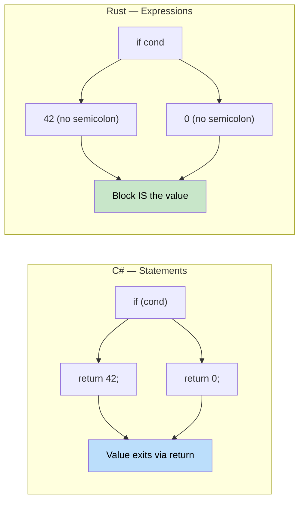

## Functions vs Methods<br><span class="zh-inline">函数与方法</span>

> **What you'll learn:** Functions and methods in Rust vs C#, the critical distinction between expressions and statements, `if`/`match`/`loop`/`while`/`for` syntax, and how Rust's expression-oriented design eliminates the need for ternary operators.<br><span class="zh-inline">**本章将学到什么：** Rust 和 C# 在函数、方法上的区别，表达式与语句这组极关键概念，`if` / `match` / `loop` / `while` / `for` 的基本语法，以及为什么 Rust 的表达式导向设计让三元运算符变得没有必要。</span>
>
> **Difficulty:** 🟢 Beginner<br><span class="zh-inline">**难度：** 🟢 入门</span>

### C# Function Declaration<br><span class="zh-inline">C# 的函数声明方式</span>

```csharp
// C# - Methods in classes
public class Calculator
{
    // Instance method
    public int Add(int a, int b)
    {
        return a + b;
    }
    
    // Static method
    public static int Multiply(int a, int b)
    {
        return a * b;
    }
    
    // Method with ref parameter
    public void Increment(ref int value)
    {
        value++;
    }
}
```

在 C# 里，大部分行为都挂在类上。实例方法、静态方法、`ref` 参数，这些东西对 C# 开发者来说已经是肌肉记忆。<br><span class="zh-inline">到了 Rust，这套结构会被拆得更开一些：既有独立函数，也有绑定在 `impl` 块里的方法。</span>

### Rust Function Declaration<br><span class="zh-inline">Rust 的函数声明方式</span>

```rust
// Rust - Standalone functions
fn add(a: i32, b: i32) -> i32 {
    a + b  // No 'return' needed for final expression
}

fn multiply(a: i32, b: i32) -> i32 {
    return a * b;  // Explicit return is also fine
}

// Function with mutable reference
fn increment(value: &mut i32) {
    *value += 1;
}

fn main() {
    let result = add(5, 3);
    println!("5 + 3 = {}", result);
    
    let mut x = 10;
    increment(&mut x);
    println!("After increment: {}", x);
}
```

Rust 里独立函数是一等公民，不需要先塞进类里才能存在。方法则放在 `impl TypeName` 里。<br><span class="zh-inline">另外，`&mut i32` 这种写法也值得注意，它和 C# 的 `ref` 有一点像，但本质上更接近“显式可变借用”。</span>

### Expression vs Statement (Important!)<br><span class="zh-inline">表达式与语句的区别，这个很重要</span>



```csharp
// C# - Statements vs expressions
public int GetValue()
{
    if (condition)
    {
        return 42;  // Statement
    }
    return 0;       // Statement
}
```

```rust
// Rust - Everything can be an expression
fn get_value(condition: bool) -> i32 {
    if condition {
        42  // Expression (no semicolon)
    } else {
        0   // Expression (no semicolon)
    }
    // The if-else block itself is an expression that returns a value
}

// Or even simpler
fn get_value_ternary(condition: bool) -> i32 {
    if condition { 42 } else { 0 }
}
```

这就是 Rust 入门阶段最容易突然“咯噔”一下的地方。`if` 在 Rust 里不只是控制流程，它还能直接产出值。<br><span class="zh-inline">也正因为如此，Rust 根本不需要单独再设计一个三元运算符。`if ... else ...` 自己就是表达式，而且通常更清楚。</span>

### Function Parameters and Return Types<br><span class="zh-inline">函数参数与返回值</span>

```rust
// No parameters, no return value (returns unit type ())
fn say_hello() {
    println!("Hello!");
}

// Multiple parameters
fn greet(name: &str, age: u32) {
    println!("{} is {} years old", name, age);
}

// Multiple return values using tuple
fn divide_and_remainder(dividend: i32, divisor: i32) -> (i32, i32) {
    (dividend / divisor, dividend % divisor)
}

fn main() {
    let (quotient, remainder) = divide_and_remainder(10, 3);
    println!("10 ÷ 3 = {} remainder {}", quotient, remainder);
}
```

Rust 在返回多个值时不会先催着去定义个类或者 struct，元组就能先顶上。<br><span class="zh-inline">当然，如果这些返回值有明确业务语义，后续还是更推荐换成具名结构体，代码可读性会更好。</span>

***

## Control Flow Basics<br><span class="zh-inline">控制流基础</span>

### Conditional Statements<br><span class="zh-inline">条件语句</span>

```csharp
// C# if statements
int x = 5;
if (x > 10)
{
    Console.WriteLine("Big number");
}
else if (x > 5)
{
    Console.WriteLine("Medium number");
}
else
{
    Console.WriteLine("Small number");
}

// C# ternary operator
string message = x > 10 ? "Big" : "Small";
```

```rust
// Rust if expressions
let x = 5;
if x > 10 {
    println!("Big number");
} else if x > 5 {
    println!("Medium number");
} else {
    println!("Small number");
}

// Rust if as expression (like ternary)
let message = if x > 10 { "Big" } else { "Small" };

// Multiple conditions
let message = if x > 10 {
    "Big"
} else if x > 5 {
    "Medium"
} else {
    "Small"
};
```

这里能明显看出 Rust 的表达式导向风格。`if` 既能控制流程，也能直接生成结果。<br><span class="zh-inline">只要每个分支返回的类型一致，就能把它赋值给变量，写法通常比三元表达式更平滑。</span>

### Loops<br><span class="zh-inline">循环</span>

```csharp
// C# loops
// For loop
for (int i = 0; i < 5; i++)
{
    Console.WriteLine(i);
}

// Foreach loop
var numbers = new[] { 1, 2, 3, 4, 5 };
foreach (var num in numbers)
{
    Console.WriteLine(num);
}

// While loop
int count = 0;
while (count < 3)
{
    Console.WriteLine(count);
    count++;
}
```

```rust
// Rust loops
// Range-based for loop
for i in 0..5 {  // 0 to 4 (exclusive end)
    println!("{}", i);
}

// Iterate over collection
let numbers = vec![1, 2, 3, 4, 5];
for num in numbers {  // Takes ownership
    println!("{}", num);
}

// Iterate over references (more common)
let numbers = vec![1, 2, 3, 4, 5];
for num in &numbers {  // Borrows elements
    println!("{}", num);
}

// While loop
let mut count = 0;
while count < 3 {
    println!("{}", count);
    count += 1;
}

// Infinite loop with break
let mut counter = 0;
loop {
    if counter >= 3 {
        break;
    }
    println!("{}", counter);
    counter += 1;
}
```

Rust 的 `for` 背后其实是基于迭代器的，这和 C# `foreach` 的精神很接近。但要特别注意所有权语义：`for num in numbers` 会消耗集合，`for num in &numbers` 才是借用遍历。<br><span class="zh-inline">这也是 Rust 新手常见失误点之一，循环一跑完，发现原集合被 move 走了，然后一脸问号。</span>

### Loop Control<br><span class="zh-inline">循环控制</span>

```csharp
// C# loop control
for (int i = 0; i < 10; i++)
{
    if (i == 3) continue;
    if (i == 7) break;
    Console.WriteLine(i);
}
```

```rust
// Rust loop control
for i in 0..10 {
    if i == 3 { continue; }
    if i == 7 { break; }
    println!("{}", i);
}

// Loop labels (for nested loops)
'outer: for i in 0..3 {
    'inner: for j in 0..3 {
        if i == 1 && j == 1 {
            break 'outer;  // Break out of outer loop
        }
        println!("i: {}, j: {}", i, j);
    }
}
```

循环标签是 Rust 里一个很实用但很多语言不常见的东西。嵌套循环里想直接跳出外层，不用手搓布尔标志位，也不用额外包函数，给循环贴个标签就行。<br><span class="zh-inline">写复杂状态机或搜索逻辑时，这招挺省心。</span>

***

<details>
<summary><strong>🏋️ Exercise: Temperature Converter</strong> <span class="zh-inline">🏋️ 练习：温度转换器</span></summary>

**Challenge**: Convert this C# program to idiomatic Rust. Use expressions, pattern matching, and proper error handling.<br><span class="zh-inline">**挑战题：** 把下面这段 C# 程序翻成惯用 Rust，尽量用表达式风格、模式匹配和合适的错误处理。</span>

```csharp
// C# — convert this to Rust
public static double Convert(double value, string from, string to)
{
    double celsius = from switch
    {
        "F" => (value - 32.0) * 5.0 / 9.0,
        "K" => value - 273.15,
        "C" => value,
        _ => throw new ArgumentException($"Unknown unit: {from}")
    };
    return to switch
    {
        "F" => celsius * 9.0 / 5.0 + 32.0,
        "K" => celsius + 273.15,
        "C" => celsius,
        _ => throw new ArgumentException($"Unknown unit: {to}")
    };
}
```

<details>
<summary>🔑 Solution <span class="zh-inline">🔑 参考答案</span></summary>

```rust
#[derive(Debug, Clone, Copy)]
enum TempUnit { Celsius, Fahrenheit, Kelvin }

fn parse_unit(s: &str) -> Result<TempUnit, String> {
    match s {
        "C" => Ok(TempUnit::Celsius),
        "F" => Ok(TempUnit::Fahrenheit),
        "K" => Ok(TempUnit::Kelvin),
        _   => Err(format!("Unknown unit: {s}")),
    }
}

fn convert(value: f64, from: TempUnit, to: TempUnit) -> f64 {
    let celsius = match from {
        TempUnit::Fahrenheit => (value - 32.0) * 5.0 / 9.0,
        TempUnit::Kelvin     => value - 273.15,
        TempUnit::Celsius    => value,
    };
    match to {
        TempUnit::Fahrenheit => celsius * 9.0 / 5.0 + 32.0,
        TempUnit::Kelvin     => celsius + 273.15,
        TempUnit::Celsius    => celsius,
    }
}

fn main() -> Result<(), String> {
    let from = parse_unit("F")?;
    let to   = parse_unit("C")?;
    println!("212°F = {:.1}°C", convert(212.0, from, to));
    Ok(())
}
```

**Key takeaways**:<br><span class="zh-inline">**关键点：**</span>

- Enums replace magic strings — exhaustive matching catches missing units at compile time<br><span class="zh-inline">枚举替代魔法字符串，`match` 穷尽匹配能在编译期抓到遗漏分支。</span>
- `Result<T, E>` replaces exceptions — the caller sees possible failures in the signature<br><span class="zh-inline">`Result<T, E>` 取代异常，调用方能从函数签名里直接看见可能失败。</span>
- `match` is an expression that returns a value — no `return` statements needed<br><span class="zh-inline">`match` 本身就是返回值表达式，不需要层层 `return`。</span>

</details>
</details>
