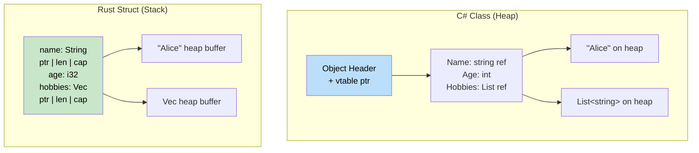

## Tuples and Destructuring<br><span class="zh-inline">元组与解构</span>

> **What you'll learn:** Rust tuples compared with C# `ValueTuple`, arrays and slices, structs versus classes, the newtype pattern for zero-cost domain safety, and destructuring syntax.<br><span class="zh-inline">**本章将学到什么：** 对照理解 Rust 元组和 C# `ValueTuple`，理解数组、切片、struct 与 class 的差异，掌握 newtype 模式怎样以零成本提供领域类型安全，并熟悉解构语法。</span>
>
> **Difficulty:** 🟢 Beginner<br><span class="zh-inline">**难度：** 🟢 入门</span>

C# has `ValueTuple`, and Rust tuples feel familiar at first glance, but Rust pushes tuples and destructuring much deeper into the language.<br><span class="zh-inline">C# 从 `ValueTuple` 开始，已经让元组变得比较顺手；Rust 则把元组和解构进一步揉进了语言核心，所以后面会反复遇到它们。</span>

### C# Tuples<br><span class="zh-inline">C# 元组</span>

```csharp
// C# ValueTuple (C# 7+)
var point = (10, 20);                         // (int, int)
var named = (X: 10, Y: 20);                   // Named elements
Console.WriteLine($"{named.X}, {named.Y}");

// Tuple as return type
public (int Quotient, int Remainder) Divide(int a, int b)
{
    return (a / b, a % b);
}

var (q, r) = Divide(10, 3);    // Deconstruction
Console.WriteLine($"{q} remainder {r}");

// Discards
var (_, remainder) = Divide(10, 3);  // Ignore quotient
```

### Rust Tuples<br><span class="zh-inline">Rust 元组</span>

```rust
// Rust tuples — immutable by default, no named elements
let point = (10, 20);                // (i32, i32)
let point3d: (f64, f64, f64) = (1.0, 2.0, 3.0);

// Access by index (0-based)
println!("x={}, y={}", point.0, point.1);

// Tuple as return type
fn divide(a: i32, b: i32) -> (i32, i32) {
    (a / b, a % b)
}

let (q, r) = divide(10, 3);       // Destructuring
println!("{q} remainder {r}");

// Discards with _
let (_, remainder) = divide(10, 3);

// Unit type () — the "empty tuple" (like C# void)
fn greet() {          // implicit return type is ()
    println!("hi");
}
```

Rust 元组最大的区别，就是它没给字段名留位置。<br><span class="zh-inline">所以只要元组开始承载“有语义的业务字段”，就该警觉是不是该换成 struct 了。元组适合临时组合，struct 适合长期表达。</span>

### Key Differences<br><span class="zh-inline">关键差异</span>

| Feature<br><span class="zh-inline">特性</span> | C# `ValueTuple` | Rust Tuple |
|---------|-----------------|------------|
| Named elements<br><span class="zh-inline">命名字段</span> | `(int X, int Y)`<br><span class="zh-inline">支持命名元素</span> | Not supported, use structs<br><span class="zh-inline">不支持命名，语义化需求请上 struct</span> |
| Max arity<br><span class="zh-inline">最大元数</span> | Around 8 before nesting<br><span class="zh-inline">大约 8 个后要靠嵌套</span> | No practical language limit for common use<br><span class="zh-inline">语言层面更宽松，但一般别写太长</span> |
| Comparisons<br><span class="zh-inline">比较</span> | Automatic<br><span class="zh-inline">自动支持</span> | Automatic for common tuple sizes<br><span class="zh-inline">常见长度自动支持</span> |
| Used as dict key<br><span class="zh-inline">用作字典键</span> | Yes<br><span class="zh-inline">可以</span> | Yes, if elements implement `Hash`<br><span class="zh-inline">可以，但元素要能 `Hash`</span> |
| Return from functions<br><span class="zh-inline">函数返回值</span> | Common<br><span class="zh-inline">常见</span> | Common<br><span class="zh-inline">也很常见</span> |
| Mutable elements<br><span class="zh-inline">元素可变性</span> | Depends on surrounding variable usage<br><span class="zh-inline">取决于变量本身</span> | Entire binding is immutable unless `mut`<br><span class="zh-inline">默认不可变，除非显式 `mut`</span> |

### Tuple Structs (Newtypes)<br><span class="zh-inline">元组结构体与 Newtype</span>

```rust
// When a plain tuple isn't descriptive enough, use a tuple struct:
struct Meters(f64);     // Single-field "newtype" wrapper
struct Celsius(f64);
struct Fahrenheit(f64);

// The compiler treats these as DIFFERENT types:
let distance = Meters(100.0);
let temp = Celsius(36.6);
// distance == temp;  // ❌ ERROR: can't compare Meters with Celsius

// Newtype pattern prevents unit-confusion bugs at compile time!
// In C# you'd need a full class/struct for the same safety.
```

```csharp
// C# equivalent requires more ceremony:
public readonly record struct Meters(double Value);
public readonly record struct Celsius(double Value);
// Not interchangeable, but records add overhead vs Rust's zero-cost newtypes
```

`newtype` 是 Rust 做领域建模时非常锋利的一把刀。<br><span class="zh-inline">它看起来只是“外面套一层壳”，实际上是在编译期把不同语义强行分开，避免把米、摄氏度、用户 ID、端口号这类东西混用。</span>

### The Newtype Pattern in Depth: Domain Modeling with Zero Cost<br><span class="zh-inline">进一步理解 Newtype：零成本的领域建模</span>

Newtypes do much more than prevent unit confusion. They are one of Rust's primary tools for encoding business rules into types instead of repeating runtime validation everywhere.<br><span class="zh-inline">Newtype 不只是防止单位混用，它更大的价值在于：把业务规则直接编码进类型里，而不是把校验逻辑散落到每一个调用点。</span>

#### C# Validation Approach: Runtime Guards<br><span class="zh-inline">C# 常见做法：运行时 Guard</span>

```csharp
// C# — validation happens at runtime, every time
public class UserService
{
    public User CreateUser(string email, int age)
    {
        if (string.IsNullOrWhiteSpace(email) || !email.Contains('@'))
            throw new ArgumentException("Invalid email");
        if (age < 0 || age > 150)
            throw new ArgumentException("Invalid age");

        return new User { Email = email, Age = age };
    }

    public void SendEmail(string email)
    {
        // Must re-validate — or trust the caller?
        if (!email.Contains('@')) throw new ArgumentException("Invalid email");
        // ...
    }
}
```

#### Rust Newtype Approach: Compile-Time Proof<br><span class="zh-inline">Rust 的 Newtype 做法：编译期证明</span>

```rust
/// A validated email address — the type itself IS the proof of validity.
#[derive(Debug, Clone, PartialEq, Eq, Hash)]
pub struct Email(String);

impl Email {
    /// The ONLY way to create an Email — validation happens once at construction.
    pub fn new(raw: &str) -> Result<Self, &'static str> {
        if raw.contains('@') && raw.len() > 3 {
            Ok(Email(raw.to_lowercase()))
        } else {
            Err("invalid email format")
        }
    }

    /// Safe access to the inner value
    pub fn as_str(&self) -> &str { &self.0 }
}

/// A validated age — impossible to create an invalid one.
#[derive(Debug, Clone, Copy, PartialEq, Eq, PartialOrd, Ord)]
pub struct Age(u8);

impl Age {
    pub fn new(raw: u8) -> Result<Self, &'static str> {
        if raw <= 150 { Ok(Age(raw)) } else { Err("age out of range") }
    }
    pub fn value(&self) -> u8 { self.0 }
}

// Now functions take PROVEN types — no re-validation needed!
fn create_user(email: Email, age: Age) -> User {
    // email is GUARANTEED valid — it's a type invariant
    User { email, age }
}

fn send_email(to: &Email) {
    // No validation needed — Email type proves validity
    println!("Sending to: {}", to.as_str());
}
```

#### Common Newtype Uses for C# Developers<br><span class="zh-inline">C# 开发者常见的 Newtype 用法</span>

| C# Pattern<br><span class="zh-inline">C# 里的常见问题</span> | Rust Newtype<br><span class="zh-inline">对应的 Rust Newtype</span> | What It Prevents<br><span class="zh-inline">能防住什么</span> |
|------------|-------------|------------------|
| `string` for UserId, Email, etc.<br><span class="zh-inline">各种 ID 和邮箱全用 `string`</span> | `struct UserId(Uuid)`<br><span class="zh-inline">`struct UserId(Uuid)`</span> | Passing the wrong string to the wrong parameter<br><span class="zh-inline">把错误字符串传给错误参数</span> |
| `int` for Port, Count, Index<br><span class="zh-inline">端口、数量、索引都混用 `int`</span> | `struct Port(u16)`<br><span class="zh-inline">`struct Port(u16)`</span> | Prevents semantically unrelated ints from混用<br><span class="zh-inline">避免语义不同的整数混在一起</span> |
| Guard clauses everywhere<br><span class="zh-inline">到处写 guard 校验</span> | Constructor validation once<br><span class="zh-inline">构造时统一校验一次</span> | Re-validation and missed validation<br><span class="zh-inline">重复校验或漏校验</span> |
| `decimal` for USD, EUR<br><span class="zh-inline">货币值都用同一个 `decimal`</span> | `struct Usd(Decimal)`<br><span class="zh-inline">`struct Usd(Decimal)`</span> | Stops currency mix-ups<br><span class="zh-inline">防止美元欧元随手相加</span> |
| `TimeSpan` for different semantics<br><span class="zh-inline">各种超时全用 `TimeSpan`</span> | `struct Timeout(Duration)`<br><span class="zh-inline">`struct Timeout(Duration)`</span> | Avoids mixing connection and request timeouts<br><span class="zh-inline">避免连接超时和请求超时混用</span> |

```rust
// Zero-cost: newtypes compile to the same assembly as the inner type.
// This Rust code:
struct UserId(u64);
fn lookup(id: UserId) -> Option<User> { /* ... */ }

// Generates the SAME machine code as:
fn lookup(id: u64) -> Option<User> { /* ... */ }
// But with full type safety at compile time!
```

这就是 Rust 喜欢把正确性做进类型里的味道。<br><span class="zh-inline">不是靠“记得调用 Validate()”，而是靠“没有合法类型就根本过不了接口”。这两者的可靠度差得不是一点半点。</span>

***

## Arrays and Slices<br><span class="zh-inline">数组与切片</span>

Understanding arrays, slices, and vectors separately is crucial. They solve different problems and Rust keeps the distinctions explicit.<br><span class="zh-inline">数组、切片、向量这三样东西一定要拆开理解。它们解决的是不同层次的问题，而 Rust 正是故意把这种区别写得很明白。</span>

### C# Arrays<br><span class="zh-inline">C# 数组</span>

```csharp
// C# arrays
int[] numbers = new int[5];         // Fixed size, heap allocated
int[] initialized = { 1, 2, 3, 4, 5 }; // Array literal

// Access
numbers[0] = 10;
int first = numbers[0];

// Length
int length = numbers.Length;

// Array as parameter (reference type)
void ProcessArray(int[] array)
{
    array[0] = 99;  // Modifies original
}
```

### Rust Arrays, Slices, and Vectors<br><span class="zh-inline">Rust 的数组、切片与向量</span>

```rust
// 1. Arrays - Fixed size, stack allocated
let numbers: [i32; 5] = [1, 2, 3, 4, 5];  // Type: [i32; 5]
let zeros = [0; 10];                       // 10 zeros

// Access
let first = numbers[0];
// numbers[0] = 10;  // ❌ Error: arrays are immutable by default

let mut mut_array = [1, 2, 3, 4, 5];
mut_array[0] = 10;  // ✅ Works with mut

// 2. Slices - Views into arrays or vectors
let slice: &[i32] = &numbers[1..4];  // Elements 1, 2, 3
let all_slice: &[i32] = &numbers;    // Entire array as slice

// 3. Vectors - Dynamic size, heap allocated (covered earlier)
let mut vec = vec![1, 2, 3, 4, 5];
vec.push(6);  // Can grow
```

切片 `&[T]` 这玩意一定要尽快熟。<br><span class="zh-inline">它不是独立拥有数据的集合，而只是“对一段连续元素的借用视图”。很多更通用、更优雅的函数签名，最后都会落在切片上。</span>

### Slices as Function Parameters<br><span class="zh-inline">把切片作为函数参数</span>

```csharp
// C# - Method that works with arrays
public void ProcessNumbers(int[] numbers)
{
    for (int i = 0; i < numbers.Length; i++)
    {
        Console.WriteLine(numbers[i]);
    }
}

// Works with arrays only
ProcessNumbers(new int[] { 1, 2, 3 });
```

```rust
// Rust - Function that works with any sequence
fn process_numbers(numbers: &[i32]) {  // Slice parameter
    for (i, num) in numbers.iter().enumerate() {
        println!("Index {}: {}", i, num);
    }
}

fn main() {
    let array = [1, 2, 3, 4, 5];
    let vec = vec![1, 2, 3, 4, 5];
    
    // Same function works with both!
    process_numbers(&array);      // Array as slice
    process_numbers(&vec);        // Vector as slice
    process_numbers(&vec[1..4]);  // Partial slice
}
```

这就是为什么 Rust 社区老爱说“参数尽量收切片”。<br><span class="zh-inline">因为一旦签成 `&[T]`，数组、向量、子区间都能复用；签死成 `Vec<T>` 反而会把接口绑窄，还平白无故多出所有权要求。</span>

### String Slices (`&str`) Revisited<br><span class="zh-inline">再次回到字符串切片 `&str`</span>

```rust
// String and &str relationship
fn string_slice_example() {
    let owned = String::from("Hello, World!");
    let slice: &str = &owned[0..5];      // "Hello"
    let slice2: &str = &owned[7..];      // "World!"
    
    println!("{}", slice);   // "Hello"
    println!("{}", slice2);  // "World!"
    
    // Function that accepts any string type
    print_string("String literal");      // &str
    print_string(&owned);               // String as &str
    print_string(slice);                // &str slice
}

fn print_string(s: &str) {
    println!("{}", s);
}
```

字符串切片本质上也是切片思想在文本上的体现。<br><span class="zh-inline">所以前面搞懂了普通切片，再回头看 `&str` 就会舒服很多：它不是神秘特例，只是 UTF-8 文本上的借用视图。</span>

***

## Structs vs Classes<br><span class="zh-inline">Struct 与 Class 对照</span>

Structs in Rust fill many of the roles that classes cover in C#, but the storage model and method system differ quite a bit.<br><span class="zh-inline">Rust 的 struct 能覆盖 C# class 很多职责，但它们在存储方式、所有权和方法组织上差异不小，别简单拿“Rust 的 struct 就是 C# 的 class”去硬套。</span>



> **Key insight**: C# classes always live on the heap behind references. Rust structs live on the stack by default, while dynamically-sized internals such as `String` buffers or `Vec` contents live on the heap.<br><span class="zh-inline">**关键理解：** C# 的 class 一般总是在堆上，再通过引用访问；Rust 的 struct 默认值本体在栈上，只有像 `String`、`Vec` 这种内部动态数据缓冲区才放到堆里。</span>

### C# Class Definition<br><span class="zh-inline">C# 类定义</span>

```csharp
// C# class with properties and methods
public class Person
{
    public string Name { get; set; }
    public int Age { get; set; }
    public List<string> Hobbies { get; set; }
    
    public Person(string name, int age)
    {
        Name = name;
        Age = age;
        Hobbies = new List<string>();
    }
    
    public void AddHobby(string hobby)
    {
        Hobbies.Add(hobby);
    }
    
    public string GetInfo()
    {
        return $"{Name} is {Age} years old";
    }
}
```

### Rust Struct Definition<br><span class="zh-inline">Rust Struct 定义</span>

```rust
// Rust struct with associated functions and methods
#[derive(Debug)]  // Automatically implement Debug trait
pub struct Person {
    pub name: String,    // Public field
    pub age: u32,        // Public field
    hobbies: Vec<String>, // Private field (no pub)
}

impl Person {
    // Associated function (like static method)
    pub fn new(name: String, age: u32) -> Person {
        Person {
            name,
            age,
            hobbies: Vec::new(),
        }
    }
    
    // Method (takes &self, &mut self, or self)
    pub fn add_hobby(&mut self, hobby: String) {
        self.hobbies.push(hobby);
    }
    
    // Method that borrows immutably
    pub fn get_info(&self) -> String {
        format!("{} is {} years old", self.name, self.age)
    }
    
    // Getter for private field
    pub fn hobbies(&self) -> &Vec<String> {
        &self.hobbies
    }
}
```

Rust struct 没有那种“默认 public 属性 + 默认 getter/setter”的味道。<br><span class="zh-inline">字段是否公开、方法是否允许修改内部状态，都得明确写出来。代码会更啰嗦一点，但边界也会更清楚。</span>

### Creating and Using Instances<br><span class="zh-inline">创建并使用实例</span>

```csharp
// C# object creation and usage
var person = new Person("Alice", 30);
person.AddHobby("Reading");
person.AddHobby("Swimming");

Console.WriteLine(person.GetInfo());
Console.WriteLine($"Hobbies: {string.Join(", ", person.Hobbies)}");

// Modify properties directly
person.Age = 31;
```

```rust
// Rust struct creation and usage
let mut person = Person::new("Alice".to_string(), 30);
person.add_hobby("Reading".to_string());
person.add_hobby("Swimming".to_string());

println!("{}", person.get_info());
println!("Hobbies: {:?}", person.hobbies());

// Modify public fields directly
person.age = 31;

// Debug print the entire struct
println!("{:?}", person);
```

### Struct Initialization Patterns<br><span class="zh-inline">Struct 初始化方式</span>

```csharp
// C# object initialization
var person = new Person("Bob", 25)
{
    Hobbies = new List<string> { "Gaming", "Coding" }
};

// Anonymous types
var anonymous = new { Name = "Charlie", Age = 35 };
```

```rust
// Rust struct initialization
let person = Person {
    name: "Bob".to_string(),
    age: 25,
    hobbies: vec!["Gaming".to_string(), "Coding".to_string()],
};

// Struct update syntax (like object spread)
let older_person = Person {
    age: 26,
    ..person  // Use remaining fields from person (moves person!)
};

// Tuple structs (like anonymous types)
#[derive(Debug)]
struct Point(i32, i32);

let point = Point(10, 20);
println!("Point: ({}, {})", point.0, point.1);
```

结构体更新语法 `..person` 很方便，但它会 move 剩余字段。<br><span class="zh-inline">这东西好用归好用，脑子里一定得记住：一旦源值里有非 `Copy` 字段，被搬走以后原变量通常就不能再用。</span>

***

## Methods and Associated Functions<br><span class="zh-inline">方法与关联函数</span>

Understanding the difference between methods and associated functions is essential because Rust uses receiver types explicitly.<br><span class="zh-inline">方法和关联函数的区别一定要搞清楚，因为 Rust 会把“这个函数到底如何接收实例”写在签名里，不给模糊空间。</span>

### C# Method Types<br><span class="zh-inline">C# 里的方法类型</span>

```csharp
public class Calculator
{
    private int memory = 0;
    
    // Instance method
    public int Add(int a, int b)
    {
        return a + b;
    }
    
    // Instance method that uses state
    public void StoreInMemory(int value)
    {
        memory = value;
    }
    
    // Static method
    public static int Multiply(int a, int b)
    {
        return a * b;
    }
    
    // Static factory method
    public static Calculator CreateWithMemory(int initialMemory)
    {
        var calc = new Calculator();
        calc.memory = initialMemory;
        return calc;
    }
}
```

### Rust Method Types<br><span class="zh-inline">Rust 里的方法类型</span>

```rust
#[derive(Debug)]
pub struct Calculator {
    memory: i32,
}

impl Calculator {
    // Associated function (like static method) - no self parameter
    pub fn new() -> Calculator {
        Calculator { memory: 0 }
    }
    
    // Associated function with parameters
    pub fn with_memory(initial_memory: i32) -> Calculator {
        Calculator { memory: initial_memory }
    }
    
    // Method that borrows immutably (&self)
    pub fn add(&self, a: i32, b: i32) -> i32 {
        a + b
    }
    
    // Method that borrows mutably (&mut self)
    pub fn store_in_memory(&mut self, value: i32) {
        self.memory = value;
    }
    
    // Method that takes ownership (self)
    pub fn into_memory(self) -> i32 {
        self.memory  // Calculator is consumed
    }
    
    // Getter method
    pub fn memory(&self) -> i32 {
        self.memory
    }
}

fn main() {
    // Associated functions called with ::
    let mut calc = Calculator::new();
    let calc2 = Calculator::with_memory(42);
    
    // Methods called with .
    let result = calc.add(5, 3);
    calc.store_in_memory(result);
    
    println!("Memory: {}", calc.memory());
    
    // Consuming method
    let memory_value = calc.into_memory();  // calc is no longer usable
    println!("Final memory: {}", memory_value);
}
```

Rust 把接收者写得很实在：`&self`、`&mut self`、`self`。<br><span class="zh-inline">只要看见签名，就能知道这个方法是只读、可改，还是会直接把整个对象吃掉。这种清晰度后面会越来越值钱。</span>

### Method Receiver Types Explained<br><span class="zh-inline">方法接收者类型说明</span>

```rust
impl Person {
    // &self - Immutable borrow (most common)
    // Use when you only need to read the data
    pub fn get_name(&self) -> &str {
        &self.name
    }
    
    // &mut self - Mutable borrow
    // Use when you need to modify the data
    pub fn set_name(&mut self, name: String) {
        self.name = name;
    }
    
    // self - Take ownership (less common)
    // Use when you want to consume the struct
    pub fn consume(self) -> String {
        self.name  // Person is moved, no longer accessible
    }
}

fn method_examples() {
    let mut person = Person::new("Alice".to_string(), 30);
    
    // Immutable borrow
    let name = person.get_name();  // person can still be used
    println!("Name: {}", name);
    
    // Mutable borrow
    person.set_name("Alice Smith".to_string());  // person can still be used
    
    // Taking ownership
    let final_name = person.consume();  // person is no longer usable
    println!("Final name: {}", final_name);
}
```

一旦把这三种 receiver 想成“看一下”“改一下”“拿走整个对象”，很多 API 设计会自然很多。<br><span class="zh-inline">这套方式虽然比 C# 更显式，但恰恰因为显式，调用方更不容易踩坑。</span>

---

## Exercises<br><span class="zh-inline">练习</span>

<details>
<summary><strong>🏋️ Exercise: Slice Window Average</strong><br><span class="zh-inline"><strong>🏋️ 练习：切片滑动平均</strong></span></summary>

**Challenge**: Write a function that takes a slice of `f64` values and a window size, then returns a `Vec<f64>` of rolling averages. Example: `[1.0, 2.0, 3.0, 4.0, 5.0]` with window `3` should become `[2.0, 3.0, 4.0]`.<br><span class="zh-inline">**挑战：** 写一个函数，接收一段 `f64` 切片和窗口大小，返回滑动平均值构成的 `Vec<f64>`。例如 `[1.0, 2.0, 3.0, 4.0, 5.0]` 配窗口 `3`，结果应为 `[2.0, 3.0, 4.0]`。</span>

```rust
fn rolling_average(data: &[f64], window: usize) -> Vec<f64> {
    // Your implementation here
    todo!()
}

fn main() {
    let data = vec![1.0, 2.0, 3.0, 4.0, 5.0];
    let avgs = rolling_average(&data, 3);
    println!("{avgs:?}"); // [2.0, 3.0, 4.0]
}
```

<details>
<summary>🔑 Solution<br><span class="zh-inline">🔑 参考答案</span></summary>

```rust
fn rolling_average(data: &[f64], window: usize) -> Vec<f64> {
    data.windows(window)
        .map(|w| w.iter().sum::<f64>() / w.len() as f64)
        .collect()
}

fn main() {
    let data = vec![1.0, 2.0, 3.0, 4.0, 5.0];
    let avgs = rolling_average(&data, 3);
    assert_eq!(avgs, vec![2.0, 3.0, 4.0]);
    println!("{avgs:?}");
}
```

**Key takeaway**: Slices already provide methods like `.windows()`, `.chunks()`, and `.split()`, which often replace manual index arithmetic entirely.<br><span class="zh-inline">**这一题最该记住的点：** 切片本身已经有很多很好用的方法，比如 `.windows()`、`.chunks()`、`.split()`，很多时候根本没必要自己写一坨下标计算。</span>

</details>
</details>

<details>
<summary><strong>🏋️ Exercise: Mini Address Book</strong><br><span class="zh-inline"><strong>🏋️ 练习：迷你通讯录</strong></span></summary>

Build a small address book using structs, enums, and methods:<br><span class="zh-inline">用 struct、enum 和方法写一个小通讯录，要求如下：</span>

1. Define an enum `PhoneType { Mobile, Home, Work }`.<br><span class="zh-inline">定义枚举 `PhoneType { Mobile, Home, Work }`。</span>
2. Define a struct `Contact` with `name: String` and `phones: Vec<(PhoneType, String)>`.<br><span class="zh-inline">定义 `Contact` 结构体，包含 `name: String` 和 `phones: Vec<(PhoneType, String)>`。</span>
3. Implement `Contact::new(name: impl Into<String>) -> Self`.<br><span class="zh-inline">实现 `Contact::new(name: impl Into<String>) -> Self`。</span>
4. Implement `Contact::add_phone(&mut self, kind: PhoneType, number: impl Into<String>)`.<br><span class="zh-inline">实现 `Contact::add_phone(&mut self, kind: PhoneType, number: impl Into<String>)`。</span>
5. Implement `Contact::mobile_numbers(&self) -> Vec<&str>` that returns only mobile numbers.<br><span class="zh-inline">实现 `Contact::mobile_numbers(&self) -> Vec<&str>`，只返回手机号。</span>
6. In `main`, create a contact, add two phones, and print the mobile numbers.<br><span class="zh-inline">在 `main` 里创建联系人，添加两个号码，再打印手机号。</span>

<details>
<summary>🔑 Solution<br><span class="zh-inline">🔑 参考答案</span></summary>

```rust
#[derive(Debug, PartialEq)]
enum PhoneType { Mobile, Home, Work }

#[derive(Debug)]
struct Contact {
    name: String,
    phones: Vec<(PhoneType, String)>,
}

impl Contact {
    fn new(name: impl Into<String>) -> Self {
        Contact { name: name.into(), phones: Vec::new() }
    }

    fn add_phone(&mut self, kind: PhoneType, number: impl Into<String>) {
        self.phones.push((kind, number.into()));
    }

    fn mobile_numbers(&self) -> Vec<&str> {
        self.phones
            .iter()
            .filter(|(kind, _)| *kind == PhoneType::Mobile)
            .map(|(_, num)| num.as_str())
            .collect()
    }
}

fn main() {
    let mut alice = Contact::new("Alice");
    alice.add_phone(PhoneType::Mobile, "+1-555-0100");
    alice.add_phone(PhoneType::Work, "+1-555-0200");
    alice.add_phone(PhoneType::Mobile, "+1-555-0101");

    println!("{}'s mobile numbers: {:?}", alice.name, alice.mobile_numbers());
}
```

</details>
</details>

***
