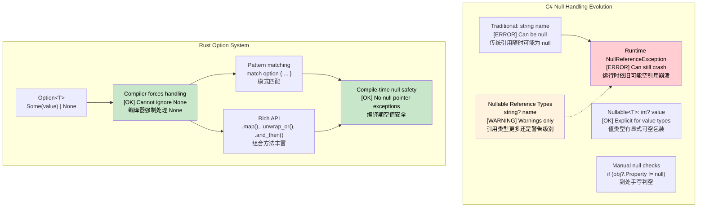

```mermaid
graph TD
    subgraph "C# Pattern Matching Limitations"
        CS_SWITCH["switch expression<br/>switch 表达式"]
        CS_WARNING["⚠️ Compiler warnings only<br/>多数只是警告"]
        CS_COMPILE["✅ Compiles successfully<br/>照样能编译"]
        CS_RUNTIME["💥 Runtime exceptions<br/>运行时炸锅"]
        CS_DEPLOY["❌ Bugs reach production<br/>缺陷进生产"]
        CS_SILENT["😰 Silent failures on enum changes<br/>enum 变化时静悄悄漏处理"]
        
        CS_SWITCH --> CS_WARNING
        CS_WARNING --> CS_COMPILE
        CS_COMPILE --> CS_RUNTIME
        CS_RUNTIME --> CS_DEPLOY
        CS_SWITCH --> CS_SILENT
    end
    
    subgraph "Rust Exhaustive Matching"
        RUST_MATCH["match expression<br/>match 表达式"]
        RUST_ERROR["🛑 Compilation fails<br/>直接编译失败"]
        RUST_FIX["✅ Must handle all cases<br/>必须补齐分支"]
        RUST_SAFE["✅ Zero runtime surprises<br/>运行时意外更少"]
        RUST_EVOLUTION["🔄 Enum changes break compilation<br/>类型演化会触发编译错误"]
        RUST_REFACTOR["🛠️ Forced refactoring<br/>被迫做完整重构修补"]
        
        RUST_MATCH --> RUST_ERROR
        RUST_ERROR --> RUST_FIX
        RUST_FIX --> RUST_SAFE
        RUST_MATCH --> RUST_EVOLUTION
        RUST_EVOLUTION --> RUST_REFACTOR
    end
    
    style CS_RUNTIME fill:#ffcdd2,color:#000
    style CS_DEPLOY fill:#ffcdd2,color:#000
    style CS_SILENT fill:#ffcdd2,color:#000
    style RUST_SAFE fill:#c8e6c9,color:#000
    style RUST_REFACTOR fill:#c8e6c9,color:#000
```

## Exhaustive Pattern Matching: Compiler Guarantees vs Runtime Errors<br><span class="zh-inline">穷尽模式匹配：编译器保证与运行时错误的对照</span>

> **What you'll learn:** Why C# `switch` expressions can still miss cases while Rust `match` catches missing branches at compile time, how `Option<T>` differs from `Nullable<T>` for null safety, and how custom `Result<T, E>` error types fit into the same model.<br><span class="zh-inline">**本章将学到什么：** 理解为什么 C# 的 `switch` 表达式依旧可能漏分支，而 Rust 的 `match` 会在编译期把缺漏揪出来；同时对照 `Option<T>` 与 `Nullable<T>` 的空值安全思路，并看清自定义 `Result<T, E>` 错误类型怎样和这套模型接起来。</span>
>
> **Difficulty:** 🟡 Intermediate<br><span class="zh-inline">**难度：** 🟡 进阶</span>

### C# Switch Expressions - Still Incomplete<br><span class="zh-inline">C# `switch` 表达式：看着全，实际上未必全</span>

```csharp
// C# switch expressions look exhaustive but aren't guaranteed
public enum HttpStatus { Ok, NotFound, ServerError, Unauthorized }

public string HandleResponse(HttpStatus status) => status switch
{
    HttpStatus.Ok => "Success",
    HttpStatus.NotFound => "Resource not found",
    HttpStatus.ServerError => "Internal error",
    // Missing Unauthorized case — compiles with warning CS8524, but NOT an error!
    // Runtime: SwitchExpressionException if status is Unauthorized
};

// Even with nullable warnings, this compiles:
public class User 
{
    public string Name { get; set; }
    public bool IsActive { get; set; }
}

public string ProcessUser(User? user) => user switch
{
    { IsActive: true } => $"Active: {user.Name}",
    { IsActive: false } => $"Inactive: {user.Name}",
    // Missing null case — compiler warning CS8655, but NOT an error!
    // Runtime: SwitchExpressionException when user is null
};
```

```csharp
// Adding an enum variant later doesn't break compilation of existing switches
public enum HttpStatus 
{ 
    Ok, 
    NotFound, 
    ServerError, 
    Unauthorized,
    Forbidden  // Adding this produces another CS8524 warning but doesn't break compilation!
}
```

### Rust Pattern Matching - True Exhaustiveness<br><span class="zh-inline">Rust 模式匹配：真正的穷尽检查</span>

```rust
#[derive(Debug)]
enum HttpStatus {
    Ok,
    NotFound, 
    ServerError,
    Unauthorized,
}

fn handle_response(status: HttpStatus) -> &'static str {
    match status {
        HttpStatus::Ok => "Success",
        HttpStatus::NotFound => "Resource not found", 
        HttpStatus::ServerError => "Internal error",
        HttpStatus::Unauthorized => "Authentication required",
        // Compiler ERROR if any case is missing!
        // This literally will not compile
    }
}

// Adding a new variant breaks compilation everywhere it's used
#[derive(Debug)]
enum HttpStatus {
    Ok,
    NotFound,
    ServerError, 
    Unauthorized,
    Forbidden,  // Adding this breaks compilation in handle_response()
}
// The compiler forces you to handle ALL cases

// Option<T> pattern matching is also exhaustive
fn process_optional_value(value: Option<i32>) -> String {
    match value {
        Some(n) => format!("Got value: {}", n),
        None => "No value".to_string(),
        // Forgetting either case = compilation error
    }
}
```

Rust 在这里最硬核的一点，就是“新增分支以后，旧代码必须跟着改”。<br><span class="zh-inline">这件事在某些人眼里像麻烦，但其实是大礼。因为类型一旦演化，编译器会把所有受影响的位置全翻出来，不让隐藏 bug 悄悄混进生产环境。</span>



***

## Null Safety: `Nullable<T>` vs `Option<T>`<br><span class="zh-inline">空值安全：`Nullable<T>` 与 `Option<T>` 对照</span>

### C# Null Handling Evolution<br><span class="zh-inline">C# 空值处理的演进</span>

```csharp
// C# - Traditional null handling (error-prone)
public class User
{
    public string Name { get; set; }  // Can be null!
    public string Email { get; set; } // Can be null!
}
```

```csharp
public string GetUserDisplayName(User user)
{
    if (user?.Name != null)  // Null conditional operator
    {
        return user.Name;
    }
    return "Unknown User";
}

// C# 8+ Nullable Reference Types
public class User
{
    public string Name { get; set; }    // Non-nullable
    public string? Email { get; set; }  // Explicitly nullable
}

// C# Nullable<T> for value types
int? maybeNumber = GetNumber();
if (maybeNumber.HasValue)
{
    Console.WriteLine(maybeNumber.Value);
}
```

### Rust `Option<T>` System<br><span class="zh-inline">Rust 的 `Option<T>` 体系</span>

```rust
// Rust - Explicit null handling with Option<T>
#[derive(Debug)]
pub struct User {
    name: String,           // Never null
    email: Option<String>,  // Explicitly optional
}

impl User {
    pub fn get_display_name(&self) -> &str {
        &self.name  // No null check needed - guaranteed to exist
    }
    
    pub fn get_email_or_default(&self) -> String {
        self.email
            .as_ref()
            .map(|e| e.clone())
            .unwrap_or_else(|| "no-email@example.com".to_string())
    }
}

// Pattern matching forces handling of None case
fn handle_optional_user(user: Option<User>) {
    match user {
        Some(u) => println!("User: {}", u.get_display_name()),
        None => println!("No user found"),
        // Compiler error if None case is not handled!
    }
}
```

Rust 的思路是：与其让所有引用都默认可能为空，再靠规则提醒开发者小心，不如把“可选”这件事直接写进类型里。<br><span class="zh-inline">于是 `Option<T>` 不是语言边角料，而是到处都能接得上的核心建模工具。只要类型写成 `Option<T>`，调用方就得面对 `None`，躲不过去。</span>



***

```rust
#[derive(Debug)]
struct Point {
    x: i32,
    y: i32,
}

fn describe_point(point: Point) -> String {
    match point {
        Point { x: 0, y: 0 } => "origin".to_string(),
        Point { x: 0, y } => format!("on y-axis at y={}", y),
        Point { x, y: 0 } => format!("on x-axis at x={}", x),
        Point { x, y } if x == y => format!("on diagonal at ({}, {})", x, y),
        Point { x, y } => format!("point at ({}, {})", x, y),
    }
}
```

这个例子说明 `match` 不只是枚举专属。<br><span class="zh-inline">结构体、元组、常量、范围、守卫条件都能一起上。很多“数据结构长什么样”和“当前逻辑该怎么分支”之间的关系，写在一处就讲明白了。</span>

### Option and Result Types<br><span class="zh-inline">`Option` 与 `Result` 类型</span>

```csharp
// C# nullable reference types (C# 8+)
public class PersonService
{
    private Dictionary<int, string> people = new();
    
    public string? FindPerson(int id)
    {
        return people.TryGetValue(id, out string? name) ? name : null;
    }
    
    public string GetPersonOrDefault(int id)
    {
        return FindPerson(id) ?? "Unknown";
    }
    
    // Exception-based error handling
    public void SavePerson(int id, string name)
    {
        if (string.IsNullOrEmpty(name))
            throw new ArgumentException("Name cannot be empty");
        
        people[id] = name;
    }
}
```

```rust
use std::collections::HashMap;

// Rust uses Option<T> instead of null
struct PersonService {
    people: HashMap<i32, String>,
}

impl PersonService {
    fn new() -> Self {
        PersonService {
            people: HashMap::new(),
        }
    }
    
    // Returns Option<T> - no null!
    fn find_person(&self, id: i32) -> Option<&String> {
        self.people.get(&id)
    }
    
    // Pattern matching on Option
    fn get_person_or_default(&self, id: i32) -> String {
        match self.find_person(id) {
            Some(name) => name.clone(),
            None => "Unknown".to_string(),
        }
    }
    
    // Using Option methods (more functional style)
    fn get_person_or_default_functional(&self, id: i32) -> String {
        self.find_person(id)
            .map(|name| name.clone())
            .unwrap_or_else(|| "Unknown".to_string())
    }
    
    // Result<T, E> for error handling
    fn save_person(&mut self, id: i32, name: String) -> Result<(), String> {
        if name.is_empty() {
            return Err("Name cannot be empty".to_string());
        }
        
        self.people.insert(id, name);
        Ok(())
    }
    
    // Chaining operations
    fn get_person_length(&self, id: i32) -> Option<usize> {
        self.find_person(id).map(|name| name.len())
    }
}

fn main() {
    let mut service = PersonService::new();
    
    // Handle Result
    match service.save_person(1, "Alice".to_string()) {
        Ok(()) => println!("Person saved successfully"),
        Err(error) => println!("Error: {}", error),
    }
    
    // Handle Option
    match service.find_person(1) {
        Some(name) => println!("Found: {}", name),
        None => println!("Person not found"),
    }
    
    // Functional style with Option
    let name_length = service.get_person_length(1)
        .unwrap_or(0);
    println!("Name length: {}", name_length);
    
    // Question mark operator for early returns
    fn try_operation(service: &mut PersonService) -> Result<String, String> {
        service.save_person(2, "Bob".to_string())?; // Early return if error
        let name = service.find_person(2).ok_or("Person not found")?; // Convert Option to Result
        Ok(format!("Hello, {}", name))
    }
    
    match try_operation(&mut service) {
        Ok(message) => println!("{}", message),
        Err(error) => println!("Operation failed: {}", error),
    }
}
```

`Option` 和 `Result` 这对组合拳几乎贯穿 Rust 日常。<br><span class="zh-inline">前者表达“可能没有值”，后者表达“可能失败而且要说明原因”。很多 API 一眼看过去就能知道：这里到底是查不到、还是执行失败，这比把所有问题都塞进异常或 `null` 里干净得多。</span>

### Custom Error Types<br><span class="zh-inline">自定义错误类型</span>

```rust
// Define custom error enum
#[derive(Debug)]
enum PersonError {
    NotFound(i32),
    InvalidName(String),
    DatabaseError(String),
}

impl std::fmt::Display for PersonError {
    fn fmt(&self, f: &mut std::fmt::Formatter<'_>) -> std::fmt::Result {
        match self {
            PersonError::NotFound(id) => write!(f, "Person with ID {} not found", id),
            PersonError::InvalidName(name) => write!(f, "Invalid name: '{}'", name),
            PersonError::DatabaseError(msg) => write!(f, "Database error: {}", msg),
        }
    }
}

impl std::error::Error for PersonError {}

// Enhanced PersonService with custom errors
impl PersonService {
    fn save_person_enhanced(&mut self, id: i32, name: String) -> Result<(), PersonError> {
        if name.is_empty() || name.len() > 50 {
            return Err(PersonError::InvalidName(name));
        }
        
        // Simulate database operation that might fail
        if id < 0 {
            return Err(PersonError::DatabaseError("Negative IDs not allowed".to_string()));
        }
        
        self.people.insert(id, name);
        Ok(())
    }
    
    fn find_person_enhanced(&self, id: i32) -> Result<&String, PersonError> {
        self.people.get(&id).ok_or(PersonError::NotFound(id))
    }
}

fn demo_error_handling() {
    let mut service = PersonService::new();
    
    // Handle different error types
    match service.save_person_enhanced(-1, "Invalid".to_string()) {
        Ok(()) => println!("Success"),
        Err(PersonError::NotFound(id)) => println!("Not found: {}", id),
        Err(PersonError::InvalidName(name)) => println!("Invalid name: {}", name),
        Err(PersonError::DatabaseError(msg)) => println!("DB Error: {}", msg),
    }
}
```

一旦业务稍微复杂一点，就别再一直 `Result<T, String>` 糊弄了。<br><span class="zh-inline">自定义错误枚举会让错误来源、语义、展示方式都清清楚楚，后面无论是日志、重试、分类处理还是接口返回，都更好拿捏。</span>

---

## Exercises<br><span class="zh-inline">练习</span>

<details>
<summary><strong>🏋️ Exercise: Option Combinators</strong><br><span class="zh-inline"><strong>🏋️ 练习：`Option` 组合器</strong></span></summary>

Rewrite this deeply nested C# null-checking code using Rust `Option` combinators such as `and_then`, `map`, and `unwrap_or`:<br><span class="zh-inline">把下面这段层层判空的 C# 代码，改写成 Rust 的 `Option` 组合器写法，例如 `and_then`、`map`、`unwrap_or`：</span>

```csharp
string GetCityName(User? user)
{
    if (user != null)
        if (user.Address != null)
            if (user.Address.City != null)
                return user.Address.City.ToUpper();
    return "UNKNOWN";
}
```

Use these Rust types:<br><span class="zh-inline">使用下面这两个 Rust 类型：</span>

```rust
struct User { address: Option<Address> }
struct Address { city: Option<String> }
```

Write it as a **single expression** with no `if let` or `match`.<br><span class="zh-inline">要求写成**单个表达式**，不要用 `if let` 和 `match`。</span>

<details>
<summary>🔑 Solution<br><span class="zh-inline">🔑 参考答案</span></summary>

```rust
struct User { address: Option<Address> }
struct Address { city: Option<String> }

fn get_city_name(user: Option<&User>) -> String {
    user.and_then(|u| u.address.as_ref())
        .and_then(|a| a.city.as_ref())
        .map(|c| c.to_uppercase())
        .unwrap_or_else(|| "UNKNOWN".to_string())
}

fn main() {
    let user = User {
        address: Some(Address { city: Some("seattle".to_string()) }),
    };
    assert_eq!(get_city_name(Some(&user)), "SEATTLE");
    assert_eq!(get_city_name(None), "UNKNOWN");

    let no_city = User { address: Some(Address { city: None }) };
    assert_eq!(get_city_name(Some(&no_city)), "UNKNOWN");
}
```

**Key insight**: `and_then` in `Option` chains plays a role similar to repeatedly applying C#'s null-conditional flow, but in a fully explicit and type-checked way. Each step can stop at `None`, and the whole chain short-circuits safely.<br><span class="zh-inline">**关键理解：** `Option` 链里的 `and_then` 很像把 C# 的 `?.` 一层层显式展开。每一步都可能停在 `None`，整条链会自然短路，而且这种短路是类型系统明明白白写出来的，不是靠运气。</span>

</details>
</details>

***
