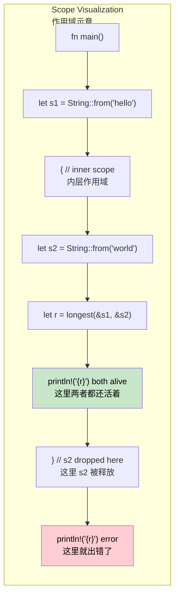

## Lifetimes: Telling the Compiler How Long References Live<br><span class="zh-inline">生命周期：告诉编译器引用能活多久</span>

> **What you'll learn:** Why lifetimes exist, how lifetime annotation syntax works, what elision rules do for you, how structs borrow data, what `'static` really means, and how to fix common borrow checker errors.<br><span class="zh-inline">**本章将学到什么：** 生命周期为什么存在，生命周期标注语法怎么读，省略规则替人做了什么，结构体借用数据时该怎么写，`'static` 真正表示什么，以及几类常见借用检查器报错该怎么修。</span>
>
> **Difficulty:** 🔴 Advanced<br><span class="zh-inline">**难度：** 🔴 高级</span>

C# developers almost never think about the lifetime of a reference. The garbage collector tracks reachability and keeps objects alive as needed. Rust has no GC, so the compiler needs proof that every reference is valid for as long as it is used. Lifetimes are that proof.<br><span class="zh-inline">写 C# 的时候，几乎不会盯着“某个引用到底还能活多久”这种问题发愁。GC 会追踪可达性，能活多久它自己兜着。Rust 没有 GC，所以编译器必须提前拿到证据，确认每个引用在被使用期间始终有效。生命周期就是这份证据。</span>

### Why Lifetimes Exist<br><span class="zh-inline">为什么会有生命周期</span>

```rust
// This won't compile — the compiler can't prove the returned reference is valid
fn longest(a: &str, b: &str) -> &str {
    if a.len() > b.len() { a } else { b }
}
// ERROR: missing lifetime specifier
// The compiler does not know whether the output borrows from `a` or `b`
```

The function body is obvious to a human, but not to the compiler. Returning a reference means Rust must know which input that output is tied to. Without that relationship being stated, the compiler refuses to guess.<br><span class="zh-inline">这段函数对人来说很直白，但对编译器来说还差关键信息。只要返回的是引用，Rust 就必须知道这个输出到底和哪个输入绑在一起。这个关系没写清楚，编译器就不会替代码瞎猜。</span>

### Lifetime Annotations<br><span class="zh-inline">生命周期标注</span>

```rust
// Lifetime 'a says: the returned reference lives at least as long as both inputs
fn longest<'a>(a: &'a str, b: &'a str) -> &'a str {
    if a.len() > b.len() { a } else { b }
}

fn main() {
    let result;
    let string1 = String::from("long string");
    {
        let string2 = String::from("xyz");
        result = longest(&string1, &string2);
        println!("Longest: {result}"); // both references still valid here
    }
    // println!("{result}"); // ERROR: string2 doesn't live long enough
}
```

The annotation does not extend any lifetime. It only describes the relationship: the returned reference cannot outlive the shorter of the two inputs.<br><span class="zh-inline">这个标注不会凭空把什么东西“续命”。它只是描述关系：返回值绝对不会比两个输入里更短的那个活得更久。</span>

### C# Comparison<br><span class="zh-inline">和 C# 的对照</span>

```csharp
// C# — GC keeps objects alive while references remain reachable
string Longest(string a, string b) => a.Length > b.Length ? a : b;

// No lifetime annotations needed
// But also no compile-time proof about borrowing relationships
```

### Lifetime Elision Rules<br><span class="zh-inline">生命周期省略规则</span>

Most of the time, explicit lifetime annotations are not needed because the compiler applies three elision rules automatically:<br><span class="zh-inline">大多数时候，其实不用手写生命周期，因为编译器会自动应用三条省略规则：</span>

| Rule<br><span class="zh-inline">规则</span> | Description<br><span class="zh-inline">含义</span> | Example<br><span class="zh-inline">示例</span> |
|------|-------------|---------|
| **Rule 1** | Each reference parameter gets its own lifetime.<br><span class="zh-inline">每个引用参数先拿到一个独立生命周期。</span> | `fn foo(x: &str, y: &str)` -> `fn foo<'a, 'b>(x: &'a str, y: &'b str)` |
| **Rule 2** | If there is exactly one input lifetime, it is assigned to every output lifetime.<br><span class="zh-inline">如果只有一个输入生命周期，就把它分配给所有输出生命周期。</span> | `fn first(s: &str) -> &str` -> `fn first<'a>(s: &'a str) -> &'a str` |
| **Rule 3** | If one input is `&self` or `&mut self`, that lifetime is assigned to all outputs.<br><span class="zh-inline">如果某个输入是 `&self` 或 `&mut self`，输出默认绑定到它的生命周期。</span> | `fn name(&self) -> &str` |

```rust
// Equivalent — the compiler inserts lifetimes automatically
fn first_word(s: &str) -> &str { /* ... */ }           // elided
fn first_word<'a>(s: &'a str) -> &'a str { /* ... */ } // explicit

// But this requires explicit annotation — two inputs, one borrowed output
fn longest<'a>(a: &'a str, b: &'a str) -> &'a str { /* ... */ }
```

### Struct Lifetimes<br><span class="zh-inline">结构体里的生命周期</span>

```rust
// A struct that borrows data rather than owning it
struct Excerpt<'a> {
    text: &'a str,
}

impl<'a> Excerpt<'a> {
    fn new(text: &'a str) -> Self {
        Excerpt { text }
    }

    fn first_sentence(&self) -> &str {
        self.text.split('.').next().unwrap_or(self.text)
    }
}

fn main() {
    let novel = String::from("Call me Ishmael. Some years ago...");
    let excerpt = Excerpt::new(&novel);
    println!("First sentence: {}", excerpt.first_sentence());
}
```

```csharp
class Excerpt
{
    public string Text { get; }
    public Excerpt(string text) => Text = text;
    public string FirstSentence() => Text.Split('.')[0];
}
```

A struct that stores references must always carry explicit lifetime parameters. There is no elision shortcut for stored borrows, because the compiler needs the relationship written directly into the type.<br><span class="zh-inline">只要结构体里存的是引用，就一定得显式带生命周期参数。这里没有什么省略捷径，因为编译器需要把这种借用关系直接写进类型本身。</span>

### The `'static` Lifetime<br><span class="zh-inline">`'static` 生命周期</span>

```rust
// 'static means the value can remain valid for the entire program
let s: &'static str = "I'm a string literal";

// Common places you see 'static:
// 1. string literals
// 2. global constants
// 3. thread::spawn closures
std::thread::spawn(move || {
    println!("{s}");
});

// 'static does NOT mean "magically immortal"
let owned = String::from("hello");
// owned is not 'static, but it can be moved into a thread
```

`'static` is easy to overuse. It does not mean “make this live forever.” It means “this value is valid for as long as the whole program could need it.” Many values do not need that constraint, and forcing `'static` where it is unnecessary usually makes APIs worse.<br><span class="zh-inline">`'static` 特别容易被滥用。它不是“把这个东西变成永生”，而是“这个值在整个程序期间都可以保持有效”。很多值根本不需要这么强的约束，没事硬塞一个 `'static`，通常只会把 API 搞得更别扭。</span>

### Common Borrow Checker Errors and Fixes<br><span class="zh-inline">常见借用检查器报错与修法</span>

| Error<br><span class="zh-inline">报错</span> | Cause<br><span class="zh-inline">原因</span> | Fix<br><span class="zh-inline">处理方式</span> |
|-------|-------|-----|
| `missing lifetime specifier` | Multiple input references but ambiguous output borrow.<br><span class="zh-inline">多个输入引用，输出借用关系不明确。</span> | Add `<'a>` and tie the output to the correct input.<br><span class="zh-inline">加上 `<'a>`，把输出和正确的输入绑起来。</span> |
| `does not live long enough` | The reference outlives the data it points to.<br><span class="zh-inline">引用活得比它指向的数据还久。</span> | Extend the owner's scope or return owned data instead.<br><span class="zh-inline">扩大所有者作用域，或者改成返回拥有型数据。</span> |
| `cannot borrow as mutable` | An immutable borrow is still active.<br><span class="zh-inline">不可变借用还没结束，又想拿可变借用。</span> | Consume the immutable borrow earlier or重构代码顺序。<br><span class="zh-inline">先结束前面的不可变借用，或者重构代码顺序。</span> |
| `cannot move out of borrowed content` | Attempting to take ownership from borrowed data.<br><span class="zh-inline">想从借用数据里把所有权硬拿出来。</span> | Clone when appropriate, or redesign ownership flow.<br><span class="zh-inline">必要时复制，或者重新设计所有权流向。</span> |
| `lifetime may not live long enough` | A borrowed struct outlives its source data.<br><span class="zh-inline">借用型结构体比源数据活得更久。</span> | Ensure the source outlives the struct's use.<br><span class="zh-inline">保证源数据的作用域覆盖结构体使用期。</span> |

### Visualizing Lifetime Scopes<br><span class="zh-inline">把生命周期作用域画出来</span>



### Multiple Lifetime Parameters<br><span class="zh-inline">多个生命周期参数</span>

Sometimes inputs come from different sources and should not be forced to share the same lifetime:<br><span class="zh-inline">有些时候，多个输入来自不同来源，本来就不该被强行绑成同一个生命周期：</span>

```rust
// Two independent lifetimes: output borrows only from 'a
fn first_with_context<'a, 'b>(data: &'a str, _context: &'b str) -> &'a str {
    data.split(',').next().unwrap_or(data)
}

fn main() {
    let data = String::from("alice,bob,charlie");
    let result;
    {
        let context = String::from("user lookup");
        result = first_with_context(&data, &context);
    }
    println!("{result}");
}
```

```csharp
string FirstWithContext(string data, string context) => data.Split(',')[0];
```

Rust can express “the output borrows from A but not from B” directly in the type signature. GC languages usually do not need to express that relationship, but they also cannot prove it statically.<br><span class="zh-inline">Rust 可以把“输出借用自 A，但和 B 没关系”这种信息直接写进类型签名。GC 语言通常不需要表达这种关系，但也因此无法在编译期证明它。</span>

### Real-World Lifetime Patterns<br><span class="zh-inline">真实代码里的生命周期模式</span>

**Pattern 1: Iterator returning references**<br><span class="zh-inline">**模式 1：返回引用的迭代结果**</span>

```rust
struct CsvRow<'a> {
    fields: Vec<&'a str>,
}

fn parse_csv_line(line: &str) -> CsvRow<'_> {
    CsvRow {
        fields: line.split(',').collect(),
    }
}
```

**Pattern 2: Return owned when in doubt**<br><span class="zh-inline">**模式 2：拿不准就先返回拥有型数据**</span>

```rust
fn format_greeting(first: &str, last: &str) -> String {
    format!("Hello, {first} {last}!")
}

// Borrow only when:
// 1. allocation cost matters
// 2. the lifetime relationship is clear
```

**Pattern 3: Lifetime bounds on generics**<br><span class="zh-inline">**模式 3：泛型上的生命周期约束**</span>

```rust
fn store_reference<'a, T: 'a>(cache: &mut Vec<&'a T>, item: &'a T) {
    cache.push(item);
}

fn make_printer<'a>(text: &'a str) -> Box<dyn std::fmt::Display + 'a> {
    Box::new(text)
}
```

### When to Reach for `'static`<br><span class="zh-inline">什么时候才该用 `'static`</span>

| Scenario<br><span class="zh-inline">场景</span> | Use `'static`?<br><span class="zh-inline">要不要用 `'static`</span> | Alternative<br><span class="zh-inline">替代方案</span> |
|----------|:-----------:|-------------|
| String literals<br><span class="zh-inline">字符串字面量</span> | ✅ Yes<br><span class="zh-inline">是</span> | — |
| `thread::spawn` closure<br><span class="zh-inline">`thread::spawn` 闭包</span> | Often<br><span class="zh-inline">经常需要</span> | Use `thread::scope` for borrowed data<br><span class="zh-inline">借用数据时可改用 `thread::scope`</span> |
| Global config<br><span class="zh-inline">全局配置</span> | ✅ Often<br><span class="zh-inline">通常需要</span> | Pass references explicitly<br><span class="zh-inline">把引用显式传下去</span> |
| Long-lived trait objects<br><span class="zh-inline">长期保存的 trait object</span> | Often<br><span class="zh-inline">经常需要</span> | Parameterize the container with `'a`<br><span class="zh-inline">给容器也带上 `'a` 参数</span> |
| Temporary borrowing<br><span class="zh-inline">临时借用</span> | ❌ No<br><span class="zh-inline">不要</span> | Use the actual lifetime<br><span class="zh-inline">使用真实生命周期</span> |

<details>
<summary><strong>🏋️ Exercise: Lifetime Annotations</strong> <span class="zh-inline">🏋️ 练习：补全生命周期标注</span></summary>

**Challenge**: Add the correct lifetime annotations to make the following code compile.<br><span class="zh-inline">**挑战题：** 给下面这段代码补上正确的生命周期标注，让它可以编译。</span>

```rust
struct Config {
    db_url: String,
    api_key: String,
}

// TODO: Add lifetime annotations
fn get_connection_info(config: &Config) -> (&str, &str) {
    (&config.db_url, &config.api_key)
}

// TODO: This struct borrows from Config — add lifetime parameter
struct ConnectionInfo {
    db_url: &str,
    api_key: &str,
}
```

<details>
<summary>🔑 Solution <span class="zh-inline">🔑 参考答案</span></summary>

```rust
struct Config {
    db_url: String,
    api_key: String,
}

// Rule 2 applies: one input lifetime is assigned to outputs
fn get_connection_info(config: &Config) -> (&str, &str) {
    (&config.db_url, &config.api_key)
}

struct ConnectionInfo<'a> {
    db_url: &'a str,
    api_key: &'a str,
}

fn make_info<'a>(config: &'a Config) -> ConnectionInfo<'a> {
    ConnectionInfo {
        db_url: &config.db_url,
        api_key: &config.api_key,
    }
}
```

**Key takeaway**: Functions often benefit from lifetime elision, but structs storing borrowed data always need explicit lifetime parameters.<br><span class="zh-inline">**要点：** 函数很多时候可以吃到生命周期省略规则的红利，但只要结构体里存了借用数据，就必须显式写出生命周期参数。</span>

</details>
</details>

***
