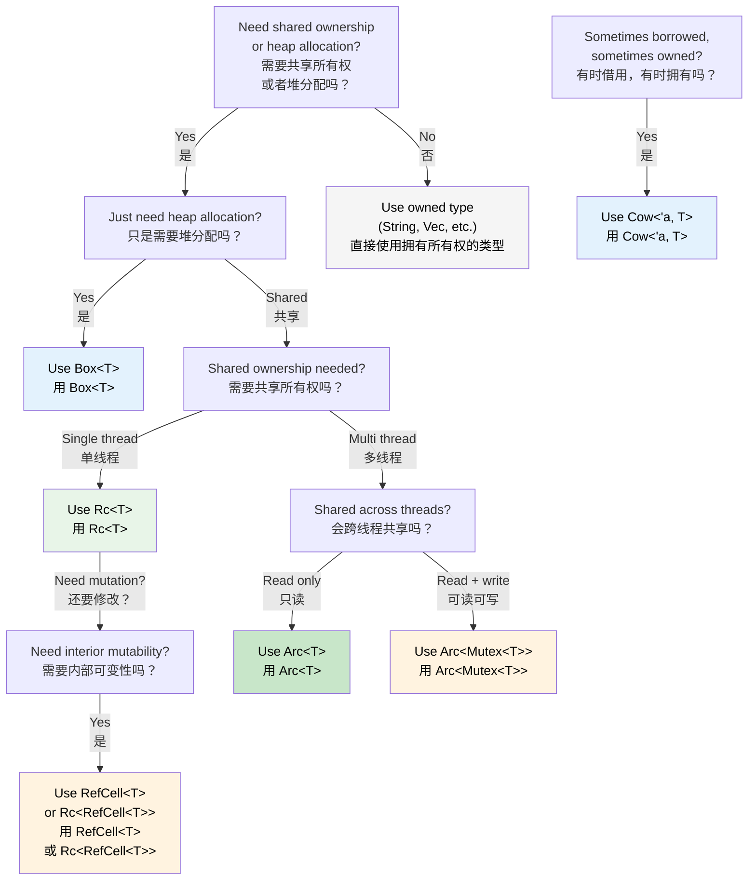

## Smart Pointers: When Single Ownership Isn't Enough<br><span class="zh-inline">智能指针：当单一所有权已经不够用时</span>

> **What you'll learn:** `Box<T>`, `Rc<T>`, `Arc<T>`, `Cell<T>`, `RefCell<T>`, and `Cow<'a, T>` — when to use each, how they compare to C#'s GC-managed references, `Drop` as Rust's `IDisposable`, `Deref` coercion, and a decision tree for choosing the right smart pointer.<br><span class="zh-inline">**本章将学到什么：** `Box<T>`、`Rc<T>`、`Arc<T>`、`Cell<T>`、`RefCell<T>` 和 `Cow<'a, T>` 各自该在什么场景使用，它们和 C# 垃圾回收引用的差别，`Drop` 如何对应 Rust 里的 `IDisposable` 思想，什么是 `Deref` 强制解引用，以及如何用决策树挑对智能指针。</span>
>
> **Difficulty:** 🔴 Advanced<br><span class="zh-inline">**难度：** 🔴 高级</span>

In C#, almost every object is effectively managed through GC-backed references. In Rust, single ownership is the default. But once shared ownership, heap allocation, or interior mutability enters the picture, smart pointers become the real toolset.<br><span class="zh-inline">在 C# 里，几乎所有对象最终都托管在 GC 管理的引用体系下。Rust 则把单一所有权当默认模型。一旦碰到共享所有权、堆分配或者内部可变性，智能指针这一套家伙才算正式上场。</span>

### Box&lt;T&gt; — Simple Heap Allocation<br><span class="zh-inline">`Box<T>`：最直接的堆分配</span>

```rust
// Stack allocation (default in Rust)
let x = 42;           // on the stack

// Heap allocation with Box
let y = Box::new(42); // on the heap, like C# `new int(42)` (boxed)
println!("{}", y);    // auto-derefs: prints 42

// Common use: recursive types (can't know size at compile time)
#[derive(Debug)]
enum List {
    Cons(i32, Box<List>),  // Box gives a known pointer size
    Nil,
}

let list = List::Cons(1, Box::new(List::Cons(2, Box::new(List::Nil))));
```

```csharp
// C# — everything on the heap already (reference types)
// Box<T> is only needed in Rust because stack is the default
var list = new LinkedListNode<int>(1);  // always heap-allocated
```

### Rc&lt;T&gt; — Shared Ownership (Single Thread)<br><span class="zh-inline">`Rc<T>`：单线程共享所有权</span>

```rust
use std::rc::Rc;

// Multiple owners of the same data — like multiple C# references
let shared = Rc::new(vec![1, 2, 3]);
let clone1 = Rc::clone(&shared); // reference count: 2
let clone2 = Rc::clone(&shared); // reference count: 3

println!("Count: {}", Rc::strong_count(&shared)); // 3
// Data is dropped when last Rc goes out of scope

// Common use: shared configuration, graph nodes, tree structures
```

### Arc&lt;T&gt; — Shared Ownership (Thread-Safe)<br><span class="zh-inline">`Arc<T>`：线程安全的共享所有权</span>

```rust
use std::sync::Arc;
use std::thread;

// Arc = Atomic Reference Counting — safe to share across threads
let data = Arc::new(vec![1, 2, 3]);

let handles: Vec<_> = (0..3).map(|i| {
    let data = Arc::clone(&data);
    thread::spawn(move || {
        println!("Thread {i}: {:?}", data);
    })
}).collect();

for h in handles { h.join().unwrap(); }
```

```csharp
// C# — all references are thread-safe by default (GC handles it)
var data = new List<int> { 1, 2, 3 };
// Can share freely across threads (but mutation is still unsafe!)
```

### Cell&lt;T&gt; and RefCell&lt;T&gt; — Interior Mutability<br><span class="zh-inline">`Cell<T>` 与 `RefCell<T>`：内部可变性</span>

```rust
use std::cell::RefCell;

// Sometimes you need to mutate data behind a shared reference.
// RefCell moves borrow checking from compile time to runtime.
struct Logger {
    entries: RefCell<Vec<String>>,
}

impl Logger {
    fn new() -> Self {
        Logger { entries: RefCell::new(Vec::new()) }
    }

    fn log(&self, msg: &str) { // &self, not &mut self!
        self.entries.borrow_mut().push(msg.to_string());
    }

    fn dump(&self) {
        for entry in self.entries.borrow().iter() {
            println!("{entry}");
        }
    }
}
// RefCell panics at runtime if borrow rules are violated
// Use sparingly — prefer compile-time checking when possible
```

`RefCell<T>` is the classic escape hatch when mutation has to happen behind `&self`. The trade-off is brutal and simple: compile-time guarantees are traded for runtime checks, and violations become panics.<br><span class="zh-inline">`RefCell<T>` 就是那种“明明手里只有 `&self`，但还非改不可”时的逃生门。代价也很直白：把原本的编译期保证换成运行时检查，一旦借用规则被破坏，程序就会 panic。</span>

### Cow&lt;'a, str&gt; — Clone on Write<br><span class="zh-inline">`Cow<'a, str>`：写时复制</span>

```rust
use std::borrow::Cow;

// Sometimes you have a &str that MIGHT need to become a String
fn normalize(input: &str) -> Cow<'_, str> {
    if input.contains('\t') {
        // Only allocate when we need to modify
        Cow::Owned(input.replace('\t', "    "))
    } else {
        // Borrow the original — zero allocation
        Cow::Borrowed(input)
    }
}

let clean = normalize("hello");           // Cow::Borrowed — no allocation
let dirty = normalize("hello\tworld");    // Cow::Owned — allocated
// Both can be used as &str via Deref
println!("{clean} / {dirty}");
```

### Drop: Rust's `IDisposable`<br><span class="zh-inline">`Drop`：Rust 里的 `IDisposable` 对应物</span>

In C#, `IDisposable` plus `using` takes care of resource cleanup. In Rust, the equivalent idea is the `Drop` trait, but the important distinction is that cleanup is automatic rather than opt-in.<br><span class="zh-inline">在 C# 里，资源回收往往靠 `IDisposable` 配合 `using`。Rust 里对应的是 `Drop` trait，但最大的差别在于：Rust 的清理是自动发生的，不需要额外记得去“进入某个模式”。</span>

```csharp
// C# — must remember to use 'using' or call Dispose()
using var file = File.OpenRead("data.bin");
// Dispose() called at end of scope

// Forgetting 'using' is a resource leak!
var file2 = File.OpenRead("data.bin");
// GC will eventually finalize, but timing is unpredictable
```

```rust
// Rust — Drop runs automatically when value goes out of scope
{
    let file = File::open("data.bin")?;
    // use file...
}   // file.drop() called HERE, deterministically — no 'using' needed

// Custom Drop (like implementing IDisposable)
struct TempFile {
    path: std::path::PathBuf,
}

impl Drop for TempFile {
    fn drop(&mut self) {
        // Guaranteed to run when TempFile goes out of scope
        let _ = std::fs::remove_file(&self.path);
        println!("Cleaned up {:?}", self.path);
    }
}

fn main() {
    let tmp = TempFile { path: "scratch.tmp".into() };
    // ... use tmp ...
}   // scratch.tmp deleted automatically here
```

**Key difference from C#:** In Rust, every type can have deterministic cleanup. Nothing relies on “remembering to call `Dispose` later”. Once the owner leaves scope, `Drop` runs. This is classic **RAII**.<br><span class="zh-inline">**和 C# 最大的差别：** 在 Rust 里，任何类型都可以拥有确定性的清理时机。不会再靠“回头记得调用 `Dispose`”这种人肉纪律。所有者一出作用域，`Drop` 就执行。这就是经典 **RAII**。</span>

> **Rule**: If a type owns a resource such as a file handle, network connection, lock guard, or temporary file, implement `Drop`. The ownership system guarantees it runs exactly once.<br><span class="zh-inline">**经验法则：** 只要类型里握着文件句柄、网络连接、锁守卫、临时文件这类资源，就该认真考虑 `Drop`。所有权系统会保证它只执行一次。</span>

### Deref Coercion: Automatic Smart Pointer Unwrapping<br><span class="zh-inline">`Deref` 强制解引用：自动拆开智能指针</span>

Rust automatically unwraps smart pointers when calling methods or passing values to functions. This is called **Deref coercion**.<br><span class="zh-inline">Rust 在调用方法和传参时，会自动帮忙拆开智能指针，这就叫 **Deref coercion**。</span>

```rust
let boxed: Box<String> = Box::new(String::from("hello"));

// Deref coercion chain: Box<String> -> String -> str
println!("Length: {}", boxed.len());   // calls str::len() — auto-deref!

fn greet(name: &str) {
    println!("Hello, {name}");
}

let s = String::from("Alice");
greet(&s);       // &String -> &str via Deref coercion
greet(&boxed);   // &Box<String> -> &String -> &str — two levels!
```

```csharp
// C# has no true equivalent
// The closest thing is user-defined implicit conversion operators
```

**Why this matters:** APIs can accept `&str` rather than `&String`, `&[T]` rather than `&Vec<T>`, and `&T` rather than `&Box<T>`. Call sites stay clean, and ownership details do not leak all over every function signature.<br><span class="zh-inline">**这为什么重要：** 这样 API 就能统一接收 `&str` 而不是 `&String`，接收 `&[T]` 而不是 `&Vec<T>`，接收 `&T` 而不是 `&Box<T>`。调用点更干净，所有权细节也不用污染每个函数签名。</span>

### Rc vs Arc: When to Use Which<br><span class="zh-inline">`Rc` 和 `Arc` 到底怎么选</span>

| | `Rc<T>` | `Arc<T>` |
|---|---|---|
| **Thread safety**<br><span class="zh-inline">线程安全</span> | ❌ Single-thread only<br><span class="zh-inline">仅单线程</span> | ✅ Thread-safe (atomic ops)<br><span class="zh-inline">线程安全，依赖原子操作</span> |
| **Overhead**<br><span class="zh-inline">开销</span> | Lower (non-atomic refcount)<br><span class="zh-inline">更低，引用计数不是原子的</span> | Higher (atomic refcount)<br><span class="zh-inline">更高，引用计数是原子的</span> |
| **Compiler enforced**<br><span class="zh-inline">编译器约束</span> | Won't compile across `thread::spawn`<br><span class="zh-inline">跨 `thread::spawn` 直接编不过</span> | Works everywhere appropriate<br><span class="zh-inline">该用的并发场景都能用</span> |
| **Combine with**<br><span class="zh-inline">常见搭配</span> | `RefCell<T>` for mutation<br><span class="zh-inline">需要改值时常配 `RefCell<T>`</span> | `Mutex<T>` or `RwLock<T>` for mutation<br><span class="zh-inline">需要改值时常配 `Mutex<T>` / `RwLock<T>`</span> |

**Rule of thumb:** Start with `Rc`. If the compiler complains that the value must cross threads or be `Send + Sync`, that is the signal to move to `Arc`.<br><span class="zh-inline">**简单经验：** 先从 `Rc` 开始。编译器一旦开始提醒“这玩意儿要跨线程”或者“需要 `Send + Sync`”，那就说明该上 `Arc` 了。</span>

### Decision Tree: Which Smart Pointer?<br><span class="zh-inline">决策树：到底该选哪个智能指针</span>



<details>
<summary><strong>🏋️ Exercise: Choose the Right Smart Pointer</strong> <span class="zh-inline">🏋️ 练习：给场景挑对智能指针</span></summary>

**Challenge**: For each scenario, choose the right smart pointer and explain the reason.<br><span class="zh-inline">**挑战题：** 针对下面每个场景，选出合适的智能指针，并说明原因。</span>

1. A recursive tree data structure<br><span class="zh-inline">1. 一个递归树结构。</span>
2. A shared configuration object read by multiple components in one thread<br><span class="zh-inline">2. 单线程中被多个组件读取的共享配置对象。</span>
3. A request counter shared across HTTP handler threads<br><span class="zh-inline">3. 在多个 HTTP 处理线程之间共享的请求计数器。</span>
4. A cache that may return borrowed or owned strings<br><span class="zh-inline">4. 一个可能返回借用字符串、也可能返回拥有型字符串的缓存。</span>
5. A logging buffer that needs mutation through a shared reference<br><span class="zh-inline">5. 一个需要通过共享引用进行修改的日志缓冲区。</span>

<details>
<summary>🔑 Solution <span class="zh-inline">🔑 参考答案</span></summary>

1. **`Box<T>`** — recursive types need indirection so the compiler can know the outer type's size.<br><span class="zh-inline">1. **`Box<T>`**：递归类型需要一层间接引用，编译器才能知道外层类型的大小。</span>
2. **`Rc<T>`** — read-only sharing in a single thread, with no need to pay for atomic refcounting.<br><span class="zh-inline">2. **`Rc<T>`**：单线程只读共享，用它就够了，没必要支付原子引用计数的额外成本。</span>
3. **`Arc<Mutex<u64>>`** — cross-thread sharing needs `Arc`，可变访问再加 `Mutex`。<br><span class="zh-inline">3. **`Arc<Mutex<u64>>`**：跨线程共享要 `Arc`，还要修改值，所以再套一层 `Mutex`。</span>
4. **`Cow<'a, str>`** — it can return `&str` on cache hit and `String` on cache miss without forcing allocation every time.<br><span class="zh-inline">4. **`Cow<'a, str>`**：命中缓存时直接借用，未命中时再分配 `String`，不用次次都硬分配。</span>
5. **`RefCell<Vec<String>>`** — it allows interior mutability behind `&self` in a single-threaded context.<br><span class="zh-inline">5. **`RefCell<Vec<String>>`**：在单线程环境下，它能让 `&self` 背后也完成内部可变性。</span>

**Rule of thumb:** Start with plain owned types. Reach for `Box` when indirection is required, `Rc` / `Arc` when sharing is required, `RefCell` / `Mutex` when mutation must happen behind shared access, and `Cow` when the common case should stay zero-copy.<br><span class="zh-inline">**经验法则：** 先从普通拥有型类型出发。需要间接层时上 `Box`，需要共享时上 `Rc` / `Arc`，需要在共享访问下修改值时上 `RefCell` / `Mutex`，想把常见路径维持成零拷贝时再考虑 `Cow`。</span>

</details>
</details>

***
