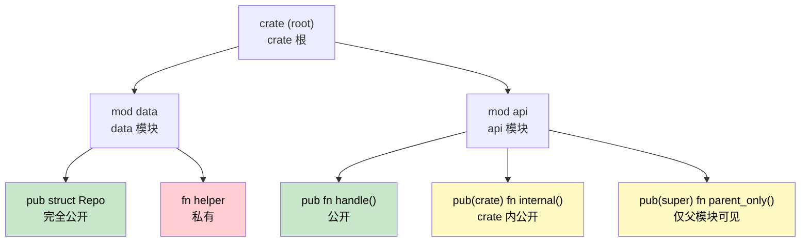

## Modules and Crates: Code Organization<br><span class="zh-inline">模块与 crate：代码组织方式</span>

> **What you'll learn:** Rust's module system vs C# namespaces and assemblies, `pub`/`pub(crate)`/`pub(super)` visibility, file-based module organization, and how crates map to .NET assemblies.<br><span class="zh-inline">**本章将学到什么：** Rust 的模块系统和 C# 命名空间、程序集之间的对应关系，`pub` / `pub(crate)` / `pub(super)` 这几种可见性，基于文件的模块组织方式，以及 crate 如何映射到 .NET 程序集。</span>
>
> **Difficulty:** 🟢 Beginner<br><span class="zh-inline">**难度：** 🟢 入门</span>

Understanding Rust's module system is essential for organizing code and managing dependencies. For C# developers, this is analogous to understanding namespaces, assemblies, and NuGet packages.<br><span class="zh-inline">想把 Rust 项目组织得顺，模块系统是绕不过去的。对 C# 开发者来说，可以把它类比成命名空间、程序集和 NuGet 包这几层概念叠在一起理解。</span>

### Rust Modules vs C# Namespaces<br><span class="zh-inline">Rust 模块与 C# 命名空间</span>

#### C# Namespace Organization<br><span class="zh-inline">C# 的命名空间组织方式</span>

```csharp
// File: Models/User.cs
namespace MyApp.Models
{
    public class User
    {
        public string Name { get; set; }
        public int Age { get; set; }
    }
}

// File: Services/UserService.cs
using MyApp.Models;

namespace MyApp.Services
{
    public class UserService
    {
        public User CreateUser(string name, int age)
        {
            return new User { Name = name, Age = age };
        }
    }
}

// File: Program.cs
using MyApp.Models;
using MyApp.Services;

namespace MyApp
{
    class Program
    {
        static void Main(string[] args)
        {
            var service = new UserService();
            var user = service.CreateUser("Alice", 30);
        }
    }
}
```

#### Rust Module Organization<br><span class="zh-inline">Rust 的模块组织方式</span>

```rust
// File: src/models.rs
pub struct User {
    pub name: String,
    pub age: u32,
}

impl User {
    pub fn new(name: String, age: u32) -> User {
        User { name, age }
    }
}

// File: src/services.rs
use crate::models::User;

pub struct UserService;

impl UserService {
    pub fn create_user(name: String, age: u32) -> User {
        User::new(name, age)
    }
}

// File: src/lib.rs (or main.rs)
pub mod models;
pub mod services;

use models::User;
use services::UserService;

fn main() {
    let service = UserService;
    let user = UserService::create_user("Alice".to_string(), 30);
}
```

从感觉上说，C# 的命名空间更像“逻辑分组”；Rust 的模块除了分组，还直接参与可见性和编译结构的塑形。<br><span class="zh-inline">也就是说，Rust 模块不是纯标签，它会真实决定哪些名字能被看到，哪些实现能被复用。</span>

### Module Hierarchy and Visibility<br><span class="zh-inline">模块层级与可见性</span>



> 🟢 Green = public everywhere &nbsp;|&nbsp; 🟡 Yellow = restricted visibility &nbsp;|&nbsp; 🔴 Red = private<br><span class="zh-inline">🟢 绿色表示完全公开，🟡 黄色表示受限公开，🔴 红色表示私有。</span>

#### C# Visibility Modifiers<br><span class="zh-inline">C# 的可见性修饰符</span>

```csharp
namespace MyApp.Data
{
    public class Repository
    {
        private string connectionString;
        internal void Connect() { }
        protected virtual void Initialize() { }
        public void Save(object data) { }
    }
}
```

#### Rust Visibility Rules<br><span class="zh-inline">Rust 的可见性规则</span>

```rust
// Everything is private by default in Rust
mod data {
    struct Repository {
        connection_string: String,
    }
    
    impl Repository {
        fn new() -> Repository {
            Repository {
                connection_string: "localhost".to_string(),
            }
        }
        
        pub fn connect(&self) {
        }
        
        pub(crate) fn initialize(&self) {
        }
        
        pub(super) fn internal_method(&self) {
        }
    }
    
    pub struct PublicRepository {
        pub data: String,
        private_data: String,
    }
}

pub use data::PublicRepository;
```

Rust 这里有个很重要的直觉差异：默认私有，而且私有是按模块边界来算，不是按类边界来算。<br><span class="zh-inline">所以一个 API 是否暴露出去，往往先看模块树怎么切，再看 `pub` 怎么标，而不是先去找“类上写了什么修饰符”。</span>

### Module File Organization<br><span class="zh-inline">模块文件组织方式</span>

#### C# Project Structure<br><span class="zh-inline">C# 的项目结构</span>

```text
MyApp/
├── MyApp.csproj
├── Models/
│   ├── User.cs
│   └── Product.cs
├── Services/
│   ├── UserService.cs
│   └── ProductService.cs
├── Controllers/
│   └── ApiController.cs
└── Program.cs
```

#### Rust Module File Structure<br><span class="zh-inline">Rust 的模块文件结构</span>

```text
my_app/
├── Cargo.toml
└── src/
    ├── main.rs (or lib.rs)
    ├── models/
    │   ├── mod.rs
    │   ├── user.rs
    │   └── product.rs
    ├── services/
    │   ├── mod.rs
    │   ├── user_service.rs
    │   └── product_service.rs
    └── controllers/
        ├── mod.rs
        └── api_controller.rs
```

#### Module Declaration Patterns<br><span class="zh-inline">模块声明模式</span>

```rust
// src/models/mod.rs
pub mod user;
pub mod product;

pub use user::User;
pub use product::Product;

// src/main.rs
mod models;
mod services;

use models::{User, Product};
use services::UserService;

// Or import the entire module
use models::user::*;
```

Rust 这套文件布局一开始会让 C# 开发者有点疑惑，因为文件名、目录名和 `mod` 声明是绑定在一起的。<br><span class="zh-inline">但一旦习惯后，好处也很明显：代码结构和可见性边界通常能保持一致，不容易东一块西一块地散掉。</span>

***

## Crates vs .NET Assemblies<br><span class="zh-inline">crate 与 .NET 程序集</span>

### Understanding Crates<br><span class="zh-inline">怎么理解 crate</span>

In Rust, a **crate** is the fundamental unit of compilation and distribution, similar to how an **assembly** works in .NET.<br><span class="zh-inline">在 Rust 里，**crate** 是最基础的编译与分发单位。对 C# 开发者来说，可以先把它类比成 .NET 里的 **assembly**。</span>

#### C# Assembly Model<br><span class="zh-inline">C# 的程序集模型</span>

```csharp
// MyLibrary.dll - Compiled assembly
namespace MyLibrary
{
    public class Calculator
    {
        public int Add(int a, int b) => a + b;
    }
}

// MyApp.exe - Executable assembly that references MyLibrary.dll
using MyLibrary;

class Program
{
    static void Main()
    {
        var calc = new Calculator();
        Console.WriteLine(calc.Add(2, 3));
    }
}
```

#### Rust Crate Model<br><span class="zh-inline">Rust 的 crate 模型</span>

```toml
# Cargo.toml for library crate
[package]
name = "my_calculator"
version = "0.1.0"
edition = "2021"

[lib]
name = "my_calculator"
```

```rust
// src/lib.rs - Library crate
pub struct Calculator;

impl Calculator {
    pub fn add(&self, a: i32, b: i32) -> i32 {
        a + b
    }
}
```

```toml
# Cargo.toml for binary crate that uses the library
[package]
name = "my_app"
version = "0.1.0"
edition = "2021"

[dependencies]
my_calculator = { path = "../my_calculator" }
```

```rust
// src/main.rs - Binary crate
use my_calculator::Calculator;

fn main() {
    let calc = Calculator;
    println!("{}", calc.add(2, 3));
}
```

### Crate Types Comparison<br><span class="zh-inline">crate 类型对照</span>

| C# Concept<br><span class="zh-inline">C# 概念</span> | Rust Equivalent<br><span class="zh-inline">Rust 对应物</span> | Purpose<br><span class="zh-inline">用途</span> |
|------------|----------------|---------|
| Class Library (.dll)<br><span class="zh-inline">类库</span> | Library crate | Reusable code<br><span class="zh-inline">可复用代码</span> |
| Console App (.exe)<br><span class="zh-inline">控制台程序</span> | Binary crate | Executable program<br><span class="zh-inline">可执行程序</span> |
| NuGet Package<br><span class="zh-inline">NuGet 包</span> | Published crate | Distribution unit<br><span class="zh-inline">分发单元</span> |
| Assembly (.dll/.exe)<br><span class="zh-inline">程序集</span> | Compiled crate | Compilation unit<br><span class="zh-inline">编译单元</span> |
| Solution (.sln)<br><span class="zh-inline">解决方案</span> | Workspace | Multi-project organization<br><span class="zh-inline">多项目组织</span> |

### Workspace vs Solution<br><span class="zh-inline">workspace 与 solution</span>

#### C# Solution Structure<br><span class="zh-inline">C# 的 solution 结构</span>

```xml
<Solution>
    <Project Include="WebApi/WebApi.csproj" />
    <Project Include="Business/Business.csproj" />
    <Project Include="DataAccess/DataAccess.csproj" />
    <Project Include="Tests/Tests.csproj" />
</Solution>
```

#### Rust Workspace Structure<br><span class="zh-inline">Rust 的 workspace 结构</span>

```toml
# Cargo.toml at workspace root
[workspace]
members = [
    "web_api",
    "business",
    "data_access",
    "tests"
]

[workspace.dependencies]
serde = "1.0"
tokio = "1.0"
```

```toml
# web_api/Cargo.toml
[package]
name = "web_api"
version = "0.1.0"
edition = "2021"

[dependencies]
business = { path = "../business" }
serde = { workspace = true }
tokio = { workspace = true }
```

Rust 的 workspace 和 C# solution 很像，都是多项目管理容器。<br><span class="zh-inline">但 Rust 这里还有一个挺实用的点：`[workspace.dependencies]` 能把公共依赖版本统一收住，免得每个子 crate 各写各的，最后版本飘得乱七八糟。</span>

---

## Exercises<br><span class="zh-inline">练习</span>

<details>
<summary><strong>🏋️ Exercise: Design a Module Tree</strong> <span class="zh-inline">🏋️ 练习：设计一个模块树</span></summary>

Given this C# project layout, design the equivalent Rust module tree:<br><span class="zh-inline">给定下面这个 C# 项目布局，设计出对应的 Rust 模块树：</span>

```csharp
namespace MyApp.Services { public class AuthService { } }
namespace MyApp.Services { internal class TokenStore { } }
namespace MyApp.Models { public class User { } }
namespace MyApp.Models { public class Session { } }
```

Requirements:<br><span class="zh-inline">要求：</span>

1. `AuthService` and both models must be public<br><span class="zh-inline">1. `AuthService` 和两个 model 都必须公开。</span>
2. `TokenStore` must be private to the `services` module<br><span class="zh-inline">2. `TokenStore` 只能在 `services` 模块内部可见。</span>
3. Provide the file layout **and** the `mod` / `pub` declarations in `lib.rs`<br><span class="zh-inline">3. 同时给出文件布局和 `lib.rs` 里的 `mod` / `pub` 声明。</span>

<details>
<summary>🔑 Solution <span class="zh-inline">参考答案</span></summary>

File layout:<br><span class="zh-inline">文件布局：</span>

```text
src/
├── lib.rs
├── services/
│   ├── mod.rs
│   ├── auth_service.rs
│   └── token_store.rs
└── models/
    ├── mod.rs
    ├── user.rs
    └── session.rs
```

```rust,ignore
// src/lib.rs
pub mod services;
pub mod models;

// src/services/mod.rs
mod token_store;
pub mod auth_service;

// src/services/auth_service.rs
use super::token_store::TokenStore;

pub struct AuthService;

impl AuthService {
    pub fn login(&self) { /* uses TokenStore internally */ }
}

// src/services/token_store.rs
pub(super) struct TokenStore;

// src/models/mod.rs
pub mod user;
pub mod session;

// src/models/user.rs
pub struct User {
    pub name: String,
}

// src/models/session.rs
pub struct Session {
    pub user_id: u64,
}
```

</details>
</details>

***
