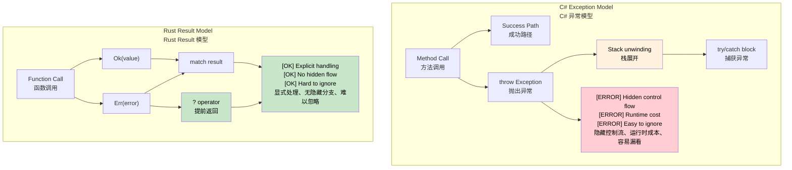

## Exceptions vs `Result<T, E>`<br><span class="zh-inline">异常与 `Result&lt;T, E&gt;` 的对照</span>

> **What you'll learn:** Why Rust replaces exceptions with `Result<T, E>` and `Option<T>`, how the `?` operator keeps propagation concise, and why explicit error handling removes the hidden control flow common in C# `try` / `catch` code.<br><span class="zh-inline">**本章将学习：** Rust 为什么用 `Result&lt;T, E&gt;` 和 `Option&lt;T&gt;` 取代异常，`?` 怎样让错误传播保持简洁，以及显式错误处理为什么能消除 C# `try` / `catch` 代码里常见的隐藏控制流。</span>
>
> **Difficulty:** 🟡 Intermediate<br><span class="zh-inline">**难度：** 🟡 进阶</span>
>
> **See also**: [Crate-Level Error Types](ch09-1-crate-level-error-types-and-result-alias.md) for production-oriented error patterns with `thiserror` and `anyhow`, and [Essential Crates](ch15-1-essential-crates-for-c-developers.md) for the wider error-handling ecosystem.<br><span class="zh-inline">**延伸阅读：** [Crate 级错误类型](ch09-1-crate-level-error-types-and-result-alias.md) 会介绍面向生产环境的 `thiserror` 与 `anyhow` 用法，[核心 Crate](ch15-1-essential-crates-for-c-developers.md) 会继续展开错误处理生态。</span>

### C# Exception-Based Error Handling<br><span class="zh-inline">C# 的异常式错误处理</span>

```csharp
// C# - Exception-based error handling
public class UserService
{
    public User GetUser(int userId)
    {
        if (userId <= 0)
        {
            throw new ArgumentException("User ID must be positive");
        }

        var user = database.FindUser(userId);
        if (user == null)
        {
            throw new UserNotFoundException($"User {userId} not found");
        }

        return user;
    }

    public async Task<string> GetUserEmailAsync(int userId)
    {
        try
        {
            var user = GetUser(userId);
            return user.Email ?? throw new InvalidOperationException("User has no email");
        }
        catch (UserNotFoundException ex)
        {
            logger.Warning("User not found: {UserId}", userId);
            return "noreply@company.com";
        }
        catch (Exception ex)
        {
            logger.Error(ex, "Unexpected error getting user email");
            throw; // Re-throw
        }
    }
}
```

### Rust Result-Based Error Handling<br><span class="zh-inline">Rust 基于 Result 的错误处理</span>

```rust
use std::fmt;

#[derive(Debug)]
pub enum UserError {
    InvalidId(i32),
    NotFound(i32),
    NoEmail,
    DatabaseError(String),
}

impl fmt::Display for UserError {
    fn fmt(&self, f: &mut fmt::Formatter<'_>) -> fmt::Result {
        match self {
            UserError::InvalidId(id) => write!(f, "Invalid user ID: {}", id),
            UserError::NotFound(id) => write!(f, "User {} not found", id),
            UserError::NoEmail => write!(f, "User has no email address"),
            UserError::DatabaseError(msg) => write!(f, "Database error: {}", msg),
        }
    }
}

impl std::error::Error for UserError {}

pub struct UserService {
    // database connection, etc.
}

impl UserService {
    pub fn get_user(&self, user_id: i32) -> Result<User, UserError> {
        if user_id <= 0 {
            return Err(UserError::InvalidId(user_id));
        }

        self.database_find_user(user_id)
            .ok_or(UserError::NotFound(user_id))
    }

    pub fn get_user_email(&self, user_id: i32) -> Result<String, UserError> {
        let user = self.get_user(user_id)?;

        user.email
            .ok_or(UserError::NoEmail)
    }

    pub fn get_user_email_or_default(&self, user_id: i32) -> String {
        match self.get_user_email(user_id) {
            Ok(email) => email,
            Err(UserError::NotFound(_)) => {
                log::warn!("User not found: {}", user_id);
                "noreply@company.com".to_string()
            }
            Err(err) => {
                log::error!("Error getting user email: {}", err);
                "error@company.com".to_string()
            }
        }
    }
}
```

In C#, failure can jump out of a method at runtime by throwing. In Rust, the function signature itself says whether failure is possible and what form it takes.<br><span class="zh-inline">在 C# 里，失败可以通过抛异常在运行时突然从方法里跳出去；而在 Rust 里，函数签名会提前说明“这里可能失败”，以及“失败会长成什么样”。</span>



***

### The `?` Operator: Propagating Errors Concisely<br><span class="zh-inline">`?` 运算符：简洁地向上传播错误</span>

```csharp
// C# - Exception propagation (implicit)
public async Task<string> ProcessFileAsync(string path)
{
    var content = await File.ReadAllTextAsync(path);
    var processed = ProcessContent(content);
    return processed;
}
```

```rust
fn process_file(path: &str) -> Result<String, ConfigError> {
    let content = read_config(path)?;
    let processed = process_content(&content)?;
    Ok(processed)
}

fn process_content(content: &str) -> Result<String, ConfigError> {
    if content.is_empty() {
        Err(ConfigError::InvalidFormat)
    } else {
        Ok(content.to_uppercase())
    }
}
```

The practical effect is similar to letting an exception bubble up, but `?` is visible in the source and only works when the return type already admits failure.<br><span class="zh-inline">从效果上看，`?` 和“让异常继续往上冒”有点像，但它会明确写在源码里，而且只有当函数返回类型本来就允许失败时才能使用。</span>

### `Option<T>` for Nullable Values<br><span class="zh-inline">用 `Option&lt;T&gt;` 处理可空值</span>

```csharp
// C# - Nullable reference types
public string? FindUserName(int userId)
{
    var user = database.FindUser(userId);
    return user?.Name;
}

public void ProcessUser(int userId)
{
    string? name = FindUserName(userId);
    if (name != null)
    {
        Console.WriteLine($"User: {name}");
    }
    else
    {
        Console.WriteLine("User not found");
    }
}
```

```rust
fn find_user_name(user_id: u32) -> Option<String> {
    if user_id == 1 {
        Some("Alice".to_string())
    } else {
        None
    }
}

fn process_user(user_id: u32) {
    match find_user_name(user_id) {
        Some(name) => println!("User: {}", name),
        None => println!("User not found"),
    }

    if let Some(name) = find_user_name(user_id) {
        println!("User: {}", name);
    } else {
        println!("User not found");
    }
}
```

Rust splits “optional value” and “error value” into `Option<T>` and `Result<T, E>`. That separation removes a huge amount of ambiguity that often accumulates in nullable APIs.<br><span class="zh-inline">Rust 会把“值可能不存在”和“调用发生错误”分别交给 `Option&lt;T&gt;` 与 `Result&lt;T, E&gt;` 表达。这种拆分能消掉可空 API 里常见的大量歧义。</span>

### Combining Option and Result<br><span class="zh-inline">把 Option 和 Result 组合起来</span>

```rust
fn safe_divide(a: f64, b: f64) -> Option<f64> {
    if b != 0.0 {
        Some(a / b)
    } else {
        None
    }
}

fn parse_and_divide(a_str: &str, b_str: &str) -> Result<Option<f64>, ParseFloatError> {
    let a: f64 = a_str.parse()?;
    let b: f64 = b_str.parse()?;
    Ok(safe_divide(a, b))
}

use std::num::ParseFloatError;

fn main() {
    match parse_and_divide("10.0", "2.0") {
        Ok(Some(result)) => println!("Result: {}", result),
        Ok(None) => println!("Division by zero"),
        Err(error) => println!("Parse error: {}", error),
    }
}
```

This pattern is common: `Result` says the operation itself may fail, while `Option` inside it says the successful operation may legitimately produce “no value”.<br><span class="zh-inline">这种嵌套很常见：外层 `Result` 表示操作本身可能失败，内层 `Option` 表示即便操作成功，也可能合理地产生“没有值”这个结果。</span>

***

<details>
<summary><strong>🏋️ Exercise: Build a Crate-Level Error Type</strong><br><span class="zh-inline"><strong>🏋️ 练习：设计一个 crate 级错误类型</strong></span></summary>

**Challenge**: Create an `AppError` enum for a file-processing application that can fail because of I/O, JSON parsing, or validation problems. Implement `From` conversions so `?` can propagate those errors automatically.<br><span class="zh-inline">**挑战**：为一个文件处理应用设计 `AppError` 枚举，它可能因为 I/O、JSON 解析或校验失败而出错。实现对应的 `From` 转换，让 `?` 可以自动传播这些错误。</span>

```rust
use std::io;

// TODO: Define AppError with variants:
//   Io(io::Error), Json(serde_json::Error), Validation(String)
// TODO: Implement Display and Error traits
// TODO: Implement From<io::Error> and From<serde_json::Error>
// TODO: Define type alias: type Result<T> = std::result::Result<T, AppError>;

fn load_config(path: &str) -> Result<Config> {
    let content = std::fs::read_to_string(path)?;
    let config: Config = serde_json::from_str(&content)?;
    if config.name.is_empty() {
        return Err(AppError::Validation("name cannot be empty".into()));
    }
    Ok(config)
}
```

<details>
<summary>🔑 Solution<br><span class="zh-inline">🔑 参考答案</span></summary>

```rust
use std::io;
use thiserror::Error;

#[derive(Error, Debug)]
pub enum AppError {
    #[error("I/O error: {0}")]
    Io(#[from] io::Error),

    #[error("JSON error: {0}")]
    Json(#[from] serde_json::Error),

    #[error("Validation: {0}")]
    Validation(String),
}

pub type Result<T> = std::result::Result<T, AppError>;

#[derive(serde::Deserialize)]
struct Config {
    name: String,
    port: u16,
}

fn load_config(path: &str) -> Result<Config> {
    let content = std::fs::read_to_string(path)?;
    let config: Config = serde_json::from_str(&content)?;
    if config.name.is_empty() {
        return Err(AppError::Validation("name cannot be empty".into()));
    }
    Ok(config)
}
```

**Key takeaways**:<br><span class="zh-inline">**核心收获：**</span>
- `thiserror` can generate `Display` and `Error` implementations from attributes.<br><span class="zh-inline">`thiserror` 能从属性直接生成 `Display` 和 `Error` 实现。</span>
- `#[from]` generates `From<T>` implementations so `?` can convert automatically.<br><span class="zh-inline">`#[from]` 会自动生成 `From&lt;T&gt;`，于是 `?` 能自动做错误转换。</span>
- A crate-level `Result<T>` alias removes repetitive type boilerplate.<br><span class="zh-inline">crate 级的 `Result&lt;T&gt;` 类型别名能减少大量重复样板。</span>
- Unlike C# exceptions, the error type stays visible in every function signature.<br><span class="zh-inline">和 C# 异常不同，错误类型会老老实实待在函数签名里。</span>

</details>
</details>

***
