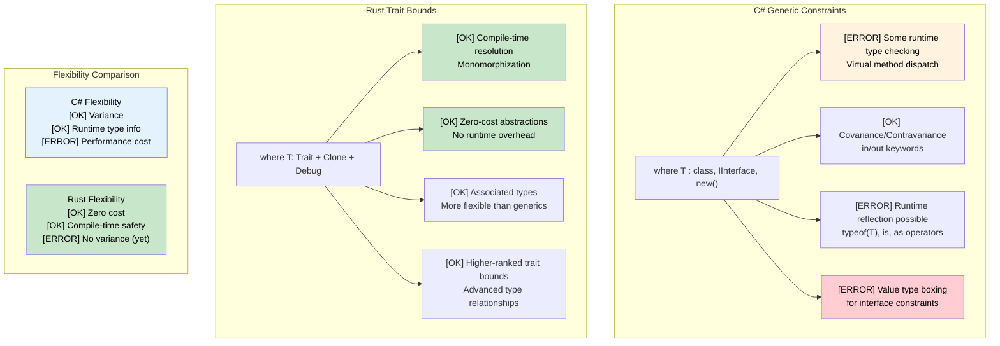

## Generic Constraints: where vs trait bounds<br><span class="zh-inline">泛型约束：`where` 子句与 trait bound</span>

> **What you'll learn:** Rust's trait bounds vs C#'s `where` constraints, the `where` clause syntax, conditional trait implementations, associated types, and higher-ranked trait bounds (HRTBs).<br><span class="zh-inline">**本章将学到什么：** Rust 的 trait bound 和 C# `where` 约束有什么区别，`where` 子句怎么写，条件式 trait 实现是什么，关联类型如何工作，以及高阶生命周期约束 HRTB 到底在解决什么问题。</span>
>
> **Difficulty:** 🔴 Advanced<br><span class="zh-inline">**难度：** 🔴 高级</span>

### C# Generic Constraints<br><span class="zh-inline">C# 的泛型约束</span>

```csharp
// C# Generic constraints with where clause
public class Repository<T> where T : class, IEntity, new()
{
    public T Create()
    {
        return new T();  // new() constraint allows parameterless constructor
    }
    
    public void Save(T entity)
    {
        if (entity.Id == 0)  // IEntity constraint provides Id property
        {
            entity.Id = GenerateId();
        }
        // Save to database
    }
}

// Multiple type parameters with constraints
public class Converter<TInput, TOutput> 
    where TInput : IConvertible
    where TOutput : class, new()
{
    public TOutput Convert(TInput input)
    {
        var output = new TOutput();
        // Conversion logic using IConvertible
        return output;
    }
}

// Variance in generics
public interface IRepository<out T> where T : IEntity
{
    IEnumerable<T> GetAll();  // Covariant - can return more derived types
}

public interface IWriter<in T> where T : IEntity
{
    void Write(T entity);  // Contravariant - can accept more base types
}
```

C# 的 `where` 约束，核心是在说“这个类型参数至少得长成什么样”。例如必须实现某接口、必须是引用类型、必须带无参构造函数。对 C# 开发者来说，这套写法很自然，因为它和类继承、接口、多态是一整套世界观。<br><span class="zh-inline">但到了 Rust，思路就得拐个弯。Rust 的约束不是围着类层级打转，而是围着能力，也就是 trait 在组织。</span>

### Rust Generic Constraints with Trait Bounds<br><span class="zh-inline">Rust 里的泛型约束：trait bound</span>

```rust
use std::fmt::{Debug, Display};
use std::clone::Clone;

// Basic trait bounds
pub struct Repository<T> 
where 
    T: Clone + Debug + Default,
{
    items: Vec<T>,
}

impl<T> Repository<T> 
where 
    T: Clone + Debug + Default,
{
    pub fn new() -> Self {
        Repository { items: Vec::new() }
    }
    
    pub fn create(&self) -> T {
        T::default()  // Default trait provides default value
    }
    
    pub fn add(&mut self, item: T) {
        println!("Adding item: {:?}", item);  // Debug trait for printing
        self.items.push(item);
    }
    
    pub fn get_all(&self) -> Vec<T> {
        self.items.clone()  // Clone trait for duplication
    }
}

// Multiple trait bounds with different syntaxes
pub fn process_data<T, U>(input: T) -> U 
where 
    T: Display + Clone,
    U: From<T> + Debug,
{
    println!("Processing: {}", input);  // Display trait
    let cloned = input.clone();         // Clone trait
    let output = U::from(cloned);       // From trait for conversion
    println!("Result: {:?}", output);   // Debug trait
    output
}

// Associated types (similar to C# generic constraints)
pub trait Iterator {
    type Item;  // Associated type instead of generic parameter
    
    fn next(&mut self) -> Option<Self::Item>;
}

pub trait Collect<T> {
    fn collect<I: Iterator<Item = T>>(iter: I) -> Self;
}

// Higher-ranked trait bounds (advanced)
fn apply_to_all<F>(items: &[String], f: F) -> Vec<String>
where 
    F: for<'a> Fn(&'a str) -> String,  // Function works with any lifetime
{
    items.iter().map(|s| f(s)).collect()
}

// Conditional trait implementations
impl<T> PartialEq for Repository<T> 
where 
    T: PartialEq + Clone + Debug + Default,
{
    fn eq(&self, other: &Self) -> bool {
        self.items == other.items
    }
}
```

Rust 这里的味道完全不同。`T: Clone + Debug + Default` 的意思不是“`T` 继承了某些祖宗类型”，而是“`T` 必须具备这些能力”。这种能力导向的建模方式，和 C# 那种面向继承层级的约束相比，会更轻、更组合化。<br><span class="zh-inline">说白了，Rust 更关心“这个类型能干什么”，而不是“它是谁的孩子”。</span>

### Why `where` Exists<br><span class="zh-inline">为什么 Rust 也有 `where` 子句</span>

Rust 当然也支持把约束写在尖括号里，例如 `fn f<T: Clone + Debug>(x: T)`。可一旦类型参数多起来、约束变复杂、还要带关联类型，那一行代码就会很快长得像拧麻花。<br><span class="zh-inline">这时候 `where` 子句的价值就出来了：把函数签名和约束条件拆开，读起来不那么糊成一坨。</span>

经验上可以这样记：<br><span class="zh-inline">一个很实用的经验是：</span>

- Short, simple bounds can stay inline: `fn print<T: Display>(value: T)`<br><span class="zh-inline">约束短而简单时，可以直接写在泛型参数里，例如 `fn print<T: Display>(value: T)`。</span>
- Longer bounds, multiple type parameters, or associated-type requirements read better in `where`<br><span class="zh-inline">如果约束很长、类型参数很多、或者还带有关联类型要求，改写成 `where` 通常更清楚。</span>

### Associated Types vs More Type Parameters<br><span class="zh-inline">关联类型与“继续加类型参数”的区别</span>

对 C# 开发者来说，关联类型一开始经常有点绕，因为习惯了“需要表达一个类型关系，就再加一个泛型参数”。Rust 当然也能这么写，但很多时候关联类型更自然。<br><span class="zh-inline">例如 `Iterator` 并不是“某种带一个额外泛型参数的 trait”，而是“这个 trait 自带一个产出类型 `Item`”。这样使用端更简洁，约束也更少歧义。</span>

### Conditional Implementations<br><span class="zh-inline">条件式实现</span>

`impl<T> PartialEq for Repository<T> where T: PartialEq + Clone + Debug + Default` 这种写法，是 Rust 泛型特别有力量的一点。<br><span class="zh-inline">它表达的是：只有当 `T` 本身满足这些能力时，`Repository<T>` 才拥有 `PartialEq`。这是一种非常自然的“能力传播”模式。</span>

C# 里通常更依赖接口层级或运行时行为来组织类似能力。Rust 则更喜欢把这种规则提前写进类型系统，让可不可以成立，在编译时就定死。<br><span class="zh-inline">这也是 Rust 泛型虽然难啃，但一旦掌握后会非常顺手的原因之一。</span>

### Higher-Ranked Trait Bounds<br><span class="zh-inline">高阶生命周期约束 HRTB</span>

`for<'a> Fn(&'a str) -> String` 这种写法第一次看确实容易脑壳发紧。它的意思其实很朴素：这个函数或闭包，必须对**任意生命周期**的 `&str` 都成立。<br><span class="zh-inline">换句话说，它不能偷偷依赖某个特定借用时长，而是要足够通用，来什么引用都能接住。</span>

这在“把某个函数当作泛型参数传进去”时特别常见。C# 里这类事情很多时候由委托和运行时类型系统帮忙兜着，Rust 则要把借用关系说清楚。<br><span class="zh-inline">看起来更复杂，但换来的好处是生命周期规则更精确，也更容易避免悬垂引用之类的毛病。</span>



这张图背后的核心差异其实挺简单：C# 泛型约束给的是“面向对象体系里的资格说明”，Rust trait bound 给的是“编译期能力契约”。<br><span class="zh-inline">一个更依赖运行时类型世界的配合，一个更偏向把抽象压到编译期解决。</span>

---

## Exercises<br><span class="zh-inline">练习</span>

<details>
<summary><strong>🏋️ Exercise: Generic Repository</strong> <span class="zh-inline">🏋️ 练习：泛型仓储接口</span></summary>

Translate this C# generic repository interface to Rust traits:<br><span class="zh-inline">把下面这段 C# 泛型仓储接口翻成 Rust trait：</span>

```csharp
public interface IRepository<T> where T : IEntity, new()
{
    T GetById(int id);
    IEnumerable<T> Find(Func<T, bool> predicate);
    void Save(T entity);
}
```

Requirements:<br><span class="zh-inline">要求如下：</span>

1. Define an `Entity` trait with `fn id(&self) -> u64`<br><span class="zh-inline">1. 定义一个 `Entity` trait，提供 `fn id(&self) -> u64`。</span>
2. Define a `Repository<T>` trait where `T: Entity + Clone`<br><span class="zh-inline">2. 定义 `Repository<T>` trait，并要求 `T: Entity + Clone`。</span>
3. Implement a `InMemoryRepository<T>` that stores items in a `Vec<T>`<br><span class="zh-inline">3. 实现一个 `InMemoryRepository<T>`，底层用 `Vec<T>` 保存数据。</span>
4. The `find` method should accept `impl Fn(&T) -> bool`<br><span class="zh-inline">4. `find` 方法需要接收 `impl Fn(&T) -> bool` 作为过滤条件。</span>

<details>
<summary>🔑 Solution <span class="zh-inline">🔑 参考答案</span></summary>

```rust
trait Entity: Clone {
    fn id(&self) -> u64;
}

trait Repository<T: Entity> {
    fn get_by_id(&self, id: u64) -> Option<&T>;
    fn find(&self, predicate: impl Fn(&T) -> bool) -> Vec<&T>;
    fn save(&mut self, entity: T);
}

struct InMemoryRepository<T> {
    items: Vec<T>,
}

impl<T: Entity> InMemoryRepository<T> {
    fn new() -> Self { Self { items: Vec::new() } }
}

impl<T: Entity> Repository<T> for InMemoryRepository<T> {
    fn get_by_id(&self, id: u64) -> Option<&T> {
        self.items.iter().find(|item| item.id() == id)
    }
    fn find(&self, predicate: impl Fn(&T) -> bool) -> Vec<&T> {
        self.items.iter().filter(|item| predicate(item)).collect()
    }
    fn save(&mut self, entity: T) {
        if let Some(pos) = self.items.iter().position(|e| e.id() == entity.id()) {
            self.items[pos] = entity;
        } else {
            self.items.push(entity);
        }
    }
}

#[derive(Clone, Debug)]
struct User { user_id: u64, name: String }

impl Entity for User {
    fn id(&self) -> u64 { self.user_id }
}

fn main() {
    let mut repo = InMemoryRepository::new();
    repo.save(User { user_id: 1, name: "Alice".into() });
    repo.save(User { user_id: 2, name: "Bob".into() });

    let found = repo.find(|u| u.name.starts_with('A'));
    assert_eq!(found.len(), 1);
}
```

**Key differences from C#**: No `new()` constraint (use `Default` trait instead). `Fn(&T) -> bool` replaces `Func<T, bool>`. Return `Option` instead of throwing.<br><span class="zh-inline">**和 C# 的关键区别：** Rust 里没有直接对应 `new()` 约束的写法，通常会考虑 `Default`；`Func<T, bool>` 对应的是 `Fn(&T) -> bool`；而按 id 查不到值时，更常见的返回方式是 `Option`，而不是直接抛异常。</span>

</details>
</details>

***
