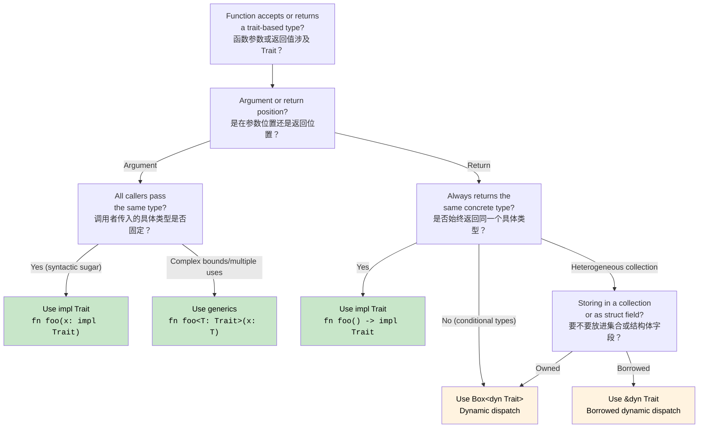

## Traits - Rust's Interfaces<br><span class="zh-inline">Trait：Rust 里的接口机制</span>

> **What you'll learn:** Traits compared with C# interfaces, default method implementations, trait objects (`dyn Trait`) versus generic bounds (`impl Trait`), derived traits, common standard-library traits, associated types, and operator overloading through traits.<br><span class="zh-inline">**本章将学到什么：** 对照理解 Trait 和 C# 接口的关系，掌握默认方法实现、trait object `dyn Trait` 与泛型约束 `impl Trait` 的区别，理解自动派生 trait、常见标准库 trait、关联类型，以及如何通过 trait 实现运算符重载。</span>
>
> **Difficulty:** 🟡 Intermediate<br><span class="zh-inline">**难度：** 🟡 进阶</span>

Traits are Rust's mechanism for describing shared behavior. They play a role similar to interfaces in C#, but they also stretch into areas that C# interfaces do not cover, such as operator overloading and associated types.<br><span class="zh-inline">Trait 是 Rust 用来描述“共享行为”的核心机制。它和 C# 的接口确实有相似之处，但它能覆盖的范围更大，像运算符重载、关联类型这些能力，都直接建在 trait 体系上。</span>

### C# Interface Comparison<br><span class="zh-inline">先和 C# 接口对照一下</span>

```csharp
// C# interface definition
public interface IAnimal
{
    string Name { get; }
    void MakeSound();
    
    // Default implementation (C# 8+)
    string Describe()
    {
        return $"{Name} makes a sound";
    }
}

// C# interface implementation
public class Dog : IAnimal
{
    public string Name { get; }
    
    public Dog(string name)
    {
        Name = name;
    }
    
    public void MakeSound()
    {
        Console.WriteLine("Woof!");
    }
    
    // Can override default implementation
    public string Describe()
    {
        return $"{Name} is a loyal dog";
    }
}

// Generic constraints
public void ProcessAnimal<T>(T animal) where T : IAnimal
{
    animal.MakeSound();
    Console.WriteLine(animal.Describe());
}
```

### Rust Trait Definition and Implementation<br><span class="zh-inline">Rust Trait 的定义与实现</span>

```rust
// Trait definition
trait Animal {
    fn name(&self) -> &str;
    fn make_sound(&self);
    
    // Default implementation
    fn describe(&self) -> String {
        format!("{} makes a sound", self.name())
    }
    
    // Default implementation using other trait methods
    fn introduce(&self) {
        println!("Hi, I'm {}", self.name());
        self.make_sound();
    }
}

// Struct definition
#[derive(Debug)]
struct Dog {
    name: String,
    breed: String,
}

impl Dog {
    fn new(name: String, breed: String) -> Dog {
        Dog { name, breed }
    }
}

// Trait implementation
impl Animal for Dog {
    fn name(&self) -> &str {
        &self.name
    }
    
    fn make_sound(&self) {
        println!("Woof!");
    }
    
    // Override default implementation
    fn describe(&self) -> String {
        format!("{} is a loyal {} dog", self.name, self.breed)
    }
}

// Another implementation
#[derive(Debug)]
struct Cat {
    name: String,
    indoor: bool,
}

impl Animal for Cat {
    fn name(&self) -> &str {
        &self.name
    }
    
    fn make_sound(&self) {
        println!("Meow!");
    }
    
    // Use default describe() implementation
}

// Generic function with trait bounds
fn process_animal<T: Animal>(animal: &T) {
    animal.make_sound();
    println!("{}", animal.describe());
    animal.introduce();
}

// Multiple trait bounds
fn process_animal_debug<T: Animal + std::fmt::Debug>(animal: &T) {
    println!("Debug: {:?}", animal);
    process_animal(animal);
}

fn main() {
    let dog = Dog::new("Buddy".to_string(), "Golden Retriever".to_string());
    let cat = Cat { name: "Whiskers".to_string(), indoor: true };
    
    process_animal(&dog);
    process_animal(&cat);
    
    process_animal_debug(&dog);
}
```

看到这里，可以先把 Trait 暂时理解成“接口加一堆额外超能力”。<br><span class="zh-inline">默认方法、基于 trait 的泛型约束、和其他 trait 组合使用，这些在 C# 里也有影子，但 Rust 把它们揉得更紧、更统一。</span>

### Trait Objects and Dynamic Dispatch<br><span class="zh-inline">Trait Object 与动态分发</span>

```csharp
// C# dynamic polymorphism
public void ProcessAnimals(List<IAnimal> animals)
{
    foreach (var animal in animals)
    {
        animal.MakeSound(); // Dynamic dispatch
        Console.WriteLine(animal.Describe());
    }
}

// Usage
var animals = new List<IAnimal>
{
    new Dog("Buddy"),
    new Cat("Whiskers"),
    new Dog("Rex")
};

ProcessAnimals(animals);
```

```rust
// Rust trait objects for dynamic dispatch
fn process_animals(animals: &[Box<dyn Animal>]) {
    for animal in animals {
        animal.make_sound(); // Dynamic dispatch
        println!("{}", animal.describe());
    }
}

// Alternative: using references
fn process_animal_refs(animals: &[&dyn Animal]) {
    for animal in animals {
        animal.make_sound();
        println!("{}", animal.describe());
    }
}

fn main() {
    // Using Box<dyn Trait>
    let animals: Vec<Box<dyn Animal>> = vec![
        Box::new(Dog::new("Buddy".to_string(), "Golden Retriever".to_string())),
        Box::new(Cat { name: "Whiskers".to_string(), indoor: true }),
        Box::new(Dog::new("Rex".to_string(), "German Shepherd".to_string())),
    ];
    
    process_animals(&animals);
    
    // Using references
    let dog = Dog::new("Buddy".to_string(), "Golden Retriever".to_string());
    let cat = Cat { name: "Whiskers".to_string(), indoor: true };
    
    let animal_refs: Vec<&dyn Animal> = vec![&dog, &cat];
    process_animal_refs(&animal_refs);
}
```

这里就开始出现 Rust 独有的取舍题了：到底要静态分发，还是动态分发。<br><span class="zh-inline">C# 开发者经常习惯“接口一套上，先跑起来再说”；Rust 则会逼着在抽象能力、分配成本、调用方式之间先做决定，这一点后面会越来越频繁出现。</span>

### Derived Traits<br><span class="zh-inline">派生 Trait</span>

```rust
// Automatically derive common traits
#[derive(Debug, Clone, PartialEq, Eq, Hash)]
struct Person {
    name: String,
    age: u32,
}

// What this generates (simplified):
impl std::fmt::Debug for Person {
    fn fmt(&self, f: &mut std::fmt::Formatter<'_>) -> std::fmt::Result {
        f.debug_struct("Person")
            .field("name", &self.name)
            .field("age", &self.age)
            .finish()
    }
}

impl Clone for Person {
    fn clone(&self) -> Self {
        Person {
            name: self.name.clone(),
            age: self.age,
        }
    }
}

impl PartialEq for Person {
    fn eq(&self, other: &Self) -> bool {
        self.name == other.name && self.age == other.age
    }
}

// Usage
fn main() {
    let person1 = Person {
        name: "Alice".to_string(),
        age: 30,
    };
    
    let person2 = person1.clone(); // Clone trait
    
    println!("{:?}", person1); // Debug trait
    println!("Equal: {}", person1 == person2); // PartialEq trait
}
```

`derive` 是 Rust 里非常香的一块。<br><span class="zh-inline">很多通用能力比如调试打印、克隆、比较、哈希，结构体字段本身已经足够表达语义时，就没必要手写一大堆模板实现，直接 `#[derive(...)]` 最省力。</span>

### Common Standard Library Traits<br><span class="zh-inline">常见标准库 Trait</span>

```rust
use std::collections::HashMap;

// Display trait for user-friendly output
impl std::fmt::Display for Person {
    fn fmt(&self, f: &mut std::fmt::Formatter<'_>) -> std::fmt::Result {
        write!(f, "{} (age {})", self.name, self.age)
    }
}

// From trait for conversions
impl From<(String, u32)> for Person {
    fn from((name, age): (String, u32)) -> Self {
        Person { name, age }
    }
}

// Into trait is automatically implemented when From is implemented
fn create_person() {
    let person: Person = ("Alice".to_string(), 30).into();
    println!("{}", person);
}

// Iterator trait implementation
struct PersonIterator {
    people: Vec<Person>,
    index: usize,
}

impl Iterator for PersonIterator {
    type Item = Person;
    
    fn next(&mut self) -> Option<Self::Item> {
        if self.index < self.people.len() {
            let person = self.people[self.index].clone();
            self.index += 1;
            Some(person)
        } else {
            None
        }
    }
}

impl Person {
    fn iterator(people: Vec<Person>) -> PersonIterator {
        PersonIterator { people, index: 0 }
    }
}

fn main() {
    let people = vec![
        Person::from(("Alice".to_string(), 30)),
        Person::from(("Bob".to_string(), 25)),
        Person::from(("Charlie".to_string(), 35)),
    ];
    
    // Use our custom iterator
    for person in Person::iterator(people.clone()) {
        println!("{}", person); // Uses Display trait
    }
}
```

这部分很值得建立“trait 是生态接线口”的感觉。<br><span class="zh-inline">只要实现了对应 trait，类型就能自动接入标准库和常见惯用法。例如实现 `Display` 就能优雅打印，实现 `From` 就能进转换链，实现 `Iterator` 就能进 `for` 循环和迭代器生态。</span>

***

<details>
<summary><strong>🏋️ Exercise: Trait-Based Drawing System</strong><br><span class="zh-inline"><strong>🏋️ 练习：基于 Trait 的绘图系统</strong></span></summary>

**Challenge**: Implement a `Drawable` trait with an `area()` method and a default `draw()` method. Create `Circle` and `Rect` structs, then write a function that accepts `&[Box<dyn Drawable>]` and prints the total area.<br><span class="zh-inline">**挑战：** 实现一个 `Drawable` trait，包含 `area()` 方法和默认的 `draw()` 方法；再创建 `Circle` 和 `Rect` 两个结构体，最后写一个能接收 `&[Box<dyn Drawable>]` 并打印总面积的函数。</span>

<details>
<summary>🔑 Solution<br><span class="zh-inline">🔑 参考答案</span></summary>

```rust
use std::f64::consts::PI;

trait Drawable {
    fn area(&self) -> f64;

    fn draw(&self) {
        println!("Drawing shape with area {:.2}", self.area());
    }
}

struct Circle { radius: f64 }
struct Rect   { w: f64, h: f64 }

impl Drawable for Circle {
    fn area(&self) -> f64 { PI * self.radius * self.radius }
}

impl Drawable for Rect {
    fn area(&self) -> f64 { self.w * self.h }
}

fn total_area(shapes: &[Box<dyn Drawable>]) -> f64 {
    shapes.iter().map(|s| s.area()).sum()
}

fn main() {
    let shapes: Vec<Box<dyn Drawable>> = vec![
        Box::new(Circle { radius: 5.0 }),
        Box::new(Rect { w: 4.0, h: 6.0 }),
        Box::new(Circle { radius: 2.0 }),
    ];
    for s in &shapes { s.draw(); }
    println!("Total area: {:.2}", total_area(&shapes));
}
```

**Key takeaways:**<br><span class="zh-inline">**这一题最该记住的点：**</span>

- `dyn Trait` gives runtime polymorphism similar to using an interface in C#.<br><span class="zh-inline">`dyn Trait` 提供的是运行时多态，味道上很像 C# 里的接口多态。</span>
- `Box<dyn Trait>` is heap-allocated and is often needed for heterogeneous collections.<br><span class="zh-inline">`Box<dyn Trait>` 往往意味着堆分配，异构集合里经常少不了它。</span>
- Default trait methods behave very much like C# 8+ default interface methods.<br><span class="zh-inline">Trait 默认方法的感觉，和 C# 8 之后的默认接口实现很接近。</span>

</details>
</details>

### Associated Types: Traits With Type Members<br><span class="zh-inline">关联类型：Trait 里的类型成员</span>

C# interfaces do not have a direct associated-type concept, but Rust traits do. The classic example is `Iterator`.<br><span class="zh-inline">C# 接口里没有和“关联类型”完全对等的原生概念，而 Rust trait 有。最经典的例子就是 `Iterator`。</span>

```rust
// The Iterator trait has an associated type 'Item'
trait Iterator {
    type Item;                         // Each implementor defines what Item is
    fn next(&mut self) -> Option<Self::Item>;
}

struct Counter { max: u32, current: u32 }

impl Iterator for Counter {
    type Item = u32;                   // This Counter yields u32 values
    fn next(&mut self) -> Option<u32> {
        if self.current < self.max {
            self.current += 1;
            Some(self.current)
        } else {
            None
        }
    }
}
```

In C#, `IEnumerator<T>` or `IEnumerable<T>` use generic parameters for this role. Rust's associated types tie the type member to the implementation itself, which often makes trait bounds easier to read.<br><span class="zh-inline">在 C# 里，`IEnumerator<T>`、`IEnumerable<T>` 主要靠泛型参数解决这个问题；Rust 的关联类型则把“这个实现到底产出什么类型”直接绑定在实现上。这样一来，很多约束写出来会更短、更清楚。</span>

### Operator Overloading via Traits<br><span class="zh-inline">通过 Trait 做运算符重载</span>

In C#, operator overloading is done by defining static operator methods. In Rust, every operator maps to a trait in `std::ops`.<br><span class="zh-inline">C# 里写运算符重载，通常是定义静态 `operator` 方法；Rust 则是把每个运算符都映射成 `std::ops` 里的某个 trait。</span>

```rust
use std::ops::Add;

#[derive(Debug, Clone, Copy)]
struct Vec2 { x: f64, y: f64 }

impl Add for Vec2 {
    type Output = Vec2;
    fn add(self, rhs: Vec2) -> Vec2 {
        Vec2 { x: self.x + rhs.x, y: self.y + rhs.y }
    }
}

let a = Vec2 { x: 1.0, y: 2.0 };
let b = Vec2 { x: 3.0, y: 4.0 };
let c = a + b;  // calls <Vec2 as Add>::add(a, b)
```

| C# | Rust | Notes<br><span class="zh-inline">说明</span> |
|----|------|-------|
| `operator+`<br><span class="zh-inline">加号重载</span> | `impl Add`<br><span class="zh-inline">实现 `Add`</span> | `self` by value; may consume non-`Copy` types<br><span class="zh-inline">按值接收 `self`，非 `Copy` 类型可能被消费</span> |
| `operator==`<br><span class="zh-inline">相等比较</span> | `impl PartialEq`<br><span class="zh-inline">实现 `PartialEq`</span> | Often derived<br><span class="zh-inline">通常可以直接 derive</span> |
| `operator<`<br><span class="zh-inline">大小比较</span> | `impl PartialOrd`<br><span class="zh-inline">实现 `PartialOrd`</span> | Often derived<br><span class="zh-inline">通常也能 derive</span> |
| `ToString()`<br><span class="zh-inline">`ToString()`</span> | `impl fmt::Display`<br><span class="zh-inline">实现 `fmt::Display`</span> | Used by `println!("{}", x)`<br><span class="zh-inline">供 `println!("{}", x)` 使用</span> |
| Implicit conversion<br><span class="zh-inline">隐式转换</span> | No direct equivalent<br><span class="zh-inline">没有直接等价物</span> | Prefer `From` / `Into`<br><span class="zh-inline">通常用 `From` / `Into`</span> |

这部分再次说明了一件事：Trait 在 Rust 里不只是“面向对象接口”，它还是语言运算规则的挂载点。<br><span class="zh-inline">一旦理解这一层，很多看起来分散的能力，比如格式化、比较、加法、迭代、转换，就会突然串起来。</span>

### Coherence: The Orphan Rule<br><span class="zh-inline">一致性规则：孤儿规则</span>

You can only implement a trait if the current crate owns either the trait or the type. This prevents conflicting implementations across crates.<br><span class="zh-inline">Rust 规定：只有在当前 crate 拥有这个 trait，或者拥有这个类型时，才能写对应实现。这个限制就是常说的孤儿规则，它的目标是避免不同 crate 之间出现互相冲突的实现。</span>

```rust
// ✅ OK — you own MyType
impl Display for MyType { ... }

// ✅ OK — you own MyTrait
impl MyTrait for String { ... }

// ❌ ERROR — you own neither Display nor String
impl Display for String { ... }
```

C# 没有这一层限制，所以扩展方法可以随便往外加。<br><span class="zh-inline">Rust 则更保守一些，宁可先把实现边界卡严，也不想让生态里不同库对同一个组合各写一套实现，然后把调用方整懵。</span>

<!-- ch10.0a: impl Trait and Dispatch Strategies -->
## `impl Trait`: Returning Traits Without Boxing<br><span class="zh-inline">`impl Trait`：不装箱也能返回 Trait</span>

C# interfaces can always be used as return types, and the runtime takes care of dispatch and allocation. Rust makes the decision explicit: static dispatch with `impl Trait`, or dynamic dispatch with `dyn Trait`.<br><span class="zh-inline">C# 里接口当返回类型是常规操作，运行时会把后续分发和对象布局兜住；Rust 则要求把这件事说清楚，到底是 `impl Trait` 的静态分发，还是 `dyn Trait` 的动态分发。</span>

### `impl Trait` in Argument Position (Shorthand for Generics)<br><span class="zh-inline">参数位置上的 `impl Trait`（泛型语法糖）</span>

```rust
// These two are equivalent:
fn print_animal(animal: &impl Animal) { animal.make_sound(); }
fn print_animal<T: Animal>(animal: &T)  { animal.make_sound(); }

// impl Trait is just syntactic sugar for a generic parameter
// The compiler generates a specialized copy for each concrete type (monomorphization)
```

这里的 `impl Trait` 主要是让签名更短、更顺眼。<br><span class="zh-inline">本质上还是泛型，编译器照样会做单态化，不是什么新的运行时机制。</span>

### `impl Trait` in Return Position (The Key Difference)<br><span class="zh-inline">返回位置上的 `impl Trait`（这里才是重点）</span>

```rust
// Return an iterator without exposing the concrete type
fn even_squares(limit: u32) -> impl Iterator<Item = u32> {
    (0..limit)
        .filter(|n| n % 2 == 0)
        .map(|n| n * n)
}
// The caller sees "some type that implements Iterator<Item = u32>"
// The actual type (Filter<Map<Range<u32>, ...>>) is unnameable — impl Trait solves this.

fn main() {
    for n in even_squares(20) {
        print!("{n} ");
    }
    // Output: 0 4 16 36 64 100 144 196 256 324
}
```

```csharp
// C# — returning an interface (always dynamic dispatch, heap-allocated iterator object)
public IEnumerable<int> EvenSquares(int limit) =>
    Enumerable.Range(0, limit)
        .Where(n => n % 2 == 0)
        .Select(n => n * n);
// The return type hides the concrete iterator behind the IEnumerable interface
// Unlike Rust's Box<dyn Trait>, C# doesn't explicitly box — the runtime handles allocation
```

这一块是很多 C# 开发者第一次真正意识到 Rust 抽象成本不是“系统替你决定”的时刻。<br><span class="zh-inline">返回 `impl Trait` 意味着：类型虽然藏起来了，但编译器仍然知道它的具体身份，所以还能继续做静态优化。</span>

### Returning Closures: `impl Fn` vs `Box<dyn Fn>`<br><span class="zh-inline">返回闭包：`impl Fn` 与 `Box<dyn Fn>`</span>

```rust
// Return a closure — you CANNOT name the closure type, so impl Fn is essential
fn make_adder(x: i32) -> impl Fn(i32) -> i32 {
    move |y| x + y
}

let add5 = make_adder(5);
println!("{}", add5(3)); // 8

// If you need to return DIFFERENT closures conditionally, you need Box:
fn choose_op(add: bool) -> Box<dyn Fn(i32, i32) -> i32> {
    if add {
        Box::new(|a, b| a + b)
    } else {
        Box::new(|a, b| a * b)
    }
}
// impl Trait requires a SINGLE concrete type; different closures are different types
```

```csharp
// C# — delegates handle this naturally (always heap-allocated)
Func<int, int> MakeAdder(int x) => y => x + y;
Func<int, int, int> ChooseOp(bool add) => add ? (a, b) => a + b : (a, b) => a * b;
```

这里最该记住的一句就是：`impl Trait` 只能代表一个具体类型。<br><span class="zh-inline">如果分支里返回的是两个不同闭包，那它们在 Rust 看来就是两个完全不同的匿名类型，这时就得退回 `Box<dyn Fn>` 这种动态分发方案。</span>

### The Dispatch Decision: `impl Trait` vs `dyn Trait` vs Generics<br><span class="zh-inline">分发选择：`impl Trait`、`dyn Trait` 还是泛型</span>

This choice becomes an architectural question very quickly in Rust. The following diagram gives the rough mental map.<br><span class="zh-inline">这件事在 Rust 里很快就会上升成架构选择题。下面这张图就是一份大致的脑图。</span>



| Approach<br><span class="zh-inline">方案</span> | Dispatch<br><span class="zh-inline">分发方式</span> | Allocation<br><span class="zh-inline">分配</span> | When to Use<br><span class="zh-inline">适用场景</span> |
|----------|----------|------------|-------------|
| `fn foo<T: Trait>(x: T)`<br><span class="zh-inline">泛型约束</span> | Static<br><span class="zh-inline">静态分发</span> | Stack<br><span class="zh-inline">通常不额外堆分配</span> | Same type reused, complex bounds<br><span class="zh-inline">同一类型多次复用，或约束比较复杂时</span> |
| `fn foo(x: impl Trait)`<br><span class="zh-inline">参数位置 `impl Trait`</span> | Static<br><span class="zh-inline">静态分发</span> | Stack<br><span class="zh-inline">通常不额外堆分配</span> | Cleaner syntax for simple bounds<br><span class="zh-inline">语法更简洁，适合简单约束</span> |
| `fn foo() -> impl Trait`<br><span class="zh-inline">返回位置 `impl Trait`</span> | Static<br><span class="zh-inline">静态分发</span> | Stack<br><span class="zh-inline">通常不额外堆分配</span> | Single concrete return type<br><span class="zh-inline">始终返回同一个具体类型时</span> |
| `fn foo() -> Box<dyn Trait>`<br><span class="zh-inline">装箱动态分发</span> | Dynamic<br><span class="zh-inline">动态分发</span> | **Heap**<br><span class="zh-inline">堆分配</span> | Different return types, heterogeneous collections<br><span class="zh-inline">返回类型不止一种，或需要异构集合</span> |
| `&dyn Trait` / `&mut dyn Trait`<br><span class="zh-inline">借用的 trait object</span> | Dynamic<br><span class="zh-inline">动态分发</span> | No alloc<br><span class="zh-inline">不额外分配</span> | Borrowed heterogeneous values<br><span class="zh-inline">只借用异构值时</span> |

```rust
// Summary: from fastest to most flexible
fn static_dispatch(x: impl Display)             { /* fastest, no alloc */ }
fn generic_dispatch<T: Display + Clone>(x: T)    { /* fastest, multiple bounds */ }
fn dynamic_dispatch(x: &dyn Display)             { /* vtable lookup, no alloc */ }
fn boxed_dispatch(x: Box<dyn Display>)           { /* vtable lookup + heap alloc */ }
```

可以把这整段话压缩成一句土话：先默认静态分发，真有必要再上 `dyn Trait`。<br><span class="zh-inline">也就是说，优先考虑泛型和 `impl Trait`；只有在确实需要异构集合、条件分支返回不同实现，或者必须持有 trait object 时，再接受动态分发和装箱成本。</span>

***
