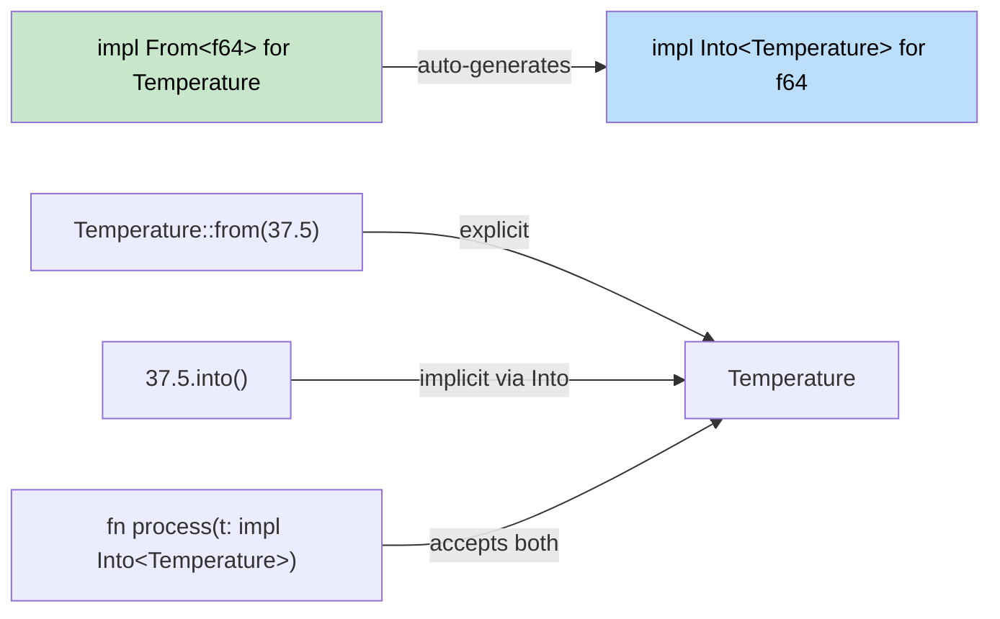

## Type Conversions in Rust<br><span class="zh-inline">Rust 中的类型转换</span>

> **What you'll learn:** `From`/`Into` traits vs C#'s implicit/explicit operators, `TryFrom`/`TryInto` for fallible conversions, `FromStr` for parsing, and idiomatic string conversion patterns.<br><span class="zh-inline">**本章将学到什么：** `From` / `Into` trait 和 C# 的隐式 / 显式转换运算符有何差别，`TryFrom` / `TryInto` 如何处理可能失败的转换，`FromStr` 如何用于解析，以及字符串转换的惯用写法。</span>
>
> **Difficulty:** 🟡 Intermediate<br><span class="zh-inline">**难度：** 🟡 进阶</span>

C# uses implicit/explicit conversions and casting operators. Rust uses the `From` and `Into` traits for safe, explicit conversions.<br><span class="zh-inline">C# 主要依赖隐式 / 显式转换和 cast 运算符。Rust 则把安全、显式的转换放进 `From` 和 `Into` trait 里。</span>

### C# Conversion Patterns<br><span class="zh-inline">C# 的转换模式</span>

```csharp
// C# implicit/explicit conversions
// C# 的隐式 / 显式转换
public class Temperature
{
    public double Celsius { get; }
    
    public Temperature(double celsius) { Celsius = celsius; }
    
    // Implicit conversion
    // 隐式转换
    public static implicit operator double(Temperature t) => t.Celsius;
    
    // Explicit conversion
    // 显式转换
    public static explicit operator Temperature(double d) => new Temperature(d);
}

double temp = new Temperature(100.0);  // implicit
Temperature t = (Temperature)37.5;     // explicit
```

### Rust From and Into<br><span class="zh-inline">Rust 里的 From 与 Into</span>

```rust
#[derive(Debug)]
struct Temperature {
    celsius: f64,
}

impl From<f64> for Temperature {
    fn from(celsius: f64) -> Self {
        Temperature { celsius }
    }
}

impl From<Temperature> for f64 {
    fn from(temp: Temperature) -> f64 {
        temp.celsius
    }
}

fn main() {
    // From
    let temp = Temperature::from(100.0);
    
    // Into (automatically available when From is implemented)
    let temp2: Temperature = 37.5.into();
    
    // Works in function arguments too
    fn process_temp(temp: impl Into<Temperature>) {
        let t: Temperature = temp.into();
        println!("Temperature: {:.1}°C", t.celsius);
    }
    
    process_temp(98.6);
    process_temp(Temperature { celsius: 0.0 });
}
```



> **Rule of thumb**: Implement `From`, and you get `Into` for free. Callers can use whichever reads better.<br><span class="zh-inline">**经验法则：** 只要实现了 `From`，`Into` 就会自动可用。调用方可以挑可读性更好的那种写法。</span>

### TryFrom for Fallible Conversions<br><span class="zh-inline">用 TryFrom 处理可能失败的转换</span>

```rust
use std::convert::TryFrom;

impl TryFrom<i32> for Temperature {
    type Error = String;
    
    fn try_from(value: i32) -> Result<Self, Self::Error> {
        if value < -273 {
            Err(format!("Temperature {}°C is below absolute zero", value))
        } else {
            Ok(Temperature { celsius: value as f64 })
        }
    }
}

fn main() {
    match Temperature::try_from(-300) {
        Ok(t) => println!("Valid: {:?}", t),
        Err(e) => println!("Error: {}", e),
    }
}
```

### String Conversions<br><span class="zh-inline">字符串转换</span>

```rust
// ToString via Display trait
// 通过 Display trait 自动获得 ToString
impl std::fmt::Display for Temperature {
    fn fmt(&self, f: &mut std::fmt::Formatter<'_>) -> std::fmt::Result {
        write!(f, "{:.1}°C", self.celsius)
    }
}

// Now .to_string() works automatically
// 现在就能自动使用 .to_string()
let s = Temperature::from(100.0).to_string(); // "100.0°C"

// FromStr for parsing
// 用 FromStr 做解析
use std::str::FromStr;

impl FromStr for Temperature {
    type Err = String;
    
    fn from_str(s: &str) -> Result<Self, Self::Err> {
        let s = s.trim_end_matches("°C").trim();
        let celsius: f64 = s.parse().map_err(|e| format!("Invalid temp: {}", e))?;
        Ok(Temperature { celsius })
    }
}

let t: Temperature = "100.0°C".parse().unwrap();
```

---

## Exercises<br><span class="zh-inline">练习</span>

<details>
<summary><strong>🏋️ Exercise: Currency Converter</strong> <span class="zh-inline">🏋️ 练习：货币转换器</span></summary>

Create a `Money` struct that demonstrates the full conversion ecosystem:<br><span class="zh-inline">创建一个 `Money` 结构体，把整套转换生态完整演示出来：</span>

1. `Money { cents: i64 }` (stores value in cents to avoid floating-point issues)<br><span class="zh-inline">1. `Money { cents: i64 }`，用分为单位存储，避免浮点误差。</span>
2. Implement `From<i64>` (treats input as whole dollars → `cents = dollars * 100`)<br><span class="zh-inline">2. 实现 `From<i64>`，把输入视为整美元，转成 `cents = dollars * 100`。</span>
3. Implement `TryFrom<f64>` — reject negative amounts, round to nearest cent<br><span class="zh-inline">3. 实现 `TryFrom<f64>`，拒绝负数金额，并四舍五入到最近的分。</span>
4. Implement `Display` to show `"$1.50"` format<br><span class="zh-inline">4. 实现 `Display`，输出成 `"$1.50"` 这种格式。</span>
5. Implement `FromStr` to parse `"$1.50"` or `"1.50"` back into `Money`<br><span class="zh-inline">5. 实现 `FromStr`，能够把 `"$1.50"` 或 `"1.50"` 解析回 `Money`。</span>
6. Write a function `fn total(items: &[impl Into<Money> + Copy]) -> Money` that sums values<br><span class="zh-inline">6. 写一个 `fn total(items: &[impl Into<Money> + Copy]) -> Money`，把一组值求和。</span>

<details>
<summary>🔑 Solution <span class="zh-inline">🔑 参考答案</span></summary>

```rust
use std::fmt;
use std::str::FromStr;

#[derive(Debug, Clone, Copy)]
struct Money { cents: i64 }

impl From<i64> for Money {
    fn from(dollars: i64) -> Self {
        Money { cents: dollars * 100 }
    }
}

impl TryFrom<f64> for Money {
    type Error = String;
    fn try_from(value: f64) -> Result<Self, Self::Error> {
        if value < 0.0 {
            Err(format!("negative amount: {value}"))
        } else {
            Ok(Money { cents: (value * 100.0).round() as i64 })
        }
    }
}

impl fmt::Display for Money {
    fn fmt(&self, f: &mut fmt::Formatter<'_>) -> fmt::Result {
        write!(f, "${}.{:02}", self.cents / 100, self.cents.abs() % 100)
    }
}

impl FromStr for Money {
    type Err = String;
    fn from_str(s: &str) -> Result<Self, Self::Err> {
        let s = s.trim_start_matches('$');
        let val: f64 = s.parse().map_err(|e| format!("{e}"))?;
        Money::try_from(val)
    }
}

fn main() {
    let a = Money::from(10);                       // $10.00
    let b = Money::try_from(3.50).unwrap();         // $3.50
    let c: Money = "$7.25".parse().unwrap();        // $7.25
    println!("{a} + {b} + {c}");
}
```

</details>
</details>

***
