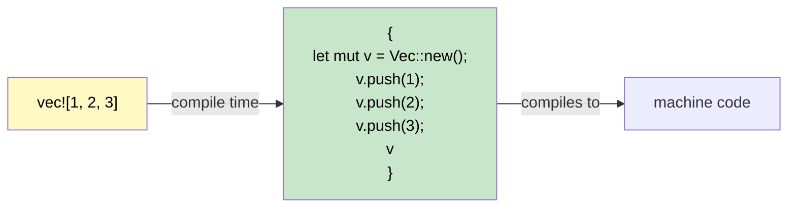

## Macros: Code That Writes Code<br><span class="zh-inline">宏：会生成代码的代码</span>

> **What you'll learn:** Why Rust needs macros (no overloading, no variadic args), `macro_rules!` basics, the `!` suffix convention, common derive macros, and `dbg!()` for quick debugging.<br><span class="zh-inline">**本章将学到什么：** 为什么 Rust 需要宏，例如它没有函数重载和可变参数；`macro_rules!` 的基本写法；`!` 后缀代表什么；常见 derive 宏的用途；以及 `dbg!()` 为什么是调试时的顺手工具。</span>
>
> **Difficulty:** 🟡 Intermediate<br><span class="zh-inline">**难度：** 🟡 进阶</span>

C# has no direct equivalent to Rust macros. Understanding why they exist and how they work removes a major source of confusion for C# developers.<br><span class="zh-inline">C# 里没有完全对应 Rust 宏的机制。所以很多 C# 开发者第一次看到 `println!`、`vec!`、`dbg!` 这种写法时，心里都会有点发毛。把“宏为什么存在、它到底在干什么”这件事弄明白，很多困惑就会自动消掉。</span>

### Why Macros Exist in Rust<br><span class="zh-inline">Rust 为什么需要宏</span>



```csharp
// C# has features that make macros unnecessary:
Console.WriteLine("Hello");           // Method overloading (1-16 params)
Console.WriteLine("{0}, {1}", a, b);  // Variadic via params array
var list = new List<int> { 1, 2, 3 }; // Collection initializer syntax
```

```rust
// Rust has NO function overloading, NO variadic arguments, NO special syntax.
// Macros fill these gaps:
println!("Hello");                    // Macro — handles 0+ args at compile time
println!("{}, {}", a, b);             // Macro — type-checked at compile time
let list = vec![1, 2, 3];            // Macro — expands to Vec::new() + push()
```

Rust 宏之所以存在，不是因为语言设计偷懒，而是因为 Rust 刻意没有引入一些会让类型系统和语义变复杂的特性，例如函数重载、可变参数和一堆特殊语法。<br><span class="zh-inline">于是宏就成了补这些表达力缺口的工具，而且它做的是编译期展开，不是 C/C++ 预处理器那种野蛮文本替换。</span>

### Recognizing Macros: The `!` Suffix<br><span class="zh-inline">识别宏：看 `!` 后缀</span>

Every macro invocation ends with `!`. If you see `!`, it's a macro, not a function:<br><span class="zh-inline">Rust 里宏调用都有一个非常直白的标志：后面跟 `!`。看到 `!`，先别当普通函数看。</span>

```rust
println!("hello");     // macro — generates format string code at compile time
format!("{x}");        // macro — returns String, compile-time format checking
vec![1, 2, 3];         // macro — creates and populates a Vec
todo!();               // macro — panics with "not yet implemented"
dbg!(expression);      // macro — prints file:line + expression + value, returns value
assert_eq!(a, b);      // macro — panics with diff if a ≠ b
cfg!(target_os = "linux"); // macro — compile-time platform detection
```

这个约定特别实用，因为它第一时间就把“这是普通函数调用”还是“这是编译期展开行为”区分开了。<br><span class="zh-inline">读代码时，只要看到 `!`，脑子里就该切换到“这段东西会在编译阶段变形”的模式。</span>

### Writing a Simple Macro with `macro_rules!`<br><span class="zh-inline">用 `macro_rules!` 写一个简单宏</span>

```rust
// Define a macro that creates a HashMap from key-value pairs
macro_rules! hashmap {
    // Pattern: key => value pairs separated by commas
    ( $( $key:expr => $value:expr ),* $(,)? ) => {{
        let mut map = std::collections::HashMap::new();
        $( map.insert($key, $value); )*
        map
    }};
}

fn main() {
    let scores = hashmap! {
        "Alice" => 100,
        "Bob"   => 85,
        "Carol" => 92,
    };
    println!("{scores:?}");
}
```

`macro_rules!` 最核心的思路，其实就是“按 token 结构做模式匹配”。它不是在处理字符串，而是在处理语法片段。<br><span class="zh-inline">所以它比 C/C++ 预处理宏靠谱得多，很多错误能在展开阶段或类型检查阶段直接暴露出来，不会把源码换成一锅文本浆糊。</span>

### Derive Macros: Auto-Implementing Traits<br><span class="zh-inline">derive 宏：自动实现 trait</span>

```rust
// #[derive] is a procedural macro that generates trait implementations
#[derive(Debug, Clone, PartialEq, Eq, Hash)]
struct User {
    name: String,
    age: u32,
}
// The compiler generates Debug::fmt, Clone::clone, PartialEq::eq, etc.
// automatically by examining the struct fields.
```

```csharp
// C# equivalent: none — you'd manually implement IEquatable, ICloneable, etc.
// Or use records: public record User(string Name, int Age);
// Records auto-generate Equals, GetHashCode, ToString — similar idea!
```

derive 宏是 Rust 日常开发里最常见的一类宏。它们会根据结构体或枚举的字段，自动生成 trait 实现。<br><span class="zh-inline">对 C# 开发者来说，可以把它理解成一种非常常用、非常轻量的编译期代码生成。虽然不完全等价，但和 record 自动生成某些成员有一点神似。</span>

### Common Derive Macros<br><span class="zh-inline">常见 derive 宏</span>

| Derive | Purpose<br><span class="zh-inline">用途</span> | C# Equivalent<br><span class="zh-inline">C# 里的近似对应</span> |
|--------|---------|---------------|
| `Debug` | `{:?}` format string output<br><span class="zh-inline">支持 `{:?}` 调试输出</span> | `ToString()` override |
| `Clone` | Deep copy via `.clone()`<br><span class="zh-inline">通过 `.clone()` 做复制</span> | `ICloneable` |
| `Copy` | Implicit bitwise copy (no `.clone()` needed)<br><span class="zh-inline">隐式按位复制，不需要 `.clone()`</span> | Value type (`struct`) semantics<br><span class="zh-inline">值类型语义</span> |
| `PartialEq`, `Eq` | `==` comparison<br><span class="zh-inline">支持 `==` 比较</span> | `IEquatable<T>` |
| `PartialOrd`, `Ord` | `<`, `>` comparison + sorting<br><span class="zh-inline">支持排序与大小比较</span> | `IComparable<T>` |
| `Hash` | Hashing for `HashMap` keys<br><span class="zh-inline">用于 `HashMap` 键哈希</span> | `GetHashCode()` |
| `Default` | Default values via `Default::default()`<br><span class="zh-inline">提供默认值</span> | Parameterless constructor<br><span class="zh-inline">无参构造的近似概念</span> |
| `Serialize`, `Deserialize` | JSON/TOML/etc. (serde)<br><span class="zh-inline">支持 JSON、TOML 等序列化</span> | `[JsonProperty]` attributes<br><span class="zh-inline">以及配套序列化机制</span> |

> **Rule of thumb:** Start with `#[derive(Debug)]` on every type. Add `Clone`, `PartialEq` when needed. Add `Serialize, Deserialize` for any type that crosses a boundary (API, file, database).<br><span class="zh-inline">**经验法则：** 新类型一般先加 `#[derive(Debug)]`。需要复制时再加 `Clone`，需要比较时再加 `PartialEq`。凡是跨边界的数据类型，例如 API、文件、数据库对象，通常都应该考虑 `Serialize` 和 `Deserialize`。</span>

### Procedural & Attribute Macros (Awareness Level)<br><span class="zh-inline">过程宏与属性宏，先建立概念就够了</span>

Derive macros are one kind of **procedural macro** — code that runs at compile time to generate code. You'll encounter two other forms:<br><span class="zh-inline">derive 宏只是**过程宏**的一种。过程宏本质上是在编译期运行、再生成代码的逻辑。除此之外，还常见另外两种形式：</span>

**Attribute macros** — attached to items with `#[...]`:<br><span class="zh-inline">**属性宏**：挂在 `#[...]` 上，贴到函数、模块、类型等条目上。</span>

```rust
#[tokio::main]          // turns main() into an async runtime entry point
async fn main() { }

#[test]                 // marks a function as a unit test
fn it_works() { assert_eq!(2 + 2, 4); }

#[cfg(test)]            // conditionally compile this module only during testing
mod tests { /* ... */ }
```

**Function-like macros** — look like function calls:<br><span class="zh-inline">**函数式宏**：外形像函数调用，但本质还是宏展开。</span>

```rust
// sqlx::query! verifies your SQL against the database at compile time
let users = sqlx::query!("SELECT id, name FROM users WHERE active = $1", true)
    .fetch_all(&pool)
    .await?;
```

> **Key insight for C# developers:** You rarely *write* procedural macros — they're an advanced library-author tool. But you *use* them constantly (`#[derive(...)]`, `#[tokio::main]`, `#[test]`). Think of them like C# source generators: you benefit from them without implementing them.<br><span class="zh-inline">**给 C# 开发者的关键提示：** 过程宏通常不是日常业务开发里要亲手去写的东西，那更像库作者的进阶武器。但用到它们的机会非常多，例如 `#[derive(...)]`、`#[tokio::main]`、`#[test]`。可以把它们理解成更贴近语言核心的源码生成能力。</span>

### Conditional Compilation with `#[cfg]`<br><span class="zh-inline">用 `#[cfg]` 做条件编译</span>

Rust's `#[cfg]` attributes are like C#'s `#if DEBUG` preprocessor directives, but type-checked:<br><span class="zh-inline">Rust 的 `#[cfg]` 属性和 C# 的 `#if DEBUG` 有点像，但它更贴近语义层，而且依然会受到类型系统约束：</span>

```rust
// Compile this function only on Linux
#[cfg(target_os = "linux")]
fn platform_specific() {
    println!("Running on Linux");
}

// Debug-only assertions (like C# Debug.Assert)
#[cfg(debug_assertions)]
fn expensive_check(data: &[u8]) {
    assert!(data.len() < 1_000_000, "data unexpectedly large");
}

// Feature flags (like C# #if FEATURE_X, but declared in Cargo.toml)
#[cfg(feature = "json")]
pub fn to_json<T: Serialize>(val: &T) -> String {
    serde_json::to_string(val).unwrap()
}
```

```csharp
// C# equivalent
#if DEBUG
    Debug.Assert(data.Length < 1_000_000);
#endif
```

Rust 这里的条件编译，和宏系统一起构成了非常强的编译期控制能力。平台分支、特性开关、测试代码隔离，基本都能优雅处理。<br><span class="zh-inline">重点在于，这些机制不是纯文本拼接，而是和语言语义深度结合的。</span>

### `dbg!()` — Your Best Friend for Debugging<br><span class="zh-inline">`dbg!()`：调试时的顺手神器</span>

```rust
fn calculate(x: i32) -> i32 {
    let intermediate = dbg!(x * 2);     // prints: [src/main.rs:3] x * 2 = 10
    let result = dbg!(intermediate + 1); // prints: [src/main.rs:4] intermediate + 1 = 11
    result
}
// dbg! prints to stderr, includes file:line, and returns the value
// Far more useful than Console.WriteLine for debugging!
```

`dbg!()` 这个宏非常适合临时插桩。它会把文件名、行号、表达式文本和表达式结果一起打出来，而且最妙的是它**会把原值返回回去**。<br><span class="zh-inline">所以它可以直接包住表达式，不需要像 `Console.WriteLine` 那样拆开写一堆额外调试代码。</span>

<details>
<summary><strong>🏋️ Exercise: Write a min! Macro</strong> <span class="zh-inline">🏋️ 练习：写一个 `min!` 宏</span></summary>

**Challenge**: Write a `min!` macro that accepts 2 or more arguments and returns the smallest.<br><span class="zh-inline">**挑战题：** 写一个 `min!` 宏，接收两个或更多参数，并返回最小值。</span>

```rust
// Should work like:
let smallest = min!(5, 3, 8, 1, 4); // → 1
let pair = min!(10, 20);             // → 10
```

<details>
<summary>🔑 Solution <span class="zh-inline">🔑 参考答案</span></summary>

```rust
macro_rules! min {
    // Base case: single value
    ($x:expr) => ($x);
    // Recursive: compare first with min of rest
    ($x:expr, $($rest:expr),+) => {{
        let first = $x;
        let rest = min!($($rest),+);
        if first < rest { first } else { rest }
    }};
}

fn main() {
    assert_eq!(min!(5, 3, 8, 1, 4), 1);
    assert_eq!(min!(10, 20), 10);
    assert_eq!(min!(42), 42);
    println!("All assertions passed!");
}
```

**Key takeaway**: `macro_rules!` uses pattern matching on token trees — it's like `match` but for code structure instead of values.<br><span class="zh-inline">**关键点：** `macro_rules!` 做的是 token tree 层面的模式匹配。可以把它想成“给代码结构做 `match`”，而不是给运行时值做 `match`。</span>

</details>
</details>

***
