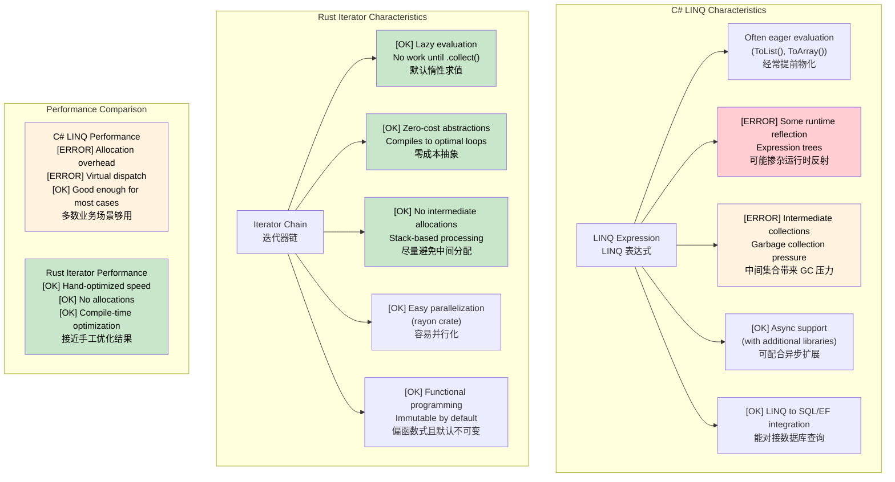

## Rust Closures<br><span class="zh-inline">Rust 闭包</span>

> **What you'll learn:** Closures with ownership-aware captures (`Fn` / `FnMut` / `FnOnce`) compared with C# lambdas, Rust iterators as a zero-cost alternative to LINQ, lazy vs eager evaluation, and parallel iteration with `rayon`.<br><span class="zh-inline">**本章将学到什么：** 对照理解带所有权语义的 Rust 闭包捕获方式 `Fn` / `FnMut` / `FnOnce`，理解 Rust 迭代器怎样作为 LINQ 的零成本替代方案，并看清惰性求值、立即求值，以及 `rayon` 并行迭代的基本思路。</span>
>
> **Difficulty:** 🟡 Intermediate<br><span class="zh-inline">**难度：** 🟡 进阶</span>

Closures in Rust are similar to C# lambdas and delegates, but their captures are aware of ownership and borrowing.<br><span class="zh-inline">Rust 的闭包和 C# 的 lambda、delegate 看起来很像，但真正的区别在捕获语义上。Rust 会把所有权、借用、可变性这些事情一起算进去，这也正是它后劲大的地方。</span>

### C# Lambdas and Delegates<br><span class="zh-inline">C# 的 Lambda 与委托</span>

```csharp
// C# - Lambdas capture by reference
Func<int, int> doubler = x => x * 2;
Action<string> printer = msg => Console.WriteLine(msg);

// Closure capturing outer variables
int multiplier = 3;
Func<int, int> multiply = x => x * multiplier;
Console.WriteLine(multiply(5)); // 15

// LINQ uses lambdas extensively
var evens = numbers.Where(n => n % 2 == 0).ToList();
```

### Rust Closures<br><span class="zh-inline">Rust 闭包</span>

```rust
// Rust closures - ownership-aware
let doubler = |x: i32| x * 2;
let printer = |msg: &str| println!("{}", msg);

// Closure capturing by reference (default for immutable)
let multiplier = 3;
let multiply = |x: i32| x * multiplier; // borrows multiplier
println!("{}", multiply(5)); // 15
println!("{}", multiplier); // still accessible

// Closure capturing by move
let data = vec![1, 2, 3];
let owns_data = move || {
    println!("{:?}", data); // data moved into closure
};
owns_data();
// println!("{:?}", data); // ERROR: data was moved

// Using closures with iterators
let numbers = vec![1, 2, 3, 4, 5];
let evens: Vec<&i32> = numbers.iter().filter(|&&n| n % 2 == 0).collect();
```

这段对照里最要命的区别就是 `move`。<br><span class="zh-inline">在 C# 里，很多时候脑子里只需要想“能不能访问到外层变量”；在 Rust 里，还得继续问一句：它是借过来，还是拿走了所有权。这个判断会直接影响闭包能活多久、能不能多次调用、能不能跨线程跑。</span>

### Closure Types<br><span class="zh-inline">闭包类型</span>

```rust
// Fn - borrows captured values immutably
fn apply_fn(f: impl Fn(i32) -> i32, x: i32) -> i32 {
    f(x)
}

// FnMut - borrows captured values mutably
fn apply_fn_mut(mut f: impl FnMut(i32), values: &[i32]) {
    for &v in values {
        f(v);
    }
}

// FnOnce - takes ownership of captured values
fn apply_fn_once(f: impl FnOnce() -> Vec<i32>) -> Vec<i32> {
    f() // can only call once
}

fn main() {
    // Fn example
    let multiplier = 3;
    let result = apply_fn(|x| x * multiplier, 5);
    
    // FnMut example
    let mut sum = 0;
    apply_fn_mut(|x| sum += x, &[1, 2, 3, 4, 5]);
    println!("Sum: {}", sum); // 15
    
    // FnOnce example
    let data = vec![1, 2, 3];
    let result = apply_fn_once(move || data); // moves data
}
```

`Fn`、`FnMut`、`FnOnce` 乍一看像故意折腾人，实际上它们是在把“闭包到底怎么用捕获值”讲得很清楚。<br><span class="zh-inline">只要把这三个名字记成“只读借用、可变借用、拿走所有权”，后面很多泛型 API 一下就能看懂，不至于瞅着 trait bound 发懵。</span>

***

## LINQ vs Rust Iterators<br><span class="zh-inline">LINQ 与 Rust 迭代器对照</span>

### C# LINQ (Language Integrated Query)<br><span class="zh-inline">C# LINQ（语言集成查询）</span>

```csharp
// C# LINQ - Declarative data processing
var numbers = new[] { 1, 2, 3, 4, 5, 6, 7, 8, 9, 10 };

var result = numbers
    .Where(n => n % 2 == 0)           // Filter even numbers
    .Select(n => n * n)               // Square them
    .Where(n => n > 10)               // Filter > 10
    .OrderByDescending(n => n)        // Sort descending
    .Take(3)                          // Take first 3
    .ToList();                        // Materialize

// LINQ with complex objects
var users = GetUsers();
var activeAdults = users
    .Where(u => u.IsActive && u.Age >= 18)
    .GroupBy(u => u.Department)
    .Select(g => new {
        Department = g.Key,
        Count = g.Count(),
        AverageAge = g.Average(u => u.Age)
    })
    .OrderBy(x => x.Department)
    .ToList();

// Async LINQ (with additional libraries)
var results = await users
    .ToAsyncEnumerable()
    .WhereAwait(async u => await IsActiveAsync(u.Id))
    .SelectAwait(async u => await EnrichUserAsync(u))
    .ToListAsync();
```

### Rust Iterators<br><span class="zh-inline">Rust 迭代器</span>

```rust
// Rust iterators - Lazy, zero-cost abstractions
let numbers = vec![1, 2, 3, 4, 5, 6, 7, 8, 9, 10];

let result: Vec<i32> = numbers
    .iter()
    .filter(|&&n| n % 2 == 0)        // Filter even numbers
    .map(|&n| n * n)                 // Square them
    .filter(|&n| n > 10)             // Filter > 10
    .collect::<Vec<_>>()             // Collect to Vec
    .into_iter()
    .rev()                           // Reverse (descending sort)
    .take(3)                         // Take first 3
    .collect();                      // Materialize

// Complex iterator chains
use std::collections::HashMap;

#[derive(Debug, Clone)]
struct User {
    name: String,
    age: u32,
    department: String,
    is_active: bool,
}

fn process_users(users: Vec<User>) -> HashMap<String, (usize, f64)> {
    users
        .into_iter()
        .filter(|u| u.is_active && u.age >= 18)
        .fold(HashMap::new(), |mut acc, user| {
            let entry = acc.entry(user.department.clone()).or_insert((0, 0.0));
            entry.0 += 1;  // count
            entry.1 += user.age as f64;  // sum of ages
            acc
        })
        .into_iter()
        .map(|(dept, (count, sum))| (dept, (count, sum / count as f64)))  // average
        .collect()
}

// Parallel processing with rayon
use rayon::prelude::*;

fn parallel_processing(numbers: Vec<i32>) -> Vec<i32> {
    numbers
        .par_iter()                  // Parallel iterator
        .filter(|&&n| n % 2 == 0)
        .map(|&n| expensive_computation(n))
        .collect()
}

fn expensive_computation(n: i32) -> i32 {
    // Simulate heavy computation
    (0..1000).fold(n, |acc, _| acc + 1)
}
```

Rust 迭代器和 LINQ 的表面相似度很高，但底层心态差不少。<br><span class="zh-inline">LINQ 很容易让人顺手 `.ToList()` 把中间结果全堆出来；Rust 迭代器默认更偏惰性，也更强调把整条变换链交给编译器优化成紧凑循环。这就是“写法像函数式，结果像手写循环”的那层意思。</span>



***

<details>
<summary><strong>🏋️ Exercise: LINQ to Iterators Translation</strong><br><span class="zh-inline"><strong>🏋️ 练习：把 LINQ 管道翻成 Rust 迭代器</strong></span></summary>

**Challenge**: Translate this C# LINQ pipeline to idiomatic Rust iterators.<br><span class="zh-inline">**挑战：** 把下面这段 C# LINQ 流水线改写成更地道的 Rust 迭代器写法。</span>

```csharp
// C# — translate to Rust
record Employee(string Name, string Dept, int Salary);

var result = employees
    .Where(e => e.Salary > 50_000)
    .GroupBy(e => e.Dept)
    .Select(g => new {
        Department = g.Key,
        Count = g.Count(),
        AvgSalary = g.Average(e => e.Salary)
    })
    .OrderByDescending(x => x.AvgSalary)
    .ToList();
```

<details>
<summary>🔑 Solution<br><span class="zh-inline">🔑 参考答案</span></summary>

```rust
use std::collections::HashMap;

struct Employee { name: String, dept: String, salary: u32 }

#[derive(Debug)]
struct DeptStats { department: String, count: usize, avg_salary: f64 }

fn department_stats(employees: &[Employee]) -> Vec<DeptStats> {
    let mut by_dept: HashMap<&str, Vec<u32>> = HashMap::new();
    for e in employees.iter().filter(|e| e.salary > 50_000) {
        by_dept.entry(&e.dept).or_default().push(e.salary);
    }

    let mut stats: Vec<DeptStats> = by_dept
        .into_iter()
        .map(|(dept, salaries)| {
            let count = salaries.len();
            let avg = salaries.iter().sum::<u32>() as f64 / count as f64;
            DeptStats { department: dept.to_string(), count, avg_salary: avg }
        })
        .collect();

    stats.sort_by(|a, b| b.avg_salary.partial_cmp(&a.avg_salary).unwrap());
    stats
}
```

**Key takeaways:**<br><span class="zh-inline">**这一题最该记住的点：**</span>

- Rust has no built-in `group_by` on iterators, so `HashMap` plus `fold` or a plain `for` loop is usually the idiomatic answer.<br><span class="zh-inline">标准库迭代器没有内建 `group_by`，所以用 `HashMap` 配 `fold` 或普通 `for` 循环，反而更地道。</span>
- The `itertools` crate can add a more LINQ-like `.group_by()` style when needed.<br><span class="zh-inline">如果确实想要更接近 LINQ 的写法，可以再引入 `itertools`。</span>
- Iterator chains are zero-cost, so readability and performance often可以兼得。<br><span class="zh-inline">迭代器链本身属于零成本抽象，很多时候可读性和性能可以一起拿，不用老担心是不是“写得太函数式就变慢”。</span>

</details>
</details>

<!-- ch12.0a: itertools — LINQ Power Tools -->
## itertools: The Missing LINQ Operations<br><span class="zh-inline">`itertools`：补齐 LINQ 味道更浓的操作</span>

Standard Rust iterators already cover `map`, `filter`, `fold`, `take`, and `collect`, but C# developers will quickly notice the absence of familiar things like `GroupBy`, `Chunk`, `SelectMany`, or `DistinctBy`. The `itertools` crate fills many of those gaps.<br><span class="zh-inline">标准库迭代器已经有 `map`、`filter`、`fold`、`take`、`collect` 这些核心能力，但 C# 开发者很快就会想起 `GroupBy`、`Chunk`、`SelectMany`、`DistinctBy` 这些顺手招式。`itertools` 干的就是补这块。</span>

```toml
# Cargo.toml
[dependencies]
itertools = "0.12"
```

### Side-by-Side: LINQ vs itertools<br><span class="zh-inline">并排对照：LINQ 与 `itertools`</span>

```csharp
// C# — GroupBy
var byDept = employees.GroupBy(e => e.Department)
    .Select(g => new { Dept = g.Key, Count = g.Count() });

// C# — Chunk (batching)
var batches = items.Chunk(100);  // IEnumerable<T[]>

// C# — Distinct / DistinctBy
var unique = users.DistinctBy(u => u.Email);

// C# — SelectMany (flatten)
var allTags = posts.SelectMany(p => p.Tags);

// C# — Zip
var pairs = names.Zip(scores, (n, s) => new { Name = n, Score = s });

// C# — Sliding window
var windows = data.Zip(data.Skip(1), data.Skip(2))
    .Select(triple => (triple.First + triple.Second + triple.Third) / 3.0);
```

```rust
use itertools::Itertools;

// Rust — group_by (requires sorted input)
let by_dept = employees.iter()
    .sorted_by_key(|e| &e.department)
    .group_by(|e| &e.department);
for (dept, group) in &by_dept {
    println!("{}: {} employees", dept, group.count());
}

// Rust — chunks (batching)
let batches = items.iter().chunks(100);
for batch in &batches {
    process_batch(batch.collect::<Vec<_>>());
}

// Rust — unique / unique_by
let unique: Vec<_> = users.iter().unique_by(|u| &u.email).collect();

// Rust — flat_map (SelectMany equivalent — built-in!)
let all_tags: Vec<&str> = posts.iter().flat_map(|p| &p.tags).collect();

// Rust — zip (built-in!)
let pairs: Vec<_> = names.iter().zip(scores.iter()).collect();

// Rust — tuple_windows (sliding window)
let moving_avg: Vec<f64> = data.iter()
    .tuple_windows::<(_, _, _)>()
    .map(|(a, b, c)| (*a + *b + *c) as f64 / 3.0)
    .collect();
```

`itertools` 最大的价值，就是把很多“标准库故意没塞进去”的高阶操作补上。<br><span class="zh-inline">但也别误会成“用了它才算正宗 Rust”。很多场景下，标准库迭代器加一小段显式代码已经很好；只有在可读性真的更好时，再把 `itertools` 搬上来会更舒服。</span>

### itertools Quick Reference<br><span class="zh-inline">`itertools` 速查表</span>

| LINQ Method<br><span class="zh-inline">LINQ 方法</span> | itertools Equivalent<br><span class="zh-inline">`itertools` 对应写法</span> | Notes<br><span class="zh-inline">说明</span> |
|------------|---------------------|-------|
| `GroupBy(key)`<br><span class="zh-inline">`GroupBy(key)`</span> | `.sorted_by_key().group_by()`<br><span class="zh-inline">`.sorted_by_key().group_by()`</span> | Requires sorted input<br><span class="zh-inline">和 LINQ 不同，这里通常要先排序。</span> |
| `Chunk(n)`<br><span class="zh-inline">`Chunk(n)`</span> | `.chunks(n)`<br><span class="zh-inline">`.chunks(n)`</span> | Returns iterator of iterators<br><span class="zh-inline">返回的是“迭代器的迭代器”。</span> |
| `Distinct()`<br><span class="zh-inline">`Distinct()`</span> | `.unique()`<br><span class="zh-inline">`.unique()`</span> | Requires `Eq + Hash`<br><span class="zh-inline">元素需要支持 `Eq + Hash`。</span> |
| `DistinctBy(key)`<br><span class="zh-inline">`DistinctBy(key)`</span> | `.unique_by(key)`<br><span class="zh-inline">`.unique_by(key)`</span> | Filter by projection<br><span class="zh-inline">按投影键去重。</span> |
| `SelectMany()`<br><span class="zh-inline">`SelectMany()`</span> | `.flat_map()`<br><span class="zh-inline">`.flat_map()`</span> | Built into std<br><span class="zh-inline">标准库原生就有。</span> |
| `Zip()`<br><span class="zh-inline">`Zip()`</span> | `.zip()`<br><span class="zh-inline">`.zip()`</span> | Built into std<br><span class="zh-inline">标准库原生就有。</span> |
| `Aggregate()`<br><span class="zh-inline">`Aggregate()`</span> | `.fold()`<br><span class="zh-inline">`.fold()`</span> | Built into std<br><span class="zh-inline">标准库原生就有。</span> |
| `Any()` / `All()`<br><span class="zh-inline">`Any()` / `All()`</span> | `.any()` / `.all()`<br><span class="zh-inline">`.any()` / `.all()`</span> | Built into std<br><span class="zh-inline">标准库原生就有。</span> |
| `First()` / `Last()`<br><span class="zh-inline">`First()` / `Last()`</span> | `.next()` / `.last()`<br><span class="zh-inline">`.next()` / `.last()`</span> | Built into std<br><span class="zh-inline">标准库原生就有。</span> |
| `Skip(n)` / `Take(n)`<br><span class="zh-inline">`Skip(n)` / `Take(n)`</span> | `.skip(n)` / `.take(n)`<br><span class="zh-inline">`.skip(n)` / `.take(n)`</span> | Built into std<br><span class="zh-inline">标准库原生就有。</span> |
| `OrderBy()`<br><span class="zh-inline">`OrderBy()`</span> | `.sorted()` / `.sorted_by()`<br><span class="zh-inline">`.sorted()` / `.sorted_by()`</span> | Provided by `itertools`<br><span class="zh-inline">标准库迭代器本身没有这个。</span> |
| `ThenBy()`<br><span class="zh-inline">`ThenBy()`</span> | `.sorted_by(\|a,b\| a.x.cmp(&b.x).then(a.y.cmp(&b.y)))`<br><span class="zh-inline">链式组合 `Ordering::then`</span> | Chain orderings<br><span class="zh-inline">通过多个排序条件串起来。</span> |
| `Intersect()`<br><span class="zh-inline">`Intersect()`</span> | `HashSet` intersection<br><span class="zh-inline">`HashSet` 交集</span> | No direct iterator method<br><span class="zh-inline">没有完全对等的直接方法。</span> |
| `Concat()`<br><span class="zh-inline">`Concat()`</span> | `.chain()`<br><span class="zh-inline">`.chain()`</span> | Built into std<br><span class="zh-inline">标准库原生就有。</span> |
| Sliding window<br><span class="zh-inline">滑动窗口</span> | `.tuple_windows()`<br><span class="zh-inline">`.tuple_windows()`</span> | Fixed-size tuples<br><span class="zh-inline">适合固定窗口大小。</span> |
| Cartesian product<br><span class="zh-inline">笛卡尔积</span> | `.cartesian_product()`<br><span class="zh-inline">`.cartesian_product()`</span> | `itertools`<br><span class="zh-inline">由 `itertools` 提供。</span> |
| Interleave<br><span class="zh-inline">交错合并</span> | `.interleave()`<br><span class="zh-inline">`.interleave()`</span> | `itertools`<br><span class="zh-inline">由 `itertools` 提供。</span> |
| Permutations<br><span class="zh-inline">排列</span> | `.permutations(k)`<br><span class="zh-inline">`.permutations(k)`</span> | `itertools`<br><span class="zh-inline">由 `itertools` 提供。</span> |

### Real-World Example: Log Analysis Pipeline<br><span class="zh-inline">真实例子：日志分析流水线</span>

```rust
use itertools::Itertools;
use std::collections::HashMap;

#[derive(Debug)]
struct LogEntry { level: String, module: String, message: String }

fn analyze_logs(entries: &[LogEntry]) {
    // Top 5 noisiest modules (like LINQ GroupBy + OrderByDescending + Take)
    let noisy: Vec<_> = entries.iter()
        .into_group_map_by(|e| &e.module) // itertools: direct group into HashMap
        .into_iter()
        .sorted_by(|a, b| b.1.len().cmp(&a.1.len()))
        .take(5)
        .collect();

    for (module, entries) in &noisy {
        println!("{}: {} entries", module, entries.len());
    }

    // Error rate per 100-entry window (sliding window)
    let error_rates: Vec<f64> = entries.iter()
        .map(|e| if e.level == "ERROR" { 1.0 } else { 0.0 })
        .collect::<Vec<_>>()
        .windows(100)  // std slice method
        .map(|w| w.iter().sum::<f64>() / 100.0)
        .collect();

    // Deduplicate consecutive identical messages
    let deduped: Vec<_> = entries.iter().dedup_by(|a, b| a.message == b.message).collect();
    println!("Deduped {} → {} entries", entries.len(), deduped.len());
}
```

这个例子挺能说明问题。<br><span class="zh-inline">真正做业务时，很少有人只写 `map`、`filter` 两板斧。分组、排序、截断、窗口统计、去重这些动作经常是绑着来的，`itertools` 在这种时候就很顶。</span>

***
