```mermaid
graph TD
    subgraph "C# Thread Safety Challenges"
        CS_MANUAL["Manual synchronization<br/>手动同步"]
        CS_LOCKS["lock statements<br/>lock 语句"]
        CS_CONCURRENT["ConcurrentCollections<br/>并发集合"]
        CS_VOLATILE["volatile fields<br/>volatile 字段"]
        CS_FORGET["😰 Easy to forget locks<br/>很容易漏锁"]
        CS_DEADLOCK["💀 Deadlock possible<br/>可能死锁"]
        CS_RACE["🏃 Race conditions<br/>可能出现竞争条件"]
        CS_OVERHEAD["⚡ Runtime overhead<br/>运行时开销"]
        
        CS_MANUAL --> CS_LOCKS
        CS_MANUAL --> CS_CONCURRENT
        CS_MANUAL --> CS_VOLATILE
        CS_LOCKS --> CS_FORGET
        CS_LOCKS --> CS_DEADLOCK
        CS_FORGET --> CS_RACE
        CS_LOCKS --> CS_OVERHEAD
    end
    
    subgraph "Rust Type System Guarantees"
        RUST_OWNERSHIP["Ownership system<br/>所有权系统"]
        RUST_BORROWING["Borrow checker<br/>借用检查器"]
        RUST_SEND["Send trait<br/>Send trait"]
        RUST_SYNC["Sync trait<br/>Sync trait"]
        RUST_ARC["Arc&lt;Mutex&lt;T&gt;&gt;<br/>共享可变状态模式"]
        RUST_CHANNELS["Message passing<br/>消息传递"]
        RUST_SAFE["✅ Data races impossible<br/>数据竞争无法通过编译"]
        RUST_FAST["⚡ Zero-cost abstractions<br/>零成本抽象"]
        
        RUST_OWNERSHIP --> RUST_BORROWING
        RUST_BORROWING --> RUST_SEND
        RUST_SEND --> RUST_SYNC
        RUST_SYNC --> RUST_ARC
        RUST_ARC --> RUST_CHANNELS
        RUST_CHANNELS --> RUST_SAFE
        RUST_SAFE --> RUST_FAST
    end
    
    style CS_FORGET fill:#ffcdd2,color:#000
    style CS_DEADLOCK fill:#ffcdd2,color:#000
    style CS_RACE fill:#ffcdd2,color:#000
    style RUST_SAFE fill:#c8e6c9,color:#000
    style RUST_FAST fill:#c8e6c9,color:#000
```

## Thread Safety: Convention vs Type System Guarantees<br><span class="zh-inline">线程安全：约定式管理与类型系统保证</span>

> **What you'll learn:** How Rust enforces thread safety at compile time compared with C#'s convention-based approach, `Arc&lt;Mutex&lt;T&gt;&gt;` vs `lock`, channels vs `ConcurrentQueue`, `Send` / `Sync`, scoped threads, and the bridge to async/await.<br><span class="zh-inline">**本章将学到什么：** 对照理解 Rust 如何在编译期保证线程安全，理解 `Arc&lt;Mutex&lt;T&gt;&gt;` 与 `lock` 的对应关系、channel 与 `ConcurrentQueue` 的区别、`Send` / `Sync` 的含义、作用域线程的用法，以及它和 async/await 之间的衔接。</span>
>
> **Difficulty:** 🔴 Advanced<br><span class="zh-inline">**难度：** 🔴 高阶</span>

> **Deep dive**: For production async patterns such as stream processing, graceful shutdown, connection pooling, and cancellation safety, see the companion [Async Rust Training](../../async-book/src/SUMMARY.md) guide.<br><span class="zh-inline">**深入阅读：** 如果要继续看生产环境里的异步模式，例如流处理、优雅停机、连接池、取消安全，可以接着读配套的 [Async Rust Training](../../async-book/src/SUMMARY.md) 指南。</span>
>
> **Prerequisites**: [Ownership & Borrowing](ch07-ownership-and-borrowing.md) and [Smart Pointers](ch07-3-smart-pointers-beyond-single-ownership.md).<br><span class="zh-inline">**前置知识：** 先掌握 [所有权与借用](ch07-ownership-and-borrowing.md) 以及 [智能指针](ch07-3-smart-pointers-beyond-single-ownership.md) 会更顺。</span>

### C# - Thread Safety by Convention<br><span class="zh-inline">C#：靠约定维护线程安全</span>

```csharp
// C# collections aren't thread-safe by default
public class UserService
{
    private readonly List<string> items = new();
    private readonly Dictionary<int, User> cache = new();

    // This can cause data races:
    public void AddItem(string item)
    {
        items.Add(item);  // Not thread-safe!
    }

    // Must use locks manually:
    private readonly object lockObject = new();

    public void SafeAddItem(string item)
    {
        lock (lockObject)
        {
            items.Add(item);  // Safe, but runtime overhead
        }
        // Easy to forget the lock elsewhere
    }

    // ConcurrentCollection helps but limited:
    private readonly ConcurrentBag<string> safeItems = new();
    
    public void ConcurrentAdd(string item)
    {
        safeItems.Add(item);  // Thread-safe but limited operations
    }

    // Complex shared state management
    private readonly ConcurrentDictionary<int, User> threadSafeCache = new();
    private volatile bool isShutdown = false;
    
    public async Task ProcessUser(int userId)
    {
        if (isShutdown) return;  // Race condition possible!
        
        var user = await GetUser(userId);
        threadSafeCache.TryAdd(userId, user);  // Must remember which collections are safe
    }

    // Thread-local storage requires careful management
    private static readonly ThreadLocal<Random> threadLocalRandom = 
        new ThreadLocal<Random>(() => new Random());
        
    public int GetRandomNumber()
    {
        return threadLocalRandom.Value.Next();  // Safe but manual management
    }
}

// Event handling with potential race conditions
public class EventProcessor
{
    public event Action<string> DataReceived;
    private readonly List<string> eventLog = new();
    
    public void OnDataReceived(string data)
    {
        // Race condition - event might be null between check and invocation
        if (DataReceived != null)
        {
            DataReceived(data);
        }
        
        // Another race condition - list not thread-safe
        eventLog.Add($"Processed: {data}");
    }
}
```

这段 C# 代码看着挺正常，但问题就在于“靠人记住规则”。<br><span class="zh-inline">什么时候该加锁，哪类集合能并发用，事件触发时有没有竞争条件，很多地方都得开发者自己绷紧神经。只要哪次手一抖漏了一个点，运行时就开始整活。</span>

### Rust - Thread Safety Guaranteed by Type System<br><span class="zh-inline">Rust：由类型系统保证线程安全</span>

```rust
use std::sync::{Arc, Mutex, RwLock};
use std::thread;
use std::collections::HashMap;
use tokio::sync::{mpsc, broadcast};

// Rust prevents data races at compile time
pub struct UserService {
    items: Arc<Mutex<Vec<String>>>,
    cache: Arc<RwLock<HashMap<i32, User>>>,
}

impl UserService {
    pub fn new() -> Self {
        UserService {
            items: Arc::new(Mutex::new(Vec::new())),
            cache: Arc::new(RwLock::new(HashMap::new())),
        }
    }
    
    pub fn add_item(&self, item: String) {
        let mut items = self.items.lock().unwrap();
        items.push(item);
        // Lock automatically released when `items` goes out of scope
    }
    
    // Multiple readers, single writer - automatically enforced
    pub async fn get_user(&self, user_id: i32) -> Option<User> {
        let cache = self.cache.read().unwrap();
        cache.get(&user_id).cloned()
    }
    
    pub async fn cache_user(&self, user_id: i32, user: User) {
        let mut cache = self.cache.write().unwrap();
        cache.insert(user_id, user);
    }
    
    // Clone the Arc for thread sharing
    pub fn process_in_background(&self) {
        let items = Arc::clone(&self.items);
        
        thread::spawn(move || {
            let items = items.lock().unwrap();
            for item in items.iter() {
                println!("Processing: {}", item);
            }
        });
    }
}

// Channel-based communication - no shared state needed
pub struct MessageProcessor {
    sender: mpsc::UnboundedSender<String>,
}

impl MessageProcessor {
    pub fn new() -> (Self, mpsc::UnboundedReceiver<String>) {
        let (tx, rx) = mpsc::unbounded_channel();
        (MessageProcessor { sender: tx }, rx)
    }
    
    pub fn send_message(&self, message: String) -> Result<(), mpsc::error::SendError<String>> {
        self.sender.send(message)
    }
}

// This won't compile - Rust prevents sharing mutable data unsafely:
fn impossible_data_race() {
    let mut items = vec![1, 2, 3];
    
    // This won't compile - cannot move `items` into multiple closures
    /*
    thread::spawn(move || {
        items.push(4);  // ERROR: use of moved value
    });
    
    thread::spawn(move || {
        items.push(5);  // ERROR: use of moved value  
    });
    */
}

// Safe concurrent data processing
use rayon::prelude::*;

fn parallel_processing() {
    let data = vec![1, 2, 3, 4, 5];
    
    // Parallel iteration - guaranteed thread-safe
    let results: Vec<i32> = data
        .par_iter()
        .map(|&x| x * x)
        .collect();
        
    println!("{:?}", results);
}

// Async concurrency with message passing
async fn async_message_passing() {
    let (tx, mut rx) = mpsc::channel(100);
    
    // Producer task
    let producer = tokio::spawn(async move {
        for i in 0..10 {
            if tx.send(i).await.is_err() {
                break;
            }
        }
    });
    
    // Consumer task  
    let consumer = tokio::spawn(async move {
        while let Some(value) = rx.recv().await {
            println!("Received: {}", value);
        }
    });
    
    // Wait for both tasks
    let (producer_result, consumer_result) = tokio::join!(producer, consumer);
    producer_result.unwrap();
    consumer_result.unwrap();
}

#[derive(Clone)]
struct User {
    id: i32,
    name: String,
}
```

Rust 这边最狠的一点，不是“提供了线程安全工具”，而是“把错路先堵上”。<br><span class="zh-inline">有些共享可变状态的写法，在 C# 里能编译、能运行、能埋雷；在 Rust 里根本过不了编译。这个差别非常关键。</span>



***

<details>
<summary><strong>🏋️ Exercise: Thread-Safe Counter</strong><br><span class="zh-inline"><strong>🏋️ 练习：线程安全计数器</strong></span></summary>

**Challenge**: Implement a thread-safe counter that can be incremented from 10 threads simultaneously. Each thread increments 1000 times. The final count should be exactly 10,000.<br><span class="zh-inline">**挑战：** 实现一个线程安全计数器，让 10 个线程同时对它做自增，每个线程加 1000 次，最终结果必须精确等于 10,000。</span>

<details>
<summary>🔑 Solution<br><span class="zh-inline">🔑 参考答案</span></summary>

```rust
use std::sync::{Arc, Mutex};
use std::thread;

fn main() {
    let counter = Arc::new(Mutex::new(0u64));
    let mut handles = vec![];

    for _ in 0..10 {
        let counter = Arc::clone(&counter);
        handles.push(thread::spawn(move || {
            for _ in 0..1000 {
                let mut count = counter.lock().unwrap();
                *count += 1;
            }
        }));
    }

    for h in handles { h.join().unwrap(); }
    assert_eq!(*counter.lock().unwrap(), 10_000);
    println!("Final count: {}", counter.lock().unwrap());
}
```

**Or with atomics (faster, no locking):**<br><span class="zh-inline">**也可以换成原子类型：** 对纯计数场景更快，也省掉互斥锁。</span>

```rust
use std::sync::atomic::{AtomicU64, Ordering};
use std::sync::Arc;
use std::thread;

fn main() {
    let counter = Arc::new(AtomicU64::new(0));
    let handles: Vec<_> = (0..10).map(|_| {
        let counter = Arc::clone(&counter);
        thread::spawn(move || {
            for _ in 0..1000 {
                counter.fetch_add(1, Ordering::Relaxed);
            }
        })
    }).collect();

    for h in handles { h.join().unwrap(); }
    assert_eq!(counter.load(Ordering::SeqCst), 10_000);
}
```

**Key takeaway**: `Arc&lt;Mutex&lt;T&gt;&gt;` is the general-purpose shared-state pattern. For something simple like a counter, `AtomicU64` can avoid lock overhead entirely.<br><span class="zh-inline">**这一节的重点：** `Arc&lt;Mutex&lt;T&gt;&gt;` 是通用共享状态方案；如果只是计数器这种简单场景，`AtomicU64` 往往更合适，因为它把锁开销也省了。</span>

</details>
</details>

### Why Rust Prevents Data Races: `Send` and `Sync`<br><span class="zh-inline">Rust 为什么能挡住数据竞争：`Send` 与 `Sync`</span>

Rust uses two marker traits to enforce thread safety **at compile time**, and this part is one of the biggest differences from C#.<br><span class="zh-inline">Rust 依靠两个标记 trait 在**编译期**约束线程安全，这也是它和 C# 并发模型最关键的区别之一。</span>

- `Send`: A type can be safely **transferred** to another thread.<br><span class="zh-inline">`Send`：一个类型可以被安全地**转移**到另一个线程里。</span>
- `Sync`: A type can be safely **shared** between threads through `&T`.<br><span class="zh-inline">`Sync`：一个类型可以通过 `&T` 被多个线程安全地**共享**。</span>

Most types are automatically `Send + Sync`, but a few common exceptions matter a lot:<br><span class="zh-inline">大多数类型都会自动实现 `Send + Sync`，但下面这些例外非常值得记住：</span>

- `Rc<T>` is neither `Send` nor `Sync`. Use `Arc<T>` when cross-thread sharing is required.<br><span class="zh-inline">`Rc&lt;T&gt;` 既不是 `Send` 也不是 `Sync`。只要涉及跨线程共享，就该换成 `Arc&lt;T&gt;`。</span>
- `Cell<T>` and `RefCell<T>` are not `Sync`. For thread-safe interior mutability, use `Mutex<T>` or `RwLock<T>`.<br><span class="zh-inline">`Cell&lt;T&gt;` 和 `RefCell&lt;T&gt;` 不是 `Sync`。如果要跨线程做内部可变性，应该改用 `Mutex&lt;T&gt;` 或 `RwLock&lt;T&gt;`。</span>
- Raw pointers (`*const T`, `*mut T`) are neither `Send` nor `Sync` by default.<br><span class="zh-inline">裸指针 `*const T`、`*mut T` 默认既不是 `Send` 也不是 `Sync`。</span>

In C#, sharing a non-thread-safe `List<T>` across threads is a runtime bug waiting to happen. In Rust, the equivalent mistake is usually rejected before the binary even exists.<br><span class="zh-inline">在 C# 里，把一个非线程安全的 `List&lt;T&gt;` 扔到多线程里用，很可能要等运行时才炸；在 Rust 里，同类错误通常在编译阶段就被拦下来了。</span>

### Scoped Threads: Borrowing from the Stack<br><span class="zh-inline">作用域线程：从栈上借数据</span>

`thread::scope()` lets spawned threads borrow local variables without requiring `Arc` ownership wrappers:<br><span class="zh-inline">`thread::scope()`` 允许新线程借用当前栈帧里的局部变量，因此很多场景里根本不用额外包一层 `Arc`。</span>

```rust
use std::thread;

fn main() {
    let data = vec![1, 2, 3, 4, 5];
    
    // Scoped threads can borrow 'data' — scope waits for all threads to finish
    thread::scope(|s| {
        s.spawn(|| println!("Thread 1: {data:?}"));
        s.spawn(|| println!("Thread 2: sum = {}", data.iter().sum::<i32>()));
    });
    // 'data' is still valid here — threads are guaranteed to have finished
}
```

它和 C# 里的 `Parallel.ForEach` 有一点味道接近：调用方会等待并发任务结束。<br><span class="zh-inline">但 Rust 更进一步，借用检查器会证明这些借用在线程结束前始终有效，所以这不是“靠纪律写对”，而是“类型系统证明它成立”。</span>

### Bridging to async/await<br><span class="zh-inline">和 async/await 的衔接</span>

C# developers usually reach for `Task` and `async/await` more often than raw threads. Rust supports both styles, but each one has a clearer boundary.<br><span class="zh-inline">C# 开发者平时更多是先拿 `Task` 和 `async/await`，而不是自己手撸线程。Rust 两套东西都支持，只是边界通常分得更清楚。</span>

| C# | Rust | When to use<br><span class="zh-inline">适用场景</span> |
|----|------|-------------|
| `Thread`<br><span class="zh-inline">`Thread`</span> | `std::thread::spawn`<br><span class="zh-inline">`std::thread::spawn`</span> | CPU-bound work, one OS thread per task<br><span class="zh-inline">CPU 密集任务，或者需要真正的操作系统线程时。</span> |
| `Task.Run`<br><span class="zh-inline">`Task.Run`</span> | `tokio::spawn`<br><span class="zh-inline">`tokio::spawn`</span> | Async tasks scheduled on a runtime<br><span class="zh-inline">运行时上调度的异步任务。</span> |
| `async/await`<br><span class="zh-inline">`async/await`</span> | `async/await`<br><span class="zh-inline">`async/await`</span> | I/O-bound concurrency<br><span class="zh-inline">I/O 密集型并发。</span> |
| `lock`<br><span class="zh-inline">`lock`</span> | `Mutex<T>`<br><span class="zh-inline">`Mutex&lt;T&gt;`</span> | Synchronous mutual exclusion<br><span class="zh-inline">同步互斥。</span> |
| `SemaphoreSlim`<br><span class="zh-inline">`SemaphoreSlim`</span> | `tokio::sync::Semaphore`<br><span class="zh-inline">`tokio::sync::Semaphore`</span> | Async concurrency limiting<br><span class="zh-inline">异步并发限流。</span> |
| `Interlocked`<br><span class="zh-inline">`Interlocked`</span> | `std::sync::atomic`<br><span class="zh-inline">`std::sync::atomic`</span> | Lock-free atomic operations<br><span class="zh-inline">无锁原子操作。</span> |
| `CancellationToken`<br><span class="zh-inline">`CancellationToken`</span> | `tokio_util::sync::CancellationToken`<br><span class="zh-inline">`tokio_util::sync::CancellationToken`</span> | Cooperative cancellation<br><span class="zh-inline">协作式取消。</span> |

> The next chapter, [Async/Await Deep Dive](ch13-1-asyncawait-deep-dive.md), goes deeper into Rust's async model and where it diverges from C#'s `Task`-based world.<br><span class="zh-inline">下一章 [Async/Await Deep Dive](ch13-1-asyncawait-deep-dive.md) 会把 Rust 的异步模型掰得更细，包括它和 C# `Task` 模型真正分叉的那些地方。</span>

***
