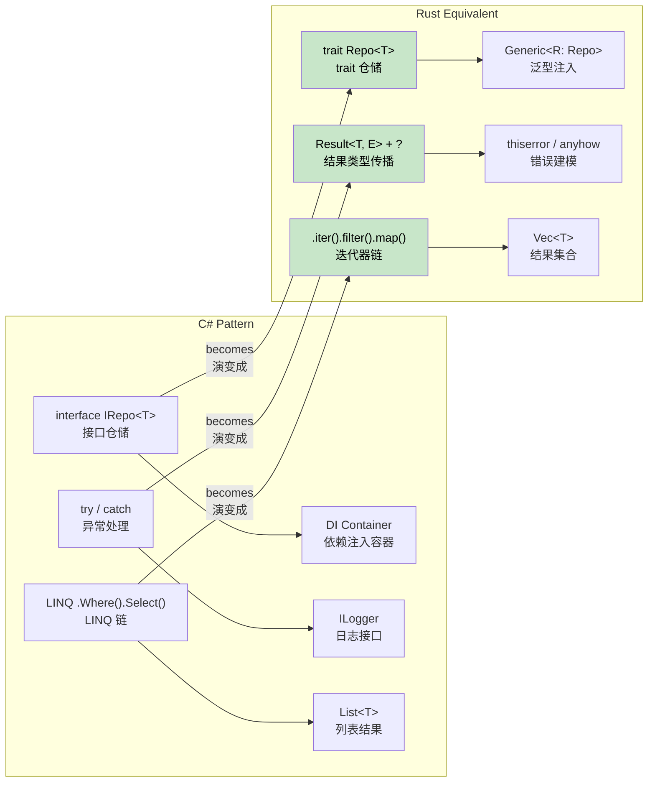

## Common C# Patterns in Rust<br><span class="zh-inline">C# 常见模式在 Rust 里的对应写法</span>

> **What you'll learn:** How to translate the Repository pattern, Builder pattern, dependency injection, LINQ chains, Entity Framework queries, and configuration loading from familiar C# styles into idiomatic Rust.<br><span class="zh-inline">**本章将学到什么：** 如何把常见的 C# 写法迁到更符合 Rust 气质的实现上，包括 Repository 模式、Builder 模式、依赖注入、LINQ 链、Entity Framework 查询，以及配置读取模式。</span>
>
> **Difficulty:** 🟡 Intermediate<br><span class="zh-inline">**难度：** 🟡 进阶</span>



这一章的重点不是生搬硬套“把 C# 语法逐字翻译成 Rust”。<br><span class="zh-inline">真正重要的是把原来的设计意图抽出来，再换成 Rust 社区更自然的表达方式。很多模式本身还在，只是承载它们的语言机制变了。</span>

### Repository Pattern<br><span class="zh-inline">Repository 模式</span>

```csharp
// C# Repository Pattern
public interface IRepository<T> where T : IEntity
{
    Task<T> GetByIdAsync(int id);
    Task<IEnumerable<T>> GetAllAsync();
    Task<T> AddAsync(T entity);
    Task UpdateAsync(T entity);
    Task DeleteAsync(int id);
}

public class UserRepository : IRepository<User>
{
    private readonly DbContext _context;
    
    public UserRepository(DbContext context)
    {
        _context = context;
    }
    
    public async Task<User> GetByIdAsync(int id)
    {
        return await _context.Users.FindAsync(id);
    }
    
    // ... other implementations
}
```

```rust
// Rust Repository Pattern with traits and generics
use async_trait::async_trait;
use std::fmt::Debug;

#[async_trait]
pub trait Repository<T, E> 
where 
    T: Clone + Debug + Send + Sync,
    E: std::error::Error + Send + Sync,
{
    async fn get_by_id(&self, id: u64) -> Result<Option<T>, E>;
    async fn get_all(&self) -> Result<Vec<T>, E>;
    async fn add(&self, entity: T) -> Result<T, E>;
    async fn update(&self, entity: T) -> Result<T, E>;
    async fn delete(&self, id: u64) -> Result<(), E>;
}

#[derive(Debug, Clone)]
pub struct User {
    pub id: u64,
    pub name: String,
    pub email: String,
}

#[derive(Debug)]
pub enum RepositoryError {
    NotFound(u64),
    DatabaseError(String),
    ValidationError(String),
}

impl std::fmt::Display for RepositoryError {
    fn fmt(&self, f: &mut std::fmt::Formatter<'_>) -> std::fmt::Result {
        match self {
            RepositoryError::NotFound(id) => write!(f, "Entity with id {} not found", id),
            RepositoryError::DatabaseError(msg) => write!(f, "Database error: {}", msg),
            RepositoryError::ValidationError(msg) => write!(f, "Validation error: {}", msg),
        }
    }
}

impl std::error::Error for RepositoryError {}

pub struct UserRepository {
    // database connection pool, etc.
}

#[async_trait]
impl Repository<User, RepositoryError> for UserRepository {
    async fn get_by_id(&self, id: u64) -> Result<Option<User>, RepositoryError> {
        // Simulate database lookup
        if id == 0 {
            return Ok(None);
        }
        
        Ok(Some(User {
            id,
            name: format!("User {}", id),
            email: format!("user{}@example.com", id),
        }))
    }
    
    async fn get_all(&self) -> Result<Vec<User>, RepositoryError> {
        // Implementation here
        Ok(vec![])
    }
    
    async fn add(&self, entity: User) -> Result<User, RepositoryError> {
        // Validation and database insertion
        if entity.name.is_empty() {
            return Err(RepositoryError::ValidationError("Name cannot be empty".to_string()));
        }
        Ok(entity)
    }
    
    async fn update(&self, entity: User) -> Result<User, RepositoryError> {
        // Implementation here
        Ok(entity)
    }
    
    async fn delete(&self, id: u64) -> Result<(), RepositoryError> {
        // Implementation here
        Ok(())
    }
}
```

Repository 模式到了 Rust 里，核心变化有两件事。<br><span class="zh-inline">第一，接口通常从 `interface` 换成 `trait`；第二，异常流通常收回到 `Result` 里。于是“仓储层”这套抽象还在，但语义更显式，空值和错误也不再搅成一锅。</span>

### Builder Pattern<br><span class="zh-inline">Builder 模式</span>

```csharp
// C# Builder Pattern (fluent interface)
public class HttpClientBuilder
{
    private TimeSpan? _timeout;
    private string _baseAddress;
    private Dictionary<string, string> _headers = new();
    
    public HttpClientBuilder WithTimeout(TimeSpan timeout)
    {
        _timeout = timeout;
        return this;
    }
    
    public HttpClientBuilder WithBaseAddress(string baseAddress)
    {
        _baseAddress = baseAddress;
        return this;
    }
    
    public HttpClientBuilder WithHeader(string name, string value)
    {
        _headers[name] = value;
        return this;
    }
    
    public HttpClient Build()
    {
        var client = new HttpClient();
        if (_timeout.HasValue)
            client.Timeout = _timeout.Value;
        if (!string.IsNullOrEmpty(_baseAddress))
            client.BaseAddress = new Uri(_baseAddress);
        foreach (var header in _headers)
            client.DefaultRequestHeaders.Add(header.Key, header.Value);
        return client;
    }
}

// Usage
var client = new HttpClientBuilder()
    .WithTimeout(TimeSpan.FromSeconds(30))
    .WithBaseAddress("https://api.example.com")
    .WithHeader("Accept", "application/json")
    .Build();
```

```rust
// Rust Builder Pattern (consuming builder)
use std::collections::HashMap;
use std::time::Duration;

#[derive(Debug)]
pub struct HttpClient {
    timeout: Duration,
    base_address: String,
    headers: HashMap<String, String>,
}

pub struct HttpClientBuilder {
    timeout: Option<Duration>,
    base_address: Option<String>,
    headers: HashMap<String, String>,
}

impl HttpClientBuilder {
    pub fn new() -> Self {
        HttpClientBuilder {
            timeout: None,
            base_address: None,
            headers: HashMap::new(),
        }
    }
    
    pub fn with_timeout(mut self, timeout: Duration) -> Self {
        self.timeout = Some(timeout);
        self
    }
    
    pub fn with_base_address<S: Into<String>>(mut self, base_address: S) -> Self {
        self.base_address = Some(base_address.into());
        self
    }
    
    pub fn with_header<K: Into<String>, V: Into<String>>(mut self, name: K, value: V) -> Self {
        self.headers.insert(name.into(), value.into());
        self
    }
    
    pub fn build(self) -> Result<HttpClient, String> {
        let base_address = self.base_address.ok_or("Base address is required")?;
        
        Ok(HttpClient {
            timeout: self.timeout.unwrap_or(Duration::from_secs(30)),
            base_address,
            headers: self.headers,
        })
    }
}

// Usage
let client = HttpClientBuilder::new()
    .with_timeout(Duration::from_secs(30))
    .with_base_address("https://api.example.com")
    .with_header("Accept", "application/json")
    .build()?;

// Alternative: Using Default trait for common cases
impl Default for HttpClientBuilder {
    fn default() -> Self {
        Self::new()
    }
}
```

Builder 在 Rust 里依旧很好使，只是很多实现会偏向“消费式 builder”。<br><span class="zh-inline">也就是每次方法调用都拿走 `self` 再返回新的 `self`。这样写跟所有权模型更搭，链式调用也照样顺畅，不耽误观感。</span>

***

## C# to Rust Concept Mapping<br><span class="zh-inline">从 C# 到 Rust 的概念映射</span>

### Dependency Injection → Constructor Injection + Traits<br><span class="zh-inline">依赖注入 → 构造函数注入 + Trait</span>

```csharp
// C# with DI container
services.AddScoped<IUserRepository, UserRepository>();
services.AddScoped<IUserService, UserService>();

public class UserService
{
    private readonly IUserRepository _repository;
    
    public UserService(IUserRepository repository)
    {
        _repository = repository;
    }
}
```

```rust
// Rust: Constructor injection with traits
pub trait UserRepository {
    async fn find_by_id(&self, id: Uuid) -> Result<Option<User>, Error>;
    async fn save(&self, user: &User) -> Result<(), Error>;
}

pub struct UserService<R> 
where 
    R: UserRepository,
{
    repository: R,
}

impl<R> UserService<R> 
where 
    R: UserRepository,
{
    pub fn new(repository: R) -> Self {
        Self { repository }
    }
    
    pub async fn get_user(&self, id: Uuid) -> Result<Option<User>, Error> {
        self.repository.find_by_id(id).await
    }
}

// Usage
let repository = PostgresUserRepository::new(pool);
let service = UserService::new(repository);
```

Rust 项目里当然也有 DI 容器，但很多时候压根用不着。<br><span class="zh-inline">直接把依赖从构造函数塞进来，再用 trait 或泛型表达能力边界，已经能把大多数服务对象关系处理得很清楚。少一层容器魔法，反而更好追踪。</span>

### LINQ → Iterator Chains<br><span class="zh-inline">LINQ → 迭代器链</span>

```csharp
// C# LINQ
var result = users
    .Where(u => u.Age > 18)
    .Select(u => u.Name.ToUpper())
    .OrderBy(name => name)
    .Take(10)
    .ToList();
```

```rust
// Rust: Iterator chains (zero-cost!)
let result: Vec<String> = users
    .iter()
    .filter(|u| u.age > 18)
    .map(|u| u.name.to_uppercase())
    .collect::<Vec<_>>()
    .into_iter()
    .sorted()
    .take(10)
    .collect();

// Or with itertools crate for more LINQ-like operations
use itertools::Itertools;

let result: Vec<String> = users
    .iter()
    .filter(|u| u.age > 18)
    .map(|u| u.name.to_uppercase())
    .sorted()
    .take(10)
    .collect();
```

这一项在前一章已经铺过路，这里主要是提醒一件事：别总想着一比一找“LINQ 的某个方法对应 Rust 哪个方法”。<br><span class="zh-inline">很多时候 Rust 更自然的写法不是“找同名操作”，而是顺着迭代器组合方式去重写数据流。</span>

### Entity Framework → SQLx + Migrations<br><span class="zh-inline">Entity Framework → SQLx + Migration</span>

```csharp
// C# Entity Framework
public class ApplicationDbContext : DbContext
{
    public DbSet<User> Users { get; set; }
}

var user = await context.Users
    .Where(u => u.Email == email)
    .FirstOrDefaultAsync();
```

```rust
// Rust: SQLx with compile-time checked queries
use sqlx::{PgPool, FromRow};

#[derive(FromRow)]
struct User {
    id: Uuid,
    email: String,
    name: String,
}

// Compile-time checked query
let user = sqlx::query_as!(
    User,
    "SELECT id, email, name FROM users WHERE email = $1",
    email
)
.fetch_optional(&pool)
.await?;

// Or with dynamic queries
let user = sqlx::query_as::<_, User>(
    "SELECT id, email, name FROM users WHERE email = $1"
)
.bind(email)
.fetch_optional(&pool)
.await?;
```

这块思维差异也挺大。<br><span class="zh-inline">EF 更像是围着对象模型组织数据库操作；`sqlx` 则是让 SQL 自己留在台前，只是把类型检查和绑定安全补强了。对很多后端来说，这种做法反而更踏实。</span>

### Configuration → Config Crates<br><span class="zh-inline">配置系统 → `config` 等配置库</span>

```csharp
// C# Configuration
public class AppSettings
{
    public string DatabaseUrl { get; set; }
    public int Port { get; set; }
}

var config = builder.Configuration.Get<AppSettings>();
```

```rust
// Rust: Config with serde
use config::{Config, ConfigError, Environment, File};
use serde::Deserialize;

#[derive(Debug, Deserialize)]
struct AppSettings {
    database_url: String,
    port: u16,
}

impl AppSettings {
    pub fn new() -> Result<Self, ConfigError> {
        let s = Config::builder()
            .add_source(File::with_name("config/default"))
            .add_source(Environment::with_prefix("APP"))
            .build()?;

        s.try_deserialize()
    }
}

// Usage
let settings = AppSettings::new()?;
```

Rust 配置读取经常和 `serde` 打配合。<br><span class="zh-inline">文件、环境变量、命令行来源先汇总，再一次性反序列化成强类型配置对象。只要字段定义对上，后面读配置就比较省心。</span>

---

## Case Studies<br><span class="zh-inline">案例研究</span>

### Case Study 1: CLI Tool Migration (`csvtool`)<br><span class="zh-inline">案例一：命令行工具迁移（`csvtool`）</span>

**Background**: A team maintained a C# console app named `CsvProcessor` that read large CSV files, applied transformations, and wrote output. At 500 MB per file, memory use reached 4 GB and long GC pauses produced 30-second stalls.<br><span class="zh-inline">**背景：** 某团队维护着一个 C# 控制台程序 `CsvProcessor`，负责读取大 CSV 文件、做转换、再写回输出。单文件来到 500 MB 时，内存能冲到 4 GB，GC 停顿甚至能卡到 30 秒。</span>

**Migration approach**: Rewrite the tool in Rust over two weeks, one module at a time.<br><span class="zh-inline">**迁移方式：** 用两周时间改写成 Rust，按模块一点点替换。</span>

| Step<br><span class="zh-inline">步骤</span> | What Changed<br><span class="zh-inline">改了什么</span> | C# → Rust |
|------|-------------|-----------|
| 1<br><span class="zh-inline">1</span> | CSV parsing<br><span class="zh-inline">CSV 解析</span> | `CsvHelper` → `csv` crate<br><span class="zh-inline">从 `CsvHelper` 换成 `csv` crate 的流式读取器</span> |
| 2<br><span class="zh-inline">2</span> | Data model<br><span class="zh-inline">数据模型</span> | `class Record` → `struct Record`<br><span class="zh-inline">从类改成 `struct`，再配 `#[derive(Deserialize)]`</span> |
| 3<br><span class="zh-inline">3</span> | Transformations<br><span class="zh-inline">转换逻辑</span> | LINQ `.Select().Where()` → `.iter().map().filter()`<br><span class="zh-inline">LINQ 链改成迭代器链</span> |
| 4<br><span class="zh-inline">4</span> | File I/O<br><span class="zh-inline">文件 I/O</span> | `StreamReader` → `BufReader<File>` with `?`<br><span class="zh-inline">用 `BufReader<File>` 和 `?` 传播错误</span> |
| 5<br><span class="zh-inline">5</span> | CLI args<br><span class="zh-inline">命令行参数</span> | `System.CommandLine` → `clap`<br><span class="zh-inline">改用 `clap` derive 宏</span> |
| 6<br><span class="zh-inline">6</span> | Parallel processing<br><span class="zh-inline">并行处理</span> | `Parallel.ForEach` → `rayon` `.par_iter()`<br><span class="zh-inline">使用 `rayon` 做并行迭代</span> |

**Results:**<br><span class="zh-inline">**结果：**</span>

- Memory: 4 GB → 12 MB<br><span class="zh-inline">内存从 4 GB 降到 12 MB，因为改成了流式处理，不再整文件读进内存。</span>
- Speed: 45s → 3s for a 500 MB file<br><span class="zh-inline">500 MB 文件处理时间从 45 秒降到 3 秒。</span>
- Binary size: single 2 MB executable, no runtime dependency<br><span class="zh-inline">最终是一个约 2 MB 的单文件可执行程序，不再额外依赖运行时。</span>

**Key lesson**: The biggest improvement was not magic speed from the language itself. The more important change was that Rust's ownership model naturally pushed the design toward streaming instead of "load everything into memory first".<br><span class="zh-inline">**关键经验：** 真正的大提升不只是“Rust 跑得更快”，更关键的是 Rust 的所有权模型逼着设计往流式方向走。在 C# 里，`.ToList()` 一把梭很容易；在 Rust 里，迭代器式处理更自然，于是设计本身也跟着变健康了。</span>

### Case Study 2: Microservice Replacement (`auth-gateway`)<br><span class="zh-inline">案例二：微服务替换（`auth-gateway`）</span>

**Background**: A C# ASP.NET Core authentication gateway handled JWT validation and rate limiting for over 50 backend services. At 10K requests per second, p99 latency reached 200 ms and GC spikes became the main pain point.<br><span class="zh-inline">**背景：** 一个 C# ASP.NET Core 认证网关负责给 50 多个后端服务做 JWT 校验和限流。流量到 10K req/s 时，p99 延迟冲到 200 ms，GC 抖动成了最大麻烦。</span>

**Migration approach**: Replace it with a Rust service built on `axum` and `tower` while preserving the API contract.<br><span class="zh-inline">**迁移方式：** 用 `axum` + `tower` 重写成 Rust 服务，但对外 API 契约保持不变。</span>

```rust
// Before (C#):  services.AddAuthentication().AddJwtBearer(...)
// After (Rust):  tower middleware layer

use axum::{Router, middleware};
use tower::ServiceBuilder;

let app = Router::new()
    .route("/api/*path", any(proxy_handler))
    .layer(
        ServiceBuilder::new()
            .layer(middleware::from_fn(validate_jwt))
            .layer(middleware::from_fn(rate_limit))
    );
```

| Metric<br><span class="zh-inline">指标</span> | C# (ASP.NET Core) | Rust (`axum`) |
|--------|-------------------|-------------|
| p50 latency<br><span class="zh-inline">p50 延迟</span> | 5ms<br><span class="zh-inline">5ms</span> | 0.8ms<br><span class="zh-inline">0.8ms</span> |
| p99 latency<br><span class="zh-inline">p99 延迟</span> | 200ms (GC spikes)<br><span class="zh-inline">200ms，受 GC 抖动影响</span> | 4ms<br><span class="zh-inline">4ms</span> |
| Memory<br><span class="zh-inline">内存</span> | 300 MB<br><span class="zh-inline">300 MB</span> | 8 MB<br><span class="zh-inline">8 MB</span> |
| Docker image<br><span class="zh-inline">Docker 镜像</span> | 210 MB (.NET runtime)<br><span class="zh-inline">210 MB，带 .NET runtime</span> | 12 MB (static binary)<br><span class="zh-inline">12 MB，静态二进制</span> |
| Cold start<br><span class="zh-inline">冷启动</span> | 2.1s<br><span class="zh-inline">2.1 秒</span> | 0.05s<br><span class="zh-inline">0.05 秒</span> |

**Key lessons:**<br><span class="zh-inline">**关键经验：**</span>

1. **Keep the same API contract.** That lets the Rust service act as a drop-in replacement.<br><span class="zh-inline">**先保持 API 契约不变。** 这样 Rust 服务才能平滑顶上，不至于把客户端也一起拖下水。</span>
2. **Start from the hot path.** JWT validation was the bottleneck, so even a partial migration could capture most of the gain.<br><span class="zh-inline">**先打最热路径。** JWT 校验本来就是瓶颈，只迁这一块，收益就已经很可观。</span>
3. **Use `tower` middleware.** Its pipeline shape is close enough to ASP.NET Core middleware that C# 开发者上手不至于太拧巴。<br><span class="zh-inline">**用 `tower` middleware。** 它的管道结构和 ASP.NET Core 的 middleware 很接近，所以团队迁移时心智负担没那么重。</span>
4. **The biggest p99 gain came from removing GC pauses.** Throughput got faster too, but tail latency became stable mainly because the GC spike disappeared.<br><span class="zh-inline">**p99 改善最大的一刀来自 GC 消失。** 稳态吞吐当然也提升了，但尾延迟变得可预测，根本原因是大抖动没了。</span>

---

## Exercises<br><span class="zh-inline">练习</span>

<details>
<summary><strong>🏋️ Exercise: Migrate a C# Service</strong><br><span class="zh-inline"><strong>🏋️ 练习：迁移一个 C# 服务</strong></span></summary>

Translate this C# service to idiomatic Rust:<br><span class="zh-inline">把下面这个 C# 服务改写成更符合 Rust 习惯的版本：</span>

```csharp
public interface IUserService
{
    Task<User?> GetByIdAsync(int id);
    Task<List<User>> SearchAsync(string query);
}

public class UserService : IUserService
{
    private readonly IDatabase _db;
    public UserService(IDatabase db) { _db = db; }

    public async Task<User?> GetByIdAsync(int id)
    {
        try { return await _db.QuerySingleAsync<User>(id); }
        catch (NotFoundException) { return null; }
    }

    public async Task<List<User>> SearchAsync(string query)
    {
        return await _db.QueryAsync<User>($"SELECT * WHERE name LIKE '%{query}%'");
    }
}
```

**Hints**: Use a trait, `Option<User>` instead of `null`, `Result` instead of `try/catch`, and fix the SQL injection vulnerability.<br><span class="zh-inline">**提示：** 用 trait 代替接口，用 `Option<User>` 代替 `null`，用 `Result` 代替 `try/catch`，顺手把 SQL 注入漏洞也收拾掉。</span>

<details>
<summary>🔑 Solution<br><span class="zh-inline">🔑 参考答案</span></summary>

```rust
use async_trait::async_trait;

#[derive(Debug, Clone)]
struct User { id: i64, name: String }

#[async_trait]
trait Database: Send + Sync {
    async fn get_user(&self, id: i64) -> Result<Option<User>, sqlx::Error>;
    async fn search_users(&self, query: &str) -> Result<Vec<User>, sqlx::Error>;
}

#[async_trait]
trait UserService: Send + Sync {
    async fn get_by_id(&self, id: i64) -> Result<Option<User>, AppError>;
    async fn search(&self, query: &str) -> Result<Vec<User>, AppError>;
}

struct UserServiceImpl<D: Database> {
    db: D,  // No Arc needed — Rust's ownership handles it
}

#[async_trait]
impl<D: Database> UserService for UserServiceImpl<D> {
    async fn get_by_id(&self, id: i64) -> Result<Option<User>, AppError> {
        // Option instead of null; Result instead of try/catch
        Ok(self.db.get_user(id).await?)
    }

    async fn search(&self, query: &str) -> Result<Vec<User>, AppError> {
        // Parameterized query — NO SQL injection!
        // (sqlx uses $1 placeholders, not string interpolation)
        self.db.search_users(query).await.map_err(Into::into)
    }
}
```

**Key changes from C#:**<br><span class="zh-inline">**和 C# 相比，关键变化有这几处：**</span>

- `null` becomes `Option<User>` so null-safety is part of the type system.<br><span class="zh-inline">`null` 换成 `Option<User>`，可空性进了类型系统。</span>
- `try/catch` becomes `Result` plus `?`, making error propagation explicit.<br><span class="zh-inline">`try/catch` 换成 `Result` 和 `?`，错误传播更显式。</span>
- SQL injection is fixed by using parameterized queries instead of string interpolation.<br><span class="zh-inline">查询改成参数绑定，SQL 注入问题顺手就修了。</span>
- `IDatabase _db` becomes a generic `D: Database`, which usually means static dispatch and less runtime indirection.<br><span class="zh-inline">`IDatabase _db` 变成泛型 `D: Database`，通常意味着静态分发和更少的运行时间接层。</span>

</details>
</details>

***
