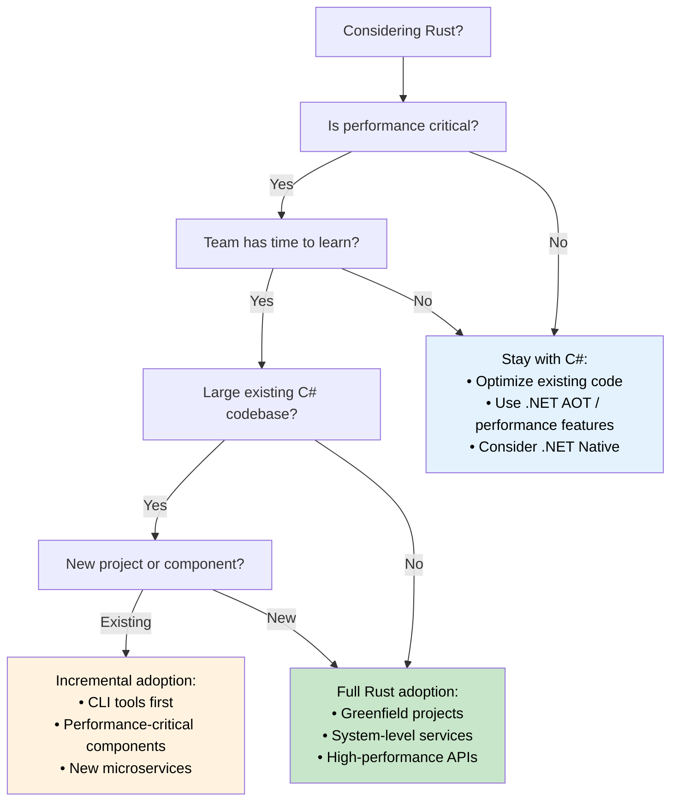

## Performance Comparison: Managed vs Native<br><span class="zh-inline">性能对比：托管环境与原生环境</span>

> **What you'll learn:** Real-world performance differences between C# and Rust — startup time, memory usage, throughput benchmarks, CPU-intensive workloads, and a decision tree for when to migrate vs when to stay in C#.<br><span class="zh-inline">**本章将学到什么：** C# 和 Rust 在真实世界里的性能差异，包括启动时间、内存占用、吞吐基准、CPU 密集型负载，以及到底该迁移还是继续留在 C# 的决策树。</span>
>
> **Difficulty:** 🟡 Intermediate<br><span class="zh-inline">**难度：** 🟡 进阶</span>

### Real-World Performance Characteristics<br><span class="zh-inline">真实世界里的性能特征</span>

| **Aspect** | **C# (.NET)** | **Rust** | **Performance Impact** |
|------------|---------------|----------|------------------------|
| **Startup Time**<br><span class="zh-inline">启动时间</span> | 100-500ms (JIT); 5-30ms (.NET 8 AOT)<br><span class="zh-inline">100-500ms（JIT）；5-30ms（.NET 8 AOT）</span> | 1-10ms (native binary)<br><span class="zh-inline">1-10ms（原生二进制）</span> | 🚀 **10-50x faster** (vs JIT)<br><span class="zh-inline">🚀 相比 JIT 版本可快 **10-50 倍**</span> |
| **Memory Usage**<br><span class="zh-inline">内存占用</span> | +30-100% (GC overhead + metadata)<br><span class="zh-inline">高出 30-100%（GC 开销和元数据）</span> | Baseline (minimal runtime)<br><span class="zh-inline">基线水平（运行时极小）</span> | 💾 **30-50% less RAM**<br><span class="zh-inline">💾 通常少用 **30-50%** 内存</span> |
| **GC Pauses**<br><span class="zh-inline">GC 停顿</span> | 1-100ms periodic pauses<br><span class="zh-inline">周期性停顿 1-100ms</span> | Never (no GC)<br><span class="zh-inline">没有，Rust 不靠 GC</span> | ⚡ **Consistent latency**<br><span class="zh-inline">⚡ 延迟更稳定</span> |
| **CPU Usage**<br><span class="zh-inline">CPU 占用</span> | +10-20% (GC + JIT overhead)<br><span class="zh-inline">额外高出 10-20%（GC + JIT）</span> | Baseline (direct execution)<br><span class="zh-inline">基线水平（直接执行）</span> | 🔋 **10-20% better efficiency**<br><span class="zh-inline">🔋 效率通常高 **10-20%**</span> |
| **Binary Size**<br><span class="zh-inline">二进制体积</span> | 30-200MB (with runtime); 10-30MB (AOT trimmed)<br><span class="zh-inline">30-200MB（带运行时）；10-30MB（AOT 裁剪后）</span> | 1-20MB (static binary)<br><span class="zh-inline">1-20MB（静态二进制）</span> | 📦 **Smaller deployments**<br><span class="zh-inline">📦 部署体积更小</span> |
| **Memory Safety**<br><span class="zh-inline">内存安全</span> | Runtime checks<br><span class="zh-inline">运行时检查</span> | Compile-time proofs<br><span class="zh-inline">编译期证明</span> | 🛡️ **Zero overhead safety**<br><span class="zh-inline">🛡️ 零额外运行时成本的安全性</span> |
| **Concurrent Performance**<br><span class="zh-inline">并发性能</span> | Good (with careful synchronization)<br><span class="zh-inline">不错，但要小心同步</span> | Excellent (fearless concurrency)<br><span class="zh-inline">通常更强，能走 fearless concurrency</span> | 🏃 **Superior scalability**<br><span class="zh-inline">🏃 扩展性更强</span> |

> **Note on .NET 8+ AOT**: Native AOT compilation closes the startup gap significantly (5-30ms). For throughput and memory, GC overhead and pauses remain. When evaluating a migration, benchmark your *specific workload* — headline numbers can be misleading.<br><span class="zh-inline">**关于 .NET 8+ AOT 的说明：** Native AOT 已经显著缩小了启动时间差距，通常能压到 5-30ms。但在吞吐和内存方面，GC 带来的开销和停顿依然存在。评估迁移时，重点还是测 *自身负载*，因为宣传数字很容易误导判断。</span>

### Benchmark Examples<br><span class="zh-inline">基准示例</span>

```csharp
// C# - JSON processing benchmark
public class JsonProcessor
{
    public async Task<List<User>> ProcessJsonFile(string path)
    {
        var json = await File.ReadAllTextAsync(path);
        var users = JsonSerializer.Deserialize<List<User>>(json);
        
        return users.Where(u => u.Age > 18)
                   .OrderBy(u => u.Name)
                   .Take(1000)
                   .ToList();
    }
}

// Typical performance: ~200ms for 100MB file
// Memory usage: ~500MB peak (GC overhead)
// Binary size: ~80MB (self-contained)
```

```rust
// Rust - Equivalent JSON processing
use serde::{Deserialize, Serialize};
use tokio::fs;

#[derive(Deserialize, Serialize)]
struct User {
    name: String,
    age: u32,
}

pub async fn process_json_file(path: &str) -> Result<Vec<User>, Box<dyn std::error::Error>> {
    let json = fs::read_to_string(path).await?;
    let mut users: Vec<User> = serde_json::from_str(&json)?;
    
    users.retain(|u| u.age > 18);
    users.sort_by(|a, b| a.name.cmp(&b.name));
    users.truncate(1000);
    
    Ok(users)
}

// Typical performance: ~120ms for same 100MB file
// Memory usage: ~200MB peak (no GC overhead)
// Binary size: ~8MB (static binary)
```

### CPU-Intensive Workloads<br><span class="zh-inline">CPU 密集型负载</span>

```csharp
// C# - Mathematical computation
public class Mandelbrot
{
    public static int[,] Generate(int width, int height, int maxIterations)
    {
        var result = new int[height, width];
        
        Parallel.For(0, height, y =>
        {
            for (int x = 0; x < width; x++)
            {
                var c = new Complex(
                    (x - width / 2.0) * 4.0 / width,
                    (y - height / 2.0) * 4.0 / height);
                
                result[y, x] = CalculateIterations(c, maxIterations);
            }
        });
        
        return result;
    }
}

// Performance: ~2.3 seconds (8-core machine)
// Memory: ~500MB
```

```rust
// Rust - Same computation with Rayon
use rayon::prelude::*;
use num_complex::Complex;

pub fn generate_mandelbrot(width: usize, height: usize, max_iterations: u32) -> Vec<Vec<u32>> {
    (0..height)
        .into_par_iter()
        .map(|y| {
            (0..width)
                .map(|x| {
                    let c = Complex::new(
                        (x as f64 - width as f64 / 2.0) * 4.0 / width as f64,
                        (y as f64 - height as f64 / 2.0) * 4.0 / height as f64,
                    );
                    calculate_iterations(c, max_iterations)
                })
                .collect()
        })
        .collect()
}

// Performance: ~1.1 seconds (same 8-core machine)  
// Memory: ~200MB
// 2x faster with 60% less memory usage
```

### When to Choose Each Language<br><span class="zh-inline">什么时候该选哪门语言</span>

**Choose C# when:**<br><span class="zh-inline">**以下情况更适合 C#：**</span>

- **Rapid development is crucial** - Rich tooling ecosystem<br><span class="zh-inline">**开发速度优先**：工具链成熟，生态顺手。</span>
- **Team expertise in .NET** - Existing knowledge and skills<br><span class="zh-inline">**团队已经深耕 .NET**：现有知识和经验可以直接复用。</span>
- **Enterprise integration** - Heavy use of Microsoft ecosystem<br><span class="zh-inline">**企业集成要求高**：大量依赖微软生态。</span>
- **Moderate performance requirements** - Performance is adequate<br><span class="zh-inline">**性能要求中等**：当前性能已经够用。</span>
- **Rich UI applications** - WPF, WinUI, Blazor applications<br><span class="zh-inline">**富界面应用**：例如 WPF、WinUI、Blazor 这类项目。</span>
- **Prototyping and MVPs** - Fast time to market<br><span class="zh-inline">**原型和 MVP 阶段**：更看重上线速度。</span>

**Choose Rust when:**<br><span class="zh-inline">**以下情况更适合 Rust：**</span>

- **Performance is critical** - CPU/memory-intensive applications<br><span class="zh-inline">**性能就是核心指标**：CPU 或内存消耗特别重。</span>
- **Resource constraints matter** - Embedded, edge computing, serverless<br><span class="zh-inline">**资源受限很重要**：嵌入式、边缘计算、serverless。</span>
- **Long-running services** - Web servers, databases, system services<br><span class="zh-inline">**服务会长时间运行**：比如 Web 服务、数据库、系统服务。</span>
- **System-level programming** - OS components, drivers, network tools<br><span class="zh-inline">**系统级开发**：操作系统组件、驱动、网络工具。</span>
- **High reliability requirements** - Financial systems, safety-critical applications<br><span class="zh-inline">**可靠性要求极高**：金融系统、安全关键系统。</span>
- **Concurrent/parallel workloads** - High-throughput data processing<br><span class="zh-inline">**并发或并行负载很重**：高吞吐数据处理场景。</span>

### Migration Strategy Decision Tree<br><span class="zh-inline">迁移策略决策树</span>



***
