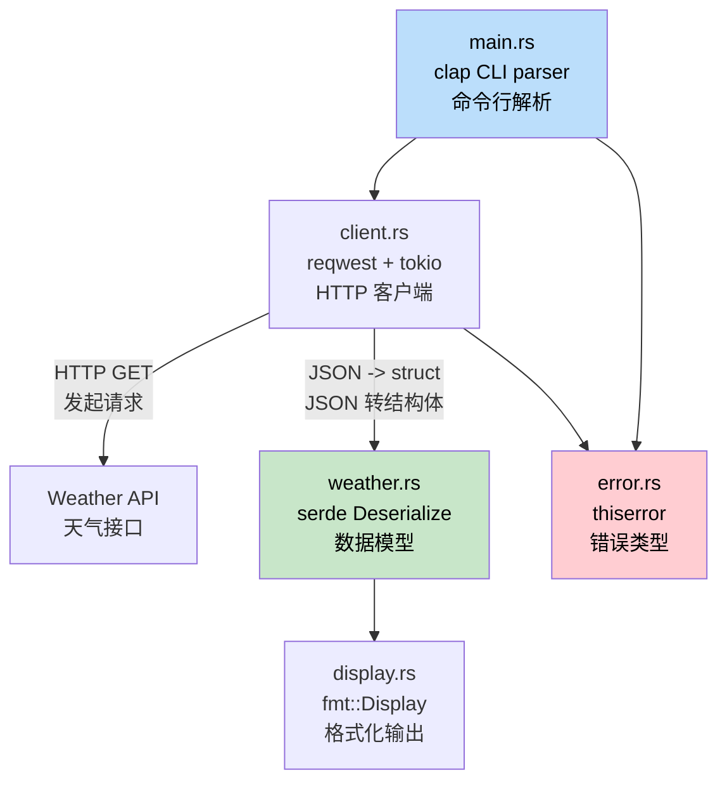

## Capstone Project: Build a CLI Weather Tool<br><span class="zh-inline">结课项目：构建一个命令行天气工具</span>

> **What you'll learn:** How to combine structs, traits, error handling, async, modules, serde, and CLI parsing into one working Rust application. This mirrors the kind of tool a C# developer might build with `HttpClient`, `System.Text.Json`, and `System.CommandLine`.<br><span class="zh-inline">**本章将学到什么：** 把 struct、trait、错误处理、异步、模块、serde 和命令行参数解析拼成一个能工作的 Rust 应用。这和 C# 开发者用 `HttpClient`、`System.Text.Json`、`System.CommandLine` 写的小工具非常接近。</span>
>
> **Difficulty:** 🟡 Intermediate<br><span class="zh-inline">**难度：** 🟡 进阶</span>

This capstone gathers concepts from the whole book into one mini project. The goal is to build `weather-cli`, a command-line program that fetches weather data from an API and prints it in a friendly format.<br><span class="zh-inline">这一章相当于全书知识点的大合龙。目标是做一个 `weather-cli`：从天气 API 拉数据，再用整洁的命令行格式打印出来。项目虽然不大，但模块边界、错误类型、异步请求、测试这些东西都能串起来。</span>

### Project Overview<br><span class="zh-inline">项目总览</span>



**What you'll build:**<br><span class="zh-inline">**最终要做出的效果：**</span>

```text
$ weather-cli --city "Seattle"
🌧  Seattle: 12°C, Overcast clouds
    Humidity: 82%  Wind: 5.4 m/s
```

**Concepts exercised:**<br><span class="zh-inline">**会练到的知识点：**</span>

| Book Chapter<br><span class="zh-inline">书中章节</span> | Concept Used Here<br><span class="zh-inline">这里会用到的概念</span> |
|---|---|
| Ch05 (Structs)<br><span class="zh-inline">第 5 章（Struct）</span> | `WeatherReport`, `Config` data types<br><span class="zh-inline">`WeatherReport`、`Config` 这类数据类型</span> |
| Ch08 (Modules)<br><span class="zh-inline">第 8 章（模块）</span> | `src/lib.rs`, `src/client.rs`, `src/display.rs`<br><span class="zh-inline">模块拆分与文件组织</span> |
| Ch09 (Errors)<br><span class="zh-inline">第 9 章（错误处理）</span> | Custom `WeatherError` with `thiserror`<br><span class="zh-inline">用 `thiserror` 定义 `WeatherError`</span> |
| Ch10 (Traits)<br><span class="zh-inline">第 10 章（Trait）</span> | `Display` impl for formatted output<br><span class="zh-inline">通过 `Display` 实现格式化输出</span> |
| Ch11 (From/Into)<br><span class="zh-inline">第 11 章（From/Into）</span> | JSON deserialization via `serde`<br><span class="zh-inline">使用 `serde` 做 JSON 反序列化</span> |
| Ch12 (Iterators)<br><span class="zh-inline">第 12 章（迭代器）</span> | Processing API response arrays<br><span class="zh-inline">处理 API 响应里的数组数据</span> |
| Ch13 (Async)<br><span class="zh-inline">第 13 章（异步）</span> | `reqwest` + `tokio` for HTTP calls<br><span class="zh-inline">用 `reqwest` + `tokio` 发 HTTP 请求</span> |
| Ch14-1 (Testing)<br><span class="zh-inline">第 14-1 章（测试）</span> | Unit tests + integration test<br><span class="zh-inline">单元测试与集成测试</span> |

---

### Step 1: Project Setup<br><span class="zh-inline">步骤 1：初始化项目</span>

```bash
cargo new weather-cli
cd weather-cli
```

Add dependencies to `Cargo.toml`:<br><span class="zh-inline">把下面这些依赖加进 `Cargo.toml`：</span>

```toml
[package]
name = "weather-cli"
version = "0.1.0"
edition = "2021"

[dependencies]
clap = { version = "4", features = ["derive"] }     # CLI args (like System.CommandLine)
reqwest = { version = "0.12", features = ["json"] } # HTTP client (like HttpClient)
serde = { version = "1", features = ["derive"] }    # Serialization (like System.Text.Json)
serde_json = "1"
thiserror = "2"                                     # Error types
tokio = { version = "1", features = ["full"] }      # Async runtime
```

```csharp
// C# equivalent dependencies:
// dotnet add package System.CommandLine
// dotnet add package System.Net.Http.Json
// (System.Text.Json and HttpClient are built-in)
```

这一步的重点不是背版本号，而是建立依赖分工意识。<br><span class="zh-inline">`clap` 负责命令行，`reqwest` 负责 HTTP，`serde` 负责 JSON，`thiserror` 负责错误定义，`tokio` 负责异步运行时。边界很清楚，后面读代码时脑子会更稳。</span>

### Step 2: Define Your Data Types<br><span class="zh-inline">步骤 2：定义数据类型</span>

Create `src/weather.rs`:<br><span class="zh-inline">创建 `src/weather.rs`：</span>

```rust
use serde::Deserialize;

/// Raw API response (matches JSON shape)
#[derive(Deserialize, Debug)]
pub struct ApiResponse {
    pub main: MainData,
    pub weather: Vec<WeatherCondition>,
    pub wind: WindData,
    pub name: String,
}

#[derive(Deserialize, Debug)]
pub struct MainData {
    pub temp: f64,
    pub humidity: u32,
}

#[derive(Deserialize, Debug)]
pub struct WeatherCondition {
    pub description: String,
    pub icon: String,
}

#[derive(Deserialize, Debug)]
pub struct WindData {
    pub speed: f64,
}

/// Our domain type (clean, decoupled from API)
#[derive(Debug, Clone)]
pub struct WeatherReport {
    pub city: String,
    pub temp_celsius: f64,
    pub description: String,
    pub humidity: u32,
    pub wind_speed: f64,
}

impl From<ApiResponse> for WeatherReport {
    fn from(api: ApiResponse) -> Self {
        let description = api.weather
            .first()
            .map(|w| w.description.clone())
            .unwrap_or_else(|| "Unknown".to_string());

        WeatherReport {
            city: api.name,
            temp_celsius: api.main.temp,
            description,
            humidity: api.main.humidity,
            wind_speed: api.wind.speed,
        }
    }
}
```

```csharp
// C# equivalent:
// public record ApiResponse(MainData Main, List<WeatherCondition> Weather, ...);
// public record WeatherReport(string City, double TempCelsius, ...);
// Manual mapping or AutoMapper
```

**Key difference:** `#[derive(Deserialize)]` plus a `From` implementation replaces the usual C# combo of `JsonSerializer.Deserialize<T>()` and object mapping. In Rust, both parts are decided at compile time.<br><span class="zh-inline">**关键差异：** Rust 里 `#[derive(Deserialize)]` 加上 `From` 实现，就把 C# 里常见的 `JsonSerializer.Deserialize&lt;T&gt;()` 和对象映射那一套接住了，而且这些关系在编译阶段就已经确定，不靠反射临场发挥。</span>

### Step 3: Error Type<br><span class="zh-inline">步骤 3：定义错误类型</span>

Create `src/error.rs`:<br><span class="zh-inline">创建 `src/error.rs`：</span>

```rust
use thiserror::Error;

#[derive(Error, Debug)]
pub enum WeatherError {
    #[error("HTTP request failed: {0}")]
    Http(#[from] reqwest::Error),

    #[error("City not found: {0}")]
    CityNotFound(String),

    #[error("API key not set — export WEATHER_API_KEY")]
    MissingApiKey,
}

pub type Result<T> = std::result::Result<T, WeatherError>;
```

这里开始能明显看出 Rust 风格了。<br><span class="zh-inline">错误不是到处 `throw`，而是先把可能失败的几类情况定义成明确类型，再让 `Result` 把控制流带着走。后面查问题时，脑子里不会飘。</span>

### Step 4: HTTP Client<br><span class="zh-inline">步骤 4：实现 HTTP 客户端</span>

Create `src/client.rs`:<br><span class="zh-inline">创建 `src/client.rs`：</span>

```rust
use crate::error::{WeatherError, Result};
use crate::weather::{ApiResponse, WeatherReport};

pub struct WeatherClient {
    api_key: String,
    http: reqwest::Client,
}

impl WeatherClient {
    pub fn new(api_key: String) -> Self {
        WeatherClient {
            api_key,
            http: reqwest::Client::new(),
        }
    }

    pub async fn get_weather(&self, city: &str) -> Result<WeatherReport> {
        let url = format!(
            "https://api.openweathermap.org/data/2.5/weather?q={}&appid={}&units=metric",
            city, self.api_key
        );

        let response = self.http.get(&url).send().await?;

        if response.status() == reqwest::StatusCode::NOT_FOUND {
            return Err(WeatherError::CityNotFound(city.to_string()));
        }

        let api_data: ApiResponse = response.json().await?;
        Ok(WeatherReport::from(api_data))
    }
}
```

```csharp
// C# equivalent:
// var response = await _httpClient.GetAsync(url);
// if (response.StatusCode == HttpStatusCode.NotFound)
//     throw new CityNotFoundException(city);
// var data = await response.Content.ReadFromJsonAsync<ApiResponse>();
```

**Key differences:**<br><span class="zh-inline">**这里最值得注意的差异：**</span>

1. `?` replaces a lot of `try/catch` boilerplate by propagating `Result` automatically.<br><span class="zh-inline">`?` 会把很多 `try/catch` 样板吃掉，沿着 `Result` 自动向上传播错误。</span>
2. `WeatherReport::from(api_data)` uses the `From` trait instead of AutoMapper.<br><span class="zh-inline">`WeatherReport::from(api_data)` 走的是 `From` trait，而不是额外接一个 AutoMapper。</span>
3. `reqwest::Client` already manages connection pooling, so there is no separate `IHttpClientFactory` concept here.<br><span class="zh-inline">`reqwest::Client` 自己就带连接池语义，这里没有一整套 `IHttpClientFactory` 的概念要额外接。</span>

### Step 5: Display Formatting<br><span class="zh-inline">步骤 5：实现展示格式</span>

Create `src/display.rs`:<br><span class="zh-inline">创建 `src/display.rs`：</span>

```rust
use std::fmt;
use crate::weather::WeatherReport;

impl fmt::Display for WeatherReport {
    fn fmt(&self, f: &mut fmt::Formatter<'_>) -> fmt::Result {
        let icon = weather_icon(&self.description);
        writeln!(f, "{}  {}: {:.0}°C, {}",
            icon, self.city, self.temp_celsius, self.description)?;
        write!(f, "    Humidity: {}%  Wind: {:.1} m/s",
            self.humidity, self.wind_speed)
    }
}

fn weather_icon(description: &str) -> &str {
    let desc = description.to_lowercase();
    if desc.contains("clear") { "☀️" }
    else if desc.contains("cloud") { "☁️" }
    else if desc.contains("rain") || desc.contains("drizzle") { "🌧" }
    else if desc.contains("snow") { "❄️" }
    else if desc.contains("thunder") { "⛈" }
    else { "🌡" }
}
```

这一步特别适合体会 trait 的味道。<br><span class="zh-inline">只要给 `WeatherReport` 实现了 `Display`，后面 `println!("{report}")` 这种调用就自然成立。输出逻辑和数据模型靠 trait 粘在一起，读起来很顺。</span>

### Step 6: Wire It All Together<br><span class="zh-inline">步骤 6：把模块接起来</span>

`src/lib.rs`:<br><span class="zh-inline">`src/lib.rs`：</span>

```rust
pub mod client;
pub mod display;
pub mod error;
pub mod weather;
```

`src/main.rs`:<br><span class="zh-inline">`src/main.rs`：</span>

```rust
use clap::Parser;
use weather_cli::{client::WeatherClient, error::WeatherError};

#[derive(Parser)]
#[command(name = "weather-cli", about = "Fetch weather from the command line")]
struct Cli {
    /// City name to look up
    #[arg(short, long)]
    city: String,
}

#[tokio::main]
async fn main() {
    let cli = Cli::parse();

    let api_key = match std::env::var("WEATHER_API_KEY") {
        Ok(key) => key,
        Err(_) => {
            eprintln!("Error: {}", WeatherError::MissingApiKey);
            std::process::exit(1);
        }
    };

    let client = WeatherClient::new(api_key);

    match client.get_weather(&cli.city).await {
        Ok(report) => println!("{report}"),
        Err(WeatherError::CityNotFound(city)) => {
            eprintln!("City not found: {city}");
            std::process::exit(1);
        }
        Err(e) => {
            eprintln!("Error: {e}");
            std::process::exit(1);
        }
    }
}
```

这一步做完，项目骨架就闭合了。<br><span class="zh-inline">命令行参数进来，环境变量取 API key，客户端发请求，领域模型接结果，`Display` 负责输出。结构虽然小，但已经是个完整应用，不是玩具代码堆砌。</span>

### Step 7: Tests<br><span class="zh-inline">步骤 7：编写测试</span>

```rust
// In src/weather.rs or tests/weather_test.rs
#[cfg(test)]
mod tests {
    use super::*;

    fn sample_api_response() -> ApiResponse {
        serde_json::from_str(r#"{
            "main": {"temp": 12.3, "humidity": 82},
            "weather": [{"description": "overcast clouds", "icon": "04d"}],
            "wind": {"speed": 5.4},
            "name": "Seattle"
        }"#).unwrap()
    }

    #[test]
    fn api_response_to_weather_report() {
        let report = WeatherReport::from(sample_api_response());
        assert_eq!(report.city, "Seattle");
        assert!((report.temp_celsius - 12.3).abs() < 0.01);
        assert_eq!(report.description, "overcast clouds");
    }

    #[test]
    fn display_format_includes_icon() {
        let report = WeatherReport {
            city: "Test".into(),
            temp_celsius: 20.0,
            description: "clear sky".into(),
            humidity: 50,
            wind_speed: 3.0,
        };
        let output = format!("{report}");
        assert!(output.contains("☀️"));
        assert!(output.contains("20°C"));
    }

    #[test]
    fn empty_weather_array_defaults_to_unknown() {
        let json = r#"{
            "main": {"temp": 0.0, "humidity": 0},
            "weather": [],
            "wind": {"speed": 0.0},
            "name": "Nowhere"
        }"#;
        let api: ApiResponse = serde_json::from_str(json).unwrap();
        let report = WeatherReport::from(api);
        assert_eq!(report.description, "Unknown");
    }
}
```

测试这一步会把前面学过的很多东西顺便再复习一遍。<br><span class="zh-inline">既能测 JSON 反序列化，也能测 `From` 转换，还能测 `Display` 输出逻辑。写到这里，整章才算真正闭环。</span>

---

### Final File Layout<br><span class="zh-inline">最终文件结构</span>

```text
weather-cli/
├── Cargo.toml
├── src/
│   ├── main.rs        # CLI entry point (clap)
│   ├── lib.rs         # Module declarations
│   ├── client.rs      # HTTP client (reqwest + tokio)
│   ├── weather.rs     # Data types + From impl + tests
│   ├── display.rs     # Display formatting
│   └── error.rs       # WeatherError + Result alias
└── tests/
    └── integration.rs # Integration tests
```

Compare to the C# equivalent:<br><span class="zh-inline">和 C# 版本对照起来大概会是这样：</span>

```text
WeatherCli/
├── WeatherCli.csproj
├── Program.cs
├── Services/
│   └── WeatherClient.cs
├── Models/
│   ├── ApiResponse.cs
│   └── WeatherReport.cs
└── Tests/
    └── WeatherTests.cs
```

**The Rust version is structurally very similar.** The main differences are the use of `mod` declarations, `Result<T, E>` instead of exceptions, the `From` trait instead of AutoMapper, and the explicit async runtime setup with `#[tokio::main]`.<br><span class="zh-inline">**Rust 版本在结构上其实和 C# 很像。** 真正不同的地方主要是：用 `mod` 管模块，用 `Result&lt;T, E&gt;` 管错误，用 `From` 做类型转换，再加上 `#[tokio::main]` 这样显式声明异步运行时。</span>

### Bonus: Integration Test Stub<br><span class="zh-inline">加分项：集成测试骨架</span>

Create `tests/integration.rs` to test the public API without hitting a real server:<br><span class="zh-inline">可以再补一个 `tests/integration.rs`，专门测公开 API，而且不去打真实服务器：</span>

```rust
// tests/integration.rs
use weather_cli::weather::WeatherReport;

#[test]
fn weather_report_display_roundtrip() {
    let report = WeatherReport {
        city: "Seattle".into(),
        temp_celsius: 12.3,
        description: "overcast clouds".into(),
        humidity: 82,
        wind_speed: 5.4,
    };

    let output = format!("{report}");
    assert!(output.contains("Seattle"));
    assert!(output.contains("12°C"));
    assert!(output.contains("82%"));
}
```

Run it with `cargo test`. Rust will automatically discover tests inside both `src/` and `tests/` without any extra framework configuration.<br><span class="zh-inline">运行时直接 `cargo test` 就行。Rust 会自动发现 `src/` 里的单元测试和 `tests/` 目录下的集成测试，连额外测试框架配置都省了。</span>

---

### Extension Challenges<br><span class="zh-inline">扩展挑战</span>

Once the basic version works, try these extensions to deepen understanding:<br><span class="zh-inline">基础版本跑起来以后，可以继续往下做这几个扩展，顺手把理解再压实一层：</span>

1. **Add caching**: Store the last API response in a file. If it is newer than 10 minutes, skip the HTTP request.<br><span class="zh-inline">**加缓存**：把上一次 API 响应写到文件里；如果还没过 10 分钟，就跳过 HTTP 请求。这会练到 `std::fs`、`serde_json::to_writer` 和 `SystemTime`。</span>
2. **Add multiple cities**: Accept `--city "Seattle,Portland,Vancouver"` and fetch them concurrently with `tokio::join!`.<br><span class="zh-inline">**支持多个城市**：接受 `--city "Seattle,Portland,Vancouver"` 这种输入，然后用 `tokio::join!` 并发抓取。这会把异步并发真正用起来。</span>
3. **Add a `--format json` flag**: Output machine-readable JSON with `serde_json::to_string_pretty` instead of human-readable text.<br><span class="zh-inline">**增加 `--format json` 参数**：用 `serde_json::to_string_pretty` 输出 JSON，而不是只做人类可读文本。这会练到条件格式化和 `Serialize`。</span>
4. **Write a real integration test**: Use something like `wiremock` to test the full request flow without a real network call.<br><span class="zh-inline">**写一个更完整的集成测试**：例如接 `wiremock`，把整条请求流程都测一遍，但仍然不依赖真实网络。这会把第 14-1 章的 `tests/` 模式用实。</span>

***
