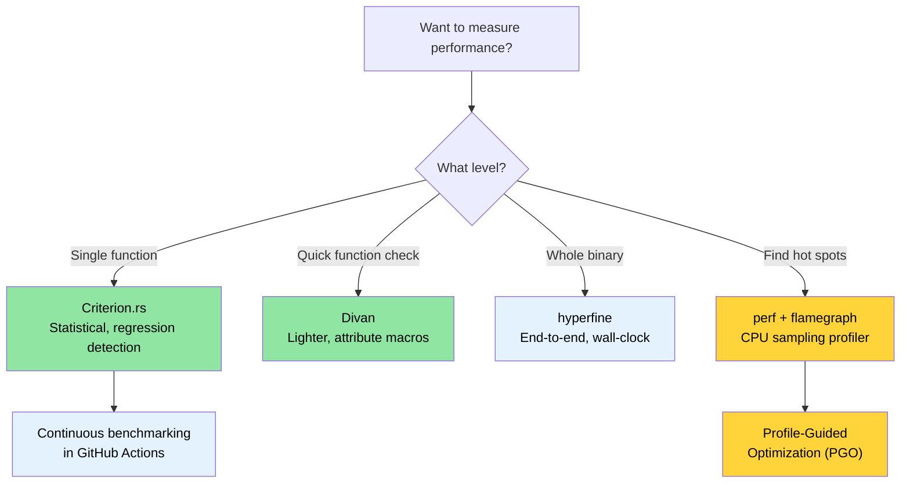

# Benchmarking — Measuring What Matters 🟡

> **What you'll learn:**
> - Why naive timing with `Instant::now()` produces unreliable results
> - Statistical benchmarking with Criterion.rs and the lighter Divan alternative
> - Profiling hot spots with `perf`, flamegraphs, and PGO
> - Setting up continuous benchmarking in CI to catch regressions automatically
>
> **Cross-references:** [Release Profiles](ch07-release-profiles-and-binary-size.md) — once you find the hot spot, optimize the binary · [CI/CD Pipeline](ch11-putting-it-all-together-a-production-cic.md) — benchmark job in the pipeline · [Code Coverage](ch04-code-coverage-seeing-what-tests-miss.md) — coverage tells you what's tested, benchmarks tell you what's fast

"We should forget about small efficiencies, say about 97% of the time: premature
optimization is the root of all evil. Yet we should not pass up our opportunities
in that critical 3%." — Donald Knuth

The hard part isn't *writing* benchmarks — it's writing benchmarks that produce
**meaningful, reproducible, actionable** numbers. This chapter covers the tools
and techniques that get you from "it seems fast" to "we have statistical evidence
that PR #347 regressed parsing throughput by 4.2%."

### Why Not `std::time::Instant`?

The temptation:

```rust
// ❌ Naive benchmarking — unreliable results
use std::time::Instant;

fn main() {
    let start = Instant::now();
    let result = parse_device_query_output(&sample_data);
    let elapsed = start.elapsed();
    println!("Parsing took {:?}", elapsed);
    // Problem 1: Compiler may optimize away `result` (dead code elimination)
    // Problem 2: Single sample — no statistical significance
    // Problem 3: CPU frequency scaling, thermal throttling, other processes
    // Problem 4: Cold cache vs warm cache not controlled
}
```

Problems with manual timing:
1. **Dead code elimination** — the compiler may skip the computation entirely if
   the result isn't used.
2. **No warm-up** — the first run includes cache misses, JIT effects (irrelevant
   in Rust, but OS page faults apply), and lazy initialization.
3. **No statistical analysis** — a single measurement tells you nothing about
   variance, outliers, or confidence intervals.
4. **No regression detection** — you can't compare against previous runs.

### Criterion.rs — Statistical Benchmarking

[Criterion.rs](https://bheisler.github.io/criterion.rs/book/) is the de facto
standard for Rust micro-benchmarks. It uses statistical methods to produce
reliable measurements and detects performance regressions automatically.

**Setup:**

```toml
# Cargo.toml
[dev-dependencies]
criterion = { version = "0.5", features = ["html_reports", "cargo_bench_support"] }

[[bench]]
name = "parsing_bench"
harness = false  # Use Criterion's harness, not the built-in test harness
```

**A complete benchmark:**

```rust
// benches/parsing_bench.rs
use criterion::{black_box, criterion_group, criterion_main, Criterion, BenchmarkId};

/// Data type for parsed GPU information
#[derive(Debug, Clone)]
struct GpuInfo {
    index: u32,
    name: String,
    temp_c: u32,
    power_w: f64,
}

/// The function under test — simulate parsing device-query CSV output
fn parse_gpu_csv(input: &str) -> Vec<GpuInfo> {
    input
        .lines()
        .filter(|line| !line.starts_with('#'))
        .filter_map(|line| {
            let fields: Vec<&str> = line.split(", ").collect();
            if fields.len() >= 4 {
                Some(GpuInfo {
                    index: fields[0].parse().ok()?,
                    name: fields[1].to_string(),
                    temp_c: fields[2].parse().ok()?,
                    power_w: fields[3].parse().ok()?,
                })
            } else {
                None
            }
        })
        .collect()
}

fn bench_parse_gpu_csv(c: &mut Criterion) {
    // Representative test data
    let small_input = "0, Acme Accel-V1-80GB, 32, 65.5\n\
                       1, Acme Accel-V1-80GB, 34, 67.2\n";

    let large_input = (0..64)
        .map(|i| format!("{i}, Acme Accel-X1-80GB, {}, {:.1}\n", 30 + i % 20, 60.0 + i as f64))
        .collect::<String>();

    c.bench_function("parse_2_gpus", |b| {
        b.iter(|| parse_gpu_csv(black_box(small_input)))
    });

    c.bench_function("parse_64_gpus", |b| {
        b.iter(|| parse_gpu_csv(black_box(&large_input)))
    });
}

criterion_group!(benches, bench_parse_gpu_csv);
criterion_main!(benches);
```

**Running and reading results:**

```bash
# Run all benchmarks
cargo bench

# Run a specific benchmark by name
cargo bench -- parse_64

# Output:
# parse_2_gpus        time:   [1.2345 µs  1.2456 µs  1.2578 µs]
#                      ▲            ▲           ▲
#                      │       confidence interval
#                   lower 95%    median    upper 95%
#
# parse_64_gpus       time:   [38.123 µs  38.456 µs  38.812 µs]
#                     change: [-1.2345% -0.5678% +0.1234%] (p = 0.12 > 0.05)
#                     No change in performance detected.
```

**What `black_box()` does**: It's a compiler hint that prevents dead-code
elimination and over-aggressive constant folding. The compiler cannot see
through `black_box`, so it must actually compute the result.

### Parameterized Benchmarks and Benchmark Groups

Compare multiple implementations or input sizes:

```rust
// benches/comparison_bench.rs
use criterion::{criterion_group, criterion_main, Criterion, BenchmarkId, Throughput};

fn bench_parsing_strategies(c: &mut Criterion) {
    let mut group = c.benchmark_group("csv_parsing");

    // Test across different input sizes
    for num_gpus in [1, 8, 32, 64, 128] {
        let input = generate_gpu_csv(num_gpus);

        // Set throughput for bytes-per-second reporting
        group.throughput(Throughput::Bytes(input.len() as u64));

        group.bench_with_input(
            BenchmarkId::new("split_based", num_gpus),
            &input,
            |b, input| b.iter(|| parse_split(input)),
        );

        group.bench_with_input(
            BenchmarkId::new("regex_based", num_gpus),
            &input,
            |b, input| b.iter(|| parse_regex(input)),
        );

        group.bench_with_input(
            BenchmarkId::new("nom_based", num_gpus),
            &input,
            |b, input| b.iter(|| parse_nom(input)),
        );
    }
    group.finish();
}

criterion_group!(benches, bench_parsing_strategies);
criterion_main!(benches);
```

**Output**: Criterion generates an HTML report at `target/criterion/report/index.html`
with violin plots, comparison charts, and regression analysis — open in a browser.

### Divan — A Lighter Alternative

[Divan](https://github.com/nvzqz/divan) is a newer benchmarking framework that
uses attribute macros instead of Criterion's macro DSL:

```toml
# Cargo.toml
[dev-dependencies]
divan = "0.1"

[[bench]]
name = "parsing_bench"
harness = false
```

```rust
// benches/parsing_bench.rs
use divan::black_box;

const SMALL_INPUT: &str = "0, Acme Accel-V1-80GB, 32, 65.5\n\
                          1, Acme Accel-V1-80GB, 34, 67.2\n";

fn generate_gpu_csv(n: usize) -> String {
    (0..n)
        .map(|i| format!("{i}, Acme Accel-X1-80GB, {}, {:.1}\n", 30 + i % 20, 60.0 + i as f64))
        .collect()
}

fn main() {
    divan::main();
}

#[divan::bench]
fn parse_2_gpus() -> Vec<GpuInfo> {
    parse_gpu_csv(black_box(SMALL_INPUT))
}

#[divan::bench(args = [1, 8, 32, 64, 128])]
fn parse_n_gpus(n: usize) -> Vec<GpuInfo> {
    let input = generate_gpu_csv(n);
    parse_gpu_csv(black_box(&input))
}

// Divan output is a clean table:
// ╰─ parse_2_gpus   fastest  │ slowest  │ median   │ mean     │ samples │ iters
//                   1.234 µs │ 1.567 µs │ 1.345 µs │ 1.350 µs │ 100     │ 1600
```

**When to choose Divan over Criterion:**
- Simpler API (attribute macros, less boilerplate)
- Faster compilation (fewer dependencies)
- Good for quick perf checks during development

**When to choose Criterion:**
- Statistical regression detection across runs
- HTML reports with charts
- Established ecosystem, more CI integrations

### Profiling with `perf` and Flamegraphs

Benchmarks tell you *how fast* — profiling tells you *where the time goes*.

```bash
# Step 1: Build with debug info (release speed, debug symbols)
cargo build --release
# Ensure debug info is available:
# [profile.release]
# debug = true          # Add this temporarily for profiling

# Step 2: Record with perf
perf record --call-graph=dwarf ./target/release/diag_tool --run-diagnostics

# Step 3: Generate a flamegraph
# Install: cargo install flamegraph
# Install: cargo install addr2line --features=bin (optional, speedup cargo-flamegraph)
cargo flamegraph --root -- --run-diagnostics
# Opens an interactive SVG flamegraph

# Alternative: use perf + inferno
perf script | inferno-collapse-perf | inferno-flamegraph > flamegraph.svg
```

**Reading a flamegraph:**
- **Width** = time spent in that function (wider = slower)
- **Height** = call stack depth (taller ≠ slower, just deeper)
- **Bottom** = entry point, **Top** = leaf functions doing actual work
- Look for wide plateaus at the top — those are your hot spots

**Profile-guided optimization (PGO):**

```bash
# Step 1: Build with instrumentation
RUSTFLAGS="-Cprofile-generate=/tmp/pgo-data" cargo build --release

# Step 2: Run representative workloads
./target/release/diag_tool --run-full   # generates profiling data

# Step 3: Merge profiling data
# Use the llvm-profdata that matches rustc's LLVM version:
# $(rustc --print sysroot)/lib/rustlib/x86_64-unknown-linux-gnu/bin/llvm-profdata
# Or if llvm-tools is installed: rustup component add llvm-tools
llvm-profdata merge -o /tmp/pgo-data/merged.profdata /tmp/pgo-data/

# Step 4: Rebuild with profiling feedback
RUSTFLAGS="-Cprofile-use=/tmp/pgo-data/merged.profdata" cargo build --release
# Typical improvement: 5-20% for compute-bound code (parsing, crypto, codegen).
# I/O-bound or syscall-heavy code (like a large project) will see much less benefit
# because the CPU is mostly waiting, not executing hot loops.
```

> **Tip**: Before spending time on PGO, ensure your [release profile](ch07-release-profiles-and-binary-size.md)
> already has LTO enabled — it typically delivers a bigger win for less effort.

### `hyperfine` — Quick End-to-End Timing

[`hyperfine`](https://github.com/sharkdp/hyperfine) benchmarks entire commands,
not individual functions. It's perfect for measuring overall binary performance:

```bash
# Install
cargo install hyperfine
# Or: sudo apt install hyperfine  (Ubuntu 23.04+)

# Basic benchmark
hyperfine './target/release/diag_tool --run-diagnostics'

# Compare two implementations
hyperfine './target/release/diag_tool_v1 --run-diagnostics' \
          './target/release/diag_tool_v2 --run-diagnostics'

# Warm-up runs + minimum iterations
hyperfine --warmup 3 --min-runs 10 './target/release/diag_tool --run-all'

# Export results as JSON for CI comparison
hyperfine --export-json bench.json './target/release/diag_tool --run-all'
```

**When to use `hyperfine` vs Criterion:**
- `hyperfine`: whole-binary timing, comparing before/after a refactor, I/O-bound workloads
- Criterion: micro-benchmarks of individual functions, statistical regression detection

### Continuous Benchmarking in CI

Detect performance regressions before they ship:

```yaml
# .github/workflows/bench.yml
name: Benchmarks

on:
  pull_request:
    paths: ['**/*.rs', 'Cargo.toml', 'Cargo.lock']

jobs:
  benchmark:
    runs-on: ubuntu-latest
    steps:
      - uses: actions/checkout@v4

      - uses: dtolnay/rust-toolchain@stable

      - name: Run benchmarks
        # Requires criterion = { features = ["cargo_bench_support"] } for --output-format
        run: cargo bench -- --output-format bencher | tee bench_output.txt

      - name: Store benchmark result
        uses: benchmark-action/github-action-benchmark@v1
        with:
          tool: 'cargo'
          output-file-path: bench_output.txt
          github-token: ${{ secrets.GITHUB_TOKEN }}
          auto-push: true
          alert-threshold: '120%'    # Alert if 20% slower
          comment-on-alert: true
          fail-on-alert: true        # Block PR if regression detected
```

**Key CI considerations:**
- Use **dedicated benchmark runners** (not shared CI) for consistent results
- Pin the runner to a specific machine type if using cloud CI
- Store historical data to detect gradual regressions
- Set thresholds based on your workload's tolerance (5% for hot paths, 20% for cold)

### Application: Parsing Performance

The project has several performance-sensitive parsing paths that
would benefit from benchmarks:

| Parsing Hot Spot | Crate | Why It Matters |
|------------------|-------|----------------|
| accelerator-query CSV/XML output | `device_diag` | Called per-GPU, up to 8× per run |
| Sensor event parsing | `event_log` | Thousands of records on busy servers |
| PCIe topology JSON | `topology_lib` | Complex nested structures, golden-file validated |
| Report JSON serialization | `diag_framework` | Final report output, size-sensitive |
| Config JSON loading | `config_loader` | Startup latency |

**Recommended first benchmark** — the topology parser, which already has golden-file
test data:

```rust
// topology_lib/benches/parse_bench.rs (proposed)
use criterion::{criterion_group, criterion_main, Criterion, Throughput};
use std::fs;

fn bench_topology_parse(c: &mut Criterion) {
    let mut group = c.benchmark_group("topology_parse");

    for golden_file in ["S2001", "S1015", "S1035", "S1080"] {
        let path = format!("tests/test_data/{golden_file}.json");
        let data = fs::read_to_string(&path).expect("golden file not found");
        group.throughput(Throughput::Bytes(data.len() as u64));

        group.bench_function(golden_file, |b| {
            b.iter(|| {
                topology_lib::TopologyProfile::from_json_str(
                    criterion::black_box(&data)
                )
            });
        });
    }
    group.finish();
}

criterion_group!(benches, bench_topology_parse);
criterion_main!(benches);
```

### Try It Yourself

1. **Write a Criterion benchmark**: Pick any parsing function in your codebase.
   Create a `benches/` directory, set up a Criterion benchmark that measures
   throughput in bytes/second. Run `cargo bench` and examine the HTML report.

2. **Generate a flamegraph**: Build your project with `debug = true` in
   `[profile.release]`, then run `cargo flamegraph -- <your-args>`. Identify
   the three widest stacks at the top of the flamegraph — those are your hot spots.

3. **Compare with `hyperfine`**: Install `hyperfine` and benchmark the overall
   execution time of your binary with different flags. Compare it to the
   per-function times from Criterion. Where does the time go that Criterion
   doesn't see? (Answer: I/O, syscalls, process startup.)

### Benchmark Tool Selection



### 🏋️ Exercises

#### 🟢 Exercise 1: First Criterion Benchmark

Create a crate with a function that sorts a `Vec<u64>` of 10,000 random elements. Write a Criterion benchmark for it, then switch to `.sort_unstable()` and observe the performance difference in the HTML report.

<details>
<summary>Solution</summary>

```toml
# Cargo.toml
[[bench]]
name = "sort_bench"
harness = false

[dev-dependencies]
criterion = { version = "0.5", features = ["html_reports"] }
rand = "0.8"
```

```rust
// benches/sort_bench.rs
use criterion::{black_box, criterion_group, criterion_main, Criterion};
use rand::Rng;

fn generate_data(n: usize) -> Vec<u64> {
    let mut rng = rand::thread_rng();
    (0..n).map(|_| rng.gen()).collect()
}

fn bench_sort(c: &mut Criterion) {
    let mut group = c.benchmark_group("sort-10k");

    group.bench_function("stable", |b| {
        b.iter_batched(
            || generate_data(10_000),
            |mut data| { data.sort(); black_box(&data); },
            criterion::BatchSize::SmallInput,
        )
    });

    group.bench_function("unstable", |b| {
        b.iter_batched(
            || generate_data(10_000),
            |mut data| { data.sort_unstable(); black_box(&data); },
            criterion::BatchSize::SmallInput,
        )
    });

    group.finish();
}

criterion_group!(benches, bench_sort);
criterion_main!(benches);
```

```bash
cargo bench
open target/criterion/sort-10k/report/index.html
```
</details>

#### 🟡 Exercise 2: Flamegraph Hot Spot

Build a project with `debug = true` in `[profile.release]`, then generate a flamegraph. Identify the top 3 widest stacks.

<details>
<summary>Solution</summary>

```toml
# Cargo.toml
[profile.release]
debug = true  # Keep symbols for flamegraph
```

```bash
cargo install flamegraph
cargo flamegraph --release -- <your-args>
# Opens flamegraph.svg in browser
# The widest stacks at the top are your hot spots
```
</details>

### Key Takeaways

- Never benchmark with `Instant::now()` — use Criterion.rs for statistical rigor and regression detection
- `black_box()` prevents the compiler from optimizing away your benchmark target
- `hyperfine` measures wall-clock time for the whole binary; Criterion measures individual functions — use both
- Flamegraphs show *where* time is spent; benchmarks show *how much* time is spent
- Continuous benchmarking in CI catches performance regressions before they ship

---
