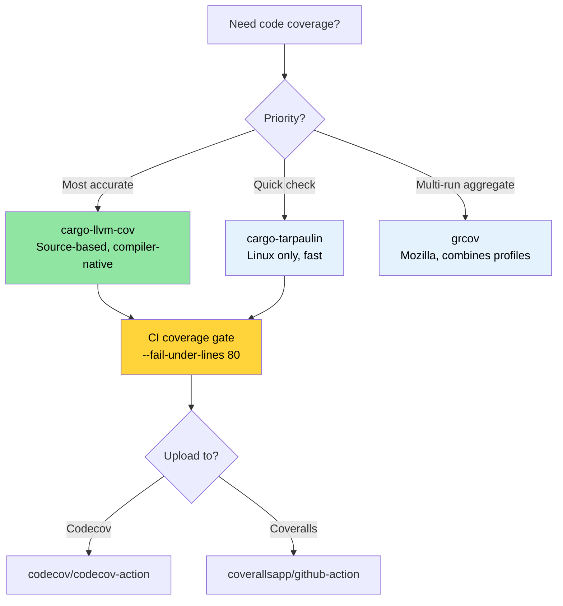

# Code Coverage — Seeing What Tests Miss 🟢

> **What you'll learn:**
> - Source-based coverage with `cargo-llvm-cov` (the most accurate Rust coverage tool)
> - Quick coverage checks with `cargo-tarpaulin` and Mozilla's `grcov`
> - Setting up coverage gates in CI with Codecov and Coveralls
> - A coverage-guided testing strategy that prioritizes high-risk blind spots
>
> **Cross-references:** [Miri and Sanitizers](ch05-miri-valgrind-and-sanitizers-verifying-u.md) — coverage finds untested code, Miri finds UB in tested code · [Benchmarking](ch03-benchmarking-measuring-what-matters.md) — coverage shows *what's tested*, benchmarks show *what's fast* · [CI/CD Pipeline](ch11-putting-it-all-together-a-production-cic.md) — coverage gate in the pipeline

Code coverage measures which lines, branches, or functions your tests actually
execute. It doesn't prove correctness (a covered line can still have bugs), but
it reliably reveals **blind spots** — code paths that no test exercises at all.

With 1,006 tests across many crates, the project has substantial test investment.
Coverage analysis answers: "Is that investment reaching the code that matters?"

### Source-Based Coverage with `llvm-cov`

Rust uses LLVM, which provides source-based coverage instrumentation — the most
accurate coverage method available. The recommended tool is
[`cargo-llvm-cov`](https://github.com/taiki-e/cargo-llvm-cov):

```bash
# Install
cargo install cargo-llvm-cov

# Or via rustup component (for the raw llvm tools)
rustup component add llvm-tools-preview
```

**Basic usage:**

```bash
# Run tests and show per-file coverage summary
cargo llvm-cov

# Generate HTML report (browsable, line-by-line highlighting)
cargo llvm-cov --html
# Output: target/llvm-cov/html/index.html

# Generate LCOV format (for CI integrations)
cargo llvm-cov --lcov --output-path lcov.info

# Workspace-wide coverage (all crates)
cargo llvm-cov --workspace

# Include only specific packages
cargo llvm-cov --package accel_diag --package topology_lib

# Coverage including doc tests
cargo llvm-cov --doctests
```

**Reading the HTML report:**

```text
target/llvm-cov/html/index.html
├── Filename          │ Function │ Line   │ Branch │ Region
├─ accel_diag/src/lib.rs │  78.5%  │ 82.3% │ 61.2% │  74.1%
├─ sel_mgr/src/parse.rs│  95.2%  │ 96.8% │ 88.0% │  93.5%
├─ topology_lib/src/.. │  91.0%  │ 93.4% │ 79.5% │  89.2%
└─ ...

Green = covered    Red = not covered    Yellow = partially covered (branch)
```

**Coverage types explained:**

| Type | What It Measures | Significance |
|------|------------------|-------------|
| **Line coverage** | Which source lines were executed | Basic "was this code reached?" |
| **Branch coverage** | Which `if`/`match` arms were taken | Catches untested conditions |
| **Function coverage** | Which functions were called | Finds dead code |
| **Region coverage** | Which code regions (sub-expressions) were hit | Most granular |

### cargo-tarpaulin — The Quick Path

[`cargo-tarpaulin`](https://github.com/xd009642/tarpaulin) is a Linux-specific
coverage tool that's simpler to set up (no LLVM components needed):

```bash
# Install
cargo install cargo-tarpaulin

# Basic coverage report
cargo tarpaulin

# HTML output
cargo tarpaulin --out Html

# With specific options
cargo tarpaulin \
    --workspace \
    --timeout 120 \
    --out Xml Html \
    --output-dir coverage/ \
    --exclude-files "*/tests/*" "*/benches/*" \
    --ignore-panics

# Skip certain crates
cargo tarpaulin --workspace --exclude diag_tool  # exclude the binary crate
```

**tarpaulin vs llvm-cov comparison:**

| Feature | cargo-llvm-cov | cargo-tarpaulin |
|---------|----------------|-----------------|
| Accuracy | Source-based (most accurate) | Ptrace-based (occasional overcounting) |
| Platform | Any (llvm-based) | Linux only |
| Branch coverage | Yes | Limited |
| Doc tests | Yes | No |
| Setup | Needs `llvm-tools-preview` | Self-contained |
| Speed | Faster (compile-time instrumentation) | Slower (ptrace overhead) |
| Stability | Very stable | Occasional false positives |

**Recommendation**: Use `cargo-llvm-cov` for accuracy. Use `cargo-tarpaulin` when
you need a quick check without installing LLVM tools.

### grcov — Mozilla's Coverage Tool

[`grcov`](https://github.com/mozilla/grcov) is Mozilla's coverage aggregator.
It consumes raw LLVM profiling data and produces reports in multiple formats:

```bash
# Install
cargo install grcov

# Step 1: Build with coverage instrumentation
export RUSTFLAGS="-Cinstrument-coverage"
export LLVM_PROFILE_FILE="target/coverage/%p-%m.profraw"
cargo build --tests

# Step 2: Run tests (generates .profraw files)
cargo test

# Step 3: Aggregate with grcov
grcov target/coverage/ \
    --binary-path target/debug/ \
    --source-dir . \
    --output-types html,lcov \
    --output-path target/coverage/report \
    --branch \
    --ignore-not-existing \
    --ignore "*/tests/*" \
    --ignore "*/.cargo/*"

# Step 4: View report
open target/coverage/report/html/index.html
```

**When to use grcov**: It's most useful when you need to **merge coverage from
multiple test runs** (e.g., unit tests + integration tests + fuzz tests) into a
single report.

### Coverage in CI: Codecov and Coveralls

Upload coverage data to a tracking service for historical trends and PR annotations:

```yaml
# .github/workflows/coverage.yml
name: Code Coverage

on: [push, pull_request]

jobs:
  coverage:
    runs-on: ubuntu-latest
    steps:
      - uses: actions/checkout@v4
      - uses: dtolnay/rust-toolchain@stable
        with:
          components: llvm-tools-preview

      - name: Install cargo-llvm-cov
        uses: taiki-e/install-action@cargo-llvm-cov

      - name: Generate coverage
        run: cargo llvm-cov --workspace --lcov --output-path lcov.info

      - name: Upload to Codecov
        uses: codecov/codecov-action@v4
        with:
          files: lcov.info
          token: ${{ secrets.CODECOV_TOKEN }}
          fail_ci_if_error: true

      # Optional: enforce minimum coverage
      - name: Check coverage threshold
        run: |
          cargo llvm-cov --workspace --fail-under-lines 80
          # Fails the build if line coverage drops below 80%
```

**Coverage gates** — enforce minimums per crate by reading the JSON output:

```bash
# Get per-crate coverage as JSON
cargo llvm-cov --workspace --json | jq '.data[0].totals.lines.percent'

# Fail if below threshold
cargo llvm-cov --workspace --fail-under-lines 80
cargo llvm-cov --workspace --fail-under-functions 70
cargo llvm-cov --workspace --fail-under-regions 60
```

### Coverage-Guided Testing Strategy

Coverage numbers alone are meaningless without a strategy. Here's how to use
coverage data effectively:

**Step 1: Triage by risk**

```text
High coverage, high risk     → ✅ Good — maintain it
High coverage, low risk      → 🔄 Possibly over-tested — skip if slow
Low coverage, high risk      → 🔴 Write tests NOW — this is where bugs hide
Low coverage, low risk       → 🟡 Track but don't panic
```

**Step 2: Focus on branch coverage, not line coverage**

```rust
// 100% line coverage, 50% branch coverage — still risky!
pub fn classify_temperature(temp_c: i32) -> ThermalState {
    if temp_c > 105 {       // ← tested with temp=110 → Critical
        ThermalState::Critical
    } else if temp_c > 85 { // ← tested with temp=90 → Warning
        ThermalState::Warning
    } else if temp_c < -10 { // ← NEVER TESTED → sensor error case missed
        ThermalState::SensorError
    } else {
        ThermalState::Normal  // ← tested with temp=25 → Normal
    }
}
```

**Step 3: Exclude noise**

```bash
# Exclude test code from coverage (it's always "covered")
cargo llvm-cov --workspace --ignore-filename-regex 'tests?\.rs$|benches/'

# Exclude generated code
cargo llvm-cov --workspace --ignore-filename-regex 'target/'
```

In code, mark untestable sections:

```rust
// Coverage tools recognize this pattern
#[cfg(not(tarpaulin_include))]  // tarpaulin
fn unreachable_hardware_path() {
    // This path requires actual GPU hardware to trigger
}

// For llvm-cov, use a more targeted approach:
// Simply accept that some paths need integration/hardware tests,
// not unit tests. Track them in a coverage exceptions list.
```

### Complementary Testing Tools

**`proptest` — Property-Based Testing** finds edge cases that hand-written tests miss:

```toml
[dev-dependencies]
proptest = "1"
```

```rust
use proptest::prelude::*;

proptest! {
    #[test]
    fn parse_never_panics(input in "\\PC*") {
        // proptest generates thousands of random strings
        // If parse_gpu_csv panics on any input, the test fails
        // and proptest minimizes the failing case for you.
        let _ = parse_gpu_csv(&input);
    }

    #[test]
    fn temperature_roundtrip(raw in 0u16..4096) {
        let temp = Temperature::from_raw(raw);
        let md = temp.millidegrees_c();
        // Property: millidegrees should always be derivable from raw
        assert_eq!(md, (raw as i32) * 625 / 10);
    }
}
```

**`insta` — Snapshot Testing** for large structured outputs (JSON, text reports):

```toml
[dev-dependencies]
insta = { version = "1", features = ["json"] }
```

```rust
#[test]
fn test_der_report_format() {
    let report = generate_der_report(&test_results);
    // First run: creates a snapshot file. Subsequent runs: compares against it.
    // Run `cargo insta review` to accept changes interactively.
    insta::assert_json_snapshot!(report);
}
```

> **When to add proptest/insta**: If your unit tests are all "happy path" examples,
> proptest will find the edge cases you missed. If you're testing large output
> formats (JSON reports, DER records), insta snapshots are faster to write and
> maintain than hand-written assertions.

### Application: 1,000+ Tests Coverage Map

The project has 1,000+ tests but no coverage tracking. Adding it
reveals the testing investment distribution. Uncovered paths are prime candidates
for [Miri and sanitizer](ch05-miri-valgrind-and-sanitizers-verifying-u.md) verification:

**Recommended coverage configuration:**

```bash
# Quick workspace coverage (proposed CI command)
cargo llvm-cov --workspace \
    --ignore-filename-regex 'tests?\.rs$' \
    --fail-under-lines 75 \
    --html

# Per-crate coverage for targeted improvement
for crate in accel_diag event_log topology_lib network_diag compute_diag fan_diag; do
    echo "=== $crate ==="
    cargo llvm-cov --package "$crate" --json 2>/dev/null | \
        jq -r '.data[0].totals | "Lines: \(.lines.percent | round)%  Branches: \(.branches.percent | round)%"'
done
```

**Expected high-coverage crates** (based on test density):
- `topology_lib` — 922-line golden-file test suite
- `event_log` — registry with `create_test_record()` helpers
- `cable_diag` — `make_test_event()` / `make_test_context()` patterns

**Expected coverage gaps** (based on code inspection):
- Error handling arms in IPMI communication paths
- GPU hardware-specific branches (require actual GPU)
- `dmesg` parsing edge cases (platform-dependent output)

> **The 80/20 rule of coverage**: Getting from 0% to 80% coverage is straightforward.
> Getting from 80% to 95% requires increasingly contrived test scenarios. Getting
> from 95% to 100% requires `#[cfg(not(...))]` exclusions and is rarely worth the
> effort. Target **80% line coverage and 70% branch coverage** as a practical floor.

### Troubleshooting Coverage

| Symptom | Cause | Fix |
|---------|-------|-----|
| `llvm-cov` shows 0% for all files | Instrumentation not applied | Ensure you run `cargo llvm-cov`, not `cargo test` + `llvm-cov` separately |
| Coverage counts `unreachable!()` as uncovered | Those branches exist in compiled code | Use `#[cfg(not(tarpaulin_include))]` or add to exclusion regex |
| Test binary crashes under coverage | Instrumentation + sanitizer conflict | Don't combine `cargo llvm-cov` with `-Zsanitizer=address`; run them separately |
| Coverage differs between `llvm-cov` and `tarpaulin` | Different instrumentation techniques | Use `llvm-cov` as source of truth (compiler-native); file issues for large discrepancies |
| `error: profraw file is malformed` | Test binary crashed mid-execution | Fix the test failure first; profraw files are corrupt when the process exits abnormally |
| Branch coverage seems impossibly low | Optimizer creates branches for match arms, unwrap, etc. | Focus on *line* coverage for practical thresholds; branch coverage is inherently lower |

### Try It Yourself

1. **Measure coverage on your project**: Run `cargo llvm-cov --workspace --html`
   and open the report. Find the three files with the lowest coverage. Are they
   untested, or inherently hard to test (hardware-dependent code)?

2. **Set a coverage gate**: Add `cargo llvm-cov --workspace --fail-under-lines 60`
   to your CI. Intentionally comment out a test and verify CI fails. Then raise
   the threshold to your project's actual coverage level minus 2%.

3. **Branch vs. line coverage**: Write a function with a 3-arm `match` and
   test only 2 arms. Compare line coverage (may show 66%) vs. branch coverage
   (may show 50%). Which metric is more useful for your project?

### Coverage Tool Selection



### 🏋️ Exercises

#### 🟢 Exercise 1: First Coverage Report

Install `cargo-llvm-cov`, run it on any Rust project, and open the HTML report. Find the three files with the lowest line coverage.

<details>
<summary>Solution</summary>

```bash
cargo install cargo-llvm-cov
cargo llvm-cov --workspace --html --open
# The report sorts files by coverage — lowest at the bottom
# Look for files under 50% — those are your blind spots
```
</details>

#### 🟡 Exercise 2: CI Coverage Gate

Add a coverage gate to a GitHub Actions workflow that fails if line coverage drops below 60%. Verify it works by commenting out a test.

<details>
<summary>Solution</summary>

```yaml
# .github/workflows/coverage.yml
name: Coverage
on: [push, pull_request]
jobs:
  coverage:
    runs-on: ubuntu-latest
    steps:
      - uses: actions/checkout@v4
      - uses: dtolnay/rust-toolchain@stable
        with:
          components: llvm-tools-preview
      - run: cargo install cargo-llvm-cov
      - run: cargo llvm-cov --workspace --fail-under-lines 60
```

Comment out a test, push, and watch the workflow fail.
</details>

### Key Takeaways

- `cargo-llvm-cov` is the most accurate coverage tool for Rust — it uses the compiler's own instrumentation
- Coverage doesn't prove correctness, but **zero coverage proves zero testing** — use it to find blind spots
- Set a coverage gate in CI (e.g., `--fail-under-lines 80`) to prevent regressions
- Don't chase 100% coverage — focus on high-risk code paths (error handling, unsafe, parsing)
- Never combine coverage instrumentation with sanitizers in the same run

---

