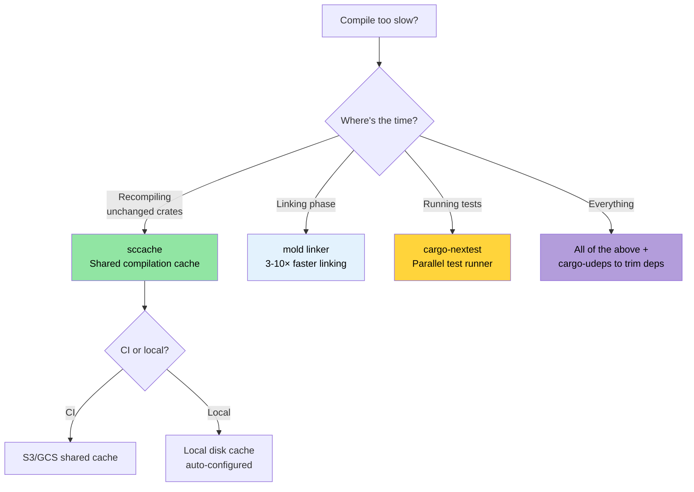

# Compile-Time and Developer Tools 🟡

> **What you'll learn:**
> - Compilation caching with `sccache` for local and CI builds
> - Faster linking with `mold` (3-10× faster than the default linker)
> - `cargo-nextest`: a faster, more informative test runner
> - Developer visibility tools: `cargo-expand`, `cargo-geiger`, `cargo-watch`
> - Workspace lints, MSRV policy, and documentation-as-CI
>
> **Cross-references:** [Release Profiles](ch07-release-profiles-and-binary-size.md) — LTO and binary size optimization · [CI/CD Pipeline](ch11-putting-it-all-together-a-production-cic.md) — these tools integrate into your pipeline · [Dependencies](ch06-dependency-management-and-supply-chain-s.md) — fewer deps = faster compiles

### Compile-Time Optimization: sccache, mold, cargo-nextest

Long compile times are the #1 developer pain point in Rust. These tools
collectively can cut iteration time by 50-80%:

**`sccache` — Shared compilation cache:**

```bash
# Install
cargo install sccache

# Configure as the Rust wrapper
export RUSTC_WRAPPER=sccache

# Or set permanently in .cargo/config.toml:
# [build]
# rustc-wrapper = "sccache"

# First build: normal speed (populates cache)
cargo build --release  # 3 minutes

# Clean + rebuild: cache hits for unchanged crates
cargo clean && cargo build --release  # 45 seconds

# Check cache statistics
sccache --show-stats
# Compile requests        1,234
# Cache hits               987 (80%)
# Cache misses             247
```

`sccache` supports shared caches (S3, GCS, Azure Blob) for team-wide and CI
cache sharing.

**`mold` — A faster linker:**

Linking is often the slowest phase. `mold` is 3-5× faster than `lld` and
10-20× faster than the default GNU `ld`:

```bash
# Install
sudo apt install mold  # Ubuntu 22.04+
# Note: mold is for ELF targets (Linux). macOS uses Mach-O, not ELF.
# The macOS linker (ld64) is already quite fast; if you need faster:
# brew install sold     # sold = mold for Mach-O (experimental, less mature)
# In practice, macOS link times are rarely a bottleneck.
```

```toml
# Use mold for linking
# .cargo/config.toml
[target.x86_64-unknown-linux-gnu]
rustflags = ["-C", "link-arg=-fuse-ld=mold"]
```

```bash
# See https://github.com/rui314/mold/blob/main/docs/mold.md#environment-variables
export MOLD_JOBS=1

# Verify mold is being used
cargo build -v 2>&1 | grep mold
```

**`cargo-nextest` — A faster test runner:**

```bash
# Install
cargo install cargo-nextest

# Run tests (parallel by default, per-test timeout, retry)
cargo nextest run

# Key advantages over cargo test:
# - Each test runs in its own process → better isolation
# - Parallel execution with smart scheduling
# - Per-test timeouts (no more hanging CI)
# - JUnit XML output for CI
# - Retry failed tests

# Configuration
cargo nextest run --retries 2 --fail-fast

# Archive test binaries (useful for CI: build once, test on multiple machines)
cargo nextest archive --archive-file tests.tar.zst
cargo nextest run --archive-file tests.tar.zst
```

```toml
# .config/nextest.toml
[profile.default]
retries = 0
slow-timeout = { period = "60s", terminate-after = 3 }
fail-fast = true

[profile.ci]
retries = 2
fail-fast = false
junit = { path = "test-results.xml" }
```

**Combined dev configuration:**

```toml
# .cargo/config.toml — optimize the development inner loop
[build]
rustc-wrapper = "sccache"       # Cache compilation artifacts

[target.x86_64-unknown-linux-gnu]
rustflags = ["-C", "link-arg=-fuse-ld=mold"]  # Faster linking

# Dev profile: optimize deps but not your code
# (put in Cargo.toml)
# [profile.dev.package."*"]
# opt-level = 2
```

### cargo-expand and cargo-geiger — Visibility Tools

**`cargo-expand`** — see what macros generate:

```bash
cargo install cargo-expand

# Expand all macros in a specific module
cargo expand --lib accel_diag::vendor

# Expand a specific derive
# Given: #[derive(Debug, Serialize, Deserialize)]
# cargo expand shows the generated impl blocks
cargo expand --lib --tests
```

Invaluable for debugging `#[derive]` macro output, `macro_rules!` expansions,
and understanding what `serde` generates for your types.

In addition to `cargo-expand`, you can also use rust-analyzer to expand macros:

1. Move cursor to the macro you want to check.
2. Open command palette (e.g. `F1` on VSCode).
3. Search for `rust-analyzer: Expand macro recursively at caret`.

**`cargo-geiger`** — count `unsafe` usage across your dependency tree:

```bash
cargo install cargo-geiger

cargo geiger
# Output:
# Metric output format: x/y
#   x = unsafe code used by the build
#   y = total unsafe code found in the crate
#
# Functions  Expressions  Impls  Traits  Methods
# 0/0        0/0          0/0    0/0     0/0      ✅ my_crate
# 0/5        0/23         0/2    0/0     0/3      ✅ serde
# 3/3        14/14        0/0    0/0     2/2      ❗ libc
# 15/15      142/142      4/4    0/0     12/12    ☢️ ring

# The symbols:
# ✅ = no unsafe used
# ❗ = some unsafe used
# ☢️ = heavily unsafe
```

For the project's zero-unsafe policy, `cargo geiger` verifies that no
dependency introduces unsafe code into the call graph that your code actually
exercises.

### Workspace Lints — `[workspace.lints]`

Since Rust 1.74, you can configure Clippy and compiler lints centrally in
`Cargo.toml` — no more `#![deny(...)]` at the top of every crate:

```toml
# Root Cargo.toml — lint configuration for all crates
[workspace.lints.clippy]
unwrap_used = "warn"         # Prefer ? or expect("reason")
dbg_macro = "deny"           # No dbg!() in committed code
todo = "warn"                # Track incomplete implementations
large_enum_variant = "warn"  # Catch accidental size bloat

[workspace.lints.rust]
unsafe_code = "deny"         # Enforce zero-unsafe policy
missing_docs = "warn"        # Encourage documentation
```

```toml
# Each crate's Cargo.toml — opt into workspace lints
[lints]
workspace = true
```

This replaces scattered `#![deny(clippy::unwrap_used)]` attributes and ensures
consistent policy across the entire workspace.

**Auto-fixing Clippy warnings:**

```bash
# Let Clippy automatically fix machine-applicable suggestions
cargo clippy --fix --workspace --all-targets --allow-dirty

# Fix and also apply suggestions that may change behavior (review carefully!)
cargo clippy --fix --workspace --all-targets --allow-dirty -- -W clippy::pedantic
```

> **Tip**: Run `cargo clippy --fix` before committing. It handles trivial
> issues (unused imports, redundant clones, type simplifications) that are
> tedious to fix by hand.

### MSRV Policy and rust-version

Minimum Supported Rust Version (MSRV) ensures your crate compiles on older
toolchains. This matters when deploying to systems with frozen Rust versions.

```toml
# Cargo.toml
[package]
name = "diag_tool"
version = "0.1.0"
rust-version = "1.75"    # Minimum Rust version required
```

```bash
# Verify MSRV compliance
cargo +1.75.0 check --workspace

# Automated MSRV discovery
cargo install cargo-msrv
cargo msrv find
# Output: Minimum Supported Rust Version is 1.75.0

# Verify in CI
cargo msrv verify
```

**MSRV in CI:**

```yaml
jobs:
  msrv:
    name: Check MSRV
    runs-on: ubuntu-latest
    steps:
      - uses: actions/checkout@v4
      - uses: dtolnay/rust-toolchain@master
        with:
          toolchain: "1.75.0"    # Match rust-version in Cargo.toml
      - run: cargo check --workspace
```

**MSRV strategy:**
- **Binary applications** (like a large project): Use latest stable. No MSRV needed.
- **Library crates** (published to crates.io): Set MSRV to oldest Rust version
  that supports all features you use. Commonly `N-2` (two versions behind current).
- **Enterprise deployments**: Set MSRV to match the oldest Rust version installed
  on your fleet.

### Application: Production Binary Profile

The project already has an excellent [release profile](ch07-release-profiles-and-binary-size.md):

```toml
# Current workspace Cargo.toml
[profile.release]
lto = true           # ✅ Full cross-crate optimization
codegen-units = 1    # ✅ Maximum optimization
panic = "abort"      # ✅ No unwinding overhead
strip = true         # ✅ Remove symbols for deployment

[profile.dev]
opt-level = 0        # ✅ Fast compilation
debug = true         # ✅ Full debug info
```

**Recommended additions:**

```toml
# Optimize dependencies in dev mode (faster test execution)
[profile.dev.package."*"]
opt-level = 2

# Test profile: some optimization to prevent timeout in slow tests
[profile.test]
opt-level = 1

# Keep overflow checks in release (safety)
[profile.release]
lto = true
codegen-units = 1
panic = "abort"
strip = true
overflow-checks = true    # ← add this: catch integer overflows
debug = "line-tables-only" # ← add this: backtraces without full DWARF
```

**Recommended developer tooling:**

```toml
# .cargo/config.toml (proposed)
[build]
rustc-wrapper = "sccache"  # 80%+ cache hit after first build

[target.x86_64-unknown-linux-gnu]
rustflags = ["-C", "link-arg=-fuse-ld=mold"]  # 3-5× faster linking
```

**Expected impact on the project:**

| Metric | Current | With Additions |
|--------|---------|----------------|
| Release binary | ~10 MB (stripped, LTO) | Same |
| Dev build time | ~45s | ~25s (sccache + mold) |
| Rebuild (1 file change) | ~15s | ~5s (sccache + mold) |
| Test execution | `cargo test` | `cargo nextest` — 2× faster |
| Dep vulnerability scanning | None | `cargo audit` in CI |
| License compliance | Manual | `cargo deny` automated |
| Unused dependency detection | Manual | `cargo udeps` in CI |

### `cargo-watch` — Auto-Rebuild on File Changes

[`cargo-watch`](https://github.com/watchexec/cargo-watch) re-runs a command
every time a source file changes — essential for tight feedback loops:

```bash
# Install
cargo install cargo-watch

# Re-check on every save (instant feedback)
cargo watch -x check

# Run clippy + tests on change
cargo watch -x 'clippy --workspace --all-targets' -x 'test --workspace --lib'

# Watch only specific crates (faster for large workspaces)
cargo watch -w accel_diag/src -x 'test -p accel_diag'

# Clear screen between runs
cargo watch -c -x check
```

> **Tip**: Combine with `mold` + `sccache` from above for sub-second
> re-check times on incremental changes.

### `cargo doc` and Workspace Documentation

For a large workspace, generated documentation is essential for
discoverability. `cargo doc` uses rustdoc to produce HTML docs from
doc-comments and type signatures:

```bash
# Generate docs for all workspace crates (opens in browser)
cargo doc --workspace --no-deps --open

# Include private items (useful during development)
cargo doc --workspace --no-deps --document-private-items

# Check doc-links without generating HTML (fast CI check)
cargo doc --workspace --no-deps 2>&1 | grep -E 'warning|error'
```

**Intra-doc links** — link between types across crates without URLs:

```rust
/// Runs GPU diagnostics using [`GpuConfig`] settings.
///
/// See [`crate::accel_diag::run_diagnostics`] for the implementation.
/// Returns [`DiagResult`] which can be serialized to the
/// [`DerReport`](crate::core_lib::DerReport) format.
pub fn run_accel_diag(config: &GpuConfig) -> DiagResult {
    // ...
}
```

**Show platform-specific APIs in docs:**

```rust
// Cargo.toml: [package.metadata.docs.rs]
// all-features = true
// rustdoc-args = ["--cfg", "docsrs"]

/// Windows-only: read battery status via Win32 API.
///
/// Only available on `cfg(windows)` builds.
#[cfg(windows)]
#[doc(cfg(windows))]  // Shows "Available on Windows only" badge in docs
pub fn get_battery_status() -> Option<u8> {
    // ...
}
```

**CI documentation check:**

```yaml
# Add to CI workflow
- name: Check documentation
  run: RUSTDOCFLAGS="-D warnings" cargo doc --workspace --no-deps
  # Treats broken intra-doc links as errors
```

> **For the project**: With many crates, `cargo doc --workspace` is the best
> way for new team members to discover the API surface. Add
> `RUSTDOCFLAGS="-D warnings"` to CI to catch broken doc-links before merge.

### Compile-Time Decision Tree



### 🏋️ Exercises

#### 🟢 Exercise 1: Set Up sccache + mold

Install `sccache` and `mold`, configure them in `.cargo/config.toml`, then measure the compile time improvement on a clean rebuild.

<details>
<summary>Solution</summary>

```bash
# Install
cargo install sccache
sudo apt install mold  # Ubuntu 22.04+

# Configure .cargo/config.toml:
cat > .cargo/config.toml << 'EOF'
[build]
rustc-wrapper = "sccache"

[target.x86_64-unknown-linux-gnu]
linker = "clang"
rustflags = ["-C", "link-arg=-fuse-ld=mold"]
EOF

# First build (populates cache)
time cargo build --release  # e.g., 180s

# Clean + rebuild (cache hits)
cargo clean
time cargo build --release  # e.g., 45s

sccache --show-stats
# Cache hits should be 60-80%+
```
</details>

#### 🟡 Exercise 2: Switch to cargo-nextest

Install `cargo-nextest` and run your test suite. Compare wall-clock time with `cargo test`. What's the speedup?

<details>
<summary>Solution</summary>

```bash
cargo install cargo-nextest

# Standard test runner
time cargo test --workspace 2>&1 | tail -5

# nextest (parallel per-test-binary execution)
time cargo nextest run --workspace 2>&1 | tail -5

# Typical speedup: 2-5× for large workspaces
# nextest also provides:
# - Per-test timing
# - Retries for flaky tests
# - JUnit XML output for CI
cargo nextest run --workspace --retries 2
```
</details>

### Key Takeaways

- `sccache` with S3/GCS backend shares compilation cache across team and CI
- `mold` is the fastest ELF linker — link times drop from seconds to milliseconds
- `cargo-nextest` runs tests in parallel per-binary with better output and retry support
- `cargo-geiger` counts `unsafe` usage — run it before accepting new dependencies
- `[workspace.lints]` centralizes Clippy and rustc lint configuration across a multi-crate workspace

---
