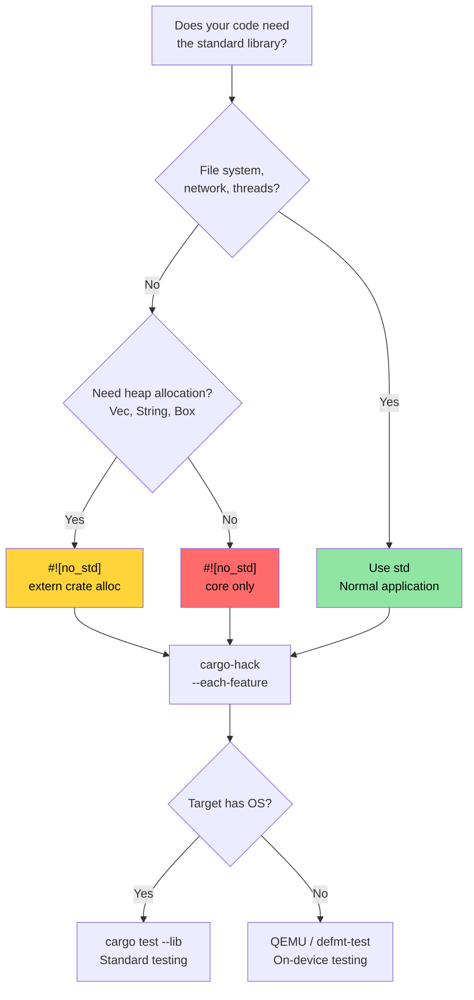

# `no_std` and Feature Verification 🔴

> **What you'll learn:**
> - Verifying feature combinations systematically with `cargo-hack`
> - The three layers of Rust: `core` vs `alloc` vs `std` and when to use each
> - Building `no_std` crates with custom panic handlers and allocators
> - Testing `no_std` code on host and with QEMU
>
> **Cross-references:** [Windows & Conditional Compilation](ch10-windows-and-conditional-compilation.md) — the platform half of this topic · [Cross-Compilation](ch02-cross-compilation-one-source-many-target.md) — cross-compiling to ARM and embedded targets · [Miri and Sanitizers](ch05-miri-valgrind-and-sanitizers-verifying-u.md) — verifying `unsafe` code in `no_std` environments · [Build Scripts](ch01-build-scripts-buildrs-in-depth.md) — `cfg` flags emitted by `build.rs`

Rust runs everywhere from 8-bit microcontrollers to cloud servers. This chapter
covers the foundation: stripping the standard library with `#![no_std]` and
verifying that your feature combinations actually compile.

### Verifying Feature Combinations with `cargo-hack`

[`cargo-hack`](https://github.com/taiki-e/cargo-hack) tests all feature
combinations systematically — essential for crates with `#[cfg(...)]` code:

```bash
# Install
cargo install cargo-hack

# Check that every feature compiles individually
cargo hack check --each-feature --workspace

# The nuclear option: test ALL feature combinations (exponential!)
# Only practical for crates with <8 features.
cargo hack check --feature-powerset --workspace

# Practical compromise: test each feature alone + all features + no features
cargo hack check --each-feature --workspace --no-dev-deps
cargo check --workspace --all-features
cargo check --workspace --no-default-features
```

**Why this matters for the project:**

If you add platform features (`linux`, `windows`, `direct-ipmi`, `direct-accel-api`),
`cargo-hack` catches combinations that break:

```toml
# Example: features that gate platform code
[features]
default = ["linux"]
linux = []                          # Linux-specific hardware access
windows = ["dep:windows-sys"]       # Windows-specific APIs
direct-ipmi = []                    # unsafe IPMI ioctl (ch05)
direct-accel-api = []                    # unsafe accel-mgmt FFI (ch05)
```

```bash
# Verify all features compile in isolation AND together
cargo hack check --each-feature -p diag_tool
# Catches: "feature 'windows' doesn't compile without 'direct-ipmi'"
# Catches: "#[cfg(feature = \"linux\")] has a typo — it's 'lnux'"
```

**CI integration:**

```yaml
# Add to CI pipeline (fast — just compilation checks)
- name: Feature matrix check
  run: cargo hack check --each-feature --workspace --no-dev-deps
```

> **Rule of thumb**: Run `cargo hack check --each-feature` in CI for any crate
> with 2+ features. Run `--feature-powerset` only for core library crates with
> <8 features — it's exponential ($2^n$ combinations).

### `no_std` — When and Why

`#![no_std]` tells the compiler: "don't link the standard library." Your
crate can only use `core` (and optionally `alloc`). Why would you want this?

| Scenario | Why `no_std` |
|----------|-------------|
| Embedded firmware (ARM Cortex-M, RISC-V) | No OS, no heap, no file system |
| UEFI diagnostics tool | Pre-boot environment, no OS APIs |
| Kernel modules | Kernel space can't use userspace `std` |
| WebAssembly (WASM) | Minimize binary size, no OS dependencies |
| Bootloaders | Run before any OS exists |
| Shared library with C interface | Avoid Rust runtime in callers |

**For hardware diagnostics**, `no_std` becomes relevant when building:
- UEFI-based pre-boot diagnostic tools (before the OS loads)
- BMC firmware diagnostics (resource-constrained ARM SoCs)
- Kernel-level PCIe diagnostics (kernel module or eBPF probe)

### `core` vs `alloc` vs `std` — The Three Layers

```text
┌─────────────────────────────────────────────────────────────┐
│ std                                                         │
│  Everything in core + alloc, PLUS:                          │
│  • File I/O (std::fs, std::io)                              │
│  • Networking (std::net)                                    │
│  • Threads (std::thread)                                    │
│  • Time (std::time)                                         │
│  • Environment (std::env)                                   │
│  • Process (std::process)                                   │
│  • OS-specific (std::os::unix, std::os::windows)            │
├─────────────────────────────────────────────────────────────┤
│ alloc          (available with #![no_std] + extern crate    │
│                 alloc, if you have a global allocator)       │
│  • String, Vec, Box, Rc, Arc                                │
│  • BTreeMap, BTreeSet                                       │
│  • format!() macro                                          │
│  • Collections and smart pointers that need heap            │
├─────────────────────────────────────────────────────────────┤
│ core           (always available, even in #![no_std])        │
│  • Primitive types (u8, bool, char, etc.)                    │
│  • Option, Result                                           │
│  • Iterator, slice, array, str (slices, not String)         │
│  • Traits: Clone, Copy, Debug, Display, From, Into          │
│  • Atomics (core::sync::atomic)                             │
│  • Cell, RefCell (core::cell)  — Pin (core::pin)            │
│  • core::fmt (formatting without allocation)                │
│  • core::mem, core::ptr (low-level memory operations)       │
│  • Math: core::num, basic arithmetic                        │
└─────────────────────────────────────────────────────────────┘
```

**What you lose without `std`:**
- No `HashMap` (requires a hasher — use `BTreeMap` from `alloc`, or `hashbrown`)
- No `println!()` (requires stdout — use `core::fmt::Write` to a buffer)
- No `std::error::Error` (stabilized in `core` since Rust 1.81, but many
  ecosystems haven't migrated)
- No file I/O, no networking, no threads (unless provided by a platform HAL)
- No `Mutex` (use `spin::Mutex` or platform-specific locks)

### Building a `no_std` Crate

```rust
// src/lib.rs — a no_std library crate
#![no_std]

// Optionally use heap allocation
extern crate alloc;
use alloc::string::String;
use alloc::vec::Vec;
use core::fmt;

/// Temperature reading from a thermal sensor.
/// This struct works in any environment — bare metal to Linux.
#[derive(Clone, Copy, Debug)]
pub struct Temperature {
    /// Raw sensor value (0.0625°C per LSB for typical I2C sensors)
    raw: u16,
}

impl Temperature {
    pub const fn from_raw(raw: u16) -> Self {
        Self { raw }
    }

    /// Convert to degrees Celsius (fixed-point, no FPU required)
    pub const fn millidegrees_c(&self) -> i32 {
        (self.raw as i32) * 625 / 10 // 0.0625°C resolution
    }

    pub fn degrees_c(&self) -> f32 {
        self.raw as f32 * 0.0625
    }
}

impl fmt::Display for Temperature {
    fn fmt(&self, f: &mut fmt::Formatter<'_>) -> fmt::Result {
        let md = self.millidegrees_c();
        // Handle sign correctly for values between -0.999°C and -0.001°C
        // where md / 1000 == 0 but the value is negative.
        if md < 0 && md > -1000 {
            write!(f, "-0.{:03}°C", (-md) % 1000)
        } else {
            write!(f, "{}.{:03}°C", md / 1000, (md % 1000).abs())
        }
    }
}

/// Parse space-separated temperature values.
/// Uses alloc — requires a global allocator.
pub fn parse_temperatures(input: &str) -> Vec<Temperature> {
    input
        .split_whitespace()
        .filter_map(|s| s.parse::<u16>().ok())
        .map(Temperature::from_raw)
        .collect()
}

/// Format without allocation — writes directly to a buffer.
/// Works in `core`-only environments (no alloc, no heap).
pub fn format_temp_into(temp: &Temperature, buf: &mut [u8]) -> usize {
    use core::fmt::Write;
    struct SliceWriter<'a> {
        buf: &'a mut [u8],
        pos: usize,
    }
    impl<'a> Write for SliceWriter<'a> {
        fn write_str(&mut self, s: &str) -> fmt::Result {
            let bytes = s.as_bytes();
            let remaining = self.buf.len() - self.pos;
            if bytes.len() > remaining {
                // Buffer full — signal the error instead of silently truncating.
                // Callers can check the returned pos for partial writes.
                return Err(fmt::Error);
            }
            self.buf[self.pos..self.pos + bytes.len()].copy_from_slice(bytes);
            self.pos += bytes.len();
            Ok(())
        }
    }
    let mut w = SliceWriter { buf, pos: 0 };
    let _ = write!(w, "{}", temp);
    w.pos
}
```

```toml
# Cargo.toml for a no_std crate
[package]
name = "thermal-sensor"
version = "0.1.0"
edition = "2021"

[features]
default = ["alloc"]
alloc = []    # Enable Vec, String, etc.
std = []      # Enable full std (implies alloc)

[dependencies]
# Use no_std-compatible crates
serde = { version = "1.0", default-features = false, features = ["derive"] }
# ↑ default-features = false drops std dependency!
```

> **Key crate pattern**: Many popular crates (serde, log, rand, embedded-hal)
> support `no_std` via `default-features = false`. Always check whether a
> dependency requires `std` before using it in a `no_std` context. Note that
> some crates (e.g., `regex`) require at least `alloc` and don't work in
> `core`-only environments.

### Custom Panic Handlers and Allocators

In `#![no_std]` binaries (not libraries), you must provide a panic handler
and optionally a global allocator:

```rust
// src/main.rs — a no_std binary (e.g., UEFI diagnostic)
#![no_std]
#![no_main]

extern crate alloc;

use core::panic::PanicInfo;

// Required: what to do on panic (no stack unwinding available)
#[panic_handler]
fn panic(info: &PanicInfo) -> ! {
    // In embedded: blink an LED, write to UART, hang
    // In UEFI: write to console, halt
    // Minimal: just loop forever
    loop {
        core::hint::spin_loop();
    }
}

// Required if using alloc: provide a global allocator
use alloc::alloc::{GlobalAlloc, Layout};

struct BumpAllocator {
    // Simple bump allocator for embedded/UEFI
    // In practice, use a crate like `linked_list_allocator` or `embedded-alloc`
}

// WARNING: This is a non-functional placeholder! Calling alloc() will return
// null, causing immediate UB (the global allocator contract requires non-null
// returns for non-zero-sized allocations). In real code, use an established
// allocator crate:
//   - embedded-alloc (embedded targets)
//   - linked_list_allocator (UEFI / OS kernels)
//   - talc (general-purpose no_std)
unsafe impl GlobalAlloc for BumpAllocator {
    /// # Safety
    /// Layout must have non-zero size. Returns null (placeholder — will crash).
    unsafe fn alloc(&self, _layout: Layout) -> *mut u8 {
        // PLACEHOLDER — will crash! Replace with real allocation logic.
        core::ptr::null_mut()
    }
    /// # Safety
    /// `_ptr` must have been returned by `alloc` with a compatible layout.
    unsafe fn dealloc(&self, _ptr: *mut u8, _layout: Layout) {
        // No-op for bump allocator
    }
}

#[global_allocator]
static ALLOCATOR: BumpAllocator = BumpAllocator {};

// Entry point (platform-specific, not fn main)
// For UEFI: #[entry] or efi_main
// For embedded: #[cortex_m_rt::entry]
```

### Testing `no_std` Code

Tests run on the host machine, which has `std`. The trick: your library is
`no_std`, but your test harness uses `std`:

```rust
// Your crate: #![no_std] in src/lib.rs
// But tests run under std automatically:

#[cfg(test)]
mod tests {
    use super::*;
    // std is available here — println!, assert!, Vec all work

    #[test]
    fn test_temperature_conversion() {
        let temp = Temperature::from_raw(800); // 50.0°C
        assert_eq!(temp.millidegrees_c(), 50000);
        assert!((temp.degrees_c() - 50.0).abs() < 0.01);
    }

    #[test]
    fn test_format_into_buffer() {
        let temp = Temperature::from_raw(800);
        let mut buf = [0u8; 32];
        let len = format_temp_into(&temp, &mut buf);
        let s = core::str::from_utf8(&buf[..len]).unwrap();
        assert_eq!(s, "50.000°C");
    }
}
```

**Testing on the actual target** (when `std` isn't available at all):

```bash
# Use defmt-test for on-device testing (embedded ARM)
# Use uefi-test-runner for UEFI targets
# Use QEMU for cross-architecture tests without hardware

# Run no_std library tests on host (always works):
cargo test --lib

# Verify no_std compilation against a no_std target:
cargo check --target thumbv7em-none-eabihf  # ARM Cortex-M
cargo check --target riscv32imac-unknown-none-elf  # RISC-V
```

### `no_std` Decision Tree



### 🏋️ Exercises

#### 🟡 Exercise 1: Feature Combination Verification

Install `cargo-hack` and run `cargo hack check --each-feature --workspace` on a project with multiple features. Does it find any broken combinations?

<details>
<summary>Solution</summary>

```bash
cargo install cargo-hack

# Check each feature individually
cargo hack check --each-feature --workspace --no-dev-deps

# If a feature combination fails:
# error[E0433]: failed to resolve: use of undeclared crate or module `std`
# → This means a feature gate is missing a #[cfg] guard

# Check all features + no features + each individually:
cargo hack check --each-feature --workspace
cargo check --workspace --all-features
cargo check --workspace --no-default-features
```
</details>

#### 🔴 Exercise 2: Build a `no_std` Library

Create a library crate that compiles with `#![no_std]`. Implement a simple stack-allocated ring buffer. Verify it compiles for `thumbv7em-none-eabihf` (ARM Cortex-M).

<details>
<summary>Solution</summary>

```rust
// lib.rs
#![no_std]

pub struct RingBuffer<const N: usize> {
    data: [u8; N],
    head: usize,
    len: usize,
}

impl<const N: usize> RingBuffer<N> {
    pub const fn new() -> Self {
        Self { data: [0; N], head: 0, len: 0 }
    }

    pub fn push(&mut self, byte: u8) -> bool {
        if self.len == N { return false; }
        let idx = (self.head + self.len) % N;
        self.data[idx] = byte;
        self.len += 1;
        true
    }

    pub fn pop(&mut self) -> Option<u8> {
        if self.len == 0 { return None; }
        let byte = self.data[self.head];
        self.head = (self.head + 1) % N;
        self.len -= 1;
        Some(byte)
    }
}

#[cfg(test)]
mod tests {
    use super::*;

    #[test]
    fn push_pop() {
        let mut rb = RingBuffer::<4>::new();
        assert!(rb.push(1));
        assert!(rb.push(2));
        assert_eq!(rb.pop(), Some(1));
        assert_eq!(rb.pop(), Some(2));
        assert_eq!(rb.pop(), None);
    }
}
```

```bash
rustup target add thumbv7em-none-eabihf
cargo check --target thumbv7em-none-eabihf
# ✅ Compiles for bare-metal ARM
```
</details>

### Key Takeaways

- `cargo-hack --each-feature` is essential for any crate with conditional compilation — run it in CI
- `core` → `alloc` → `std` are layered: each adds capabilities but requires more runtime support
- Custom panic handlers and allocators are required for bare-metal `no_std` binaries
- Test `no_std` libraries on the host with `cargo test --lib` — no hardware needed
- Run `--feature-powerset` only for core libraries with <8 features — it's $2^n$ combinations

---
