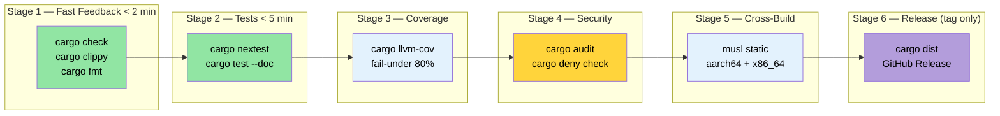

# Putting It All Together — A Production CI/CD Pipeline 🟡

> **What you'll learn:**
> - Structuring a multi-stage GitHub Actions CI workflow (check → test → coverage → security → cross → release)
> - Caching strategies with `rust-cache` and `save-if` tuning
> - Running Miri and sanitizers on a nightly schedule
> - Task automation with `Makefile.toml` and pre-commit hooks
> - Automated releases with `cargo-dist`
>
> **Cross-references:** [Build Scripts](ch01-build-scripts-buildrs-in-depth.md) · [Cross-Compilation](ch02-cross-compilation-one-source-many-target.md) · [Benchmarking](ch03-benchmarking-measuring-what-matters.md) · [Coverage](ch04-code-coverage-seeing-what-tests-miss.md) · [Miri/Sanitizers](ch05-miri-valgrind-and-sanitizers-verifying-u.md) · [Dependencies](ch06-dependency-management-and-supply-chain-s.md) · [Release Profiles](ch07-release-profiles-and-binary-size.md) · [Compile-Time Tools](ch08-compile-time-and-developer-tools.md) · [`no_std`](ch09-no-std-and-feature-verification.md) · [Windows](ch10-windows-and-conditional-compilation.md)

Individual tools are useful. A pipeline that orchestrates them automatically on
every push is transformative. This chapter assembles the tools from chapters 1–10
into a cohesive CI/CD workflow.

### The Complete GitHub Actions Workflow

A single workflow file that runs all verification stages in parallel:

```yaml
# .github/workflows/ci.yml
name: CI

on:
  push:
    branches: [main]
  pull_request:
    branches: [main]

env:
  CARGO_TERM_COLOR: always
  CARGO_ENCODED_RUSTFLAGS: "-Dwarnings"  # Treat warnings as errors (top-level crate only)
  # NOTE: Unlike RUSTFLAGS, CARGO_ENCODED_RUSTFLAGS does not affect build scripts
  # or proc-macros, which avoids false failures from third-party warnings.
  # Use RUSTFLAGS="-Dwarnings" instead if you want to enforce on build scripts too.

jobs:
  # ─── Stage 1: Fast feedback (< 2 min) ───
  check:
    name: Check + Clippy + Format
    runs-on: ubuntu-latest
    steps:
      - uses: actions/checkout@v4
      - uses: dtolnay/rust-toolchain@stable
        with:
          components: clippy, rustfmt

      - uses: Swatinem/rust-cache@v2  # Cache dependencies

      - name: Check Cargo.lock
        run: cargo fetch --locked

      - name: Check doc
        run: RUSTDOCFLAGS='-Dwarnings' cargo doc --workspace --all-features --no-deps

      - name: Check compilation
        run: cargo check --workspace --all-targets --all-features

      - name: Clippy lints
        run: cargo clippy --workspace --all-targets --all-features -- -D warnings

      - name: Formatting
        run: cargo fmt --all -- --check

  # ─── Stage 2: Tests (< 5 min) ───
  test:
    name: Test (${{ matrix.os }})
    needs: check
    strategy:
      matrix:
        os: [ubuntu-latest, windows-latest]
    runs-on: ${{ matrix.os }}
    steps:
      - uses: actions/checkout@v4
      - uses: dtolnay/rust-toolchain@stable
      - uses: Swatinem/rust-cache@v2

      - name: Run tests
        run: cargo test --workspace

      - name: Run doc tests
        run: cargo test --workspace --doc

  # ─── Stage 3: Cross-compilation (< 10 min) ───
  cross:
    name: Cross (${{ matrix.target }})
    needs: check
    strategy:
      matrix:
        include:
          - target: x86_64-unknown-linux-musl
            os: ubuntu-latest
          - target: aarch64-unknown-linux-gnu
            os: ubuntu-latest
            use_cross: true
    runs-on: ${{ matrix.os }}
    steps:
      - uses: actions/checkout@v4
      - uses: dtolnay/rust-toolchain@stable
        with:
          targets: ${{ matrix.target }}

      - name: Install musl-tools
        if: contains(matrix.target, 'musl')
        run: sudo apt-get install -y musl-tools

      - name: Install cross
        if: matrix.use_cross
        uses: taiki-e/install-action@cross

      - name: Build (native)
        if: "!matrix.use_cross"
        run: cargo build --release --target ${{ matrix.target }}

      - name: Build (cross)
        if: matrix.use_cross
        run: cross build --release --target ${{ matrix.target }}

      - name: Upload artifact
        uses: actions/upload-artifact@v4
        with:
          name: binary-${{ matrix.target }}
          path: target/${{ matrix.target }}/release/diag_tool

  # ─── Stage 4: Coverage (< 10 min) ───
  coverage:
    name: Code Coverage
    needs: check
    runs-on: ubuntu-latest
    steps:
      - uses: actions/checkout@v4
      - uses: dtolnay/rust-toolchain@stable
        with:
          components: llvm-tools-preview
      - uses: taiki-e/install-action@cargo-llvm-cov

      - name: Generate coverage
        run: cargo llvm-cov --workspace --lcov --output-path lcov.info

      - name: Enforce minimum coverage
        run: cargo llvm-cov --workspace --fail-under-lines 75

      - name: Upload to Codecov
        uses: codecov/codecov-action@v4
        with:
          files: lcov.info
          token: ${{ secrets.CODECOV_TOKEN }}

  # ─── Stage 5: Safety verification (< 15 min) ───
  miri:
    name: Miri
    needs: check
    runs-on: ubuntu-latest
    steps:
      - uses: actions/checkout@v4
      - uses: dtolnay/rust-toolchain@nightly
        with:
          components: miri

      - name: Run Miri
        run: cargo miri test --workspace
        env:
          MIRIFLAGS: "-Zmiri-backtrace=full"

  # ─── Stage 6: Benchmarks (PR only, < 10 min) ───
  bench:
    name: Benchmarks
    if: github.event_name == 'pull_request'
    needs: check
    runs-on: ubuntu-latest
    steps:
      - uses: actions/checkout@v4
      - uses: dtolnay/rust-toolchain@stable

      - name: Run benchmarks
        run: cargo bench -- --output-format bencher | tee bench.txt

      - name: Compare with baseline
        uses: benchmark-action/github-action-benchmark@v1
        with:
          tool: 'cargo'
          output-file-path: bench.txt
          github-token: ${{ secrets.GITHUB_TOKEN }}
          alert-threshold: '115%'
          comment-on-alert: true
```

**Pipeline execution flow:**

```text
                    ┌─────────┐
                    │  check  │  ← clippy + fmt + cargo check (2 min)
                    └────┬────┘
           ┌─────────┬──┴──┬──────────┬──────────┐
           ▼         ▼     ▼          ▼          ▼
       ┌──────┐  ┌──────┐ ┌────────┐ ┌──────┐ ┌──────┐
       │ test │  │cross │ │coverage│ │ miri │ │bench │
       │ (2×) │  │ (2×) │ │        │ │      │ │(PR)  │
       └──────┘  └──────┘ └────────┘ └──────┘ └──────┘
         3 min    8 min     8 min     12 min    5 min

Total wall-clock: ~14 min (parallel after check gate)
```

### CI Caching Strategies

[`Swatinem/rust-cache@v2`](https://github.com/Swatinem/rust-cache) is the
standard Rust CI cache action. It caches `~/.cargo` and `target/` between
runs, but large workspaces need tuning:

```yaml
# Basic (what we use above)
- uses: Swatinem/rust-cache@v2

# Tuned for a large workspace:
- uses: Swatinem/rust-cache@v2
  with:
    # Separate caches per job — prevents test artifacts bloating build cache
    prefix-key: "v1-rust"
    key: ${{ matrix.os }}-${{ matrix.target || 'default' }}
    # Only save cache on main branch (PRs read but don't write)
    save-if: ${{ github.ref == 'refs/heads/main' }}
    # Cache Cargo registry + git checkouts + target dir
    cache-targets: true
    cache-all-crates: true
```

**Cache invalidation gotchas:**

| Problem | Fix |
|---------|-----|
| Cache grows unbounded (>5 GB) | Set `prefix-key: "v2-rust"` to force fresh cache |
| Different features pollute cache | Use `key: ${{ hashFiles('**/Cargo.lock') }}` |
| PR cache overwrites main | Set `save-if: ${{ github.ref == 'refs/heads/main' }}` |
| Cross-compilation targets bloat | Use separate `key` per target triple |

**Sharing cache between jobs:**

The `check` job saves the cache; downstream jobs (`test`, `cross`, `coverage`)
read it. With `save-if` on `main` only, PR runs get the benefit of cached
dependencies without writing stale caches.

> **Measured impact on large-scale workspace**: Cold build ~4 min →
> cached build ~45 sec. The cache action alone saves ~25 min of CI time per
> pipeline run (across all parallel jobs).

### Makefile.toml with cargo-make

[`cargo-make`](https://sagiegurari.github.io/cargo-make/) provides a portable
task runner that works across platforms (unlike `make`/`Makefile`):

```bash
# Install
cargo install cargo-make
```

```toml
# Makefile.toml — at workspace root

[config]
default_to_workspace = false

# ─── Developer workflows ───

[tasks.dev]
description = "Full local verification (same checks as CI)"
dependencies = ["check", "test", "clippy", "fmt-check"]

[tasks.check]
command = "cargo"
args = ["check", "--workspace", "--all-targets"]

[tasks.test]
command = "cargo"
args = ["test", "--workspace"]

[tasks.clippy]
command = "cargo"
args = ["clippy", "--workspace", "--all-targets", "--", "-D", "warnings"]

[tasks.fmt]
command = "cargo"
args = ["fmt", "--all"]

[tasks.fmt-check]
command = "cargo"
args = ["fmt", "--all", "--", "--check"]

# ─── Coverage ───

[tasks.coverage]
description = "Generate HTML coverage report"
install_crate = "cargo-llvm-cov"
command = "cargo"
args = ["llvm-cov", "--workspace", "--html", "--open"]

[tasks.coverage-ci]
description = "Generate LCOV for CI upload"
install_crate = "cargo-llvm-cov"
command = "cargo"
args = ["llvm-cov", "--workspace", "--lcov", "--output-path", "lcov.info"]

# ─── Benchmarks ───

[tasks.bench]
description = "Run all benchmarks"
command = "cargo"
args = ["bench"]

# ─── Cross-compilation ───

[tasks.build-musl]
description = "Build static binary (musl)"
command = "cargo"
args = ["build", "--release", "--target", "x86_64-unknown-linux-musl"]

[tasks.build-arm]
description = "Build for aarch64 (requires cross)"
command = "cross"
args = ["build", "--release", "--target", "aarch64-unknown-linux-gnu"]

[tasks.build-all]
description = "Build for all deployment targets"
dependencies = ["build-musl", "build-arm"]

# ─── Safety verification ───

[tasks.miri]
description = "Run Miri on all tests"
toolchain = "nightly"
command = "cargo"
args = ["miri", "test", "--workspace"]

[tasks.audit]
description = "Check for known vulnerabilities"
install_crate = "cargo-audit"
command = "cargo"
args = ["audit"]

# ─── Release ───

[tasks.release-dry]
description = "Preview what cargo-release would do"
install_crate = "cargo-release"
command = "cargo"
args = ["release", "--workspace", "--dry-run"]
```

**Usage:**

```bash
# Equivalent of CI pipeline, locally
cargo make dev

# Generate and view coverage
cargo make coverage

# Build for all targets
cargo make build-all

# Run safety checks
cargo make miri

# Check for vulnerabilities
cargo make audit
```

### Pre-Commit Hooks: Custom Scripts and `cargo-husky`

Catch issues *before* they reach CI. The recommended approach is a custom
git hook — it's simple, transparent, and has no external dependencies:

```bash
#!/bin/sh
# .githooks/pre-commit

set -e

echo "=== Pre-commit checks ==="

# Fast checks first
echo "→ cargo fmt --check"
cargo fmt --all -- --check

echo "→ cargo check"
cargo check --workspace --all-targets

echo "→ cargo clippy"
cargo clippy --workspace --all-targets -- -D warnings

echo "→ cargo test (lib only, fast)"
cargo test --workspace --lib

echo "=== All checks passed ==="
```

```bash
# Install the hook
git config core.hooksPath .githooks
chmod +x .githooks/pre-commit
```

**Alternative: `cargo-husky`** (auto-installs hooks via build script):

> ⚠️ **Note**: `cargo-husky` has not been updated since 2022. It still works
> but is effectively unmaintained. Consider the custom hook approach above
> for new projects.

```bash
cargo install cargo-husky
```

```toml
# Cargo.toml — add to dev-dependencies of root crate
[dev-dependencies]
cargo-husky = { version = "1", default-features = false, features = [
    "precommit-hook",
    "run-cargo-check",
    "run-cargo-clippy",
    "run-cargo-fmt",
    "run-cargo-test",
] }
```

### Release Workflow: `cargo-release` and `cargo-dist`

**`cargo-release`** — automates version bumping, tagging, and publishing:

```bash
# Install
cargo install cargo-release
```

```toml
# release.toml — at workspace root
[workspace]
consolidate-commits = true
pre-release-commit-message = "chore: release {{version}}"
tag-message = "v{{version}}"
tag-name = "v{{version}}"

# Don't publish internal crates
[[package]]
name = "core_lib"
release = false

[[package]]
name = "diag_framework"
release = false

# Only publish the main binary
[[package]]
name = "diag_tool"
release = true
```

```bash
# Preview release
cargo release patch --dry-run

# Execute release (bumps version, commits, tags, optionally publishes)
cargo release patch --execute
# 0.1.0 → 0.1.1

cargo release minor --execute
# 0.1.1 → 0.2.0
```

**`cargo-dist`** — generates downloadable release binaries for GitHub Releases:

```bash
# Install
cargo install cargo-dist

# Initialize (creates CI workflow + metadata)
cargo dist init

# Preview what would be built
cargo dist plan

# Generate the release (usually done by CI on tag push)
cargo dist build
```

```toml
# Cargo.toml additions from `cargo dist init`
[workspace.metadata.dist]
cargo-dist-version = "0.28.0"
ci = "github"
targets = [
    "x86_64-unknown-linux-gnu",
    "x86_64-unknown-linux-musl",
    "aarch64-unknown-linux-gnu",
    "x86_64-pc-windows-msvc",
]
install-path = "CARGO_HOME"
```

This generates a GitHub Actions workflow that, on tag push:
1. Builds the binary for all target platforms
2. Creates a GitHub Release with downloadable `.tar.gz` / `.zip` archives
3. Generates shell/PowerShell installer scripts
4. Publishes to crates.io (if configured)

### Try It Yourself — Capstone Exercise

This exercise ties together every chapter. You will build a complete
engineering pipeline for a fresh Rust workspace:

1. **Create a new workspace** with two crates: a library (`core_lib`) and a
   binary (`cli`). Add a `build.rs` that embeds the git hash and build
   timestamp using `SOURCE_DATE_EPOCH` (ch01).

2. **Set up cross-compilation** for `x86_64-unknown-linux-musl` and
   `aarch64-unknown-linux-gnu`. Verify both targets build with
   `cargo zigbuild` or `cross` (ch02).

3. **Add a benchmark** using Criterion or Divan for a function in `core_lib`.
   Run it locally and record a baseline (ch03).

4. **Measure code coverage** with `cargo llvm-cov`. Set a minimum threshold
   of 80% and verify it passes (ch04).

5. **Run `cargo +nightly careful test`** and `cargo miri test`. Add a test
   that exercises `unsafe` code if you have any (ch05).

6. **Configure `cargo-deny`** with a `deny.toml` that bans `openssl` and
   enforces MIT/Apache-2.0 licensing (ch06).

7. **Optimize the release profile** with `lto = "thin"`, `strip = true`, and
   `codegen-units = 1`. Measure binary size before/after with `cargo bloat`
   (ch07).

8. **Add `cargo hack --each-feature`** verification. Create a feature flag
   for an optional dependency and ensure it compiles alone (ch09).

9. **Write the GitHub Actions workflow** (this chapter) with all 6 stages.
   Add `Swatinem/rust-cache@v2` with `save-if` tuning.

**Success criteria**: Push to GitHub → all CI stages green → `cargo dist plan`
shows your release targets. You now have a production-grade Rust pipeline.

### CI Pipeline Architecture



### Key Takeaways

- Structure CI as parallel stages: fast checks first, expensive jobs behind gates
- `Swatinem/rust-cache@v2` with `save-if: ${{ github.ref == 'refs/heads/main' }}` prevents PR cache thrashing
- Run Miri and heavier sanitizers on a nightly `schedule:` trigger, not on every push
- `Makefile.toml` (`cargo make`) bundles multi-tool workflows into a single command for local dev
- `cargo-dist` automates cross-platform release builds — stop writing platform matrix YAML by hand

---
