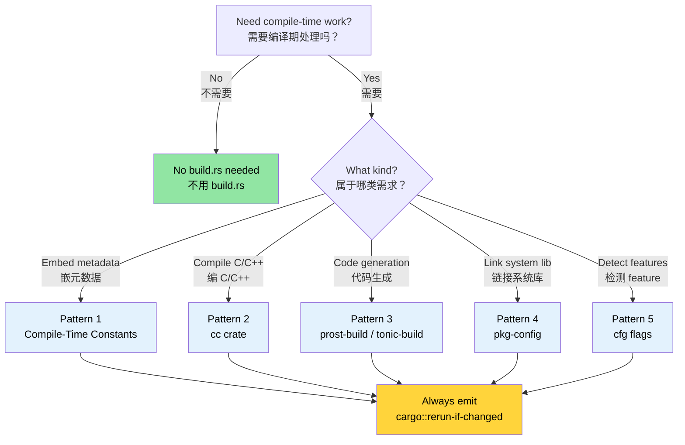

# Build Scripts — `build.rs` in Depth 🟢<br><span class="zh-inline">构建脚本：深入理解 `build.rs` 🟢</span>

> **What you'll learn:**<br><span class="zh-inline">**本章将学到什么：**</span>
> - How `build.rs` fits into the Cargo build pipeline and when it runs<br><span class="zh-inline">`build.rs` 在 Cargo 构建流程中的位置，以及它到底什么时候运行</span>
> - Five production patterns: compile-time constants, C/C++ compilation, protobuf codegen, `pkg-config` linking, and feature detection<br><span class="zh-inline">五种生产级用法：编译期常量、C/C++ 编译、protobuf 代码生成、`pkg-config` 链接和 feature 检测</span>
> - Anti-patterns that slow builds or break cross-compilation<br><span class="zh-inline">哪些反模式会拖慢构建，或者把交叉编译搞坏</span>
> - How to balance traceability with reproducible builds<br><span class="zh-inline">如何在可追踪性与可复现构建之间取得平衡</span>
>
> **Cross-references:** [Cross-Compilation](ch02-cross-compilation-one-source-many-target.md) uses build scripts for target-aware builds · [`no_std` & Features](ch09-no-std-and-feature-verification.md) extends `cfg` flags set here · [CI/CD Pipeline](ch11-putting-it-all-together-a-production-cic.md) orchestrates build scripts in automation<br><span class="zh-inline">**交叉阅读：** [交叉编译](ch02-cross-compilation-one-source-many-target.md) 里会继续用 `build.rs` 做目标感知构建；[`no_std` 与 feature](ch09-no-std-and-feature-verification.md) 会用到这里设置的 `cfg` 标志；[CI/CD 流水线](ch11-putting-it-all-together-a-production-cic.md) 负责把这些构建脚本放进自动化流程。</span>

Every Cargo package can include a file named `build.rs` at the crate root. Cargo compiles and executes this file *before* compiling your crate. The build script communicates back to Cargo through `println!` instructions on stdout.<br><span class="zh-inline">每个 Cargo 包都可以在 crate 根目录放一个名为 `build.rs` 的文件。Cargo 会在编译 crate 本体之前，先把它编译并执行一遍。构建脚本和 Cargo 的通信方式也很朴素，就是往标准输出里打印特定格式的 `println!` 指令。</span>

### What build.rs Is and When It Runs<br><span class="zh-inline">`build.rs` 是什么，它何时运行</span>

```text
┌─────────────────────────────────────────────────────────┐
│                    Cargo Build Pipeline                  │
│                                                         │
│  1. Resolve dependencies                                │
│  2. Download crates                                     │
│  3. Compile build.rs  ← ordinary Rust, runs on HOST     │
│  4. Execute build.rs  ← stdout → Cargo instructions     │
│  5. Compile the crate (using instructions from step 4)  │
│  6. Link                                                │
└─────────────────────────────────────────────────────────┘
```

```text
┌─────────────────────────────────────────────────────────┐
│                    Cargo 构建流水线                      │
│                                                         │
│  1. 解析依赖                                            │
│  2. 下载 crate                                          │
│  3. 编译 build.rs   ← 普通 Rust 程序，运行在 HOST 上     │
│  4. 执行 build.rs   ← stdout 回传 Cargo 指令             │
│  5. 编译 crate 本体 ← 使用第 4 步给出的配置             │
│  6. 链接                                                │
└─────────────────────────────────────────────────────────┘
```

Key facts:<br><span class="zh-inline">关键事实有这几条：</span>

- `build.rs` runs on the **host** machine, not the target. During cross-compilation, the build script runs on your development machine even when the final binary targets a different architecture.<br><span class="zh-inline">`build.rs` 运行在 **host** 机器上，不是 target。哪怕最后产物是别的架构，构建脚本也还是在当前开发机上执行。</span>
- The build script's scope is limited to its own package. It cannot directly control how other crates compile, unless the package declares `links` and emits metadata for dependents.<br><span class="zh-inline">构建脚本的作用域只限于当前 package。它本身改不了其他 crate 的编译方式，除非 package 用了 `links`，再通过 metadata 往依赖方传数据。</span>
- It runs **every time** Cargo thinks something relevant changed, unless you use `cargo::rerun-if-changed` or `cargo::rerun-if-env-changed` to缩小重跑范围。<br><span class="zh-inline">如果不主动用 `cargo::rerun-if-changed` 或 `cargo::rerun-if-env-changed` 缩小范围，Cargo 很容易在很多构建里重复执行它。</span>
- It can emit *cfg flags*, *environment variables*, *linker arguments*, and *generated file paths* for the main crate to consume.<br><span class="zh-inline">它可以输出 `cfg` 标志、环境变量、链接参数，以及生成文件路径，让主 crate 在后续编译中使用。</span>

> **Note (Rust 1.71+)**: Since Rust 1.71, Cargo fingerprints the compiled `build.rs` binary. If the binary itself stays identical, Cargo may skip rerunning it even when timestamps changed. Even so, `cargo::rerun-if-changed=build.rs` still matters a lot, because without *any* rerun rule, Cargo treats changes to any file in the package as a reason to rerun the script.<br><span class="zh-inline">**补充说明（Rust 1.71+）**：从 Rust 1.71 起，Cargo 会给编译出的 `build.rs` 二进制做指纹检查。如果二进制内容没变，它可能会跳过重跑。但 `cargo::rerun-if-changed=build.rs` 依然非常重要，因为只要没有显式 rerun 规则，Cargo 就会把 package 里任何文件的变化都当成重跑理由。</span>

The minimal `Cargo.toml` entry:<br><span class="zh-inline">最小的 `Cargo.toml` 写法是这样：</span>

```toml
[package]
name = "my-crate"
version = "0.1.0"
edition = "2021"
build = "build.rs"       # default — Cargo looks for build.rs automatically
# build = "src/build.rs" # or put it elsewhere
```

### The Cargo Instruction Protocol<br><span class="zh-inline">Cargo 指令协议</span>

Your build script communicates with Cargo by printing instructions to stdout. Since Rust 1.77, the preferred prefix is `cargo::` instead of the older `cargo:` form.<br><span class="zh-inline">构建脚本和 Cargo 的通信方式，就是往 stdout 打指令。从 Rust 1.77 开始，推荐使用 `cargo::` 前缀，而不是老的 `cargo:`。</span>

| Instruction<br><span class="zh-inline">指令</span> | Purpose<br><span class="zh-inline">作用</span> |
|-------------|---------|
| `cargo::rerun-if-changed=PATH` | Only re-run build.rs when PATH changes<br><span class="zh-inline">只有当指定路径变化时才重跑 build.rs。</span> |
| `cargo::rerun-if-env-changed=VAR` | Only re-run when environment variable VAR changes<br><span class="zh-inline">只有环境变量变化时才重跑。</span> |
| `cargo::rustc-link-lib=NAME` | Link against native library NAME<br><span class="zh-inline">链接本地库。</span> |
| `cargo::rustc-link-search=PATH` | Add PATH to library search path<br><span class="zh-inline">把路径加入库搜索目录。</span> |
| `cargo::rustc-cfg=KEY` | Set a `#[cfg(KEY)]` flag<br><span class="zh-inline">设置 `#[cfg(KEY)]` 标志。</span> |
| `cargo::rustc-cfg=KEY="VALUE"` | Set a `#[cfg(KEY = "VALUE")]` flag<br><span class="zh-inline">设置带值的 `cfg` 标志。</span> |
| `cargo::rustc-env=KEY=VALUE` | Set an env var visible via `env!()`<br><span class="zh-inline">设置后续可被 `env!()` 读取的环境变量。</span> |
| `cargo::rustc-cdylib-link-arg=FLAG` | Pass linker arg to cdylib targets<br><span class="zh-inline">给 cdylib 目标传链接参数。</span> |
| `cargo::warning=MESSAGE` | Display a warning during compilation<br><span class="zh-inline">在编译时打印警告。</span> |
| `cargo::metadata=KEY=VALUE` | Store metadata for dependent crates<br><span class="zh-inline">给依赖当前包的 crate 传递元数据。</span> |

```rust
// build.rs — minimal example
fn main() {
    // Only re-run if build.rs itself changes
    println!("cargo::rerun-if-changed=build.rs");

    // Set a compile-time environment variable
    let timestamp = std::time::SystemTime::now()
        .duration_since(std::time::UNIX_EPOCH)
        .map(|d| d.as_secs().to_string())
        .unwrap_or_else(|_| "0".into());
    println!("cargo::rustc-env=BUILD_TIMESTAMP={timestamp}");
}
```

### Pattern 1: Compile-Time Constants<br><span class="zh-inline">模式 1：编译期常量</span>

The most common use case is embedding build metadata into the binary, such as git hash, build profile, target triple, or build timestamp.<br><span class="zh-inline">最常见的用法就是把构建元数据嵌进二进制里，例如 git hash、构建配置、target triple 或构建时间。</span>

```rust
// build.rs
use std::process::Command;

fn main() {
    println!("cargo::rerun-if-changed=.git/HEAD");
    println!("cargo::rerun-if-changed=.git/refs");

    // Git commit hash
    let output = Command::new("git")
        .args(["rev-parse", "--short", "HEAD"])
        .output()
        .expect("git not found");
    let git_hash = String::from_utf8_lossy(&output.stdout).trim().to_string();
    println!("cargo::rustc-env=GIT_HASH={git_hash}");

    // Build profile (debug or release)
    let profile = std::env::var("PROFILE").unwrap_or_else(|_| "unknown".into());
    println!("cargo::rustc-env=BUILD_PROFILE={profile}");

    // Target triple
    let target = std::env::var("TARGET").unwrap_or_else(|_| "unknown".into());
    println!("cargo::rustc-env=BUILD_TARGET={target}");
}
```

```rust
// src/main.rs — consuming the build-time values
fn print_version() {
    println!(
        "{} {} (git:{} target:{} profile:{})",
        env!("CARGO_PKG_NAME"),
        env!("CARGO_PKG_VERSION"),
        env!("GIT_HASH"),
        env!("BUILD_TARGET"),
        env!("BUILD_PROFILE"),
    );
}
```

> **Built-in Cargo variables** that do not require `build.rs`: `CARGO_PKG_NAME`、`CARGO_PKG_VERSION`、`CARGO_PKG_AUTHORS`、`CARGO_PKG_DESCRIPTION`、`CARGO_MANIFEST_DIR`。<br><span class="zh-inline">**Cargo 自带的环境变量** 其实已经有不少，像 `CARGO_PKG_NAME`、`CARGO_PKG_VERSION`、`CARGO_PKG_AUTHORS`、`CARGO_PKG_DESCRIPTION`、`CARGO_MANIFEST_DIR`，这些都不需要 `build.rs` 就能直接用。</span>

### Pattern 2: Compiling C/C++ Code with the `cc` Crate<br><span class="zh-inline">模式 2：用 `cc` crate 编译 C/C++</span>

When your Rust crate wraps a C library or needs a small native helper, the [`cc`](https://docs.rs/cc) crate is the standard choice inside `build.rs`.<br><span class="zh-inline">如果 Rust crate 需要包一层 C 库，或者本身就要带一点小型原生辅助代码，那 [`cc`](https://docs.rs/cc) 基本就是 `build.rs` 里的标准答案。</span>

```toml
# Cargo.toml
[build-dependencies]
cc = "1.0"
```

```rust
// build.rs
fn main() {
    println!("cargo::rerun-if-changed=csrc/");

    cc::Build::new()
        .file("csrc/ipmi_raw.c")
        .file("csrc/smbios_parser.c")
        .include("csrc/include")
        .flag("-Wall")
        .flag("-Wextra")
        .opt_level(2)
        .compile("diag_helpers");
}
```

```rust
// src/lib.rs — FFI bindings to the compiled C code
extern "C" {
    fn ipmi_raw_command(
        netfn: u8,
        cmd: u8,
        data: *const u8,
        data_len: usize,
        response: *mut u8,
        response_len: *mut usize,
    ) -> i32;
}

pub fn send_ipmi_command(netfn: u8, cmd: u8, data: &[u8]) -> Result<Vec<u8>, IpmiError> {
    let mut response = vec![0u8; 256];
    let mut response_len: usize = response.len();

    let rc = unsafe {
        ipmi_raw_command(
            netfn,
            cmd,
            data.as_ptr(),
            data.len(),
            response.as_mut_ptr(),
            &mut response_len,
        )
    };

    if rc != 0 {
        return Err(IpmiError::CommandFailed(rc));
    }
    response.truncate(response_len);
    Ok(response)
}
```

For C++ code, add `.cpp(true)` and the right language standard flag:<br><span class="zh-inline">如果要编 C++，就再加上 `.cpp(true)` 和对应的标准参数。</span>

```rust
fn main() {
    println!("cargo::rerun-if-changed=cppsrc/");

    cc::Build::new()
        .cpp(true)
        .file("cppsrc/vendor_parser.cpp")
        .flag("-std=c++17")
        .flag("-fno-exceptions")
        .compile("vendor_helpers");
}
```

### Pattern 3: Protocol Buffers and Code Generation<br><span class="zh-inline">模式 3：Protocol Buffers 与代码生成</span>

Build scripts are also perfect for compile-time code generation. A classic example is protobuf generation via [`prost-build`](https://docs.rs/prost-build):<br><span class="zh-inline">构建脚本特别适合做编译期代码生成。最典型的例子就是用 [`prost-build`](https://docs.rs/prost-build) 生成 protobuf 代码。</span>

```toml
[build-dependencies]
prost-build = "0.13"
```

```rust
fn main() {
    println!("cargo::rerun-if-changed=proto/");

    prost_build::compile_protos(
        &["proto/diagnostics.proto", "proto/telemetry.proto"],
        &["proto/"],
    )
    .expect("Failed to compile protobuf definitions");
}
```

```rust
pub mod diagnostics {
    include!(concat!(env!("OUT_DIR"), "/diagnostics.rs"));
}

pub mod telemetry {
    include!(concat!(env!("OUT_DIR"), "/telemetry.rs"));
}
```

> **`OUT_DIR`** is the Cargo-provided directory meant for generated files. Never write generated Rust source back into `src/` during the build.<br><span class="zh-inline">**`OUT_DIR`** 是 Cargo 专门给生成文件准备的目录。构建过程中生成的 Rust 代码别往 `src/` 里硬写，老老实实放进 `OUT_DIR`。</span>

### Pattern 4: Linking System Libraries with `pkg-config`<br><span class="zh-inline">模式 4：用 `pkg-config` 链接系统库</span>

For system libraries that ship `.pc` files, the [`pkg-config`](https://docs.rs/pkg-config) crate can probe the system and emit the right link flags.<br><span class="zh-inline">如果系统库自带 `.pc` 文件，那 [`pkg-config`](https://docs.rs/pkg-config) 就能帮忙探测环境，并自动吐出合适的链接参数。</span>

```toml
[build-dependencies]
pkg-config = "0.3"
```

```rust
fn main() {
    pkg_config::Config::new()
        .atleast_version("3.6.0")
        .probe("libpci")
        .expect("libpci >= 3.6.0 not found — install pciutils-dev");

    if pkg_config::probe_library("libsystemd").is_ok() {
        println!("cargo::rustc-cfg=has_systemd");
    }
}
```

```rust
#[cfg(has_systemd)]
mod systemd_notify {
    extern "C" {
        fn sd_notify(unset_environment: i32, state: *const std::ffi::c_char) -> i32;
    }

    pub fn notify_ready() {
        let state = std::ffi::CString::new("READY=1").unwrap();
        unsafe { sd_notify(0, state.as_ptr()) };
    }
}

#[cfg(not(has_systemd))]
mod systemd_notify {
    pub fn notify_ready() {}
}
```

### Pattern 5: Feature Detection and Conditional Compilation<br><span class="zh-inline">模式 5：特性检测与条件编译</span>

Build scripts can inspect the compilation environment and emit `cfg` flags used by the main crate for conditional code paths.<br><span class="zh-inline">构建脚本还可以探测当前编译环境，再往主 crate 里塞 `cfg` 标志，让代码走不同分支。</span>

```rust
fn main() {
    println!("cargo::rerun-if-changed=build.rs");

    let target = std::env::var("TARGET").unwrap();
    let target_os = std::env::var("CARGO_CFG_TARGET_OS").unwrap();

    if target.starts_with("x86_64") {
        println!("cargo::rustc-cfg=has_x86_64");
    }

    if target.starts_with("aarch64") {
        println!("cargo::rustc-cfg=has_aarch64");
    }

    if target_os == "linux" && std::path::Path::new("/dev/ipmi0").exists() {
        println!("cargo::rustc-cfg=has_ipmi_device");
    }
}
```

> ⚠️ **Anti-pattern demonstration** — the following approach looks tempting but should not be used in production.<br><span class="zh-inline">⚠️ **反面示范**：下面这种写法看着诱人，实际上很坑，生产环境别这么干。</span>

```rust
fn main() {
    if std::process::Command::new("accel-query")
        .arg("--query-gpu=name")
        .arg("--format=csv,noheader")
        .output()
        .is_ok()
    {
        println!("cargo::rustc-cfg=has_accel_device");
    }
}
```

```rust
pub fn query_gpu_info() -> GpuResult {
    #[cfg(has_accel_device)]
    {
        run_accel_query()
    }

    #[cfg(not(has_accel_device))]
    {
        GpuResult::NotAvailable("accel-query not found at build time".into())
    }
}
```

> ⚠️ **Why this is wrong**: runtime hardware should usually be detected at runtime, not baked in at build time. Otherwise the binary becomes tied to the build machine's hardware layout.<br><span class="zh-inline">⚠️ **这为什么是错的**：硬件是否存在，通常应该在运行时检测，而不是在构建时写死。否则产物会莫名其妙地和构建机的硬件环境绑定在一起。</span>

### Anti-Patterns and Pitfalls<br><span class="zh-inline">反模式与常见坑</span>

| Anti-Pattern<br><span class="zh-inline">反模式</span> | Why It's Bad<br><span class="zh-inline">为什么糟糕</span> | Fix<br><span class="zh-inline">修正方式</span> |
|-------------|-------------|-----|
| No `rerun-if-changed`<br><span class="zh-inline">不写 `rerun-if-changed`</span> | `build.rs` runs on every build<br><span class="zh-inline">每次构建都重跑，拖慢开发</span> | Always emit at least `cargo::rerun-if-changed=build.rs`<br><span class="zh-inline">最少也要写上 `build.rs` 自己。</span> |
| Network calls in build.rs<br><span class="zh-inline">在 build.rs 里打网络</span> | Breaks offline and reproducible builds<br><span class="zh-inline">离线构建和可复现构建都会出问题</span> | Vendor files or split into a fetch step<br><span class="zh-inline">把文件预置好，或者把下载挪到单独步骤。</span> |
| Writing to `src/`<br><span class="zh-inline">往 `src/` 写生成代码</span> | Cargo does not expect sources to mutate during build<br><span class="zh-inline">Cargo 不期待源文件在构建中被改动</span> | Write to `OUT_DIR`<br><span class="zh-inline">改写到 `OUT_DIR`。</span> |
| Heavy computation<br><span class="zh-inline">在 build.rs 里做重计算</span> | Slows every `cargo build`<br><span class="zh-inline">所有构建都跟着变慢</span> | Cache in `OUT_DIR` and gate reruns<br><span class="zh-inline">把结果缓存起来，再配合 rerun 规则。</span> |
| Ignoring cross-compilation<br><span class="zh-inline">无视交叉编译环境</span> | Raw `gcc` commands often break on non-native targets<br><span class="zh-inline">手写 `gcc` 命令很容易在跨平台时炸</span> | Prefer `cc` crate<br><span class="zh-inline">优先用 `cc` crate。</span> |
| Panicking without context<br><span class="zh-inline">直接 `unwrap()` 爆掉</span> | Error message is opaque<br><span class="zh-inline">报错又臭又短，看不明白</span> | Use `.expect("...")` or `cargo::warning=`<br><span class="zh-inline">给出明确上下文。</span> |

### Application: Embedding Build Metadata<br><span class="zh-inline">应用场景：嵌入构建元数据</span>

The project currently uses `env!("CARGO_PKG_VERSION")` for version reporting. A `build.rs` would let it report richer metadata such as git hash, build epoch, and target triple.<br><span class="zh-inline">当前工程已经用 `env!("CARGO_PKG_VERSION")` 输出版本号了。如果再补一个 `build.rs`，就能把 git hash、构建时间戳、target triple 这些信息一起嵌进去。</span>

```rust
fn main() {
    println!("cargo::rerun-if-changed=.git/HEAD");
    println!("cargo::rerun-if-changed=.git/refs");
    println!("cargo::rerun-if-changed=build.rs");

    if let Ok(output) = std::process::Command::new("git")
        .args(["rev-parse", "--short=10", "HEAD"])
        .output()
    {
        let hash = String::from_utf8_lossy(&output.stdout).trim().to_string();
        println!("cargo::rustc-env=APP_GIT_HASH={hash}");
    } else {
        println!("cargo::rustc-env=APP_GIT_HASH=unknown");
    }

    let timestamp = std::time::SystemTime::now()
        .duration_since(std::time::UNIX_EPOCH)
        .map(|d| d.as_secs().to_string())
        .unwrap_or_else(|_| "0".into());
    println!("cargo::rustc-env=APP_BUILD_EPOCH={timestamp}");

    let target = std::env::var("TARGET").unwrap_or_else(|_| "unknown".into());
    println!("cargo::rustc-env=APP_TARGET={target}");
}
```

```rust
pub struct BuildInfo {
    pub version: &'static str,
    pub git_hash: &'static str,
    pub build_epoch: &'static str,
    pub target: &'static str,
}

pub const BUILD_INFO: BuildInfo = BuildInfo {
    version: env!("CARGO_PKG_VERSION"),
    git_hash: env!("APP_GIT_HASH"),
    build_epoch: env!("APP_BUILD_EPOCH"),
    target: env!("APP_TARGET"),
};
```

> **Key insight from the project**: having zero `build.rs` files across a large codebase is often a good sign. If the project is pure Rust, does not wrap C code, does not generate code, and does not need system library probing, then not having build scripts means the architecture stayed clean.<br><span class="zh-inline">**结合当前工程的一点观察**：一个大代码库里完全没有 `build.rs`，很多时候反而是好事。如果项目是纯 Rust、没有 C 依赖、没有代码生成、也不需要探测系统库，那没有构建脚本就说明架构相当干净。</span>

### Try It Yourself<br><span class="zh-inline">动手试一试</span>

1. **Embed git metadata**: Create a `build.rs` that emits `APP_GIT_HASH` and `APP_BUILD_EPOCH`, consume them with `env!()` in `main.rs`, and verify the hash changes after a commit.<br><span class="zh-inline">1. **嵌入 git 元数据**：写一个 `build.rs` 输出 `APP_GIT_HASH` 和 `APP_BUILD_EPOCH`，在 `main.rs` 里用 `env!()` 读取，并验证提交后 hash 会变化。</span>

2. **Probe a system library**: Use `pkg-config` to probe `libz`, emit `cargo::rustc-cfg=has_zlib` when found, and let `main.rs` print whether zlib is available.<br><span class="zh-inline">2. **探测系统库**：用 `pkg-config` 探测 `libz`，找到时输出 `has_zlib`，再让 `main.rs` 在构建后打印 zlib 是否可用。</span>

3. **Trigger a build failure intentionally**: Remove `rerun-if-changed` and observe how often `build.rs` reruns during `cargo build` and `cargo test`, then add it back and compare.<br><span class="zh-inline">3. **故意制造一次不合理重跑**：先删掉 `rerun-if-changed`，看看 `cargo build` 和 `cargo test` 时 `build.rs` 会重跑多少次，再把它加回来做对比。</span>

### Reproducible Builds<br><span class="zh-inline">可复现构建</span>

Chapter 1 encourages embedding timestamps and git hashes into binaries for traceability. But that directly conflicts with reproducible builds, where the same source should produce the same binary.<br><span class="zh-inline">这一章前面提倡把时间戳和 git hash 嵌进二进制，方便追踪来源。但这件事和“可复现构建”天然是有冲突的，因为后者要求同一份源码产出完全一致的二进制。</span>

**The tension:**<br><span class="zh-inline">**两者的拉扯关系：**</span>

| Goal<br><span class="zh-inline">目标</span> | Achievement<br><span class="zh-inline">得到什么</span> | Cost<br><span class="zh-inline">代价</span> |
|------|-------------|------|
| Traceability<br><span class="zh-inline">可追踪性</span> | `APP_BUILD_EPOCH` in binary<br><span class="zh-inline">二进制里带构建信息</span> | Every build is unique<br><span class="zh-inline">每次构建都不一样</span> |
| Reproducibility<br><span class="zh-inline">可复现性</span> | Same source → same output<br><span class="zh-inline">同源码得同产物</span> | No live build timestamp<br><span class="zh-inline">实时构建信息会受限制</span> |

**Practical resolution:**<br><span class="zh-inline">**更务实的处理方式：**</span>

```bash
# 1. Always use --locked in CI
cargo build --release --locked

# 2. For reproducible builds, set SOURCE_DATE_EPOCH
SOURCE_DATE_EPOCH=$(git log -1 --format=%ct) cargo build --release --locked
```

```rust
let timestamp = std::env::var("SOURCE_DATE_EPOCH")
    .unwrap_or_else(|_| {
        std::time::SystemTime::now()
            .duration_since(std::time::UNIX_EPOCH)
            .map(|d| d.as_secs().to_string())
            .unwrap_or_else(|_| "0".into())
    });
println!("cargo::rustc-env=APP_BUILD_EPOCH={timestamp}");
```

> **Best practice**: respect `SOURCE_DATE_EPOCH` in `build.rs`. That way, release builds can stay reproducible while local development builds still keep convenient live timestamps.<br><span class="zh-inline">**更好的实践**：在 `build.rs` 里优先读取 `SOURCE_DATE_EPOCH`。这样发布构建还能维持可复现，本地开发构建也仍然能保留实时时间戳。</span>

### Build Pipeline Decision Diagram<br><span class="zh-inline">构建脚本决策图</span>



### 🏋️ Exercises<br><span class="zh-inline">🏋️ 练习</span>

#### 🟢 Exercise 1: Version Stamp<br><span class="zh-inline">🟢 练习 1：版本戳</span>

Create a minimal crate with a `build.rs` that embeds the current git hash and build profile into environment variables. Print them from `main()`. Verify the output changes between debug and release builds.<br><span class="zh-inline">创建一个最小 crate，用 `build.rs` 把当前 git hash 和 build profile 写进环境变量，再在 `main()` 里打印出来，并验证 debug 与 release 构建结果不同。</span>

<details>
<summary>Solution <span class="zh-inline">参考答案</span></summary>

```rust
// build.rs
fn main() {
    println!("cargo::rerun-if-changed=.git/HEAD");
    println!("cargo::rerun-if-changed=build.rs");

    let hash = std::process::Command::new("git")
        .args(["rev-parse", "--short", "HEAD"])
        .output()
        .map(|o| String::from_utf8_lossy(&o.stdout).trim().to_string())
        .unwrap_or_else(|_| "unknown".into());
    println!("cargo::rustc-env=GIT_HASH={hash}");
    println!("cargo::rustc-env=BUILD_PROFILE={}", std::env::var("PROFILE").unwrap_or_default());
}
```

```rust,ignore
fn main() {
    println!("{} v{} (git:{} profile:{})",
        env!("CARGO_PKG_NAME"),
        env!("CARGO_PKG_VERSION"),
        env!("GIT_HASH"),
        env!("BUILD_PROFILE"),
    );
}
```

```bash
cargo run
cargo run --release
```
</details>

#### 🟡 Exercise 2: Conditional System Library<br><span class="zh-inline">🟡 练习 2：条件系统库探测</span>

Write a `build.rs` that probes for both `libz` and `libpci` using `pkg-config`. Emit a `cfg` flag for each one found. In `main.rs`, print which libraries were detected at build time.<br><span class="zh-inline">写一个 `build.rs`，用 `pkg-config` 探测 `libz` 和 `libpci`。哪个找到就发哪个 `cfg` 标志，然后在 `main.rs` 里打印构建时探测到了哪些库。</span>

<details>
<summary>Solution <span class="zh-inline">参考答案</span></summary>

```toml
[build-dependencies]
pkg-config = "0.3"
```

```rust,ignore
fn main() {
    println!("cargo::rerun-if-changed=build.rs");
    if pkg_config::probe_library("zlib").is_ok() {
        println!("cargo::rustc-cfg=has_zlib");
    }
    if pkg_config::probe_library("libpci").is_ok() {
        println!("cargo::rustc-cfg=has_libpci");
    }
}
```

```rust
fn main() {
    #[cfg(has_zlib)]
    println!("✅ zlib detected");
    #[cfg(not(has_zlib))]
    println!("❌ zlib not found");

    #[cfg(has_libpci)]
    println!("✅ libpci detected");
    #[cfg(not(has_libpci))]
    println!("❌ libpci not found");
}
```
</details>

### Key Takeaways<br><span class="zh-inline">本章要点</span>

- `build.rs` runs on the **host** at compile time — always emit `cargo::rerun-if-changed` to avoid unnecessary rebuilds<br><span class="zh-inline">`build.rs` 运行在 **host** 上，想避免莫名其妙地重跑，就一定要写 `cargo::rerun-if-changed`。</span>
- Use the `cc` crate, not raw `gcc` commands, for C/C++ compilation<br><span class="zh-inline">编译 C/C++ 时优先用 `cc` crate，别自己手搓 `gcc` 命令。</span>
- Write generated files to `OUT_DIR`, never to `src/`<br><span class="zh-inline">生成文件放进 `OUT_DIR`，别污染 `src/`。</span>
- Prefer runtime detection over build-time detection for optional hardware<br><span class="zh-inline">可选硬件能力更适合运行时探测，而不是构建时写死。</span>
- Use `SOURCE_DATE_EPOCH` when you need reproducible builds with embedded timestamps<br><span class="zh-inline">既想嵌时间戳，又想保留可复现构建，就去用 `SOURCE_DATE_EPOCH`。</span>

---
