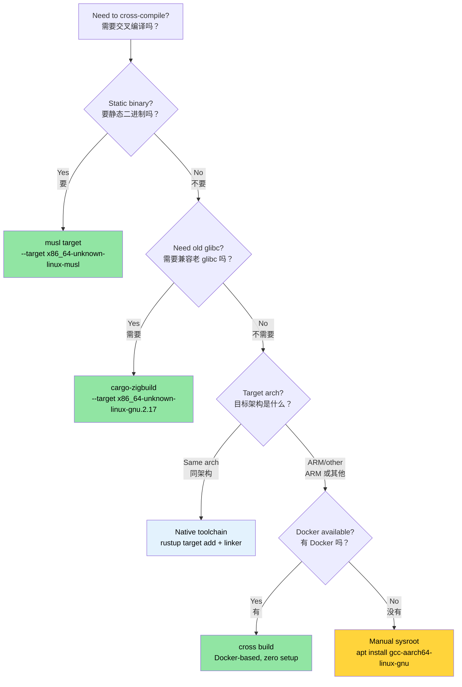

# Cross-Compilation — One Source, Many Targets 🟡<br><span class="zh-inline">交叉编译：一套源码，多种目标 🟡</span>

> **What you'll learn:**<br><span class="zh-inline">**本章将学到什么：**</span>
> - How Rust target triples work and how to add them with `rustup`<br><span class="zh-inline">Rust target triple 是怎么工作的，以及如何用 `rustup` 安装目标</span>
> - Building static musl binaries for container/cloud deployment<br><span class="zh-inline">如何为容器和云部署构建静态 musl 二进制</span>
> - Cross-compiling to ARM (aarch64) with native toolchains, `cross`, and `cargo-zigbuild`<br><span class="zh-inline">如何用原生工具链、`cross` 和 `cargo-zigbuild` 交叉编译到 ARM（aarch64）</span>
> - Setting up GitHub Actions matrix builds for multi-architecture CI<br><span class="zh-inline">如何给 GitHub Actions 配置多架构矩阵构建</span>
>
> **Cross-references:** [Build Scripts](ch01-build-scripts-buildrs-in-depth.md) — build.rs runs on HOST during cross-compilation · [Release Profiles](ch07-release-profiles-and-binary-size.md) — LTO and strip settings for cross-compiled release binaries · [Windows](ch10-windows-and-conditional-compilation.md) — Windows cross-compilation and `no_std` targets<br><span class="zh-inline">**交叉阅读：** [构建脚本](ch01-build-scripts-buildrs-in-depth.md) 说明了 `build.rs` 在交叉编译时运行在 HOST 上；[发布配置](ch07-release-profiles-and-binary-size.md) 继续讲 LTO 和 strip 等发布参数；[Windows](ch10-windows-and-conditional-compilation.md) 负责 Windows 交叉编译与 `no_std` 目标的另一半话题。</span>

Cross-compilation means building an executable on one machine (the **host**) that runs on a different machine (the **target**). The host might be your x86_64 laptop; the target might be an ARM server, a musl-based container, or even a Windows machine. Rust makes this remarkably feasible because `rustc` is already a cross-compiler — it just needs the right target libraries and a compatible linker.<br><span class="zh-inline">交叉编译的意思很简单：在一台机器上构建，在另一台机器上运行。前者叫 **host**，后者叫 **target**。host 可能是 x86_64 笔记本，target 可能是 ARM 服务器、基于 musl 的容器，甚至是 Windows 主机。Rust 在这件事上天生就占便宜，因为 `rustc` 本身就是交叉编译器，只是还需要正确的目标库和匹配的链接器。</span>

### The Target Triple Anatomy<br><span class="zh-inline">Target Triple 的结构</span>

Every Rust compilation target is identified by a **target triple** which often has four parts despite the name:<br><span class="zh-inline">每一个 Rust 编译目标都由一个 **target triple** 标识。名字虽然叫 triple，实际上经常有四段。</span>

```text
<arch>-<vendor>-<os>-<env>

Examples:
  x86_64  - unknown - linux  - gnu      ← standard Linux (glibc)
  x86_64  - unknown - linux  - musl     ← static Linux (musl libc)
  aarch64 - unknown - linux  - gnu      ← ARM 64-bit Linux
  x86_64  - pc      - windows- msvc     ← Windows with MSVC
  aarch64 - apple   - darwin             ← macOS on Apple Silicon
  x86_64  - unknown - none              ← bare metal (no OS)
```

```text
<arch>-<vendor>-<os>-<env>

示例：
  x86_64  - unknown - linux  - gnu      ← 标准 Linux（glibc）
  x86_64  - unknown - linux  - musl     ← 静态 Linux（musl libc）
  aarch64 - unknown - linux  - gnu      ← ARM 64 位 Linux
  x86_64  - pc      - windows- msvc     ← 使用 MSVC 的 Windows
  aarch64 - apple   - darwin             ← Apple Silicon 上的 macOS
  x86_64  - unknown - none              ← 裸机，无操作系统
```

List all available targets:<br><span class="zh-inline">查看可用目标：</span>

```bash
# Show all targets rustc can compile to (~250 targets)
rustc --print target-list | wc -l

# Show installed targets on your system
rustup target list --installed

# Show current default target
rustc -vV | grep host
```

### Installing Toolchains with rustup<br><span class="zh-inline">用 `rustup` 安装目标工具链</span>

```bash
# Add target libraries (Rust std for that target)
rustup target add x86_64-unknown-linux-musl
rustup target add aarch64-unknown-linux-gnu

# Now you can cross-compile:
cargo build --target x86_64-unknown-linux-musl
cargo build --target aarch64-unknown-linux-gnu  # needs a linker — see below
```

**What `rustup target add` gives you**: the pre-compiled `std`, `core`, and `alloc` libraries for that target. It does *not* give you a C linker or C library. For targets that need a C toolchain, especially most `gnu` targets, you still need to install that part yourself.<br><span class="zh-inline">**`rustup target add` 到底装了什么**：它只会给出目标平台预编译好的 `std`、`core`、`alloc`。它不会顺手给出 C 链接器，也不会给出目标平台的 C 库。所以只要目标依赖 C 工具链，尤其是大部分 `gnu` 目标，就还得额外安装对应的系统工具。</span>

```bash
# Ubuntu/Debian — install the cross-linker for aarch64
sudo apt install gcc-aarch64-linux-gnu

# Ubuntu/Debian — install musl toolchain for static builds
sudo apt install musl-tools

# Fedora
sudo dnf install gcc-aarch64-linux-gnu
```

### `.cargo/config.toml` — Per-Target Configuration<br><span class="zh-inline">`.cargo/config.toml`：按目标配置</span>

Instead of passing `--target` on every command, configure defaults in `.cargo/config.toml` at your project root or home directory:<br><span class="zh-inline">如果不想每次命令都手敲 `--target`，可以把目标配置放进项目根目录或者用户目录下的 `.cargo/config.toml`。</span>

```toml
# .cargo/config.toml

# Default target for this project (optional — omit to keep native default)
# [build]
# target = "x86_64-unknown-linux-musl"

# Linker for aarch64 cross-compilation
[target.aarch64-unknown-linux-gnu]
linker = "aarch64-linux-gnu-gcc"
rustflags = ["-C", "target-feature=+crc"]

# Linker for musl static builds (usually just the system gcc works)
[target.x86_64-unknown-linux-musl]
linker = "musl-gcc"
rustflags = ["-C", "target-feature=+crc,+aes"]

# ARM 32-bit (Raspberry Pi, embedded)
[target.armv7-unknown-linux-gnueabihf]
linker = "arm-linux-gnueabihf-gcc"

# Environment variables for all targets
[env]
# Example: set a custom sysroot
# SYSROOT = "/opt/cross/sysroot"
```

**Config file search order** (first match wins):<br><span class="zh-inline">**配置文件查找顺序**，先找到谁就用谁：</span>

1. `<project>/.cargo/config.toml`<br><span class="zh-inline">1. 当前项目下的 `.cargo/config.toml`。</span>
2. `<project>/../.cargo/config.toml` (parent directories, walking up)<br><span class="zh-inline">2. 沿父目录逐级向上查找的 `.cargo/config.toml`。</span>
3. `$CARGO_HOME/config.toml` (usually `~/.cargo/config.toml`)<br><span class="zh-inline">3. `$CARGO_HOME/config.toml`，通常就是 `~/.cargo/config.toml`。</span>

### Static Binaries with musl<br><span class="zh-inline">用 musl 构建静态二进制</span>

For deploying to minimal containers such as Alpine or scratch, or to systems where you can't control the glibc version, musl is often the cleanest answer:<br><span class="zh-inline">如果目标环境是 Alpine、scratch 这类极简容器，或者压根控制不了线上 glibc 版本，那 musl 静态构建通常是最省心的方案。</span>

```bash
# Install musl target
rustup target add x86_64-unknown-linux-musl
sudo apt install musl-tools  # provides musl-gcc

# Build a fully static binary
cargo build --release --target x86_64-unknown-linux-musl

# Verify it's static
file target/x86_64-unknown-linux-musl/release/diag_tool
# → ELF 64-bit LSB executable, x86-64, statically linked

ldd target/x86_64-unknown-linux-musl/release/diag_tool
# → not a dynamic executable
```

**Static vs dynamic trade-offs:**<br><span class="zh-inline">**静态链接和动态链接的取舍：**</span>

| Aspect<br><span class="zh-inline">方面</span> | glibc (dynamic)<br><span class="zh-inline">glibc 动态链接</span> | musl (static)<br><span class="zh-inline">musl 静态链接</span> |
|--------|-----------------|---------------|
| Binary size<br><span class="zh-inline">体积</span> | Smaller (shared libs)<br><span class="zh-inline">更小，依赖共享库</span> | Larger (~5-15 MB increase)<br><span class="zh-inline">更大，通常多 5 到 15 MB</span> |
| Portability<br><span class="zh-inline">可移植性</span> | Needs matching glibc version<br><span class="zh-inline">依赖目标机 glibc 版本匹配</span> | Runs anywhere on Linux<br><span class="zh-inline">基本能在 Linux 上通跑</span> |
| DNS resolution<br><span class="zh-inline">DNS 解析</span> | Full `nsswitch` support<br><span class="zh-inline">支持更完整</span> | Basic resolver (no mDNS)<br><span class="zh-inline">解析器较基础</span> |
| Deployment<br><span class="zh-inline">部署</span> | Needs sysroot or container<br><span class="zh-inline">通常要容器或系统依赖配合</span> | Single binary, no deps<br><span class="zh-inline">单文件部署，几乎没额外依赖</span> |
| Performance<br><span class="zh-inline">性能</span> | Slightly faster malloc<br><span class="zh-inline">内存分配通常略快</span> | Slightly slower malloc<br><span class="zh-inline">分配器通常略慢</span> |
| `dlopen()` support<br><span class="zh-inline">`dlopen()`</span> | Yes | No |

> **For the project**: A static musl build is ideal for deployment to diverse server hardware where you can't guarantee the host OS version. The single-binary deployment model eliminates "works on my machine" issues.<br><span class="zh-inline">**对这个工程来说**，如果二进制要部署到版本混杂的服务器环境，musl 静态构建会非常合适。单文件交付的方式，也能少掉一堆“本机能跑，线上炸了”的破事。</span>

### Cross-Compiling to ARM (aarch64)<br><span class="zh-inline">交叉编译到 ARM（aarch64）</span>

ARM servers such as AWS Graviton、Ampere Altra、Grace are becoming more common. Cross-compiling for aarch64 from an x86_64 host is a very normal requirement now:<br><span class="zh-inline">AWS Graviton、Ampere Altra、Grace 这类 ARM 服务器越来越常见了。所以从 x86_64 主机构建 aarch64 二进制，现在已经是很正常的需求。</span>

```bash
# Step 1: Install target + cross-linker
rustup target add aarch64-unknown-linux-gnu
sudo apt install gcc-aarch64-linux-gnu

# Step 2: Configure linker in .cargo/config.toml (see above)

# Step 3: Build
cargo build --release --target aarch64-unknown-linux-gnu

# Step 4: Verify the binary
file target/aarch64-unknown-linux-gnu/release/diag_tool
# → ELF 64-bit LSB executable, ARM aarch64
```

**Running tests for the target architecture** requires either an actual ARM machine or QEMU user-mode emulation:<br><span class="zh-inline">**如果还想跑目标架构测试**，那就得有真实 ARM 机器，或者上 QEMU 用户态模拟。</span>

```bash
# Install QEMU user-mode (runs ARM binaries on x86_64)
sudo apt install qemu-user qemu-user-static binfmt-support

# Now cargo test can run cross-compiled tests through QEMU
cargo test --target aarch64-unknown-linux-gnu
# (Slow — each test binary is emulated. Use for CI validation, not daily dev.)
```

Configure QEMU as the test runner in `.cargo/config.toml`:<br><span class="zh-inline">可以把 QEMU 直接配成目标测试运行器：</span>

```toml
[target.aarch64-unknown-linux-gnu]
linker = "aarch64-linux-gnu-gcc"
runner = "qemu-aarch64-static -L /usr/aarch64-linux-gnu"
```

### The `cross` Tool — Docker-Based Cross-Compilation<br><span class="zh-inline">`cross`：基于 Docker 的交叉编译</span>

The [`cross`](https://github.com/cross-rs/cross) tool provides a nearly zero-setup cross-compilation experience by using pre-configured Docker images:<br><span class="zh-inline">[`cross`](https://github.com/cross-rs/cross) 通过预配置好的 Docker 镜像，把交叉编译这件事做成了接近零准备的体验。</span>

```bash
# Install cross (from crates.io — stable releases)
cargo install cross
# Or from git for latest features (less stable):
# cargo install cross --git https://github.com/cross-rs/cross

# Cross-compile — no toolchain setup needed!
cross build --release --target aarch64-unknown-linux-gnu
cross build --release --target x86_64-unknown-linux-musl
cross build --release --target armv7-unknown-linux-gnueabihf

# Cross-test — QEMU included in the Docker image
cross test --target aarch64-unknown-linux-gnu
```

**How it works**: `cross` replaces `cargo` and runs the build inside a Docker container that already contains the right sysroot, linker, and toolchain. Your source is mounted into the container, and the output still goes into the usual `target/` directory.<br><span class="zh-inline">**它的工作方式** 其实很朴素：用 `cross` 代替 `cargo`，把构建过程扔进一个已经准备好 sysroot、链接器和工具链的容器里。源码还是挂载进容器，输出也还是回到熟悉的 `target/` 目录。</span>

**Customizing the Docker image** with `Cross.toml`:<br><span class="zh-inline">**如果默认镜像不够用**，可以通过 `Cross.toml` 自定义。</span>

```toml
# Cross.toml
[target.aarch64-unknown-linux-gnu]
# Use a custom Docker image with extra system libraries
image = "my-registry/cross-aarch64:latest"

# Pre-install system packages
pre-build = [
    "dpkg --add-architecture arm64",
    "apt-get update && apt-get install -y libpci-dev:arm64"
]

[target.aarch64-unknown-linux-gnu.env]
# Pass environment variables into the container
passthrough = ["CI", "GITHUB_TOKEN"]
```

`cross` requires Docker or Podman, but it saves you from manually dealing with cross-compilers, sysroots, and QEMU. For CI, it's usually the most straightforward choice.<br><span class="zh-inline">`cross` 的代价就是要有 Docker 或 Podman，但好处也很明显：不用手工折腾交叉编译器、sysroot 和 QEMU。对 CI 来说，它通常是最省脑子的方案。</span>

### Using Zig as a Cross-Compilation Linker<br><span class="zh-inline">把 Zig 当成交叉编译链接器</span>

[Zig](https://ziglang.org/) bundles a C compiler and cross-compilation sysroot for dozens of targets in a single small download. That makes it a very convenient cross-linker for Rust:<br><span class="zh-inline">[Zig](https://ziglang.org/) 把 C 编译器和多目标 sysroot 都打包进一个很小的下载里，所以拿它做 Rust 的交叉链接器会非常顺手。</span>

```bash
# Install Zig (single binary, no package manager needed)
# Download from https://ziglang.org/download/
# Or via package manager:
sudo snap install zig --classic --beta  # Ubuntu
brew install zig                          # macOS

# Install cargo-zigbuild
cargo install cargo-zigbuild
```

**Why Zig?** The biggest advantage is **glibc version targeting**. Zig lets you specify the exact glibc version to link against, which is gold when your binaries must run on older enterprise distributions:<br><span class="zh-inline">**为什么要用 Zig**：最大的亮点就是它能精确指定 glibc 版本。只要目标环境里存在老旧企业发行版，这一点就非常值钱。</span>

```bash
# Build for glibc 2.17 (CentOS 7 / RHEL 7 compatibility)
cargo zigbuild --release --target x86_64-unknown-linux-gnu.2.17

# Build for aarch64 with glibc 2.28 (Ubuntu 18.04+)
cargo zigbuild --release --target aarch64-unknown-linux-gnu.2.28

# Build for musl (fully static)
cargo zigbuild --release --target x86_64-unknown-linux-musl
```

The `.2.17` suffix is Zig-specific. It tells Zig to link against glibc 2.17 symbol versions so the result still runs on CentOS 7 and later, without needing Docker or hand-managed sysroots.<br><span class="zh-inline">这里的 `.2.17` 后缀是 Zig 扩展语法，意思是按 glibc 2.17 的符号版本去链接。这样产物就能在 CentOS 7 及之后的系统上运行，而且不用靠 Docker，也不用自己维护 sysroot。</span>

**Comparison: cross vs cargo-zigbuild vs manual:**<br><span class="zh-inline">**`cross`、`cargo-zigbuild` 和手工配置的对比：**</span>

| Feature<br><span class="zh-inline">维度</span> | Manual<br><span class="zh-inline">手工配置</span> | cross | cargo-zigbuild |
|---------|--------|-------|----------------|
| Setup effort<br><span class="zh-inline">准备成本</span> | High<br><span class="zh-inline">高</span> | Low (needs Docker)<br><span class="zh-inline">低，但需要 Docker</span> | Low (single binary)<br><span class="zh-inline">低，只要一个 Zig</span> |
| Docker required<br><span class="zh-inline">需要 Docker</span> | No | Yes | No |
| glibc version targeting<br><span class="zh-inline">glibc 版本可控</span> | No | No | Yes |
| Test execution<br><span class="zh-inline">测试执行</span> | Needs QEMU<br><span class="zh-inline">自己配 QEMU</span> | Included<br><span class="zh-inline">镜像里通常带好</span> | Needs QEMU<br><span class="zh-inline">自己配 QEMU</span> |
| macOS → Linux<br><span class="zh-inline">macOS 到 Linux</span> | Difficult<br><span class="zh-inline">较麻烦</span> | Easy<br><span class="zh-inline">简单</span> | Easy<br><span class="zh-inline">简单</span> |
| Linux → macOS<br><span class="zh-inline">Linux 到 macOS</span> | Very difficult<br><span class="zh-inline">很难</span> | Not supported<br><span class="zh-inline">不支持</span> | Limited<br><span class="zh-inline">支持有限</span> |
| Binary size overhead<br><span class="zh-inline">额外体积</span> | None | None | None |

### CI Pipeline: GitHub Actions Matrix<br><span class="zh-inline">CI 流水线：GitHub Actions 矩阵构建</span>

A production-grade CI workflow that builds for multiple targets often looks like this:<br><span class="zh-inline">面向生产环境的多目标 CI，通常长得就是下面这样。</span>

```yaml
# .github/workflows/cross-build.yml
name: Cross-Platform Build

on: [push, pull_request]

env:
  CARGO_TERM_COLOR: always

jobs:
  build:
    strategy:
      matrix:
        include:
          - target: x86_64-unknown-linux-gnu
            os: ubuntu-latest
            name: linux-x86_64
          - target: x86_64-unknown-linux-musl
            os: ubuntu-latest
            name: linux-x86_64-static
          - target: aarch64-unknown-linux-gnu
            os: ubuntu-latest
            name: linux-aarch64
            use_cross: true
          - target: x86_64-pc-windows-msvc
            os: windows-latest
            name: windows-x86_64

    runs-on: ${{ matrix.os }}
    name: Build (${{ matrix.name }})

    steps:
      - uses: actions/checkout@v4

      - uses: dtolnay/rust-toolchain@stable
        with:
          targets: ${{ matrix.target }}

      - name: Install musl tools
        if: matrix.target == 'x86_64-unknown-linux-musl'
        run: sudo apt-get install -y musl-tools

      - name: Install cross
        if: matrix.use_cross
        run: cargo install cross

      - name: Build (native)
        if: "!matrix.use_cross"
        run: cargo build --release --target ${{ matrix.target }}

      - name: Build (cross)
        if: matrix.use_cross
        run: cross build --release --target ${{ matrix.target }}

      - name: Run tests
        if: "!matrix.use_cross"
        run: cargo test --target ${{ matrix.target }}

      - name: Upload artifact
        uses: actions/upload-artifact@v4
        with:
          name: diag_tool-${{ matrix.name }}
          path: target/${{ matrix.target }}/release/diag_tool*
```

### Application: Multi-Architecture Server Builds<br><span class="zh-inline">应用场景：多架构服务器构建</span>

The binary currently has no cross-compilation setup. For a diagnostics tool meant to cover diverse server fleets, the following structure is a sensible addition:<br><span class="zh-inline">当前二进制还没有正式的交叉编译配置。如果它的部署目标是一堆架构和系统都不统一的服务器，那下面这套结构就很值得补上。</span>

```text
my_workspace/
├── .cargo/
│   └── config.toml          ← linker configs per target
├── Cross.toml                ← cross tool configuration
└── .github/workflows/
    └── cross-build.yml       ← CI matrix for 3 targets
```

**Recommended `.cargo/config.toml`:**<br><span class="zh-inline">**建议的 `.cargo/config.toml`：**</span>

```toml
# .cargo/config.toml for the project

# Release profile optimizations (already in Cargo.toml, shown for reference)
# [profile.release]
# lto = true
# codegen-units = 1
# panic = "abort"
# strip = true

# aarch64 for ARM servers (Graviton, Ampere, Grace)
[target.aarch64-unknown-linux-gnu]
linker = "aarch64-linux-gnu-gcc"

# musl for portable static binaries
[target.x86_64-unknown-linux-musl]
linker = "musl-gcc"
```

**Recommended build targets:**<br><span class="zh-inline">**建议重点支持的目标：**</span>

| Target | Use Case<br><span class="zh-inline">用途</span> | Deploy To<br><span class="zh-inline">部署位置</span> |
|--------|----------|-----------|
| `x86_64-unknown-linux-gnu` | Default native build<br><span class="zh-inline">默认原生构建</span> | Standard x86 servers<br><span class="zh-inline">普通 x86 服务器</span> |
| `x86_64-unknown-linux-musl` | Static binary, any distro<br><span class="zh-inline">静态单文件</span> | Containers, minimal hosts<br><span class="zh-inline">容器、极简主机</span> |
| `aarch64-unknown-linux-gnu` | ARM servers<br><span class="zh-inline">ARM 服务器构建</span> | Graviton, Ampere, Grace<br><span class="zh-inline">Graviton、Ampere、Grace</span> |

> **Key insight**: The `[profile.release]` in the workspace root already has `lto = true`, `codegen-units = 1`, `panic = "abort"`, and `strip = true`. That combination is already extremely suitable for cross-compiled deployment binaries. Add musl on top, and you get a compact single binary with almost no runtime dependency burden.<br><span class="zh-inline">**关键点**：workspace 根下的 `[profile.release]` 已经配好了 `lto = true`、`codegen-units = 1`、`panic = "abort"`、`strip = true`。这套配置本来就很适合交叉编译后的部署二进制。再叠一层 musl，基本就能得到一个紧凑、依赖极少的单文件产物。</span>

### Troubleshooting Cross-Compilation<br><span class="zh-inline">交叉编译排障</span>

| Symptom<br><span class="zh-inline">现象</span> | Cause<br><span class="zh-inline">原因</span> | Fix<br><span class="zh-inline">处理方式</span> |
|---------|-------|-----|
| `linker 'aarch64-linux-gnu-gcc' not found`<br><span class="zh-inline">找不到 `aarch64-linux-gnu-gcc`</span> | Missing cross-linker toolchain<br><span class="zh-inline">没装交叉链接器</span> | `sudo apt install gcc-aarch64-linux-gnu` |
| `cannot find -lssl` (musl target)<br><span class="zh-inline">musl 目标找不到 `-lssl`</span> | System OpenSSL is glibc-linked<br><span class="zh-inline">系统 OpenSSL 绑定的是 glibc</span> | Use `vendored` feature: `openssl = { version = "0.10", features = ["vendored"] }`<br><span class="zh-inline">改用 vendored OpenSSL。</span> |
| `build.rs` runs wrong binary<br><span class="zh-inline">`build.rs` 跑错平台逻辑</span> | build.rs runs on HOST, not target<br><span class="zh-inline">`build.rs` 运行在 HOST 上</span> | Check `CARGO_CFG_TARGET_OS` in build.rs, not `cfg!(target_os)`<br><span class="zh-inline">在 `build.rs` 里读 `CARGO_CFG_TARGET_OS`。</span> |
| Tests pass locally, fail in `cross`<br><span class="zh-inline">本地测试过了，`cross` 里挂了</span> | Docker image missing test fixtures<br><span class="zh-inline">容器里缺测试资源</span> | Mount test data via `Cross.toml`<br><span class="zh-inline">用 `Cross.toml` 把测试数据挂进去。</span> |
| `undefined reference to __cxa_thread_atexit_impl`<br><span class="zh-inline">出现 `__cxa_thread_atexit_impl` 未定义</span> | Old glibc on target<br><span class="zh-inline">目标机 glibc 太旧</span> | Use `cargo-zigbuild` with explicit glibc version<br><span class="zh-inline">用 `cargo-zigbuild` 锁定 glibc 版本。</span> |
| Binary segfaults on ARM<br><span class="zh-inline">ARM 上运行直接崩</span> | Compiled for wrong ARM variant<br><span class="zh-inline">ARM 目标选错了</span> | Verify target triple matches hardware<br><span class="zh-inline">确认 target triple 和硬件一致。</span> |
| `GLIBC_2.XX not found` at runtime<br><span class="zh-inline">运行时报 `GLIBC_2.XX not found`</span> | Build machine has newer glibc<br><span class="zh-inline">构建机 glibc 太新</span> | Use musl or `cargo-zigbuild` for glibc pinning<br><span class="zh-inline">用 musl，或者用 `cargo-zigbuild` 锁版本。</span> |

### Cross-Compilation Decision Tree<br><span class="zh-inline">交叉编译决策树</span>



### 🏋️ Exercises<br><span class="zh-inline">🏋️ 练习</span>

#### 🟢 Exercise 1: Static musl Binary<br><span class="zh-inline">🟢 练习 1：构建静态 musl 二进制</span>

Build any Rust binary for `x86_64-unknown-linux-musl`. Verify it's statically linked using `file` and `ldd`.<br><span class="zh-inline">为任意 Rust 二进制构建 `x86_64-unknown-linux-musl` 版本，并用 `file` 和 `ldd` 验证它真的是静态链接。</span>

<details>
<summary>Solution <span class="zh-inline">参考答案</span></summary>

```bash
rustup target add x86_64-unknown-linux-musl
cargo new hello-static && cd hello-static
cargo build --release --target x86_64-unknown-linux-musl

# Verify
file target/x86_64-unknown-linux-musl/release/hello-static
# Output: ... statically linked ...

ldd target/x86_64-unknown-linux-musl/release/hello-static
# Output: not a dynamic executable
```
</details>

#### 🟡 Exercise 2: GitHub Actions Cross-Build Matrix<br><span class="zh-inline">🟡 练习 2：GitHub Actions 交叉构建矩阵</span>

Write a GitHub Actions workflow that builds a Rust project for three targets: `x86_64-unknown-linux-gnu`, `x86_64-unknown-linux-musl`, and `aarch64-unknown-linux-gnu`. Use a matrix strategy.<br><span class="zh-inline">写一个 GitHub Actions 工作流，用矩阵方式为 `x86_64-unknown-linux-gnu`、`x86_64-unknown-linux-musl`、`aarch64-unknown-linux-gnu` 三个目标构建 Rust 项目。</span>

<details>
<summary>Solution <span class="zh-inline">参考答案</span></summary>

```yaml
name: Cross-build
on: [push]
jobs:
  build:
    runs-on: ubuntu-latest
    strategy:
      matrix:
        target:
          - x86_64-unknown-linux-gnu
          - x86_64-unknown-linux-musl
          - aarch64-unknown-linux-gnu
    steps:
      - uses: actions/checkout@v4
      - uses: dtolnay/rust-toolchain@stable
        with:
          targets: ${{ matrix.target }}
      - name: Install cross
        run: cargo install cross --locked
      - name: Build
        run: cross build --release --target ${{ matrix.target }}
      - uses: actions/upload-artifact@v4
        with:
          name: binary-${{ matrix.target }}
          path: target/${{ matrix.target }}/release/my-binary
```
</details>

### Key Takeaways<br><span class="zh-inline">本章要点</span>

- Rust's `rustc` is already a cross-compiler — you just need the right target and linker<br><span class="zh-inline">`rustc` 天生就是交叉编译器，关键只是目标库和链接器配对要对。</span>
- **musl** produces fully static binaries with zero runtime dependencies — ideal for containers<br><span class="zh-inline">**musl** 能产出几乎零运行时依赖的静态二进制，非常适合容器和复杂部署环境。</span>
- **`cargo-zigbuild`** solves the "which glibc version" problem for enterprise Linux targets<br><span class="zh-inline">**`cargo-zigbuild`** 专门解决企业 Linux 里最讨厌的 glibc 版本兼容问题。</span>
- **`cross`** is the easiest path for ARM and other exotic targets — Docker handles the sysroot<br><span class="zh-inline">**`cross`** 是 ARM 和其他异构目标最省事的路线，sysroot 这些脏活都让 Docker 干了。</span>
- Always test with `file` and `ldd` to verify the binary matches your deployment target<br><span class="zh-inline">最后一定要用 `file` 和 `ldd` 验证产物，别光看它编过了就以为万事大吉。</span>

---
