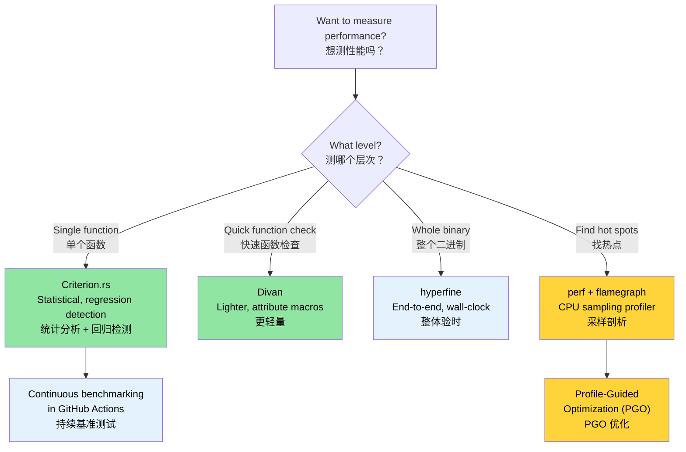

# Benchmarking — Measuring What Matters 🟡<br><span class="zh-inline">基准测试：衡量真正重要的东西 🟡</span>

> **What you'll learn:**<br><span class="zh-inline">**本章将学到什么：**</span>
> - Why naive timing with `Instant::now()` produces unreliable results<br><span class="zh-inline">为什么拿 `Instant::now()` 直接计时，结果往往靠不住</span>
> - Statistical benchmarking with Criterion.rs and the lighter Divan alternative<br><span class="zh-inline">如何用 Criterion.rs 做统计学意义上的基准测试，以及更轻量的 Divan 替代方案</span>
> - Profiling hot spots with `perf`, flamegraphs, and PGO<br><span class="zh-inline">如何用 `perf`、火焰图和 PGO 分析热点</span>
> - Setting up continuous benchmarking in CI to catch regressions automatically<br><span class="zh-inline">如何在 CI 里持续跑基准测试，自动抓性能回退</span>
>
> **Cross-references:** [Release Profiles](ch07-release-profiles-and-binary-size.md) — once you find the hot spot, optimize the binary · [CI/CD Pipeline](ch11-putting-it-all-together-a-production-cic.md) — benchmark job in the pipeline · [Code Coverage](ch04-code-coverage-seeing-what-tests-miss.md) — coverage tells you what's tested, benchmarks tell you what's fast<br><span class="zh-inline">**交叉阅读：** [发布配置](ch07-release-profiles-and-binary-size.md) 负责在找到热点之后继续压性能；[CI/CD 流水线](ch11-putting-it-all-together-a-production-cic.md) 会把 benchmark 任务放进流水线；[代码覆盖率](ch04-code-coverage-seeing-what-tests-miss.md) 讲的是“哪里测到了”，基准测试讲的是“哪里快、哪里慢”。</span>

"We should forget about small efficiencies, say about 97% of the time: premature optimization is the root of all evil. Yet we should not pass up our opportunities in that critical 3%." — Donald Knuth<br><span class="zh-inline">“大约 97% 的时候，都应该忘掉那些细枝末节的小效率问题；过早优化是万恶之源。但那关键的 3%，又绝不能放过。”—— Donald Knuth</span>

The hard part isn't *writing* benchmarks — it's writing benchmarks that produce **meaningful, reproducible, actionable** numbers. This chapter covers the tools and techniques that get you from "it seems fast" to "we have statistical evidence that PR #347 regressed parsing throughput by 4.2%."<br><span class="zh-inline">真正难的不是把 benchmark 写出来，而是写出 **有意义、可复现、能指导行动** 的 benchmark。本章要解决的，就是怎么从“感觉好像挺快”走到“已经有统计证据表明 PR #347 让解析吞吐下降了 4.2%”。</span>

### Why Not `std::time::Instant`?<br><span class="zh-inline">为什么不能只靠 `std::time::Instant`？</span>

The temptation:<br><span class="zh-inline">很多人一开始都很容易这么写：</span>

```rust
// ❌ Naive benchmarking — unreliable results
use std::time::Instant;

fn main() {
    let start = Instant::now();
    let result = parse_device_query_output(&sample_data);
    let elapsed = start.elapsed();
    println!("Parsing took {:?}", elapsed);
    // Problem 1: Compiler may optimize away `result` (dead code elimination)
    // Problem 2: Single sample — no statistical significance
    // Problem 3: CPU frequency scaling, thermal throttling, other processes
    // Problem 4: Cold cache vs warm cache not controlled
}
```

Problems with manual timing:<br><span class="zh-inline">手工计时的问题主要有这些：</span>

1. **Dead code elimination** — the compiler may skip the computation entirely if the result isn't used.<br><span class="zh-inline">1. **死代码消除**：如果结果没真正参与后续逻辑，编译器可能直接把计算优化没了。</span>
2. **No warm-up** — the first run includes cache misses, page faults, and lazy initialization noise.<br><span class="zh-inline">2. **没有预热**：第一次运行通常混着缓存未命中、页错误和延迟初始化噪音。</span>
3. **No statistical analysis** — a single measurement tells you nothing about variance, outliers, or confidence intervals.<br><span class="zh-inline">3. **没有统计分析**：单次测量几乎说明不了方差、异常值和置信区间。</span>
4. **No regression detection** — you can't compare against previous runs in a stable way.<br><span class="zh-inline">4. **无法稳定识别回退**：没法和历史结果做可靠对比。</span>

### Criterion.rs — Statistical Benchmarking<br><span class="zh-inline">Criterion.rs：统计学基准测试</span>

[Criterion.rs](https://bheisler.github.io/criterion.rs/book/) is the de facto standard for Rust micro-benchmarks. It uses statistical methods to produce reliable measurements and detects performance regressions automatically.<br><span class="zh-inline">[Criterion.rs](https://bheisler.github.io/criterion.rs/book/) 基本上就是 Rust 微基准测试的事实标准。它会通过统计方法生成更可靠的测量结果，还能自动识别性能回退。</span>

**Setup:**<br><span class="zh-inline">**基本配置：**</span>

```toml
# Cargo.toml
[dev-dependencies]
criterion = { version = "0.5", features = ["html_reports", "cargo_bench_support"] }

[[bench]]
name = "parsing_bench"
harness = false  # Use Criterion's harness, not the built-in test harness
```

**A complete benchmark:**<br><span class="zh-inline">**一个完整的 benchmark：**</span>

```rust
// benches/parsing_bench.rs
use criterion::{black_box, criterion_group, criterion_main, Criterion, BenchmarkId};

/// Data type for parsed GPU information
#[derive(Debug, Clone)]
struct GpuInfo {
    index: u32,
    name: String,
    temp_c: u32,
    power_w: f64,
}

/// The function under test — simulate parsing device-query CSV output
fn parse_gpu_csv(input: &str) -> Vec<GpuInfo> {
    input
        .lines()
        .filter(|line| !line.starts_with('#'))
        .filter_map(|line| {
            let fields: Vec<&str> = line.split(", ").collect();
            if fields.len() >= 4 {
                Some(GpuInfo {
                    index: fields[0].parse().ok()?,
                    name: fields[1].to_string(),
                    temp_c: fields[2].parse().ok()?,
                    power_w: fields[3].parse().ok()?,
                })
            } else {
                None
            }
        })
        .collect()
}

fn bench_parse_gpu_csv(c: &mut Criterion) {
    // Representative test data
    let small_input = "0, Acme Accel-V1-80GB, 32, 65.5\n\
                       1, Acme Accel-V1-80GB, 34, 67.2\n";

    let large_input = (0..64)
        .map(|i| format!("{i}, Acme Accel-X1-80GB, {}, {:.1}\n", 30 + i % 20, 60.0 + i as f64))
        .collect::<String>();

    c.bench_function("parse_2_gpus", |b| {
        b.iter(|| parse_gpu_csv(black_box(small_input)))
    });

    c.bench_function("parse_64_gpus", |b| {
        b.iter(|| parse_gpu_csv(black_box(&large_input)))
    });
}

criterion_group!(benches, bench_parse_gpu_csv);
criterion_main!(benches);
```

**Running and reading results:**<br><span class="zh-inline">**运行方式和结果解读：**</span>

```bash
# Run all benchmarks
cargo bench

# Run a specific benchmark by name
cargo bench -- parse_64

# Output:
# parse_2_gpus        time:   [1.2345 µs  1.2456 µs  1.2578 µs]
#                      ▲            ▲           ▲
#                      │       confidence interval
#                   lower 95%    median    upper 95%
#
# parse_64_gpus       time:   [38.123 µs  38.456 µs  38.812 µs]
#                     change: [-1.2345% -0.5678% +0.1234%] (p = 0.12 > 0.05)
#                     No change in performance detected.
```

**What `black_box()` does**: It's a compiler hint that prevents dead-code elimination and over-aggressive constant folding. The compiler cannot see through `black_box`, so it must actually compute the result.<br><span class="zh-inline">**`black_box()` 是干什么的**：它相当于给编译器一个“别瞎优化”的提示。这样编译器就没法把测量目标直接折叠掉，必须老老实实把计算做完。</span>

### Parameterized Benchmarks and Benchmark Groups<br><span class="zh-inline">参数化 benchmark 与分组测试</span>

Compare multiple implementations or input sizes:<br><span class="zh-inline">如果想比较不同实现，或者比较不同输入规模，就可以用参数化 benchmark。</span>

```rust
// benches/comparison_bench.rs
use criterion::{criterion_group, criterion_main, Criterion, BenchmarkId, Throughput};

fn bench_parsing_strategies(c: &mut Criterion) {
    let mut group = c.benchmark_group("csv_parsing");

    // Test across different input sizes
    for num_gpus in [1, 8, 32, 64, 128] {
        let input = generate_gpu_csv(num_gpus);

        // Set throughput for bytes-per-second reporting
        group.throughput(Throughput::Bytes(input.len() as u64));

        group.bench_with_input(
            BenchmarkId::new("split_based", num_gpus),
            &input,
            |b, input| b.iter(|| parse_split(input)),
        );

        group.bench_with_input(
            BenchmarkId::new("regex_based", num_gpus),
            &input,
            |b, input| b.iter(|| parse_regex(input)),
        );

        group.bench_with_input(
            BenchmarkId::new("nom_based", num_gpus),
            &input,
            |b, input| b.iter(|| parse_nom(input)),
        );
    }
    group.finish();
}

criterion_group!(benches, bench_parsing_strategies);
criterion_main!(benches);
```

**Output**: Criterion generates an HTML report at `target/criterion/report/index.html` with violin plots, comparison charts, and regression analysis.<br><span class="zh-inline">**输出结果**：Criterion 会在 `target/criterion/report/index.html` 生成 HTML 报告，里面有小提琴图、对比图和回归分析，浏览器里看非常直观。</span>

### Divan — A Lighter Alternative<br><span class="zh-inline">Divan：更轻量的替代方案</span>

[Divan](https://github.com/nvzqz/divan) is a newer benchmarking framework that uses attribute macros instead of Criterion's macro DSL:<br><span class="zh-inline">[Divan](https://github.com/nvzqz/divan) 是一个更新、更轻的 benchmark 框架，它主要靠 attribute macro，而不是 Criterion 那一套宏 DSL。</span>

```toml
# Cargo.toml
[dev-dependencies]
divan = "0.1"

[[bench]]
name = "parsing_bench"
harness = false
```

```rust
// benches/parsing_bench.rs
use divan::black_box;

const SMALL_INPUT: &str = "0, Acme Accel-V1-80GB, 32, 65.5\n\
                          1, Acme Accel-V1-80GB, 34, 67.2\n";

fn generate_gpu_csv(n: usize) -> String {
    (0..n)
        .map(|i| format!("{i}, Acme Accel-X1-80GB, {}, {:.1}\n", 30 + i % 20, 60.0 + i as f64))
        .collect()
}

fn main() {
    divan::main();
}

#[divan::bench]
fn parse_2_gpus() -> Vec<GpuInfo> {
    parse_gpu_csv(black_box(SMALL_INPUT))
}

#[divan::bench(args = [1, 8, 32, 64, 128])]
fn parse_n_gpus(n: usize) -> Vec<GpuInfo> {
    let input = generate_gpu_csv(n);
    parse_gpu_csv(black_box(&input))
}

// Divan output is a clean table:
// ╰─ parse_2_gpus   fastest  │ slowest  │ median   │ mean     │ samples │ iters
//                   1.234 µs │ 1.567 µs │ 1.345 µs │ 1.350 µs │ 100     │ 1600
```

**When to choose Divan over Criterion:**<br><span class="zh-inline">**什么时候选 Divan：**</span>

- Simpler API (attribute macros, less boilerplate)<br><span class="zh-inline">API 更简单，样板代码更少。</span>
- Faster compilation (fewer dependencies)<br><span class="zh-inline">依赖更少，编译更快。</span>
- Good for quick perf checks during development<br><span class="zh-inline">适合开发过程里的快速性能检查。</span>

**When to choose Criterion:**<br><span class="zh-inline">**什么时候选 Criterion：**</span>

- Statistical regression detection across runs<br><span class="zh-inline">需要跨运行做统计学回归分析。</span>
- HTML reports with charts<br><span class="zh-inline">需要图表化 HTML 报告。</span>
- Established ecosystem, more CI integrations<br><span class="zh-inline">生态更成熟，CI 集成也更多。</span>

### Profiling with `perf` and Flamegraphs<br><span class="zh-inline">用 `perf` 和火焰图做性能剖析</span>

Benchmarks tell you *how fast* — profiling tells you *where the time goes*.<br><span class="zh-inline">benchmark 告诉的是“有多快”，profiling 告诉的是“时间到底花在哪”。</span>

```bash
# Step 1: Build with debug info (release speed, debug symbols)
cargo build --release
# Ensure debug info is available:
# [profile.release]
# debug = true          # Add this temporarily for profiling

# Step 2: Record with perf
perf record -g --call-graph=dwarf ./target/release/diag_tool --run-diagnostics

# Step 3: Generate a flamegraph
# Install: cargo install flamegraph
cargo flamegraph --root -- --run-diagnostics
# Opens an interactive SVG flamegraph

# Alternative: use perf + inferno
perf script | inferno-collapse-perf | inferno-flamegraph > flamegraph.svg
```

**Reading a flamegraph:**<br><span class="zh-inline">**火焰图怎么看：**</span>

- **Width** = time spent in that function<br><span class="zh-inline">宽度越大，说明函数耗时越多。</span>
- **Height** = call stack depth<br><span class="zh-inline">高度表示调用栈深度，本身不等于更慢。</span>
- **Bottom** = entry point, **Top** = leaf functions doing actual work<br><span class="zh-inline">底部是入口，顶部通常是真正干活的叶子函数。</span>
- Look for wide plateaus at the top — those are your hot spots<br><span class="zh-inline">盯着顶部那些又宽又平的块看，热点大概率就在那里。</span>

**Profile-guided optimization (PGO):**<br><span class="zh-inline">**基于 profile 的优化，PGO：**</span>

```bash
# Step 1: Build with instrumentation
RUSTFLAGS="-Cprofile-generate=/tmp/pgo-data" cargo build --release

# Step 2: Run representative workloads
./target/release/diag_tool --run-full   # generates profiling data

# Step 3: Merge profiling data
# Use the llvm-profdata that matches rustc's LLVM version:
# $(rustc --print sysroot)/lib/rustlib/x86_64-unknown-linux-gnu/bin/llvm-profdata
# Or if llvm-tools is installed: rustup component add llvm-tools
llvm-profdata merge -o /tmp/pgo-data/merged.profdata /tmp/pgo-data/

# Step 4: Rebuild with profiling feedback
RUSTFLAGS="-Cprofile-use=/tmp/pgo-data/merged.profdata" cargo build --release
# Typical improvement: 5-20% for compute-bound code (parsing, crypto, codegen).
# I/O-bound or syscall-heavy code will see much less benefit.
```

> **Tip**: Before spending time on PGO, ensure your [release profile](ch07-release-profiles-and-binary-size.md) already has LTO enabled — it typically delivers a bigger win for less effort.<br><span class="zh-inline">**建议**：在 PGO 上头之前，先确认 [release profile](ch07-release-profiles-and-binary-size.md) 里的 LTO 已经开起来了。很多时候 LTO 的收益更大，成本还更低。</span>

### `hyperfine` — Quick End-to-End Timing<br><span class="zh-inline">`hyperfine`：快速整体验时</span>

[`hyperfine`](https://github.com/sharkdp/hyperfine) benchmarks whole commands rather than individual functions. It is perfect for measuring overall binary performance:<br><span class="zh-inline">[`hyperfine`](https://github.com/sharkdp/hyperfine) 测的是整条命令，而不是单个函数。所以它特别适合看二进制整体执行性能。</span>

```bash
# Install
cargo install hyperfine
# Or: sudo apt install hyperfine  (Ubuntu 23.04+)

# Basic benchmark
hyperfine './target/release/diag_tool --run-diagnostics'

# Compare two implementations
hyperfine './target/release/diag_tool_v1 --run-diagnostics' \
          './target/release/diag_tool_v2 --run-diagnostics'

# Warm-up runs + minimum iterations
hyperfine --warmup 3 --min-runs 10 './target/release/diag_tool --run-all'

# Export results as JSON for CI comparison
hyperfine --export-json bench.json './target/release/diag_tool --run-all'
```

**When to use `hyperfine` vs Criterion:**<br><span class="zh-inline">**`hyperfine` 和 Criterion 各自适合什么：**</span>

- `hyperfine`: whole-binary timing, before/after refactor comparisons, I/O-heavy workloads<br><span class="zh-inline">`hyperfine`：测整机耗时，适合重构前后对比、也适合 IO 偏重的任务。</span>
- Criterion: individual functions, micro-benchmarks, statistical regression detection<br><span class="zh-inline">Criterion：测单函数和微基准，更适合做统计学回归检测。</span>

### Continuous Benchmarking in CI<br><span class="zh-inline">在 CI 里持续跑 benchmark</span>

Detect performance regressions before they ship:<br><span class="zh-inline">把性能回退挡在发版之前。</span>

```yaml
# .github/workflows/bench.yml
name: Benchmarks

on:
  pull_request:
    paths: ['**/*.rs', 'Cargo.toml', 'Cargo.lock']

jobs:
  benchmark:
    runs-on: ubuntu-latest
    steps:
      - uses: actions/checkout@v4

      - uses: dtolnay/rust-toolchain@stable

      - name: Run benchmarks
        # Requires criterion = { features = ["cargo_bench_support"] } for --output-format
        run: cargo bench -- --output-format bencher | tee bench_output.txt

      - name: Store benchmark result
        uses: benchmark-action/github-action-benchmark@v1
        with:
          tool: 'cargo'
          output-file-path: bench_output.txt
          github-token: ${{ secrets.GITHUB_TOKEN }}
          auto-push: true
          alert-threshold: '120%'    # Alert if 20% slower
          comment-on-alert: true
          fail-on-alert: true        # Block PR if regression detected
```

**Key CI considerations:**<br><span class="zh-inline">**CI 里跑 benchmark 要注意：**</span>

- Use **dedicated benchmark runners** for consistent results<br><span class="zh-inline">最好用专门的 runner，否则噪音很大。</span>
- Pin the runner to a specific machine type if using cloud CI<br><span class="zh-inline">云上 CI 尽量锁定机型。</span>
- Store historical data to detect gradual regressions<br><span class="zh-inline">保存历史数据，方便发现缓慢恶化。</span>
- Set thresholds based on workload tolerance<br><span class="zh-inline">阈值别瞎定，得按业务容忍度来。</span>

### Application: Parsing Performance<br><span class="zh-inline">应用场景：解析性能</span>

The project has several performance-sensitive parsing paths that would benefit from benchmarks:<br><span class="zh-inline">当前工程里有几条对性能很敏感的解析路径，很适合优先补 benchmark。</span>

| Parsing Hot Spot<br><span class="zh-inline">解析热点</span> | Crate | Why It Matters<br><span class="zh-inline">为什么重要</span> |
|------------------|-------|----------------|
| accelerator-query CSV/XML output<br><span class="zh-inline">accelerator-query 的 CSV/XML 输出</span> | `device_diag` | Called per-GPU, up to 8× per run<br><span class="zh-inline">每张 GPU 都要调，单次运行最多重复 8 次。</span> |
| Sensor event parsing<br><span class="zh-inline">传感器事件解析</span> | `event_log` | Thousands of records on busy servers<br><span class="zh-inline">繁忙服务器上动不动就上千条记录。</span> |
| PCIe topology JSON<br><span class="zh-inline">PCIe 拓扑 JSON</span> | `topology_lib` | Complex nested structures, golden-file validated<br><span class="zh-inline">结构复杂，嵌套深，还已经有 golden file 测试资源。</span> |
| Report JSON serialization<br><span class="zh-inline">报告 JSON 序列化</span> | `diag_framework` | Final report output, size-sensitive<br><span class="zh-inline">最终报告输出，对体积和耗时都敏感。</span> |
| Config JSON loading<br><span class="zh-inline">配置 JSON 加载</span> | `config_loader` | Startup latency<br><span class="zh-inline">直接影响启动延迟。</span> |

**Recommended first benchmark** — the topology parser, which already has golden-file test data:<br><span class="zh-inline">**最推荐先做的 benchmark** 是拓扑解析器，因为它已经有现成的 golden file 测试数据。</span>

```rust
// topology_lib/benches/parse_bench.rs (proposed)
use criterion::{criterion_group, criterion_main, Criterion, Throughput};
use std::fs;

fn bench_topology_parse(c: &mut Criterion) {
    let mut group = c.benchmark_group("topology_parse");

    for golden_file in ["S2001", "S1015", "S1035", "S1080"] {
        let path = format!("tests/test_data/{golden_file}.json");
        let data = fs::read_to_string(&path).expect("golden file not found");
        group.throughput(Throughput::Bytes(data.len() as u64));

        group.bench_function(golden_file, |b| {
            b.iter(|| {
                topology_lib::TopologyProfile::from_json_str(
                    criterion::black_box(&data)
                )
            });
        });
    }
    group.finish();
}

criterion_group!(benches, bench_topology_parse);
criterion_main!(benches);
```

### Try It Yourself<br><span class="zh-inline">动手试一试</span>

1. **Write a Criterion benchmark**: Pick any parsing function in your codebase. Create a `benches/` directory, set up a Criterion benchmark that measures throughput in bytes/second. Run `cargo bench` and examine the HTML report.<br><span class="zh-inline">**写一个 Criterion benchmark**：在代码库里随便挑一个解析函数，新建 `benches/` 目录，做一个能统计 bytes/s 吞吐的 benchmark，跑 `cargo bench`，再打开 HTML 报告看看。</span>

2. **Generate a flamegraph**: Build your project with `debug = true` in `[profile.release]`, then run `cargo flamegraph -- <your-args>`. Identify the three widest stacks at the top of the flamegraph.<br><span class="zh-inline">**生成一张火焰图**：在 `[profile.release]` 里临时加上 `debug = true`，然后运行 `cargo flamegraph -- <参数>`，找出顶部最宽的三个调用栈。</span>

3. **Compare with `hyperfine`**: Install `hyperfine` and benchmark the overall execution time of your binary with different flags. Compare it to the per-function times from Criterion. Where does the time go that Criterion doesn't see?<br><span class="zh-inline">**再和 `hyperfine` 对比**：安装 `hyperfine`，分别测不同参数下的整机耗时，再和 Criterion 的函数级耗时对照。注意那些 Criterion 看不到、但整机时间里确实存在的部分，例如 IO、系统调用和进程启动。</span>

### Benchmark Tool Selection<br><span class="zh-inline">基准测试工具选择</span>



### 🏋️ Exercises<br><span class="zh-inline">🏋️ 练习</span>

#### 🟢 Exercise 1: First Criterion Benchmark<br><span class="zh-inline">🟢 练习 1：第一份 Criterion benchmark</span>

Create a crate with a function that sorts a `Vec<u64>` of 10,000 random elements. Write a Criterion benchmark for it, then switch to `.sort_unstable()` and observe the performance difference in the HTML report.<br><span class="zh-inline">创建一个 crate，写一个函数去排序 10,000 个随机 `u64`。给它做一个 Criterion benchmark，然后把 `.sort()` 换成 `.sort_unstable()`，在 HTML 报告里观察性能差异。</span>

<details>
<summary>Solution <span class="zh-inline">参考答案</span></summary>

```toml
# Cargo.toml
[[bench]]
name = "sort_bench"
harness = false

[dev-dependencies]
criterion = { version = "0.5", features = ["html_reports"] }
rand = "0.8"
```

```rust
// benches/sort_bench.rs
use criterion::{black_box, criterion_group, criterion_main, Criterion};
use rand::Rng;

fn generate_data(n: usize) -> Vec<u64> {
    let mut rng = rand::thread_rng();
    (0..n).map(|_| rng.gen()).collect()
}

fn bench_sort(c: &mut Criterion) {
    let mut group = c.benchmark_group("sort-10k");
    
    group.bench_function("stable", |b| {
        b.iter_batched(
            || generate_data(10_000),
            |mut data| { data.sort(); black_box(&data); },
            criterion::BatchSize::SmallInput,
        )
    });
    
    group.bench_function("unstable", |b| {
        b.iter_batched(
            || generate_data(10_000),
            |mut data| { data.sort_unstable(); black_box(&data); },
            criterion::BatchSize::SmallInput,
        )
    });
    
    group.finish();
}

criterion_group!(benches, bench_sort);
criterion_main!(benches);
```

```bash
cargo bench
open target/criterion/sort-10k/report/index.html
```
</details>

#### 🟡 Exercise 2: Flamegraph Hot Spot<br><span class="zh-inline">🟡 练习 2：火焰图热点分析</span>

Build a project with `debug = true` in `[profile.release]`, then generate a flamegraph. Identify the top 3 widest stacks.<br><span class="zh-inline">在 `[profile.release]` 里加 `debug = true`，重新构建项目并生成火焰图，再找出最宽的三个调用栈。</span>

<details>
<summary>Solution <span class="zh-inline">参考答案</span></summary>

```toml
# Cargo.toml
[profile.release]
debug = true  # Keep symbols for flamegraph
```

```bash
cargo install flamegraph
cargo flamegraph --release -- <your-args>
# Opens flamegraph.svg in browser
# The widest stacks at the top are your hot spots
```
</details>

### Key Takeaways<br><span class="zh-inline">本章要点</span>

- Never benchmark with `Instant::now()` — use Criterion.rs for statistical rigor and regression detection<br><span class="zh-inline">别再拿 `Instant::now()` 当正式 benchmark 了，Criterion 才能提供更像样的统计结果和回归检测。</span>
- `black_box()` prevents the compiler from optimizing away your benchmark target<br><span class="zh-inline">`black_box()` 的任务就是防止编译器把被测逻辑直接优化掉。</span>
- `hyperfine` measures wall-clock time for the whole binary; Criterion measures individual functions — use both<br><span class="zh-inline">`hyperfine` 测整机耗时，Criterion 测函数级性能，两者最好配合使用。</span>
- Flamegraphs show *where* time is spent; benchmarks show *how much* time is spent<br><span class="zh-inline">火焰图负责告诉位置，benchmark 负责告诉量级。</span>
- Continuous benchmarking in CI catches performance regressions before they ship<br><span class="zh-inline">把 benchmark 放进 CI，很多性能回退在合入前就能被逮住。</span>

---
