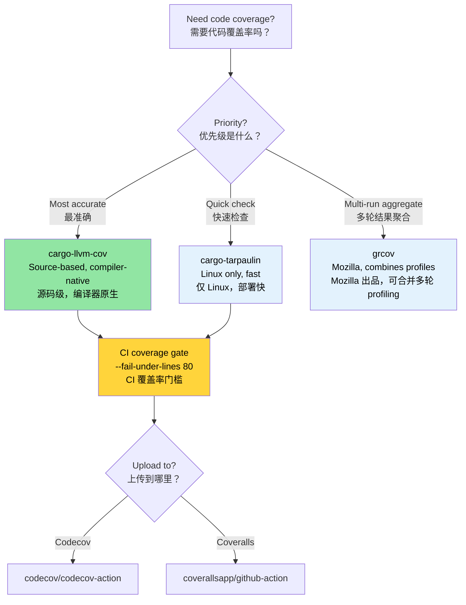

# Code Coverage — Seeing What Tests Miss 🟢<br><span class="zh-inline">代码覆盖率：看见测试遗漏的部分 🟢</span>

> **What you'll learn:**<br><span class="zh-inline">**本章将学到什么：**</span>
> - Source-based coverage with `cargo-llvm-cov` (the most accurate Rust coverage tool)<br><span class="zh-inline">如何使用源码级覆盖率工具 `cargo-llvm-cov`，这是 Rust 里最准确的覆盖率方案</span>
> - Quick coverage checks with `cargo-tarpaulin` and Mozilla's `grcov`<br><span class="zh-inline">如何用 `cargo-tarpaulin` 与 Mozilla 的 `grcov` 做快速覆盖率检查</span>
> - Setting up coverage gates in CI with Codecov and Coveralls<br><span class="zh-inline">如何在 CI 里结合 Codecov 和 Coveralls 建立覆盖率门槛</span>
> - A coverage-guided testing strategy that prioritizes high-risk blind spots<br><span class="zh-inline">如何基于覆盖率制定测试策略，优先填补高风险盲区</span>
>
> **Cross-references:** [Miri and Sanitizers](ch05-miri-valgrind-and-sanitizers-verifying-u.md) — coverage finds untested code, Miri finds UB in tested code · [Benchmarking](ch03-benchmarking-measuring-what-matters.md) — coverage shows *what's tested*, benchmarks show *what's fast* · [CI/CD Pipeline](ch11-putting-it-all-together-a-production-cic.md) — coverage gate in the pipeline<br><span class="zh-inline">**交叉阅读：** [Miri 与 Sanitizer](ch05-miri-valgrind-and-sanitizers-verifying-u.md) 用来发现“已经被测试覆盖到的代码”里有没有未定义行为；覆盖率负责找出“根本没测到的代码”。[基准测试](ch03-benchmarking-measuring-what-matters.md) 回答的是“哪里快”，覆盖率回答的是“哪里测到了”。[CI/CD 流水线](ch11-putting-it-all-together-a-production-cic.md) 则会把覆盖率门槛接进流水线。</span>

Code coverage measures which lines, branches, or functions your tests actually execute. It doesn't prove correctness (a covered line can still have bugs), but it reliably reveals **blind spots** — code paths that no test exercises at all.<br><span class="zh-inline">代码覆盖率衡量的是：测试真实执行到了哪些代码行、哪些分支、哪些函数。它并不能证明程序正确，因为一行被执行过的代码照样可能有 bug；但它能非常稳定地揭露 **盲区**，也就是那些完全没有任何测试碰到的代码路径。</span>

With 1,006 tests across many crates, the project has substantial test investment. Coverage analysis answers: "Is that investment reaching the code that matters?"<br><span class="zh-inline">当前工程分布在多个 crate 上，已经有 1,006 个测试，投入其实不小。覆盖率分析要回答的问题就是：这些测试投入，到底有没有覆盖到真正重要的代码。</span>

### Source-Based Coverage with `llvm-cov`<br><span class="zh-inline">使用 `llvm-cov` 做源码级覆盖率分析</span>

Rust uses LLVM, which provides source-based coverage instrumentation — the most accurate coverage method available. The recommended tool is [`cargo-llvm-cov`](https://github.com/taiki-e/cargo-llvm-cov):<br><span class="zh-inline">Rust 基于 LLVM，而 LLVM 自带源码级覆盖率插桩能力，这是当前最准确的覆盖率手段。推荐工具是 [`cargo-llvm-cov`](https://github.com/taiki-e/cargo-llvm-cov)。</span>

```bash
# Install
cargo install cargo-llvm-cov

# Or via rustup component (for the raw llvm tools)
rustup component add llvm-tools-preview
```

**Basic usage:**<br><span class="zh-inline">**基础用法：**</span>

```bash
# Run tests and show per-file coverage summary
cargo llvm-cov

# Generate HTML report (browseable, line-by-line highlighting)
cargo llvm-cov --html
# Output: target/llvm-cov/html/index.html

# Generate LCOV format (for CI integrations)
cargo llvm-cov --lcov --output-path lcov.info

# Workspace-wide coverage (all crates)
cargo llvm-cov --workspace

# Include only specific packages
cargo llvm-cov --package accel_diag --package topology_lib

# Coverage including doc tests
cargo llvm-cov --doctests
```

**Reading the HTML report:**<br><span class="zh-inline">**怎么看 HTML 报告：**</span>

```text
target/llvm-cov/html/index.html
├── Filename          │ Function │ Line   │ Branch │ Region
├─ accel_diag/src/lib.rs │  78.5%  │ 82.3% │ 61.2% │  74.1%
├─ sel_mgr/src/parse.rs│  95.2%  │ 96.8% │ 88.0% │  93.5%
├─ topology_lib/src/.. │  91.0%  │ 93.4% │ 79.5% │  89.2%
└─ ...

Green = covered    Red = not covered    Yellow = partially covered (branch)
```

Green = covered    Red = not covered    Yellow = partially covered (branch)<br><span class="zh-inline">绿色表示已覆盖，红色表示未覆盖，黄色表示部分覆盖，通常意味着分支只走到了其中一部分。</span>

**Coverage types explained:**<br><span class="zh-inline">**几种覆盖率指标分别代表什么：**</span>

| Type<br><span class="zh-inline">类型</span> | What It Measures<br><span class="zh-inline">衡量内容</span> | Significance<br><span class="zh-inline">意义</span> |
|------|------------------|-------------|
| **Line coverage**<br><span class="zh-inline">行覆盖率</span> | Which source lines were executed<br><span class="zh-inline">哪些源码行被执行过</span> | Basic "was this code reached?"<br><span class="zh-inline">最基础的“这段代码有没有被跑到”</span> |
| **Branch coverage**<br><span class="zh-inline">分支覆盖率</span> | Which `if`/`match` arms were taken<br><span class="zh-inline">哪些 `if` 或 `match` 分支被走到</span> | Catches untested conditions<br><span class="zh-inline">更容易发现条件分支漏测</span> |
| **Function coverage**<br><span class="zh-inline">函数覆盖率</span> | Which functions were called<br><span class="zh-inline">哪些函数被调用过</span> | Finds dead code<br><span class="zh-inline">适合发现死代码</span> |
| **Region coverage**<br><span class="zh-inline">区域覆盖率</span> | Which code regions (sub-expressions) were hit<br><span class="zh-inline">哪些更细粒度代码区域被命中</span> | Most granular<br><span class="zh-inline">颗粒度最细</span> |

### cargo-tarpaulin — The Quick Path<br><span class="zh-inline">cargo-tarpaulin：快速上手路线</span>

[`cargo-tarpaulin`](https://github.com/xd009642/tarpaulin) is a Linux-specific coverage tool that's simpler to set up (no LLVM components needed):<br><span class="zh-inline">[`cargo-tarpaulin`](https://github.com/xd009642/tarpaulin) 是一个仅支持 Linux 的覆盖率工具，搭起来更省事，因为不需要额外折腾 LLVM 组件。</span>

```bash
# Install
cargo install cargo-tarpaulin

# Basic coverage report
cargo tarpaulin

# HTML output
cargo tarpaulin --out Html

# With specific options
cargo tarpaulin \
    --workspace \
    --timeout 120 \
    --out Xml Html \
    --output-dir coverage/ \
    --exclude-files "*/tests/*" "*/benches/*" \
    --ignore-panics

# Skip certain crates
cargo tarpaulin --workspace --exclude diag_tool  # exclude the binary crate
```

**tarpaulin vs llvm-cov comparison:**<br><span class="zh-inline">**`tarpaulin` 和 `llvm-cov` 的对比：**</span>

| Feature<br><span class="zh-inline">特性</span> | cargo-llvm-cov | cargo-tarpaulin |
|---------|----------------|-----------------|
| Accuracy<br><span class="zh-inline">准确性</span> | Source-based (most accurate)<br><span class="zh-inline">源码级，最准确</span> | Ptrace-based (occasional overcounting)<br><span class="zh-inline">基于 ptrace，偶尔会高估</span> |
| Platform<br><span class="zh-inline">平台</span> | Any (llvm-based)<br><span class="zh-inline">跨平台，只要 LLVM 可用</span> | Linux only<br><span class="zh-inline">仅 Linux</span> |
| Branch coverage<br><span class="zh-inline">分支覆盖率</span> | Yes<br><span class="zh-inline">支持</span> | Limited<br><span class="zh-inline">支持有限</span> |
| Doc tests<br><span class="zh-inline">文档测试</span> | Yes<br><span class="zh-inline">支持</span> | No<br><span class="zh-inline">不支持</span> |
| Setup<br><span class="zh-inline">准备成本</span> | Needs `llvm-tools-preview`<br><span class="zh-inline">需要 `llvm-tools-preview`</span> | Self-contained<br><span class="zh-inline">自身更完整</span> |
| Speed<br><span class="zh-inline">速度</span> | Faster (compile-time instrumentation)<br><span class="zh-inline">更快，编译期插桩</span> | Slower (ptrace overhead)<br><span class="zh-inline">更慢，ptrace 有额外开销</span> |
| Stability<br><span class="zh-inline">稳定性</span> | Very stable<br><span class="zh-inline">很稳定</span> | Occasional false positives<br><span class="zh-inline">偶尔会有误报</span> |

**Recommendation**: Use `cargo-llvm-cov` for accuracy. Use `cargo-tarpaulin` when you need a quick check without installing LLVM tools.<br><span class="zh-inline">**建议做法** 很简单：重视准确性时用 `cargo-llvm-cov`；只想快速看一眼、又懒得装 LLVM 工具时，再考虑 `cargo-tarpaulin`。</span>

### grcov — Mozilla's Coverage Tool<br><span class="zh-inline">grcov：Mozilla 的覆盖率聚合工具</span>

[`grcov`](https://github.com/mozilla/grcov) is Mozilla's coverage aggregator. It consumes raw LLVM profiling data and produces reports in multiple formats:<br><span class="zh-inline">[`grcov`](https://github.com/mozilla/grcov) 是 Mozilla 出的覆盖率聚合工具。它吃的是原始 LLVM profiling 数据，然后吐出多种格式的覆盖率报告。</span>

```bash
# Install
cargo install grcov

# Step 1: Build with coverage instrumentation
export RUSTFLAGS="-Cinstrument-coverage"
export LLVM_PROFILE_FILE="target/coverage/%p-%m.profraw"
cargo build --tests

# Step 2: Run tests (generates .profraw files)
cargo test

# Step 3: Aggregate with grcov
grcov target/coverage/ \
    --binary-path target/debug/ \
    --source-dir . \
    --output-types html,lcov \
    --output-path target/coverage/report \
    --branch \
    --ignore-not-existing \
    --ignore "*/tests/*" \
    --ignore "*/.cargo/*"

# Step 4: View report
open target/coverage/report/html/index.html
```

**When to use grcov**: It's most useful when you need to **merge coverage from multiple test runs** (e.g., unit tests + integration tests + fuzz tests) into a single report.<br><span class="zh-inline">**什么时候该用 `grcov`**：当覆盖率需要从多轮测试里合并时，它就很值钱。例如单元测试、集成测试、fuzz 测试各跑一遍，然后合成一份总报告。</span>

### Coverage in CI: Codecov and Coveralls<br><span class="zh-inline">CI 里的覆盖率：Codecov 与 Coveralls</span>

Upload coverage data to a tracking service for historical trends and PR annotations:<br><span class="zh-inline">把覆盖率数据上传到托管服务以后，就能查看历史趋势，也能在 PR 上挂注释。</span>

```yaml
# .github/workflows/coverage.yml
name: Code Coverage

on: [push, pull_request]

jobs:
  coverage:
    runs-on: ubuntu-latest
    steps:
      - uses: actions/checkout@v4
      - uses: dtolnay/rust-toolchain@stable
        with:
          components: llvm-tools-preview

      - name: Install cargo-llvm-cov
        uses: taiki-e/install-action@cargo-llvm-cov

      - name: Generate coverage
        run: cargo llvm-cov --workspace --lcov --output-path lcov.info

      - name: Upload to Codecov
        uses: codecov/codecov-action@v4
        with:
          files: lcov.info
          token: ${{ secrets.CODECOV_TOKEN }}
          fail_ci_if_error: true

      # Optional: enforce minimum coverage
      - name: Check coverage threshold
        run: |
          cargo llvm-cov --workspace --fail-under-lines 80
          # Fails the build if line coverage drops below 80%
```

**Coverage gates** — enforce minimums per crate by reading the JSON output:<br><span class="zh-inline">**覆盖率门槛** 还可以更细，借助 JSON 输出按 crate 单独卡最低值。</span>

```bash
# Get per-crate coverage as JSON
cargo llvm-cov --workspace --json | jq '.data[0].totals.lines.percent'

# Fail if below threshold
cargo llvm-cov --workspace --fail-under-lines 80
cargo llvm-cov --workspace --fail-under-functions 70
cargo llvm-cov --workspace --fail-under-regions 60
```

### Coverage-Guided Testing Strategy<br><span class="zh-inline">基于覆盖率的测试策略</span>

Coverage numbers alone are meaningless without a strategy. Here's how to use coverage data effectively:<br><span class="zh-inline">只有数字没有策略，覆盖率就只是个热闹。真正有用的是知道怎么拿这些数据指导测试。</span>

**Step 1: Triage by risk**<br><span class="zh-inline">**第一步：按风险分层处理。**</span>

| Risk pattern<br><span class="zh-inline">风险组合</span> | Action<br><span class="zh-inline">处理建议</span> |
|---|---|
| High coverage, high risk<br><span class="zh-inline">高覆盖，高风险</span> | ✅ Good — maintain it<br><span class="zh-inline">状态不错，继续维持。</span> |
| High coverage, low risk<br><span class="zh-inline">高覆盖，低风险</span> | 🔄 Possibly over-tested — skip if slow<br><span class="zh-inline">可能已经测过头了，如果测试很慢，可以暂时停一停。</span> |
| Low coverage, high risk<br><span class="zh-inline">低覆盖，高风险</span> | 🔴 Write tests NOW — this is where bugs hide<br><span class="zh-inline">优先补测试，bug 最喜欢藏在这里。</span> |
| Low coverage, low risk<br><span class="zh-inline">低覆盖，低风险</span> | 🟡 Track but don't panic<br><span class="zh-inline">持续记录，先别慌。</span> |

**Step 2: Focus on branch coverage, not line coverage**<br><span class="zh-inline">**第二步：别只盯着行覆盖率，更要盯分支覆盖率。**</span>

```rust
// 100% line coverage, 50% branch coverage — still risky!
pub fn classify_temperature(temp_c: i32) -> ThermalState {
    if temp_c > 105 {       // ← tested with temp=110 → Critical
        ThermalState::Critical
    } else if temp_c > 85 { // ← tested with temp=90 → Warning
        ThermalState::Warning
    } else if temp_c < -10 { // ← NEVER TESTED → sensor error case missed
        ThermalState::SensorError
    } else {
        ThermalState::Normal  // ← tested with temp=25 → Normal
    }
}
```

This example is a classic trap: line coverage may reach 100%, but the `temp_c < -10` branch is never tested, so the sensor-error path quietly slips through.<br><span class="zh-inline">这就是一个很典型的坑：行覆盖率看着像 100%，但 `temp_c < -10` 这个分支根本没人测，传感器异常场景就这样漏掉了。只盯着行覆盖率，很容易被表面数字骗过去；分支覆盖率更容易把这种问题拽出来。</span>

**Step 3: Exclude noise**<br><span class="zh-inline">**第三步：把噪音剔出去。**</span>

```bash
# Exclude test code from coverage (it's always "covered")
cargo llvm-cov --workspace --ignore-filename-regex 'tests?\.rs$|benches/'

# Exclude generated code
cargo llvm-cov --workspace --ignore-filename-regex 'target/'
```

In code, mark untestable sections:<br><span class="zh-inline">在代码层面，也可以把那些天然难测的区域单独标记出来：</span>

```rust
// Coverage tools recognize this pattern
#[cfg(not(tarpaulin_include))]  // tarpaulin
fn unreachable_hardware_path() {
    // This path requires actual GPU hardware to trigger
}

// For llvm-cov, use a more targeted approach:
// Simply accept that some paths need integration/hardware tests,
// not unit tests. Track them in a coverage exceptions list.
```

### Complementary Testing Tools<br><span class="zh-inline">互补的测试工具</span>

**`proptest` — Property-Based Testing** finds edge cases that hand-written tests miss:<br><span class="zh-inline">**`proptest`：属性测试**，专门擅长挖出手写样例测试漏掉的边界情况。</span>

```toml
[dev-dependencies]
proptest = "1"
```

```rust
use proptest::prelude::*;

proptest! {
    #[test]
    fn parse_never_panics(input in "\\PC*") {
        // proptest generates thousands of random strings
        // If parse_gpu_csv panics on any input, the test fails
        // and proptest minimizes the failing case for you.
        let _ = parse_gpu_csv(&input);
    }

    #[test]
    fn temperature_roundtrip(raw in 0u16..4096) {
        let temp = Temperature::from_raw(raw);
        let md = temp.millidegrees_c();
        // Property: millidegrees should always be derivable from raw
        assert_eq!(md, (raw as i32) * 625 / 10);
    }
}
```

**`insta` — Snapshot Testing** for large structured outputs (JSON, text reports):<br><span class="zh-inline">**`insta`：快照测试**，很适合校验大段结构化输出，例如 JSON 或文本报告。</span>

```toml
[dev-dependencies]
insta = { version = "1", features = ["json"] }
```

```rust
#[test]
fn test_der_report_format() {
    let report = generate_der_report(&test_results);
    // First run: creates a snapshot file. Subsequent runs: compares against it.
    // Run `cargo insta review` to accept changes interactively.
    insta::assert_json_snapshot!(report);
}
```

> **When to add proptest/insta**: If your unit tests are all "happy path" examples, proptest will find the edge cases you missed. If you're testing large output formats (JSON reports, DER records), insta snapshots are faster to write and maintain than hand-written assertions.<br><span class="zh-inline">**什么时候该加 `proptest` 和 `insta`**：如果单元测试几乎全是“顺利路径”的例子，那就该让 `proptest` 出手，去抠那些容易被忽略的边界条件。如果测的是大型输出格式，例如 JSON 报告、DER 记录，`insta` 往往比手写一堆断言省力得多。</span>

### Application: 1,000+ Tests Coverage Map<br><span class="zh-inline">应用场景：1000+ 测试的覆盖率地图</span>

The project has 1,000+ tests but no coverage tracking. Adding it reveals the testing investment distribution. Uncovered paths are prime candidates for [Miri and sanitizer](ch05-miri-valgrind-and-sanitizers-verifying-u.md) verification:<br><span class="zh-inline">当前工程测试数量已经过千，但还没有覆盖率跟踪。把覆盖率补上之后，测试投入究竟落在哪些模块、哪些路径，一下就能看清。那些仍旧没覆盖到的路径，就是继续交给 [Miri 与 Sanitizer](ch05-miri-valgrind-and-sanitizers-verifying-u.md) 深挖的重点对象。</span>

**Recommended coverage configuration:**<br><span class="zh-inline">**建议的覆盖率配置：**</span>

```bash
# Quick workspace coverage (proposed CI command)
cargo llvm-cov --workspace \
    --ignore-filename-regex 'tests?\.rs$' \
    --fail-under-lines 75 \
    --html

# Per-crate coverage for targeted improvement
for crate in accel_diag event_log topology_lib network_diag compute_diag fan_diag; do
    echo "=== $crate ==="
    cargo llvm-cov --package "$crate" --json 2>/dev/null | \
        jq -r '.data[0].totals | "Lines: \(.lines.percent | round)%  Branches: \(.branches.percent | round)%"'
done
```

**Expected high-coverage crates** (based on test density):<br><span class="zh-inline">**预期覆盖率较高的 crate**，从测试密度看大概会是这些：</span>

- `topology_lib` — 922-line golden-file test suite<br><span class="zh-inline">`topology_lib`：有一套长达 922 行的 golden file 测试。</span>
- `event_log` — registry with `create_test_record()` helpers<br><span class="zh-inline">`event_log`：带有 `create_test_record()` 这类测试辅助构造器。</span>
- `cable_diag` — `make_test_event()` / `make_test_context()` patterns<br><span class="zh-inline">`cable_diag`：已经形成了 `make_test_event()`、`make_test_context()` 这种测试模式。</span>

**Expected coverage gaps** (based on code inspection):<br><span class="zh-inline">**预期覆盖率缺口**，根据代码阅读大概率会落在这些位置：</span>

- Error handling arms in IPMI communication paths<br><span class="zh-inline">IPMI 通信路径里的错误处理分支。</span>
- GPU hardware-specific branches (require actual GPU)<br><span class="zh-inline">依赖真实 GPU 硬件才能触发的分支。</span>
- `dmesg` parsing edge cases (platform-dependent output)<br><span class="zh-inline">`dmesg` 解析里的边界情况，尤其是平台相关输出差异。</span>

> **The 80/20 rule of coverage**: Getting from 0% to 80% coverage is straightforward. Getting from 80% to 95% requires increasingly contrived test scenarios. Getting from 95% to 100% requires `#[cfg(not(...))]` exclusions and is rarely worth the effort. Target **80% line coverage and 70% branch coverage** as a practical floor.<br><span class="zh-inline">**覆盖率的 80/20 规律** 很真实：从 0% 做到 80% 通常比较顺手；从 80% 抬到 95% 就开始要拼各种拧巴场景；再从 95% 折腾到 100%，常常要靠 `#[cfg(not(...))]` 这种排除技巧硬抠，投入产出比就很难看了。一个更务实的目标，是把 **行覆盖率做到 80%，分支覆盖率做到 70%**。</span>

### Troubleshooting Coverage<br><span class="zh-inline">覆盖率排障</span>

| Symptom<br><span class="zh-inline">现象</span> | Cause<br><span class="zh-inline">原因</span> | Fix<br><span class="zh-inline">处理方式</span> |
|---------|-------|-----|
| `llvm-cov` shows 0% for all files<br><span class="zh-inline">`llvm-cov` 所有文件都显示 0%</span> | Instrumentation not applied<br><span class="zh-inline">没有真正插桩</span> | Ensure you run `cargo llvm-cov`, not `cargo test` + `llvm-cov` separately<br><span class="zh-inline">确认执行的是 `cargo llvm-cov`，别拆成 `cargo test` 加单独的 `llvm-cov`。</span> |
| Coverage counts `unreachable!()` as uncovered<br><span class="zh-inline">`unreachable!()` 被算成未覆盖</span> | Those branches exist in compiled code<br><span class="zh-inline">这些分支在编译产物里确实存在</span> | Use `#[cfg(not(tarpaulin_include))]` or add to exclusion regex<br><span class="zh-inline">用 `#[cfg(not(tarpaulin_include))]` 或者在排除规则里单独处理。</span> |
| Test binary crashes under coverage<br><span class="zh-inline">测试二进制在覆盖率模式下崩溃</span> | Instrumentation + sanitizer conflict<br><span class="zh-inline">插桩和 sanitizer 发生冲突</span> | Don't combine `cargo llvm-cov` with `-Zsanitizer=address`; run them separately<br><span class="zh-inline">别把 `cargo llvm-cov` 和 `-Zsanitizer=address` 混在同一次运行里。</span> |
| Coverage differs between `llvm-cov` and `tarpaulin`<br><span class="zh-inline">`llvm-cov` 和 `tarpaulin` 结果差异很大</span> | Different instrumentation techniques<br><span class="zh-inline">插桩机制不同</span> | Use `llvm-cov` as source of truth (compiler-native); file issues for large discrepancies<br><span class="zh-inline">优先以编译器原生的 `llvm-cov` 为准，差异太大时再单独排查。</span> |
| `error: profraw file is malformed`<br><span class="zh-inline">出现 `error: profraw file is malformed`</span> | Test binary crashed mid-execution<br><span class="zh-inline">测试进程中途异常退出</span> | Fix the test failure first; profraw files are corrupt when the process exits abnormally<br><span class="zh-inline">先修测试崩溃，因为进程异常退出时 `.profraw` 很容易损坏。</span> |
| Branch coverage seems impossibly low<br><span class="zh-inline">分支覆盖率低得离谱</span> | Optimizer creates branches for match arms, unwrap, etc.<br><span class="zh-inline">优化器会为 `match` 分支、`unwrap` 等生成额外分支</span> | Focus on *line* coverage for practical thresholds; branch coverage is inherently lower<br><span class="zh-inline">门槛设置上优先看行覆盖率，分支覆盖率天然就会更低。</span> |

### Try It Yourself<br><span class="zh-inline">动手试一试</span>

1. **Measure coverage on your project**: Run `cargo llvm-cov --workspace --html` and open the report. Find the three files with the lowest coverage. Are they untested, or inherently hard to test (hardware-dependent code)?<br><span class="zh-inline">**先量一遍覆盖率**：执行 `cargo llvm-cov --workspace --html`，打开报告，找出覆盖率最低的三个文件。它们究竟是完全没测，还是天然难测，例如依赖硬件。</span>

2. **Set a coverage gate**: Add `cargo llvm-cov --workspace --fail-under-lines 60` to your CI. Intentionally comment out a test and verify CI fails. Then raise the threshold to your project's actual coverage level minus 2%.<br><span class="zh-inline">**再加一个覆盖率门槛**：把 `cargo llvm-cov --workspace --fail-under-lines 60` 放进 CI，故意注释掉一个测试，确认 CI 会失败。随后把阈值提高到“当前实际覆盖率减 2%”附近。</span>

3. **Branch vs. line coverage**: Write a function with a 3-arm `match` and test only 2 arms. Compare line coverage (may show 66%) vs. branch coverage (may show 50%). Which metric is more useful for your project?<br><span class="zh-inline">**最后对比分支覆盖率和行覆盖率**：写一个有 3 个分支的 `match`，只测试其中 2 个分支，比较行覆盖率和分支覆盖率。看一看对当前项目来说，哪个指标更有参考价值。</span>

### Coverage Tool Selection<br><span class="zh-inline">覆盖率工具选择</span>



### 🏋️ Exercises<br><span class="zh-inline">🏋️ 练习</span>

#### 🟢 Exercise 1: First Coverage Report<br><span class="zh-inline">🟢 练习 1：第一份覆盖率报告</span>

Install `cargo-llvm-cov`, run it on any Rust project, and open the HTML report. Find the three files with the lowest line coverage.<br><span class="zh-inline">安装 `cargo-llvm-cov`，对任意 Rust 项目跑一遍，再打开 HTML 报告，找出行覆盖率最低的三个文件。</span>

<details>
<summary>Solution <span class="zh-inline">参考答案</span></summary>

```bash
cargo install cargo-llvm-cov
cargo llvm-cov --workspace --html --open
# The report sorts files by coverage — lowest at the bottom
# Look for files under 50% — those are your blind spots
```
</details>

#### 🟡 Exercise 2: CI Coverage Gate<br><span class="zh-inline">🟡 练习 2：CI 覆盖率门槛</span>

Add a coverage gate to a GitHub Actions workflow that fails if line coverage drops below 60%. Verify it works by commenting out a test.<br><span class="zh-inline">在 GitHub Actions 工作流里加入覆盖率门槛，只要行覆盖率跌破 60% 就让任务失败。可以通过临时注释掉一个测试来验证这件事。</span>

<details>
<summary>Solution <span class="zh-inline">参考答案</span></summary>

```yaml
# .github/workflows/coverage.yml
name: Coverage
on: [push, pull_request]
jobs:
  coverage:
    runs-on: ubuntu-latest
    steps:
      - uses: actions/checkout@v4
      - uses: dtolnay/rust-toolchain@stable
        with:
          components: llvm-tools-preview
      - run: cargo install cargo-llvm-cov
      - run: cargo llvm-cov --workspace --fail-under-lines 60
```

Comment out a test, push, and watch the workflow fail.<br><span class="zh-inline">注释掉一个测试，推送一次，就能看到工作流如预期失败。</span>
</details>

### Key Takeaways<br><span class="zh-inline">本章要点</span>

- `cargo-llvm-cov` is the most accurate coverage tool for Rust — it uses the compiler's own instrumentation<br><span class="zh-inline">`cargo-llvm-cov` 是当前最准确的 Rust 覆盖率工具，因为它使用的是编译器原生插桩。</span>
- Coverage doesn't prove correctness, but **zero coverage proves zero testing** — use it to find blind spots<br><span class="zh-inline">覆盖率证明不了正确性，但 **零覆盖率就等于零测试**，这已经足够说明问题了。</span>
- Set a coverage gate in CI (e.g., `--fail-under-lines 80`) to prevent regressions<br><span class="zh-inline">把覆盖率门槛放进 CI，可以防止测试质量一轮轮往下掉。</span>
- Don't chase 100% coverage — focus on high-risk code paths (error handling, unsafe, parsing)<br><span class="zh-inline">别死抠 100%，重点盯高风险路径，例如错误处理、`unsafe`、解析逻辑。</span>
- Never combine coverage instrumentation with sanitizers in the same run<br><span class="zh-inline">覆盖率插桩和 sanitizer 不要放在同一轮执行里，一起上很容易互相掐架。</span>

---
